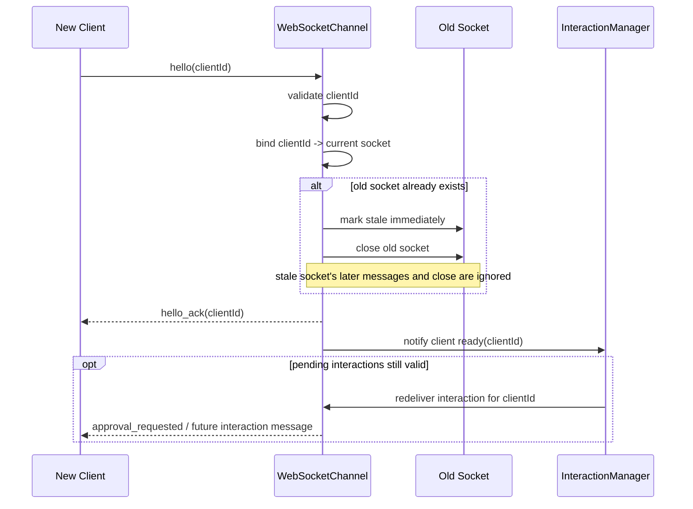
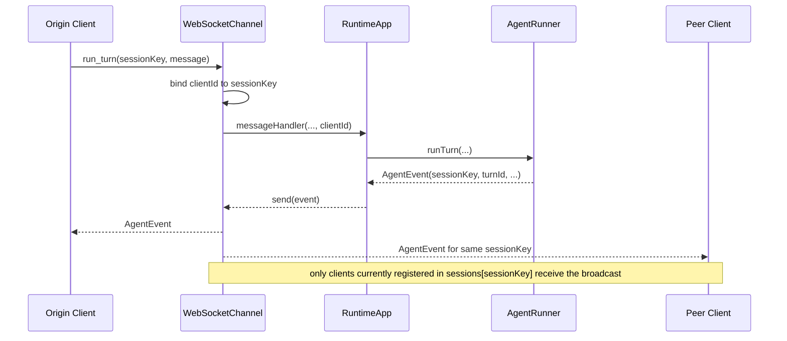
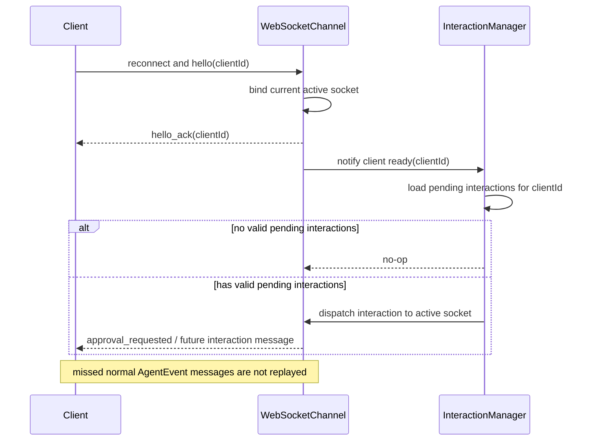

# WebSocket Channel 设计文档

> 状态：设计中，待确认
> 范围：Phase 1 中 WebSocketChannel 的传输层细化设计
> 参考：总览设计见 [adapters-channel-design.md](./adapters-channel-design.md)

---

## 1. 目标与边界

本文档细化 [adapters-channel-design.md](./adapters-channel-design.md) 中 `WebSocketChannel` 一节，回答以下实现问题：

- WebSocket server 的生命周期如何与 `RuntimeApp` 对齐
- 连接、session、approval 三种路由状态如何维护
- WS 协议的消息格式、错误语义、广播语义如何落地
- 断线、超时、重复提交、非法消息等边界条件如何处理

本文档**不重复**定义 Channel 抽象、TurnInteractionManager 设计、`turnId` / `sessionKey` / `originClientId` 的整体数据流；这些内容仍以 [adapters-channel-design.md](./adapters-channel-design.md) 为准。

### 定位

`WebSocketChannel` 是 my-agent 当前面对外部客户端的统一协议入口。

在 Phase 1 内，它承担两层角色：

- 作为 `RuntimeApp` 的一个 channel 实现，对内接入统一的 `Channel` 抽象
- 作为当前唯一的远程调用通道，对外暴露固定的 websocket 消息协议

这意味着不同类型的外部客户端不需要各自定义一套私有协议，而是统一接入同一套 `run_turn` / `approval_resolve` / `AgentEvent` / `approval_*` 消息模型。客户端差异留在各自的接入层，服务端只维护一套稳定协议。

### 非目标

- 不引入鉴权、租户隔离、权限模型
- 不支持跨 RuntimeApp 的 session 路由
- 不在 Phase 1 内支持断线期间的全量事件补发
- 不在 Phase 1 内支持客户端幂等重试键

---

## 2. 组件职责

`WebSocketChannel` 是 `Channel` 接口的一个 transport adapter，实现以下职责：

- 接受 WebSocket client 连接
- 接受 `hello(clientId)` 握手并绑定逻辑客户端身份
- 接收 `run_turn` / `approval_resolve` 两类入站消息
- 将 `AgentEvent` 广播给对应 `sessionKey` 的连接集合
- 将 approval 请求定向发送给 `originClientId`
- 在连接断开时清理 `clientId` 与 `sessionKey` 路由状态

`WebSocketChannel` 不负责：

- 决定某个 tool 是否允许执行
- 维护 session 消息历史
- 解析 Agent 内部事件语义
- 在 channel 之间转发 approval

换句话说，`WebSocketChannel` 只负责“把正确的 JSON 发给正确的连接”。

---

## 3. 生命周期设计

### 3.1 start / stop 语义

```typescript
class WebSocketChannel implements Channel {
  start(): Promise<void>;
  stop(): Promise<void>;
}
```

`start()` 的职责：

- 创建 HTTP server（如未注入现成 server）
- 绑定 `upgrade` 或直接创建 `WebSocketServer`
- 开始监听 `host:port`
- 注册 connection / message / close / error 事件

`stop()` 的职责：

- 停止接收新连接
- 主动关闭所有现有 websocket 连接
- 清空内部 `clients` / `sessions` / `clientSessions`
- 关闭底层 server，保证多次调用幂等

### 3.2 启动失败语义

`start()` 若端口占用、path 绑定失败、server 创建失败，应直接 reject，让 `RuntimeApp.startChannels()` 失败。

原因：

- WebSocketChannel 是显式注册的 channel，不应静默降级
- 启动失败通常是配置问题，应尽快暴露给调用方

### 3.3 停机时的交互收口

`stop()` 不直接调用 `TurnInteractionManager.resolve()`。

关闭流程保持和总设计一致：

1. `RuntimeApp.stopChannels()` 先关闭 channel
2. `RuntimeApp.close()` 再调用 `turnInteractionManager.close()`
3. 所有 pending interaction 统一由上层 manager 收口；当前 approval 仍按 timeout-deny 处理

这样可以避免 transport 层和审批决策层双重收口。

---

## 4. 内部状态模型

### 4.1 身份模型

`WebSocketChannel` 中的 `clientId` 采用“客户端生成、服务端接受”的模型：

- `clientId` 由客户端首次生成并持久化，推荐使用 UUID 一类足够稳定的随机标识
- 客户端在建连早期携带该 `clientId`，供 `WebSocketChannel` 识别
- 该 `clientId` 直接作为 my-agent 内部使用的逻辑客户端标识
- 同一个 `clientId` 跨连接保持不变，便于新连接继续代表同一个逻辑客户端

这里的 `clientId` 首先是客户端身份标识，其次才用于跨连接恢复该身份。也就是说：

- 它表示“这个客户端是谁”
- 它也表示“新的 websocket 连接是否应继承之前这个客户端的状态”

Phase 1 默认假设 websocket 运行在可信环境中，因此 `clientId` 作为逻辑身份标识使用，但**不额外承担安全认证语义**。服务端接受客户端对 `clientId` 的自声明，并据此建立当前活跃连接绑定。当前源码尚未在握手成功后自动通知上层做交互重投递；若未来接入该钩子，仍应由上层决定是否需要再次下发交互。

为避免一个逻辑客户端同时绑定多条活跃连接，Phase 1 采用**后连覆盖前连**策略：当同一 `clientId` 的新连接完成绑定时，旧连接若仍存在，服务端应立即主动关闭旧连接。从新连接接管成功的那一刻起，旧连接即视为失效连接，不再参与任何业务收发或状态清理。

### 4.2 核心字段

```typescript
type ClientId = string;
type SessionKey = string;

private server?: WebSocketServer;
private messageHandler?: (req: ChannelRunRequest) => Promise<void>;
private approvalDecisionHandler?: (id: string, decision: ApprovalDecision) => void;

/** 逻辑 clientId -> 当前活跃 websocket 连接 */
private readonly clients = new Map<ClientId, WebSocket>();

/** sessionKey -> clientId 集合，用于事件广播 */
private readonly sessions = new Map<SessionKey, Set<ClientId>>();

/** 逻辑 clientId -> sessionKey 集合，用于断线清理 */
private readonly clientSessions = new Map<ClientId, Set<SessionKey>>();

private started = false;
private stopped = false;
```

说明：当前 websocket 已绑定的 `clientId` 可直接存放在 socket 关联上下文中，例如 `WeakMap<WebSocket, ClientId>` 或等价实现。它只用于处理当前连接的 message / close 事件，不再额外引入独立的 `connectionId` 概念。

### 4.3 为什么需要 `clientSessions`

仅维护 `sessions: Map<sessionKey, Set<clientId>>` 不足以在断线时高效清理。若没有反向索引，连接断开时只能全表扫描所有 session。

增加 `clientSessions: Map<clientId, Set<sessionKey>>` 后：

- 收到 `run_turn` 时同时写入正向和反向表
- 连接断开时可 O(客户端关联 session 数) 清理
- 清理后若某个 session 集合为空，顺手删除该 session key

这是一个纯 transport 层优化，不改变上层语义。

### 4.4 状态不变量

- `clients.has(clientId)` 为真时，该 clientId 对应一个活跃 websocket
- `sessions.get(sessionKey)` 中的每个 clientId 必须也存在于 `clients`
- `clientSessions.get(clientId)` 中的每个 sessionKey 必须也存在于 `sessions`
- 断线清理完成后，不应残留孤儿 clientId 或空 session 集合

---

## 5. 协议设计

### 5.1 基本原则

- 所有消息都是单个 JSON object
- `type` 使用 snake_case
- 协议偏向最小集合，不引入 envelope 套壳
- 广播事件尽量直接复用 `AgentEvent` 形状
- transport 错误使用单独的 `channel_error` 消息，而不是伪造 `AgentEvent.error`

最后一条很重要：`AgentEvent.error` 表示 agent run 内部失败；非法 JSON、未知消息类型、缺字段等属于协议层错误，不应混进 agent 事件流。

### 5.2 Client -> Server

```typescript
type ClientMessage =
  | {
      type: 'hello';
      clientId: string;
    }
  | {
      type: 'run_turn';
      sessionKey: string;
      message: string;
      model?: string;
      maxTokens?: number;
      maxToolRounds?: number;
    }
  | {
      type: 'approval_resolve';
      id: string;
      decision: 'allow' | 'deny';
    };
```

字段约束：

- `hello.clientId` 必须是非空字符串
- `sessionKey` 必须是非空字符串
- `message` 必须是非空字符串
- `model` 若存在必须是字符串
- `maxTokens` / `maxToolRounds` 若存在必须是正整数
- `approval_resolve.id` 必须是非空字符串
- `approval_resolve.decision` 仅允许 `'allow' | 'deny'`

### 5.2.1 `hello` schema

| 字段 | 类型 | 必填 | 说明 |
|------|------|------|------|
| `type` | `'hello'` | 是 | 固定字面量，用于绑定逻辑客户端身份 |
| `clientId` | `string` | 是 | 客户端首次生成并持久化的逻辑客户端标识 |

约束：

- `clientId.trim().length > 0`
- Phase 1 不规定 `clientId` 的具体格式，但推荐客户端使用 UUID
- 同一逻辑客户端重连时必须复用相同 `clientId`

示例：

```json
{ "type": "hello", "clientId": "1a8c7038-8d1f-4b50-92b5-3c66579db467" }
```

### 5.2.2 `run_turn` schema

| 字段 | 类型 | 必填 | 说明 |
|------|------|------|------|
| `type` | `'run_turn'` | 是 | 固定字面量 |
| `sessionKey` | `string` | 是 | 目标会话标识 |
| `message` | `string` | 是 | 本次用户输入 |
| `model` | `string` | 否 | 覆盖默认模型 |
| `maxTokens` | `number` | 否 | 覆盖默认最大输出 token |
| `maxToolRounds` | `number` | 否 | 覆盖默认最大工具轮次 |

约束：

- `sessionKey.trim().length > 0`
- `message.trim().length > 0`
- `maxTokens`、`maxToolRounds` 若存在则必须为正整数
- `run_turn` 必须发生在 `hello` 之后

示例：

```json
{
  "type": "run_turn",
  "sessionKey": "main",
  "message": "Summarize the latest build errors",
  "model": "claude-sonnet-4",
  "maxTokens": 2048,
  "maxToolRounds": 6
}
```

### 5.2.3 `approval_resolve` schema

| 字段 | 类型 | 必填 | 说明 |
|------|------|------|------|
| `type` | `'approval_resolve'` | 是 | 固定字面量 |
| `id` | `string` | 是 | 待处理审批请求 id |
| `decision` | `'allow' \| 'deny'` | 是 | 用户决策 |

约束：

- `id.trim().length > 0`
- `approval_resolve` 必须发生在 `hello` 之后
- 重复提交允许出现，但只以第一次成功 resolve 为准

示例：

```json
{ "type": "approval_resolve", "id": "apr_123", "decision": "allow" }
```

### 5.3 Server -> Client

```typescript
type ServerMessage =
  | {
      type: 'hello_ack';
      clientId: string;
    }
  | AgentEvent
  | {
      type: 'approval_requested';
      id: string;
      toolName: string;
      input: Record<string, unknown>;
      timeoutMs?: number;
    }
  | {
      type: 'approval_expired';
      id: string;
    }
  | {
      type: 'channel_error';
      code: 'INVALID_JSON' | 'INVALID_MESSAGE' | 'UNSUPPORTED_MESSAGE' | 'SERVER_NOT_READY';
      message: string;
    };
```

说明：

- `hello_ack` 用于确认当前连接已绑定某个逻辑 `clientId`
- `AgentEvent` 出站时保留 `sessionKey` 与 `turnId` 字段，方便 client 自己关联 turn
- `approval_requested` 不广播，只定向到起源 client
- `channel_error` 是协议层错误反馈，不代表 run 已开始

### 5.3.1 `hello_ack` schema

| 字段 | 类型 | 必填 | 说明 |
|------|------|------|------|
| `type` | `'hello_ack'` | 是 | 固定字面量 |
| `clientId` | `string` | 是 | 当前连接绑定的逻辑客户端标识 |

语义：

- `hello_ack` 只表示当前连接已经完成逻辑身份绑定
- 它不表示服务端在 transport 层做了任何状态保留，也不表示是否存在待重投递的上层交互

示例：

```json
{ "type": "hello_ack", "clientId": "1a8c7038-8d1f-4b50-92b5-3c66579db467" }
```

### 5.3.2 AgentEvent 出站约束

`WebSocketChannel` 不为 `AgentEvent` 增加额外 envelope，而是直接转发结构化事件对象。对客户端而言，最重要的稳定字段是：

| 字段 | 来源 | 说明 |
|------|------|------|
| `type` | `AgentEvent.type` | 事件种类 |
| `sessionKey` | `AgentEvent.sessionKey` | 路由上下文 |
| `turnId` | `AgentEvent.turnId` | 本次 turn 的稳定标识 |

这意味着客户端无需依赖 websocket 连接状态去推断事件归属，只需要按 `sessionKey` 和 `turnId` 关联即可。

### 5.3.3 `approval_requested` schema

| 字段 | 类型 | 必填 | 说明 |
|------|------|------|------|
| `type` | `'approval_requested'` | 是 | 固定字面量 |
| `id` | `string` | 是 | 审批请求 id |
| `toolName` | `string` | 是 | 触发审批的工具名 |
| `input` | `Record<string, unknown>` | 是 | 工具输入 |
| `timeoutMs` | `number` | 否 | 剩余可交互时间窗口 |

该消息只发送给 `originClientId` 对应的逻辑客户端当前活跃连接。

### 5.3.4 `approval_expired` schema

| 字段 | 类型 | 必填 | 说明 |
|------|------|------|------|
| `type` | `'approval_expired'` | 是 | 固定字面量 |
| `id` | `string` | 是 | 已过期的审批请求 id |

客户端收到后应关闭对应审批 UI，不再允许继续提交决策。

### 5.3.5 `channel_error` schema

| 字段 | 类型 | 必填 | 说明 |
|------|------|------|------|
| `type` | `'channel_error'` | 是 | 固定字面量 |
| `code` | error code | 是 | 机器可判定的错误类型 |
| `message` | `string` | 是 | 便于日志与调试的错误文本 |

错误码说明：

| `code` | 含义 | 客户端建议行为 |
|------|------|------|
| `INVALID_JSON` | 原始消息无法解析为 JSON | 记录错误并修复序列化逻辑 |
| `INVALID_MESSAGE` | JSON 结构不满足协议 | 修复字段 shape |
| `UNSUPPORTED_MESSAGE` | 消息类型或功能未启用 | 停止发送该类消息 |
| `SERVER_NOT_READY` | 握手未完成或服务端 handler 尚未绑定 | 先完成 `hello` 或等待服务端就绪 |

### 5.4 错误处理策略

| 场景 | 行为 |
|------|------|
| 非法 JSON | 回复 `channel_error(INVALID_JSON)`，连接不断开 |
| JSON 不是 object | 回复 `channel_error(INVALID_MESSAGE)` |
| 未知 `type` | 回复 `channel_error(UNSUPPORTED_MESSAGE)` |
| 未先发送 `hello` 就发送其他业务消息 | 回复 `channel_error(SERVER_NOT_READY)` |
| `hello.clientId` 缺失或为空 | 回复 `channel_error(INVALID_MESSAGE)` |
| `run_turn` 缺少必要字段 | 回复 `channel_error(INVALID_MESSAGE)` |
| `approval_resolve` 字段非法 | 回复 `channel_error(INVALID_MESSAGE)` |
| handler 未注册就收到消息 | 回复 `channel_error(SERVER_NOT_READY)` |

Phase 1 默认采取“报错但不断开”的宽松策略，便于客户端联调。

---

## 6. 入站流程

### 6.1 `hello`

`hello` 是连接建立后的第一条业务协议消息，用于把当前 websocket 连接绑定到某个逻辑 `clientId`。

处理步骤：

1. 解析 JSON
2. 校验 `clientId` 为非空字符串
3. 将当前连接绑定为该 `clientId` 的唯一活跃连接，并在该 socket 的关联上下文中记录已绑定 `clientId`
4. 若该 `clientId` 已绑定旧连接，则立即主动关闭旧连接
5. 回复 `hello_ack { clientId }`
6. 若未来上层接入按 `clientId` 管理的未决交互重投递钩子，则可触发一次针对该 `clientId` 的重新下发

这里的 future 重投递不意味着 `WebSocketChannel` 自己维护了 pending approval 或 pending decision。权威状态仍在上层 manager；即使后续实现该能力，`WebSocketChannel` 也最多只是在 `hello(clientId)` 成功后提供一个“该 client 已重新就绪”的传输层触发点。

这里的关键规则是：旧连接的物理关闭可以稍后完成，但其逻辑失效发生在新连接接管成功的瞬间。旧连接之后若继续发送 `run_turn` 或 `approval_resolve`，应视为无效消息；旧连接晚到的 `close` 事件也不得再触发当前活跃状态的清理。

#### 图 1：`hello(clientId)` 接管与旧连接失效



### 6.1.1 `hello` 状态前置条件

- 一个连接在收到第一条非 `hello` 消息前，状态都视为 `connected_unbound`
- `hello` 成功后，连接才进入 `ready`
- 同一连接重复发送 `hello` 的策略应保持简单：
  - 若 `clientId` 相同，可视为幂等并返回一次新的 `hello_ack`
  - 若 `clientId` 不同，建议回复 `channel_error(INVALID_MESSAGE)`，避免一个连接在同一生命周期内切换逻辑身份

### 6.2 `run_turn`

处理步骤：

1. 解析 JSON
2. 校验消息 shape
3. 确认当前连接已完成 `hello`
4. 从连接上下文取 `clientId`
5. 将 `clientId` 加入 `sessions[sessionKey]`
6. 将 `sessionKey` 加入 `clientSessions[clientId]`
7. 调用 `messageHandler({ sessionKey, message, model, maxTokens, maxToolRounds, clientId })`

这里不在 WebSocketChannel 内生成 `turnId`。`turnId` 仍由 `RuntimeApp.makeMessageHandler()` 统一生成。

### 6.2.1 `run_turn` 与 session 订阅关系

`run_turn` 有两个副作用：

- 发起一次 turn
- 隐式声明“当前客户端应加入这个 `sessionKey` 的后续 AgentEvent 广播受众”

因此同一个 `clientId` 可以通过多次 `run_turn` 加入多个 session 的广播集合；这些集合描述的是该逻辑客户端当前应接收哪些 session 的 AgentEvent，而不是某一条 websocket 连接的历史。

这些广播关系只服务于当前活跃连接的事件投递与断线清理，不构成 transport 层恢复机制，也不等于“自动共享 conversation history / 聊天视图”。连接关闭后，`WebSocketChannel` 会立即清理对应的 session 路由；客户端若重连后仍要继续参与某个 session，需要继续以该 `sessionKey` 发起后续请求。

#### 图 2：`run_turn` 到 session 广播的最小路径



### 6.3 `approval_resolve`

处理步骤：

1. 解析并校验消息
2. 确认当前连接已完成 `hello`
3. 若当前 channel 未开启 approval，回复 `channel_error(UNSUPPORTED_MESSAGE)`
4. 优先调用 `interactionResponseHandler({...})`；若未启用 interaction 适配器，再兼容调用 `approvalDecisionHandler(id, decision)`

重复提交无需在 transport 层去重。`TurnInteractionManager.resolve()` 对未知或已过期 id 是幂等静默忽略的。

### 6.3.1 `approval_resolve` 与客户端身份

Phase 1 不要求 `approval_resolve` 再显式携带 `clientId`。原因是：

- 当前连接在 `hello` 阶段已绑定逻辑客户端身份
- 实际可否 resolve 某个审批 id 的最终判断交给上层 `TurnInteractionManager`
- transport 层只需保证消息来自一个已经绑定身份的连接

### 6.4 连接加入 session 的时机

客户端不是在“连接建立时”自动绑定 session，而是在首次发送某个 `run_turn` 时加入对应 session 的 AgentEvent 广播受众。

原因：

- 一个 websocket 连接可能先连上，稍后才决定要使用哪个 session
- 同一个连接允许在多个 session 上发起 turn，广播时可同时订阅多个 session
- 避免引入额外的 `subscribe` / `join_session` 协议复杂度

这意味着 Phase 1 的 websocket 行为更像“通过发消息隐式加入 session 事件广播”，而不是“加入 session 就自动同步完整会话视图”。

---

## 7. 出站流程

### 7.1 AgentEvent 广播

`send(event: AgentEvent)` 的处理规则：

1. 读取 `event.sessionKey`
2. 查 `sessions.get(event.sessionKey)`
3. 若集合为空，静默返回
4. 将 event JSON 序列化并逐个发送给集合中的 websocket
5. 若单个 websocket 发送失败，记录日志并继续其他连接

不变量：单个 client 的发送失败不应影响其他 client 收到事件。

### 7.2 广播消息范围

Phase 1 广播以下事件：

- `text_delta`
- `tool_use`
- `tool_result`
- `run_end`
- `error`
- 以及保留 `sessionKey` / `turnId` 的其他 AgentEvent

客户端可以自己选择忽略 `run_start`、`llm_call`、`tool_result_pruned`、`compaction_*` 等事件。

### 7.3 approval 定向发送

当 `RuntimeApp` 调用下列任一路径时：

- `channel.interaction.sendInteractionRequest(request)` / `sendInteractionExpired(request)`
- `channel.approval.sendApprovalRequest(request)` / `sendApprovalExpired(request)`

`WebSocketChannel` 的处理规则：

1. 读取 `request.originClientId`
2. 若为空，静默忽略
3. 查 `clients.get(originClientId)`
4. 若连接不存在或已关闭，静默忽略
5. 发送对应 JSON

之所以静默忽略，而不是反向触发 deny：

- transport 层不负责决策
- 上层已有 TurnInteractionManager timeout 收口
- 断线是正常网络条件，不是协议错误

---

## 8. 连接管理与断线语义

### 8.1 建连

每个 websocket 连接建立后：

- 暂不绑定逻辑 `clientId`
- 等待客户端发送 `hello(clientId)`
- 当前连接的已绑定 `clientId` 通过 socket 关联上下文维护，不额外引入独立 `connectionId`

`clientId` 由客户端自行生成并持久化；服务端不在建连阶段分配新的 `clientId`。

### 8.1.1 连接状态机

```text
connected_unbound
  ├─(hello ok)──────────────▶ ready
  ├─(invalid hello)─────────▶ connected_unbound
  ├─(socket close)──────────▶ closed
ready
  ├─(run_turn / approval_resolve)▶ ready
  └─(socket close)───────────────▶ closed
```

解释：

- `connected_unbound`：socket 已建立，但尚未绑定逻辑客户端身份
- `ready`：连接已完成 `hello`，可收发业务消息
- `closed`：当前 websocket 连接生命周期结束；是否存在重连，由逻辑客户端状态机决定


### 8.2 断线

连接关闭时：

1. 先从当前 websocket 的关联上下文中取出其绑定的 `clientId`
2. 若该连接已经不是该 `clientId` 的当前活跃连接，则将本次 close 视为陈旧事件并直接忽略
3. 若该连接仍是当前活跃连接，则删除当前连接与 `clientId` 的绑定
4. 从 `clientSessions[clientId]` 记录的每个 `sessionKey` 中删除该 clientId
5. 若某个 `sessions[sessionKey]` 集合为空，则删除该 session key
6. 删除 `clientSessions[clientId]`
7. 清理该 socket 的关联上下文

#### 图 3：断线后的 transport 清理

```mermaid
flowchart TD
  A[socket close] --> B{socket context has clientId?}
  B -- no --> Z[clear socket context and return]
  B -- yes --> C[read bound clientId]
  C --> D{socket == clients[clientId]?}
  D -- no --> Y[treat as stale close and ignore]
  D -- yes --> E[delete clients[clientId]]
  E --> F[read clientSessions[clientId]]
  F --> G[remove clientId from each sessions[sessionKey]]
  G --> H[delete empty session sets]
  H --> I[delete clientSessions[clientId]]
  I --> J[clear socket context]
  J --> K[disconnect cleanup done]
```

### 8.2.1 逻辑客户端状态机

```text
new
  ├─(hello clientId)────────▶ active
active
  ├─(same clientId new hello)▶ active
  └─(socket close)──────────▶ inactive
inactive
  └─(future hello same id)──▶ active
```

解释：

- `active`：逻辑客户端当前有一个活跃连接
- `inactive`：当前没有活跃连接；此前的 transport 路由状态已经被清理

这里没有独立的 grace 状态。后续同一 `clientId` 再次 `hello`，表示同一逻辑客户端建立了新连接，而不是恢复旧连接的 transport 状态。

### 8.3 重连后的行为

若客户端稍后使用同一个 `clientId` 重新发送 `hello`：

1. 服务端将该逻辑客户端重新绑定到新连接
2. 旧连接若仍存在，则会被立即主动关闭
3. 该客户端后续可继续使用原有 `sessionKey` 发起新请求
4. 若未来上层接入 pending interactions 重投递钩子，可在 `hello` 成功后向新连接再次投递

Phase 1 当前源码只保证：

- 重新绑定逻辑客户端身份
- 建立新的当前活跃连接

Phase 1 当前**尚未实现**：

- future：`hello(clientId)` 后自动通知上层重投递 pending interactions
- 基于该钩子的自动交互补发

Phase 1 **不保证**：

- 自动恢复此前的 session 订阅集合
- 补发断线期间遗漏的 `text_delta`
- 基于消息序号的完整事件回放

### 8.3.1 `pending interactions` 的分层边界

`pending approval` 只是 `pending interactions` 的一个特例；未来若存在 `pending decision` 等其它需要客户端交互的状态，也应复用同一分层思路。

职责划分如下：

- `WebSocketChannel` 负责维护 `clientId -> active WebSocket`、`sessionKey -> clientId[]`，以及废弃 websocket 的清理
- 上层 manager 负责维护 pending interactions 的权威状态、过期时间与是否仍需投递的判断
- 若未来接入该能力，`hello(clientId)` 成功后，`WebSocketChannel` 最多只负责触发“该 client 已重新就绪”，由上层决定是否向当前活跃连接再次下发交互消息

因此 `WebSocketChannel` 不维护额外的业务交互子状态，也不决定某个交互是否应该继续存在。

#### 图 4：`hello(clientId)` 后的 pending interactions 重投递（未来预留）



### 8.4 断线时正在运行的 turn

若 client 在 turn 运行中断线：

- 普通 AgentEvent 仍会继续生成，但断线窗口内该 client 可能漏收部分事件
- 同 session 的其他在线 client 仍可继续收到广播
- 该 client 重新连接后，不会自动收到此前遗漏的普通事件
- 若未来上层接入重投递钩子，仍未过期的 pending interactions 可在 `hello(clientId)` 成功后再次投递到新连接

这符合当前总设计里的“起源 channel 不可达时走 timeout 收口”。

### 8.4.1 当前 approval 与未来交互的一致口径

Phase 1 当前已经落到协议里的仍是 `approval_requested` / `approval_resolve` / `approval_expired`。但在职责分层上，应把它们视为更一般的 `pending interactions`：

- approval 只是第一类落地的交互消息
- 未来新增 `pending decision` 等交互时，不应再把状态机塞回 `WebSocketChannel`
- transport 层只负责把当前仍应投递的交互消息发到该 `clientId` 的当前活跃连接

### 8.4.2 关键时序规则

规则 1：握手优先

- 任意业务消息都必须发生在 `hello` 之后
- 未握手的连接永远不进入业务状态

规则 2：单活覆盖

- 同一 `clientId` 同时只允许一个“当前活跃连接”
- 新连接成功 `hello` 后，旧连接必须被服务端主动关闭
- 在旧连接真正关闭之前，它也已经是失效连接，不得继续收发任何业务消息
- 旧连接晚到的 `close` 事件不得影响当前活跃连接状态

规则 3：重连不等于 transport 恢复

- 重连只重新建立逻辑客户端身份与当前活跃连接绑定
- 不自动恢复此前的 session 订阅集合
- 不承诺补发断线窗口内遗漏的增量事件

规则 4：pending interactions 以上层有效期为准

- 只要某个 pending interaction 尚未过期且上层仍认为需要投递，`hello(clientId)` 后就可以重新下发到新连接
- 一旦该交互已过期或已解决，即使客户端随后重连，也不再重新投递

---

## 9. 配置设计

```typescript
export interface WebSocketChannelConfig {
  port: number;
  host?: string;       // 默认 '127.0.0.1'
  path?: string;       // 默认 '/ws'
  maxClients?: number; // 默认不限
  approval?: boolean;  // 默认 false
}
```

### 默认值

- `host`: `'127.0.0.1'`
- `path`: `'/ws'`
- `maxClients`: `undefined`
- `approval`: `false`

### `path` 的语义

若实现选型使用 `ws`：

- 只接受匹配 `path` 的 websocket upgrade
- 非匹配 path 的请求应拒绝升级

这样可以为后续 HTTP healthcheck、静态页面或其他 transport 预留同端口扩展空间。

### `maxClients` 的语义

超限时建议：

- 直接拒绝新连接，close code 使用通用 server error 或 policy violation
- 不挤掉现有连接

Phase 1 不做更复杂的背压、排队、优先级策略。

---

## 10. 可观测性

建议记录以下日志：

- server start / stop
- client connected / disconnected
- run_turn received
- approval_resolve received
- approval_requested / approval_expired dispatched
- invalid JSON / invalid message / unsupported type
- send failure / socket closed before send

建议字段：

- `channelId`
- `clientId`
- `sessionKey`
- `turnId`
- `messageType`
- `remoteAddress`

这些日志只用于诊断 transport 行为，不替代 runtime / runner 的业务日志。

---

## 11. 测试计划

### 11.1 单元测试

- `start()` 在未注册 handler 时是否允许启动
- 合法 `run_turn` 是否调用 `messageHandler`
- 合法 `hello` 是否绑定 `clientId` 并返回 `hello_ack`
- 合法 `approval_resolve` 是否调用 `approvalDecisionHandler`
- 非法 JSON 是否返回 `channel_error`
- 未知 type 是否返回 `channel_error`
- 未先 `hello` 就发送业务消息是否返回 `channel_error`
- `send(event)` 是否只广播到目标 session 的 client
- `sendApprovalRequest` 是否只定向到 `originClientId`
- 断线是否清理 `clients` / `sessions` / `clientSessions`
- 同一 `clientId` 重连是否主动关闭旧连接
- 旧连接在被接管后继续发送业务消息时是否被拒绝或忽略
- 旧连接晚到的 `close` 是否不会误清理当前活跃状态
- 未来若实现重投递钩子：`hello(clientId)` 成功后是否会触发上层 pending interactions 重投递

### 11.2 集成测试

- RuntimeApp + WebSocketChannel：从 websocket client 发 `run_turn`，收到 `text_delta` / `run_end`
- 多 client 同 session：都收到同一 turn 的事件流
- 多 client 不同 session：不会串流
- approval 开启时：只有起源 client 收到 `approval_requested`
- 起源 client 断线后重连并再次 `hello(clientId)` 时：当前实现不自动重投递；若后续补该钩子，应验证未过期 interaction 可重新投递
- 起源 client 长时间不重连时：approval 最终 timeout deny

### 11.3 联调 smoke case

最小联调脚本应覆盖：

1. 启动 `RuntimeApp + WebSocketChannel`
2. 两个 client 连接同一个 session
3. 其中一个 client 发起 `run_turn`
4. 两个 client 收到广播
5. 发起一次需要 approval 的 tool call
6. 仅 origin client 收到 approval 请求并提交决策

---

## 12. 实现前 checklist

- 增加 `ws` 依赖，并在 `src/adapters/channel/index.ts` 导出 `WebSocketChannel`
- 先落 `WebSocketChannelConfig`、`start()`、`stop()` 和内部路由表骨架
- 实现 `hello`、`run_turn`、`approval_resolve` 三类入站消息解析与字段校验
- 实现 `hello_ack`、`channel_error`、`approval_requested`、`approval_expired` 出站消息
- 实现 `clientId -> WebSocket`、`sessionKey -> Set<clientId>`、`clientId -> Set<sessionKey>` 三张表
- 落实“后连覆盖前连”和 stale close 忽略规则
- 在 `send(event)` 中补齐 `AgentEvent` 的 websocket 序列化，尤其是 `error` 事件的字符串化
- 通过最小测试覆盖握手、`run_turn` 转发、approval 定向发送、断线清理

## 13. 实现顺序建议

建议按以下顺序落地：

1. 先实现最小 server 生命周期和 `hello + run_turn`
2. 再补 `send(event)` 广播
3. 然后补 approval 定向发送与 `approval_resolve`
4. 最后补协议错误反馈、日志和边界测试

这样可以尽快得到一个可联调的 websocket transport，而不是一开始就把所有边界复杂度堆满。

---

## 14. 开放问题

当前仍有几个可以推迟到实现时再确认的问题：

1. `hello` 是否需要附带客户端版本、能力协商等扩展字段。
2. `channel_error` 是否需要增加 `requestId` 之类的关联字段。
3. `maxClients` 超限时使用哪个 close code 更合适。
4. 是否允许单 websocket 连接同时订阅多个 session；本文档暂时按“允许”设计。
5. 若要补 `hello(clientId)` 后的上层重投递，接口形状应是什么。
6. 是否要在 Phase 1 就支持 `run_turn.maxFollowUpRounds` 等额外参数透传。

这些问题都不影响当前 WebSocketChannel 的最小落地。