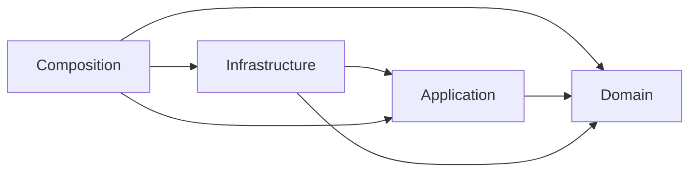

# Architecture Principles

## 1. 文档状态

- **状态：** Accepted
- **版本：** 1.1
- **日期：** 2026-09-03
- **所有者：** 项目所有者
- **关联计划：** [Architecture Foundation Plan](../roadmap/architecture-foundation-plan.md) AF-02
- **规范词汇：** [Domain Glossary](domain-glossary.md)

本文档定义 Target Architecture、ADR、Spec 和 Architecture Slice 必须遵守的稳定约束。原则描述依赖方向、所有权和可验证结果，不预先决定 AF-03 的目录、类或接口形状。

**v1.1 修订：** 项目所有者确认 AP-10 在 Extension Framework 中以 Extension/Module/Adapter instance 为编排单元；Extension 内部对象仍由 Extension 自行管理。

## 2. 适用与变更规则

1. 本文中的 `MUST`、`MUST NOT` 和“必须”表示架构约束，不是建议；
2. Target Architecture 和 Module Spec 必须说明适用原则及验证方式；
3. 临时例外必须由 `Accepted` ADR 记录范围、理由、负责人、到期日和删除条件；
4. 实现证据表明原则不可行时，暂停相关 Slice，先更新 ADR 或本原则，不在生产代码中静默绕过；
5. 原则变更由项目所有者接受，并通过版本和 Git 历史留证。

## 3. 依赖方向

目标架构使用四个逻辑边界；具体目录映射由 AF-03 决定。



```text
Composition ─> Infrastructure ─> Application ─> Domain
      └────────────────────────> Application
      └──────────────────────────────────────> Domain
Infrastructure ──────────────────────────────> Domain

Domain/Application MUST NOT depend on Infrastructure or Composition.
```

箭头表示源码依赖方向，不表示运行时调用一定同向。Application 可以通过自身拥有的 Port 调用 Infrastructure Adapter；Adapter 依赖 Port，而不是 Application 依赖具体 SDK。

## 4. Principles

### AP-01：Stable Core 不依赖具体集成

**原则：** Domain 和 Application 必须独立于 Provider SDK、Channel SDK、具体 Store、CLI/WebSocket Transport 和 Composition Root。

**含义：**

- 核心边界拥有所需 Port 和领域类型；
- Infrastructure Adapter 实现 Port 并映射外部语义；
- 新 Provider、Channel 或 Store 不要求在 Runner、Session 或领域消息中增加具体 SDK 分支；
- 外部 SDK 类型不得成为核心公共契约的一部分。

**验证：** 依赖扫描、公共导出检查、Fake Adapter Contract Tests，以及“增加第二实现不修改核心”的变更测试。

### AP-02：配置输入、事实和策略必须分离

**原则：** Provider Connection、Model Descriptor、Model Policy 和 per-turn Request Override 必须具有不同所有者和合并阶段。

**含义：**

- Connection 描述如何连接，不声明 Model 能力；
- Descriptor 描述 Provider/Model Facts，不包含用户偏好；
- Policy 表达允许、选择和 fallback，不伪装成事实；
- Request Override 只能覆盖明确允许的请求参数；
- 每个最终值必须能追踪来源和优先级。

**验证：** Resolver Unit Tests 覆盖来源优先级、冲突、缺失事实和保守 fallback；类型和 Schema 不复用同一字段表达多种语义。

### AP-03：每个 Turn 只消费一个 Resolved Model

**原则：** Runner 必须消费已解析、不可变的 Resolved Model，不得在执行过程中重新推断 Model Facts 或从全局配置拼装默认值。

**含义：**

- Resolved Model 同时绑定 Provider 身份、用于模型调用的 core-owned Port、Protocol、Endpoint 和 Model Capability facts；
- Model 切换必须原子地切换上述执行事实；
- 一个 Turn 开始后不因 Catalog、Policy 或全局配置变化而改变 Resolved Model；
- Parent Turn 和 Subagent Turn 可以解析为不同 Model，但各自保持内部一致。

**验证：** Resolver/Runner Contract Tests；进行中 Turn 配置变化测试；Parent/Subagent 选择不同 Provider/Model 的 Integration Test。

### AP-04：Builtin 与 External 使用同一扩展机制

**原则：** Runtime Module 和 External Extension 必须通过相同的 Contribution、Registry 和 Lifecycle Contract 提供 Tool、Hook、Channel 或其他扩展能力。

**含义：**

- Builtin 不得依赖中央特例列表绕过 Registry；
- 一个 Extension 可以组合多类 Contribution，并在自身边界内共享私有资源；
- 新 Extension 不要求修改 Runtime、Runner、Bootstrap 或中央类型联合；
- Extension 身份、配置和资源不能被简化为单个 Tool 注册函数。

**验证：** 使用一个同时贡献 Channel、Tool 和 Hook 的外部测试 Extension；Builtin/External Contract Tests 使用同一测试套件。

### AP-05：Registry 只发布版本化不可变 Snapshot

**原则：** Registry 的消费者必须读取不可变 Snapshot；Contribution 变更必须通过受控的 pre-publish 校验/失败清理、原子切换和 post-publish retirement。

**含义：**

- Turn 启动时捕获一个 Registry Snapshot，并在整个执行期间保持不变；
- 新 Turn 只看到完整切换后的新版本；
- 消费者不得持有或修改 Registry 内部可变集合；
- pre-publish 失败不得污染 current Snapshot；candidate 清理失败必须可归属并阻断后续变更；post-publish retirement 失败不得回滚已提交 Snapshot，受 pin 保护的残留必须可观测并由唯一 Owner 持有；
- Slice 3/4 的生产接入只使用启动期只读 Snapshot，Slice 5 完成事务闭环后才开放生产运行时变更。

**验证：** Snapshot immutability tests、旧 Turn/新 Turn 并行测试、失败注入、排空和资源泄漏检查。

### AP-06：一个概念只有一个权威来源

**原则：** 每个领域概念必须只有一个权威类型、一个事实所有者和一个生产运行路径。

**含义：**

- 相同事实不得在 Config、Runtime、Runner 和 Adapter 中分别维护可变副本；
- 派生视图必须从权威来源生成，并明确生命周期；
- 迁移期间的双路径只能通过有期限的 Compatibility 存在；
- 重复类型不能仅靠相同字段名假定语义等价。

**验证：** 类型/导出审计、调用路径 Characterization Tests、Compatibility 清单和 Architecture Fitness Tests。

### AP-07：Compatibility 只能单向进入新核心

**原则：** Compatibility Adapter 只能将 Legacy 输入或公共 API 映射到新权威核心；新代码不得反向依赖 Compat 或 Legacy。

**含义：**

- Compat 只处理参数、默认值和错误映射，不继续拥有业务事实；
- Compat 不从主 Barrel 导出为推荐 API；
- 每个 Compat 必须有负责人、到期日、Feature Flag/发布回滚策略和删除条件；
- Slice 完成时 Legacy 必须净减少，不能用永久双实现换取迁移表面完成。

**验证：** 禁止反向依赖的 Fitness Test、公共导出检查、Slice 删除清单和到期 Compatibility Review。

### AP-08：Extension Capability 必须最小、显式且类型化

**原则：** Extension 只能获得完成已声明职责所需的最小 Extension Capability，不得访问 Runtime 私有状态或通用 Service Locator；Runtime Module 和 Adapter 使用显式依赖或 core-owned Port。

**含义：**

- Extension Capability 由提供边界定义，由 Composition/Policy 显式授予；
- 平台专有 Tool 通过受限消息上下文或对应 Extension Capability 工作；
- Extension 私有资源留在 Extension 边界内，不注册为任意代码可取用的全局服务；
- 缺少所需 Extension Capability 时必须显式拒绝、降级或不注册对应 Contribution。

**验证：** 类型级上下文限制、Extension Capability denial tests、Extension Contract Tests，以及禁止访问 RuntimeApp 私有状态的依赖检查。

### AP-09：公共行为必须由显式契约保护

**原则：** 公共 API、Event、Error、并发、取消和 Lifecycle 行为必须在 Spec 中明确，并由确定性的 Contract Tests 保护。

**含义：**

- “实现碰巧如此”不构成公共契约；
- Event 顺序、Tool Use/Result 配对、Abort、Shutdown 和资源释放必须有明确所有者；
- Contract Test 优先验证可观察行为，不锁定无关内部结构；
- 外部 SDK 行为未知时先执行 Spike，不用 Mock 假设代替证据。

**验证：** Module Spec 验收矩阵、Contract/Integration Tests、真实 Provider 或协议 Spike Results。

### AP-10：资源必须有唯一 Lifecycle Owner

**原则：** 每个长生命周期资源必须有唯一创建和释放责任。Runtime Composition 只按依赖顺序启动、按逆序停止 Extension/Module/Adapter lifecycle unit；每个 unit 自行管理和清理其内部对象。

**含义：**

- Spec 必须说明 lifecycle unit 的作用域、排空策略和幂等停止；Extension 内部对象的共享与清理由 Extension 自己负责；
- 消费者不能因为持有引用就获得关闭资源的权力；
- Extension 停用必须等待无使用者或按已定义策略取消旧工作；
- Shutdown 尽量停止所有可安全停止的已启动 lifecycle unit，但不能隐藏失败或检查其内部对象。

**验证：** Lifecycle Contract Tests、部分启动失败注入、重复 stop、并发 drain/abort 和 lifecycle unit 停止顺序测试。

### AP-11：Runtime 编排执行，Composition 构建系统

**原则：** Runtime 负责队列、Turn、路由、Snapshot 捕获、取消和 Shutdown 编排；Runtime Builder/Composition 负责发现、创建、连接和启动 Module、Extension、Registry 与 Adapter。

**含义：**

- RuntimeApp 不解析 Model Facts，不识别具体 Channel/Provider 类型；
- Runner 不加载配置、发现 Module 或管理进程级资源；
- Composition 可以依赖具体实现，但不得把具体实现泄漏回 Stable Core；
- 不使用通用 DI Container 或 Service Locator 隐藏依赖关系。

**验证：** RuntimeApp/Runner 职责测试、构造依赖检查、增加 Provider/Extension 的变更局部性测试。

### AP-12：抽象必须由当前证据证明

**原则：** 只在抽象消除真实复杂度、支持已确认的第二实现或建立可测试边界时引入抽象。

**含义：**

- Port/Registry 至少有两个实现，或一个真实实现加一个用于独立验证的 Fake；
- Spike 原型不自动成为生产抽象；
- 简单调用链不增加无业务价值的机械转换层；
- 不为 Marketplace、分布式 Event Bus、任意热加载等非目标预建框架。

**验证：** ADR 的 options/consequences、调用流审查、实现数量和变更局部性证据、删除未使用抽象的 review。

### AP-13：架构事实、目标和历史必须可区分

**原则：** Current Architecture、Target Architecture、Spec、Plan、Spike Results 和 Legacy 文档必须通过状态和链接明确区分。

**含义：**

- 目标设计不得写成当前实现事实；
- Current Architecture 必须由代码、测试或运行证据支持；
- 被替代文档必须指向后继，并退出活跃权威入口；
- ADR 和有长期价值的 Results 通过状态保留历史，不因年代较久自动成为 Legacy。

**验证：** 文档索引检查、状态字段检查、失效链接检查和 Legacy 迁移表。

## 5. Fitness Test 候选

AF-04 应优先把以下规则自动化；具体工具由 AF-01 治理决策和 AF-04 实现约束确定。

| ID | 自动化规则 | 对应原则 |
|---|---|---|
| FT-01 | Domain/Application 不导入 Infrastructure 或 Composition | AP-01 |
| FT-02 | Provider/Channel SDK 只出现在对应 Integration Adapter | AP-01 |
| FT-03 | Runner 不依赖全局 Config loader、Provider SDK 或可变 Registry | AP-02、AP-03、AP-05 |
| FT-04 | 新核心不依赖 Compat/Legacy 路径 | AP-06、AP-07 |
| FT-05 | Extension/Module 不访问 RuntimeApp 私有状态或 Service Locator | AP-08、AP-11 |
| FT-06 | 新 Provider 不要求修改 Runner；新 Extension 不要求修改 Runtime/Runner 中央分支 | AP-01、AP-04 |
| FT-07 | Registry 消费者只接收 Snapshot，不接收内部可变集合 | AP-05 |
| FT-08 | 公共 Event、Lifecycle 和 Port 具有对应 Contract Test | AP-09、AP-10 |
| FT-09 | 活跃架构文档具有状态，Legacy 文档不作为新实现依赖 | AP-13 |

Fitness Tests 防止已知退化，不取代行为测试、架构评审或 Spike 证据。

## 6. 设计评审检查表

新的 ADR、Spec 或 Architecture Slice 至少回答：

- [ ] 使用了 [Domain Glossary](domain-glossary.md) 中的规范词汇；
- [ ] 标明涉及的原则和验证证据；
- [ ] 依赖方向没有从 Stable Core 指向具体集成；
- [ ] Facts、Policy、Connection 和 per-turn 输入没有混用；
- [ ] 公共契约、并发、Lifecycle 和 Resource Ownership 已明确；
- [ ] Extension 只获得显式 Extension Capability，未引入 Service Locator；
- [ ] 新旧权威路径、Compatibility、回滚和删除条件已明确；
- [ ] 抽象由真实实现、Fake 或 Spike 证据支持；
- [ ] 文档状态明确区分 Current、Target、Active Work 和 Legacy。
