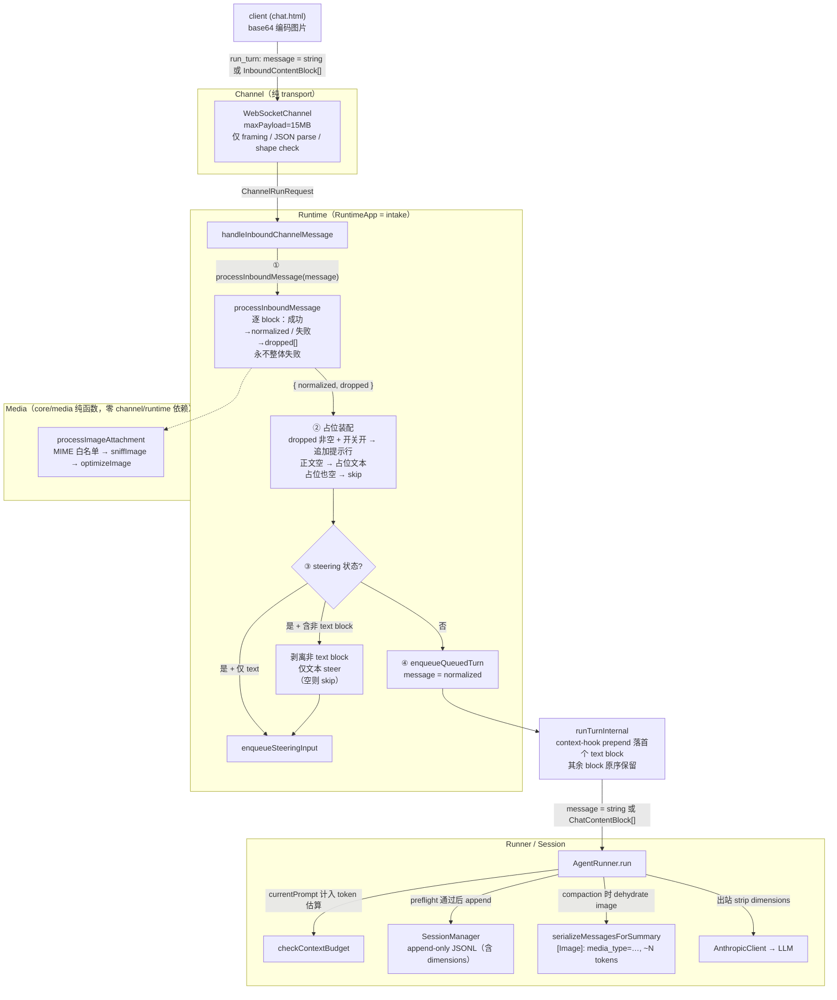

# 用户消息附件支持 — Server 端 Phase 1 实施文档

> 创建日期：2026-06-16
> 范围：[attachments-support-spec.md](./attachments-support-spec.md) 中 Phase 1（image-only）的 **服务端** 改动
> 不含：chat.html 前端（独立 PR）、CliChannel 附件、document/PDF、file source offload（均为 Phase 2）

---

## 0. 阅读前提与「失败即丢弃」基线

设计依据：[attachments-support-spec.md](./attachments-support-spec.md)（决策 8）。落地前必须先认清两条铁律：

1. **校验在 runtime，不在 channel**：channel 只做 transport（framing / JSON parse / shape check）。
2. **附件失败绝不阻断对话**：单个附件处理失败 → 静默丢弃该附件，turn 用剩余内容继续；**不向 client 推送任何拒收事件、不引入 `RUN_REJECTED` / `attachment_resized` / 任何新错误码或事件类型**。这与 openclaw 生产做法一致（`monitor-processing.ts`：附件过大 / 下载失败 `continue`，仅 `logVerbose`）。

```
client → Channel（纯 transport：framing / JSON parse / shape check）
       → Runtime（RuntimeApp.handleInboundChannelMessage = intake：调 media、装配占位、判 steering）
       → Media（core/media 纯函数：MIME / sniff / resize，成功进 normalized、失败进 dropped[]）
       → Runner（AgentRunner）→ Session（append-only JSONL）
```

### 含附件消息数据流（总览）



> 图读法：**所有「失败」都收敛到 `dropped[]`**，不产生任何事件或拒收路径。resize 成功是静默的（无 `attachment_resized`）。占位装配与 steering 剥离都在 turn 启动前、session append 之前完成——天然零写入。`dimensions` 内部全程携带，仅出站前 strip。

三层只有 transport 一层会发错误，**dispatch / in-turn 两层都不因附件改动**：

| 层 | 错误载体 | 触发场景 | 本期是否新增 code |
|---|---|---|---|
| transport | `channel_error`（WebSocket 内部） | JSON 解析失败、未知 type、必填缺失 | ❌ 不新增任何附件相关 code |
| lifecycle / dispatch | `RuntimeEvent.error` | 与附件无关（附件失败走丢弃，不进此层） | ❌ 不动 |
| in-turn | `AgentEvent.error`（`turnId` 必填） | turn 执行中途异常 | ❌ 与附件无关，不动 |

> ⚠️ 为什么不发拒收事件：`RuntimeEvent` 在生产 `server.ts` 根本没被订阅；`AgentEvent` 每个 variant 都强制 `turnId`，而附件处理在 turn 启动前（`turnId` 由 `startQueuedTurn` 出队时才生成）无 `turnId` 可填。把失败做成「丢弃 + 一行文本提示」既不引入新通道，又能让用户从对话流知情，复杂度最低。

### 涉及的现有真实符号（务必按这些签名改，不要臆造）

| 文件 | 现状 | 本期动作 |
|---|---|---|
| [src/adapters/llm/types.ts](../../src/adapters/llm/types.ts) | `ChatContentBlock.image = { type:'image'; source:{type:'base64';media_type:string;data:string} }`（无 `dimensions`） | 加 `dimensions` 必选 |
| [src/core/session/types.ts](../../src/core/session/types.ts) | `ContentBlock.image` 同上 | 同步加 `dimensions` |
| [src/core/runner/types.ts](../../src/core/runner/types.ts) | `RunParams.message: string` | `message` 放宽 |
| [src/core/runner/context/token-estimation.ts](../../src/core/runner/context/token-estimation.ts) | `estimateBlockTokens` image → `IMAGE_TOKEN_ESTIMATE = 2000`；`estimatePromptTokens.currentPrompt?: string` | patch 公式；删常量；`currentPrompt` 放宽 |
| [src/core/runner/context/compaction.ts](../../src/core/runner/context/compaction.ts) | `serializeMessagesForSummary` 无 image 分支 | 加 dehydrate |
| [src/runtime/types.ts](../../src/runtime/types.ts) | `RunTurnParams.message: string`；`RuntimeEvent` / `RuntimeErrorInfo` 现状 | 仅放宽 `message`；**不加任何事件 / 错误字段** |
| [src/runtime/RuntimeApp.ts](../../src/runtime/RuntimeApp.ts) | `handleInboundChannelMessage` 是 intake；`makeMessageHandler` 打日志读 `req.message.length`；`runTurnInternal` 经 `userPromptBuilder.build({text})` 把消息压成 string | 插入 media + 占位装配 + steering 剥离；修日志；处理数组消息线 |
| [src/runtime/queue-types.ts](../../src/runtime/queue-types.ts) | `QueuedChannelTurn.message`、`PendingSteeringInput.message` 为 string | 放宽（仅 queued turn；steering 仍只接文本） |
| [src/adapters/channel/types.ts](../../src/adapters/channel/types.ts) | `ChannelRunRequest.message: string` | 放宽为 `string \| InboundContentBlock[]`；导出 `InboundContentBlock` |
| [src/adapters/channel/WebSocketChannel.ts](../../src/adapters/channel/WebSocketChannel.ts) | `ClientMessage.run_turn.message: string`；`WebSocketServer` 无 `maxPayload` | 放宽 message；`maxPayload: WS_MAX_PAYLOAD_BYTES` |
| [src/core/prompt/UserPromptBuilder.ts](../../src/core/prompt/UserPromptBuilder.ts) | `build({text:string})` → 文本 prepend 后返回 string | 增加数组消息的 prepend 线（详见 PR-6） |
| [src/adapters/llm/AnthropicClient.ts](../../src/adapters/llm/AnthropicClient.ts) | 出站直接映射 block | strip `dimensions` |

---

## 1. PR 切分

| # | PR | 依赖 | 可独立合入 |
|---|---|---|---|
| PR-0 | `src/core/media/constants.ts` + `index.ts` barrel | — | ✅ |
| PR-1 | `image-metadata.ts` sniff 模块 | PR-0 | ✅ |
| PR-2 | `image-optimize.ts`（引入 `sharp`） | PR-0 | ✅ |
| PR-3 | `attachment-pipeline.ts`（`processImageAttachment` + `processInboundMessage`） | PR-1、PR-2 | ✅ |
| PR-4 | 数据模型 + token 估算 + 出站 strip dimensions | PR-0 | ✅ |
| PR-5 | Layer 3 compaction dehydrate | PR-4 | ✅ |
| PR-6 | Runtime intake（media + 占位装配 + steering 剥离）+ channel 协议放宽 + 消息线穿透 | PR-3、PR-4、PR-5 | 必须最后；一合入即开放新能力 |

> **隐式 invariant**：`ImageBlock.dimensions` 必选，但只有 PR-6 的 runtime media 处理跑过后才会写入。PR-4 单独合入后，runner / session 内部从不出现 image block（channel 还没放宽，入站仍是 string），invariant 不被触发；PR-6 合入时 runtime 保证写入。
>
> 不考虑任何向后兼容：`dimensions` 一新增即必填，老 JSONL 若存在缺 `dimensions` 的 image block 直接报错，不留 hydrate 退路。

---

## 2. PR 详细说明

### PR-0：共享常量 + barrel

**新增文件**：`src/core/media/constants.ts`、`src/core/media/index.ts`

```ts
// src/core/media/constants.ts
export const ATTACHMENT_INLINE_THRESHOLD_BYTES = 2 * 1024 * 1024;   // 2 MB：触发 resize 的阈值
export const ATTACHMENT_RAW_MAX_BYTES = 10 * 1024 * 1024;            // 10 MB：单文件解码后上限
export const ATTACHMENT_TOTAL_MAX_BYTES = 10 * 1024 * 1024;          // 10 MB：单条消息总解码上限
export const MAX_ATTACHMENTS_PER_MESSAGE = 20;                       // 数组长度安检（防 Array(1e6)）
export const WS_MAX_PAYLOAD_BYTES = 15 * 1024 * 1024;                // 15 MB：ws maxPayload

export const ATTACHMENT_DROP_NOTICE_DEFAULT = true;                  // 失败提示行默认开（决策 8）

export const SUPPORTED_IMAGE_MIME = [
  'image/png',
  'image/jpeg',
  'image/webp',
  'image/gif',
] as const;
export type SupportedImageMime = (typeof SUPPORTED_IMAGE_MIME)[number];
```

```ts
// src/core/media/index.ts —— barrel
export * from './constants.js';
export { sniffImage, type ImageMetadata, type SniffResult } from './image-metadata.js';
export { optimizeImage, type OptimizeResult } from './image-optimize.js';
export {
  processImageAttachment,
  processInboundMessage,
  type AttachmentResult,
  type ProcessInboundResult,
  type AttachmentDropReason,
  type DroppedAttachment,
} from './attachment-pipeline.js';
```

**明确不放进 constants 的常量**

- `MAX_SIDE_PX = 2000`、`JPEG_QUALITY_STEPS = [85,75,65,55,45]`、`FLATTEN_BACKGROUND = '#ffffff'`：resize 内部决策 → 放 `image-optimize.ts` 模块内部
- `ANTHROPIC_PATCH_SIZE = 28` / OpenAI 32 / multiplier / tile：provider-specific，留在 `compaction` config 或 token-estimation 内部（见 PR-4）

**为什么三个字节上限取最严者**：当前默认 `单文件 = 总额 = 10 MB`，**总额是真正约束**（20 张 2 MB 图 = 40 MB > 10 MB，超出预算的附件以 `total_exceeded` 被丢弃），`MAX_ATTACHMENTS_PER_MESSAGE = 20` 主要是数组长度安检。详见 spec「上限对齐推导」。

**验收**：纯常量文件，不写数值快照测试（改常量是 review 的事）。

---

### PR-1：image-metadata 嗅探

**新增文件**：`src/core/media/image-metadata.ts`、`image-metadata.test.ts`、`__fixtures__/`（≤ 1 KB 的 PNG/JPEG/WebP/GIF 正负样本）

```ts
import type { SupportedImageMime } from './constants.js';

export interface ImageMetadata {
  width: number;
  height: number;
  mediaType: SupportedImageMime;
}

export type SniffResult =
  | { ok: true; metadata: ImageMetadata }
  | { ok: false; reason: 'unreadable' | 'mime_mismatch' | 'unsupported_variant' };

/**
 * 从原始 bytes 解析 MIME + 尺寸。纯 JS、零依赖；只读文件头（通常 < 256 byte）；不解码像素。
 * 不抛异常——一切失败走 discriminated union。
 */
export function sniffImage(bytes: Uint8Array, declaredMime: string): SniffResult;
```

**实现约束（写进单测，避免后人误删）**

- PNG：文件头 `89 50 4E 47 0D 0A 1A 0A`，IHDR chunk 读 w/h
- JPEG：扫 SOF0(`FFC0`)/SOF2(`FFC2`) 取 w/h；忽略 thumbnail
- WebP：VP8 / VP8L / VP8X 三种 chunk；动图取首帧画布尺寸
- GIF：87a / 89a，从 logical screen descriptor 读 w/h
- EXIF orientation 5/6/7/8 → **交换 w/h**（避免横竖判错）
- 不认识的变种 → `{ ok:false, reason:'unsupported_variant' }`
- `declaredMime` 与文件头不符 → `{ ok:false, reason:'mime_mismatch' }`

**端口来源**：openclaw `src/media/image-ops.ts` 的 sniff 部分（**不**端口 sharp / resize 部分）。

| 测试输入 | 期望 |
|---|---|
| 4 种 MIME × 正常文件 | `ok:true`，w/h 正确 |
| PNG 头改成 JPEG magic | `mime_mismatch` |
| 截断到 8 字节 | `unreadable` |
| EXIF orientation=6 的竖向 JPEG | w/h 已交换 |
| GIF89a 动图 | `ok:true`，画布尺寸 |

---

### PR-2：image-optimize（sharp 依赖）

**新增文件**：`src/core/media/image-optimize.ts`、`image-optimize.test.ts`

**`package.json`**

```json
{
  "dependencies": { "sharp": "^0.33.0" },
  "pnpm": { "onlyBuiltDependencies": ["better-sqlite3", "sharp"] }
}
```

```ts
import type { ImageMetadata } from './image-metadata.js';

export type OptimizeResult =
  | {
      ok: true;
      bytes: Uint8Array;        // resize 后的 JPEG
      metadata: ImageMetadata;   // mediaType 一定是 'image/jpeg'
      appliedQuality: number;
      appliedMaxSide: number;
    }
  | { ok: false; reason: 'sharp_failed' | 'cannot_fit_budget'; detail: string };

/**
 * 两步算法（模块内部常量 MAX_SIDE_PX=2000、JPEG_QUALITY_STEPS=[85,75,65,55,45]、FLATTEN_BACKGROUND='#ffffff'）：
 *   Step A: max(w,h) > 2000 → 等比缩到长边 2000；RGBA → 白底 RGB；统一转 JPEG
 *   Step B: quality 顺序 encode，首个 ≤ targetBytes 即返回
 *   全档位仍超 → cannot_fit_budget；sharp 异常 → sharp_failed
 */
export async function optimizeImage(input: Uint8Array, targetBytes: number): Promise<OptimizeResult>;
```

**实现约束**

- `sharp(input).rotate()` 先应用 EXIF orientation 再 strip metadata（下游 sniff 出的 w/h 与像素方向一致）
- **RGBA→JPEG 必须显式 flatten 白底**：JPEG 不支持 alpha，sharp 默认用**黑底**合成，会让透明 PNG 图标变黑底。显式 `.flatten({ background: FLATTEN_BACKGROUND })`（`'#ffffff'`）对齐浏览器默认、与 training 分布的浅底素材一致；无 alpha 的图 `flatten` 是 no-op
- `jpeg({ quality, mozjpeg: true, chromaSubsampling: '4:2:0' })`，不开 progressive
- 只输出 JPEG（决策 4：quality 降级只为 JSONL 体积，与 LLM 信息量无关）

```ts
sharp(input)
  .rotate()                              // 先应用 EXIF orientation
  .flatten({ background: '#ffffff' })    // RGBA → 白底 RGB（无 alpha 图为 no-op）
  .jpeg({ quality, mozjpeg: true, chromaSubsampling: '4:2:0' })
```

| 测试输入 | 期望 |
|---|---|
| 3 MB PNG、2400×1800 | 缩到 2000×1500，q=85 即满足 |
| 8 MB 噪声图 | 降到 q=55 或更低；`appliedQuality` 反映实际档位 |
| 截断的 JPEG | `sharp_failed` |
| 全 5 档仍超的高频噪声 fixture | `cannot_fit_budget` |
| 半透明 PNG（透明区 + 彩色前景） | 输出 JPEG，透明区呈白色（采样左上角像素 ≈ `#ffffff`），非黑色 |

**部署文档**（README 或 docs/deployment 补一段）

> `sharp` 依赖原生 libvips，与 `better-sqlite3` 同档处理：多数环境 `pnpm install` 自动下载预编译二进制；Alpine 需 `apk add --no-cache vips-dev` 后 `pnpm install --build-from-source`。

---

### PR-3：attachment-pipeline（单附件 + 整条消息，纯函数）

**动机**：单附件编排（`processImageAttachment`）与整条消息编排（`processInboundMessage`，含数组长度 / 跨附件总量 / 逐 block 循环）都是 media 层纯函数，对 channel / runtime **零依赖**。核心语义（决策 8）：

- **`processImageAttachment` 失败返回中性 `reason`**（不耦合任何 runtime / channel 类型）。
- **`processInboundMessage` 永不整体失败**：成功的 block 进 `normalized`，失败 / 超限的进 `dropped[]`，调用方据此装配占位提示。

**新增文件**：`src/core/media/attachment-pipeline.ts`、`attachment-pipeline.test.ts`

```ts
import type { ChatContentBlock } from '../../adapters/llm/types.js';
import type { InboundContentBlock } from '../../adapters/channel/types.js';

// 单附件级失败原因（中性词汇）
export type AttachmentDropReason =
  | 'unsupported_mime'
  | 'mime_mismatch'
  | 'metadata_unreadable'
  | 'too_large'          // 单文件解码字节 > ATTACHMENT_RAW_MAX_BYTES
  | 'resize_failed';

// 整条消息级附加的失败原因（在 processInboundMessage 内判定）
export interface DroppedAttachment {
  blockIndex: number;
  reason: AttachmentDropReason | 'limit_exceeded' | 'total_exceeded';
}

export interface AttachmentResizedInfo {
  fromBytes: number;
  toBytes: number;
  finalMaxSide: number;
  finalQuality: number;
}

// 单张图：MIME 白名单 → sniff → 必要时 resize → 构造带 dimensions 的 ImageBlock
export type AttachmentResult =
  | { ok: true; block: ChatContentBlock; resized?: AttachmentResizedInfo }
  | { ok: false; reason: AttachmentDropReason };

export async function processImageAttachment(
  rawBytes: Uint8Array,
  declaredMime: string,
): Promise<AttachmentResult>;

// 整条 message：纯文本直通；数组则长度 + 跨附件总量 + 逐个 processImageAttachment
// **永不返回失败**：失败 / 超限的 block 进 dropped[]，其余进 normalized
export interface ProcessInboundResult {
  normalized: string | ChatContentBlock[];
  dropped: DroppedAttachment[];
}

export async function processInboundMessage(
  message: string | InboundContentBlock[],
): Promise<ProcessInboundResult>;
```

**`processImageAttachment` 实现骨架**

```ts
import {
  SUPPORTED_IMAGE_MIME,
  ATTACHMENT_INLINE_THRESHOLD_BYTES,
} from './constants.js';
import { sniffImage } from './image-metadata.js';
import { optimizeImage } from './image-optimize.js';

export async function processImageAttachment(rawBytes, declaredMime): Promise<AttachmentResult> {
  if (!SUPPORTED_IMAGE_MIME.includes(declaredMime as never)) {
    return { ok: false, reason: 'unsupported_mime' };
  }
  const sniff = sniffImage(rawBytes, declaredMime);
  if (!sniff.ok) {
    return { ok: false, reason: sniff.reason === 'mime_mismatch' ? 'mime_mismatch' : 'metadata_unreadable' };
  }

  let finalBytes = rawBytes;
  let finalMeta = sniff.metadata;
  let resized: AttachmentResizedInfo | undefined;

  if (rawBytes.byteLength > ATTACHMENT_INLINE_THRESHOLD_BYTES) {
    const opt = await optimizeImage(rawBytes, ATTACHMENT_INLINE_THRESHOLD_BYTES);
    if (!opt.ok) return { ok: false, reason: 'resize_failed' };
    finalBytes = opt.bytes;
    finalMeta = opt.metadata;
    resized = {
      fromBytes: rawBytes.byteLength,
      toBytes: opt.bytes.byteLength,
      finalMaxSide: opt.appliedMaxSide,
      finalQuality: opt.appliedQuality,
    };
  }

  return {
    ok: true,
    block: {
      type: 'image',
      source: { type: 'base64', media_type: finalMeta.mediaType, data: Buffer.from(finalBytes).toString('base64') },
      dimensions: { width: finalMeta.width, height: finalMeta.height },
    },
    resized,  // 仅供 verbose 日志；resize 成功是静默的，不发任何事件
  };
}
```

**`processInboundMessage` 实现骨架**

```ts
import {
  MAX_ATTACHMENTS_PER_MESSAGE,
  ATTACHMENT_RAW_MAX_BYTES,
  ATTACHMENT_TOTAL_MAX_BYTES,
} from './constants.js';

export async function processInboundMessage(message): Promise<ProcessInboundResult> {
  if (typeof message === 'string') return { normalized: message, dropped: [] };

  const out: ChatContentBlock[] = [];
  const dropped: DroppedAttachment[] = [];
  let totalBytes = 0;
  let imageCount = 0; // 已放行的 image block 数；limit_exceeded 按「image 数量」而非数组下标判定

  for (let i = 0; i < message.length; i++) {
    const b = message[i];
    if (b.type === 'text') { out.push(b); continue; }

    // 附件数量安检：按已放行的 image 计数，而非数组下标 i —— 否则前置的 text block 会
    // 挤占名额（如 [text×5, img×20] 会在第 16 张图就误判超限）。text 不计数、不受此限。
    if (imageCount >= MAX_ATTACHMENTS_PER_MESSAGE) { dropped.push({ blockIndex: i, reason: 'limit_exceeded' }); continue; }
    imageCount++;

    // 注意：Buffer.from(str, 'base64') 永不抛异常——非法字符被静默丢弃、能解多少解多少。
    // 故不写 try/catch；非法 base64 会在下游 sniffImage 处判成 unreadable → metadata_unreadable。
    const raw = Buffer.from(b.source.data, 'base64');

    if (raw.byteLength > ATTACHMENT_RAW_MAX_BYTES) { dropped.push({ blockIndex: i, reason: 'too_large' }); continue; }
    if (totalBytes + raw.byteLength > ATTACHMENT_TOTAL_MAX_BYTES) {
      dropped.push({ blockIndex: i, reason: 'total_exceeded' });
      continue; // 不累加、不中断；后续更小的 block 仍有机会进 normalized
    }
    totalBytes += raw.byteLength;

    const r = await processImageAttachment(raw, b.source.media_type);
    if (!r.ok) { dropped.push({ blockIndex: i, reason: r.reason }); continue; }
    out.push(r.block);
  }

  return { normalized: out, dropped };
}
```

> **设计要点**：base64 解码、单文件 / 总量字节上限放在 `processInboundMessage`（需要跨 block 累加），MIME / sniff / resize 放在 `processImageAttachment`。两者**都不抛、都不整体失败**——失败统一进 `dropped[]`，runtime intake 阶段据此生成可选的文本提示。未来 HTTP channel 直接复用本函数。
>
> **返回类型不对称**：纯文本 `string` 入→原样 `string` 出；但「数组入」无论是否含 image、哪怕全是 text block，都走 `out: ChatContentBlock[]` 返回 **`ChatContentBlock[]`**（非 `string`）。调用方勿误以为「只有 text 就收到 string」；`assembleInboundMessage` 已按 `normalized: string | ChatContentBlock[]` union 的两个分支（`typeof === 'string'` 与数组）分别处理，无需额外归一。
>
> `MAX_ATTACHMENTS_PER_MESSAGE` 用独立 `imageCount` 逐个丢弃越界的 image 项而非「整条拒收」，与决策 8「失败即丢弃」一致；语义是「image 数量上限」，text block 不计数（其量级由 `maxPayload` 与总额双重兜底），不会因病态 `Array(1e6)` 卡死（越界项只记一条 drop record、不解码）。

| 测试输入 | 期望 |
|---|---|
| 200 KB 正常 PNG（单附件） | `processImageAttachment` → `ok:true`，`resized` undefined，`block.dimensions` 填入 |
| 3 MB PNG（单附件） | `ok:true`，`resized` 填入，`block.source.media_type==='image/jpeg'` |
| MIME `image/bmp` | `unsupported_mime` |
| 声明 PNG 头是 JPEG | `mime_mismatch` |
| 损坏头 / 非法 base64 | `metadata_unreadable`（经下游 `sniffImage` 判 `unreadable`，非 `Buffer.from` 抛错） |
| sharp mock 报错 | `resize_failed` |
| 一条含 1 文本 + 1 坏图 | `normalized` 保留文本；`dropped=[{blockIndex:1,...}]`；**不整体失败** |
| 数组第 21 个起 | 越界项进 `dropped`（`reason:'limit_exceeded'`），前 20 个正常 |
| 单文件 base64 解码 > 10 MB | 该项进 `dropped`（`too_large`），其余照常 |
| 多张 2.5 MB 图累计 > 10 MB | 越界那张进 `dropped`（`total_exceeded`），其余照常 |
| 纯文本 string | `{ normalized:<string>, dropped:[] }` |

**验收**：`pnpm test src/core/media/attachment-pipeline` 跑通，不起 ws server。

---

### PR-4：数据模型 + token 估算 + 出站 strip

三件事一起合（互相牵连类型）。**注意：本期不新增任何事件 / 错误类型**——不改 `RuntimeErrorInfo`、不引入 `RuntimeRunRejectionReason`、不动 `RuntimeEvent` / `AgentEvent` / `channel_error`。

**4.1 `dimensions` 字段**（两处 union 同步改）

```ts
// src/adapters/llm/types.ts —— ChatContentBlock
| { type: 'image'; source: { type: 'base64'; media_type: string; data: string };
    dimensions: { width: number; height: number } }   // ← internal-only，wire 上没有

// src/core/session/types.ts —— ContentBlock：同样加 dimensions
```

> `dimensions` 必选（非可选）：让 type system 强制「sniff 成功才能造 ImageBlock」。wire 层 `InboundContentBlock`（见 PR-6）不含此字段，client 即使传也被 runtime 重新 sniff 覆盖。sniff 失败的附件根本不会成为 ImageBlock（被丢弃），故内部永远不会出现缺 `dimensions` 的 image。

**4.2 token 估算**（[token-estimation.ts](../../src/core/runner/context/token-estimation.ts)）

```ts
export const ANTHROPIC_PATCH_SIZE = 28; // TODO: provider 化时迁到 compaction config；export 供 PR-5 compaction 复用
// 删除 const IMAGE_TOKEN_ESTIMATE = 2000;

function estimateBlockTokens(block: ChatContentBlock): number {
  switch (block.type) {
    case 'text': return estimateTextTokens(block.text);
    case 'image':
      return Math.ceil(block.dimensions.width / ANTHROPIC_PATCH_SIZE)
           * Math.ceil(block.dimensions.height / ANTHROPIC_PATCH_SIZE);
    case 'tool_use':
      try { return estimateTextTokens(block.name) + estimateTextTokens(JSON.stringify(block.input)); }
      catch { return 128; }
    case 'tool_result': return estimateTextTokens(block.content);
    default: return 0;
  }
}

// estimatePromptTokens 的 currentPrompt 放宽：string → string | ChatContentBlock[]
export function estimatePromptTokens(params: {
  messages: ChatMessage[];
  systemPrompt?: string;
  currentPrompt?: string | ChatContentBlock[];   // ← 放宽
}): number {
  // ...既有逻辑...
  // 保持真实的 truthy 判据 if (params.currentPrompt)：空串跳过，非空数组仍 truthy
  if (params.currentPrompt) {
    rawTokens += MESSAGE_OVERHEAD_TOKENS;
    if (typeof params.currentPrompt === 'string') rawTokens += estimateTextTokens(params.currentPrompt);
    else for (const b of params.currentPrompt) rawTokens += estimateBlockTokens(b);
  }
  return Math.ceil(rawTokens * SAFETY_MARGIN);
}
```

> 同步放宽 `context-budget.ts` 里 `currentPrompt` 的字段类型。`AgentRunner.runAttempt` 在 `checkContextBudget` 之后才 append user 消息，因此本次 message 的附件 token 必须经 `currentPrompt` 参数计入（保持既有调用位置，仅类型穿透）。

**4.3 出站 strip dimensions**（[AnthropicClient.ts](../../src/adapters/llm/AnthropicClient.ts)）

```ts
function toAnthropicContentBlock(block: ChatContentBlock): unknown {
  if (block.type === 'image') { const { dimensions, ...rest } = block; return rest; }
  return block;
}
```

| 测试 | 期望 |
|---|---|
| `estimateBlockTokens({image, dimensions:{2000,1500}})` | `ceil(2000/28)×ceil(1500/28)=72×54=3888` |
| `estimateBlockTokens({image, dimensions:{200,200}})` | `8×8=64` |
| `estimatePromptTokens` 含 image 的 `currentPrompt` 数组 | ≥ 文本 token + patch token |
| AnthropicClient 出站 body | image block 不含 `dimensions` |
| 既有 string 路径 token 套件 | 零回归 |

---

### PR-5：Layer 3 compaction dehydrate

摘要 LLM 是文本模型，送它之前把 image block 换成文字占位（[compaction.ts](../../src/core/runner/context/compaction.ts) 的 `serializeMessagesForSummary`）。

> ⚠️ 真实 `serializeMessagesForSummary` 不是判别联合 `switch`，而是把循环变量松散 cast 成 `{ type: string; text?; content?; name? }` 后跑 `if / else if` 链，**无 `else`——不认识的 block 静默跳过**。因此只能新增一条 `else if (b.type === 'image')` 分支，不要写 `default: never` 穷尽检查（`b` 收窄不到 `never`，编译不过，还会把现状的「跳过」变成「抛异常」回归）。image 分支需局部 cast 出 `source` / `dimensions`。

```ts
// 复用 PR-4 在 token-estimation.ts 导出的 ANTHROPIC_PATCH_SIZE（同目录）
import { ANTHROPIC_PATCH_SIZE } from './token-estimation.js';

// 在既有 if / else if 链末尾追加（紧接 tool_result 分支之后）：
} else if (b.type === 'image') {
  // 前提：真实 serializeMessagesForSummary 里循环变量名是 block（`for (const block of msg.content)`），
  // 开头已松散 cast 成 b = block as { type; text?; content?; name? } 供分支判定。
  // 故此处：判定用 b.type；payload 必须 cast 原始循环变量 block。
  // 不能写 b as { source; dimensions }——b 已被标注成 { type; text?; content?; name? }，
  // 与 { source; dimensions } 无公共属性，TS2352 报「neither sufficiently overlaps」。
  // block 是 ChatContentBlock 联合（含 image 变体的 source/dimensions），单次 as 即合法。
  const img = block as { source: { media_type: string }; dimensions: { width: number; height: number } };
  const n = Math.ceil(img.dimensions.width / ANTHROPIC_PATCH_SIZE)
          * Math.ceil(img.dimensions.height / ANTHROPIC_PATCH_SIZE);
  parts.push(`[Image]: media_type=${img.source.media_type}, ~${n} tokens`);
}
// 仍无 else：未知 / 不完整 block 沿用现状静默跳过
```

> dehydrate 只发生在「送摘要 LLM 的内存副本」，**不动** session 持久化原始 entry、不动 `firstKeptEntryId` 保留区、不动下次 `loadHistory`。

| 测试 | 期望 |
|---|---|
| `compactMessages` 输入含 image | 摘要 prompt 文本含 `[Image]: media_type=image/png, ~N tokens`，不含 base64 |
| 调用前后 | 输入 messages 数组未被原地修改 |
| 未知 / 不完整 block（如空 text、无 name 的 tool_use） | 沿用现状静默跳过，不抛错 |

---

### PR-6：Runtime intake（media + 占位装配 + steering 剥离）+ channel 协议放宽 + 消息线穿透

把 PR-0~5 串起来，对外开放能力。**核心：处理进 runtime，不进 channel；失败即丢弃、不发事件。**

**6.1 Channel 只放宽协议，不加业务校验**

```ts
// src/adapters/channel/types.ts
export type InboundContentBlock =
  | { type: 'text'; text: string }
  | { type: 'image'; source: { type: 'base64';
      media_type: 'image/png' | 'image/jpeg' | 'image/webp' | 'image/gif'; data: string } };

export interface ChannelRunRequest {
  sessionKey: string;
  message: string | InboundContentBlock[];   // ← 放宽
  model?: string;
  maxTokens?: number;
  maxLlmCalls?: number;
  clientId?: string;
}
```

```ts
// src/adapters/channel/WebSocketChannel.ts
// (1) ClientMessage.run_turn.message: string | InboundContentBlock[]
// (2) parseMessage：接受 message 为 string 或数组；仅做 shape check（type/必填字段），不碰附件内容
// (3) WebSocketServer 构造加 maxPayload —— 默认 1 MB 会直接截断附件
this.server = new WebSocketServer({
  host: this.host, path: this.path, port: this.config.port,
  maxPayload: WS_MAX_PAYLOAD_BYTES,
});
```

> **`ChannelErrorCode` 不新增任何附件 code**；`channel_error` 仍只覆盖 `INVALID_JSON` / `INVALID_MESSAGE` / `UNSUPPORTED_MESSAGE` / `SERVER_NOT_READY`。frame > 15 MB 由 `ws` 库直接关 socket（不进 handler）。

**6.2 RuntimeApp 成为 intake（不再有整体拒收）**（[RuntimeApp.ts](../../src/runtime/RuntimeApp.ts)）

先修日志：真实代码里 `req.message.length` / `params.message.length` 出现在**多处** —— `makeMessageHandler`、`handleInboundChannelMessage` 内的「routed to steering」与「enqueued」两条 `log.info`、以及 `runTurn` 的「turn start」`log.debug`。`message` 放宽成 union 后 `.length` 仍能编译，但数组会得到「block 个数」语义错乱，**每一处都要按下面的姿势修**：

```ts
// 每个读 message.length 的日志点统一改成：
messageChars: typeof req.message === 'string' ? req.message.length : undefined,
attachmentCount: Array.isArray(req.message) ? req.message.length : 0,
// turn start 处同理用 params.message
```

> ⚠️ 下面 `handleInboundChannelMessage` 骨架是**示意主流程**，真实方法里 ③/④ 分支各有一条既有 `log.info`（「routed to steering」/「enqueued」）。重写时**必须保留**这两条日志（`messageChars` 按上面姿势修），不要照骨架字面把它们删掉。

在 `handleInboundChannelMessage` **最前端**插入 media + 占位装配，顺序 media → 占位 → steering → enqueue：

```ts
private async handleInboundChannelMessage(channel: Channel, req: ChannelRunRequest): Promise<void> {
  // ① Media 处理：永不整体失败，失败 / 超限的附件已进 dropped[]
  const { normalized, dropped } = await processInboundMessage(req.message);

  // ② 占位装配（决策 8）：失败提示 + 空消息回落 + 退化输入 skip
  const assembled = this.assembleInboundMessage(normalized, dropped);
  if (assembled === undefined) return; // 既无文本也无附件、连占位都空 → 直接丢弃，不入队、不写 session

  // ③ Steering 剥离：steering 路径只接文本，剥离非 text block 后照常 steer
  if (this.shouldRouteMessageToSteering(req.sessionKey)) {
    const steeringText = typeof assembled === 'string'
      ? assembled
      : assembled.filter((b) => b.type === 'text')
                 .map((b) => (b as { type: 'text'; text: string }).text).join('\n\n');
    if (steeringText.trim() === '') return; // 剥离后无文本 → skip
    this.enqueueSteeringInput(req.sessionKey, steeringText, this.buildMessageRouteContext(channel, req));
    return;
  }

  // ④ 普通队列（QueuedChannelTurn.message 放宽为 string | ChatContentBlock[]）
  this.enqueueQueuedTurn({
    sessionKey: req.sessionKey,
    message: assembled,
    launchContext: this.buildTurnLaunchContext(req),
    routeContext: this.buildMessageRouteContext(channel, req),
  });
  const started = this.scheduleNextQueuedTurn(req.sessionKey);
  if (started) await started;
}
```

占位装配辅助（决策 8 的 4 步边界规则集中在此）：

```ts
/**
 * 返回值语义：
 *   string | ChatContentBlock[] → 正常入队（已含可选的失败提示行 / 占位正文）
 *   undefined                   → 退化输入（无文本、无成功附件、占位也空），调用方 skip
 */
private assembleInboundMessage(
  normalized: string | ChatContentBlock[],
  dropped: DroppedAttachment[],
): string | ChatContentBlock[] | undefined {
  const notice = dropped.length > 0 && this.config.attachmentDropNotice
    ? `[系统提示：${dropped.length} 个附件因无法处理已忽略]`
    : '';

  if (typeof normalized === 'string') {
    const body = notice ? (normalized ? `${normalized}\n\n${notice}` : notice) : normalized;
    return body.trim() === '' ? undefined : body;
  }

  // 数组：是否含「有意义内容」= 任一非 text block，或任一 trim 后非空的 text。
  // 注意：全空白文本（如 '  ' / '\n'）经 .trim() 视为无内容，与完全空消息同样走占位/skip
  // 路径（决策 8 第 4 步）。勿因「数组非空」误判为有内容而删掉 .trim()。
  const hasContent = normalized.some(
    (b) => b.type !== 'text' || (b as { type: 'text'; text: string }).text.trim() !== '',
  );
  if (!hasContent) {
    // 纯坏附件（成功附件全无、文本也空）→ 用占位文本作整条正文
    return notice ? notice : undefined;
  }
  if (!notice) return normalized;

  // 追加提示行：并入首个 text block，无则在末尾插一个 text block
  const hostIndex = normalized.findIndex((b) => b.type === 'text');
  if (hostIndex >= 0) {
    return normalized.map((b, i) =>
      i === hostIndex
        ? { type: 'text', text: `${(b as { text: string }).text}\n\n${notice}` }
        : b,
    );
  }
  return [...normalized, { type: 'text', text: notice }];
}
```

> **没有 `emitRunRejected`、没有 `MEDIA_REASON_TO_RUN_REJECTION` 映射表、没有 `attachment_resized` emit**——这正是决策 8 相对旧设计砍掉的全部内容。`dropped` 里的 `reason` 仅用于（可选的）verbose 日志，不转成任何事件。
>
> `this.config.attachmentDropNotice` 默认取 `ATTACHMENT_DROP_NOTICE_DEFAULT`（true），可由部署配置关闭。

**6.3 消息线穿透到 runner（最易踩坑处）**

真实代码里 [`runTurnInternal`](../../src/runtime/RuntimeApp.ts) 走 `userPromptBuilder.build({ text: params.message })` 然后把 `builtUserPrompt.text`（**string**）交给 `agentRunner.run({ message })`。数组消息不能再这样塌缩成 string，需要：

```ts
// RunTurnParams.message / RunParams.message / QueuedChannelTurn.message：均放宽为 string | ChatContentBlock[]
// PendingSteeringInput.message：保持 string（steering 已在 intake 剥离附件，永远是文本）

// runTurnInternal 里：context-hook prepend 只作用于文本部分
let runnerMessage: string | ChatContentBlock[];
if (typeof params.message === 'string') {
  runnerMessage = (await this.resources.userPromptBuilder.build({ text: params.message })).text;
} else {
  // 用首个 text block 作为 prepend 宿主：把 context-hook 前置文本并入它；
  // 其余所有 block（含 image 与后续 text）保持原始顺序与原始内容不变。
  const hostIndex = params.message.findIndex((b) => b.type === 'text');
  const hostText = hostIndex >= 0 ? (params.message[hostIndex] as { text: string }).text : '';
  const prepended = (await this.resources.userPromptBuilder.build({ text: hostText })).text;

  runnerMessage = hostIndex >= 0
    // 原地替换宿主 text block，不动其它 block 的位置与内容
    ? params.message.map((b, i) => (i === hostIndex ? { type: 'text', text: prepended } : b))
    // 无 text block：插一个仅含 prepend 文本的 leading text block
    : [{ type: 'text', text: prepended }, ...params.message];
}

await this.resources.agentRunner.run({ /* ... */ message: runnerMessage, /* ... */ });
```

> **prepend 宿主策略**：context hook 产出的前置文本必须落在一个 text block 上。取数组里**首个** text block 做宿主，把 prepend 结果并入它、**原地替换**（`map` 保持索引不变）；若无 text block 则在最前插入一个仅含 prepend 文本的 leading text block。关键：除宿主外的所有 block（image 与其它 text）顺序与内容原样保留——既不丢多 text block 的文本，也不把 image 挪到末尾，图文混排（`文字 → 图 → 文字`）的原始顺序得以维持。`AgentRunner` 内部 `{ role:'user', content: runnerMessage }` 下游（loadHistory / sanitize / compaction / LLM stream）已接受 `ContentBlock[]`，零改动。

| 改动文件（PR-6 类型级联） | 动作 |
|---|---|
| [src/adapters/channel/types.ts](../../src/adapters/channel/types.ts) | `ChannelRunRequest.message` 放宽；导出 `InboundContentBlock` |
| [src/adapters/channel/WebSocketChannel.ts](../../src/adapters/channel/WebSocketChannel.ts) | `ClientMessage` message 放宽；parse 接受数组；`maxPayload` |
| [src/runtime/types.ts](../../src/runtime/types.ts) | `RunTurnParams.message` 放宽（**不加任何事件 / 错误字段**） |
| [src/runtime/queue-types.ts](../../src/runtime/queue-types.ts) | `QueuedChannelTurn.message` 放宽（`PendingSteeringInput.message` 保持 string） |
| [src/runtime/RuntimeApp.ts](../../src/runtime/RuntimeApp.ts) | intake 插入 media + `assembleInboundMessage` + steering 剥离；4 处 `message.length` 日志按 union 修且保留既有两条 `log.info`；`runTurnInternal` 数组线；`enqueueSteeringInput` 签名仍 string |
| [src/core/runner/types.ts](../../src/core/runner/types.ts) | `RunParams.message` 放宽 |
| [src/core/prompt/UserPromptBuilder.ts](../../src/core/prompt/UserPromptBuilder.ts) | 数组消息的 prepend 宿主逻辑（见上） |

**单元测试矩阵（mock channel / mock media）**

| 用例 | 期望 |
|---|---|
| `message:'hello'`（string） | 直通；与纯文本路径行为一致 |
| `message:[{text},{image 小图}]` | session 写入 ContentBlock[]，LLM 收到含 image |
| `dropped` 含 1 项、原消息有文本 | 入队消息文本尾部含「1 个附件…已忽略」；runner 正常启动；**无任何事件 emit** |
| `dropped` 含 1 项、`attachmentDropNotice=false` | 不追加提示行；其余 block 照常入队 |
| 纯坏附件、`attachmentDropNotice=false`（notice 关 + normalized 无内容、文本空） | `assembleInboundMessage` 返回 undefined → **skip 不入队**（反直觉：关掉提示开关后，纯坏附件不再有占位正文，退化为 skip；锁此行为防回归） |
| 纯坏附件（normalized 无内容、文本空） | 入队消息为占位文本；正常启动 |
| 退化输入（无文本、无附件） | `assembleInboundMessage` 返回 undefined → 不入队、session 未写入 |
| normalized 含非 text 且 session 在 steering 状态 | 剥离非 text block，仅文本走 steering inbox；附件被丢弃 |
| steering 剥离后文本为空 | skip（不入 steering inbox） |
| normalized 仅 text、steering 状态 | 走既有 steering inbox（行为同现状） |
| normalized、非 steering | 走 `enqueueQueuedTurn`；runner 收到 normalized message |
| 任意路径 | 断言不 emit `RuntimeEvent` / `AgentEvent` / `channel_error` 附件相关事件 |

**集成测试（真实 ws + RuntimeApp + memory LLM mock）**

脚本：[scripts/test-runtime-attachments-integration.ts](../../scripts/test-runtime-attachments-integration.ts)（`pnpm tsx scripts/test-runtime-attachments-integration.ts`）

| 场景 | 期望 | 状态 |
|---|---|---|
| 小图（200 KB）端到端 | LLM mock 收到 image；JSONL 含 image entry；下次 loadHistory 还原 | ✅ `testSmallImageEndToEnd` |
| 中图（3 MB） | 服务端 resize（静默，无事件）；JSONL 写 resize 后 base64；LLM 收到 resize 后 base64 | ✅ `testMediumImageResized` |
| 超大图（12 MB）+ 文本 | 图被丢弃；turn 用文本继续；消息文本含「1 个附件…已忽略」；session 正常写入文本 | ✅ `testOversizedImageDroppedKeepText` |
| steering 状态发带图消息 | 附件被剥离，仅文本注入 steering；当前 turn 不受影响 | 🟡 已由 [src/runtime/RuntimeApp.intake.test.ts](../../src/runtime/RuntimeApp.intake.test.ts) 单测覆盖（两个 steering case），未纳入集成脚本 |
| 5 MB 单图（验证 maxPayload） | 成功（不被 ws 截断）——否则说明 `maxPayload` 没生效 | ✅ `testFiveMbImagePassesWire` |
| 发图后触发 compaction | 摘要文本含 `[Image]:` 占位；保留区仍是原始 base64 | ✅ `testCompactionAfterImage` |

---

## 3. 风险检查表

| 风险 | 触发条件 | 缓解 / 检测 |
|---|---|---|
| `maxPayload` 忘设 → 大附件被静默截断（socket 关闭，码 1009） | PR-6 漏改 `WebSocketServer` | 集成测试发 5 MB 图必须成功 |
| 附件校验被误放回 channel | 后续加功能时图省事 | review 红线：channel 零业务校验；附件失败一律走 media `dropped[]` |
| 附件失败被做成拒收 / 事件 | 后续误改回旧模型 | review 红线：不引入 `RUN_REJECTED` / `attachment_resized` / 任何附件事件；失败只丢弃 + 可选文本提示 |
| `dimensions` 透传给 Anthropic 触发 unknown field | PR-4 漏改 AnthropicClient | 单测断言出站 body 不含 `dimensions` |
| `makeMessageHandler` 读 `req.message.length` 在数组上语义错乱 | PR-6 漏改日志 | 见 6.2 日志修正 |
| `runTurnInternal` 把数组消息塌缩成 string 丢失 image | PR-6 漏改消息线 | 集成测试：LLM mock 必须收到 image block |
| 占位装配把空消息也入队 / 把有内容的误判为空 | PR-6 `assembleInboundMessage` 边界 | 单测覆盖「纯坏附件」「退化输入」「有文本+drop」三种 |
| 摘要 LLM 看到 base64 | PR-5 漏改 `serializeMessagesForSummary` | 单测验证 dehydrate 后无 `data:`/大段 base64 |
| sharp 在 Alpine CI 装失败 | PR-2 后切基础镜像 | 部署文档 + `onlyBuiltDependencies` 加 sharp |
| Resize 阻塞 event loop | 高并发上传大图 | 第一版不加 semaphore；观察到延迟再上 p-limit（Phase 2） |
| `currentPrompt` 放宽后既有 budget 路径回归 | PR-4 改 token-estimation | 保留全部 string 路径单测 + 新增 union 单测 |

---

## 4. 不在本文档范围

- **前端（chat.html）**：📎 / paste / drop / chip / base64 编码 / image bubble 渲染 → 独立前端 PR（前端若要展示「已压缩」自行用上传原始字节本地推断，不依赖 server 回传）
- **CliChannel 附件**：`@path` / `--attach` → Phase 2
- **resize 成功提示（可选）**：决策 8 的「未来可选项」——若要服务端权威告知「图片已压缩」，复用 `assembleInboundMessage` 同一套文本装配 + 独立开关 `ATTACHMENT_RESIZE_NOTICE`（默认关），不引入事件。当前不实现
- **Phase 2 全部**：document/PDF block、file source offload、OpenAI provider 适配、`attachmentScanHook`、resize 并发 semaphore

---

## 5. 合入顺序

```
PR-0 (constants) ─┬─→ PR-1 (sniff) ─┐
                  ├─→ PR-2 (sharp) ─┴─→ PR-3 (attachment-pipeline) ─┐
                  └─→ PR-4 (model + strip) ─┬──────────────────────┼─→ PR-6 (runtime intake + channel)
                                            └─→ PR-5 (dehydrate)────┘
```

PR-0/1/2/4/5 可并行评审；PR-3 需 PR-1/PR-2；PR-6 必须最后。每个 PR 单独 deployable（合入后服务不崩、能力暂未开放），直到 PR-6 打开开关。
