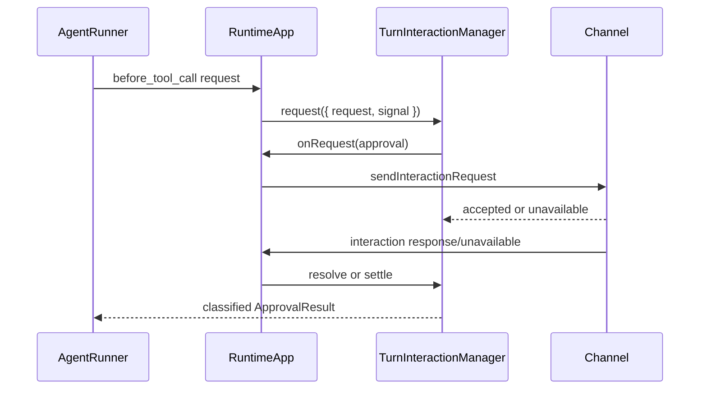

# Channels

> Status: Current Authority
> Authority: Current implemented Channel behavior
> Verified: 2026-09-14
> Ownership: Channel contracts, transport, interaction, CLI/WebSocket protocol, attachment ingress, and client routing
> Ownership key: channel-transport-and-ingress

---

## 1. Boundary

`src/adapters/channel/` is the I/O adapter boundary between the in-process Runtime and external clients such as the CLI and WebSocket transport. Canonical Channel and interaction contracts live in `src/core/channel/`; the Runtime-owned pending-interaction lifecycle lives in `src/runtime/turn-interaction/`.

Channels own transport and wire validation. They pass accepted `ChannelRunRequest` values to the Runtime; they do not schedule Turns or call the Runner directly. Runtime owns per-session queueing, steering classification, Turn identity, generation capture, interaction routing, and event Fanout. [Media](media.md) owns attachment validation and canonical normalization after Channel ingress.

## 2. Source layout

```text
src/core/channel/
├── types.ts                  # canonical Channel, interaction, Catalog, and capability contracts
└── index.ts

src/adapters/channel/
├── CliChannel.ts             # readline transport
├── WebSocketChannel.ts       # ws server transport
└── index.ts                  # concrete adapters and configuration

src/runtime/turn-interaction/
├── TurnInteractionManager.ts # Runtime-owned Promise bus
└── index.ts
```

## 3. Inbound, outbound, and capability flows

### 3.1 Client to Runtime

```text
CLI or WebSocket input
  │ ChannelRunRequest
  ▼
channel.onMessage(handler)
  ▼
RuntimeApp.handleInboundChannelMessage
  ├─ Media normalization and dropped-attachment notice assembly
  ├─ emit user_message before routing divergence
  ├─ active-session steering → steering inbox
  └─ ordinary input → per-session queue → scheduler
                                      ▼
                                 startQueuedTurn
                                 ├─ create turnId
                                 ├─ register origin Channel/client route
                                 └─ runTurn(...)
```

- A queued request receives a `requestId` and `originMessageId`, but its `turnId` is created only when that queue item starts. Queue waiting therefore does not allocate Turn-level routing state.
- `clientId` remains transport routing metadata in `MessageRouteContext`; it is not added to `RunTurnParams`.
- `user_message` is emitted after input assembly and before queued/steering classification. Queued execution carries its ID as `originMessageId` on subsequent lifecycle events.
- Steering currently accepts text only. A pure-attachment message is broadcast as `user_message` but is not added to the steering inbox.
- Direct library `runTurn()` bypasses Channel ingress and Channel queue creation, while still using the Runtime per-session gate and generation capture.

### 3.2 Runtime to clients

```text
AgentEvent
  ▼
Runtime Builder Fanout
  ├─ each selected ChannelRuntimeBinding.send(event)
  └─ RuntimeAppOptions.onAgentEvent(event)
```

Fanout selects captured-generation Channel bindings for events with a live `turnId`; events without Turn correlation use current bindings. Each synchronous throw or asynchronous rejection is contained and logged so one Channel or observer failure does not stop other deliveries or alter Turn execution. Terminal Fanout promises are tracked for bounded Shutdown convergence.

Most events route by `sessionKey`. Subagent events carry a child session key and WebSocket normalizes them to the root-session audience. A queued `request_end` has no session key, so WebSocket resolves its audience from the earlier `user_message` through `originMessageId`; an uncorrelated event is not sent. `user_message.attachmentSummaries` may expose type, MIME, byte count, and dimensions, but never raw base64.

### 3.3 Runtime capabilities

Before `start()`, candidate activation may call:

```text
bindRuntimeCapabilities({ modelCatalog, abort })
```

`modelCatalog.getSnapshot()` is a live query over the current published generation. `abort.querySessionsNeedingAbort()` and `abort.abortTurn(sessionKey)` form the abort capability; aborting a session can terminate its active Turn and drop ordinary queued requests. Channel model selection consumes the Catalog for presentation and early checks, but Model Resolution remains the final authority.

## 4. Canonical contracts

```text
ChannelRunRequest {
  sessionKey: string
  message: string | InboundContentBlock[]
  modelReference?: ModelReference
  requestOverride?: ModelRequestOverride
  maxLlmCalls?: number
  clientId?: string
}

ChannelInstance {
  id: string
  completion: Promise<ChannelCompletion>
  send(event: AgentEvent): void | Promise<void>
  onMessage(handler): void
  start(): Promise<void>
  stop(): Promise<void>
  interaction?: ChannelInteractionTransport
  bindRuntimeCapabilities?(capabilities): void
}
```

`Channel` is the existing adapter-facing alias of the Core-owned `ChannelInstance` contract. A `ChannelContribution` supplies an `id` and factory; Runtime publishes only immutable `ChannelRuntimeBinding` projections.

The interaction contract supports the discriminated kinds `approval` and `select`. Approval responses distinguish submitted allow/deny, user cancellation, and abort. `ApprovalResult` classifies approved, user-denied, Turn/Shutdown-aborted, unavailable-origin/delivery, and internal failure outcomes. `select` exists in the Core type system, but neither built-in Channel implements it.

## 5. Approval and interaction lifecycle



`TurnInteractionManager` stores pending entries in memory and settles each ID at most once. It has no elapsed-time timeout: an accepted request remains pending until user response, Turn abort, Shutdown, delivery failure, or current-origin disconnect. Abort and Shutdown remove the signal listener, resolve the Promise, and invoke `onClose`; user approval/denial does not produce a separate close notification.

Routing is origin-only. Runtime looks up the Channel binding and `originClientId` captured for the Turn. Missing routes, missing interaction capability, initial delivery failure, and origin disconnect fail closed rather than being represented as a user denial. A direct library Turn has no origin interaction route, so a Tool requiring approval also fails closed.

## 6. CLI Channel

`CliChannel` is a single-session readline transport.

```text
CliChannelConfig {
  input?: NodeJS.ReadableStream   # default process.stdin
  output?: NodeJS.WritableStream  # default process.stdout
  prompt?: string                 # default "> "
  sessionKey?: string             # default "main"
  approval?: boolean              # default false
}
```

### 6.1 Presentation

| Event | Current presentation |
|---|---|
| `text_delta` | writes streaming text directly |
| `tool_use` | writes a dimmed Tool label |
| `tool_result` | writes success/error label and a display-only bounded preview |
| `user_message` | shows only non-local client input; local CLI/library-origin input is not echoed |
| `compaction_start` / `compaction_end` | writes compaction status and counts |
| `subagent_start` / `subagent_end` | writes child lifecycle summary |
| `error` | only breaks streaming; the input-loop error handler prints the error once |
| `run_end` | breaks streaming with a newline |
| `run_start`, `llm_call`, `tool_result_pruned`, `request_end` | no CLI presentation |

Tool Result previews remove trailing blank lines, collapse repeated blank lines, show at most 10 head plus 6 tail lines with an omission marker, and cap each displayed line at 200 characters. This does not truncate the result passed to the model.

### 6.2 Model commands and lifecycle

- `/models` renders the current generation grouped by Provider; `/model` renders default, override, and effective selection.
- `/model <providerId> <JSON-string-modelId>` preserves an opaque Provider-owned Model ID, including an empty string. `/model default` clears the override.
- Before ordinary input is dispatched, a selected override is rechecked against the current Catalog.
- Control characters and long Model IDs are escaped or truncated only for terminal display; lookup and invocation preserve the original string.
- With approval enabled, only `approval` interactions are accepted and readline prompts for `y/n`. Closure or `stop()` aborts the active `readline.question`; a late callback cannot submit a decision.
- One Ctrl+C aborts all Runtime sessions that currently have an active Turn or queued input. If there is nothing to abort, it arms the one-second exit hint; a second Ctrl+C closes the Channel. Process exit policy remains Host-owned.
- `stop()` is idempotent and completion reports distinguish input closure, transport closure, explicit stop, and phase-attributed failure.

## 7. WebSocket Channel

```text
WebSocketChannelConfig {
  port: number
  host?: string       # default "127.0.0.1"
  path?: string       # default "/ws"
  maxClients?: number
  approval?: boolean  # default false
}
```

The server uses the Media-owned 15 MiB maximum frame size. A socket must complete `hello` before business messages.

### 7.1 Client protocol

| Client message | Meaning |
|---|---|
| `{ type: 'hello', clientId }` | binds the logical client ID |
| `{ type: 'run_turn', sessionKey, message, model_reference?, request_override?, maxLlmCalls? }` | submits text or ordered text/image blocks |
| `{ type: 'approval_resolve', id, decision }` | submits `allow` or `deny` |
| `{ type: 'abort_turn', sessionKey }` | aborts the active Turn and drops queued requests; there is no inline acknowledgement |
| `{ type: 'get_model_catalog', request_id }` | queries the current Catalog after `hello` |

`model_reference` uses `provider_id` and opaque `model_id`; `request_override` uses `max_output_tokens`. Removed `model` and `maxTokens` fields are rejected. Wire validation checks JSON/object shape, required strings, positive integer request limits, supported block shapes, and a PNG/JPEG/WebP/GIF `media_type` declaration. Media owns decoded-byte validation, header sniffing, declared-versus-actual MIME verification, dimensions, optimization, and limits.

### 7.2 Server protocol and routing

| Server message | Routing |
|---|---|
| `{ type: 'hello_ack', clientId }` | requesting socket only |
| `{ type: 'model_catalog', request_id, catalog }` | requesting client only; Catalog fields are snake_case |
| ordinary correlated `AgentEvent` | every connected client registered for the session |
| `subagent_start` / `subagent_end` | root-session audience |
| `request_end` | queued request audience resolved by `origin_message_id`; IDs are serialized snake_case |
| `{ type: 'approval_requested', id, toolName, input }` | origin client only |
| `{ type: 'approval_closed', id, outcome, reason }` | origin client only for aborted/unavailable/failed closure |
| `{ type: 'channel_error', code, message }` | requesting socket only |

A successful `run_turn` registers the client in that session's audience. The Channel maintains forward and reverse audience maps so disconnect cleanup is proportional to that client's sessions. A newer socket using the same `clientId` supersedes and closes the old socket; the old socket's late close cannot remove the replacement. A pending approval remains associated with the logical client across replacement, but disconnect of the current socket reports `origin_disconnected`.

Runtime Model Resolution errors retain their `category` on the ordinary `error` event. On `provider_unregistered` or `model_rejected`, the HTML client reports the failed exact selection and requests the current Catalog; applying that response clears a stale explicit override and requires the user to reselect. It never substitutes a model or resubmits the failed Turn. Other Provider/invocation failures retain the selection for an explicit user retry.

WebSocket `abort_turn` has no dedicated acknowledgement. Clients observe completion through the correlated `run_end` whose result has `stopReason: 'aborted'`.

## 8. Runtime composition

Runtime creates and starts candidate Channel instances before publication, binds the Runtime host and capabilities before readiness, and keeps ingress closed until publication. Candidate create/start failure rolls back all sibling Channels in that Unit. Root Turn trees retain their captured generation's Channel bindings; reload does not reroute in-flight events to newer instances. `waitForChannelCompletion(id)` exposes terminal Channel completion.

## 9. Evidence

| Kind | Evidence |
|---|---|
| Source | [Core Channel types](../../src/core/channel/types.ts), [CliChannel](../../src/adapters/channel/CliChannel.ts), [WebSocketChannel](../../src/adapters/channel/WebSocketChannel.ts), [TurnInteractionManager](../../src/runtime/turn-interaction/TurnInteractionManager.ts), [Channel lifecycle](../../src/runtime/channel-lifecycle.ts), [Runtime intake/routing](../../src/runtime/RuntimeApp.ts), [Runtime Fanout](../../src/runtime/runtime-builder.ts) |
| Tests | [CliChannel tests](../../src/adapters/channel/CliChannel.test.ts), [WebSocketChannel tests](../../src/adapters/channel/WebSocketChannel.test.ts), [TurnInteractionManager tests](../../src/runtime/turn-interaction/TurnInteractionManager.test.ts), [Channel lifecycle tests](../../src/runtime/channel-lifecycle.test.ts), [Runtime intake tests](../../src/runtime/RuntimeApp.intake.test.ts), [Runtime tests](../../src/runtime/RuntimeApp.test.ts) |
| Controlling authority | [Channel Specification](../specifications/channel.md), [Approval Lifecycle Specification](../specifications/approval-lifecycle.md), [Attachments Support Specification](../specifications/attachments-support.md), [Multi-client User Messages Specification](../specifications/multi-client-user-messages.md), [Abort Specification](../specifications/abort.md), [ADR-005](../decisions/adr-005-extension-registry-runtime-composition.md) |
