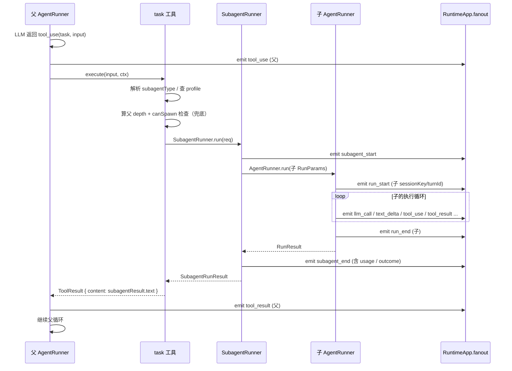

# Subagent 支持设计 Spec

> 文档日期：2026-06-18
> 分支：`feature/subagents`
> 关联文档：`current/core_runner.md` · `current/core_session.md` · `current/core_tools.md` · `current/runtime.md` · `current/core_prompt.md` · `v1.0/runtime-design.md`
> 调研材料：用户提供的 Claude Code 2.1.178 逆向报告 `claude-code-subagent-逆向报告.md`（部分版本）；openclaw `src/agents/subagent-*`

---

## 1. 背景

my-agent 当前是单 Agent 执行框架：一次 `runTurn` 对应一个 LLM 对话循环，所有工具在同一上下文里执行。已有的"sub-agent 友好"接口（`RunTurnParams.promptMode='minimal'/'none'`、`sessionKey` 命名约定、"无 channel = fail-closed allowlist" 审批策略）只是为将来留口，**当前没有任何 spawn / delegation 机制**。

随着复杂任务的出现，**父 Agent 需要把"独立子任务"委托给一个上下文隔离的子 Agent**，理由有三：

1. **上下文保护**：子任务可能产生大量中间产物（文件读、search 结果、思考过程），如果都进入父上下文，会很快把父推向压缩。
2. **角色专门化**：审计、综述、代码评审这类任务有自己的 system prompt 与受限工具集，写在主 prompt 里会污染主 Agent 行为。
3. **并行能力（未来）**：v1 不做并行，但接口要预留得不阻碍。

参考实现：

- **Claude Code** 的 `Task` 工具 + `.claude/agents/*.md` profile 文件 + `fork / general-purpose / worker / 具名` 四类 subagent_type。
- **openclaw** 的 `subagent-*` 一整套，覆盖 spawn / registry / lifecycle / depth / role / abort 树形传播 / 跨进程通信。

my-agent 走"取其形、不取其规模"路线：吸收 Claude Code 的**对外接口形态**（task 工具、frontmatter profile 文件、tools/disable-tools 规则）+ openclaw 的**几个独立工程模式**（depth 编码进 sessionKey、role/controlScope 推导、lifecycle 常量命名），但**不引入**跨进程、跨网关、注册表、worktree/remote 隔离、跨 agent 通信等子系统。

---

## 2. 目标

- 父 Agent 可以通过一个内置工具 `task` 发起一次**同进程、阻塞、独立上下文**的子 Agent 执行。
- 子 Agent 有自己的 `sessionKey`、独立 history、独立 system prompt、独立工具集，**只把最终文本返回给父**。
- 提供基于 `<workspaceDir>/<config.workspace.agentDir>/agents/<name>.md`（默认 `.agent/agents/`）的 frontmatter profile 机制，让用户能定义 `code-reviewer / planner / security-auditor` 等专门角色。
- 默认无 channel 场景下子 Agent 走 fail-closed 审批白名单（已有策略复用）。
- 子 Agent 的 `AgentEvent` 通过现有 fanout 链路转发到父 channel，UI/CLI 能区分父子。
- 实现"嵌套深度限制"：默认子 Agent 自己**没有** `task` 工具（不可再 spawn），通过 depth 阈值兜底。
- 库 API（`RuntimeApp.runSubagentTurn(...)`）和 LLM 工具调用两种入口共用同一份 `SubagentRunner` 实现。

---

## 3. 非目标

- **不做并行 spawn**：v1 一次 `task` 调用阻塞返回；同轮多 `tool_use` 在底层会串行执行（与父 toolUseBlocks 行为一致）。并行能力放到 v2。
- **不做 fork 模式**：不复制父对话历史到子，不强制父模型。接口预留 `inheritContext?` 字段但 v1 始终为 false。
- **不做 worktree / remote 隔离**：不创建 git worktree，不走远程沙箱。可选 `cwd` 字段替代基本需求。
- **不做跨 agent 通信工具**（Claude Code 的 `SendMessage`）：v1 子 Agent 之间不通信，父子之间只有"prompt 进 / final text 出"。
- **不做后台子 Agent**（`run_in_background`）：v1 全部阻塞同步。
- **不做交接安全分类器**：复用现有 `before_tool_call` 审批 hook 链，不引入二次分类层。
- **不做跨进程 / 跨网关 / ACP / cron isolated-agent**（openclaw 的全部分布式特性）。
- **不引入 attachments 给子 Agent**：v1 子 prompt 仅 string；图片附件等待 attachments PR 链稳定后再考虑。

---

## 4. 借鉴来源对比表

| 主题 | Claude Code 做法 | openclaw 做法 | my-agent v1 决策 |
|---|---|---|---|
| 入口工具 | `Task`（外名 `Agent`），三参数 `description/prompt/subagent_type` | `sessions_spawn`（参数 ~15 个） | 抄 Claude Code 形态：`task` 工具，参数 `description / prompt / subagent_type?` |
| Profile 文件 | `.claude/agents/*.md` + YAML frontmatter | 全部走 config + agentId 多租户 | 抄 Claude Code：`<agentDir>/agents/*.md`（`agentDir` 从 `config.workspace.agentDir` 派生，默认 `.agent`），frontmatter 字段取子集 |
| tools 选择 | `tools` 替换默认集；`disable-tools` 在默认集上减法；前者覆盖后者 | 复杂 allowlist/denylist 多层合并 | 抄 Claude Code 规则，原样实现（§7.3） |
| 嵌套限制 | "teammates cannot spawn teammates"（参数维度） | depth 编码 + role/controlScope 推导（"main/orchestrator/leaf"） | 抄 openclaw：depth 写进 sessionKey，role 推导 canSpawn |
| 子 sessionKey | （二进制黑盒，不可见） | `agent:<id>:...:subagent:<n>:...`，可嵌套 | 抄 openclaw 思路，简化为 `<parent>:subagent:<turnId>:<n>` |
| Token 计费 | usage 只算主线程（`!parent_tool_use_id`） | 独立 metrics | 抄 Claude Code：子 usage 不向父 `RunResult.usage` 累加；通过 `subagent_end` 事件单独暴露 |
| 审批 | 有"交接安全分类器" + 父继承 | gateway 层多策略 | 复用现有"无 channel = fail-closed allowlist"（v1.0 已规定），不加二次分类 |
| 事件命名 | `SubagentStart / SubagentStop / TaskCreated / TaskCompleted`（4 个） | `subagent-complete / subagent-error / subagent-killed / session-reset / session-delete`（5 个 reason）+ outcome | 折中：v1 两个事件 `subagent_start / subagent_end`，但 `subagent_end.reason` 命名抄 openclaw（向上兼容扩展） |
| Profile 注入 prompt | 运行期消息 `Available agent types for the Agent tool: ...` | 复杂 | 抄 Claude Code：`SystemPromptBuilder` 增 `<available-subagents>` 段 |
| fork 模式 | 继承父全部 history + 强制父模型 | 无对应 | v1 不做，接口预留 `inheritContext?: boolean`（false-only） |
| 隔离 | `isolation: worktree / remote` | sandbox 配置 | v1 不做，profile 可写 `cwd` 字段（仅作 `SubagentRunParams.cwd` 传递，runner 本身不消费——只是供未来 exec 工具用） |
| 通信 | `SendMessage` 工具 | gateway 路由 | v1 不做，无对应字段 |
| 后台 | `run_in_background` + 通知 | gateway 异步任务 | v1 不做，无对应字段 |

---

## 5. 现状盘点

| 层 | 现状 | 影响 |
|---|---|---|
| `RunTurnParams.promptMode` | 已含 `'full' / 'minimal' / 'none'`（[src/runtime/types.ts](../../src/runtime/types.ts#L86)） | 子 Agent 直接传 `'minimal'`，无需扩展 |
| `sessionKey` | 任意字符串，已规划 `"subagent:xxx"` 命名（[core-session-design.md](./core-session-design.md#L62)） | depth 编码方案直接可用，无需 schema 改动 |
| `SessionManager` | append-only JSONL + sessions.json 元数据，已支持 `spawnedBy?` 字段 | 子 Agent 直接复用，写入到同一目录 |
| 审批策略 | `wireApprovalRouting` 始终装 hook，无 channel 时仅 `tools.approval.allow` 内可执行（fail-closed） | 子 Agent 天然继承策略，无需新增分支 |
| `AgentRunner` | 纯执行引擎，接收最小参数子集，不调 `loadConfig()` | `SubagentRunner` 可直接复用，无需在 runner 内开洞 |
| `ToolExecutor` | `(name, input) => Promise<ToolResult>`，错误转 `isError`，不向外抛 | `task` 工具按此契约实现即可 |
| `SystemPromptBuilder` | 7 section 结构 | 增加一个 `<available-subagents>` section（详见 §11） |
| `Channel.send(event)` | RuntimeApp fanout 闭包向所有 channel 广播 | 子 Agent event 进入同一 fanout，channel 侧按 `trigger.source + sessionKey + runId` 区分父子 / 计划任务 |
| `AgentEvent` | 13 种 variant，含 `sessionKey / turnId` | 新增 `subagent_start / subagent_end` 两种；其他 variant 不变，子 Agent 直接共用 |
| `inFlightSessions: Set<string>` | per-sessionKey 串行 gate，跨 session 天然并发（[src/runtime/RuntimeApp.ts](../../src/runtime/RuntimeApp.ts)） | 子 Agent 用独立 sessionKey 即自动获得 "跨 run 并发"；这也是未来 cron 跨 job 并发的依据 |
| `AgentRunner` tool 循环 | 同一轮多 `tool_use` block **串行**执行（[core_runner.md](./current/core_runner.md) §5） | v1 接受；并行 `task` 等扩展见 §15 / §16 v2+ 路标 |

---

## 6. 模块布局

### 6.1 新增 / 修改表瘦变胖原则

- **新增首选 `core/subagent/`**：subagent 特有逻辑全部集中，防止散落到 `core/runner/` 或 `runtime/`。
- **仅扩展，不重写**：`AgentRunner / SessionManager / SystemPromptBuilder` 的现有公共方法不改；只加 section 渲染 / `AgentEvent` union variant 这些加法改动。
- **保持 `RuntimeApp` 瘦**：subagent 装配 / 事件构造抽到 `runtime/subagent-orchestration.ts`，与现有 `tool-approval-policy.ts` / `prompt-factory.ts` 同风格。
- **`task` 工具是有状态工厂**：不能像 `webFetchTool` / `execTool` 那样无状态导出，必须接受 SubagentRunner / profile registry / depth provider 依赖。

### 6.2 新增与修改的文件清单

```
src/core/subagent/                                  ← 新模块
├── types.ts                                        # subagent-specific 类型：
│                                                    SubagentProfile / SubagentRunRequest /
│                                                    SubagentRunResult / SubagentRole / SubagentCapabilities
│                                                  # “通用执行契约”类型临时也住在这：
│                                                    RunRequest / RunTrigger / RunLifecycle
│                                                  # （v2 scheduler PR 考虑上提；详见 §17 #6）
├── session-key.ts                                  # sessionKey 命名 / depth 推导：
│                                                    formatSubagentSessionKey / parseSubagentSessionKey
│                                                    getSubagentDepth / isSubagentSessionKey
│                                                  # （跨模块复用时考虑迁到 core/session/，详见 §17 #6）
├── capabilities.ts                                 # resolveSubagentCapabilities（depth → role → canSpawn）
├── profile-loader.ts                               # 读 <agentDir>/agents/*.md + frontmatter 解析 + 启动期校验
│                                                  # + buildGeneralPurposeProfile(opts) 内置 profile 工厂
├── profile-tools.ts                                # 基于 profile 合并出子 Agent 工具集
│                                                  # （tools / disable-tools / 防递归剔除 task；之前名 tool-selector.ts）
├── available-subagents.ts                          # 给 SystemPromptBuilder 的 <available-subagents> section：
│                                                    AvailableSubagentEntry 类型
│                                                    collectAvailableSubagents(profiles, opts)
│                                                    renderAvailableSubagentsSection(entries) 字符串输出
├── SubagentRunner.ts                               # 薄壳：
│                                                    • 生成 runId（UUID）
│                                                    • 组装 RunParams（含子 sessionKey / promptMode='minimal'）
│                                                    • emit subagent_start → 调 AgentRunner.run → emit subagent_end
└── index.ts                                        # 仅导出公共 API
```

```
src/core/tools/builtin/task/                        ← 新内置工具
├── task-tool.ts                                    # createTaskTool(deps): Tool
│                                                  #   deps = {
│                                                  #     subagentRunner: SubagentRunner;
│                                                  #     profileRegistry: ReadonlyMap<name, SubagentProfile>;
│                                                  #     getSubagentCapabilities: (sessionKey) => SubagentCapabilities;
│                                                  #     maxSubagentDepth: number;
│                                                  #   }
└── index.ts                                        # 仅导出 createTaskTool
```

```
src/core/prompt/SystemPromptBuilder.ts              ← 修改：增一个 section 渲染分支
                                                    数据由 prompt-factory 通过 buildSystemPromptParams 注入
                                                    渲染逻辑调用 core/subagent/available-subagents.ts 的 render…
```

```
src/core/runner/types.ts                            ← 修改：仅扩展 AgentEvent union
                                                    （加 subagent_start / subagent_end，含 runId / lifecycle / trigger）
```

```
src/runtime/                                        ← 装配变更（不改 AgentRunner）
├── types.ts                                        # RuntimeResourceSet 新增两字段：
│                                                    subagentProfiles: ReadonlyMap<string, SubagentProfile>;
│                                                    subagentRunner: SubagentRunner;
├── bootstrap.ts                                    # 启动期加载 profiles + 构造 SubagentRunner 装进 ResourceSet
├── tool-registry.ts                                # 新增 buildTaskToolIfEnabled(deps): Tool | null
│                                                  # subagents.enabled === false 返回 null
├── prompt-factory.ts                               # buildSystemPromptParams 增 availableSubagents 字段
│                                                  # 数据来自 collectAvailableSubagents(...)
├── subagent-orchestration.ts                       # 新文件：代 RuntimeApp 完成
│                                                  #   • SubagentRunner 装配（复用 fanout 闭包、sessionManager、llmClient…）
│                                                  #   • runSubagentTurn(...) 入口实现
│                                                  #   • v2 位置：dispatchDetachedRun(...) 将添加在这里
└── RuntimeApp.ts                                   # 仅增 public method：
                                                       runSubagentTurn(req) 薄壳，内部调 subagent-orchestration
```

### 6.3 未来扩展位（v2+，本 spec 不实现）

```
src/core/scheduler/                                 ← 未来：cron / at / every 触发器
├── types.ts                                        # import 主项的 RunTrigger / RunLifecycle
│                                                    （如 §17 #6 决定迁移，这里 import 路径随之调整）
└── ...                                             # Schedule / Job / Catch-up / Delivery 由 scheduler 内部决定

src/runtime/subagent-orchestration.ts               ← 未来：增 dispatchDetachedRun(...) +
                                                       activeDetachedRuns registry。RuntimeApp 不需再拆文件。
```

scheduler 模块**只**通过 `RuntimeApp.runSubagentTurn(...)` / 未来的 `RuntimeApp.dispatchDetachedRun(...)` 与 subagent 接界，不直接 import `SubagentRunner` 内部实现。

### 6.4 依赖方向（必须不反转）

```
runtime/                          依赖  core/subagent/
core/subagent/                    依赖  core/runner / core/session / core/prompt / core/tools
core/tools/builtin/task/          依赖  core/subagent（工厂签名） + core/tools赢 的公共接口
core/prompt/SystemPromptBuilder   依赖  core/subagent/available-subagents 的渲染函数 + 类型
```

**`core/subagent/` 不依赖 `runtime/`**（composition root 完整在 runtime 层）。`task` 工具从 `core/tools/builtin/` 依赖 `core/subagent/` 是一个特例：其他内置工具都不依赖 subagent 模块。

---

## 7. 核心决策

### 决策 1：子 Agent = 同进程阻塞调用，**不是**新进程 / 不是 actor

**采用**：父 `task` 工具的 `execute()` 内部 `await SubagentRunner.run(...)`，子完成后用 `final text` 作为 `ToolResult.content` 回到父循环。

理由：

- my-agent 是"可嵌入的库"，多进程把它推向 openclaw 那种网关架构，违反定位。
- 同进程 = 复用 `LLMClient` / `SessionManager` / `Logger`，零额外资源管理。
- 阻塞返回 = LLM 端的语义最自然（一个 tool call，一个 result）。
- 库调用方需要异步时，外层用 `Promise.all`，runtime 不引入额外异步基建。

代价：

- 单条 turn 时长可能成倍延长（父 LLM 等子 Agent 跑完）。可接受，等用户提"想并行"再做 v2。
- 父 abort 时需要把 `AbortSignal` 向下传给子的 LLM 调用——v1 通过 `ToolContext.signal` 已有通路，但**当前 `AgentRunner` 不消费 signal**（`core_runner.md` §1.3 未列入），signal 仅做最小实现：在 `task.execute` 入口检查 `signal.aborted`，启动后无法中断；完整的"abort 树形传播"留待 v2。

### 决策 2：子 Agent 通过 frontmatter 文件定义角色，**不是** config / 不是代码

**采用**：`<workspaceDir>/<config.workspace.agentDir>/agents/<name>.md` 单文件 = 一个 profile（默认路径即 `<workspaceDir>/.agent/agents/<name>.md`，与现有 `<agentDir>/config.json`、`<agentDir>/sessions/`、`<agentDir>/memory.sqlite` 同根）。YAML frontmatter 描述元数据 + 工具集，body 是 system prompt。

```markdown
---
name: code-reviewer
description: Use this agent to audit code for OWASP issues and obvious bugs before merge.
model: inherit                              # 'inherit' | 具体 model id
tools: [read_file, grep_search, file_search]  # 替换默认集（参考 Claude Code）
disable-tools: []                            # 默认集减法，'tools' 出现时忽略
max-turns: 20                                # 子 Agent 的 maxLlmCalls
---

You are a senior code reviewer. Focus on injection, authn/z, secrets, and obvious correctness bugs.
Output a punch list grouped by severity.
```

理由：

- 文件即定义 = 用户可以 git 跟踪、可以跨工作区拷贝、可以 PR review。
- 与 Claude Code 的 `.claude/agents/` 同结构，**字段命名保持一致**，方便用户从那边迁移。
- 不放到 `config.json` 是因为 system prompt 通常是 markdown 大段文字，YAML 嵌字符串很难看。

加载时机：

- `RuntimeApp.create()` 启动时扫一次目录（与 contextFiles 加载同阶段），缓存到 `RuntimeResourceSet.subagentProfiles: Map<name, SubagentProfile>`。
- 不做热加载（hot reload）；profile 改动后重启 RuntimeApp。
- 文件名 `<name>.md` 中的 `<name>` 必须等于 frontmatter `name` 字段；不一致时启动报错（防"重命名文件但 LLM 用旧名字"）。

### 决策 3：depth 编码进 sessionKey，**不是** 注册表

**采用**：openclaw 的方案。子 sessionKey 形如：

```
父：    main
深度1：  main:subagent:<parentTurnId>:1
深度2：  main:subagent:<parentTurnId>:1:subagent:<childTurnId>:2
```

`getSubagentDepth(key)` 实现就是数 `:subagent:` 出现次数。

理由：

- 完全 stateless，启动时无需读 registry。
- 与 my-agent 现有"sessionKey 是任意字符串"的设计 0 冲突。
- depth 上限默认 1（即父可以 spawn 子，但子默认拿不到 `task` 工具——这是双保险）：
  - 第一层防护：子 Agent 的 `tools` 默认集**不含** `task`。
  - 第二层防护：`task.execute()` 入口算 depth，超过 `maxSubagentDepth`（默认 1）直接返回 error，即使工具集被错配也兜得住。

### 决策 4：role 推导 = openclaw 的 `main / orchestrator / leaf`

照搬 [openclaw/src/agents/subagent-capabilities.ts](../../../openclaw/src/agents/subagent-capabilities.ts) 的语义，但去掉 sessionStore lookup（depth 直接从 key 算）：

```
depth 0                              → main
0 < depth < maxSubagentDepth         → orchestrator   (canSpawn=true)
depth >= maxSubagentDepth            → leaf           (canSpawn=false)
```

v1 默认 `maxSubagentDepth=1`，于是只有 `main` 和 `leaf` 两种状态——`orchestrator` 当前出现不了，但语义/类型保留，未来调大上限即生效。

### 决策 5：tools 选择规则 = Claude Code 规则原样

抄 Claude Code 报告 §2.2 的规则：

| profile 字段 | 行为 |
|---|---|
| `tools: ['a', 'b']` | **替换**父默认集为 `[a, b]` |
| `disable-tools: ['c']` | 在父默认集做减法，去掉 `c` |
| 两者都有 | **`tools` 优先**，`disable-tools` 被忽略 |
| 两者都没有 | 继承父默认集，**但移除 `task`**（防递归） |

`tools` 字段里允许出现 `task` 吗？**v1 不允许**，profile loader 启动期校验，写了就报错——再次强调防递归。未来调大 `maxSubagentDepth` 才会放开。

### 决策 6：Token 计费——子不向父累加

抄 Claude Code 的语义："usage/model 仅在 `!parent_tool_use_id` 时计入"。

具体规则：

- 父 `RunResult.usage` **只统计父自身的 LLM 调用**，不含子 Agent。
- 子 Agent 的 usage 通过 `subagent_end` 事件单独暴露（带 `usage: TokenUsage` 字段）。
- `task` 工具返回的 `ToolResult.content` 只放子的最终文本，**绝不**把 usage 序列化进去（否则父 LLM 会"看到"，污染思维）。
- 上层（telemetry / billing）想算"含子的总账"自己加。

### 决策 7：审批策略 = 复用 v1.0 "无 channel = fail-closed allowlist"

子 Agent 的 turn 执行时，**不接管父的 origin channel 上下文**（即 `routeContextByTurn` 不为子 turn 注册）。于是 `wireApprovalRouting` 内的"有 approval channel 才弹 prompt"分支天然走到 fail-closed allowlist 路径——这正是 v1.0 已经规定的语义。

理由：

- 子 Agent 是 LLM 自主决策的"代理工作"，弹审批 modal 给用户体验上是奇怪的（"你不是在审 code-reviewer 自己的代码吗？为啥又问我？"）。
- 已有 `tools.approval.allow` 列表机制可以让用户精确控制"子 Agent 默认能用哪些工具"。
- 不引入 Claude Code 的"交接安全分类器"——my-agent 没有 LLM 分类器预算。

调用方想给子 Agent 升级权限：

- 方案 A（v1）：把工具加进 `tools.approval.allow`。
- 方案 B（v2+）：profile 增 `permission-mode` 字段，runtime 装配子 turn 时临时合并 allow 集。

### 决策 8：事件 = 复用 `AgentEvent` + 新增两个 subagent 专属（含 trigger 区分）

不为子 Agent 创建独立事件流。子的所有 `text_delta / tool_use / tool_result / llm_call / compaction_*` 全走原有 channel.send 通路，靠 `sessionKey + turnId + runId` 区分。

新增两个事件标记 "一次 Run 的边界"（详见 §15 关于 Run / Trigger / Lifecycle 抽象的解释）：

```
| { type: 'subagent_start';
    runId: string;               // 执行实例 id（区别于 turnId；详见 §15 防滑原则 1）
    sessionKey;                  // 子的 sessionKey
    turnId;                      // 子第一个 turn 的 id（与 run_start.turnId 相同）
    depth: number;
    subagentType: string;        // 'general-purpose' | profile.name
    lifecycle: 'blocking';       // v1 only；future: 'detached'
    trigger: RunTrigger;         // discriminated union，见 §8.2
  }

| { type: 'subagent_end';
    runId;
    sessionKey;
    turnId;
    depth;
    subagentType;
    lifecycle: 'blocking';
    trigger: RunTrigger;
    outcome: 'ok' | 'error' | 'aborted' | 'max_llm_calls';
    reason?: string;             // 抄 openclaw reason 命名约定
    usage: TokenUsage;           // 子自身的 usage，独立暴露
    durationMs: number;
  }
```

**为什么 parent* 字段不再独立列出**：v1 通过 `trigger.source = 'llm-tool'` variant 携带 `parentSessionKey / parentTurnId / parentToolUseId`；`source = 'library'` 时无父；未来 `source = 'scheduled' / 'webhook'` 也无父。把这三个字段抽进 union 是为了让 cron / detached / webhook 加入时**事件 schema 零 breaking change**——这是 §15 防滑原则的落地。

事件在三种入口都出现（v1 仅前两种实际可触发）：

| 入口 | trigger.source | 实现状态 |
|---|---|---|
| `task` 工具被 LLM 调用 | `'llm-tool'` | ✅ v1 |
| `RuntimeApp.runSubagentTurn(...)` 库 API | `'library'` | ✅ v1 |
| Scheduler 触发（cron / at / every） | `'scheduled'` | ⏭️ v2 |
| Webhook / 外部 HTTP 触发 | `'webhook'` | ⏭️ v2+ |

时序（详见 §10）：

```
父 tool_use(task)
  → subagent_start  trigger.source='llm-tool'  (子入队前)
  → run_start                                  (子自身，with 子 sessionKey)
  → llm_call / text_delta / tool_use ...       (子内部正常事件)
  → run_end                                    (子自身)
  → subagent_end                               (与 run_end 几乎同时)
父 tool_result(task)                            (回到父循环)
```

### 决策 9：入口 = LLM 工具 + 库 API 两种，共用 SubagentRunner；签名通过 trigger union 区分

- **LLM 工具入口** `task`：让父 LLM 自主决策何时 spawn、spawn 给谁。trigger 为 `'llm-tool'` variant。
- **库 API 入口** `RuntimeApp.runSubagentTurn(params)`：测试 / 编排脚本可以绕过 LLM 直接跑子 Agent。trigger 为 `'library'` variant。
- **未来 scheduler 入口**（不实现，仅占位）：scheduler 触发时同样调用 `RuntimeApp.runSubagentTurn(...)`，trigger 为 `'scheduled'` variant。

两者底层都是：

```
SubagentRunner.run({
  profile,                       // 选定的 SubagentProfile
  prompt,                        // 子的用户消息
  trigger,                       // RunTrigger，见 §8.2
  lifecycle: 'blocking',         // v1 only
  signal?,                       // 来自父 ToolContext 或 caller；v1 仅入口检查
})
```

**v1 关键约定**：

- 不再使用 `'manual:<uuid>'` 这种占位字符串塞 parentToolUseId——`trigger: { source: 'library' }` 直接表达"无父"，下游 channel / UI 看 `trigger.source` 自决渲染。
- `runId` 由 `SubagentRunner` 内部生成（UUID），写入事件与 `SubagentRunResult`。runId ≠ turnId（详见 §15 防滑原则 1）。

### 决策 10：subagent_type 解析

抄 Claude Code 的语义但简化：

- `subagent_type: 'general-purpose'`（默认或省略）→ 内置 profile，无 frontmatter 文件，system prompt 由 `prompt-factory.ts` 提供一段标准化模板（含 workspace 信息 + 通用助手定位），tools 继承父默认集减 `task`。
- `subagent_type: <name>` → 查 `subagentProfiles.get(name)`，未命中返回 tool error（不 fallback 到 general-purpose，避免静默走错）。
- **保留名不可被用户 profile 覆盖**：`general-purpose / fork / worker` 三个名字是 reserved，在用户文件里出现 `name: general-purpose`（以及 `fork / worker`）会启动期 fail-fast（详见 §9.1）。用户想自定义默认助手请用别的名字（如 `default-helper`）。
- **不实现** `fork / worker`，传这两个值返回 tool error（错误信息提示这两个是 v2 计划，建议用 general-purpose）。

---

## 8. 类型设计

### 8.1 SubagentProfile

```
SubagentProfile {
  name: string                              // 唯一标识符（与文件名匹配）
  description: string                       // 给父 LLM 看的"何时使用"
  systemPrompt: string                      // frontmatter 之后的 markdown body
  model?: string                            // 'inherit' / 'inherit-default' 由 runtime 解析
  toolSelection: {
    mode: 'replace' | 'subtract' | 'inherit'  // 三态对应 tools / disable-tools / 都无
    names: string[]                            // mode='replace' 用作白名单；'subtract' 用作减法集；'inherit' 忽略
  }
  maxLlmCalls?: number                      // 抄 Claude Code 的 max-turns，传给 RunParams
  cwd?: string                              // 预留：传给 SubagentRunParams，runner 暂不消费
  sourceFile: string                        // 绝对路径，用于错误信息
}
```

### 8.2 RunTrigger / RunLifecycle / RunRequest

```ts
type RunTrigger =
  | { source: 'llm-tool';
      parentSessionKey: string;
      parentTurnId: string;
      parentToolUseId: string;        // 父 LLM 那条 tool_use block 的 id
    }
  | { source: 'library';
      callerLabel?: string;            // 可选：脚本/测试自报
    }
  // ↓ v2+ 占位：v1 类型存在但不会被构造
  | { source: 'scheduled';
      jobId: string;
      scheduledForMs: number;
    }
  | { source: 'webhook';
      requestId: string;
    };

type RunLifecycle = 'blocking';        // v1 only；future union: 'blocking' | 'detached'

RunRequest {                            // 库 API + 工具内部共用
  subagentType: string                  // 'general-purpose' | profile.name
  description: string                   // 短标签，进 subagent_start 事件用
  prompt: string                        // 子的 user message
  trigger: RunTrigger
  lifecycle: RunLifecycle               // v1 始终 'blocking'
  signal?: AbortSignal
}
```

**为什么 `RunRequest` / `RunTrigger` / `RunLifecycle` 不以 `Subagent` 开头**：这三个类型是"一次 Agent Run 的通用契约"，未来 scheduler 模块直接复用同一组类型构造 `trigger: { source: 'scheduled', ... }`，避免 scheduler 重复定义。详见 §15 与 §6 模块布局。

### 8.3 SubagentRunResult

```
SubagentRunResult {
  runId: string                         // 执行实例 id；与事件中的 runId 一致
  sessionKey: string                    // 子的 sessionKey，便于上层定位历史
  turnId: string                        // 子的第一个 turn id
  text: string                          // 子的最终回复（task 工具返回这个作为 ToolResult.content）
  outcome: 'ok' | 'error' | 'aborted' | 'max_llm_calls'
  reason?: string
  usage: TokenUsage
  durationMs: number
}
```

库 API caller / 未来 scheduler 用 `runId` 做主关联键（log / telemetry / 重试统计），不要用 `turnId`（详见 §15 防滑原则 1）。

### 8.4 SubagentRole / Capabilities

```
SubagentRole = 'main' | 'orchestrator' | 'leaf'

SubagentCapabilities {
  depth: number
  role: SubagentRole
  canSpawn: boolean                         // role !== 'leaf'
}

resolveSubagentCapabilities(sessionKey: string, maxSubagentDepth: number): SubagentCapabilities
```

### 8.5 AgentEvent 扩展

在 `core/runner/types.ts` 的 `AgentEvent` union 末尾追加 §7 决策 8 中两条 variant。`AgentRunner` 内部**不**产生这两条；它们由 `SubagentRunner` 在 `run()` 前后 emit，借用 runner 的 `onEvent` 通路（runtime 注入的 fanout 闭包）。

---

## 9. Profile 文件格式细则

### 9.1 路径与发现

- 根目录：`<workspaceDir>/<config.workspace.agentDir>/agents/`（默认 `.agent/agents/`）。`agentDir` 与现有 sessions / memory / config 共享，从 `config.workspace.agentDir` 派生，不重复引入 profile 专用配置项。
- 文件：`*.md`，扫一层（不递归子目录）。
- 启动期一次性加载；出错的文件：
  - frontmatter 缺失 / 非法 YAML → 启动失败（fail-fast）。
  - `name` / `description` 缺失 → 启动失败。
  - `name` 与文件名不匹配 → 启动失败。
  - `name` 命中保留名 `general-purpose` / `fork` / `worker` → 启动失败（报错信息：`Profile name 'X' is reserved for the built-in subagent type; rename the file to use a custom name.`）。
  - `tools` 含 `task` → 启动失败（v1 禁止递归）。
  - `model` 既非 `'inherit'` 也非合法 model id → 启动失败。
  - `tools` 引用未注册的工具名 → 启动失败（防 typo）。
- 多个文件用同一个 `name` → 启动失败（重复定义）。

> 不做"加载失败时仅 skip 这个 profile" 的容错——profile 错误一律致命。理由：subagent 行为静默错位比启动失败危险得多。

### 9.2 frontmatter v1 字段

| 字段 | 类型 | 必填 | 说明 |
|---|---|---|---|
| `name` | string | ✅ | 同文件名（去 `.md`）。`/[a-z0-9_-]+/i`，禁以 `-` 开头（抄 Claude Code 校验） |
| `description` | string | ✅ | 一句话"何时使用"，会进父 system prompt |
| `model` | string | ❌ | `'inherit'`（默认）或具体 model id；`'inherit'` 时子用父 model |
| `tools` | string[] | ❌ | 替换式工具白名单 |
| `disable-tools` | string[] | ❌ | 减法式工具黑名单（与 `tools` 互斥） |
| `max-turns` | number | ❌ | 子 Agent 的 `maxLlmCalls`，默认沿用父 |
| `cwd` | string | ❌ | 预留，runner 暂不消费 |

**v1 不识别的字段**（载入时 ignore + warn log，不报错——给 Claude Code 用户复用文件留兼容路径）：
`fork / isolation / mcp / mcpServers / hooks / skills / permission-mode / background / shell / color / effort / memory / prompt / allowed-tools / disallowed-tools`

> `allowed-tools` / `disallowed-tools` 是 Claude Code 的旧写法，v1 选择**不**等同于 `tools` / `disable-tools`（避免歧义），载入时 warn 但 ignore。

### 9.3 内置 general-purpose profile

不依赖文件存在。`core/subagent/profile-loader.ts` 暴露 `buildGeneralPurposeProfile(opts)` 工厂；`runtime/bootstrap.ts` 在装配 profile registry 时调它合成第一条记录（在加载磁盘 profile 之前）：

```
{
  name: 'general-purpose',
  description: '通用任务执行助手。当任务不匹配任何具名 subagent 时使用。',
  systemPrompt: <buildGeneralPurposeProfile 内置模板，含 workspace info + 子 Agent 行为约束>,
  model: 'inherit',
  toolSelection: { mode: 'inherit' },     // 继承父默认集减 task
  sourceFile: '<built-in>',
}
```

---

## 10. 执行流程时序

### 10.1 父 turn 内调用 task 工具



要点：

- **fanout 一直是同一个闭包**——子的所有事件和父的事件流到同一组 channel.send。channel 侧靠 `event.sessionKey` 区分。
- **子的 `run_start / run_end` 与父的事件穿插**，这是预期行为（UI 应支持嵌套渲染）。
- **`subagent_start` 在 `run_start` 之前**，给 UI 提供"开新嵌套层"的信号。
- **`subagent_end` 在 `run_end` 之后**，给 UI 提供"关闭嵌套层 + 显示总结"的信号。

### 10.2 库 API 调用

```
RuntimeApp.runSubagentTurn({
  parentSessionKey: 'main',
  prompt: 'Audit src/auth/',
  subagentType: 'code-reviewer',
}) → Promise<SubagentRunResult>
```

内部步骤：

1. 生成 `parentToolUseId = 'manual:' + uuid()`，`parentTurnId = 'manual:' + uuid()`。
2. 查 profile。
3. 走 `SubagentRunner.run(req)`，事件照常 fanout。
4. 返回 `SubagentRunResult`。

**与工具入口的唯一区别**是 parent 标识不来自真实 LLM tool_use。channel 上行为完全一致。

---

## 11. SystemPromptBuilder 改动

在现有 7 个 section 之外，新增第 8 个 section `<available-subagents>`：

```
<available-subagents>
You can delegate independent subtasks to specialized subagents using the `task` tool.

Available subagent types:
- general-purpose: 通用任务执行助手。当任务不匹配任何具名 subagent 时使用。
- code-reviewer: Use this agent to audit code for OWASP issues and obvious bugs before merge.
- planner: ...

Guidelines:
- Use `task` for independent work, especially when it would otherwise read many files into your context.
- Subagents run in isolated context; pass all necessary information in the `prompt` parameter.
- A subagent returns only its final text; intermediate tool calls are not visible to you.
- Each `task` call is blocking.
</available-subagents>
```

注入条件：

- profile 数量 > 0 **或** runtime 配置启用 general-purpose（默认启用）。
- 子 Agent 自己的 system prompt 中**不**注入此 section（子默认无 `task`，告诉它这事没意义；且会污染子的注意力）。
- `promptMode='minimal'` 也不注入（minimal 已经在裁剪 prompt 体积）。
- `promptMode='none'` 当然不注入。

实现分工（详见 §6）：

- **数据采集**：`core/subagent/available-subagents.ts` 的 `collectAvailableSubagents(profiles, opts)` 输出 `AvailableSubagentEntry[]`。
- **装配**：`runtime/prompt-factory.ts` 的 `buildSystemPromptParams` 新增 `availableSubagents: AvailableSubagentEntry[]` 字段。
- **渲染**：`SystemPromptBuilder` 调 `core/subagent/available-subagents.ts` 的 `renderAvailableSubagentsSection(entries)` 拼出上面的文本块。
- **`SystemPromptBuilder` 不反向依赖 `core/subagent/`**：只依赖后者导出的**类型与纯函数（`AvailableSubagentEntry` + `renderAvailableSubagentsSection`）**，不接触 SubagentRunner / SubagentRunRequest 这些运行时产物。

---

## 12. 配置扩展

在 `AgentDefaults` 增 `subagents` 节（**最小**）：

```ts
subagents: {
  enabled: boolean;                  // 默认 true；false 则不注册 task 工具、不加载 profile
  maxSubagentDepth: number;          // 默认 1
  generalPurposeEnabled: boolean;    // 默认 true
}
```

不引入：

- `profilesDir`（v1 不引入。profile 目录始终为 `<workspaceDir>/<config.workspace.agentDir>/agents/`，复用现有 `workspace.agentDir` 配置，避免路径双套件並保持与 sessions/memory 同根）。
- per-profile 配置覆盖（profile 本身就是配置文件）。
- token 预算配额（v1 复用父 `contextWindowTokens` 默认值）。

---

## 13. 安全 / 失败模式

| 风险 | 缓解 |
|---|---|
| LLM 把整个父对话作为 `prompt` 传给子 → 隐私 / token 泄露 | 工具 description 明确"prompt 应只含子需要的信息"；不在底层强制（影响表达力）。 |
| 子 Agent 写文件破坏 workspace | 复用现有 `fsWorkspaceOnly` 路径策略 + approval allowlist。子默认无 `apply_patch / write_file / edit_file`（继承父默认集时通过 `tools` 子集裁剪——v1 由用户在 profile 显式列）。 |
| 子 Agent 死循环吃 token | profile 的 `max-turns` 强制；缺省走父 `maxLlmCalls`（v1.0 默认 12）。 |
| 父 abort 时子继续跑 | v1 最小实现：`task.execute` 入口检查 `signal.aborted`；启动后 signal 不向 runner 内传播。**已知 gap**，v2 通过 `AgentRunner` 消费 `RunParams.signal` 修复。 |
| 子 LLM 调用栈溢出（误配 + 多层 spawn） | depth 限制双保险：默认子无 `task` 工具 + `maxSubagentDepth` 阈值兜底。 |
| profile 文件被恶意修改 | 启动期 fail-fast 校验；profile 不通过网络拉取，仅读 workspace 内。 |
| 子 session 与父 session 同名冲突 | sessionKey 命名规则保证唯一（含 parentTurnId + 序号）。 |

---

## 14. v1 范围与 v2+ 路标

### v1 范围（本 spec 覆盖）

- `core/subagent/` 新模块（types / session-key / capabilities / profile-loader / profile-tools / available-subagents / SubagentRunner），**含 `RunTrigger / RunLifecycle` 类型导出**
- `core/tools/builtin/task/` 新工具
- `runtime/tool-registry.ts` / `prompt-factory.ts` / `RuntimeApp.ts` 装配改动
- `core/runner/types.ts` 仅 `AgentEvent` union 扩展
- `<workspaceDir>/<config.workspace.agentDir>/agents/*.md` profile 文件机制（默认 `.agent/agents/`）
- `<available-subagents>` system prompt section
- `subagent_start / subagent_end` 事件（含 `runId / lifecycle / trigger` 字段）
- `RuntimeApp.runSubagentTurn(...)` 库 API
- 配置 `subagents.{enabled, maxSubagentDepth, generalPurposeEnabled}`
- **`trigger.source` v1 实际只支持 `'llm-tool' | 'library'` 两种 variant；`'scheduled' / 'webhook'` 在类型 union 中存在但 v1 不构造**

### 明确放到 v2+

**A. 并发与执行模型扩展**

| 特性 | 触发条件 / 备注 | 与现有 spec 的接界 |
|---|---|---|
| **同轮并行多 `task`** | 用户报"task 串行慢" | 改 `AgentRunner` tool 循环 + Tool 接口加 `parallelSafe?: boolean`；event schema 无改 |
| **Detached lifecycle** | 接入第一个 scheduler / webhook / `run_in_background` 时 | `RunLifecycle` union 扩 `'detached'`；新增 `RuntimeApp.dispatchDetachedRun(...)` + `activeDetachedRuns: Map<runId, RunHandle>`；event schema 无改 |
| **abort 树形传播**（父 cancel → 子 cancel） | 配合 detached 一起 | 需要 `AgentRunner` 消费 `RunParams.signal`，单独 PR |
| **全局并发预算 / rate-limit** | 首次 429 或 token 突破后 | RuntimeApp 增 `globalRunSemaphore`，scheduler 模块亦可走同一闸门；不污染 subagent |

**B. 计划任务（cron-like）**

| 特性 | 触发条件 / 备注 | 与现有 spec 的接界 |
|---|---|---|
| **Scheduler 模块** | 用户首次需要 cron / at / every | 新 `core/scheduler/`；通过 `trigger.source='scheduled'` variant 调 `RuntimeApp.runSubagentTurn(...)`；持久化 / catch-up / 重试 / delivery 由 scheduler 内部决定 |
| **结果 delivery** | 与 scheduler 同步引入 | caller-side：scheduler 拿到 `SubagentRunResult.text` 后自行 fanout 到 channel；subagent 模块不改 |
| **per-job 锁**（防重入：上次没跑完时下次到点） | scheduler 内部 | per-sessionKey 串行（[§5 现状盘点]）已经为"同 sessionKey 二次触发"提供天然排队；scheduler 也可主动 skip |
| **Webhook / 外部触发** | 同上，复用 `trigger.source='webhook'` | 新增 inbound 路径；事件 schema 无改 |

**C. 角色 / Profile 相关**

| 特性 | 触发条件 / 备注 |
|---|---|
| `fork` 模式（继承父上下文） | 用户提需求时再做 |
| `cwd` 真正生效（exec 工具在子 cwd 下） | 与 exec 工具策略一起重新设计 |
| 工具 `permission-mode` per-profile 审批策略覆盖 | 等审批策略 v1.1 |
| 跨 agent 通信（Claude Code 的 `SendMessage`） | 仅在并行后才有意义 |
| `isolation: worktree` | 单独大特性 |
| profile 热加载 | 需要 fsWatcher，且要处理"运行中子 Agent 看到旧 profile" 的语义 |
| profile 引用其他 profile（组合） | 设计上 trade-off 大，暂不规划 |
| Skills（Claude Code 的 `skills` 字段） | 等 my-agent 自己的 skills 体系成型 |

---

## 15. 执行模型：Run / Trigger / Lifecycle（为 cron + 并发预留的抽象）

本节是 spec 的"扩展性契约"，记录 v1 为什么这样建模——以及未来加 cron / detached / 并行 task 时**不需要**改的边界。修改本节中的概念前，必须先评估对未来 scheduler / webhook 入口的兼容性。

### 15.1 三个独立维度

| 维度 | 取值 | 决定什么 |
|---|---|---|
| **trigger** | `llm-tool` / `library` / `scheduled`(v2) / `webhook`(v2+) | 谁触发的、有没有父、能取到什么父上下文 |
| **lifecycle** | `blocking`(v1) / `detached`(v2) | caller 是否等结果；事件订阅者拿不到 `await` 时如何接收完成通知 |
| **profile** | 名字 → frontmatter 定义 | 子 Agent 的角色（system prompt + 工具集 + model） |

这三个维度**正交**——一份 `news-watcher` profile 既能被 LLM `task` 工具调（`trigger=llm-tool, lifecycle=blocking`），也能被 cron 调（`trigger=scheduled, lifecycle=detached`），也能被库 API 调（`trigger=library, lifecycle=blocking`）。profile 定义不携带 trigger / lifecycle 信息（详见防滑原则 2）。

### 15.2 "Run" 作为执行单位

Run = 一次独立的 `(profile, prompt, trigger, lifecycle)` 实例。Run 内可能包含多次 LLM 调用（多个 turn），但对外只是一次执行。

```
Run                                 (一次 task 调用 / 一次 cron fire / 一次 dispatch)
  ├── runId                         (主关联键，UUID)
  ├── sessionKey                    (独立 session；为该 Run 隔离上下文)
  ├── trigger                       (RunTrigger union)
  ├── lifecycle                     (RunLifecycle)
  └── turns[]                       (该 Run 内的 LLM 推进，每个有 turnId)
```

事件 `subagent_start / subagent_end` 标记 **Run 的边界**；事件 `run_start / run_end / llm_call / ...` 标记 **turn 的边界**。channel / UI / telemetry **必须以 `runId` 做主关联**。

### 15.3 防滑原则（写下来避免未来翻车）

这六条是设计契约。增删请慎重。

1. **`runId ≠ turnId`**。runId 是 Run 实例（一次 cron fire / 一次 task 调用 / 一次 detached dispatch），turnId 是 Run 内某次 LLM 推进。日志、telemetry、UI、retry 统计**必须**以 runId 做主关联。`SubagentRunResult` / `subagent_start` / `subagent_end` 都带 runId。

2. **Profile 不携带 trigger / lifecycle**。Profile 是"角色"的纯定义。同一 profile 能被多种 trigger 调用，被多种 lifecycle 执行。Profile 文件里出现 `trigger:` 或 `lifecycle:` 字段视为 schema 错误。

3. **结果路由不进 subagent 模块**。subagent 模块只负责"跑完返回 `SubagentRunResult` + 发事件"。"text 发到哪个 channel / 哪个 webhook / 是否静默"是 caller 的事。这条防止 subagent 模块被未来 channel / webhook / 推送系统反复污染。

4. **per-sessionKey 串行是唯一硬同步点**。一切并发模型都建在 `inFlightSessions` 之上：
   - cron 给每个 job 用独立 sessionKey ⇒ 跨 job 自动并发
   - 同 job 不允许重入 ⇒ scheduler 层负责（不要在 RuntimeApp 加 per-job-id gate）
   - 同轮并行多 `task` ⇒ 子用不同 sessionKey 自动并发；改的是 `AgentRunner` tool 循环，不改本契约

5. **Detached run 也要走 SessionManager**。`lifecycle='detached'` 不等于 "无持久化"。cron 跑的 turn 必须写 JSONL，否则失败排查没东西看。

6. **AbortSignal 必须能贯穿（类型路径优先于运行时实现）**。blocking run 的 signal 由 parent tool ctx 提供；detached run 的 signal 由未来的 RunHandle 提供。两者底层都喂给 `RunParams.signal`。v1 即使不实现 abort 传播，**类型路径要打通**（`RunParams.signal?: AbortSignal`，AgentRunner 内 v1 仅 store / 入口检查；v2 真正消费）。

### 15.4 v1 与未来扩展的对应表

| 未来需求 | 落在哪 | v1 是否预留 | 备注 |
|---|---|---|---|
| cron 定时跑 `news-watcher` | 新 `core/scheduler/` 模块；调 `runSubagentTurn` 时 `trigger.source='scheduled'` | ✅ trigger union 已含 scheduled variant；profile 机制已通用 | scheduler 内部细节本 spec 不规定 |
| LLM dispatch 长任务，主线程继续聊（`run_in_background`） | RuntimeApp 增 `dispatchDetachedRun(...)` | ✅ `RunLifecycle` union 扩 `'detached'` 即可 | 需要新 event：fanout 持续发，但 caller 无 Promise.await |
| 一次 LLM turn 内并行发 3 个 `task` | 改 `AgentRunner` tool 循环 + `Tool.parallelSafe?` | ✅ 事件 schema 无改；profile / trigger / lifecycle 无改 | 子的 sessionKey 天然唯一，inFlightSessions 自动放行并发 |
| 限制全局并发 LLM 调用数（防 429） | RuntimeApp 增 `globalRunSemaphore` | ✅ subagent 不感知；scheduler 与 task 工具都从同一闸门取 token | 这是 runtime 全局策略 |
| Webhook 触发跑 subagent | inbound 路由 + `trigger.source='webhook'` | ✅ trigger union 已含 webhook variant | 路由细节属于 channel/runtime |
| Cron 失败重试 + 告警 | scheduler 模块订阅 `subagent_end.outcome` | ✅ outcome 字段已就位 | 告警发到哪由 scheduler 决定 |

---

## 16. PR 拆分建议

按"接口 → 实现 → 装配 → 集成"四步：

| PR | 内容 | 测试范围 |
|---|---|---|
| **PR-0** | `core/subagent/types.ts` + `session-key.ts` + `capabilities.ts` + 单元测试 | 纯函数，全单测 |
| **PR-1** | `core/subagent/profile-loader.ts` + `profile-tools.ts` + fixtures 单测 | 文件读 + 校验 |
| **PR-2** | `core/runner/types.ts` AgentEvent union 扩展（含 `runId / lifecycle / trigger` 字段，仅类型，无逻辑） | tsc + 不破坏现有测试 |
| **PR-3** | `core/subagent/SubagentRunner.ts` + `available-subagents.ts` + 单测（mock LLMClient / SessionManager） | 复用 AgentRunner；emit `subagent_start/end` 带 runId |
| **PR-4** | `core/tools/builtin/task/` + 单测（mock SubagentRunner） | 工具契约；trigger 构造为 `'llm-tool'` variant |
| **PR-5** | `runtime/tool-registry.ts` `buildTaskToolIfEnabled` + `prompt-factory.ts` 装配 + `SystemPromptBuilder` 增渲染分支 | 含 `<available-subagents>` 注入 |
| **PR-6** | `runtime/subagent-orchestration.ts` + `RuntimeApp.runSubagentTurn`（trigger 构造为 `'library'` variant）+ `RuntimeResourceSet` 字段增加 + `bootstrap.ts` 改动 + 集成测试 | end-to-end with mock LLM |
| **PR-7**（可选） | CLI / WebSocket channel 端 UI 适配（嵌套渲染） | 视后续 channel 决策 |

---

## 17. 待确认的开放问题

1. **profile 目录约定**（已决定，2026-06-22）：profile 文件住 `<workspaceDir>/<config.workspace.agentDir>/agents/`，`agentDir` 默认 `.agent`，与现有 `config.json`、`sessions/`、`memory.sqlite` 同根，不引入 profile 专用配置项。之前“.my-agent/”候选被否决——收集 codebase 后发现现有约定完全走 `.agent/`（[loader.ts](../../src/platform/config/loader.ts)、[defaults.ts](../../src/platform/config/defaults.ts)）。
2. **subagent_type 取值约束**（已决定，2026-06-22）：`general-purpose / fork / worker` 三个是 reserved name，用户 profile 文件中 `name` 命中任一者启动期 fail-fast。用户想自定义默认助手请重命名（例如 `default-helper`）。与 Claude Code “Built-in agents are provided by default and cannot be modified” 及 openclaw “main is reserved and cannot be used as the new agent id” 两处依据一致。
3. **token 统计**：子 usage 通过 `subagent_end` 暴露后，是否在父 `RunResult` 里增一个 `subagentUsage?: TokenUsage[]` 累加字段（供编排脚本方便统计）？倾向**v1 不加**，由订阅 `subagent_end` 的上层自己加。
4. **库 API 命名**：`RuntimeApp.runSubagentTurn` vs `RuntimeApp.runSubagent`。倾向前者（与 `runTurn` 系列一致）。
5. **抛错 vs 返回 error**：`task` 工具内部子 Agent 抛 `ContextOverflowError` 时，工具返回 `ToolResult{ isError: true, content }` 还是吞掉并返回部分文本？倾向**返回 isError**（让父 LLM 看到失败，自行决定重试或换策略）。
6. **`Run*` 类型的归属**（§15 引入后新增）：v1 把 `RunRequest / RunTrigger / RunLifecycle` 放在 `core/subagent/types.ts` 导出。等 v2 引入 scheduler 时，是否要上提到 `core/runner/types.ts` 或新建 `core/execution/types.ts`？倾向**v1 不动**，等 scheduler PR 一起决定迁移；本 spec 仅承诺类型名稳定。

---

## 18. 相关文档

- 调研：`docs/analysis/`（待补 `claude-code-subagent-analysis.md` 与 `openclaw-subagent-analysis.md` 两篇引用源文档，本 spec 不重复展开）
- v1.0 已规定的"无 channel = fail-closed"：`v1.0/runtime-design.md` §approval
- 现有 Session 命名：`current/core_session.md` §3
- Tool 框架契约：`current/core_tools.md` §3-§4
- Runner 配置边界：`current/core_runner.md` §1.3
