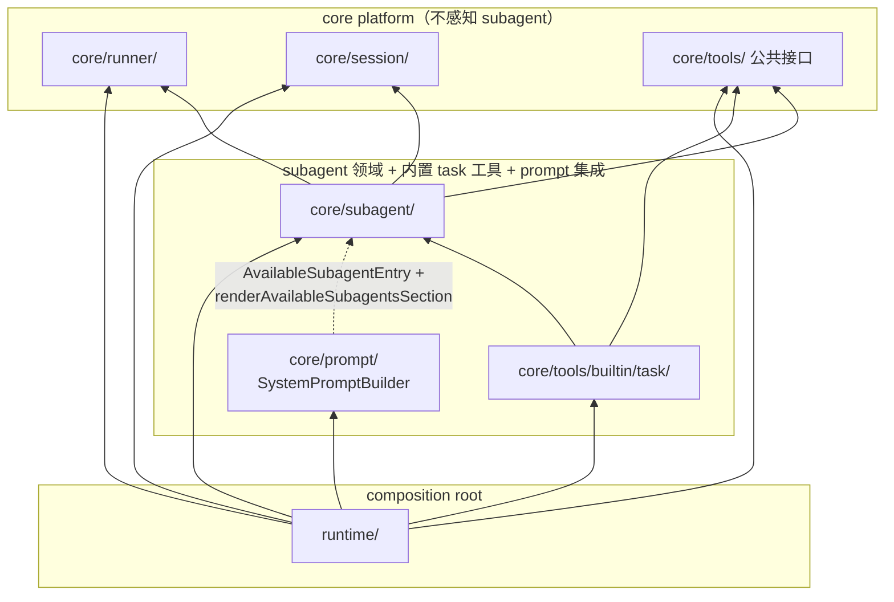
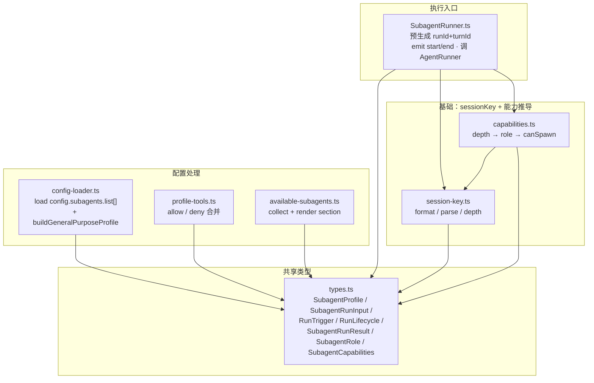
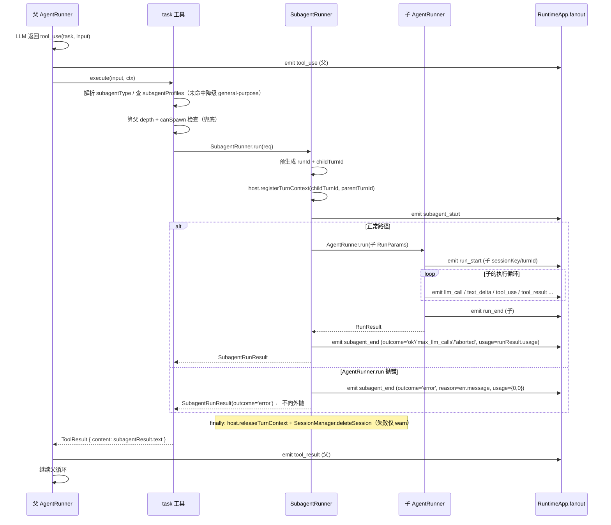
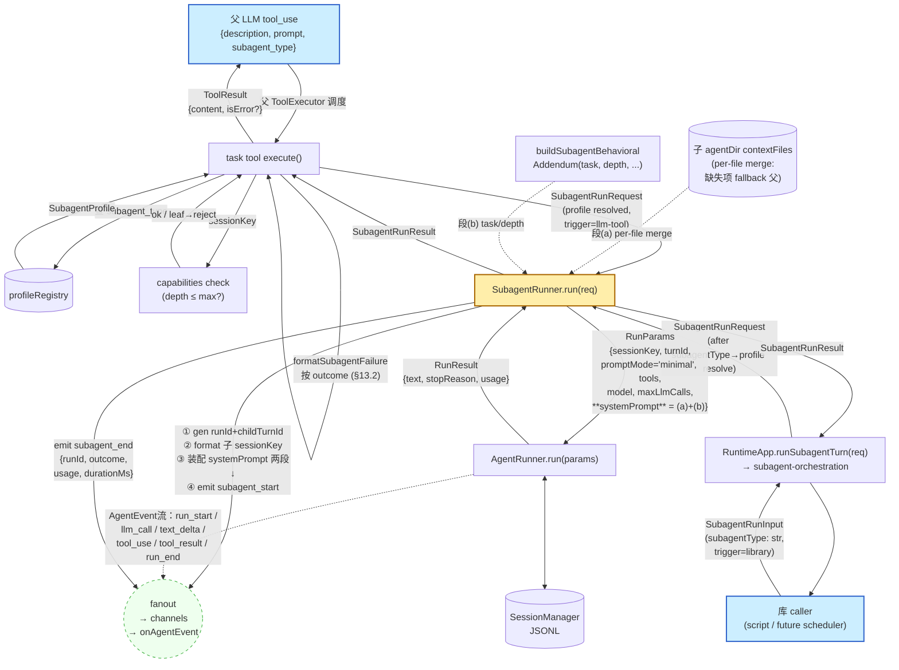

# Subagent 支持设计 Spec

> **状态：Partially Superseded（2026-09-04）。** 本文仅保留未被替代的 v1 behavior/history。Model selection、真实 Parent requirement、Runtime-owned delegation、terminal failure/Usage、Event correlation 和 cleanup 以 [Subagent Model Resolution Module Spec](subagent-model-resolution-module-spec.md) 为准。无 Parent library API、synthetic session/trigger、concrete `SubagentRunner` 和旧 host/request Contract 已删除，不再是 current capability。

> 文档日期：2026-06-18
> 分支：`feature/subagents`
> 关联文档：`current/core_runner.md` · `current/core_session.md` · `current/core_tools.md` · `current/runtime.md` · `current/core_prompt.md`
> 调研材料：用户提供的 Claude Code 2.1.178 逆向报告 `claude-code-subagent-逆向报告.md`（部分版本）；openclaw `src/agents/subagent-*`

---

## 1. 背景

my-agent 当前是单 Agent 执行框架：一次 `runTurn` 对应一个 LLM 对话循环，所有工具在同一上下文里执行。已有的"sub-agent 友好"接口（`RunTurnParams.promptMode='minimal'/'none'`、`sessionKey` 命名约定、"无 channel = fail-closed allowlist" 审批策略）只是为将来留口，**当前没有任何 spawn / delegation 机制**。

随着复杂任务的出现，**父 Agent 需要把"独立子任务"委托给一个上下文隔离的子 Agent**，理由有三：

1. **上下文保护**：子任务可能产生大量中间产物（文件读、search 结果、思考过程），如果都进入父上下文，会很快把父推向压缩。
2. **角色专门化**：审计、综述、代码评审这类任务有自己的 system prompt 与受限工具集，写在主 prompt 里会污染主 Agent 行为。
3. **并行能力（未来）**：v1 不做并行，但接口要预留得不阻碍。

参考实现：

- **Claude Code** 的 `Task` 工具 + `.claude/agents/*.md` profile 文件 + `fork / general-purpose / worker / 具名` 四类 subagent_type。
- **openclaw** 的 `subagent-*` 一整套，覆盖 spawn / registry / lifecycle / depth / role / abort 树形传播 / 跨进程通信。

my-agent 走"取其形、不取其规模"路线：吸收 Claude Code 的**对外接口形态**（task 工具、三参数 schema）+ openclaw 的**工程模式**（subagent 定义在 config、角色个性在 agentDir md 文件、depth 编码进 sessionKey、role/controlScope 推导），但**不引入**跨进程、跨网关、注册表、worktree/remote 隔离、跨 agent 通信等子系统。

---

## 2. 目标

- 父 Agent 可以通过内置工具 `task` 把独立子任务委托给一个**上下文隔离**的子 Agent 执行，子 Agent 只把最终结果返回给父。
- 子 Agent 有自己的 `sessionKey`、独立 history、独立 system prompt、独立工具集，**只把最终文本返回给父**。
- Subagent 定义在 config 的 `subagents.list[]`，角色个性放约定路径 `.agent/subagents/<id>/` 下的 md 文件（IDENTITY.md / SOUL.md 等），让用户能定义 `code-reviewer / planner / security-auditor` 等专门角色（详见 §7 决策 2）。
- 子 Agent 工具调用经父 channel 弹审批；无父 channel 时走 fail-closed allowlist（库 API 场景）。
- 子 Agent 的 `AgentEvent` 通过现有 fanout 链路转发到父 channel，UI/CLI 能区分父子。
- 实现"嵌套深度限制"：默认子 Agent 自己**没有** `task` 工具（不可再 spawn），通过 depth 阈值兜底。
- 只有真实活动 Parent 的 LLM `task` 工具可以创建 Child；Runtime-owned delegation Port 是唯一 current path。

---

## 3. 非目标

- **不做并行 spawn**：v1 一次 `task` 调用阻塞返回；同轮多 `tool_use` 在底层会串行执行（与父 toolUseBlocks 行为一致）。并行能力放到 v2。
- **不做 fork 模式**：不复制父**对话历史**（LLM messages）到子，不强制父模型。v1 子 Agent 使用自己约定目录（`.agent/subagents/<id>/`）下的 contextFiles 作为 system prompt，按文件名与父 contextFiles per-file merge（子目录缺失文件由父对应文件补齐；目录整个不存在则全部用父）——详 §决策 2 / §9.3。”不复制对话历史” ≠ “不继承 contextFiles”，二者独立。
- **不做 worktree / remote 隔离**：不创建 git worktree，不走远程沙箱。
- **不做跨 agent 通信工具**（Claude Code 的 `SendMessage`）：v1 子 Agent 之间不通信，父子之间只有"prompt 进 / final text 出"。
- **不做后台子 Agent**（`run_in_background`）：v1 全部阻塞同步。
- **不做交接安全分类器**：复用现有 `before_tool_call` 审批 hook 链，不引入二次分类层。
- **不做跨进程 / 跨网关 / ACP / cron isolated-agent**（openclaw 的全部分布式特性）。
- **不引入 attachments 给子 Agent**：v1 子 prompt 仅 string；图片附件等待 attachments PR 链稳定后再考虑。

---

## 4. 借鉴来源对比表

| 主题 | Claude Code 做法 | openclaw 做法 | my-agent v1 决策 |
|---|---|---|---|
| 入口工具 | `Task`（外名 `Agent`），三参数 `description/prompt/subagent_type` | `sessions_spawn`（参数 ~15 个） | 抄 Claude Code 形态：`task` 工具，参数 `description / prompt / subagent_type?` |
| Subagent 定义 | `.claude/agents/*.md` 单文件：frontmatter 放结构参数，body 放完整 system prompt | 无独立 profile 文件。结构参数（model、tools 等）在全局 config 的 `agents.list[]` 里；角色个性在约定目录的 IDENTITY/SOUL.md 等文件里 | **借鉴 openclaw**：结构参数放 config 的 `subagents.list[]`；角色个性放约定路径 `.agent/subagents/<id>/` 的 md 文件；不引入独立 profile 文件 |
| tools 选择 | `tools` 替换默认集；`disable-tools` 在默认集上减法；前者覆盖后者 | 复杂 allowlist/denylist 多层合并（`AgentToolsConfig.allow / deny`） | 对齐 platform-config-restructure-spec.md §5：`allow` = 直接执行，`deny` = 注册时过滤；subagent deny 叠加，allow 替换（§7 决策 5） |
| 嵌套限制 | "teammates cannot spawn teammates"（参数维度） | depth 从 session store 查询推导，结合 role（`main/orchestrator/leaf`）决定 canSpawn | 参考 openclaw role 推导概念；depth 编码进 sessionKey 为 my-agent 原创简化方案（省去 session store 查询） |
| 子 sessionKey | （二进制黑盒，不可见） | `agent:<id>:...:subagent:<n>:...`，可嵌套 | 抄 openclaw 思路，简化为 `<parent>:subagent:<turnId>:<n>` |
| Token 计费 | webview 渲染层以 `!parent_tool_use_id` 过滤，避免界面展示 double count（展示层去重，非 RunResult 设计） | 每个 session 独立记录 usage，查询时按 session 粒度报，天然不重叠 | 树形累加：`RunResult.usage` = 自身 + 所有子孙消耗之和；`subagent_end.usage` 供细粒度分析（详见 §7 决策 6） |
| 审批 | 有"交接安全分类器" + 父继承 | gateway 层多策略 | `tools.allow`（直接执行）/ `tools.deny`（注册时过滤）+ 父 channel 通路；subagent deny 叠加，allow 替换（详见 §7 决策 5 / 决策 7） |
| 事件命名 | `SubagentStart / SubagentStop / TaskCreated / TaskCompleted`（4 个） | `subagent-complete / subagent-error / subagent-killed / session-reset / session-delete`（5 个 reason）+ outcome | 折中：v1 两个事件 `subagent_start / subagent_end`，但 `subagent_end.reason` 命名抄 openclaw（向上兼容扩展） |
| Profile 注入 prompt | 运行期消息 `Available agent types for the Agent tool: ...` | 复杂 | 抄 Claude Code：`SystemPromptBuilder` 增 `<available-subagents>` 段 |
| fork 模式 | 继承父全部 history + 强制父模型 | 无对应 | v1 不做，不暴露字段；v2 用户提需求时再加。**注**：fork（复制对话历史）不等于父 contextFiles 继承；后者是 openclaw 双层模型的 v1 静态默认行为（§决策 2） |
| 隔离 | `isolation: worktree / remote` | sandbox 配置 | v1 不做。cwd 字段在 v1 未引入；未来 v2 如需 per-subagent 工作目录隔离再重新设计（见 §14）。 |
| 通信 | `SendMessage` 工具 | gateway 路由 | v1 不做，无对应字段 |
| 后台 | `run_in_background` + 通知 | gateway 异步任务 | v1 不做，无对应字段 |

---

## 5. 现状盘点

| 层 | 现状 | 影响 |
|---|---|---|
| `RunTurnParams.promptMode` | 已含 `'full' / 'minimal' / 'none'`（[src/runtime/types.ts](../../src/runtime/types.ts#L86)） | 子 Agent 直接传 `'minimal'`，无需扩展 |
| `sessionKey` | 任意字符串，已规划 `"subagent:xxx"` 命名（[current/core_session.md](./current/core_session.md) §3） | depth 编码方案直接可用，无需 schema 改动 |
| `SessionManager` | append-only JSONL + sessions.json 元数据，已支持 `spawnedBy?` 字段 | 子 Agent 直接复用，写入到同一目录 |
| 审批策略 | `wireApprovalRouting` 始终装 hook，无 channel 时仅 `tools.allow` 内可执行（fail-closed） | `SubagentRunner` 通过 `SubagentHostBindings.registerTurnContext(childTurnId, parentTurnId)` 把子 turn 绑到父路由（详 §8.5）；per-subagent tools.allow/deny 在 `before_tool_call` hook 里按 sessionKey 查取（详见 §7 决策 5 / 决策 7） |
| `AgentRunner` | 纯执行引擎，接收最小参数子集，不调 `loadConfig()` | `SubagentRunner` 可直接复用，无需在 runner 内开洞 |
| `ToolExecutor` | `(name, input) => Promise<ToolResult>`，错误转 `isError`，不向外抛 | `task` 工具按此契约实现即可 |
| `SystemPromptBuilder` | 6 个 active section（`tool-definitions` slot 已停用，代码保留但未渲染） | 新增两个 section（workspace + available-subagents），详见 §11 |
| `Channel.send(event)` | RuntimeApp fanout 闭包向所有 channel 广播 | 子 Agent event 进入同一 fanout，channel 侧按 `trigger.source + sessionKey + runId` 区分父子 / 计划任务 |
| `AgentEvent` | 11 种 variant，含 `sessionKey / turnId` | 新增 `subagent_start / subagent_end` 两种；其他 variant 不变，子 Agent 直接共用 |
| `inFlightSessions: Set<string>` | per-sessionKey 串行 gate，跨 session 天然并发（[src/runtime/RuntimeApp.ts](../../src/runtime/RuntimeApp.ts)） | 子 Agent 用独立 sessionKey 即自动获得 "跨 run 并发"；这也是未来 cron 跨 job 并发的依据 |
| 并行扩展路标 | 同一轮多 `tool_use` block **串行**执行（[core_runner.md](./current/core_runner.md) §5） | v1 接受；并行 `task` 等扩展见 §14 v2+ 路标 |

---

## 6. 模块布局

### 6.1 总体原则

- **新增首选 `core/subagent/`**：subagent 特有逻辑全部集中，防止散落到 `core/runner/` 或 `runtime/`。
- **仅扩展，不重写**：`AgentRunner / SessionManager / SystemPromptBuilder` 的现有公共方法不改；只加 section 渲染 / `AgentEvent` union variant 这些加法改动。
- **保持 `RuntimeApp` 瘦**：subagent 装配 / 事件构造抽到 `runtime/subagent-orchestration.ts`，与现有 `tool-approval-policy.ts` / `prompt-factory.ts` 同风格。
- **`task` 工具是有状态工厂**：不能像 `webFetchTool` / `execTool` 那样无状态导出，必须接受 SubagentRunner / profile registry / depth provider 依赖。

### 6.2 新增与修改的文件清单

```
src/core/subagent/                                  ← 新模块
├── types.ts                                        # subagent-specific 类型：
│                                                    SubagentProfile / SubagentRunRequest /
│                                                    SubagentRunResult / SubagentRole / SubagentCapabilities
│                                                  # "通用执行契约"类型临时也住在这：
│                                                    SubagentRunInput / RunTrigger / RunLifecycle
│                                                  # （v2 scheduler PR 考虑上提；详见 §16 #6）
├── session-key.ts                                  # sessionKey 命名 / depth 推导（§7 决策 3）：
│                                                    formatSubagentSessionKey({ rootLabel, runId, depth })
│                                                    parseSubagentSessionKey(key) → { rootLabel, runId, depth, isSynthetic }
│                                                    getSubagentDepth(key) → 数 `:subagent:` 出现次数
│                                                    isSubagentSessionKey(key) → 是否含 `:subagent:`
│                                                  # isSynthetic = true 当 rootLabel 为 library 合成标签
│                                                  # （跨模块复用时考虑迁到 core/session/）
├── capabilities.ts                                 # resolveSubagentCapabilities（depth → role → canSpawn）
├── config-loader.ts                                # 从 config.subagents.list[] 解析 SubagentProfile[]
│                                                  # + 启动期校验（id 格式 / 保留名 / allow 含 task 等）
│                                                  # + buildGeneralPurposeProfile(opts) 内置 general-purpose 工厂
├── profile-tools.ts                                # 基于 SubagentProfile 合并出子 Agent 工具集
│                                                  # （allow / deny / 防递归剔除 task）
├── behavioral-addendum.ts                          # buildSubagentBehavioralAddendum(opts) → string
│                                                  # 输出：子 Agent 行为约束 + 任务描述 + session 上下文
│                                                  # 参考 openclaw buildSubagentSystemPrompt() 的精简版
├── available-subagents.ts                          # 给 SystemPromptBuilder 的 <available-subagents> section：
│                                                    AvailableSubagentEntry 类型
│                                                    collectAvailableSubagents(profiles, opts)
│                                                    renderAvailableSubagentsSection(entries) 字符串输出
├── SubagentRunner.ts                               # 薄壳，mirror AgentRunner 风格（§8.5）：
│                                                  #   class SubagentRunner {
│                                                  #     constructor(deps: SubagentRunnerDeps)
│                                                  #     run(req: SubagentRunRequest): Promise<SubagentRunResult>
│                                                  #   }
│                                                  # 构造期 deps SubagentRunnerDeps（由 runtime 注入，一次性）：
│                                                  #   • agentRunner / sessionManager / onEvent / logger
│                                                  #   • host: SubagentHostBindings（路由回调 + 配置 getter，§8.5）
│                                                  #   • loadContextFilesFromDir: (absDir) => Promise<ContextFile[]>
│                                                  # run(req) 步骤（req = SubagentRunRequest）：
│                                                    • **预生成** runId（UUID）+ childTurnId（UUID）
│                                                    • 根据 trigger.source 拼出子 sessionKey（§7 决策 3）
│                                                    • host.registerTurnContext(childTurnId, req.parentTurnId)
│                                                    • 装配子 system prompt 两段（§7 决策 2）：
│                                                       (a) 子 agentDir contextFiles 与 host.getParentContextFiles() per-file merge
│                                                       (b) buildSubagentBehavioralAddendum(...)——task / depth
│                                                    • 组装 RunParams（sessionKey / promptMode='minimal' / turnId / systemPrompt）
│                                                    • emit subagent_start（携带 runId + childTurnId，与后续 run_start.turnId 一致）
│                                                    • try {
│                                                         runResult = await AgentRunner.run(RunParams)
│                                                         emit subagent_end({ outcome: 推断('ok' | 'max_llm_calls' | 'aborted'), usage: runResult.usage })
│                                                         return SubagentRunResult(runResult)
│                                                       } catch (err) {
│                                                         emit subagent_end({ outcome: 'error', reason: err.message, usage: {0, 0} })
│                                                         return SubagentRunResult({ outcome: 'error', text: '', usage: {0, 0}, reason })
│                                                         // **不外抛**，转 SubagentRunResult 由 task.execute 按 §13.2 处理
│                                                       } finally {
│                                                         host.releaseTurnContext(childTurnId)
│                                                         SessionManager.deleteSession(childSessionKey)     // 失败仅 log warn，§决策 11
│                                                       }
└── index.ts                                        # 仅导出公共 API
```

```
src/core/tools/builtin/task/                        ← 新内置工具
├── task-tool.ts                                    # createTaskTool(deps): Tool
│                                                  #   deps = {
│                                                  #     subagentRunner: SubagentRunner;
│                                                  #     profileRegistry: ReadonlyMap<id, SubagentProfile>;
│                                                  #     getSubagentCapabilities: (sessionKey) => SubagentCapabilities;
│                                                  #     maxDepth: number;
│                                                  #   }
└── index.ts                                        # 导出 createTaskTool + TaskToolDeps 类型
```

```
src/core/prompt/SystemPromptBuilder.ts              ← 修改：增一个 section 渲染分支
                                                    数据由 prompt-factory 通过 buildSystemPromptParams 注入
                                                    渲染逻辑调用 core/subagent/available-subagents.ts 的 render…
```

```
src/core/runner/types.ts                            ← 修改：仅扩展 AgentEvent union
                                                    （加 subagent_start / subagent_end，含 runId / lifecycle / trigger）
```

```
src/runtime/                                        ← 装配变更（不改 AgentRunner）
├── types.ts                                        # 不改 RuntimeResourceSet——subagentProfiles / subagentRunner
│                                                  # 依赖 RuntimeApp 实例状态（routeContextByTurn），住在 RuntimeApp
│                                                  # 自己的 private field 而非 ResourceSet（详 impl §PR-6）
├── bootstrap.ts                                    # 启动期从 config.subagents.list[] 加载 SubagentProfile[]
│                                                  # （bootstrap 只构造 profileRegistry 静态数据；SubagentRunner
│                                                  # 装配延后到 RuntimeApp.create 内，因为依赖 routeContextByTurn）
├── tool-registry.ts                                # 新增 buildTaskToolIfEnabled(deps): Tool | null
│                                                  # subagents.enabled === false 返回 null
├── prompt-factory.ts                               # buildSystemPromptParams 增 availableSubagents 字段
│                                                  # 数据来自 collectAvailableSubagents(...)
├── subagent-orchestration.ts                       # 新文件：代 RuntimeApp 完成
│                                                  #   • createSubagentHostBindings(...) 工厂（产 host）
│                                                  #   • runSubagentTurn(...) 库 API 入口实现
│                                                  #   • v2 位置：dispatchDetachedRun(...) 将添加在这里
└── RuntimeApp.ts                                   # 新增：
                                                   #   • private subagentProfiles! / subagentRunner!（create() 内填充）
                                                   #   • runSubagentTurn(input) 薄壳，内部调 subagent-orchestration
                                                   #   • create() 后置装配 host + SubagentRunner + task tool
```

### 6.3 未来扩展位（v2+，本 spec 不实现）

```
src/runtime/subagent-orchestration.ts               ← 未来：增 dispatchDetachedRun(...) +
                                                       activeDetachedRuns registry。RuntimeApp 不需再拆文件。
```

### 6.4 依赖方向（必须不反转）

```
runtime/                          依赖  core/subagent/
core/subagent/                    依赖  core/runner / core/session / core/prompt / core/tools
core/tools/builtin/task/          依赖  core/subagent（工厂签名） + core/tools 的公共接口
core/prompt/SystemPromptBuilder   依赖  core/subagent/available-subagents 的渲染函数 + 类型
```

**`core/subagent/` 不依赖 `runtime/`**（composition root 完整在 runtime 层）。`task` 工具从 `core/tools/builtin/` 依赖 `core/subagent/` 是一个特例：其他内置工具都不依赖 subagent 模块。

> **已知 v1 违规（FIXME, v2 修）**：`core/runner/types.ts` 的 `AgentEvent` union 末尾的 `subagent_start / subagent_end` variant 含 `trigger: RunTrigger` 字段，该类型住在 `core/subagent/types.ts`——意味着 `core/runner/` 反向 import `core/subagent/`，与本节"runner 不依赖 subagent"的方向冲突。v1 接受此违规以缩 PR 体积（拆 `SubagentEvent` 独立 union 需要同步改 channel / fanout 签名）。v2 修复方向：把 subagent 事件拆到 `SubagentEvent` union 住进 subagent 模块，fanout 改吃 `AgentEvent | SubagentEvent`。详 impl §PR-2 FIXME 注释。

### 6.5 静态架构图

两张图互补：第一张看跨模块分层（谁依赖谁）；第二张看 `core/subagent/` 内部文件职责与内部依赖。

#### 6.5.1 跨模块依赖（高层）

箭头方向：`A --> B` 表示 A 依赖 B。虑线 = 仅类型 / 纯函数依赖（无运行时耦合）。



要点：

- **所有实线都是单向向下**：L1 装配 L2/L3，L2 依赖 L3，L3 不感知上层。
- `PROMPT -.-> SUB` 用虑线表示"仅类型与纯函数依赖"：`SystemPromptBuilder` 只 import `AvailableSubagentEntry` 类型与 `renderAvailableSubagentsSection` 纯函数，不接触 `SubagentRunner` 运行时产物（详 §11）。
- `TASK --> SUB` 是唯一的"内置工具依赖领域模块"例外（依 `SubagentRunner` / `profileRegistry` / `getSubagentCapabilities` 装配）。
- `runtime/` 是唯一调 `loadConfig()` 的层，其他所有模块只接受在 ResourceSet 里提炼过的参数。

```
ASCII 备用（mermaid 渲染失败时参考）：

  ┌─────────────────────────────────────────────────────────┐
  │ L1 composition root                                     │
  │                        runtime/                         │
  └──┬──────┬──────┬──────┬──────┬──────────────────────┬──┘
     │      │      │      │      │                      │
     ▼      ▼      ▼      ▼      ▼                      ▼
  ┌──────────────────────────────────────────────────────────────┐
  │ L2 subagent 领域 + 内置 task 工具 + prompt 集成              │
  │  core/subagent/   core/tools/builtin/task/   SystemPromptBuilder │
  │       ▲                    │                      ╎          │
  │       └────────────────────┘              (类型/纯函数)      │
  └──┬──────────────────────────────────────────────────────┬───┘
     │                                                      │
     ▼                                                      ▼
  ┌──────────────────────────────────────────────────────────────┐
  │ L3 core platform（不感知 subagent）                          │
  │   core/runner/      core/session/      core/tools/ 公共接口  │
  └──────────────────────────────────────────────────────────────┘

  实线 = 运行时依赖  ╎ = 仅类型/纯函数依赖
```

#### 6.5.2 `core/subagent/` 内部（文件层）

三层结构：共享类型 → 基础函数 → profile 处理 + 执行入口。



要点：

- `types.ts` 是零依赖叶节点（其他文件都指向它）。
- `capabilities.ts` 是 `session-key.ts` 之上的薄封装（只调 `getSubagentDepth`）。
- `SubagentRunner` 依赖基础层 (`types`/`sk`/`cap`)；Profile 处理三个文件被 `runtime/bootstrap.ts` 装配后依初始化顺序调用，与 `SubagentRunner` 同层但不直接依赖彼此。
- `available-subagents.ts` 同时被 `runtime/prompt-factory.ts` （采集）和 `core/prompt/SystemPromptBuilder` （渲染）调用——跨模块门面，详 §11。

```
ASCII 备用（mermaid 渲染失败时参考）：

  ┌─────────────────────────────────────────────────────────────────┐
  │ 共享类型                                                        │
  │   types.ts  (SubagentProfile / SubagentRunInput / RunTrigger /        │
  │              RunLifecycle / SubagentRunResult /                  │
  │              SubagentRole / SubagentCapabilities)                │
  └───────┬──────────────┬──────────┬─────────┬──────────┬──────────┘
          │              │          │         │          │
          ▼              ▼          ▼         ▼          ▼
  ┌──────────────┐  ┌───────────────────────────────────────────────┐
  │ 基础层       │  │ 配置处理层                                    │
  │ session-     │  │ config-loader.ts  profile-tools.ts            │
  │   key.ts     │  │ available-subagents.ts                        │
  │      ▲       │  └───────────────────────────────────────────────┘
  │ capabilities │
  │   .ts        │  ┌───────────────────────────────────────────────┐
  └──────────────┘  │ 执行入口                                      │
          ▲         │ SubagentRunner.ts                             │
          └─────────┤   → 预生成 runId+turnId                       │
                    │   → emit start/end · 调 AgentRunner           │
                    └───────────────────────────────────────────────┘

  SubagentRunner 依赖 types + session-key + capabilities
  配置处理层各文件由 runtime/bootstrap.ts 装配，互不直接依赖
```

---

## 7. 核心决策

### 决策 1：子 Agent = 同进程阻塞调用，**不是**新进程 / 不是 actor

**采用**：父 `task` 工具的 `execute()` 内部 `await SubagentRunner.run(...)`，子完成后用 `final text` 作为 `ToolResult.content` 回到父循环。

理由：

- my-agent 是"可嵌入的库"，多进程把它推向 openclaw 那种网关架构，违反定位。
- 同进程 = 复用 Core `ModelInvocationPort` binding / `SessionManager` / `Logger`，零额外资源管理。
- 阻塞返回 = LLM 端的语义最自然（一个 tool call，一个 result）。
- 库调用方需要异步时，外层用 `Promise.all`，runtime 不引入额外异步基建。

代价：

- 单条 turn 时长可能成倍延长（父 LLM 等子 Agent 跑完）。可接受，等用户提"想并行"再做 v2。
- 父 abort 通过同一个 `AbortSignal` 自然透传到子 Agent：RuntimeApp 创建 per-session `AbortController`，AgentRunner 将 `RunParams.signal` 传入 `ToolContext.signal`，`task` 工具再传给 SubagentRunner 和子 Runner。子 Agent 以 `outcome='aborted'` 正常返回。详见 [core-abort-spec](./core-abort-spec.md)。

**注：阻塞调用是 v1 的范围约束，不是最终设计。** 复杂任务场景下父 agent 需要并行派发多个独立子任务，串行会导致时间成倍增长。v2 将在 `AgentRunner` tool 循环层面支持同轮多 `task` 并发（详见 §14 v2+ 路标）。

### 决策 2：子 Agent system prompt = **subagent 约定目录的 contextFiles + 动态 addendum**（借鉴 openclaw）

**采用**：子 Agent 的 system prompt 按两段拼装：

```
① 子约定目录（.agent/subagents/<id>/）的 contextFiles（IDENTITY.md / SOUL.md / AGENTS.md / TOOLS.md），按 per-file 规则与父 contextFiles merge：
   - 子目录存在且某文件存在 → 用子目录文件
   - 子目录存在但某文件缺失 → 该文件 fallback 到父 agent workspace 对应文件
   - 子目录整个不存在 → 全部 fallback 到父 contextFiles（不自动创建目录）
② buildSubagentBehavioralAddendum(...) 动态生成：”你是 subagent + 任务 X + 不要装父 + ...”
```

Subagent 定义在 config 的 `subagents.list[]` 里，每条记录包含结构参数（id、description、model、tools、maxLlmCalls）。角色个性由约定路径 `.agent/subagents/<id>/` 下的 md 文件承载，不在 config 里写文字，路径不可配置（对齐 `platform-config-restructure-spec.md §4.1`）。

```json
{
  "subagents": {
    "list": [
      {
        "id": "code-reviewer",
        "description": "Use this agent to audit code for OWASP issues and obvious bugs before merge.",
        "model": "inherit",
        "tools": {
          "deny": ["exec", "write_file", "apply_patch", "edit_file"]
        },
        "maxLlmCalls": 20
      }
    ]
  }
}
```

约定目录下可放：

```
.agent/subagents/code-reviewer/
  IDENTITY.md   ← “你是专注安全审计的 agent，focus on injection, authn/z, secrets...”
  SOUL.md       ← 可选，覆盖通用风格
```

目录不存在 → 视为匿名 subagent，直接用父 contextFiles + addendum，不自动创建目录。

**匿名 subagent**（`subagent_type` 省略或 `'general-purpose'`）：子 system prompt = 父的 contextFiles + addendum，**运行时探测到 `agentDir` 路径的目录不存在**（`agentDir` 字段本身仍为字符串，详 §8.1 / §9.4 末尾 NOTE）。适合 cron / 库 API 临时派遣无需预定义的场景。

理由：

- 与 openclaw 设计一致：结构参数在 config，角色个性在约定目录的 md 文件，两者各司其职。
- 用户熟悉的编辑体验：角色个性写在 md 文件里，比写在 config 字符串字段里可读性好得多。
- 支持匿名 subagent：config 里没有条目时直接降级为 general-purpose，不报错（§7 决策 10）。
- 约定路径消除可配置 `agentDir` 带来的路径混乱（对齐 `platform-config-restructure-spec.md §4.1`）。
- 与 my-agent 现有 `SystemPromptBuilder` 多源动态装配同源（主 agent prompt 本来就是 IDENTITY/SOUL/AGENTS/TOOLS 拼装；MEMORY 不进 prompt，由 memory_* 工具运行时按需读，详 §9.3）。

代价：

- 新增具名 subagent 需要改 config + 建目录，比单文件方案多一步。
- 调试时需同时看约定目录的 md 文件 + addendum 两段拼接结果；logger 记录完整 prompt。

加载时机：

- `RuntimeApp.create()` 启动时从 config 读取 `subagents.list[]`，缓存到 `RuntimeApp` 的 private `subagentProfiles: ReadonlyMap<id, SubagentProfile>` 字段（实例状态）。
- 约定目录的 md 文件在子 Agent 首次运行时按需加载（与主 agent contextFiles 加载同路径），不在启动期预读。
- config 改动后重启 RuntimeApp 生效；约定目录下 md 文件改动无需重启（每次 run 重新读取）。

### 决策 3：depth 编码进 sessionKey，**不是** 注册表

**采用**：openclaw 的方案。子 sessionKey 使用统一格式，与 trigger 类型无关：

```
通用格式（所有 trigger 共用）：
  <rootLabel>:subagent:<runId>:<depth>

根据 trigger.source 填充 rootLabel：
  'llm-tool'  → rootLabel = parentSessionKey（如 'main'）
  'library'   → rootLabel = callerLabel || 'library'（合成标签，不指向真实 session）

runId 由 SubagentRunner 预生成（UUID），与 subagent_start/end 事件中的 runId 一致。
depth 始终从父 depth + 1 推导（root 层为 0、library/scheduled/webhook 的第一层子为 1）。

示例：
  main:subagent:abc-123:1                            ← llm-tool 入口的子
  my-script:subagent:def-456:1                       ← library 入口 (callerLabel='my-script')
  library:subagent:ghi-789:1                         ← library 入口 (无 callerLabel)
  main:subagent:abc-123:1:subagent:jkl-012:2         ← v2 嵌套 (depth=2，maxDepth>=2 才能出现)
```

`getSubagentDepth(key)` 实现就是数 `:subagent:` 出现次数。`parseSubagentSessionKey(key)` 返回 `{ rootLabel, runId, depth, isSynthetic }`，其中 `isSynthetic = true` 当 rootLabel 不指向真实 session（library 入口）。

理由：

- 完全 stateless，启动时无需读 registry。
- 与 my-agent 现有"sessionKey 是任意字符串"的设计 0 冲突。
- depth 上限默认 1（即父可以 spawn 子，但子默认拿不到 `task` 工具——这是双保险）：
  - 第一层防护：子 Agent 的 `allow` 默认集**不含** `task`。
  - 第二层防护：`task.execute()` 入口算 depth，超过 `maxDepth`（默认 1）直接返回 error，即使工具集被错配也兜得住。

### 决策 4：role 推导 = openclaw 的 `main / orchestrator / leaf`

照搬 [openclaw/src/agents/subagent-capabilities.ts](../../../openclaw/src/agents/subagent-capabilities.ts) 的语义，但去掉 sessionStore lookup（depth 直接从 key 算）：

```
depth 0                              → main
0 < depth < maxDepth         → orchestrator   (canSpawn=true)
depth >= maxDepth            → leaf           (canSpawn=false)
```

v1 默认 `maxDepth=1`，于是只有 `main` 和 `leaf` 两种状态——`orchestrator` 当前出现不了，但语义/类型保留，未来调大上限即生效。

### 决策 5：tools 选择规则

`tools.allow` / `tools.deny` 承载三档语义（对齐 `platform-config-restructure-spec.md §5`）：

| 工具所在位置 | 结果 |
|---|---|
| 在 `deny` | **禁用**：工具注册时即被过滤，LLM 完全感知不到 |
| 在 `allow`（且不在 `deny`） | **直接执行**：`before_tool_call` hook 短路，跳过审批 |
| 既不在 `allow` 也不在 `deny` | **需审批**：有父 channel 时弹 prompt，无 channel 时 fail-closed 拒绝 |

`deny` 优先于 `allow`：同一工具同时出现在两者中，按 deny 处理——工具在注册时已被过滤，运行时 allow hook 永远不会为它触发。

**Subagent 的 allow / deny 降级规则（不对称设计）：**

| 字段 | 不写 | 写了 |
|---|---|---|
| `allow` | 降级用主 agent 的 `tools.allow` | **替换**：仅用 subagent 自己的，不与主 agent allow 叠加 |
| `deny` | 降级用主 agent 的 `tools.deny` | **叠加**：在主 agent deny 基础上再追加 |

不对称是有意为之：`deny` 叠加保证 subagent 不比主 agent 更宽松（安全底线）；`allow` 替换保证 subagent 能独立缩小免审批面（隔离精准控制）。详见 `platform-config-restructure-spec.md §5.3`。

`allow` 字段里**v1 不允许**出现 `task`，config loader 启动期校验，写了就报错——防递归。未来调大 `maxDepth` 才会放开。

### 决策 6：Token 计费——树形累加

**累加规则：每个节点的 `RunResult.usage` = 自身消耗 + 所有直接子节点的 `RunResult.usage`（子节点已递归累加其子孙）。**

```
agent -> subagent1 -> subagent2
           -> subagent3

subagent2.RunResult.usage = subagent2 自身
subagent1.RunResult.usage = subagent1 自身 + subagent2.usage
subagent3.RunResult.usage = subagent3 自身
agent.RunResult.usage     = agent 自身 + subagent1.usage + subagent3.usage
                          = 整棵树所有节点之和
```

调用方不需要任何额外操作即可拿到总消耗。想做细粒度分析时，每个节点的 `*_end` 事件里携带该节点自己那一层的 `usage`（不含子节点），从事件流取。

具体规则：

- **`RunResult.usage`（返回值）= 自身 + 所有子孙累计**，调用方开箱即用拿到总消耗（v1 blocking 全可靠；v2 detached 例外见下）。
- **`subagent_end` 事件的 `usage` 字段携带该 subagent 自己那一层的 usage**（**不含**子孙；子孙各自通过它们的 `subagent_end` 事件独立暴露）。订阅者按事件流自行选粒度——想看单节点就读各自 `subagent_end.usage`，想看子树总和就读那一层的 `RunResult.usage`（或对子树 `subagent_end.usage` 求和）。
- 两条数据通路语义正交，**不重复**：单 turn 视图（事件 = 自身）；树视图（return value = 自身 + 子孙）。
- `task` 工具返回的 `ToolResult.content` 只放子的最终文本，**不**把 usage 序列化进去（否则父 LLM 会"看到"，污染思维）。

**v2 detached 说明**：v1 所有 subagent 生命周期均在父 turn 内（blocking），树形累加完全可靠。v2 引入 detached lifecycle 后，子 agent 在父 turn 结束后继续运行，结果通过 push-based announce（类似 Claude Code 的 `<task-notification>` 或 openclaw 的 announce flow）注入父 session——前提是父 session 仍然存活。此时 detached subagent 的 usage 无法纳入父的 `RunResult.usage`（父已经返回），需要独立的持久化机制，届时单独设计。**因此 v1 的"自身+子孙"承诺隐含限定：所有子孙均为 blocking 模式（v1 唯一选项）**。

参考：Claude Code 在 webview 渲染层以 `!parent_tool_use_id` 过滤避免界面展示 double count——这是前端去重，不是 RunResult 设计。openclaw 每个 session 独立记录 usage，查询时按 session 粒度报。

### 决策 7：审批策略 = 父 channel 通路 + 分层 allow/deny

**Allow/deny 分层（对齐 `platform-config-restructure-spec.md §5`）：**

主 agent 的 `tools.allow / deny` 是所有 subagent 的 fallback：

- Subagent 不写 `tools.deny` → 继承主 agent 的 deny 列表（安全底线不降低）
- Subagent 不写 `tools.allow` → 继承主 agent 的 allow 列表
- Subagent 写了任一字段 → 按 §7 决策 5 的叠加 / 替换规则处理

不再有独立的 `approval` config。旧的 `tools.approval.allow / deny` 与 per-subagent `approval` 字段已删除（详见 `platform-config-restructure-spec.md §8.2`）。

**Prompt 通路：**

subagent turn 启动前，`SubagentRunner` 调 `host.registerTurnContext(childTurnId, parentTurnId)` 把子 turn 绑到父 turn 的 origin route。host 内部查 `routeContextByTurn.get(parentTurnId)` 拿到父的 `MessageRouteContext`，然后以 `childTurnId` 为 key 重新登记：

```typescript
// SubagentHostBindings 实现例（runtime/subagent-orchestration.ts中）
registerTurnContext(childTurnId: string, parentTurnId: string): void {
  const parentCtx = this.routeContextByTurn.get(parentTurnId);
  if (parentCtx) {
    this.routeContextByTurn.set(childTurnId, parentCtx);
  }
  // 父 ctx 不存在（库 API 入口）时不登记；before_tool_call hook 查不到自然 fail-closed
}
```

`wireApprovalRouting` 的 `before_tool_call` hook 逻辑不变，自动通过 `turnId` 找到父 channel。三档策略（allow → deny → prompt）照常生效，prompt 请求通过父 channel 推给用户。

**无父 channel 时**（库 API 直接调用 `runSubagentTurn`，无 UI）：parentTurnId 未登记过，host.registerTurnContext 查不到什么也不做；before_tool_call hook 查 routeContextByTurn 为 undefined → `hasApprovalCapability = false`，自动退化为 fail-closed——只有 allow list 内的工具可执行。

**`before_tool_call` hook 里的 allow/deny 解析：**

```
isSubagentSessionKey(sessionKey)
  → true：查 subagentProfiles.get(id)?.tools.allow，有则用它，无则 fallback 主 agent tools.allow
            查 subagentProfiles.get(id)?.tools.deny，与主 agent tools.deny 叠加（不替换）
  → false：用主 agent tools.allow / tools.deny
```

不引入 Claude Code 的"交接安全分类器"——my-agent 没有 LLM 分类器预算。

### 决策 8：事件 = 复用 `AgentEvent` + 新增两个 subagent 专属（含 trigger 区分）

不为子 Agent 创建独立事件流。子的所有 `text_delta / tool_use / tool_result / llm_call / compaction_*` 全走原有 channel.send 通路，靠 `sessionKey + turnId + runId` 区分。

新增两个事件标记"一次 Run 的边界"：

```
| { type: 'subagent_start';
    runId: string;               // 执行实例 id（区别于 turnId）
    sessionKey;                  // 子的 sessionKey
    turnId;                      // 子第一个 turn 的 id（与 run_start.turnId 相同）
    depth: number;
    subagentType: string;        // 'general-purpose' | profile.id
    lifecycle: 'blocking';
    trigger: RunTrigger;         // discriminated union，见 §8.2
  }

| { type: 'subagent_end';
    runId;
    sessionKey;
    turnId;
    depth;
    subagentType;
    lifecycle: 'blocking';
    trigger: RunTrigger;
    outcome: 'ok' | 'error' | 'aborted' | 'max_llm_calls';   // 'aborted' 预留给将来 abort 子系统，v1 不会产生
    reason?: string;
    usage: TokenUsage;           // 子自身的 usage，独立暴露
    durationMs: number;
  }
```

**为什么 parent* 字段不再独立列出**：v1 通过 `trigger.source = 'llm-tool'` variant 携带 `parentSessionKey / parentTurnId / parentToolUseId`；`source = 'library'` 时无父。把这些字段抽进 union 保证未来扩展时事件 schema 零 breaking change。

事件在两种入口都出现（v1）：

| 入口 | trigger.source | 实现状态 |
|---|---|---|
| `task` 工具被 LLM 调用 | `'llm-tool'` | ✅ v1 |
| `RuntimeApp.runSubagentTurn(...)` 库 API | `'library'` | ✅ v1 |

时序（详见 §10）：

```
父 tool_use(task)
  → subagent_start  trigger.source='llm-tool'  (子入队前)
  → run_start                                  (子自身，with 子 sessionKey)
  → llm_call / text_delta / tool_use ...       (子内部正常事件)
  → run_end                                    (子自身)
  → subagent_end                               (与 run_end 几乎同时)
父 tool_result(task)                            (回到父循环)
```

### 决策 9：入口 = LLM 工具 + 库 API 两种，共用 SubagentRunner；签名通过 trigger union 区分

- **LLM 工具入口** `task`：让父 LLM 自主决策何时 spawn、spawn 给谁。trigger 为 `'llm-tool'` variant。
- **库 API 入口** `RuntimeApp.runSubagentTurn(input: SubagentRunInput)`：测试 / 编排脚本可以绕过 LLM 直接跑子 Agent。trigger 为 `'library'` variant。

两个入口都先构造 `SubagentRunInput`（§8.2，含 `subagentType: string`），再在自己的边界把 `subagentType` 解析为 `profile: SubagentProfile`（含 fallback + warn log，§决策 10），最后调用 `SubagentRunner.run(req: SubagentRunRequest)`（§8.5）：

```ts
subagentRunner.run({
  profile,                       // 已解析（含 fallback）的 SubagentProfile；profile.id 即 effective subagentType
  description,                   // 短标签
  prompt,                        // 子的 user message
  trigger,                       // RunTrigger 区分 llm-tool / library 入口
  lifecycle: 'blocking',         // v1 only
  signal,                        // 可选：来自父 ToolContext 或 caller；v1 仅入口检查
  parentSessionKey,              // 父 sessionKey
  parentTurnId,                  // 父 turnId（host 表的查询键；§8.5）
}): Promise<SubagentRunResult>
```

进入 `SubagentRunner.run()` 后只看 `profile`，不再接触 `subagentType` 字符串。详 §8.5。

**v1 关键约定**：

- 不再使用 `'manual:<uuid>'` 这种占位字符串塞 parentToolUseId——`trigger: { source: 'library' }` 直接表达"无父"，下游 channel / UI 看 `trigger.source` 自决渲染。
- `runId` 由 `SubagentRunner` 内部生成（UUID），写入事件与 `SubagentRunResult`。runId ≠ turnId（runId 是整次执行实例的标识，turnId 是某次 LLM 推进的标识）。

### 决策 10：subagent_type 解析

抄 openclaw "匿名默认 + 具名定制"路线（§决策 2），**LLM 入口与库 API 入口在未命中时行为不同，这是有意为之**：

- `subagent_type` 省略 或 `'general-purpose'`（保留名）→ **匿名 subagent**。子 system prompt = 父 contextFiles + addendum，运行时探测到 `agentDir` 目录不存在（详 §9.4 末尾 NOTE）。cron / 库 API 派遣 / 临时任务首选。
- `subagent_type: <id>` → 查 `subagentProfiles.get(id)`：
  - **LLM 工具入口**（`task` 被 LLM 调用）未命中 → **降级为 general-purpose**（log warn，不报 tool error）。理由：LLM 自主造出的名字未必提前配置，直接报错会中断任务；降级后仍能完成工作，用户可事后补写 config。
  - **库 API 入口**（`RuntimeApp.runSubagentTurn(...)` 被脚本/测试调用）未命中 → **报错**。理由：程序化调用方对 subagentType 有明确预期，typo / 缺失 profile 是需要快失败的 bug；降级反而掩盖问题。
  - 命中 → 使用该 profile 的约定目录（`.agent/subagents/<id>/`）contextFiles + addendum
- **保留名不可被用户覆盖**：`general-purpose` 是 reserved id，config 里出现启动期 fail-fast。

**`general-purpose` 与匿名 subagent 的关系**：二者运行时行为等价（都是"父 contextFiles + addendum，运行时探测到 `agentDir` 目录不存在"）。保留 `general-purpose` 名是为了：
  - 让父 LLM 能在 `<available-subagents>` section 看到一个"默认候选项"（§11）
  - 避免用户 config 条目撞名

### 决策 11：子 Agent session 在 run 完成后立即清理

**采用**：`SubagentRunner.run()` 在 emit `subagent_end` 之后、在 `finally` 块里，调 `SessionManager.deleteSession(childSessionKey)` 删除子 session 的元数据与 transcript 文件。`deleteSession` 已在现有 [SessionManager.ts:156](../../src/core/session/SessionManager.ts#L156) 实现（同时删 JSONL + sessions.json 条目），无需新增接口。

参考 openclaw：`runSubagentAnnounceFlow` 的 `finally` 块里，在结果成功 deliver 给父 session 之后才调 `sessions.delete`（`cleanup: 'delete'`，是 openclaw 的默认值）。时机是"结果已被消费，可以删"。

my-agent v1 等价时机：`AgentRunner.run()` 已返回 → 结果在 `SubagentRunResult.text` 里、已经回到 `task` 工具或库 caller → 此时删除安全。

**理由：**

- Subagent 是单 turn 执行体：sessionKey 含 UUID，每次都是全新 session，run 完后永远不会被再次访问。
- 保留只占用磁盘空间；调试信息可从 `subagent_end` 事件和父 session transcript 里获取。

**实现要点：**

- 清理在 `SubagentRunner.run()` 的 `finally` 块里执行，保证无论 outcome 是什么都会清理。
- 删除失败时 **catch 并 log warn，不向外抛**（对应 openclaw 的 `// ignore` 注释）——子 session 删除失败不应影响父 turn 结果。
- 复用现有 `SessionManager.deleteSession(sessionKey): Promise<void>`（[SessionManager.ts:156](../../src/core/session/SessionManager.ts#L156)），不新增接口。删除范围：sessions.json 里该条元数据 + JSONL transcript 文件。

**清理模型：每层只清自己。** `SubagentRunner` 只清理它自己创建的那个子 session，不关心孙子 session——孙子由孙子那层的 `SubagentRunner` 自行清理。cleanup 在 `run()` 的 `finally` 块里执行；无论 v1 阻塞还是 v2 detached，`run()` 最终都会跑完并执行 `finally`，逻辑不变。

---

## 8. 类型设计

### 8.1 SubagentProfile

```
SubagentProfile {
  id: string                                // 唯一标识符，对应 config subagents.list[].id
  description: string                       // 给父 LLM 看的"何时使用"
  agentDir: string                          // 角色个性 md 目录的**绝对路径**，由 config-loader 按
                                            // <workspaceDir>/.agent/subagents/<id>/ 派生写入；用户不可配置。
                                            // 目录是否实际存在由 SubagentRunner 运行时探测，决定匿名 / 具名行为（§9.3）。
  model?: string                            // 'inherit'（默认）或具体 model id
  tools?: {
    allow?: string[];                       // 不写时 fallback 主 agent tools.allow；写了则替换（不叠加）
    deny?:  string[];                       // 不写时 fallback 主 agent tools.deny；写了则在主 agent deny 上叠加
  }
  maxLlmCalls?: number                      // 不写时沿用父 maxLlmCalls
}
```

### 8.2 RunTrigger / RunLifecycle / SubagentRunInput

```ts
type RunTrigger =
  | { source: 'llm-tool';
      parentSessionKey: string;
      parentTurnId: string;
      parentToolUseId: string;        // 父 LLM 那条 tool_use block 的 id
    }
  | { source: 'library';
      callerLabel?: string;            // 可选：脚本/测试自报
    };

type RunLifecycle = 'blocking';

SubagentRunInput {                      // 外部入口类型：LLM `task` 工具 input 与库 API `runSubagentTurn(req)` 共用
                                        // 进入 SubagentRunner 前会被解析为 SubagentRunRequest（§8.5）
  subagentType: string                  // 'general-purpose' | profile.id；LLM/caller 原始输入，未解析
  description: string                   // 短标签，进 subagent_start 事件用
  prompt: string                        // 子的 user message
  trigger: RunTrigger
  lifecycle: RunLifecycle
  signal?: AbortSignal                  // 用户中止 / shutdown 信号；传入子 Agent 执行链
}
```

定时任务（cron）由独立的 cron agent 子系统处理，不复用 SubagentRunner，`RunTrigger` 不预留 `scheduled` / `webhook` variant。

### 8.3 SubagentRunResult

```
SubagentRunResult {
  runId: string                         // 执行实例 id；与事件中的 runId 一致
  sessionKey: string                    // 子的 sessionKey，便于上层定位历史
  turnId: string                        // 子的第一个 turn id（由 SubagentRunner 预生成，与 run_start.turnId 一致）
  text: string                          // outcome='ok'           → 子的最终回复文本
                                        // outcome='max_llm_calls' → 最后一次 LLM assistant 响应文本（可能为空）
                                        // outcome='aborted'       → 截断前最后一次 LLM 响应（可能为空）
                                        // outcome='error'         → 通常为空字符串
  outcome: 'ok' | 'error' | 'aborted' | 'max_llm_calls'   // AgentRunner stopReason='aborted' 时映射为 aborted
  reason?: string
  usage: TokenUsage                     // 自身 + 所有子孙 Agent 的累计消耗（与 RunResult.usage 同语义；详 §决策 6）
  durationMs: number
}
```

库 API caller 用 `runId` 做主关联键（log / telemetry / 重试统计），不要用 `turnId`。

### 8.4 SubagentRole / Capabilities

```
SubagentRole = 'main' | 'orchestrator' | 'leaf'

SubagentCapabilities {
  depth: number
  role: SubagentRole
  canSpawn: boolean                         // role !== 'leaf'
}

resolveSubagentCapabilities(sessionKey: string, maxDepth: number): SubagentCapabilities
```

### 8.5 SubagentRunner 接口（host bindings + run options）

设计原则：mirror 主 agent `AgentRunner` 风格（class + 构造期 deps + run-time 单 options object），并把所有 runtime 依赖通过一个 `SubagentHostBindings` 接口收拢，让 `core/subagent/` 不需要 import 任何 `runtime/` 类型（依赖倒置，符合 §6.4）。

```ts
// host 绑定：runtime 把"路由 + 配置 + parent contextFiles getter"打包给 SubagentRunner
// 接口定义在 core/subagent/types.ts，实现在 runtime/subagent-orchestration.ts
export interface SubagentHostBindings {
  /** 把子 turn 绑到父 turn 的 origin route 上（host 内部根据 parentTurnId 查 routeContextByTurn） */
  registerTurnContext(childTurnId: string, parentTurnId: string): void;
  /** 子 turn 结束后释放路由表条目，避免泄漏 */
  releaseTurnContext(childTurnId: string): void;

  /** parentContextFiles 可被 RuntimeApp.reloadContextFiles() 替换，因此用 getter，每次 run() 调用时取最新 */
  getParentContextFiles(): ContextFile[];

  /** 主 agent tools.allow / deny；来源 `resolvedConfig.tools.{allow, deny}` */
  readonly mainAgentTools: { allow: readonly string[]; deny: readonly string[] };
  /** LLM 默认参数；来源 `resolvedConfig.llm.{model, maxTokens, contextWindowTokens}` */
  readonly llmDefaults: { model: string; maxTokens: number; contextWindowTokens: number };
  /** subagents 嵌套深度上限；来源 `resolvedConfig.subagents.maxDepth` */
  readonly maxDepth: number;
  /** 工作区绝对路径；来源 `RuntimeAppOptions.workspaceDir`。供 SystemPromptBuilder 渲染 `# Workspace` section 使用 */
  readonly workspaceDir: string;
  /** 主 agent 安全等级；来源 `resolvedConfig.prompt.safetyLevel`。供 SystemPromptBuilder 渲染 `# Safety` section 使用 */
  readonly promptSafetyLevel: 'relaxed' | 'normal' | 'strict';
}

// 构造期 deps（一次性注入；类比 AgentRunnerConfig）
export interface SubagentRunnerDeps {
  agentRunner: AgentRunner;
  sessionManager: SessionManager;
  /**
   * 渲染子 system prompt：subagent 复用主 agent 的 SystemPromptBuilder + `mode: 'minimal'`，
   * 拿到 datetime / safety / project-context / workspace section（§11 minimal 表），末尾手动追加 addendum。
   * 不手拼 contextFiles——避免丢失 `# Project Context` header / SOUL.md 特殊提示等。
   */
  systemPromptBuilder: SystemPromptBuilder;
  onEvent: (event: AgentEvent) => void;
  host: SubagentHostBindings;
  /**
   * 按绝对路径加载 contextFiles 的函数（独立注入便于测试 + 解耦 loader）。
   * 由 `core/workspace/loader.ts` 暴露的底层 API 提供（需要在 PR-(-1) 中先扩 loader 允许传绝对路径，避免当前 `loadContextFiles` 内部双重拼接 `.agent/` 的问题）。
   */
  loadContextFilesFromDir: (absDir: string) => Promise<ContextFile[]>;
  logger?: import('../../src/platform/logger/index.js').Logger;
}

// run-time 单 options（类比 RunParams）。所有字段平铺，不再嵌套 SubagentRunInput——
// profile.id 已是解析后的 effective subagentType，不需要再传外层原始值。
export interface SubagentRunRequest {
  profile: SubagentProfile;        // 已解析（含 fallback）；profile.id 即 effective subagentType
  description: string;              // 短标签，进 subagent_start 事件
  prompt: string;                   // 子的 user message
  trigger: RunTrigger;              // 区分 llm-tool / library 入口
  lifecycle: RunLifecycle;          // v1 only 'blocking'
  signal?: AbortSignal;             // 用户中止 / shutdown 信号；透传给子 AgentRunner
  parentSessionKey: string;
  parentTurnId: string;             // 替代裸 channel/clientId；host 自己用此查 routeContextByTurn
}

// 类签名
class SubagentRunner {
  constructor(deps: SubagentRunnerDeps);
  run(req: SubagentRunRequest): Promise<SubagentRunResult>;
}
```

**`readonly` 字段的 hot-reload 承诺**：上述 5 个 `readonly` 字段（`mainAgentTools` / `llmDefaults` / `maxDepth` / `workspaceDir` / `promptSafetyLevel`）在 v1 是 snapshot 语义（`RuntimeApp` 启动后 `resolvedConfig` / `workspaceDir` 不变）。未来若 `RuntimeApp` 加 config hot-reload（区别于现有 `reloadContextFiles()` 只重载上下文文件），**必须同时重建 `SubagentHostBindings` 实例并装回 `SubagentRunner`**——否则子 Agent 读到 stale 配置。该承诺由 hot-reload PR 落地者负责，本 spec 不预先做 getter 化以避免过度设计。

**为什么不再传 `originChannel` / `originClientId` 裸对象**：参考 openclaw `SpawnSubagentContext` 用 `agentChannel: string` 标识符而非对象的设计（[openclaw subagent-spawn.ts:93](../../../openclaw/src/agents/subagent-spawn.ts#L93)）。my-agent 走同一思路：只传 `parentTurnId: string`，host 内部用它查 `routeContextByTurn` 取真实路由信息。`core/subagent/` 完全不接触 `Channel` 类型 → 消除 `unknown` 占位。

**run() 内部用到 host 的位置**：

| 位置 | 调 host 哪个 | 作用 |
|---|---|---|
| 入口 | `host.registerTurnContext(childTurnId, parentTurnId)` | 把子 turn 绑到父路由 |
| contextFiles 装配 | `host.getParentContextFiles()` | per-file fallback 的父 fallback 源 |
| **system prompt 装配** | `host.workspaceDir` + `host.promptSafetyLevel` | 作为 `systemPromptBuilder.build({...})` 的参数 |
| 工具集合并 | `host.mainAgentTools` | profile-tools merge 时的父 fallback |
| RunParams 装配 | `host.llmDefaults.model / maxTokens / contextWindowTokens` | profile.model='inherit' 时回退父 |
| capabilities 检查 | `host.maxDepth` | 算 `resolveSubagentCapabilities` |
| finally | `host.releaseTurnContext(childTurnId)` | 清理路由表 |

**system prompt 装配顺序**（§决策 2 补充）：SubagentRunner 不手拼 contextFiles 字符串，而是调 `systemPromptBuilder.build({ mode: 'minimal', contextFiles: mergedFiles, workspaceDir: host.workspaceDir, safetyLevel: host.promptSafetyLevel })` 调拿到主 agent 一致的 minimal 渲染（含 datetime / safety / project-context / workspace 4 个 section，由 §11 minimal 表决定；identity / behavior-rules / available-subagents 被 minimal 模式跳过），**末尾手动追加 addendum**。这让子 prompt 获得 `# Project Context` header、SOUL.md 特殊提示、`# Safety` / `# Workspace` 等主 agent 同源的结构化块。

### 8.6 AgentEvent 扩展

在 `core/runner/types.ts` 的 `AgentEvent` union 末尾追加 §7 决策 8 中两条 variant。`AgentRunner` 内部**不**产生这两条；它们由 `SubagentRunner` 在 `run()` 前后 emit，借用 runner 的 `onEvent` 通路（runtime 注入的 fanout 闭包）。

---

## 9. Subagent 配置细则

### 9.1 config 里的 subagents.list[]

Subagent 定义在 config 文件的 `subagents.list[]`，启动期一次性加载，缓存到 `RuntimeApp.subagentProfiles`（private field，不进 `RuntimeResourceSet`）。

出错规则（fail-fast）：

- `id` 缺失或格式非法（要求 `/[a-z0-9][a-z0-9_-]{0,63}/`）→ 启动失败。
- `description` 缺失 → 启动失败。
- `id` 命中保留名 `general-purpose` → 启动失败。
- `allow` 含 `task` → 启动失败（v1 禁止递归）。
- `model` 既非 `'inherit'` 也非合法 model id → 启动失败。
- `allow` 引用未注册的工具名 → 启动失败（防 typo）。
- 多条记录用同一个 `id` → 启动失败（重复定义）。

> 配置错误一律致命，不做静默跳过。理由：subagent 行为静默错位比启动失败危险得多。

### 9.2 config 字段表

| 字段 | 类型 | 必填 | 说明 |
|---|---|---|---|
| `id` | string | ✅ | 唯一标识符，`/[a-z0-9][a-z0-9_-]{0,63}/` |
| `description` | string | ✅ | 一句话"何时使用"，会进父 system prompt |
| `model` | string | ❌ | `'inherit'`（默认）或具体 model id |
| `tools.allow` | string[] | ❌ | 直接执行工具名（精确名或 glob）；不写时 fallback 主 agent `tools.allow`；写了则替换（不叠加） |
| `tools.deny` | string[] | ❌ | 注册时过滤工具名（精确名或 glob）；不写时 fallback 主 agent `tools.deny`；写了则在主 agent deny 上叠加 |
| `maxLlmCalls` | number | ❌ | 子 Agent 的 LLM 调用上限（与主 agent `RunParams.maxLlmCalls` 同语义）；不写沿用父。用 `maxLlmCalls` 而非 `maxTurns` 是为了与主 agent 术语一致——my-agent 中一个 turn = 一轮用户消息 → 最终回复，可能含多次 LLM 调用 |

### 9.3 agentDir 约定路径与 md 文件

每个具名 subagent 的个性目录按约定派生为 `<workspaceDir>/.agent/subagents/<id>/`，不再是可配置字段（对齐 `platform-config-restructure-spec.md §4.1`）：

- 目录**存在**：从该目录加载 contextFiles（IDENTITY.md / SOUL.md / AGENTS.md / TOOLS.md），**按文件名替换**父 agent 的同名文件；缺失文件 fallback 到父 agent workspace 对应文件（per-file fallback，不是 directory-level all-or-nothing）。
- 目录**不存在**：视为匿名 subagent，直接用父 contextFiles + addendum；不自动创建目录（避免在用户目录生成不预期文件）。

用户只需在目录里放"与通用 agent 不同"的文件，不需要重复写通用内容。

文件名清单与 `core/workspace/loader.ts` 的 `ALL_FILES` 保持同步——loader 增减文件时，本节同步更新。

**关于 MEMORY.md（不进 system prompt）**：subagent 与父共享同一 `workspaceDir`，运行时通过 `memory_search` / `memory_get` 工具访问同一份 `<workspaceDir>/MEMORY.md`。它**不**通过 contextFiles 静态注入 system prompt（与代码现状一致：`loader.ts` 的 `ALL_FILES` 不含 `MEMORY.md`；memory 由独立的 `MemoryManager` 按需读取，详见 `current/core_memory.md`）。因此 `.agent/subagents/<id>/MEMORY.md` 即使存在也不会被加载——若未来需要 per-subagent memory 隔离，应在 `MemoryManager` 层做拆分，不通过 contextFiles 实现。

### 9.4 内置 general-purpose profile

不依赖 config 条目存在。`runtime/bootstrap.ts` 在装配 subagent registry 时合成第一条记录：

```
{
  id: 'general-purpose',
  description: '通用任务执行助手。当任务不匹配任何具名 subagent 时使用。',
  agentDir: '<workspaceDir>/.agent/subagents/general-purpose/',  // 字段必填且总派生（§8.1）；该目录通常不创建
  // → SubagentRunner.run 时 existsSync 探测目录不存在 → 用父 contextFiles + addendum（匿名行为）
  model: 'inherit',
  // tools.allow/deny 均未设置 → 继承主 agent 的 allow/deny 列表
}
```

运行时行为与**匿名 subagent**（`subagent_type` 省略）完全等价，详见 §7 决策 10。保留此条目是为了 §11 `<available-subagents>` section 能列出它作为默认候选项。

> **关于"匿名"语义**：spec 多处提到的"匿名 subagent / 无专属目录"指**运行时探测到 `agentDir` 路径的目录不存在**，而非 `agentDir` 字段为 `undefined`。从类型层面看，`SubagentProfile.agentDir` 始终是一个字符串（§8.1）；从行为层面看，目录是否真实存在决定子 system prompt 用谁的 contextFiles。两套描述各表一面，不要混淆。

---

## 10. 执行流程时序

### 10.1 父 turn 内调用 task 工具



要点：

- **fanout 一直是同一个闭包**——子的所有事件和父的事件流到同一组 channel.send。channel 侧靠 `event.sessionKey` 区分。
- **v1 阻塞模式下子的所有事件在父 `tool_use → tool_result` 之间连续发出**（不与父其他事件穿插；子自身 `run_start → ... → run_end` 嵌套在该区间内）。v2 detached / 并行才会出现真正与父事件交织。UI 以 `sessionKey + runId + trigger.source` 区分嵌套层。
- **`subagent_start` 在 `run_start` 之前**，给 UI 提供"开新嵌套层"的信号。
- **`subagent_end` 在 `run_end` 之后**，给 UI 提供"关闭嵌套层 + 显示总结"的信号。
- **子 session 在 `subagent_end` 之后立即清理**（`SessionManager.deleteSession`，含 transcript）——单 turn 执行体，run 完后永远不会被再次访问（§7 决策 11）。

### 10.2 库 API 调用

```
RuntimeApp.runSubagentTurn({
  subagentType: 'code-reviewer',
  description: 'Audit auth module',
  prompt: 'Audit src/auth/ for OWASP issues. Report file paths + line numbers.',
  trigger: { source: 'library', callerLabel: 'cli-script' },
  lifecycle: 'blocking',
}) → Promise<SubagentRunResult>
```

内部步骤：

1. 查 `profileRegistry.get(subagentType)`；未命中报错（库 API 入口 fail-fast 语义，与 LLM 工具入口的"降级"不同；详 §决策 10）。
2. 走 `SubagentRunner.run(req)`：内部生成 `runId`（UUID）、以文件调用者身份生成子 sessionKey、emit `subagent_start` → 调 `AgentRunner.run` → emit `subagent_end`，事件照常 fanout。
3. 返回 `SubagentRunResult`。

**与工具入口的唯一区别**：caller 主动构造 `trigger: { source: 'library', callerLabel? }` 而不是 `{ source: 'llm-tool', parentSessionKey, parentTurnId, parentToolUseId }`。Channel / UI 看 `trigger.source` 决定如何呈现（嵌套渲染 vs 独立任务面板）。

子 sessionKey 设计（§7 决策 3 统一格式的 library variant）：rootLabel = `callerLabel || 'library'`，示例 `my-script:subagent:<runId>:1` 或 `library:subagent:<runId>:1`。`parseSubagentSessionKey` 返回的 `rootLabel` 不是真实 session（`isSynthetic === true`）。

### 10.3 数据流图

上面两张时序图表达"什么时间发生什么"。下面这张表达"**什么数据从哪里流到哪里**"——每条边上标注传递的关键类型。



要点：

- **两个入口汇入同一 `SubagentRunner.run(req)`**：`task` 工具（LLM 触发）与 `RuntimeApp.runSubagentTurn`（库触发）区别只在 `trigger` variant；下游所有流量一致。
- **子 system prompt 两段拼装**（§7 决策 2）：段(a) 子约定目录（`.agent/subagents/<id>/`）contextFiles，按文件名与父 contextFiles per-file merge（缺失项由父补齐；目录不存在则全部用父）→ 段(b) addendum（行为约束 + task + depth）。
- **子 Agent 事件走与父同一 `fanout`**（虚线表示）；channel/UI 靠 `event.sessionKey + runId + trigger.source` 区分父子。
- **`ToolResult.content` 仅含子的 `text`**，不含 `usage` / `runId` / `outcome`（避免污染父 LLM 思维；详 §7 决策 6）。
- **事件流与返回值双路**：订阅者看事件；caller 拿返回值。二者不重复累加 token（§7 决策 6）。

```
ASCII 备用（mermaid 渲染失败时参考）：

  LLM tool_use          库 caller
  {desc,prompt,type}    (script)
        │                    │
        ▼                    ▼
  task tool execute()   RuntimeApp.runSubagentTurn(req)
        │                    │
        ├── 查 profileRegistry (未命中→降级 general-purpose)
        ├── capabilities check (depth ≤ max?)
        │                    │
        └────────────────────┘
                   │
                   ▼
          SubagentRunner.run(req)
          ├── ① 预生成 runId + childTurnId
          ├── ② host.registerTurnContext(childTurnId, parentTurnId)
          ├── ③ 加载子 agentDir contextFiles，按文件名与父 per-file merge (段a)
          ├── ④ buildSubagentBehavioralAddendum (段b)
          ├── ⑤ emit subagent_start ──────────────► fanout → channels
          │
          ▼
    AgentRunner.run(RunParams)
    ↕ SessionManager (JSONL)
    │
    ├── emit run_start / llm_call / text_delta / ... ──► fanout
    └── emit run_end ────────────────────────────────► fanout
          │
          ▼ RunResult
          │
          ├── emit subagent_end {runId,outcome,usage} ─► fanout
          │
          ▼ SubagentRunResult
          │
    ┌─────┴──────────────────┐
    │                        │
    ▼                        ▼
  ToolResult              返回给库 caller
  {content: text}
    │
    ▼
  父 LLM 继续
```

---

## 11. SystemPromptBuilder 改动

在现有 6 个 active section（`tool-definitions` slot 代码保留但已停用 —— 见 [SystemPromptBuilder.ts](../../src/core/prompt/SystemPromptBuilder.ts)）之外，新增两个 section：第 7 个 `workspace`，第 8 个 `<available-subagents>`。

### Section 7：workspace

```
# Workspace
Your working directory is: <workspaceDir>
```

注入条件：`promptMode !== 'none'`（full 和 minimal 都注入）。`workspaceDir` 由 `prompt-factory.ts` 注入。理由：主 agent 和 subagent 都需要文件工具锚点，minimal 也保留。

### Section 8：available-subagents

```
<available-subagents>
You can delegate independent subtasks to specialized subagents using the `task` tool.

Available subagent types:
- general-purpose: 通用任务执行助手。当任务不匹配任何具名 subagent 时使用。
- code-reviewer: Use this agent to audit code for OWASP issues and obvious bugs before merge.
- planner: ...

Guidelines:
- Use `task` for independent work, especially when it would otherwise read many files into your context.
- Subagents run in isolated context; pass all necessary information in the `prompt` parameter.
- A subagent returns only its final text; intermediate tool calls are not visible to you.
- Each `task` call is blocking.
</available-subagents>
```

注入条件：

- 只要 `subagents.enabled === true`（默认 true）就注入；general-purpose 默认启用保证至少有一条可用 subagent。`enabled === false` 时完全不注入（也不注册 `task` 工具）。
- 匿名 subagent 可省略 `subagent_type`（§7 决策 10），等价于选 general-purpose；该等价关系通过 `<available-subagents>` section 列表首项为 `general-purpose` 隐含表达。
- 子 Agent 自己的 system prompt 中**不**注入此 section（子默认无 `task`，告诉它这事没意义；且会污染子的注意力）。
- `promptMode='minimal'` 也不注入（minimal 已经在裁剪 prompt 体积）。
- `promptMode='none'` 当然不注入。

> **NOTE**：v1 subagent 统一传 `promptMode='minimal'`，故所有子一律不注入此 section。若未来支持 subagent 嵌套（orchestrator 持有 `task` 工具），需重新设计注入条件——例如改为"有 `task` 工具时注入"，而非依赖 `promptMode`。

### minimal 模式 section 跳过汇总

active section 重新编号 1–6（跳过已停用的 tool-definitions slot），新增 7–8：

| Section | full | minimal | 说明 |
|---|---|---|---|
| 1. identity | ✓ | **✗** | behavioral addendum 已定义子角色，通用声明是冗余 |
| 2. datetime | ✓ | ✓ | 工具调用可能需要时间上下文 |
| 3. behavior-rules | ✓ | **✗** | 面向对话式主 agent；子不与用户交互，保留是噪音 |
| 4. safety | ✓ | ✓ | 安全约束不分主/子都要有 |
| 5. memory-instructions | ✓ | **✗** | 已跳过（原有逻辑） |
| 6. project-context | ✓ | ✓ | 子 contextFiles = 子 agentDir 与父 per-file merge（§9.3） |
| 7. workspace | ✓ | ✓ | 文件工具锚点 |
| 8. available-subagents | ✓ | **✗** | 已跳过（子无 task 工具） |

实现分工（详见 §6）：

- **数据采集**：`core/subagent/available-subagents.ts` 的 `collectAvailableSubagents(profiles, opts)` 输出 `AvailableSubagentEntry[]`。
- **装配**：`runtime/prompt-factory.ts` 的 `buildSystemPromptParams` 新增 `availableSubagents: AvailableSubagentEntry[]` 字段。
- **渲染**：`SystemPromptBuilder` 调 `core/subagent/available-subagents.ts` 的 `renderAvailableSubagentsSection(entries)` 拼出上面的文本块。
- **`SystemPromptBuilder` 不反向依赖 `core/subagent/`**：只依赖后者导出的**类型与纯函数（`AvailableSubagentEntry` + `renderAvailableSubagentsSection`）**，不接触 SubagentRunner / SubagentRunRequest 这些运行时产物。

---

## 12. 配置扩展

config 结构的完整设计（含 `tools` 重构、去掉 `group:*`、`subagents` 节新增）见独立文档：

→ [`platform-config-restructure-spec.md`](./platform-config-restructure-spec.md)

本节只记录与 subagent 直接相关的字段约定。

**`subagents` 节（新增至 `AgentDefaults`）：**

```ts
subagents: {
  enabled:  boolean;          // 默认 true；false 则不注册 task 工具
  maxDepth: number;           // 默认 1
  list?:    SubagentConfigEntry[];
}

SubagentConfigEntry {
  id:          string;        // 唯一标识符
  description: string;        // 给父 LLM 看的"何时使用"
  // agentDir 不可配置：固定为 <workspaceDir>/.agent/subagents/<id>/（§7 决策 2 / platform-config-restructure-spec.md §4.1）
  model?:      string;        // 'inherit'（默认）或具体 model id
  maxLlmCalls?: number;       // 子 Agent 的 LLM 调用上限（不写沿用父）；名称对齐主 agent `RunParams.maxLlmCalls`
  tools?: {
    allow?: string[];         // 直接执行（运行时 hook 短路）；不写时 fallback 主 agent tools.allow；写了则替换
    deny?:  string[];         // 注册时过滤（LLM 看不到）；不写时 fallback 主 agent tools.deny；写了则叠加
  };
  // cwd 已删除（预留未消费）
}
```

不引入：

- per-subagent 独立配置文件（结构参数统一在 config 的 `subagents.list[]`，角色个性在约定路径的 md 文件）
- per-subagent `approval` 字段（已删除；通过 `tools.allow/deny` 统一处理，详见 §7 决策 5 / 决策 7）
- token 预算配额（v1 复用父 `contextWindowTokens` 默认值）

---

## 13. 安全 / 失败模式

### 13.1 风险 / 缓解表

| 风险 | 缓解 |
|---|---|
| LLM 把整个父对话作为 `prompt` 传给子 → 隐私 / token 泄露 | 工具 description 明确"prompt 应只含子需要的信息"；不在底层强制（影响表达力）。 |
| 子 Agent 写文件破坏 workspace | 复用现有 `fsWorkspaceOnly` 路径策略 + approval allowlist。子默认无 `apply_patch / write_file / edit_file`（继承父默认集时通过 `tools` 子集裁剪——v1 由用户在 config subagent 条目显式列）。 |
| 子 Agent 死循环吃 token | config 里 `maxLlmCalls` 强制；缺省走父 `maxLlmCalls`（v1.0 默认 12）。 |
| abort 时 subagent 与父 agent 同步停止 | 已由 [core-abort-spec](./core-abort-spec.md) 落地：父 `AbortSignal` 经 `ToolContext.signal` / `SubagentRunInput.signal` 传给子 Runner，子返回 `outcome='aborted'`；signal 未响应工具仍可能运行到自然结束。 |
| 子 LLM 调用栈溢出（误配 + 多层 spawn） | depth 限制双保险：默认子无 `task` 工具 + `maxDepth` 阈值兜底。 |
| profile 文件被恶意修改 | 不适用——v1 无独立 profile 文件，subagent 定义在 config 里，agentDir 的 md 文件与主 agent workspace 文件同等信任级别。 |
| 子 session 与父 session 同名冲突 | sessionKey 命名规则保证唯一（统一格式 `<rootLabel>:subagent:<runId>:<depth>`，runId 为 UUID）。 |

### 13.2 `task` 工具失败矩阵（§16 #5 决定）

`task.execute` 需处理两个独立失败通道：子返回但 `outcome ≠ 'ok'`，以及 `SubagentRunner.run` 抛异常。一律转为 `ToolResult { isError: true }` + 面向 LLM 的结构化修复建议，**不**吞掉错误返回部分文本（防静默数据腐败传染）。

| 触发 | `task` 返回 | content 示例 |
|---|---|---|
| `outcome: 'ok'` | `{ content: result.text }` | 子的最终回复 |
| `outcome: 'max_llm_calls'` | `{ content: …, isError: true }` | `Subagent stopped after N rounds before completing. Partial output:\n<text>` |
| `outcome: 'aborted'` | `{ content: …, isError: true }` | `Subagent was aborted before completing.` |
| `outcome: 'error'` | `{ content: …, isError: true }` | `Subagent failed: <reason>` |
| 抛 `ContextOverflowError` | `{ content: …, isError: true }` | `Subagent context overflow: the task was too large for the subagent's context window even after compaction. Consider breaking the task into smaller pieces, simplifying the prompt, or providing less background.` |
| 其他意外抛错 | 让 `createToolExecutor` 兜底（转通用 isError） | `Error executing tool "task": <message>` |

实现提示：taskTool 内部抽一个 `formatSubagentFailure(result: SubagentRunResult): string` 辅助函数，按 outcome 拼上面字符串；ContextOverflowError 单独 catch。`max_llm_calls` 路径仍带部分 text，但 `isError: true` 让父 LLM 明确知道受截断了。

**`SubagentRunResult.usage` 在各 outcome 的来源（§决策 6 与 §6.2 try/catch 结构）：**

| outcome | usage 来源 |
|---|---|
| `'ok'` / `'max_llm_calls'` / `'aborted'` | `runResult.usage`（含子孙累计） |
| `'error'`（SubagentRunner 内部 catch 路径） | `{ inputTokens: 0, outputTokens: 0 }`——AgentRunner.run 抛错时没有 RunResult，无法回收 partial usage |

含义：父 `RunResult.usage` 树形累加在 `outcome='error'` 时 **不会被错误子节点污染**（加 0 = 不变）。集成测试 PR-6 (b) 必须覆盖此点。

---

## 14. v1 范围与 v2+ 路标

### v1 范围（本 spec 覆盖）

- `core/subagent/` 新模块（types / session-key / capabilities / config-loader / profile-tools / behavioral-addendum / available-subagents / SubagentRunner）
- **子 system prompt 两段拼装**（§决策 2）：
  - 段(a)：子约定目录（`.agent/subagents/<id>/`）contextFiles，按文件名与父 per-file merge（缺失项 fallback 父；目录不存在则全部用父）
  - 段(b)：`buildSubagentBehavioralAddendum(...)` 动态生成行为约束
- `core/tools/builtin/task/` 新工具
- `runtime/tool-registry.ts` / `prompt-factory.ts` / `RuntimeApp.ts` 装配改动
- `core/runner/types.ts` 仅 `AgentEvent` union 扩展
- `<available-subagents>` system prompt section
- `subagent_start / subagent_end` 事件（含 `runId / lifecycle / trigger` 字段）
- `RuntimeApp.runSubagentTurn(...)` 库 API
- `runtime/aggregateUsageDuring(...)` 可选 helper
- **子 session 生命周期清理**：复用现有 `SessionManager.deleteSession(childSessionKey)`，在 `SubagentRunner.run()` finally 块里执行（§7 决策 11）
- 配置 `subagents.{enabled, maxDepth, list[]}`

### 明确放到 v2+

**A. 并发与执行模型扩展**

| 特性 | 触发条件 / 备注 |
|---|---|
| **同轮并行多 `task`** | 用户报"task 串行慢"；改 `AgentRunner` tool 循环 + Tool 接口加 `parallelSafe?: boolean` |
| **abort 子系统** | ✅ 已由 [core-abort-spec](./core-abort-spec.md) 实现：CLI SIGINT、WebSocket `abort_turn`、`RuntimeApp.abortTurn(sessionKey)`、Runner/Tool/Subagent signal 传播与父子级联中止 |
| **全局并发预算 / rate-limit** | RuntimeApp 增 `globalRunSemaphore` |

**B. 定时任务**

定时任务由独立的 **cron agent 子系统**实现（参考 openclaw `src/cron/`），不复用 SubagentRunner。cron agent 有自己的 session key 格式、执行路径、delivery 机制。

**C. 角色 / 配置相关**

| 特性 | 触发条件 / 备注 |
|---|---|
| `fork` 模式（继承父上下文） | 用户提需求时再做 |
| `cwd` per-subagent 生效（exec 工具在子 cwd 下） | 删除后如有需要再重新设计 |
| 工具 `permission-mode` per-subagent 审批策略覆盖 | 等审批策略 v1.1 |
| 跨 agent 通信（Claude Code 的 `SendMessage`） | 仅在并行后才有意义 |
| `isolation: worktree` | 单独大特性 |
| Skills 支持 | 等 my-agent 自己的 skills 体系成型 |

---

## 15. PR 拆分建议

按"接口 → 实现 → 装配 → 集成"四步：

| PR | 内容 | 测试范围 |
|---|---|---|
| **PR-(-1)** | `ToolContext` 扩 `sessionKey / turnId / toolUseId` + `ToolExecutor` 签名加 `ctx` + `AgentRunner` 构造并透传 ctx + `loadContextFilesFromDir(absDir)` 底层 loader API | 现有 tool 执行路径不破坏；新 loader API 单测；详 impl doc §PR-(-1) |
| **PR-0** | `core/subagent/types.ts` + `session-key.ts` + `capabilities.ts` + 单元测试 | 纯函数，全单测 |
| **PR-1** | `core/subagent/config-loader.ts` + `profile-tools.ts` + 单测 | config 解析 + 校验 |
| **PR-2** | `core/runner/types.ts` AgentEvent union 扩展（含 `runId / lifecycle / trigger` 字段，仅类型，无逻辑） | tsc + 不破坏现有测试 |
| **PR-3** | `core/subagent/behavioral-addendum.ts` + `SubagentRunner.ts`（含 `SubagentHostBindings` / `SubagentRunnerDeps` / `SubagentRunRequest` 类型，详 §8.5） + `available-subagents.ts` + 单测（mock `ModelInvocationPort` / SessionManager / SubagentHostBindings；SystemPromptBuilder 用真实实例） | emit `subagent_start/end` 带 runId；**必覆盖 case：**(a) systemPrompt 通过 `systemPromptBuilder.build({ mode: 'minimal', ... })` 渲染，含 datetime / safety / project-context / workspace section（§11 minimal 表），不含 identity / behavior-rules / memory / available-subagents；(b) systemPrompt 末尾追加 `addendum`；(c) 子目录文件齐全时 `# Project Context` 含子文件；(d) 子目录部分缺失时 per-file merge；(e) 子目录不存在时含父 contextFiles；(f) addendum 含 task/depth；(g) `host.registerTurnContext` / `releaseTurnContext` 在正确时机调用（含 finally 路径）；(h) `host.llmDefaults.model` 当 profile.model='inherit' 时被采用 |
| **PR-4** | `core/tools/builtin/task/` + 单测（mock SubagentRunner） | trigger 构造为 `'llm-tool'` variant；**必覆盖 case：**(a) `parentToolUseId` 从 tool_use.id 正确传入、(b) `subagentType` 未命中降级 general-purpose + warn log、(c) depth 超 `maxDepth` 时返回 isError 且不调 SubagentRunner、(d) §13.2 失败矩阵每行 outcome 映射 |
| **PR-5** | `runtime/tool-registry.ts` `buildTaskToolIfEnabled` + `prompt-factory.ts` 装配 + `SystemPromptBuilder` 增渲染分支 | 含 `<available-subagents>` 注入 |
| **PR-6** | `runtime/subagent-orchestration.ts`（含 `SubagentHostBindings` 实现）+ `RuntimeApp.runSubagentTurn`（trigger 构造为 `'library'` variant）+ `RuntimeApp` 新增 private `subagentProfiles!` / `subagentRunner!` 字段 + `bootstrap.ts` 装配 + `aggregateUsageDuring` helper + 集成测试 | end-to-end with mock LLM；**必覆盖 case：**(a) helper 验证父+子 usage 累加正确、(b) 子 `outcome='error'` 时父 `RunResult.usage` 不被污染、(c) helper 在子失败时仍正确累加子 usage |
| **PR-7**（可选） | CLI / WebSocket channel 端 UI 适配（嵌套渲染） | 视后续 channel 决策 |

---

## 16. 待确认的开放问题

1. **subagent id 取值约束**（已决定）：`general-purpose` 是 reserved id，config 里出现启动期 fail-fast。
2. **token 统计**（已决定）：`RunResult.usage` 采用树形累加——每个节点包含自身 + 所有子孙消耗之和，调用方开箱即用拿总数。`subagent_end` 事件的 `usage` 字段携带该节点自身（含子孙）消耗，供细粒度分析。详见 §7 决策 6。
3. **库 API 命名**（已决定）：`RuntimeApp.runSubagentTurn(input: SubagentRunInput): Promise<SubagentRunResult>`。
4. **抛错 vs 返回 error**（已决定）：`task` 工具显式捕获 `ContextOverflowError` 返回 `isError: true`；按 `outcome` 区分四种结果，不吞错。详见 §13.2。
5. **subagent_type 未命中策略**（已决定）：降级 general-purpose + warn log，不报 tool error。详见 §7 决策 10。
6. **定时任务**（已决定）：由独立 cron agent 子系统处理，不复用 SubagentRunner，`RunTrigger` 不预留 scheduled/webhook variant。

---

## 17. 相关文档

- 调研：`docs/analysis/`（待补 `claude-code-subagent-analysis.md` 与 `openclaw-subagent-analysis.md` 两篇引用源文档，本 spec 不重复展开）
- “无 channel = fail-closed” 的 current authority：[Current Runtime](current/runtime.md) 与 [Current Tools](current/core_tools.md)
- 现有 Session 命名：`current/core_session.md` §3
- Tool 框架契约：`current/core_tools.md` §3-§4
- Runner 配置边界：`current/core_runner.md` §1.3
