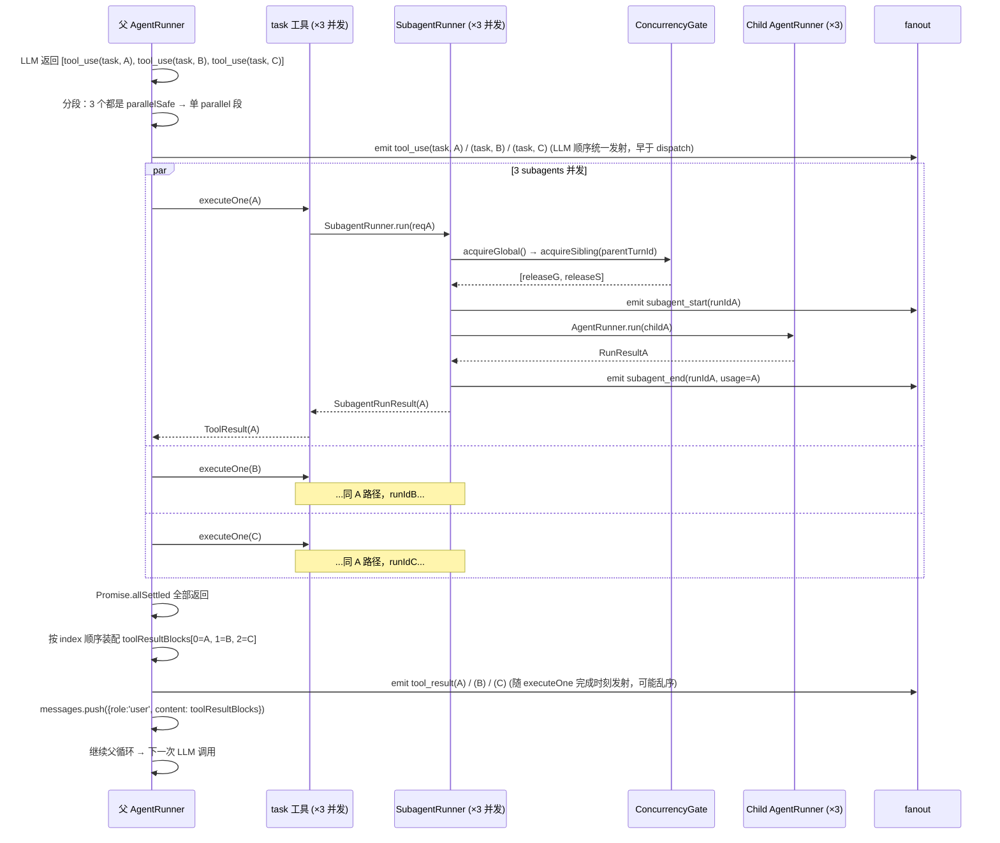

# Subagent v2：同 turn 内并发执行 Spec

> 文档日期：2026-07-23
> 分支：`feature/core-subagent-v2`
> 基线：`core-subagent-spec.md`（v1 已实现）
> 关联文档：`core-subagent-spec.md` · `current/core_runner.md` · `core-abort-spec.md` · `current/core_tools.md`
> 参考实现：Claude Code 的 `parallel_tool_calls` + `Task` 工具；openclaw 的 `maxConcurrent` / `maxChildrenPerAgent` 双闸设计（[openclaw/docs/architecture/subagent-analysis.md §5](../../../openclaw/docs/architecture/subagent-analysis.md)）

---

## 0. 阅读顺序

本文档是 v1 的**增量 spec**：v1 的所有决策、类型、接口、事件在 v2 **全部保留**，本文档只描述**新增或修改**的部分。阅读时请先熟悉 v1 spec §1–§10（尤其 §7 决策 1「阻塞调用」与 §14 v2+ 路标 A「同轮并行多 task」），再回来看本文。

---

## 1. 背景

v1 spec §7 决策 1 明确写道：

> **阻塞调用是 v1 的范围约束，不是最终设计。** 复杂任务场景下父 agent 需要并行派发多个独立子任务，串行会导致时间成倍增长。v2 将在 `AgentRunner` tool 循环层面支持同轮多 `task` 并发。

v1 上线后实际使用中出现的痛点：

1. **规划-审计-总结** 三阶段任务：父 agent 一次 `tool_use` 只能启动一个 subagent，三个独立子任务被强制串行，时长成倍。
2. **多文件独立分析** 类任务：LLM 一次可以决定"同时看 5 个模块"，但串行执行让 wall-clock 时长变成 5×。
3. **多个 `search` / `read` 类只读工具**同样被串行——这不是 subagent 特有问题，是整个 `AgentRunner` tool 循环的问题。

现状代码证据：[AgentRunner.ts:646](../../src/core/runner/AgentRunner.ts#L646) 的 `for (const toolUse of toolUseBlocks) { await this.executeTool(...) }`——**同一轮 `tool_use` block 严格串行**。

## 2. 目标

- 父 agent 在**同一轮**（同一个 LLM assistant message）返回多个 `tool_use(task)` 时，多个 subagent **并发执行**。
- 并发不改变**语义可观测性**：`toolResultBlocks` 与 `toolUseBlocks` **index 严格对齐**（Anthropic API 契约硬要求），子 agent 事件、usage 累加、abort 传播、审批路由**行为不变**。
- **`parallelSafe` 是工具级声明**：不仅 `task` 受益，`read_file` / `search` / `web_fetch` 等只读工具也可以标注为 parallelSafe，一并享受并发。
- **两级并发上限**（借鉴 openclaw）：全局 `maxConcurrent` + per-parent-turn `maxSiblingParallel`，防止一个失控的父 turn 独占 LLM API 配额或耗尽系统资源。
- **零破坏性升级**：v1 已有的所有内置工具、所有 subagent profile、所有 config 都不需要改动即可继续工作（新行为默认关闭 → 见 §5 D2）。

## 3. 非目标

- **不做 detached / background subagent**：父 turn 结束后子还在跑、异步 announce 回父 session、`sessions_yield` 等语义（openclaw 的核心特性）。理由：需要重构 `RunResult.usage` 树形累加承诺（v1 spec §7 决策 6），影响面远超 v2 主诉求。
- **不做跨 turn 并发**："父 turn A 里 spawn 的子还没跑完，父又开 turn B" 这种场景由 `RuntimeApp.inFlightSessions` gate 现状继续兜——**父 sessionKey 仍然串行**。
- **不放开 subagent 嵌套**：`maxDepth` 默认仍为 1，子 agent 依然拿不到 `task` 工具。orchestrator 层的并发是 v3 的题目。
- **不做跨 agent 通信**（Claude Code 的 `SendMessage`）：v2 仍然只有"prompt 进 / final text 出"。
- **不动 `LLMClient` 层的 rate limit 治理**：v2 只把 subagent 并发数限住，API 侧的 rate limit 由 Anthropic SDK 的重试/退避机制兜（现状）。真正的 client-side rate limiter 是独立 spec。
- **不改事件 schema**：`subagent_start / subagent_end` 已有的 `runId / trigger / parentTurnId(via trigger)` 已够 UI 做嵌套渲染。

## 4. 现状盘点（v1 → v2 迁移前审计）

在设计之前审计三处"疑似需要改"的地方，结论：**只有 `AgentRunner` 工具循环需要改；其他基础设施已经并发安全**。

| 边界 | 现状 | 结论 |
|---|---|---|
| `SessionManager` 并发写 `sessions.json` | 已有 per-file mutex（[session/lock.ts](../../src/core/session/lock.ts) + [session/store.ts](../../src/core/session/store.ts) `updateStore`，参考 openclaw `withSessionStoreLock`） | ✅ 天然安全，无需改动 |
| `before_tool_call` / `after_tool_call` hook 状态 | [hooks/runner.ts](../../src/core/runner/hooks/runner.ts) 的 `runBeforeToolCall` 是纯函数，只吃 payload，无跨调用共享状态 | ✅ 每个并发工具跑各自的 hook chain，互不干扰 |
| 并行 batch tool_result push 后的 compaction pipeline | [AgentRunner.ts:721](../../src/core/runner/AgentRunner.ts#L721) 的 `pruneToolResults` + 90% 阈值检查是纯函数，作用于 batch 后的 messages 数组 | ✅ 行为等价，无需改动 |
| `SubagentRunner` 子 session 隔离 | 子 sessionKey = `randomUUID()`，`resolveSession` 独立建 JSONL，approval 按 `turnId` 索引路由 | ✅ 天然并发友好 |
| abort 传播 | 父 `AbortController` → `ctx.signal → SubagentRunRequest.signal → child RunParams.signal`（[core-abort-spec.md §9](./core-abort-spec.md)） | ✅ 一个 signal 天然 fan-out 到所有 in-flight children |
| usage 树形累加 | 每层 `SubagentRunner.run()` 返回时把子 `runResult.usage` 加到自己的 `RunResult.usage`；不受并发影响 | ✅ 每个子只被 append 到一个父数组，无 race |
| `RuntimeApp.inFlightSessions` gate | 按 sessionKey 串行；子 UUID sessionKey 不与父/兄弟碰撞 | ✅ 子并发不受父串行 gate 影响 |

**结论：v2 改动收窄到 3 处**：`Tool` 接口加字段、`AgentRunner` 工具循环拆分、`SubagentRunner` 加 gate。

## 5. 核心决策

### 决策 1：走 Claude Code 的"同 turn 并发"路线，**不**走 openclaw 的"detached + announce"路线

**采用**：Anthropic API 已默认开启 `parallel_tool_calls`，父 LLM 可以在一个 assistant message 里同时返回 N 个 `tool_use(task)`。`AgentRunner` 检测到多个 parallelSafe 工具时用 `Promise.allSettled` 并发执行。

理由：

- **对齐 my-agent 现有语义**：v1 spec §7 决策 6 的"`RunResult.usage` = 自身 + 所有子孙累计"承诺是**blocking 唯一可靠**（v1 spec §7 决策 6 括号注："v1 blocking 全可靠；v2 detached 例外"）。v2 保持 blocking → 承诺继续成立，无需重构。
- **不引入 session-store 持久化 subagent runs**：openclaw 的 `SubagentRunRecord` 内存 Map + announce back queue + 父 session"复活"注入机制是独立的大子系统。
- **父 LLM 决策心智模型不变**：v1 里 `task` 是"发出去就等结果"；v2 里"一次发出去 N 个，等所有结果"。语义仍然是"tool_use → tool_result"配对，只是配对数量从 1 变 N。

**代价**：

- 父 turn 时长 = **max(子任务时长)** 而非 sum，但仍然阻塞整个父 turn。用户想"父先干别的，子后台跑" 依然要等 v3+ 的 detached 特性。
- Anthropic API rate limit 需要用户/运维层面兜。v2 提供的 `maxConcurrent` 是**并发数**闸，不是**QPS** 闸。

### 决策 2：`Tool` 接口加 `parallelSafe?: boolean`，默认 `false`

**采用**：

```ts
export interface Tool {
  name: string;
  description: string;
  inputSchema: Record<string, unknown>;
  execute: (params, ctx) => Promise<ToolResult>;
  /**
   * v2: 声明该工具在同一 turn 内可与其他 parallelSafe 工具并发执行。
   * 默认 false（保守）——旧工具零改动即可继续工作，行为完全等价 v1。
   */
  parallelSafe?: boolean;
}
```

**内置工具标注策略**：

| 工具 | parallelSafe | 理由 |
|---|---|---|
| `task` | ✅ true | 子 agent 完全隔离（独立 sessionKey / JSONL / route context） |
| `read_file` | ✅ true | 只读 fs，多路读安全 |
| `search` / `grep` 类 | ✅ true | 只读 |
| `web_fetch` | ✅ true | 网络 IO，无本地副作用 |
| `memory_search` / `memory_get` | ✅ true | 只读 memory |
| `exec` | ❌ false | 可能改 fs / 起进程 / 写 stdout；串行更安全 |
| `write_file` / `edit_file` / `apply_patch` | ❌ false | 写 fs；LLM 同轮写同文件的话必须按 LLM 输出顺序应用 |
| `memory_write` / `memory_delete` | ❌ false | 写 memory；避免 lost-update |
| 第三方 / MCP 工具 | ❌ false（默认） | 保守：第三方作者需**主动声明** `parallelSafe: true` |

**为什么默认 false 而非 true**：并发正确性是工具作者的责任——他知道自己有没有 fs / process / API 副作用。默认 false 让升级零风险，"未标注 → 行为不变"。

### 决策 3：`AgentRunner` 工具循环按 barrier 分段执行，保持 LLM 顺序不重排

**采用**：改 [AgentRunner.ts:636-703](../../src/core/runner/AgentRunner.ts#L636) 为 **barrier-based grouping**。核心不变式：

> **执行 `toolUseBlocks` 的**外部可观测效果**等价于按 LLM 输出顺序串行执行**，除了"**连续 parallelSafe 段内**的工具可能在时间上重叠"。

即：**非 parallelSafe 工具是硬 barrier**，它前后的工具绝对不能重排到它的另一侧。这保住了 LLM 用工具顺序表达的语义（"先看 → 再改 → 再验证"这类推理链）。

**分段算法**：

```
输入：toolUseBlocks[] （LLM 返回顺序）

伪代码：
  // 1) 按 LLM 顺序遍历，切段
  //    - 遇到非 parallelSafe → 独立单元素段
  //    - 遇到 parallelSafe → 追加到"当前 parallel 段"（若上一段也是 parallel）
  //                       或开新的 parallel 段（若上一段是 barrier）
  const segments: Segment[] = []  // Segment = { kind: 'serial'|'parallel', items: {index, toolUse}[] }
  for (i, toolUse) in toolUseBlocks:
      const tool = lookupToolDef(toolUse.name)
      const isSafe = tool?.parallelSafe === true
      const last = segments[segments.length - 1]
      if (isSafe && last?.kind === 'parallel') {
          last.items.push({ index: i, toolUse })
      } else {
          segments.push({
              kind: isSafe ? 'parallel' : 'serial',
              items: [{ index: i, toolUse }],
          })
      }

  // 2) 严格按段顺序执行（段间是 barrier）
  const results = Array(toolUseBlocks.length)
  for (segment of segments):
      if (segment.items.length === 1 || segment.kind === 'serial'):
          // 单元素段 or serial 段：直接串行
          for {index, toolUse} of segment.items:
              results[index] = await executeOne(toolUse)
      else:
          // 多元素 parallel 段：allSettled 并发（gate 在 SubagentRunner 内部生效，§决策 4）
          await Promise.allSettled(segment.items.map(async ({index, toolUse}) => {
              results[index] = await executeOne(toolUse)
          }))

  // 3) 按 index 顺序装配 toolResultBlocks[]（与 toolUseBlocks 严格对齐）
  const toolResultBlocks = results.map(...)
  messages.push({ role: 'user', content: toolResultBlocks })
```

**分段示例**：

| LLM 输出 | 段划分 | 说明 |
|---|---|---|
| `[read_A, read_B, read_C]` | `[[read_A, read_B, read_C]/parallel]` | 全 parallelSafe → 一整段并发 |
| `[write_A, read_B]` | `[[write_A]/serial, [read_B]/parallel]` | write 是 barrier，read 在其后独立段 |
| `[read_A, write_A, read_A]` | `[[read_A]/parallel, [write_A]/serial, [read_A]/parallel]` | 观察-修改-验证链，**顺序完全保留** |
| `[task_A, task_B, edit_file(X), task_C, read_file]` | `[[task_A, task_B]/parallel, [edit_file]/serial, [task_C, read_file]/parallel]` | 两个并发段被 edit 分开 |

**不变式**：

1. **`toolResultBlocks` 顺序严格等于 `toolUseBlocks` 顺序**（Anthropic API 硬要求，乱序 400）。PR-C 必测。
2. **`tool_use` event 按 LLM 顺序统一发射**：所有 `tool_use` event 在**分段执行开始前**一次性按 index 顺序 emit 完毕，然后才开始执行。这样 UI 能立刻看到"父这一轮打算干哪些事"的完整清单，而不是随执行进度陆续拿到。（`tool_result` event 在各自 `executeOne` 完成时 emit，因此 parallel 段内 tool_result 可能乱序到达——UI 按 `tool_use_id` demux 即可。）
3. **段间是 barrier**：段 N+1 不启动，直到段 N 内所有工具（含并发的所有 promises）全部 settled。这是保住 §7.2 观察-修改-验证 类推理链正确性的关键。
4. **abort check 时机**：每段启动前检查 `signal?.aborted`（串行段是"每个 tool 启动前"，parallel 段是"整段启动前"）；parallel 段内的 `executeOne` 各自透传 `ctx.signal` 给工具，工具自决是否响应（同 v1）。已完成/进行中的段无法回滚。
5. **`Promise.allSettled` 语义**：parallel 段内某个工具异常/reject 不影响 sibling——各自独立完成或失败。`SubagentRunner.run()` 本身 catch-all 返回 `outcome='error'`，不外抛，因此不会污染 `Promise.allSettled` 的其他 leg。

**为什么用 barrier 而非"全部 parallelSafe 全并行 + 全部非 parallelSafe 全串行"**：后者会**重排 LLM 输出顺序**——例如 `[read_A, write_A, read_A]` 会被错误地分成"读组 [read_A, read_A] 并发 + 写组 [write_A] 串行"，导致两个 read 拿到的是 write 后的内容，违反 LLM 意图。barrier 是唯一能同时兼顾"保 LLM 顺序语义"和"榨取连续 parallelSafe 段并发"的方案。

**性能特性**：分段完全由 LLM 输出决定，客户端无自适应重排。若 LLM 常常输出 `[safe, unsafe, safe, unsafe]` 交错模式，并发收益低——但这不是 v2 spec 的问题，是 LLM prompt 层可以引导"把独立任务集中输出"的问题。

### 决策 4：并发 gate 放 `SubagentRunner`（不放 `AgentRunner`）

**采用**：`AgentRunner` 只负责"启动 parallel 段"，不关心里面每个 tool 的具体身份。**subagent 特有的并发 gate 放在 `SubagentRunner.run()` 入口**：

```ts
// SubagentRunnerDeps 新增：
export interface SubagentRunnerDeps {
  // ...v1 现有字段...
  concurrencyGate: SubagentConcurrencyGate;
}

export interface SubagentConcurrencyGate {
  /** 全局闸：所有 in-flight subagent（含所有父的）总数 */
  acquireGlobal(): Promise<() => void>;
  /** per-parent-turn 闸：同一父 turn 下兄弟并发上限 */
  acquireSibling(parentTurnId: string): Promise<() => void>;
}
```

`SubagentRunner.run()` 顺序：

```
acquire = [ await gate.acquireGlobal(), await gate.acquireSibling(parentTurnId) ]
try {
  ...v1 现有 run 逻辑...
} finally {
  for (release of acquire.reverse()) release()
}
```

**为什么放 `SubagentRunner` 而不是 `AgentRunner`**：

- `AgentRunner` 是"通用工具执行引擎"，不应耦合 subagent 特有的并发预算概念（其他 parallelSafe 工具如 `read_file` 不需要这种闸）。
- `SubagentRunner` 是 subagent 的必经点，天然是限流点。
- 未来若要给其他重资源工具加限流（如 `exec` 全局并发），走同样模式：**在工具自己的执行层加 gate**，不污染 `AgentRunner`。

**gate 实现**：async semaphore，简单的 Promise 队列（参考已有 [session/lock.ts](../../src/core/session/lock.ts) 的 `withFileLock` 模式）。放在 `runtime/subagent-orchestration.ts`（v1 已有的文件）里 export 一个 factory。

**acquire 顺序**（先 global 后 sibling）**很重要**：反过来会导致优先级反转——若 sibling 已满，多个父都在等，先 acquire sibling 再 acquire global 会占住 sibling 名额但拿不到 global，造成死锁风险。先 global 后 sibling 保证"只要拿到 global 就一定能推进"（sibling 是本 parent 的私有配额，独立于其他 parent）。

**v2 死锁自由的前提**：`maxDepth` 仍为 1，subagent 不能再 spawn subagent，因此不存在"父持有 sibling 名额 → 等子完成 → 子想 acquire → 循环等待"这条环。**若 v3 放开嵌套（orchestrator 层 canSpawn），此 acquire 顺序规则需重新评估**——嵌套场景下深层子的 parent 是浅层子，可能出现跨层的 acquire 交织。v3 spec 需要显式处理（比如按 depth 分层配额、或强制 orchestrator 层不占用 sibling 名额）。

**队列公平性**：v2 用 FIFO 队列（简单 Promise 链），不引入优先级 / preemption。若未来出现"高优 subagent 抢占"需求再做。

### 决策 5：默认并发上限 `maxConcurrent=4` / `maxSiblingParallel=4`

**采用**：

```
subagents:
  maxConcurrent:       4    // 全局 in-flight subagent 上限（新增）
  maxSiblingParallel:  4    // 同一父 turn 下 subagent 兄弟并发上限（新增）
```

理由：

- **4 vs openclaw 8/5**：my-agent 定位是"可嵌入库"，用户 workspace 里可能同时有多个 my-agent 实例（IDE 插件 + CLI），保守值更合理。用户可以在 config 显式调高。
- **两个默认相等**：v2 常见场景是"一个父 turn spawn N 个 sibling"——两个闸值相等意味着"单父 turn 就能吃满全局"，简单直觉。若用户想跑多个并发父 turn（openclaw 多 requester 场景），可以调高 `maxConcurrent` 但保持 `maxSiblingParallel` 不变。
- **可后调**：这是初始默认，落地后据实测反馈调整。

### 决策 6：事件、usage、abort、审批 **一律沿用 v1 现有机制**（含并发正确性说明）

**不新增事件类型**：`subagent_start / subagent_end` 已经带 `runId + trigger`；UI 按 `sessionKey + runId` 做嵌套渲染 → 天然支持 N 个并发 subagent 在同一父 turn 下的分组呈现。**只需要 UI 层加个"平铺 N 个 sibling"渲染模式，无 schema 变化**。

**usage 树形累加不变**：并发下 N 个子的 `subagent_end.usage` 独立 emit，父 `RunResult.usage` = 父自身 + Σ(子 usage)。Node.js 单线程 + 每层聚合各自的子 → 无 race。

**abort 传播不变**：父 `AbortController.abort()` → 单个 signal 事件 fan-out 到所有 in-flight children（每个都 hold 同一个 `AbortSignal` 引用）。`Promise.allSettled` 的 N 个子各自看到 signal.aborted → 各自 abort → 各自 `outcome='aborted'` return。

**审批路由正确性（v2 spec 范围，不属于 UI）**：并发子对同一父 turn 的路由 registry 语义显式说明：

- **Registry 是 1:many**：v1 实现的 `SubagentHostBindings.registerTurnContext(childTurnId, parentTurnId)` 内部是 `Map<childTurnId, routeContext>`——**以子 turnId 为 key**。N 个并发子各自有 UUID 生成的独立 `childTurnId`，`Map.set` 各写各的 entry，指向同一个 parent 的 route context。**不存在 latest-wins 问题**，天然支持"同一 parent 下多个活跃 child turn"。（[v1 spec §决策 7](./core-subagent-spec.md) 已描述实现，v2 只是显式确认此并发假设。）
- **`before_tool_call` hook 按 `turnId` 索引路由**：多个子同时触发审批 prompt 时，各自 payload 携带各自 `childTurnId`，通过 route context 找到同一父 channel。父 channel 收到 N 个独立的 approval request（各自带 `childTurnId`），可以并行呈现给用户。
- **hook chain 无跨调用状态**（§4 审计已验证）：`runBeforeToolCall` 是纯函数，多个并发子各自跑各自的 chain，互不干扰。

**拒绝传播语义（v2 spec 范围）**：并发下"某个子的某个工具被拒"的行为定义如下（与 v1 单子行为等价，只是并发场景需要显式写出多子隔离）：

- **拒绝作用域 = 单个 tool 调用**：hook 返回 `{action:'deny'}` → 该 tool 拿到 `ToolResult{content:'Tool blocked: ...', isError:true}` → subagent **内部继续跑**（决定重试 / 换方案 / 或最终失败 return），**不会杀 subagent**。
- **不跨 subagent 传播**：并发中的其他 sibling subagent **完全不受影响**，各自继续等待各自的审批或运行。理由：subagent 之间是独立任务，一个被拒不意味着其他也应该放弃。
- **父 turn 不受影响**：父继续 `Promise.allSettled` 等所有子 settle。被拒的子最终 return 的 `SubagentRunResult` 可能是 `outcome='ok'`（子决定跳过该工具继续）、`'max_llm_calls'`（子反复尝试耗尽预算）、或 `'error'`——具体看子的 LLM 决策。
- **父想"一拒全停"？** v2 不提供此原语。若用户需要，走 abort：父 turn 的 abort 会 fan-out 到所有子（`AbortSignal`），一次性停所有 sibling。

**UX 关切（承认 v2 不解决）**：若 5 个 subagent 各要求审批一个 `exec`，用户会一次收到 5 个 approval prompt。这是**审批 UI 的题目**，未来可加"批量审批"入口。v2 只保证底层路由与拒绝语义正确，UI 呈现另议。

## 6. 类型 / 接口签名

### 6.1 `Tool` 接口扩展

见 §5 决策 2。**唯一新增字段**：`parallelSafe?: boolean`。位置：[src/core/tools/types.ts](../../src/core/tools/types.ts) 现有 `Tool` interface 末尾。

### 6.2 `SubagentConcurrencyGate` 接口（新增）

```ts
// src/core/subagent/types.ts 新增 export
export interface SubagentConcurrencyGate {
  acquireGlobal(): Promise<() => void>;
  acquireSibling(parentTurnId: string): Promise<() => void>;
}
```

实现：`runtime/subagent-orchestration.ts` 新增 `createSubagentConcurrencyGate({ maxConcurrent, maxSiblingParallel })` factory。

### 6.3 `SubagentRunnerDeps` 扩展

现有 `SubagentRunnerDeps`（v1 spec §8.5）末尾新增：

```ts
export interface SubagentRunnerDeps {
  // ...v1 现有字段...
  concurrencyGate: SubagentConcurrencyGate;
}
```

### 6.4 `SubagentsConfig` 扩展（config 层）

现有 `subagents` config 节（v1 spec §12）新增三个字段：

```ts
interface SubagentsConfig {
  enabled: boolean;             // v1 已有
  maxDepth: number;             // v1 已有
  maxConcurrent?: number;       // v2 新增：默认 4
  maxSiblingParallel?: number;  // v2 新增：默认 4
  parallelExecution?: boolean;  // v2 新增：默认 true。整体 kill switch，见 §11
  list?: SubagentConfigEntry[]; // v1 已有
}
```

**config 迁移**：默认值兜底，用户不改 config 就自动获得 v2 行为。**不需要 config schema 破坏性变更**。

### 6.5 AgentRunner 无接口变更

`RunParams` / `RunResult` / `AgentEvent` union 都不动。改的只是 `runAttempt` 内部的工具循环实现。

## 7. 执行流程时序

### 7.1 父 LLM 一次返回 3 个 `task` 并发执行



关键点：

- **`tool_use` event 顺序 = LLM 返回顺序**（分段前统一发射，见 §决策 3 不变式 2）。
- **`toolResultBlocks` 数组顺序 = LLM 返回顺序**（按 index 装配，Anthropic API 契约要求）。
- **`tool_result` event 发射顺序可能乱序**：随各自 `executeOne` 完成时刻发射；UI 按 `tool_use_id` demux 即可分离配对。
- **子 agent 内部事件（`subagent_start / run_start / text_delta / tool_use / ... / subagent_end`）在时间轴上交织**——UI 按 `sessionKey + runId` demux 即可分开渲染。
- **`subagent_start(A) / (B) / (C)` 三条事件近乎同时到达**——UI 应当在此时布出 3 个并列的"subagent 进行中"UI 卡片。

### 7.2 barrier 分段执行示例（混合 parallelSafe / 非 parallelSafe）

```
LLM 返回：[
  tool_use(edit_file, X),   // index 0，非 parallelSafe
  tool_use(task, A),        // index 1，parallelSafe
  tool_use(read_file, Y),   // index 2，parallelSafe
  tool_use(task, B),        // index 3，parallelSafe
  tool_use(write_file, Z),  // index 4，非 parallelSafe
  tool_use(read_file, W),   // index 5，parallelSafe
]

分段（按 LLM 顺序，barrier 切分）：
  segment 0: [edit_file(X)]                             kind=serial   (barrier)
  segment 1: [task(A), read_file(Y), task(B)]           kind=parallel (连续 3 个 safe)
  segment 2: [write_file(Z)]                            kind=serial   (barrier)
  segment 3: [read_file(W)]                             kind=parallel (单元素 parallel 段，退化为串行执行)

执行（段间是硬 barrier，前段全 settled 后才启动后段）：
  1. edit_file(X)                                       → results[0]
  2. allSettled([task(A), read_file(Y), task(B)])       → results[1], [2], [3]
  3. write_file(Z)                                      → results[4]
  4. read_file(W)                                       → results[5]

装配 toolResultBlocks[0..5]（严格 index 对齐）→ push messages
```

**读这个示例的关键**：`edit_file(X)` 是 barrier，它前面没有工具，它后面的 `[task(A), read_file(Y), task(B)]` **绝对不会**跑到它前面。这就是"LLM 顺序不重排"的直观含义。

### 7.3 gate 阻塞时序示例（均衡场景，`maxSiblingParallel=2`）

设三个子 A / B / C 各自纯执行时长为 10 单位。

```
t=0:  acquireSibling(pt) × 3 发起
      子 A 拿到 sibling 1/2 → 进入 run() 开始执行
      子 B 拿到 sibling 2/2 → 进入 run() 开始执行
      子 C 排队等待 sibling → pending

t=10: 子 A 完成 → releaseSibling
      子 C 出队 → 进入 run() 开始执行
      子 B 完成 → releaseSibling（几乎同时）

t=20: 子 C 完成 → releaseSibling

父 turn 时长 = 20（子 C 结束时刻）
              = max(t_A_end, t_B_end, t_C_end)
              = max(10, 10, 10+10)   ← 因 C 被 gate 延后 10
              = 20

若 maxSiblingParallel=3：C 与 A/B 同时启动 → t_C_end=10 → 父 turn 时长=10。
这就是 gate 的取舍：想真正 N 路并发，需要提高 maxSiblingParallel。
```

**公式**：`父 turn 时长 = max_i(t_i_end)`，其中 `t_i_end = t_i_start + duration_i`，而 `t_i_start` 取决于 gate 何时放行。理想（gate 不阻）时 `t_i_start = 0`，父 turn 时长收敛到 `max_i(duration_i)`。gate 每阻 1 个子，就把它的 `t_i_start` 推迟到某个前置子 release 的时刻。

## 8. 配置扩展

完整 config 结构见 [`platform-config-restructure-spec.md`](./platform-config-restructure-spec.md)。v2 只在现有 `subagents` 节新增三个字段：

```yaml
subagents:
  enabled: true              # v1 已有
  maxDepth: 1                # v1 已有
  maxConcurrent: 4           # v2 新增：全局 in-flight subagent 上限
  maxSiblingParallel: 4      # v2 新增：per-parent-turn 兄弟并发上限
  parallelExecution: true    # v2 新增：整体 kill switch，false 时回退 v1 全串行行为（见 §11）
  list:                      # v1 已有
    - id: code-reviewer
      # ...
```

**config 迁移**：三个字段都有默认值兜底，v1 用户升级零改动即可获得 v2 行为。

**校验规则**（fail-fast，config-loader 里）：

- `maxConcurrent` / `maxSiblingParallel` 必须是 `>= 1` 的整数。
- `maxSiblingParallel > maxConcurrent` **允许**但会 log warn（sibling 闸永远够不到，是配置错误的强信号但不致命）。
- 两个字段均可以显式设为大数（如 `Infinity`）表示不限制——不做上限硬约束，用户自负其责。
- `parallelExecution: false` **不影响 gate 字段的解析**（config 校验仍严格），只影响运行时行为。

## 9. 风险 / 缓解

| 风险 | 缓解 |
|---|---|
| LLM API rate limit / 429 | 用户显式调低 `maxConcurrent`；Anthropic SDK 自带的重试/退避覆盖偶发 429；client-side rate limiter 是独立 v3 spec |
| 一个失控父 turn 独占所有 subagent 配额 | `maxSiblingParallel` per-parent-turn 闸兜底；即使父 LLM 一次要求 100 个 task，实际并发不超过 `maxSiblingParallel` |
| Anthropic API 契约违反（`tool_use.id ↔ tool_result.tool_use_id` 乱序） | `toolResultBlocks` 严格 index 顺序装配（§决策 3 不变式 1）；PR-C 必写"顺序守恒"测试 |
| **LLM 顺序被静默重排**（例如 `[read, write, read]` 被错误分组导致读到 write 后内容） | barrier-based 分段（§决策 3）保住"效果等价 LLM 顺序串行"不变式；PR-C 必测混合 safe/unsafe 场景 |
| 并行段内某个 subagent 抛异常污染其他 sibling | `Promise.allSettled` 独立捕获每个子的异常；`SubagentRunner.run()` 本身已 catch-all 返回 `outcome='error'`（v1 spec §13.2），永远不向外抛 |
| 并发下 `tool_use` / `tool_result` event 顺序对 UI 造成混淆 | `tool_use` event 分段前统一按 LLM 顺序发；`tool_result` event 允许乱序，UI 按 `tool_use_id` demux |
| `parallelSafe=true` 的工具作者其实不是幂等/无副作用（错误标注） | 责任明确划给工具作者：spec §决策 2 表列出何时可以标；builtin 工具保守标注 |
| **Builtin 工具后续改动悄悄破坏 `parallelSafe` 假设**（如 `memory_search` 未来加"记录查询历史"副作用） | PR checklist 增加一条："修改 builtin 工具时复审 `parallelSafe` 声明是否仍成立"；建议纳入 `coding-standards.md` |
| gate 死锁 | acquire 顺序固定"先 global 后 sibling"（§决策 4 说明）；sibling 是 per-parent-turn 私有资源，不与其他 parent 竞争 → 无循环等待。**v3 放开嵌套时需重评估**（§决策 4） |
| Third-party MCP 工具默认 `parallelSafe=false` 导致性能没提升 | 文档明确说明；MCP adapter 层未来可扩展"从 MCP tool metadata 读 parallelSafe hint" |
| 父 abort 时并发段的 in-flight 子仍在跑（signal 传给了子但 exec 类工具可能不响应） | 沿用 v1 abort 语义：signal 传下去，工具自决是否响应；abort 不保证瞬时停止（core-abort-spec.md §6.2）；父 turn 的 `Promise.allSettled` 会等所有子 settled（含 aborted）才继续 |
| **`sessions.json` IO 序列化成为隐藏瓶颈** | 现有 per-file mutex 保证正确性（§4 审计），但 4 个并发子会各自竞争同一把锁。实际负载低（每个子生命周期仅 2 次写：resolveSession + deleteSession；per-message JSONL 是 per-file 独立锁不共享），高并发场景下建议观测 `sessions.json` write throughput；若成为瓶颈，可以改用 in-memory index + 定期 flush |
| 测试脆弱性（并发时序不可预测） | 单测用 mock LLM/SubagentRunner + 手动 resolve promise 控制时序；集成测试只断言"最终结果 index 顺序正确 + 事件都到达"，不断言"事件发射的绝对时间顺序" |

## 10. v1 → v2 兼容性

| 兼容维度 | 结论 |
|---|---|
| 现有 `Tool` 实现 | ✅ `parallelSafe` 可选字段，缺省 = false = 串行 = v1 行为 |
| 现有 config | ✅ `maxConcurrent` / `maxSiblingParallel` 有默认值 |
| 现有 subagent profile | ✅ 完全不动 |
| 现有 `AgentEvent` schema | ✅ 完全不动 |
| 现有 `RunResult.usage` 语义 | ✅ 树形累加不变（blocking 唯一，v1 spec §7 决策 6 承诺继续成立） |
| 现有 `RuntimeApp.runSubagentTurn(...)` 库 API | ✅ 签名不动；库 caller 若同时调多次会各自走 gate |
| 现有 abort 传播 | ✅ 完全不动 |
| 现有 audit / approval hook | ✅ 完全不动，per-call 状态无 race |
| 现有 fanout / channel | ✅ 完全不动，UI 已按 `sessionKey + runId` demux |

**结论**：v2 是**纯加法升级**，用户升级零改动，只有想调 gate 时才需要碰 config。

## 11. PR 拆分建议

四个 PR，从 leaf 到 root，逐层可测：

| PR | 内容 | 依赖 | 风险 |
|---|---|---|---|
| **PR-A** | `Tool.parallelSafe?: boolean` 字段加进 [core/tools/types.ts](../../src/core/tools/types.ts)；builtin 工具标注（`task` / `read_file` / `search` / `web_fetch` / `memory_search` 设 true；其余不动）；**只加字段不改行为** | — | 极低（新加可选字段） |
| **PR-B** | `runtime/subagent-orchestration.ts` 加 `createSubagentConcurrencyGate` factory + `SubagentConcurrencyGate` interface；`SubagentRunnerDeps` 加 `concurrencyGate` 字段；`SubagentRunner.run()` 入口/finally 加 acquire/release；`SubagentsConfig` 加 `maxConcurrent` / `maxSiblingParallel` / `parallelExecution` 字段 + 默认值 + 校验 | PR-A | 低（新增字段/隔离改动） |
| **PR-C** | `AgentRunner.runAttempt` 工具循环改为 **barrier 分段**（§决策 3）：按 LLM 顺序遍历切段、单元素/serial 段串行、多元素 parallel 段 `Promise.allSettled`、`tool_use` event 分段前统一发射、按 index 装配 `toolResultBlocks`。**入口检查 `config.subagents.parallelExecution`；false 时走 v1 全串行 fallback 路径**。**必测**：(a) 顺序守恒（toolResultBlocks index 严格对齐） (b) barrier 保序（`[read, write, read]` 效果等价 LLM 顺序串行） (c) parallel 段内异常不污染 sibling (d) parallel 段内 abort 传播 (e) `parallelExecution=false` 时行为与 v1 字节等价 (f) `tool_use` event 按 LLM 顺序发射 | PR-A | **中**（改动 hot path） |
| **PR-D** | 集成测试 + 文档：3 个并发 `task` end-to-end + gate 阻塞验证 + usage 树形累加正确性 + v1 spec §14 v2+ 路标 A 状态更新为"已实现" | PR-A/B/C | 低 |

**建议合入策略**：PR-A + PR-B 先合（新能力不生效，只是接口就位）；PR-C 独立 review 并携带 `config.subagents.parallelExecution` feature flag（下节说明）；PR-D 收尾。

**Feature flag 决定：保留 `config.subagents.parallelExecution: boolean`（默认 true）**。

理由：

- **回滚成本量级差**：无 flag 时回滚需要"改代码 → 重发布"；有 flag 时只需运维改 config 重启。生产环境出问题的第一反应必然是"先关掉新行为看看"，flag 提供了这个能力。
- **代价极小**：PR-C 入口一行 `if (!config.subagents.parallelExecution) return v1Path(...)`，PR-B config 加一个字段。
- **不与 §决策 2 的"默认 false → 天然 kill switch"论证冲突**：那是"per-tool 级"的 kill switch（工具作者控制单个工具能不能并发）；`parallelExecution` 是"运行时级"的 kill switch（运维一键关掉整个并发行为）。两级独立、正交、都需要。

**per-tool 覆盖仍然不做**（§12 Q1 澄清）：`parallelExecution` 是整体开关，不提供 config 层面按工具名覆盖 `parallelSafe`。有需要时改 builtin 工具源码或让 MCP adapter 传 metadata 即可。

## 12. 待确认的开放问题

1. **`parallelSafe` 声明位置**：现在设计放在 `Tool` interface 上。是否需要允许 config **覆盖**内置工具的默认值（比如运维想强制 `task` 变回串行）？→ **v2 不做 per-tool 覆盖**。理由：`parallelExecution` flag（§11）已能"整体一键关掉"，per-tool 是过度设计。若个别工具需要临时禁并发，改 builtin 源码或走 MCP metadata 通路。
2. **`maxSiblingParallel` 是"per-parent-turn"还是"per-parent-sessionKey"？** → **per-parent-turn**（决策 4 已定）。理由：sessionKey 层已经被 `RuntimeApp.inFlightSessions` 串行 gate 兜住，"同 sessionKey 不会有第二个 turn"。用 turnId 作为 key 更精确、无 stale 风险。
3. **gate release 时机——完成时 vs `finally`？** → **`finally`**（决策 4 说明）。保证异常路径也 release，杜绝泄漏。
4. **是否给 `SubagentRunner` 加 gate 就够？其他 parallelSafe 工具（如 `web_fetch`）要不要也加？** → **v2 只做 subagent gate**。其他工具的并发治理是独立话题（连接池、HTTP client、fs handle 数……）；把 subagent gate 做好后，观察实际使用再决定其他工具是否需要类似机制。
5. **`RuntimeApp.runSubagentTurn(...)` 库 API 是否共享同一 gate？** → **是**。库 API 也走 `SubagentRunner.run()`，天然共享 gate。这是有意为之：全局 `maxConcurrent` 就应该覆盖所有入口（LLM + 库 + 未来的 cron）。文档需要说清楚。
6. **`parallelExecution=false` 时 gate 还生效吗？** → **不生效**：v1 全串行路径根本不进入 parallel 段，`SubagentRunner.run()` 内的 gate acquire 依然会执行但因单点无竞争实际不阻塞。gate 字段的存在与 flag 值正交。

## 13. 相关文档

- v1 基线：[core-subagent-spec.md](./core-subagent-spec.md)
- v1 当前编排：[Current Runtime](./current/runtime.md)
- Runner 现状：[Current Runner](./current/core_runner.md) + [core-runner-turn-flow-spec.md](./core-runner-turn-flow-spec.md)
- Abort 契约：[core-abort-spec.md](./core-abort-spec.md)
- Tool 框架：[Current Tools](./current/core_tools.md) + [Tool/Hook Module Spec](./tool-hook-module-spec.md)
- 参考实现调研：[openclaw subagent-analysis.md §5](../../../openclaw/docs/architecture/subagent-analysis.md)
- Config 结构：[platform-config-restructure-spec.md](./platform-config-restructure-spec.md)

---

## 附：v1 spec 需要同步的地方（合入 PR-D 时）

以下 v1 spec 章节在 v2 落地后需要同步修改（**不在本 spec 落地时改，等 PR-D**）：

- **v1 §3 非目标第 1 条**：删除"不做并行 spawn"，改为"并发能力在 v2 spec 覆盖，见 core-subagent-v2-spec.md"。
- **v1 §7 决策 1** 括号注："**阻塞调用是 v1 的范围约束，不是最终设计**" → 追加"（v2 已实现，见 core-subagent-v2-spec.md）"。
- **v1 §14 v2+ 路标 A** 第一行"同轮并行多 task" → 追加"✅ 已在 core-subagent-v2-spec.md 覆盖"。
