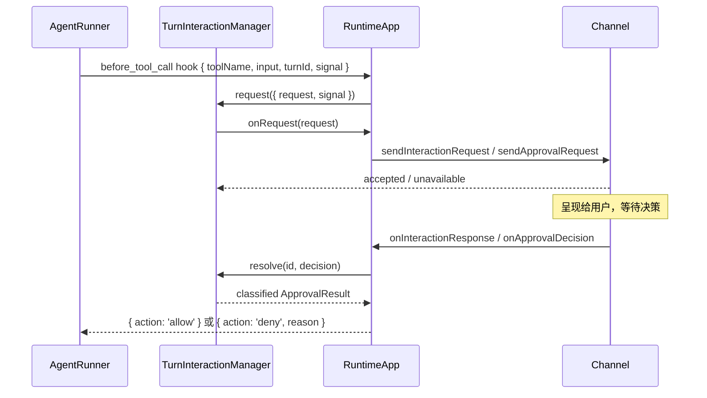

# Channel Current Architecture

> Status: Current Authority
> Verified: 2026-09-09
> Ownership: Channel contract, transport, interaction, CLI/WebSocket protocol, and attachment ingress/wire summary
> Ownership key: channel-transport-and-ingress

---

## 1. 概述

`src/adapters/channel/` 是 my-agent 的 **I/O 适配层**，把 `RuntimeApp` 内部运行与外部输入输出（终端、WebSocket、未来 HTTP 等）之间的边界统一起来。Turn Interaction pending lifecycle 由 `src/runtime/turn-interaction/` 拥有，不属于 Transport Adapter。

它解决三个问题：

- `RuntimeApp` 只有进程内 `runTurn()` 接口，无法原生支持 CLI / WebSocket 等多种 I/O；
- `before_tool_call` hook 需要外部决策后才能继续，但纯 hook 没有把决策传回的通道；
- 同一 session 多 client 场景需要明确的广播 / 定向路由策略。

### 1.1 容易混淆的边界

**入站消息的队列调度**属于 `runtime`——channel 只负责把消息推给 RuntimeApp，调度和串行由 RuntimeApp 内部完成。

---

## 2. 目录结构

```
src/adapters/channel/
├── CliChannel.ts             # readline 实现
├── WebSocketChannel.ts       # ws server 实现
└── index.ts                  # concrete adapters/config only

src/runtime/turn-interaction/
├── TurnInteractionManager.ts # Runtime-owned Promise bus
└── index.ts

src/core/channel/
├── types.ts                  # canonical Channel/interaction contracts
└── index.ts
```

---

## 3. 三条数据流

### 3.1 入站（client → agent）

```
WS client 或 CLI 输入
  │ ChannelRunRequest
  ▼
channel.onMessage(handler)   ← handler 由 RuntimeApp.registerChannel 注入
  ▼
RuntimeApp.handleInboundChannelMessage
  ├─ 输入装配完成后 emit user_message → 同 session 所有 client
  ├─ steering 条件 → steeringInboxBySession
  └─ 普通入站 → enqueueQueuedTurn → scheduleNextQueuedTurn
                   ▼
              startQueuedTurn:
                turnId = randomUUID()
                routeContextByTurn.set(turnId, { originChannel, originClientId })
                runTurn(...)
```

- **turnId 在 startQueuedTurn 才生成**——排队阶段不占用 turn 级资源
- **clientId 不进 RunTurnParams**——封装在 `MessageRouteContext`，runner 不感知 transport 概念
- **channel 不绕过队列**——永远通过 handler 入站，不直接调 runTurn
- **用户输入是一等事件**——`user_message` 在 queued / steering 分流前广播；queued 消息通过 `run_start.originMessageId` 关联后续 turn

### 3.2 出站（agent → client）

```
Runtime fanout 接收 AgentEvent（按 variant 携带 request / session / turn correlation）
  ▼
Runtime Builder 注入的 fanout 闭包:
  ├─ for each captured/current Channel binding: await channel.send(event)
  └─ RuntimeAppOptions.onAgentEvent?.(event)

channel.send 实现:
  ├─ CliChannel      → 渲染到 stdout（单 client，忽略 sessionKey）
  └─ WebSocketChannel → 按事件 correlation 解析 audience 后发送
```

- **事件按生命周期关联**：大多数 Turn/session events 直接使用 `sessionKey`；Subagent events 归一到 root session audience；queued `request_end` 没有 session/turn，WebSocket 通过 `originMessageId` 关联先前 `user_message`
- **generation-aware fanout**：Turn events 使用捕获 generation 的 Channel bindings；无 turn correlation 的事件使用 current bindings
- **同步/异步 send 均隔离**：`send()` 可返回 `void | Promise<void>`；throw/rejection 被记录为 warning，不让单个 channel 故障中断其他分发
- **附件广播只含摘要**：`user_message.attachmentSummaries` 不携带原始 Base64

### 3.3 Runtime Capabilities（channel ↔ runtime）

```
Runtime Builder
  → bindRuntimeCapabilities({ modelCatalog, abort })
  ├─ modelCatalog.getSnapshot() → current immutable Provider/Model Catalog query
  └─ abort.abortTurn(sessionKey) → abort active turn + drop queued messages
```

Channel 在 `start()` 前通过可选 `bindRuntimeCapabilities` 一次性接收 Runtime 注入的统一能力，不反向依赖 RuntimeApp。Catalog 是实时 Query Port，每次查询当前 generation；Abort 是 Command Port。CLI 的模型 override 与 WebSocket `get_model_catalog` 都只消费 Catalog，不替代 Runtime Model Resolver 的最终校验。WebSocket 的 `abort_turn` 无单独 Ack；客户端通过 `run_end` 感知中止完成。

### 3.4 Approval / Interaction（hook ↔ channel）



  非人工终态路径：Turn Abort、Shutdown、初始 delivery failure 或 origin disconnect → classified settlement → `onClose` → RuntimeApp 通知起源 channel 关闭 UI。elapsed time 不改变 pending 状态。

关键路由规则：
- **起源路由不广播**：按 turnId 查 `routeContextByTurn` 只通知起源 channel
- **interaction 优先于 approval**：channel 同时实现两者时走 `interaction`
- **起源不可达时 fail closed**：分类为 unavailable，不伪装成用户 deny
- **当前调用无 capability 时 fail closed**：unmatched Tool 不依赖启动历史，不直接放行

### 3.5 Attachments ingress and wire summary

Channel owns the inbound and client-wire shape. `ChannelRunRequest.message` is either text or ordered text/image blocks; image blocks carry a MIME declaration and base64 payload. Runtime sends these blocks through [Media](./core_media.md) normalization before queue/steering classification; dropped items can add a visible notice.

The `user_message` event broadcasts only attachment summaries (`type`, MIME, byte count and optional dimensions), never raw base64. Media owns validation and canonical normalization; [Prompt](./core_prompt.md) owns Context Hook placement without changing Channel wire ownership.

---

## 4. 类型定义

### 4.1 入站消息

```
ChannelRunRequest {
  sessionKey: string
  message: string | InboundContentBlock[]
  modelReference?: ModelReference
  requestOverride?: ModelRequestOverride
  maxLlmCalls?: number
  clientId?: string   // channel 层路由元数据，不进 RunTurnParams
}
```

### 4.2 Channel 接口

```
Channel {
  id: string
  completion: Promise<ChannelCompletion>
  send(event: AgentEvent): void | Promise<void>
  onMessage(handler: (req: ChannelRunRequest) => Promise<void>): void
  start(): Promise<void>
  stop(): Promise<void>
  interaction?: ChannelInteractionTransport
  bindRuntimeCapabilities?(capabilities: ChannelRuntimeCapabilities): void
}

ChannelRuntimeCapabilities {
  modelCatalog: ModelCatalogQuery
  abort: TurnAbortCapability
}

ModelCatalogQuery {
  getSnapshot(): ModelCatalogSnapshot
}

ChannelInteractionTransport {
  sendInteractionRequest(request: TurnInteractionRequest): ApprovalDeliveryResult
  sendInteractionClosed(request: TurnInteractionRequest, result: ApprovalClosedResult): void
  onInteractionResponse(handler: (response: TurnInteractionResponse) => void): void
  onInteractionUnavailable(handler: (id: string, reason: 'origin_disconnected') => void): void
}
```

### 4.3 审批类型

```
ApprovalRequest {
  id: string
  toolName: string
  input: Record<string, unknown>
  sessionKey: string
  turnId: string
  originClientId?: string
}

ApprovalResult =
  | { outcome: 'approved' }
  | { outcome: 'denied'; reason: 'user' | 'user_cancelled' }
  | { outcome: 'aborted'; reason: 'turn' | 'shutdown' }
  | { outcome: 'unavailable'; reason: 'origin_missing' | 'delivery_failed' | 'origin_disconnected' }
  | { outcome: 'failed'; message: string }
```

### 4.4 通用 turn 交互类型

```
TurnInteractionKind = 'approval' | 'select'

TurnInteractionRequest =
  | ApprovalInteractionRequest { kind:'approval'; toolName; input; ... }
  | SelectInteractionRequest   { kind:'select'; options; title?; ... }

TurnInteractionResponse =
  | ApprovalInteractionResponse { outcome:'submitted'; decision } | { outcome: 'cancelled'|'aborted' }
  | SelectInteractionResponse   { outcome:'submitted'; value   } | { outcome: 'cancelled'|'aborted' }
```

`outcome` 区分用户提交、主动取消和 abort。`select` 类型已在类型层定义，但当前两个内置 channel 尚未真正实现。

---

## 5. TurnInteractionManager

Runtime-owned application component，作为进程内 Promise bus 统一管理 turn 内阻塞式 approval 交互。它不是 Channel Adapter、Runtime Module 或 Registry Contribution。

```
TurnInteractionManager {
  request({ request, signal }): Promise<ApprovalResult> // before_tool_call hook 调用，阻塞等待
  resolve(id, decision): void               // channel 收到用户决策后调用
  onRequest(handler): void                  // RuntimeApp 注册，request 创建时路由给起源 channel
  onClose(handler): void                    // RuntimeApp 注册，非人工终态时关闭起源 channel UI
  close(): void                             // 以 aborted/shutdown 结束所有 pending 请求
}
```

内部结构：`Map<id, { resolve, request, signal, abortHandler }>`。没有 elapsed-time timer。

**request() 流程：**
```
id = randomUUID()
pending.set(id, { resolve, request, signal, abortHandler })
同步触发 requestHandler，并检查 delivery result
return Promise // 等待用户决策、Abort、Shutdown 或 origin unavailable
```

---

## 6. CliChannel

readline 实现，面向单 session 的 CLI 交互场景。

### 6.1 配置

```
CliChannelConfig {
  input?: NodeJS.ReadableStream    // 默认 process.stdin
  output?: NodeJS.WritableStream   // 默认 process.stdout
  prompt?: string                  // 默认 '> '
  sessionKey?: string              // 默认 'main'（所有 CLI 输入归到此 session）
  approval?: boolean               // 默认 false；开启后收到审批请求阻塞等待 y/n
}
```

### 6.2 send 渲染策略

| AgentEvent | CLI 输出 |
|---|---|
| `text_delta` | `stdout.write(text)`（流式） |
| `tool_use` | dim `[tool: name]\n` |
| `tool_result` | `[tool result]` / `[tool error]` + 截断预览（见下） |
| `user_message` | 仅渲染来自外部 client 的用户输入；本地 CLI 输入不重复回显 |
| `compaction_start` | yellow `[compacting… trigger=X]\n` |
| `compaction_end` | yellow `[compacted: X → Y tokens, dropped N messages]\n` |
| `error` | 仅 breakStream()，不打印——runner emit error 后立刻 throw，由 start() 的 catch 统一打印，避免双行 |
| `run_end` | breakStream()（换行） |
| `run_start` / `llm_call` / `tool_result_pruned` | 忽略 |

**tool_result 预览规则：**
- 去尾部空行，折叠连续空行（保留段落感）
- 总行数 ≤ 16（10 head + 6 tail）则全显示；超过则 head + `... [N lines omitted]` + tail
- 单行字符上限 200，超出追加 `…`
- 纯显示截断，LLM 仍收到完整 tool result

### 6.3 Model Catalog 命令

- `/models` 显示当前 generation 的 Provider/Model Catalog；`/model` 显示 default、override 和 effective selection。
- `/model <providerId> <JSON-string-modelId>` 从当前 Catalog 设置结构化 override；JSON string 使 CLI 可以无损表达 Provider-owned opaque Model ID。
- `/model default` 清除 override。普通消息发送前会重新检查 override 是否仍属于 current Catalog。
- Model ID 只在终端展示边界进行控制字符转义和预览截断；Catalog lookup、Resolver 和 invocation 始终使用未改写原值。

### 6.4 stop 与 readline 中断

- `stop()` 设 `stopped=true`，reject 当前等待中的 `rl.question()`（pendingPromptReject）
- 阻塞在 approval `y/n` 时，stop() 触发 reject 后静默忽略
- 多次调用 `stop()` 幂等

### 6.5 Approval 处理

开启 `approval: true` 时构造 `interaction` adapter：
- `sendInteractionRequest`（kind=`'approval'`）走 `promptApproval()` → readline `y/n` prompt
- 非 approval 的 interaction kind → **throw**（CliChannel 不支持）
- 非人工 closure 或 `stop()` 通过 AbortSignal 取消底层 readline question；Promise 已 reject 后的 late callback 不会提交决策
- 响应通过 `interactionResponseHandler` 回送 Runtime

---

## 7. WebSocketChannel

ws server 实现，支持多 client / 多 session。

### 7.1 配置

```
WebSocketChannelConfig {
  port: number
  host?: string       // 默认 '127.0.0.1'
  path?: string       // 默认 '/ws'
  maxClients?: number // 默认不限
  approval?: boolean  // 默认 false
}
```

### 7.2 客户端协议（JSON，既有字段保持 mixed-case；Catalog 新增字段使用 snake_case）

为保持现有客户端兼容性，`hello`、`run_turn`、Approval 和 AgentEvent 的既有 mixed-case 字段不重命名。C3 新增的 `get_model_catalog` / `model_catalog` 及其嵌套 Catalog payload 使用 snake_case。

**Client → Server：**

| 消息 | 说明 |
|---|---|
| `{ type:'hello'; clientId }` | 建连后第一条，绑定逻辑 clientId |
| `{ type:'run_turn'; sessionKey; message; modelReference?; requestOverride?; maxLlmCalls? }` | 发起 turn；message 支持 text/image blocks |
| `{ type:'approval_resolve'; id; decision }` | 提交审批决策 |
| `{ type:'abort_turn'; sessionKey }` | 中止该 session 的活动 turn 并清空普通队列 |
| `{ type:'get_model_catalog'; request_id }` | 握手后查询当前 Provider/Model Catalog；request_id 用于响应关联 |

**Server → Client：**

| 消息 | 路由 |
|---|---|
| `{ type:'hello_ack'; clientId }` | 单播，握手确认 |
| `{ type:'model_catalog'; request_id; catalog }` | 单播当前 generation、default_selection 和 Provider/Model 清单；不广播 |
| 带 `sessionKey` 的普通 AgentEvent | 广播给同 session 所有已连接 client |
| `subagent_start` / `subagent_end` | Child session 归一到 root session 后广播 |
| `request_end` | 通过 `originMessageId` 找到 queued message 的 session 后广播；无关联则不发送 |
| `{ type:'approval_requested'; id; toolName; input }` | 定向发给 originClientId |
| `{ type:'approval_closed'; id; outcome; reason }` | 定向发给 originClientId；只承载 aborted/unavailable/failed |
| `{ type:'channel_error'; code; message }` | 单播，协议错误通知 |

### 7.3 内部状态

```
sessions: Map<sessionKey, Set<clientId>>             // session audience
clients:  Map<clientId, WebSocket>                   // interaction 定向发送
sessionByOriginMessageId: Map<messageId, sessionKey> // queued request_end audience
```

客户端完成 `hello(clientId)` 后绑定到当前连接。发送 `run_turn` 时，clientId 自动注册进 sessionKey 集合。

**重复连接**：同一 `clientId` 重连时，旧连接被主动关闭（code 1000），新连接接管。

**断线清理**：连接断开立即清理路由表；pending interaction 的重投递属于上层逻辑，不属于 transport 恢复。

---

## 8. Runtime integration

Channels enter a generation through `ChannelContribution` registration. Runtime creates and starts candidate Channel instances before publication, hands the host binding to them, and publishes their immutable `ChannelRuntimeBinding` projection with the generation. Root Turns retain their captured generation's Channel bindings for event Fanout; reload does not reroute an in-flight tree to newer instances. Completion is observable through `waitForChannelCompletion(id)`.

Direct library `runTurn()` bypasses Channel ingress and queue creation but still uses Runtime's per-session gate and generation capture. With no origin interaction capability, unmatched Tool approval fails closed.

## 9. Evidence

| Kind | Evidence |
|---|---|
| Source | [core channel types](../../../src/core/channel/types.ts), [CliChannel.ts](../../../src/adapters/channel/CliChannel.ts), [WebSocketChannel.ts](../../../src/adapters/channel/WebSocketChannel.ts), [TurnInteractionManager.ts](../../../src/runtime/turn-interaction/TurnInteractionManager.ts), [channel-lifecycle.ts](../../../src/runtime/channel-lifecycle.ts) |
| Tests | [CliChannel.test.ts](../../../src/adapters/channel/CliChannel.test.ts), [WebSocketChannel.test.ts](../../../src/adapters/channel/WebSocketChannel.test.ts), [TurnInteractionManager.test.ts](../../../src/runtime/turn-interaction/TurnInteractionManager.test.ts), [RuntimeApp.intake.test.ts](../../../src/runtime/RuntimeApp.intake.test.ts), [channel-lifecycle.test.ts](../../../src/runtime/channel-lifecycle.test.ts) |
| Controlling authority | [Channel Module Spec](../channel-module-spec.md), [Approval Lifecycle Spec](../approval-lifecycle-spec.md), [Attachments Support Spec](../attachments-support-spec.md), [ADR-005](../adr-005-extension-registry-runtime-composition.md) |
