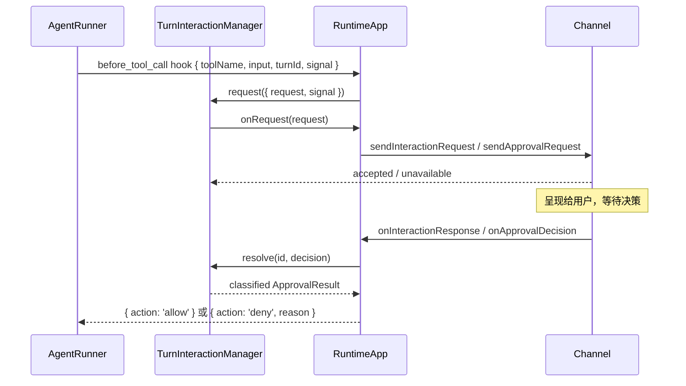

# Channel 层设计文档

> 基准版本：v1.0
> 文档日期：2026-05-29
> 状态同步：2026-09-01（Approval response-or-Abort lifecycle）
> 关联文档：`runtime.md` · `core_runner.md`

---

## 1. 概述

`src/adapters/channel/` 是 my-agent 的 **I/O 适配层**，把 `RuntimeApp` 内部运行与外部输入输出（终端、WebSocket、未来 HTTP 等）之间的边界统一起来。

它解决三个问题：

- `RuntimeApp` 只有进程内 `runTurn()` 接口，无法原生支持 CLI / WebSocket 等多种 I/O；
- `before_tool_call` hook 需要外部决策后才能继续，但纯 hook 没有把决策传回的通道；
- 同一 session 多 client 场景需要明确的广播 / 定向路由策略。

### 1.1 容易混淆的边界

**入站消息的队列调度**属于 `runtime`——channel 只负责把消息推给 RuntimeApp，调度和串行由 RuntimeApp 内部完成。

---

## 2. 目录结构

```
src/adapters/channel/
├── types.ts                  # 全部类型定义
├── TurnInteractionManager.ts # 进程内 Promise bus
├── CliChannel.ts             # readline 实现
├── WebSocketChannel.ts       # ws server 实现
└── index.ts                  # 公共导出
```

---

## 3. 三条数据流

### 3.1 入站（client → agent）

```
WS client 或 CLI 输入
  │ ChannelRunRequest
  ▼
channel.onMessage(handler)   ← handler 由 RuntimeApp.registerChannel 注入
  ▼
RuntimeApp.handleInboundChannelMessage
  ├─ 输入装配完成后 emit user_message → 同 session 所有 client
  ├─ steering 条件 → steeringInboxBySession
  └─ 普通入站 → enqueueQueuedTurn → scheduleNextQueuedTurn
                   ▼
              startQueuedTurn:
                turnId = randomUUID()
                routeContextByTurn.set(turnId, { originChannel, originClientId })
                runTurn(...)
```

- **turnId 在 startQueuedTurn 才生成**——排队阶段不占用 turn 级资源
- **clientId 不进 RunTurnParams**——封装在 `MessageRouteContext`，runner 不感知 transport 概念
- **channel 不绕过队列**——永远通过 handler 入站，不直接调 runTurn
- **用户输入是一等事件**——`user_message` 在 queued / steering 分流前广播；queued 消息通过 `run_start.originMessageId` 关联后续 turn

### 3.2 出站（agent → client）

```
AgentRunner 触发 AgentEvent（自带 sessionKey + turnId）
  ▼
RuntimeApp bootstrap 时注入的 fanout 闭包:
  ├─ for each channel: channel.send(event)   ← 遍历 channels[] 引用
  └─ RuntimeAppOptions.onAgentEvent?.(event)

channel.send 实现:
  ├─ CliChannel      → 渲染到 stdout（单 client，忽略 sessionKey）
  └─ WebSocketChannel → 按 sessions[event.sessionKey] 广播给所有连接
```

- **事件自描述**：AgentEvent 自带 `sessionKey` / `turnId`，channel 直接读取自路由
- **fanout 共享 `channels[]` 引用**：registerChannel 后新增的 channel 即时可见
- **send 抛错被吞为 warning**：单个 channel 故障不中断分发
- **附件广播只含摘要**：`user_message.attachmentSummaries` 不携带原始 Base64

### 3.4 Abort（channel → runtime）

```
CLI Ctrl+C / WS { type:'abort_turn', sessionKey }
  → Channel AbortHookBindings.abortTurn(sessionKey)
  → RuntimeApp.abortTurn(sessionKey)
  → abort active turn + drop queued messages
  → run_end.result.stopReason = 'aborted'
```

Channel 通过可选 `bindAbortHooks` 接收 Runtime 注入的中止能力，不反向依赖 RuntimeApp。WebSocket 的 `abort_turn` 无单独 Ack；客户端通过 `run_end` 感知中止完成。

### 3.3 Approval / Interaction（hook ↔ channel）



  非人工终态路径：Turn Abort、Shutdown、初始 delivery failure 或 origin disconnect → classified settlement → `onClose` → RuntimeApp 通知起源 channel 关闭 UI。elapsed time 不改变 pending 状态。

关键路由规则：
- **起源路由不广播**：按 turnId 查 `routeContextByTurn` 只通知起源 channel
- **interaction 优先于 approval**：channel 同时实现两者时走 `interaction`
- **起源不可达时 fail closed**：分类为 unavailable，不伪装成用户 deny
- **当前调用无 capability 时 fail closed**：unmatched Tool 不依赖启动历史，不直接放行

---

## 4. 类型定义

### 4.1 入站消息

```
ChannelRunRequest {
  sessionKey: string
  message: string
  model?: string
  maxTokens?: number
  maxLlmCalls?: number
  clientId?: string   // channel 层路由元数据，不进 RunTurnParams
}
```

### 4.2 Channel 接口

```
Channel {
  id: string
  send(event: AgentEvent): void
  onMessage(handler: (req: ChannelRunRequest) => Promise<void>): void
  start(): Promise<void>
  stop(): Promise<void>
  interaction?: ChannelInteractionAdapter   // 可选，通用交互
  approval?: ChannelApprovalAdapter         // 可选，审批兼容接口
}

ChannelInteractionAdapter {
  sendInteractionRequest(request: TurnInteractionRequest): ApprovalDeliveryResult
  sendInteractionClosed(request: TurnInteractionRequest, result: ApprovalClosedResult): void
  onInteractionResponse(handler: (response: TurnInteractionResponse) => void): void
  onInteractionUnavailable(handler: (id: string, reason: 'origin_disconnected') => void): void
}

ChannelApprovalAdapter {
  sendApprovalRequest(request: ApprovalRequest): ApprovalDeliveryResult
  sendApprovalClosed(request: ApprovalRequest, result: ApprovalClosedResult): void
  onApprovalDecision(handler: (id: string, decision: ApprovalDecision) => void): void
  onApprovalUnavailable(handler: (id: string, reason: 'origin_disconnected') => void): void
}
```

### 4.3 审批类型

```
ApprovalRequest {
  id: string
  toolName: string
  input: Record<string, unknown>
  sessionKey: string
  turnId: string
  originClientId?: string
}

ApprovalResult =
  | { outcome: 'approved' }
  | { outcome: 'denied'; reason: 'user' | 'user_cancelled' }
  | { outcome: 'aborted'; reason: 'turn' | 'shutdown' }
  | { outcome: 'unavailable'; reason: 'origin_missing' | 'delivery_failed' | 'origin_disconnected' }
  | { outcome: 'failed'; message: string }
```

### 4.4 通用 turn 交互类型

```
TurnInteractionKind = 'approval' | 'select'

TurnInteractionRequest =
  | ApprovalInteractionRequest { kind:'approval'; toolName; input; ... }
  | SelectInteractionRequest   { kind:'select'; options; title?; ... }

TurnInteractionResponse =
  | ApprovalInteractionResponse { outcome:'submitted'; decision } | { outcome: 'cancelled'|'aborted' }
  | SelectInteractionResponse   { outcome:'submitted'; value   } | { outcome: 'cancelled'|'aborted' }
```

`outcome` 区分用户提交、主动取消和 abort。`select` 类型已在类型层定义，但当前两个内置 channel 尚未真正实现。

---

## 5. TurnInteractionManager

进程内 Promise bus，统一管理 turn 内阻塞式 approval 交互。

```
TurnInteractionManager {
  request({ request, signal }): Promise<ApprovalResult> // before_tool_call hook 调用，阻塞等待
  resolve(id, decision): void               // channel 收到用户决策后调用
  onRequest(handler): void                  // RuntimeApp 注册，request 创建时路由给起源 channel
  onClose(handler): void                    // RuntimeApp 注册，非人工终态时关闭起源 channel UI
  close(): void                             // 以 aborted/shutdown 结束所有 pending 请求
}
```

内部结构：`Map<id, { resolve, request, signal, abortHandler }>`。没有 elapsed-time timer。

**request() 流程：**
```
id = randomUUID()
pending.set(id, { resolve, request, signal, abortHandler })
同步触发 requestHandler，并检查 delivery result
return Promise // 等待用户决策、Abort、Shutdown 或 origin unavailable
```

---

## 6. CliChannel

readline 实现，面向单 session 的 CLI 交互场景。

### 6.1 配置

```
CliChannelConfig {
  input?: NodeJS.ReadableStream    // 默认 process.stdin
  output?: NodeJS.WritableStream   // 默认 process.stdout
  prompt?: string                  // 默认 '> '
  sessionKey?: string              // 默认 'main'（所有 CLI 输入归到此 session）
  approval?: boolean               // 默认 false；开启后收到审批请求阻塞等待 y/n
}
```

### 6.2 send 渲染策略

| AgentEvent | CLI 输出 |
|---|---|
| `text_delta` | `stdout.write(text)`（流式） |
| `tool_use` | dim `[tool: name]\n` |
| `tool_result` | `[tool result]` / `[tool error]` + 截断预览（见下） |
| `user_message` | 仅渲染来自外部 client 的用户输入；本地 CLI 输入不重复回显 |
| `compaction_start` | yellow `[compacting… trigger=X]\n` |
| `compaction_end` | yellow `[compacted: X → Y tokens, dropped N messages]\n` |
| `error` | 仅 breakStream()，不打印——runner emit error 后立刻 throw，由 start() 的 catch 统一打印，避免双行 |
| `run_end` | breakStream()（换行） |
| `run_start` / `llm_call` / `tool_result_pruned` | 忽略 |

**tool_result 预览规则：**
- 去尾部空行，折叠连续空行（保留段落感）
- 总行数 ≤ 16（10 head + 6 tail）则全显示；超过则 head + `... [N lines omitted]` + tail
- 单行字符上限 200，超出追加 `…`
- 纯显示截断，LLM 仍收到完整 tool result

### 6.3 stop 与 readline 中断

- `stop()` 设 `stopped=true`，reject 当前等待中的 `rl.question()`（pendingPromptReject）
- 阻塞在 approval `y/n` 时，stop() 触发 reject 后静默忽略
- 多次调用 `stop()` 幂等

### 6.4 Approval 处理

开启 `approval: true` 时同时构造 `interaction` 和 `approval` 两个适配器：
- `sendInteractionRequest`（kind=`'approval'`）和 `sendApprovalRequest` 最终都走同一个 `promptApproval()` → readline `y/n` prompt
- 非 approval 的 interaction kind → **throw**（CliChannel 不支持）
- 非人工 closure 或 `stop()` 通过 AbortSignal 取消底层 readline question；Promise 已 reject 后的 late callback 不会提交决策
- 响应优先走 `interactionResponseHandler`，未注册则回退 `approvalDecisionHandler`

---

## 7. WebSocketChannel

ws server 实现，支持多 client / 多 session。

### 7.1 配置

```
WebSocketChannelConfig {
  port: number
  host?: string       // 默认 '127.0.0.1'
  path?: string       // 默认 '/ws'
  maxClients?: number // 默认不限
  approval?: boolean  // 默认 false
}
```

### 7.2 客户端协议（JSON，全 snake_case）

**Client → Server：**

| 消息 | 说明 |
|---|---|
| `{ type:'hello'; clientId }` | 建连后第一条，绑定逻辑 clientId |
| `{ type:'run_turn'; sessionKey; message; model?; maxTokens?; maxLlmCalls? }` | 发起 turn |
| `{ type:'approval_resolve'; id; decision }` | 提交审批决策 |
| `{ type:'abort_turn'; sessionKey }` | 中止该 session 的活动 turn 并清空普通队列 |

**Server → Client：**

| 消息 | 路由 |
|---|---|
| `{ type:'hello_ack'; clientId }` | 单播，握手确认 |
| AgentEvent 全部 variant | 广播给同 session 所有已连接 client |
| `{ type:'approval_requested'; id; toolName; input }` | 定向发给 originClientId |
| `{ type:'approval_closed'; id; outcome; reason }` | 定向发给 originClientId；只承载 aborted/unavailable/failed |
| `{ type:'channel_error'; code; message }` | 单播，协议错误通知 |

### 7.3 内部状态（双表）

```
sessions: Map<sessionKey, Set<clientId>>  // send() 按 sessionKey 广播
clients:  Map<clientId, WebSocket>        // approval 定向发送
```

客户端完成 `hello(clientId)` 后绑定到当前连接。发送 `run_turn` 时，clientId 自动注册进 sessionKey 集合。

**重复连接**：同一 `clientId` 重连时，旧连接被主动关闭（code 1000），新连接接管。

**断线清理**：连接断开立即清理路由表；pending interaction 的重投递属于上层逻辑，不属于 transport 恢复。

---

## 8. RuntimeApp 接入面

```
app.registerChannel(channel)  // 注册；可多次调用；必须在 startChannels() 前
app.startChannels()            // 先 wireApprovalRouting，再并行 channel.start()
app.stopChannels()             // 幂等；close() 内部自动调用
```

`startChannels()` 用 `Promise.all` 并行启动——`CliChannel.start()` 是阻塞的 readline 循环，不能串行阻塞其他 channel。

`runTurn()` 仍可直接调用（库模式）。直接调用时：
- 不经过入站队列调度（`runTurn()` 是同步入口）
- 没有 `routeContext`，因此没有 origin approval capability；allowlist 命中时直接 allow，未命中时 fail-closed deny，不创建 approval wait
- 需自己处理 per-session 并发（重入抛 `RUN_REJECTED`）

---

## 9. ⚠️ 代码与 v1.0 文档的已知差异

### 差异 1：`CliChannelConfig` 多一个 `sessionKey` 字段

**v1.0 文档**的 `CliChannelConfig` 只有 `input / output / prompt / approval`。  
**实际代码**增加了 `sessionKey?: string`（默认 `'main'`），用于指定 CLI 输入归属的 session。

> 建议：补充 `sessionKey` 字段说明，说明单 session 场景下的默认行为。

### 差异 2：WebSocket 协议有未文档的 `channel_error` 消息类型

**v1.0 文档** Server→Client 消息列表中没有 `channel_error`。  
**实际代码**（`WebSocketChannel.ts`）定义并使用了 `{ type:'channel_error'; code; message }` 用于通知客户端协议错误（invalid JSON、unsupported message type 等）。

> 建议：在 WS 协议出站消息表中补充 `channel_error`，并列出 `ChannelErrorCode` 取值（`INVALID_JSON` / `INVALID_MESSAGE` / `UNSUPPORTED_MESSAGE` / `SERVER_NOT_READY`）。

---

## 10. 已知规划项

| 项目 | 状态 |
|---|---|
| `HttpChannel`（REST + SSE） | 规划中 |
| Channel 鉴权 / 多租户 | 规划中 |
| `select` interaction 实现（CliChannel / WebSocketChannel） | 规划中 |
| 迟到 client 中途订阅进行中 turn 的事件流 | 规划中 |
| Pending interactions 重投递（client 重连后） | 规划中 |
| 事件补发 / replay buffer（断线重连） | 规划中 |
| 外部平台 Channel（Slack / Discord 等） | 规划中 |
