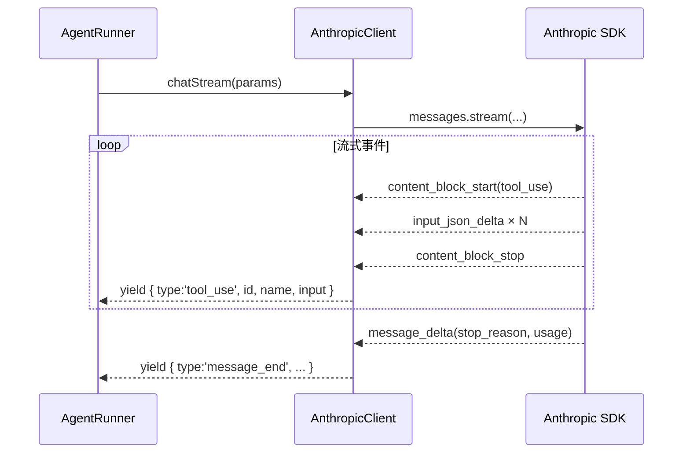

# Adapter LLM 设计文档

> 文档日期：2026-05-29
> 关联文档：`core_runner.md` · `runtime.md`

---

## 1. 概述

`src/adapters/llm/` 定义 `LLMClient` 抽象接口和 `AnthropicClient` 实现。AgentRunner 依赖接口，不依赖具体实现——方便测试替换和未来接入其他 LLM 提供商。

---

## 2. 目录结构

```
src/adapters/llm/
├── types.ts          # LLMClient / ChatMessage / ChatParams / StreamEvent / TokenUsage
├── AnthropicClient.ts
└── index.ts
```

---

## 3. 类型定义

### 3.1 LLMClient 接口

```
LLMClient {
  chatStream(params: ChatParams): AsyncIterable<StreamEvent>   // 流式
  chat(params: ChatParams): Promise<ChatResponse>              // 非流式（收集完整响应）
}
```

### 3.2 ChatParams

```
ChatParams {
  model: string
  system?: string
  messages: ChatMessage[]
  tools?: ChatToolDefinition[]
  maxTokens?: number
  signal?: AbortSignal          // 预留，用于取消请求
}
```

### 3.3 StreamEvent（流式事件流）

```
StreamEvent =
  | { type: 'message_start' }
  | { type: 'text_delta'; text: string }
  | { type: 'tool_use'; id; name; input: Record<string, unknown> }
  | { type: 'message_end'; stopReason: string; usage: TokenUsage }
  | { type: 'error'; error: Error }
```

AgentRunner 只消费 `text_delta`、`tool_use`、`message_end`、`error`；`message_start` 是协议边界标记，AgentRunner 忽略。

### 3.4 工具定义

```
ChatToolDefinition {
  name: string
  description: string
  input_schema: Record<string, unknown>   // Anthropic API 要求的字段名
}
```

---

## 4. AnthropicClient

### 4.1 配置

```
AnthropicClientOptions {
  apiKey: string
  baseURL?: string    // 支持 LiteLLM Proxy / MAI-LLMProxy 等代理
}
```

### 4.2 流式实现要点

Anthropic SDK 把 tool_use block 分拆为多个流式事件推送：

```
content_block_start  { type: 'tool_use', id, name }
input_json_delta     { partial_json: '...' }
input_json_delta     { partial_json: '...' }
content_block_stop
```

`chatStream` 内部累积 `inputJson` 字符串，在 `content_block_stop` 时解析 JSON 后一次性 yield `{ type: 'tool_use', id, name, input }`——对 AgentRunner 屏蔽了分片细节。



### 4.3 context overflow 包装

Anthropic API 抛出 context length 错误时，`chatStream` 捕获并重新抛出为框架内部的 `ContextOverflowError`，让 AgentRunner 的外层 retry 循环统一处理。

### 4.4 代理支持

`baseURL` 透传给 Anthropic SDK 的 `baseURL` 选项。部分代理（如 LLMProxy）可能返回不完整的 usage 信息（如 `inputTokens: 0`），这是代理行为，不影响功能。

---

## 5. 关键设计决策

| 决策 | 说明 |
|---|---|
| `LLMClient` 接口与实现分离 | AgentRunner 依赖接口，测试可注入 mock，不依赖网络 |
| tool_use 分片组装在 adapter 层 | AgentRunner 收到的始终是完整的 `tool_use` 事件，不感知 Anthropic 流式分片协议 |
| `chat()` 便捷方法 | 内部调用 `chatStream` 收集完整响应——不引入第二套代码路径 |
| `signal` 字段预留 | AbortSignal 取消支持尚未在 runner 侧落地，类型预留 |
