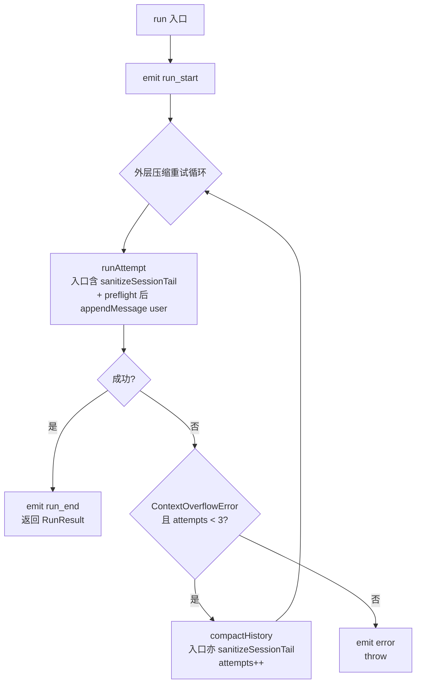
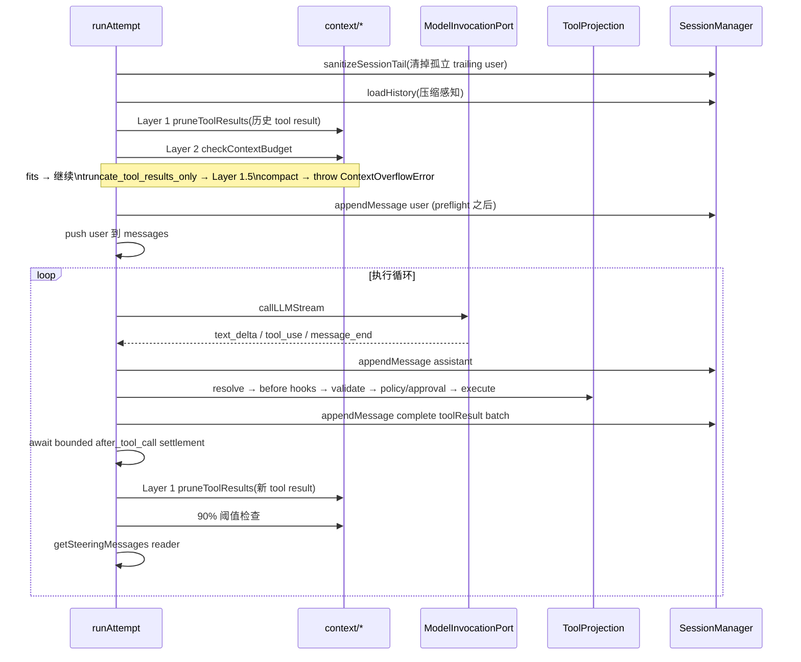

# Agent Runner Current Architecture

> Status: Current Authority
> Verified: 2026-09-09
> Ownership: Runner loop, context budgeting, Compaction, Tool/Hook invocation, and Runner events
> Ownership key: runner-execution-and-context

---

## 1. 概述

`src/core/runner/` 是 Agent 的**执行引擎**，消费 resolved Provider-neutral invocation Port，并串联 `core/session`、`core/tools` 与上下文管理子模块，完成一次完整的"对话循环"：LLM 调用 → tool 执行 → tool 结果回传 → LLM 继续。

### 1.1 职责

| 职责 | 说明 |
|---|---|
| 执行循环 | LLM 调用 + tool use + steering 注入，单层 `while` 推进 |
| 上下文管理 | 4 层渐进策略：per-result 裁剪 → 聚合裁剪 → 预判路由 → LLM 摘要 |
| 压缩编排 | 外层重试：捕获 `ContextOverflowError` → `compactHistory` → retry |
| 消息持久化 | 用户消息、助手回复、tool result 在产生时立即写入 session |
| Hook 与 Event | 消费 immutable Hook projection；interceptor awaited，observer bounded settlement；统一 `onEvent` 出口 |
| Steering 注入 | 每轮 tool 执行后通过 `getSteeringMessages` reader 拉取消息并注入对话流 |

### 1.2 容易混淆的边界

**配置加载与注册**不在 runner 内——runner 不调 `loadConfig()`，不持有 Registry Builder，也不提供 mutable registration/setter API。每个 Turn 显式接收 `ResolvedModel`、Tool/Hook projections、Application Policy 和可选 current-call Approval Capability。

### 1.3 配置边界

Runner 只接收 runtime 层提炼的最小子集，不调用 `loadConfig()` / `resolveAgentConfig()`，不读 `process.env`：

`resolvedModel` · `systemPrompt` · `toolProjection` · `hookProjection` · `toolPolicy` · `approvalCapability?` · `maxLlmCalls` · `compaction`

### 1.4 与其他模块的关系

```
RuntimeApp
  │  RunParams（最小子集）
  ▼
AgentRunner.run()
  ├─ SessionManager     ← 读写消息历史、compaction record
  ├─ ResolvedModel      ← Turn-bound Provider-neutral invocation Port/Facts/Limits
  ├─ ToolProjection     ← canonical definition/validator/implementation
  ├─ HookProjection     ← ordered immutable bindings
  ├─ ApplicationToolPolicy + Approval Capability
  ├─ context/*          ← pruneToolResults / checkContextBudget / compactMessages / estimatePromptTokens
  └─ hooks/*            ← runBefore/AfterToolCall / Compaction
```

---

## 2. 目录结构

```
src/core/runner/
├── index.ts                 # 公共导出
├── types.ts                 # AgentRunnerConfig / RunParams / RunResult / AgentEvent / PendingMessageReader
├── AgentRunner.ts           # 主类
├── errors.ts                # ContextOverflowError / isContextOverflowError
├── test-helpers.ts          # makeRunParams() 测试辅助
├── hooks/
│   ├── index.ts
│   ├── runner.ts            # priority 排序、Interceptor / Observer 区分
│   └── types.ts             # BeforeToolCallHook / AfterToolCallHook / Before/AfterCompactionHook
└── context/
    ├── token-estimation.ts  # estimatePromptTokens（含安全边距）
    ├── tool-result-pruning.ts  # Layer 1 pruneToolResults / Layer 1.5 pruneToolResultsAggregate
    ├── context-budget.ts    # Layer 2 checkContextBudget
    └── compaction.ts        # Layer 3 compactMessages（splitForCompaction / generateSummary）
```

---

## 3. 类型系统

### 3.1 AgentRunnerConfig

```
AgentRunnerConfig {
  sessionManager: SessionManager
  onEvent?: (event: AgentEvent) => void  // 统一 event 出口；RuntimeApp 注入 fanout 闭包
}
```

### 3.2 RunParams

```
RunParams {
  sessionKey: string
  message: string | ChatContentBlock[]
  systemPrompt: string
  turnId: string                        // 必填；emit / hook payload 依赖
  requestId?: string                    // root request identity；缺省时使用 turnId
  resolvedModel: ResolvedModel
  toolProjection: ToolProjection
  hookProjection: HookProjection
  toolPolicy: ApplicationToolPolicy
  approvalCapability?: CurrentCallApprovalCapability
  maxLlmCalls?: number                  // 默认 12
  getSteeringMessages?: PendingMessageReader  // 每轮 tool 后 runner 拉取
  compaction?: CompactionConfig
  originMessageId?: string              // queued user_message 的关联 id
  signal?: AbortSignal                  // 用户中止 / shutdown 信号
}

type PendingMessageReader = () => ChatMessage[] | Promise<ChatMessage[]>
```

- `turnId` 是必填字段，但 RuntimeApp 层对库调用方是可选（不传则自动生成）
- `getSteeringMessages` 未提供时 runner 视为无 steering——零运行时开销

### 3.3 RunResult

```
RunResult {
  text: string              // 最终回复文本
  content: ChatContentBlock[]
  stopReason: string        // 'end_turn' | 'max_llm_calls' | 'error' | 'aborted' | ...
  usage: TokenUsage         // 累计（所有 LLM 调用总和）
  toolRounds: number
  compacted?: boolean       // 本次 run 是否触发过压缩
}
```

详细压缩统计通过 `compaction_end` 事件提供，暂不在 `RunResult` 字段中暴露。

### 3.4 AgentEvent

事件按生命周期携带不同关联键，而不是共享一套虚假的公共字段：

```
AgentEvent =
  | { type: 'run_start';  requestId; sessionKey; turnId; originMessageId? }
  | { type: 'run_end';    requestId; sessionKey; turnId; result }
  | { type: 'error';      requestId; sessionKey; turnId; error; category?; originMessageId? }
  | { type: 'request_end'; requestId; outcome: 'cancelled'; reason; originMessageId? }
  | { type: 'user_message'; sessionKey; messageId; content; attachmentSummaries?; originClientId; deliveryMode; timestamp }
  | { type: 'text_delta'; sessionKey; turnId; text }
  | { type: 'tool_use';   sessionKey; turnId; name; input }
  | { type: 'tool_result';sessionKey; turnId; name; result }
  | { type: 'llm_call';   sessionKey; turnId; round }
  | { type: 'tool_result_pruned'; sessionKey; turnId; toolUseId; originalChars; prunedChars }
  | { type: 'compaction_start';   sessionKey; turnId; trigger; estimatedTokens }
  | { type: 'compaction_end';     sessionKey; turnId; tokensBefore; tokensAfter; droppedMessages }
  | { type: 'session_tail_sanitized'; sessionKey; turnId; discardedEntryId; discardedRole: 'user' }
  | { type: 'orphan_tool_results_repaired'; sessionKey; turnId; count; source }
  | { type: 'subagent_start'; requestId; runId; sessionKey; turnId; depth; subagentType; lifecycle; parentSessionKey; parentTurnId; parentToolUseId }
  | { type: 'subagent_end'; requestId; runId; sessionKey; turnId; depth; subagentType; lifecycle; parentSessionKey; parentTurnId; parentToolUseId; outcome; failure? }
```

设计要点:
- `run_start` / `run_end` / `error` 同时携带 request、session 与 turn correlation；`requestId` 缺省时由 Runner 使用 `turnId`
- `request_end` 关闭尚未启动的 queued request，因此只有 `requestId`，明确不带 `sessionKey` / `turnId`
- `user_message` 与 Turn 解耦，使用 `messageId`；Subagent lifecycle 另有 tree/run/parent correlation
- `compaction_start.estimatedTokens` 是估算值;准确的 `tokensBefore` 在 `compaction_end` 给出
- `error` 既 emit 又 throw,让 channel 与库消费者自由选择呈现路径
- `session_tail_sanitized` 由 runAttempt / compactHistory 入口的 `sanitizeSessionTail` 触发(见 §7.3)

`src/core/runner/types.ts` 的 discriminated union 是字段级穷举 contract；上表按事件 family 摘要，不建立第二份类型定义。

---

## 4. 执行流程总览

### 4.1 入口 run()



关键不变量:
- **每次 retry 都会重新 append user**:append 下沉到 runAttempt 内 preflight 之后;`sanitizeSessionTail` 在入口清掉上一轮残留的孤立 trailing user,保证不出现重复写入或连续 user role(见 §7.3)
- **`MAX_COMPACTION_RETRIES = 3`**：超过则向上抛出 `ContextOverflowError`
- **每次 retry 重新 `loadHistory`**：能自动感知压缩写入的新 compaction record

### 4.2 runAttempt：单次完整尝试



**user 落盘下沉到 preflight 之后**:预判检查所用的 `messages` 不含当前用户消息(`currentPrompt` 单独传入);预判通过后才 `appendMessage` + push——当前消息永远不会被 Layer 1/1.5 裁剪,preemptive 压缩抛出时也不会污染下一轮 retry 的输入。

---

## 5. 执行循环

```
初始化：llmCallCount=0, hasMoreToolCalls=true（保证至少一次 LLM 调用）

while (hasMoreToolCalls):

  if signal.aborted:
    drop locally pending steering and return stopReason='aborted'

  if llmCallCount >= maxLlmCalls:
    return { stopReason: 'max_llm_calls', ... }

  append pending steering after prior tool results

  emit { type: 'llm_call', round }
  llmCallCount++

  llmResult = callLLMStream(..., signal)
    for await event of resolvedModel.invocationPort.chatStream:
      text_delta  → emit + 收集
      tool_call   → 收集 canonical call
      message_end → 记录 stopReason + usage
      error       → throw
    catch isContextOverflowError → throw ContextOverflowError

  messages.push({ role: 'assistant', content })
  session.appendMessage('assistant', content)

  if stopReason in {'error', 'aborted'}: return early

  if toolUseBlocks.length == 0:
    hasMoreToolCalls = false
  else:
    for each toolUse:
      emit { type: 'tool_use', name, input（原始） }

      resolve canonical Tool；malformed/unknown 直接配对 result
      before_tool_call hooks（Snapshot 稳定顺序，可替换 input / deny）
      validate effective input
      apply Tool Policy + optional current-call Approval Capability
      result = tool.execute(effectiveInput, { sessionKey, turnId, callId, signal })
      emit { type: 'tool_result', name, result }
      start after_tool_call observers（parallel、per-handler bounded）

    messages.push({ role: 'user', content: toolResultBlocks })
    session.appendMessage('toolResult', toolResultBlocks)
    await all after_tool_call logical settlements

    Layer 1: pruneToolResults（新 tool result，无 emit 回调）
    90% 阈值检查 → throw ContextOverflowError

    totalToolRounds++

    steeringMessages = readPendingMessages(getSteeringMessages)
    if steeringMessages.length > 0: appendInjectedMessages(...)

return { text, content, stopReason, usage, toolRounds }
```

`signal.aborted` is checked before quota, steering injection, `llm_call`, and invocation. A pre-call Abort therefore does not consume quota or emit a call event.

### 5.1 `maxLlmCalls` 配额

- 计数对象是"实际发起的 LLM 调用"（含无 tool use 的轮次）
- 检查在每次 LLM 调用**前**，触发上限时立即返回，保留最后一次回复
- 默认 12，由 runtime 从 `config.runner.maxLlmCalls` 透传

### 5.2 emit + hook 触发时机

| 时机 | Emit | Hook |
|---|---|---|
| run 开始 | `run_start` | — |
| LLM 调用前 | `llm_call` | — |
| 流式收到 text | `text_delta` | — |
| tool use 检测后、执行前 | `tool_use`（原始 input） | `before_tool_call`（sequential, priority 降序，可改 input / deny） |
| tool terminal result | `tool_result` | `after_tool_call`（parallel、5 秒 per-handler bounded settlement） |
| tool result 裁剪触发（仅初始历史） | `tool_result_pruned` | — |
| 压缩开始 | `compaction_start` | `before_compaction`（observer） |
| 压缩完成 | `compaction_end` | `after_compaction`（observer） |
| run 成功 | `run_end` | — |
| run 失败 | `error`（同时 throw） | — |

---

## 6. 上下文管理（4 层）

| 层 | 实现 | 调 LLM？ | 触发时机 |
|---|---|---|---|
| **Layer 1** | `pruneToolResults` | 否 | `runAttempt` 开头；每轮 tool result 追加后 |
| **Layer 1.5** | `pruneToolResultsAggregate` | 否 | Layer 2 路由为 `'truncate_tool_results_only'` 时 |
| **Layer 2** | `checkContextBudget` | 否 | `runAttempt` 开头（delay-append 之前） |
| **Layer 3** | `compactMessages` | 是 | 外层捕获 `ContextOverflowError` 后 |

### 6.1 三条溢出路径

所有路径统一抛出 `ContextOverflowError`，由外层 retry 循环处理：

```
路径 1：runAttempt 开头预判  checkContextBudget='compact'  → trigger='preemptive'
路径 2：内层 90% 阈值        estimatedTokens > 0.9 × contextWindow → trigger='overflow'
路径 3：LLM API 错误         callLLMStream 捕获 + isContextOverflowError → trigger='overflow'
```

### 6.2 Layer 3 压缩流程

```
compactHistory(params, compaction, trigger):

  sanitizeSessionTail(sessionKey)   // 同 runAttempt 入口;overflow 触发时把已落盘的本轮 user 剥离
  messages = loadHistory(sessionKey)
  estimatedTokens = estimatePromptTokens({ messages })

  runBeforeCompaction hooks（observer）
  emit { type: 'compaction_start', trigger, estimatedTokens }

  compactResult = compactMessages({ messages, config, resolvedModel, trigger })
    // LLM 生成摘要；失败时降级为兜底文本

  keptCount = compactResult.messages.length - 1   // 减去摘要消息
  firstKeptIndex = max(0, allMessages.length - keptCount)
  firstKeptEntryId = allMessages[firstKeptIndex].id

  session.appendCompactionRecord(sessionKey, compactResult.record, firstKeptEntryId)

  runAfterCompaction hooks（observer）
  emit { type: 'compaction_end', tokensBefore, tokensAfter, droppedMessages }

  session.updateSession(sessionKey, { totalTokens: tokensAfter })
```

压缩记录持久化后，下次 `runAttempt` 的 `loadHistory` 自动截断并注入摘要。

---

## 7. Session 持久化与历史加载

### 7.1 消息写入时序

```
runAttempt 入口 → sanitizeSessionTail                         ← 清掉上一次失败/中断遗留的 trailing user
                → loadHistory(压缩感知)
                → Layer 1 / Layer 2 预判
                → appendMessage('user',      用户输入)         ← preflight 通过后才写入(每轮 retry 都写一次)
LLM 调用 #1     → callLLMStream
                → appendMessage('assistant', [text + tool_use])
                → appendMessage('toolResult',[tool_result])
LLM 调用 #2     → callLLMStream
                → appendMessage('assistant', [text])
return
```

注入消息(steering)也走 `appendMessage`,同步追加到内存 `messages` 和 session。

### 7.2 sanitizeSessionTail:清洗孤立 trailing user

`runAttempt` 与 `compactHistory` 入口都会调用 `sanitizeSessionTail(sessionKey)`。它检查当前分支末尾,若 `role === 'user'`(上一次失败/中断遗留的孤立 user),则通过 `session.branch(parentId)` 把 leaf 指针回退到其父节点,并 emit `session_tail_sanitized`。

```
sanitizeSessionTail(sessionKey):
  records = session.getMessages(sessionKey)
  if records empty: return
  last = records[最后一项]
  if last.role !== 'user':
    if last.role === 'toolResult':
      warn("session tail is toolResult; skipping")    // 不主动修复,见下
    return
  session.branch(sessionKey, last.parentId)           // 仅改内存 leafId,不写 JSONL
  emit { type: 'session_tail_sanitized', discardedEntryId: last.id, discardedRole: 'user' }
```

要点:
- **只清 trailing user,不清 trailing toolResult**:tool 可能已经产生副作用,保留 toolResult 让下一轮 LLM 基于已有进度继续推理;末尾若是 toolResult 仅记 warn 日志
- **compactHistory 也需调用**:overflow 触发的压缩此时 runAttempt 已 append 过本轮 user;若不清掉,`appendCompactionRecord(firstKeptEntryId)` 会写到一条下轮即将被剥离当前分支的 entry 上,导致下一轮 loadHistory 的截断失效、摘要与全量历史重叠
- **幂等**:清洗一次后末尾不再是 user,再调一次直接 return
- **仅修改内存 `leafId`**:被剥离的 entry 仍保留在 JSONL 中可审计,append-only 契约不破坏
- **设计动机与边界场景**详见 [core-runner-turn-flow-spec](../core-runner-turn-flow-spec.md)

### 7.3 loadHistory 与压缩感知

```
loadHistory(sessionKey):
  records = session.getMessages(sessionKey)
  compactionRecord = session.getLastCompactionRecord(sessionKey)

  if compactionRecord:
    keptIndex = records.findIndex(r => r.id === compactionRecord.firstKeptEntryId)
    if keptIndex >= 0:
      records = records.slice(keptIndex)   // 截断旧历史

  messages = records.map:
    toolResult role → user（对齐 Anthropic API 格式）
    其他 → 原样

  if compactionRecord:
    messages.unshift({
      role: 'user',
      content: '[Previous conversation summary]\n\n' + compactionRecord.summary + '\n\n...'
    })

  return messages
```

---

## 8. In-turn 消息注入

Runner 只有**一个**注入点：每轮 tool 执行后。

```
每轮 tool 执行完成后:
  steeringMessages = await readPendingMessages(params.getSteeringMessages)
  if steeringMessages.length > 0:
    appendInjectedMessages(sessionKey, messages, steeringMessages)
```

**Reader 契约**（`PendingMessageReader`）：
- 返回 `ChatMessage[]`，每条必须有 `role: 'user' | 'assistant'` 和 `content`
- 应为"消费即清空"语义——runner 每轮只调一次，期望 reader 内部删除已读数据
- 非法形态被 `readPendingMessages` 防御性过滤静默丢弃

Runner 没有 followup / steer 模式概念——`inTurnMessageMode` 只在 RuntimeApp 入站层读取，runner 只感知 reader 是否提供。详见 [runtime.md §6](./runtime.md)。

---

## 9. Hook 系统

### 9.1 Hook 类型

| Hook | 时机 | 执行模型 | 能否修改/否决 |
|---|---|---|---|
| `before_tool_call` | tool 执行前 | sequential, priority 降序 | ✅ 可改 input / deny |
| `after_tool_call` | terminal result 后 | parallel, bounded settlement | ❌ |
| `before_compaction` | 压缩开始前 | parallel, bounded settlement | ❌（observer-only） |
| `after_compaction` | commit 后 | parallel, bounded settlement | ❌（observer-only） |

### 9.2 启动期 Contribution

```
unit.register(api) {
  api.registerHook({
    id: 'audit-tools',
    hookName: 'after_tool_call',
    priority: 100,
    handler: observeToolResult,
  })
}
```

Runner 不提供 `on()` mutable registration。Registry Builder 在 startup staging 后按 priority 降序、unit ID 和 contribution ID 升序冻结 projection；`before_tool_call` 是 Interceptor（可否决），其余是 Observer（仅观察）。Approval authorization 是显式 capability，不是 Hook。

---

## 10. Event emit 机制

### 10.1 显式 TurnContext 注入

```
run(params):
  turnCtx = { sessionKey, turnId, requestId }
  emit(turnCtx, { type: 'run_start', ... })
  runAttempt(turnCtx, ...)
```

`run()` 从参数构造轻量、只读 `TurnContext`，并沿内部调用链显式传递。`AgentRunner` 不保存“当前 run”实例状态，因此嵌套或并发 `run()` 不会串用事件标签。

内部 `emit` 从显式 context 注入公共关联字段：

```
emit(turnCtx, event: AgentEventInput):
  if !onEvent: return
  onEvent({ ...event, sessionKey: turnCtx.sessionKey, turnId: turnCtx.turnId })
  // run_start / run_end / error 同时注入 requestId
```

调用方写法为 `this.emit(turnCtx, { type: 'text_delta', text })`，不手填公共字段，但编译期必须提供所属 Turn。

### 10.2 AgentEventInput 私有类型

```typescript
// 条件类型分发：为每个 AgentEvent variant 单独 Omit 关联字段
type AgentEventInput = AgentEvent extends infer E
  ? E extends AgentEvent ? Omit<E, 'sessionKey' | 'turnId' | 'requestId'> : never
  : never;
```

此类型不导出，仅作内部 emit 的便利输入。

---

## 11. 错误处理

### 11.1 ContextOverflowError

```
class ContextOverflowError extends Error {
  trigger: 'preemptive' | 'overflow' | 'manual' = 'overflow'
}
```

三种 trigger：
- `preemptive`：`runAttempt` 开头预判触发
- `overflow`：内层 90% 阈值或 LLM API 错误触发
- `manual`：调用方主动触发（当前未使用，类型预留）

### 11.2 上抛策略

```
ContextOverflowError → 外层 retry（最多 3 次）→ 仍失败 → 抛给调用方
其他 Error → emit { type: 'error', error } + throw
```

事件关联不依赖清理共享字段；每次 `run()` 的 `turnCtx` 只存在于该调用链。

---

## 12. Current boundary notes

- `RunParams.signal` reaches the Model invocation Port and Tool execution context. Runner stops scheduling additional work after Abort and returns `stopReason='aborted'`; an in-flight third-party Tool still controls how quickly it observes the signal.
- Partial Assistant output and orphan Tool Use repair follow the accepted Abort contract. Runner does not own root request-tree admission or generation release; those are Runtime responsibilities.
- The Runner consumes a Turn-bound `ResolvedModel`. Provider selection, model identity and Model Facts are owned by Model Resolution and ADR-004, not by Runner or raw Config.
- `tool_result_pruned` is emitted for the initial-history pruning path. Current-round pruning does not claim a second event contract.
- Future proposals are tracked in active Plans or Specs and are intentionally absent from this Current Authority.

## 13. Evidence

| Kind | Evidence |
|---|---|
| Source | [AgentRunner.ts](../../../src/core/runner/AgentRunner.ts), [types.ts](../../../src/core/runner/types.ts), [context-budget.ts](../../../src/core/runner/context/context-budget.ts), [compaction.ts](../../../src/core/runner/context/compaction.ts), [hooks/runner.ts](../../../src/core/runner/hooks/runner.ts) |
| Tests | [AgentRunner.test.ts](../../../src/core/runner/AgentRunner.test.ts), [AgentRunner.tool-pipeline.test.ts](../../../src/core/runner/AgentRunner.tool-pipeline.test.ts), [context-budget.test.ts](../../../src/core/runner/context/context-budget.test.ts), [compaction.test.ts](../../../src/core/runner/context/compaction.test.ts), [hooks/runner.test.ts](../../../src/core/runner/hooks/runner.test.ts) |
| Controlling authority | [ADR-001](../adr-001-tool-result-closure-and-recovery.md), [ADR-002](../adr-002-context-budgeting-and-compaction-recovery.md), [ADR-004](../adr-004-provider-model-identity-and-facts-ownership.md), [Tool/Hook Module Spec](../tool-hook-module-spec.md), [Core Runner Turn Flow Spec](../core-runner-turn-flow-spec.md), [Core Abort Spec](../core-abort-spec.md) |
