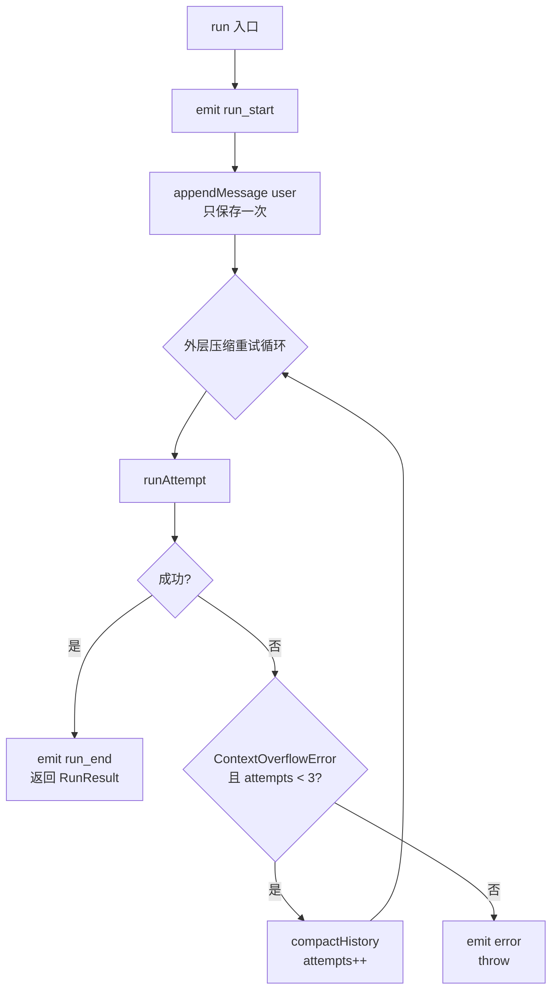
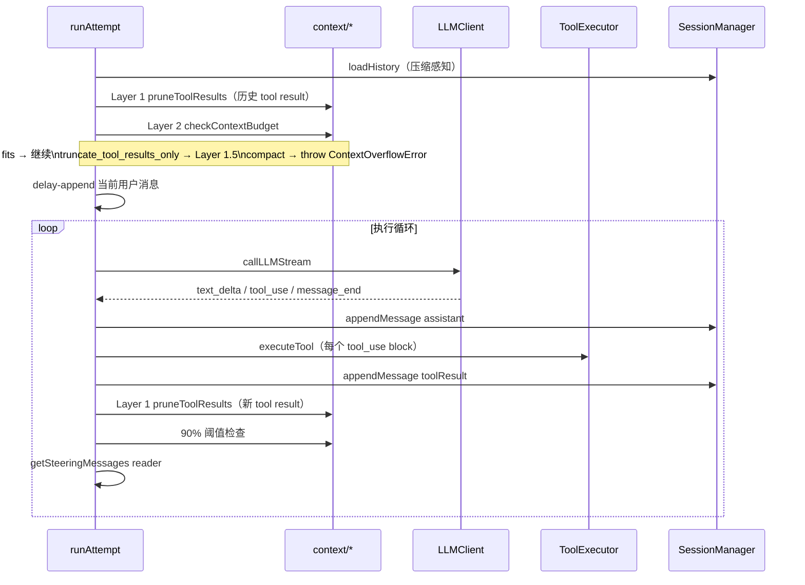

# Agent Runner 模块设计文档

> 基准版本：v1.0
> 文档日期：2026-05-29
> 关联文档：`runtime.md` · `adapter_channel.md` · `platform_config.md`

---

## 1. 概述

`src/core/runner/` 是 Agent 的**执行引擎**，串联 `adapters/llm`、`core/session`、`core/tools` 与上下文管理子模块，完成一次完整的"对话循环"：LLM 调用 → tool 执行 → tool 结果回传 → LLM 继续。

### 1.1 职责

| 职责 | 说明 |
|---|---|
| 执行循环 | LLM 调用 + tool use + steering 注入，单层 `while` 推进 |
| 上下文管理 | 4 层渐进策略：per-result 裁剪 → 聚合裁剪 → 预判路由 → LLM 摘要 |
| 压缩编排 | 外层重试：捕获 `ContextOverflowError` → `compactHistory` → retry |
| 消息持久化 | 用户消息、助手回复、tool result 在产生时立即写入 session |
| Hook 与 Event | `before/after_tool_call`、`before/after_compaction`；统一 `onEvent` 出口 |
| Steering 注入 | 每轮 tool 执行后通过 `getSteeringMessages` reader 拉取消息并注入对话流 |

### 1.2 容易混淆的边界

**配置加载**不在 runner 内——runner 不调 `loadConfig()`，只接收 runtime 层提炼的最小参数子集（`model` / `systemPrompt` / `tools` 等），保持为纯执行引擎。

### 1.3 配置边界

Runner 只接收 runtime 层提炼的最小子集，不调用 `loadConfig()` / `resolveAgentConfig()`，不读 `process.env`：

`model` · `systemPrompt` · `tools` · `maxTokens` · `maxLlmCalls` · `compaction` · `contextWindowTokens`

### 1.4 与其他模块的关系

```
RuntimeApp
  │  RunParams（最小子集）
  ▼
AgentRunner.run()
  ├─ SessionManager     ← 读写消息历史、compaction record
  ├─ LLMClient          ← 流式调用
  ├─ ToolExecutor       ← 工具执行（注入自 runtime）
  ├─ context/*          ← pruneToolResults / checkContextBudget / compactMessages / estimatePromptTokens
  └─ hooks/*            ← runBefore/AfterToolCall / Compaction
```

---

## 2. 目录结构

```
src/core/runner/
├── index.ts                 # 公共导出
├── types.ts                 # AgentRunnerConfig / RunParams / RunResult / AgentEvent / PendingMessageReader
├── AgentRunner.ts           # 主类
├── errors.ts                # ContextOverflowError / isContextOverflowError
├── test-helpers.ts          # makeRunParams() 测试辅助
├── hooks/
│   ├── index.ts
│   ├── runner.ts            # priority 排序、Interceptor / Observer 区分
│   └── types.ts             # BeforeToolCallHook / AfterToolCallHook / Before/AfterCompactionHook
└── context/
    ├── token-estimation.ts  # estimatePromptTokens（含安全边距）
    ├── tool-result-pruning.ts  # Layer 1 pruneToolResults / Layer 1.5 pruneToolResultsAggregate
    ├── context-budget.ts    # Layer 2 checkContextBudget
    └── compaction.ts        # Layer 3 compactMessages（splitForCompaction / generateSummary）
```

---

## 3. 类型系统

### 3.1 AgentRunnerConfig

```
AgentRunnerConfig {
  llmClient: LLMClient
  sessionManager: SessionManager
  toolExecutor?: ToolExecutor          // 未提供时 tool_use 返回错误占位
  onEvent?: (event: AgentEvent) => void  // 统一 event 出口；RuntimeApp 注入 fanout 闭包
}
```

### 3.2 RunParams

```
RunParams {
  sessionKey: string
  message: string
  model: string
  systemPrompt: string
  turnId: string                        // 必填；emit / hook payload 依赖
  tools?: ToolDefinition[]
  maxTokens?: number                    // 默认 4096
  maxLlmCalls?: number                  // 默认 12
  getSteeringMessages?: PendingMessageReader  // 每轮 tool 后 runner 拉取
  compaction?: CompactionConfig
  contextWindowTokens?: number          // 默认 200,000
}

type PendingMessageReader = () => ChatMessage[] | Promise<ChatMessage[]>
```

- `turnId` 是必填字段，但 RuntimeApp 层对库调用方是可选（不传则自动生成）
- `getSteeringMessages` 未提供时 runner 视为无 steering——零运行时开销

### 3.3 RunResult

```
RunResult {
  text: string              // 最终回复文本
  content: ChatContentBlock[]
  stopReason: string        // 'end_turn' | 'max_llm_calls' | 'error' | 'aborted' | ...
  usage: TokenUsage         // 累计（所有 LLM 调用总和）
  toolRounds: number
  compacted?: boolean       // 本次 run 是否触发过压缩
}
```

详细压缩统计通过 `compaction_end` 事件提供，暂不在 `RunResult` 字段中暴露。

### 3.4 AgentEvent

每个 variant 都带 `sessionKey` + `turnId`（由 `emit` 从 `currentParams` 自动注入）：

```
AgentEvent =
  | { type: 'run_start';  sessionKey; turnId }
  | { type: 'text_delta'; sessionKey; turnId; text }
  | { type: 'tool_use';   sessionKey; turnId; name; input }
  | { type: 'tool_result';sessionKey; turnId; name; result }
  | { type: 'llm_call';   sessionKey; turnId; round }
  | { type: 'run_end';    sessionKey; turnId; result: RunResult }
  | { type: 'error';      sessionKey; turnId; error }
  | { type: 'tool_result_pruned'; sessionKey; turnId; toolUseId; originalChars; prunedChars }
  | { type: 'compaction_start';   sessionKey; turnId; trigger; estimatedTokens }
  | { type: 'compaction_end';     sessionKey; turnId; tokensBefore; tokensAfter; droppedMessages }
```

设计要点：
- `compaction_start.estimatedTokens` 是估算值；准确的 `tokensBefore` 在 `compaction_end` 给出
- `error` 既 emit 又 throw，让 channel 与库消费者自由选择呈现路径

---

## 4. 执行流程总览

### 4.1 入口 run()



关键不变量：
- **用户消息只 append 一次**：在外层循环之前，retry 期间不重复写入
- **`MAX_COMPACTION_RETRIES = 3`**：超过则向上抛出 `ContextOverflowError`
- **每次 retry 重新 `loadHistory`**：能自动感知压缩写入的新 compaction record

### 4.2 runAttempt：单次完整尝试



**delay-append**：预判检查所用的 `messages` 不含当前用户消息（`currentPrompt` 单独传入）；预判通过后才 push——当前消息永远不会被 Layer 1/1.5 裁剪，预判失败时不污染 retry。

---

## 5. 执行循环

```
初始化：llmCallCount=0, hasMoreToolCalls=true（保证至少一次 LLM 调用）

while (hasMoreToolCalls):

  if llmCallCount >= maxLlmCalls:
    return { stopReason: 'max_llm_calls', ... }

  emit { type: 'llm_call', round }
  llmCallCount++

  llmResult = callLLMStream(...)
    for await event of llmClient.chatStream:
      text_delta  → emit + 收集
      tool_use    → 收集 content block
      message_end → 记录 stopReason + usage
      error       → throw
    catch isContextOverflowError → throw ContextOverflowError

  messages.push({ role: 'assistant', content })
  session.appendMessage('assistant', content)

  if stopReason in {'error', 'aborted'}: return early

  if toolUseBlocks.length == 0:
    hasMoreToolCalls = false
  else:
    for each toolUse:
      emit { type: 'tool_use', name, input（原始） }

      before_tool_call hooks（sequential, priority 降序）:
        deny  → blocked ToolResult 占位 + emit tool_result + continue
        allow → effectiveInput = result.input

      result = executeTool(name, effectiveInput)
      emit { type: 'tool_result', name, result }

      after_tool_call hooks（parallel, fire-and-forget）

    messages.push({ role: 'user', content: toolResultBlocks })
    session.appendMessage('toolResult', toolResultBlocks)

    Layer 1: pruneToolResults（新 tool result，无 emit 回调）
    90% 阈值检查 → throw ContextOverflowError

    totalToolRounds++

    steeringMessages = readPendingMessages(getSteeringMessages)
    if steeringMessages.length > 0: appendInjectedMessages(...)

return { text, content, stopReason, usage, toolRounds }
```

### 5.1 `maxLlmCalls` 配额

- 计数对象是"实际发起的 LLM 调用"（含无 tool use 的轮次）
- 检查在每次 LLM 调用**前**，触发上限时立即返回，保留最后一次回复
- 默认 12，由 runtime 从 `config.runner.maxLlmCalls` 透传

### 5.2 emit + hook 触发时机

| 时机 | Emit | Hook |
|---|---|---|
| run 开始 | `run_start` | — |
| LLM 调用前 | `llm_call` | — |
| 流式收到 text | `text_delta` | — |
| tool use 检测后、执行前 | `tool_use`（原始 input） | `before_tool_call`（sequential, priority 降序，可改 input / deny） |
| tool 执行后 | `tool_result` | `after_tool_call`（parallel, fire-and-forget） |
| tool result 裁剪触发（仅初始历史） | `tool_result_pruned` | — |
| 压缩开始 | `compaction_start` | `before_compaction`（observer） |
| 压缩完成 | `compaction_end` | `after_compaction`（observer） |
| run 成功 | `run_end` | — |
| run 失败 | `error`（同时 throw） | — |

---

## 6. 上下文管理（4 层）

| 层 | 实现 | 调 LLM？ | 触发时机 |
|---|---|---|---|
| **Layer 1** | `pruneToolResults` | 否 | `runAttempt` 开头；每轮 tool result 追加后 |
| **Layer 1.5** | `pruneToolResultsAggregate` | 否 | Layer 2 路由为 `'truncate_tool_results_only'` 时 |
| **Layer 2** | `checkContextBudget` | 否 | `runAttempt` 开头（delay-append 之前） |
| **Layer 3** | `compactMessages` | 是 | 外层捕获 `ContextOverflowError` 后 |

### 6.1 三条溢出路径

所有路径统一抛出 `ContextOverflowError`，由外层 retry 循环处理：

```
路径 1：runAttempt 开头预判  checkContextBudget='compact'  → trigger='preemptive'
路径 2：内层 90% 阈值        estimatedTokens > 0.9 × contextWindow → trigger='overflow'
路径 3：LLM API 错误         callLLMStream 捕获 + isContextOverflowError → trigger='overflow'
```

### 6.2 Layer 3 压缩流程

```
compactHistory(params, compaction, trigger):

  messages = loadHistory(sessionKey)
  estimatedTokens = estimatePromptTokens({ messages })

  runBeforeCompaction hooks（observer）
  emit { type: 'compaction_start', trigger, estimatedTokens }

  compactResult = compactMessages({ messages, config, llmClient, model, trigger })
    // LLM 生成摘要；失败时降级为兜底文本

  keptCount = compactResult.messages.length - 1   // 减去摘要消息
  firstKeptIndex = max(0, allMessages.length - keptCount)
  firstKeptEntryId = allMessages[firstKeptIndex].id

  session.appendCompactionRecord(sessionKey, compactResult.record, firstKeptEntryId)

  runAfterCompaction hooks（observer）
  emit { type: 'compaction_end', tokensBefore, tokensAfter, droppedMessages }

  session.updateSession(sessionKey, { totalTokens: tokensAfter })
```

压缩记录持久化后，下次 `runAttempt` 的 `loadHistory` 自动截断并注入摘要。

---

## 7. Session 持久化与历史加载

### 7.1 消息写入时序

```
run() 入口    → appendMessage('user',      用户输入)   ← 重试前只写一次
LLM 调用 #1  → callLLMStream
              → appendMessage('assistant', [text + tool_use])
              → appendMessage('toolResult',[tool_result])
LLM 调用 #2  → callLLMStream
              → appendMessage('assistant', [text])
return
```

注入消息（steering）也走 `appendMessage`，同步追加到内存 `messages` 和 session。

### 7.2 loadHistory 与压缩感知

```
loadHistory(sessionKey):
  records = session.getMessages(sessionKey)
  compactionRecord = session.getLastCompactionRecord(sessionKey)

  if compactionRecord:
    keptIndex = records.findIndex(r => r.id === compactionRecord.firstKeptEntryId)
    if keptIndex >= 0:
      records = records.slice(keptIndex)   // 截断旧历史

  messages = records.map:
    toolResult role → user（对齐 Anthropic API 格式）
    其他 → 原样

  if compactionRecord:
    messages.unshift({
      role: 'user',
      content: '[Previous conversation summary]\n\n' + compactionRecord.summary + '\n\n...'
    })

  return messages
```

---

## 8. In-turn 消息注入

Runner 只有**一个**注入点：每轮 tool 执行后。

```
每轮 tool 执行完成后:
  steeringMessages = await readPendingMessages(params.getSteeringMessages)
  if steeringMessages.length > 0:
    appendInjectedMessages(sessionKey, messages, steeringMessages)
```

**Reader 契约**（`PendingMessageReader`）：
- 返回 `ChatMessage[]`，每条必须有 `role: 'user' | 'assistant'` 和 `content`
- 应为"消费即清空"语义——runner 每轮只调一次，期望 reader 内部删除已读数据
- 非法形态被 `readPendingMessages` 防御性过滤静默丢弃

Runner 没有 followup / steer 模式概念——`inTurnMessageMode` 只在 RuntimeApp 入站层读取，runner 只感知 reader 是否提供。详见 [runtime.md §6](./runtime.md)。

---

## 9. Hook 系统

### 9.1 Hook 类型

| Hook | 时机 | 执行模型 | 能否修改/否决 |
|---|---|---|---|
| `before_tool_call` | tool 执行前 | sequential, priority 降序 | ✅ 可改 input / deny |
| `after_tool_call` | tool 执行后 | parallel, fire-and-forget | ❌ |
| `before_compaction` | 压缩开始前 | parallel, fire-and-forget | ❌（observer-only） |
| `after_compaction` | 压缩完成后 | parallel, fire-and-forget | ❌（observer-only） |

### 9.2 注册 API

```
runner.on(hookName, handler, { priority?, name? })

// 示例：拒绝 exec 工具
runner.on('before_tool_call', async ({ toolName }) => {
  if (toolName === 'exec') return { action: 'deny', reason: 'blocked' }
  return { action: 'allow' }
}, { priority: 100 })
```

priority 越大越先执行；`before_tool_call` 是 Interceptor（可否决），其余是 Observer（仅观察）。

---

## 10. Event emit 机制

### 10.1 currentParams 自动注入

```
private currentParams: RunParams | null = null

// run() 入口设置，finally 清理
this.currentParams = params
```

内部 `emit` 方法从 `currentParams` 自动注入 `sessionKey` / `turnId`：

```
emit(event: AgentEventInput):
  if !onEvent || !currentParams: return
  onEvent({ ...event, sessionKey: currentParams.sessionKey, turnId: currentParams.turnId })
```

调用方写法简化为 `this.emit({ type: 'text_delta', text })`，不手填公共字段。

### 10.2 AgentEventInput 私有类型

```typescript
// 条件类型分发：为每个 AgentEvent variant 单独 Omit sessionKey/turnId
type AgentEventInput = AgentEvent extends infer E
  ? E extends AgentEvent ? Omit<E, 'sessionKey' | 'turnId'> : never
  : never;
```

此类型不导出，仅作内部 emit 的便利输入。

---

## 11. 错误处理

### 11.1 ContextOverflowError

```
class ContextOverflowError extends Error {
  trigger: 'preemptive' | 'overflow' | 'manual' = 'overflow'
}
```

三种 trigger：
- `preemptive`：`runAttempt` 开头预判触发
- `overflow`：内层 90% 阈值或 LLM API 错误触发
- `manual`：调用方主动触发（当前未使用，类型预留）

### 11.2 上抛策略

```
ContextOverflowError → 外层 retry（最多 3 次）→ 仍失败 → 抛给调用方
其他 Error → emit { type: 'error', error } + throw
```

`run()` 的 `finally` 始终清理 `currentParams`，保证下次调用状态干净。

---

## 12. ⚠️ 代码与 v1.0 文档的已知差异

### 差异 1：内层循环 `pruneToolResults` 不触发 `tool_result_pruned` 事件

**v1.0 文档**（§6.1）描述"每次裁剪触发 `tool_result_pruned` 事件"，且列出两个调用点：
1. `runAttempt` 开头（历史消息中的 tool result）
2. 内层循环 tool result 追加后（新增 tool result）

**实际代码**（`AgentRunner.ts`）：
- 调用点 1（`runAttempt` 开头）：传了 emit 回调 ✅
- 调用点 2（内层循环）：未传 emit 回调 ❌

```typescript
// 调用点 2（实际代码，无 emit 回调）
messages = pruneToolResults(messages, compaction, contextWindowTokens);
```

因此内层循环中新增 tool result 被裁剪时**不会**触发 `tool_result_pruned` 事件。

> 建议：内层循环的 `pruneToolResults` 调用补充 emit 回调，与调用点 1 一致。

### 差异 2：代码注释写"3 层"但实际有 4 层

**实际代码**（`AgentRunner.ts` 类注释）写 `上下文管理（3 层）`，但实际列举了 Layer 1、1.5、2、3 共 4 层，与 v1.0 文档"4 层渐进策略"说法不一致。

> 建议：将代码注释改为"4 层（Layer 1 / 1.5 / 2 / 3）"以与文档保持一致。

---

## 13. 已知规划项

| 项目 | 状态 |
|---|---|
| 模型 fallback（主模型失败切换备用） | 规划中 |
| AbortSignal 用户取消 | 规划中 |
| 硬 steering（AbortSignal + tool 取消协议） | 规划中 |
| `before_compaction` 否决能力（`skip/continue`） | 规划中 |
| `manual` trigger 对外暴露手动压缩入口 | 规划中 |
| tool use 阶段前检查 steering（缩短长 tool 延迟） | 规划中 |
| `RunResult.compactionStats` 字段 | 待讨论 |
| 历史裁剪的轻量级窗口截断（除压缩之外） | 规划中 |
