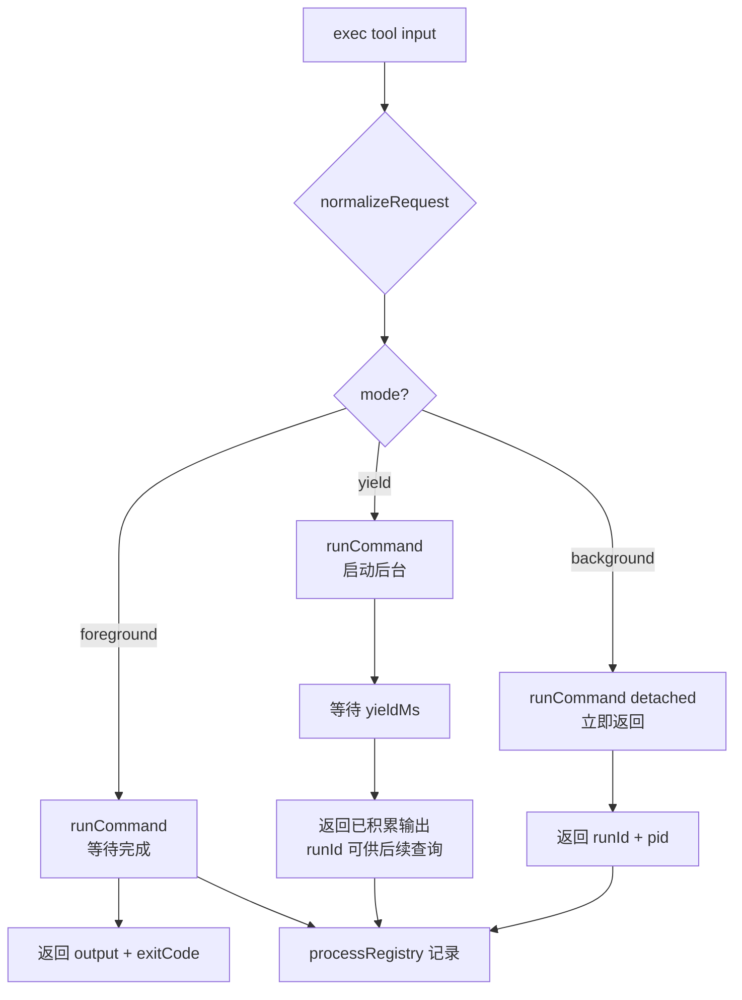

# Core Tools 内置工具设计文档

> 文档日期：2026-05-29
> 关联文档：`core_tools.md` · `platform_config.md` · `runtime.md`

---

## 1. 概述

`src/core/tools/builtin/` 是所有内置工具的实现。共四类：

| 类别 | 工具 | 工厂/单例 |
|---|---|---|
| **fs** | `list_dir` `read_file` `write_file` `edit_file` `apply_patch` | 工厂函数 |
| **search** | `grep_search` `file_search` | 工厂函数 |
| **web** | `web_fetch` | 单例 |
| **exec** | `exec` `process` | 单例 |

fs / search 工具使用**工厂函数**模式，在创建时显式绑定 `workspaceDir` 和 `workspaceOnly`，避免隐式依赖 `process.cwd()`。

---

## 2. 目录结构

```
src/core/tools/builtin/
├── index.ts
├── common/
│   ├── path-policy.ts      # resolveWorkspacePath / WorkspacePathError
│   └── workspace-walk.ts   # listWorkspaceFiles（search 工具内部使用）
├── fs/
│   ├── list-dir.ts
│   ├── read-file.ts
│   ├── write-file.ts
│   ├── edit-file.ts
│   └── apply-patch.ts / apply-patch-update.ts
├── search/
│   ├── file-search.ts
│   └── grep-search.ts
├── web/
│   └── web-fetch.ts
└── exec/
    ├── exec-types.ts       # 类型定义
    ├── exec.ts             # exec 工具
    ├── process.ts          # process 工具
    ├── process-registry.ts # 进程注册表（模块级单例）
    ├── run-command.ts      # child_process 封装
    ├── kill-process-tree.ts
    └── resolve-command-invocation.ts
```

---

## 3. 路径策略（path-policy.ts）

fs / search 工具的路径处理统一经过 `resolveWorkspacePath`：

```
resolveWorkspacePath(path, workspaceRoot, workspaceOnly=true):
  → { workspaceRoot, resolvedPath, displayPath }

  if workspaceOnly && 路径在工作区外:
    throw WorkspacePathError(inputPath, workspaceRoot)
```

`WorkspacePathError` 携带 `inputPath` / `workspaceRoot` 两个字段，让调用方可以用 `instanceof` 精确识别越界错误。

**displayPath 规则**：
- 路径在工作区内 → 相对路径（正斜杠）
- 路径在工作区外（workspaceOnly=false）→ 绝对路径（正斜杠归一化）

---

## 4. 工厂函数签名

```typescript
// fs 工具（绑定 workspaceDir + workspaceOnly）
createListDirTool(workspaceDir: string, workspaceOnly?: boolean): Tool
createReadFileTool(workspaceDir: string, workspaceOnly?: boolean): Tool
createWriteFileTool(workspaceDir: string, workspaceOnly?: boolean): Tool
createEditFileTool(workspaceDir: string, workspaceOnly?: boolean): Tool
createApplyPatchTool(workspaceDir: string, workspaceOnly?: boolean): Tool

// search 工具（workspaceOnly 不适用，列举本身限定在工作区内）
createFileSearchTool(workspaceDir: string): Tool
createGrepSearchTool(workspaceDir: string): Tool

// web / exec（单例，无需绑定）
export const webFetchTool: Tool
export const execTool: Tool
export const processTool: Tool
```

`workspaceOnly` 省略时默认 `true`，与 `config.tools.fs.workspaceOnly` 默认值一致。

---

## 5. fs 工具

### 5.1 各工具概览

| 工具 | 名称 | 关键输入 | 说明 |
|---|---|---|---|
| list-dir | `list_dir` | `path` | 列出目录内容（文件名 + 类型） |
| read-file | `read_file` | `path`, `offset?`, `limit?` | 读取文件内容，支持分页 |
| write-file | `write_file` | `path`, `content` | 写入/覆盖文件 |
| edit-file | `edit_file` | `path`, `old_string`, `new_string` | 字符串替换，要求 `old_string` 唯一 |
| apply-patch | `apply_patch` | `path`, `patch` | 应用 unified diff 格式 patch |

### 5.2 路径处理流程

```
execute({ path, ... }):
  { resolvedPath, displayPath } = resolveWorkspacePath(path, workspaceDir, workspaceOnly)
  // 使用 resolvedPath 做实际 I/O
  // 错误消息中用 displayPath（相对路径，可读性好）
```

工具不捕获 `WorkspacePathError`——由 `createToolExecutor` 捕获并转为 `isError: true` 的 ToolResult。

---

## 6. search 工具

| 工具 | 名称 | 关键输入 | 说明 |
|---|---|---|---|
| file-search | `file_search` | `pattern`, `path?` | 按 glob 模式在工作区内查找文件 |
| grep-search | `grep_search` | `pattern`, `path?`, `include?` | 正则内容搜索，支持文件过滤 |

两者都通过 `workspace-walk.ts` 的 `listWorkspaceFiles` 遍历工作区，不跨越工作区边界（路径策略内建，无需 `workspaceOnly` 开关）。

---

## 7. web 工具

| 工具 | 名称 | 关键输入 | 默认值来源 |
|---|---|---|---|
| web-fetch | `web_fetch` | `url`, `timeout?`, `maxChars?` | `config.tools.webFetchTimeout / webFetchMaxChars` |

单例工具，不绑定 workspace。超时和截断上限由 runtime 在工具创建时注入（当前实现为模块级常量，与 config 值对应）。

---

## 8. exec 工具系统

exec 子系统是内置工具中最复杂的部分，由 `exec`（执行）和 `process`（管理）两个工具加上进程注册表组成。

### 8.1 exec 工具（`exec`）

**执行模式（ExecMode）：**

| 模式 | 触发条件 | 行为 |
|---|---|---|
| `foreground` | 默认；无 `yieldMs` 和 `background` | 等待命令结束，返回完整输出 |
| `yield` | 传了 `yieldMs` | 等待 `yieldMs` 毫秒后返回当前输出，进程继续在后台跑 |
| `background` | `background: true` | 立即返回 runId，进程在后台运行 |

```
exec 输入:
  command: string
  cwd?: string          // 相对 process.cwd() 解析
  env?: Record<string, string>   // 仅接受 string:string（安全约束）
  timeout?: number      // 秒；0 或不传 = 使用默认（config.tools.execTimeout = 30s）
  yieldMs?: number      // yield 模式触发阈值（毫秒）
  background?: boolean  // true = 后台模式
```

**安全约束**：`env` 仅接受 `string:string` 记录，复杂对象不会被合并进 `process.env`。

### 8.2 process 工具（`process`）

管理后台进程，支持四种 action：

```
process 输入（discriminated union by action）:
  { action: 'list' }                        // 列出所有后台进程
  { action: 'status'; runId: string }       // 查询单个进程状态
  { action: 'log'; runId: string; tailLines?: number }  // 获取进程输出
  { action: 'kill'; runId: string }         // 终止进程（kill process tree）
```

### 8.3 ProcessRegistry（进程注册表）

`process-registry.ts` 导出模块级单例 `processRegistry`，exec / process 两个工具共享同一张表：

```
ProcessRecord {
  runId: string           // 'proc_{timestamp}_{counter}'
  command: string
  status: ProcessStatus   // starting | running | completed | failed | timed_out | aborted
  visibility: 'internal' | 'background'   // foreground 运行的进程 visibility='internal'，后台='background'
  chunks: OutputChunk[]   // { stream:'stdout'|'stderr', text, timestamp }
  output: string          // 拼接后的完整输出
  pid?: number
  exitCode?: number | null
  ...
}
```

**visibility 区分**：
- `internal`：foreground / yield 模式运行的进程，不出现在 `process list` 中
- `background`：`exec` 后台模式或 yield 模式结束后转为后台的进程，出现在列表中

### 8.4 kill process tree

`kill-process-tree.ts` 在 `process kill` 时调用，平台差异化处理：
- Unix：`kill(-pgid, 'SIGTERM')` 终止整个进程组
- Windows：`taskkill /PID /T /F`

### 8.5 exec 执行流程



---

## 9. 关键设计决策

| 决策 | 说明 |
|---|---|
| fs / search 工具工厂化 | 避免隐式依赖 `process.cwd()`；测试不需要 `process.chdir()` |
| `workspaceOnly` 可配置 | 允许专用 agent 访问工作区外路径（默认关闭） |
| `WorkspacePathError` 结构化 | 调用方可用 `instanceof` 精确识别，不靠 message 字符串匹配 |
| exec / process 单例 | 进程注册表必须全局唯一，两个工具共享同一张表 |
| env 仅接受 string:string | 防止复杂对象污染 `process.env` |
| foreground visibility=internal | LLM 用 `exec` 前台运行的进程不污染 `process list`，只有主动后台化的进程才出现 |
