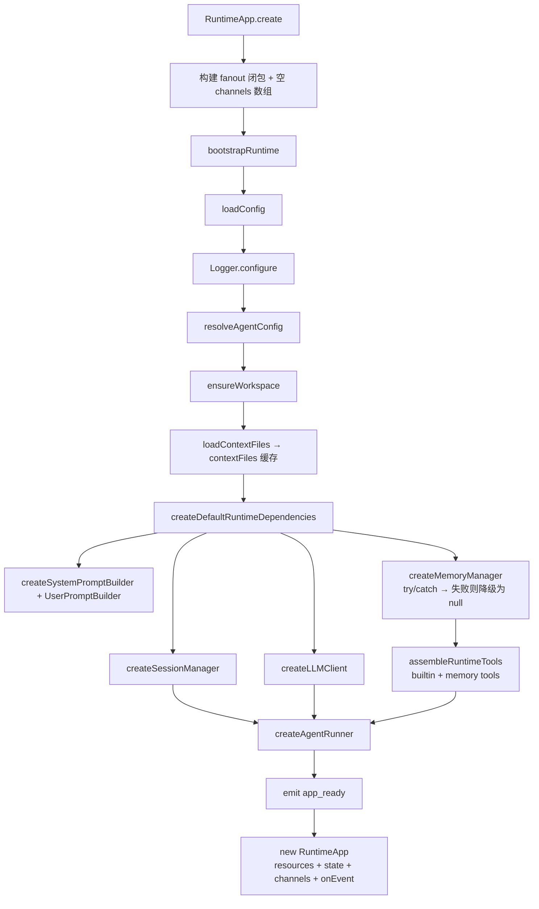
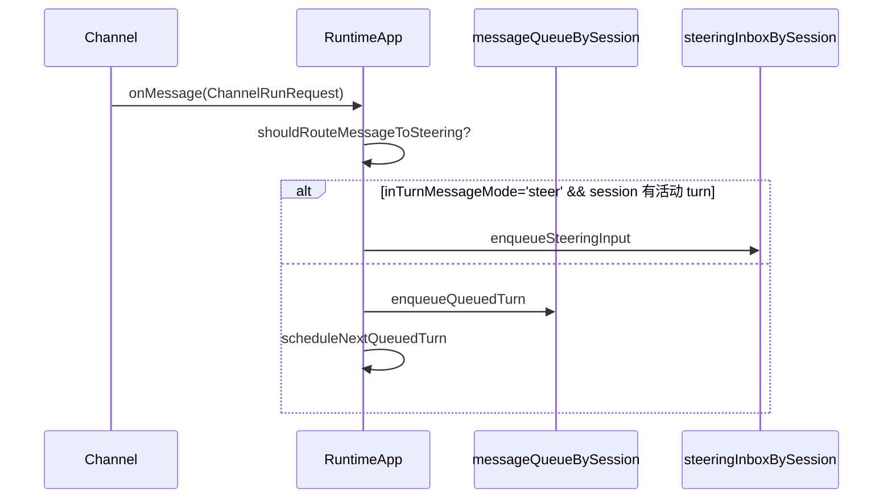
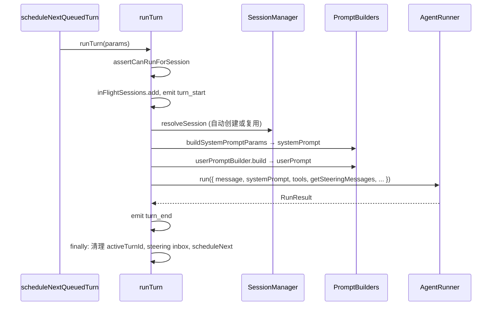
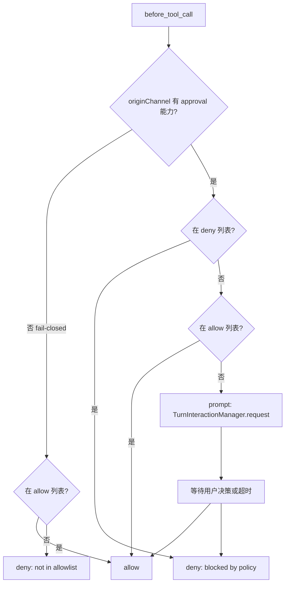
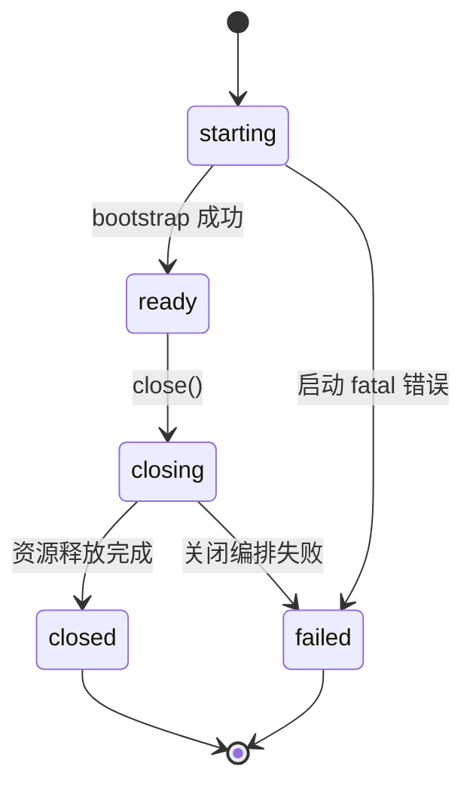

# Runtime 模块设计文档

> 基准版本：v1.0
> 文档日期：2026-05-27
> 状态同步：2026-08-27（用户消息广播、用户主动中止）
> 关联文档：`adapter_channel.md` · `core_runner.md` · `platform_config.md`

---

## 1. 概述

`src/runtime/` 是整个应用的 **composition root**（装配根）。它不实现任何业务逻辑，只做一件事：把所有底层模块（config、workspace、session、memory、prompt、tools、llm、runner）组装成一个可启动、可调度、可关闭的 Agent 应用实例，并通过 channel 层接受外部消息。

没有这一层，各模块只是独立的"库"；有了这一层，才有了一个可以直接启动的 Agent。

### 1.1 核心职责

| 职责 | 说明 |
|---|---|
| 装配 | 按依赖顺序初始化各组件，将全局 config 映射为各模块所需的最小局部参数 |
| 调度 | per-session 串行队列；steering inbox 与普通队列分离 |
| 执行 | 每轮构建 prompt，委托给 `AgentRunner.run()` |
| 路由 | approval / interaction 按起源 channel + clientId 精准回路，不广播 |
| 广播 | 入站装配完成后发送 `user_message`，让同 session 多 client 共享用户消息时间线 |
| 中止 | 维护 per-session `AbortController`，支持 CLI / WebSocket / library 主动中止并清空普通队列 |
| 生命周期 | 统一管理启动、运行、关闭三段 |

### 1.2 容易混淆的边界

**turn 内部的执行**属于 `core/runner`——runtime 调用 `agentRunner.run()`，但 LLM 调用、tool 执行、上下文管理均在 runner 内部完成，runtime 不参与。

### 1.3 配置访问边界

Runtime 是**唯一**允许调用 `loadConfig()` / `resolveAgentConfig()` 的运行时模块。底层领域模块（runner、session、memory 等）只接收 Runtime 传入的最小局部参数，不直接依赖 config loader。

---

## 2. 目录结构

```
src/runtime/
├── index.ts           # 公共导出入口
├── types.ts           # 顶层类型（RuntimeAppOptions / RunTurnParams / RuntimeEvent 等）
├── queue-types.ts     # 入站调度专用类型（队列项 / steering 输入 / 路由上下文）
├── RuntimeApp.ts      # 主类
├── bootstrap.ts       # 启动阶段的资源装配
├── tool-registry.ts   # builtin + memory tools 装配；工具定义格式转换
├── prompt-factory.ts  # config + contextFiles + tools → SystemPromptBuilder 参数
└── errors.ts          # RuntimeError 分类与创建
```

公共 API 只导出 `RuntimeApp` 和必要的类型，不对外泄漏内部 manager。

---

## 3. 整体架构

```
┌──────────────────────────────────────────────────────────────┐
│                         RuntimeApp                           │
│                                                              │
│  外部入口 (CLI / WebSocket / 库调用)                          │
│       │                                                      │
│       ▼                                                      │
│  ┌──────────────┐   handleInboundChannelMessage              │
│  │ 入站分流      │──── steering 条件成立 ──▶ steeringInbox   │
│  └──────────────┘         │                                  │
│       │                   └─── 否则 ──▶ messageQueueBySession│
│       ▼                                                      │
│  scheduleNextQueuedTurn                                      │
│       │ 弹出队头，生成 turnId，登记 routeContextByTurn        │
│       ▼                                                      │
│  ┌──────────────────────────────┐                            │
│  │         runTurn              │                            │
│  │  resolveSession              │                            │
│  │  build systemPrompt          │                            │
│  │  build userPrompt            │                            │
│  │  agentRunner.run(...)        │◀─── getSteeringMessages    │
│  └────────────┬─────────────────┘                            │
│               │ AgentEvent                                   │
│               ▼                                              │
│  fanout ──▶ channel[0..n].send(event)                        │
│          ──▶ userObserver?.(event)                           │
│                                                              │
│  before_tool_call hook ──▶ 三档审批策略                       │
│                              ▼                               │
│                  routeContextByTurn[turnId]                  │
│                              ▼                               │
│                  originChannel.interaction / approval        │
└──────────────────────────────────────────────────────────────┘
```

---

## 4. 类型系统

### 4.1 RuntimeAppOptions（启动选项）

```
RuntimeAppOptions {
  workspaceDir: string          // 唯一必填项
  agentId?: string              // per-agent 配置预留
  envOverrides?: DeepPartial<AgentDefaults>
  cliOverrides?: DeepPartial<AgentDefaults>
  dependencies?: Partial<RuntimeDependencies>   // 测试注入口
  onEvent?: (event: RuntimeEvent) => void       // 生命周期事件
  onAgentEvent?: (event: AgentEvent) => void    // turn 内执行事件（与 channel 并行分发）
}
```

`onEvent` 处理应用级事件（启动 / 关闭 / turn 边界 / 降级警告）；
`onAgentEvent` 处理 turn 内部事件（text_delta / tool_use / compaction_* 等），两套事件平面不互替。

### 4.2 RuntimeDependencies（依赖注入接口）

每个工厂方法只接收自己需要的最小参数子集，由 Runtime 负责从全局 config 里提取并传入：

```
RuntimeDependencies {
  createLLMClient(options: { apiKey?, baseURL?, defaultModel?, maxTokens? }): LLMClient
  createSessionManager(workspaceDir, options?): SessionManager
  createMemoryManager(options: { workspaceDir, enabled, dbPath?, ... }): Promise<MemoryManager | null>
  createSystemPromptBuilder(): SystemPromptBuilder
  createAgentRunner(config): AgentRunner
  getBuiltinTools(options: RuntimeBuiltinToolOptions): Tool[]
}
```

### 4.3 RunTurnParams（单轮参数）

```
RunTurnParams {
  sessionKey: string
  message: string | ChatContentBlock[]
  promptMode: 'full' | 'minimal' | 'none'   // v1.0 必填，不再回退 config
  model?: string              // 覆盖 config 默认模型
  maxTokens?: number
  maxLlmCalls?: number
  safetyLevel?: string
  reloadContextFiles?: boolean
  turnId?: string             // 外部传入用于日志关联；不传则自动生成
  originMessageId?: string    // channel queued 路径内部透传；关联 user_message
}
```

模型解析顺序：`runTurn.model` > `resolvedConfig.llm.model` > 抛出 `MODEL_MISSING`。

### 4.4 队列与路由类型（queue-types.ts）

```
MessageRouteContext = {
  originChannel?: Channel
  originClientId?: string
}

QueuedChannelTurn = {
  sessionKey, message
  launchContext?   // 仅在 channel 显式覆盖 model / maxTokens / maxLlmCalls 时构造
  routeContext?    // approval 反向路由
}

PendingSteeringInput = {
  message: string
  routeContext?    // 保留，为后续 steering 独立交互路由预留扩展口
}
```

这些类型放在 `runtime/` 而非 `adapters/channel/`，因为它们描述的是 runtime 内部调度形态；channel 层只生产 `ChannelRunRequest`，对队列结构不感知。

---

## 5. 启动流程



`channels[]` 数组在 `create()` 阶段就创建好，fanout 闭包持有它的引用。后续 `registerChannel` push 进的 channel，闭包立即可见——这是让 fanout 不需要重建的关键。

### 5.1 启动时创建一次的资源

以下资源贯穿整个 app 生命周期，不在每轮重建：
SessionManager · LLMClient · MemoryManager（可为 null）· SystemPromptBuilder · UserPromptBuilder · AgentRunner · toolBundle

### 5.2 Memory 降级策略

```
memory.enabled = false       → 不创建，不注入 memory tools
memory.enabled = true，成功   → 注入 memory_search / memory_get / memory_write
memory.enabled = true，失败   → emit warning，继续启动，但不注入 memory tools
```

Memory 是可选能力，初始化失败不阻塞应用启动。

---

## 6. 入站调度

### 6.1 消息入站流程



`handleInboundChannelMessage` 只入队，从不直接调 `runTurn()`。

### 6.2 Steering 路由判定

两个条件同时成立才进 steering inbox：
1. `resolvedConfig.runner.inTurnMessageMode === 'steer'`（默认是 `followup`，须显式配置）
2. `activeTurnIdBySession.has(sessionKey)`（存在当前活动 turn）

任一不满足 → 消息进普通队列。这保证"没有活动 turn 的消息不会被静默丢弃"。

### 6.3 调度器：scheduleNextQueuedTurn

```
if inFlightSessions.has(sessionKey): return   // session busy，等待
弹出队头 next
startQueuedTurn(next)
  生成 turnId
  登记 routeContextByTurn[turnId] = routeContext
  runTurn(...)
  finally: routeContextByTurn.delete(turnId)
```

**turnId 在真正弹出队头时才生成**，不在入队时占用 turn 级资源。若 channel 在排队阶段断开，可直接丢弃队列项而不留 dangling turnId。

### 6.4 两个并发字段的区别

| 字段 | 语义 |
|---|---|
| `inFlightSessions` | "该 session 是否 busy"——只要 `runTurn()` 的 Promise 未结束就 busy |
| `activeTurnIdBySession` | "是否存在可接 steering 的活动 turn"——runTurn 进入后设置，turn 结束时清除 |

steering 路由用的是后者，因为它需要精准绑定到一个 turnId。

---

## 7. 单轮运行



`getSteeringMessages` 是 Runtime 传给 runner 的读取回调——runner 在合适时机主动拉取并清空 steeringInbox。读后即删，避免重复消费。

### 7.1 runTurn finally 必做四件事

1. 清理 `activeTurnIdBySession`（防御：只在 turnId 仍是当前值时清除）
2. 清空 `steeringInboxBySession`（turn 结束后 inbox 无论是否消费，一律丢弃）
3. `activeRunCount` 减一（用 `Math.max(0, ...)` 防御性归零）
4. `void scheduleNextQueuedTurn(...)` 异步续推下一条队列项

---

## 8. 工具装配

所有工具必须从同一个入口装配，由 `assembleRuntimeTools()` 收口：

```
assembleRuntimeTools(builtinTools, memoryManager):
  tools = [...builtinTools]
  if memoryManager: tools.push(...createMemoryTools(memoryManager))
  return {
    tools,
    executor    = createToolExecutor(tools),
    llmDefinitions   = toLlmToolDefinitions(tools),   // 字段名: input_schema
    promptDefinitions = toPromptToolDefinitions(tools) // 字段名: parameters
  }
```

`executor`、`llmDefinitions`、`promptDefinitions` 永远对应同一份 `tools[]`——工具面的一致性由此保证。

### 8.1 fs tools 的工厂函数模式

fs 类工具（read_file / write_file / edit_file 等）通过工厂函数创建，显式绑定 `workspaceDir` 和 `fsWorkspaceOnly`（默认 `true`）。这是 v1.0 fs 路径策略的核心变更（详见 `core_tools_builtin.md`）：

```
getDefaultBuiltinTools({ workspaceDir, fsWorkspaceOnly = true, ... }):
  [
    createReadFileTool(workspaceDir, fsWorkspaceOnly),
    createWriteFileTool(workspaceDir, fsWorkspaceOnly),
    ...
    webFetchTool,     // 非 fs 工具仍是单例
    execTool,
    processTool,
  ]
```

### 8.2 工具定义格式差异

`adapters/llm` 用 `input_schema`；`core/prompt` 用 `parameters`。Runtime 是唯一的转换点，不允许在其他地方做重复转换。

---

## 9. Approval / Interaction 路由

### 9.1 三档审批策略



**无 approval channel 时（fail-closed）**：只有 allow 列表里的工具才能执行；默认 `allow: []` 意味着无 channel 时所有工具均被拒绝。这是最小权限设计。

**优先级**：deny 命中 > allow 命中 > 触发 prompt。deny 优先于 allow，防止通配符豁免。

### 9.2 模式匹配语法

每个 allow / deny 条目支持三种形式：

| 形式 | 示例 |
|---|---|
| 精确名称 | `"exec"` |
| Glob | `"read_*"` |
| 工具组 | `"group:fs"` |

**工具组定义（实际代码）：**

| 组名 | 包含工具 |
|---|---|
| `group:fs` | `read_file`, `write_file`, `edit_file`, `apply_patch`, `list_dir` |
| `group:exec` | `exec`, `process` |
| `group:search` | `grep_search`, `file_search` |
| `group:web` | `web_fetch` |
| `group:memory` | `memory_search`, `memory_get`, `memory_write` |

### 9.3 路由实现

```
wireApprovalRouting() 在第一次 startChannels() 时调用，始终注册 before_tool_call hook：

agentRunner.on('before_tool_call', async ({ toolName, input, turnId }) => {
  originChannel = routeContextByTurn[turnId]?.originChannel
  action = resolveToolApprovalAction(toolName, config, hasApprovalCapability)
  if action == 'prompt':
    result = await turnInteractionManager.request(...)
    // TurnInteractionManager 通过 onRequest 回调把请求转发给 originChannel
    // 回应到达后通过 channel.approval.onApprovalDecision 或 channel.interaction.onInteractionResponse 解决 promise
})
```

`interaction` 优先于 `approval`（向后兼容设计）；起源不可达时，`TurnInteractionManager` 自身的超时机制兜底。

---

## 10. 生命周期管理

### 10.1 状态机



`phase` 是 **应用级**标记，与 per-turn 并发无关。per-turn 并发由独立的 `inFlightSessions: Set<string>` 控制。

### 10.2 关闭顺序

```
1. emit shutdown_start，setPhase('closing')
   → assertCanRunForSession 开始拒绝新 turn
2. abort 所有 active turn                         // Abort-then-wait
3. await Promise.allSettled([...inFlightRuns])    // 等待当前 turn 收尾
4. stopChannels()                                 // 释放 readline / WebSocket I/O
5. turnInteractionManager.close()                // 拒绝 pending 交互
6. 遍历 collectDisposables()，逐个 close()       // MemoryManager 等
7. resources.contextFiles = []
8. setPhase('closed')
9. emit shutdown_end，返回 RuntimeShutdownReport
```

`close()` 幂等：第一次调用的 Promise 被缓存，重入直接返回同一个结果。  
关闭使用 `Promise.allSettled`：确保一个资源 close 失败不会中断其他资源的释放。

---

## 11. 错误处理

所有错误通过 `classifyRuntimeError(scope, error)` 统一归一化，分 scope 和 severity：

| scope | 关键情形 | severity | 处理 |
|---|---|---|---|
| startup | API Key 缺失 | fatal | create() 失败 |
| startup | memory 初始化失败 | recoverable | 禁用 memory，继续启动 |
| run | phase 不对 / session busy | recoverable | 抛 RUN_REJECTED，不销毁 app |
| run | AgentRunner 抛错 | recoverable | 本轮失败，app 继续 |
| reload | 文件读取失败 | warning | 保留旧 contextFiles |
| shutdown | 单个 close() 失败 | warning | 继续释放其他资源 |

**核心原则**：运行失败收口在单次 turn，不污染应用生命周期。

---

## 12. 可观测性

两套事件平面：

- **`RuntimeEvent`**（via `onEvent`）：应用装配与生命周期事件
  - `app_start` / `app_ready` / `turn_start` / `turn_end`
  - `context_reload` / `messages_dropped` / `warning` / `error`
  - `shutdown_start` / `shutdown_end`

- **`AgentEvent`**（via `onAgentEvent` + `channel.send`）：turn 内执行事件
  - `user_message` / `text_delta` / `tool_use` / `tool_result` / `llm_call` / `compaction_*` 等

`user_message` 在输入装配完成后、queued / steering 分流前由 Runtime 产生。它使用独立 `messageId`；queued 消息后续通过 `run_start.originMessageId` 与实际 turn 关联。附件只广播摘要，不广播原始 Base64。

### 12.1 用户主动中止

三个入口共享 `RuntimeApp.abortTurn(sessionKey)`：CLI `Ctrl+C`、WebSocket `abort_turn`、library 直接调用。Runtime 为每个 active session 保存一个 `AbortController`，并把 signal 透传给 Runner；中止同时清空该 session 尚未启动的普通队列。Runner 以 `stopReason='aborted'` 正常返回，不把用户中止当作普通错误抛出。

主动中止不等于硬 steering：它终止当前 turn，不把一条新指令注入被中止的执行流。硬 steering 仍是规划项。

两套平面不互替；前者给应用监控，后者给 UI 实时展示。

---

## 13. ⚠️ 代码与 v1.0 文档的已知差异

以下差异在 v1.0 `runtime-design.md` 中未反映，实际代码已按此实现：

### 差异 1：`RuntimeBuiltinToolOptions` 缺少 `fsWorkspaceOnly`

**v1.0 文档**定义 `RuntimeBuiltinToolOptions` 时只有 `webFetchEnabled / execEnabled / processEnabled`。  
**实际代码**（`tool-registry.ts`）增加了 `fsWorkspaceOnly?: boolean`（默认 `true`），并在 bootstrap 中从 `resolvedConfig.tools.fs.workspaceOnly` 读取后传入。

> 建议：更新 `RuntimeBuiltinToolOptions` 的类型文档，补充 `fsWorkspaceOnly` 字段说明。

### 差异 2：`getDefaultBuiltinTools` 使用工厂函数而非单例

**v1.0 文档**示例中仍用 `listDirTool`（单例）；  
**实际代码**改为 `createListDirTool(workspaceDir, fsWorkspaceOnly)`（工厂函数），与 v1.0 fs tools 设计文档一致，但 runtime-design.md 未同步更新。

### 差异 3：工具组名称（tool group tool names）

**v1.0 文档** `§13.2` 中 `group:fs` 列举的是 `['Read', 'Write', 'Edit']`（PascalCase）；  
**实际代码**（`tool-approval-policy.ts`）使用 `['read_file', 'write_file', 'edit_file', 'apply_patch', 'list_dir']`（snake_case，且比文档多了 `apply_patch` 和 `list_dir`）。

> 建议：统一使用 snake_case 工具名，`group:fs` 应包含全部五个文件系统工具。

---

## 14. 已知规划项

| 项目 | 状态 |
|---|---|
| 多 session 并发上限（`runtime.maxConcurrentSessions`） | 规划中 |
| 消息队列容量上限与 per-session TTL | 规划中 |
| 硬 steering（AbortSignal + tool 取消协议） | 规划中 |
| Steering 未消费 inbox 回退到普通队列 | 规划中 |
| `before_compaction` hook 返回 `skip/continue` | 规划中 |
