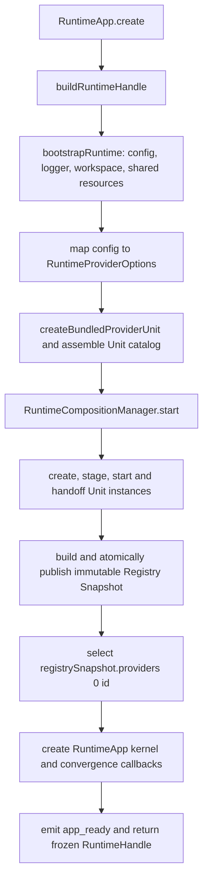
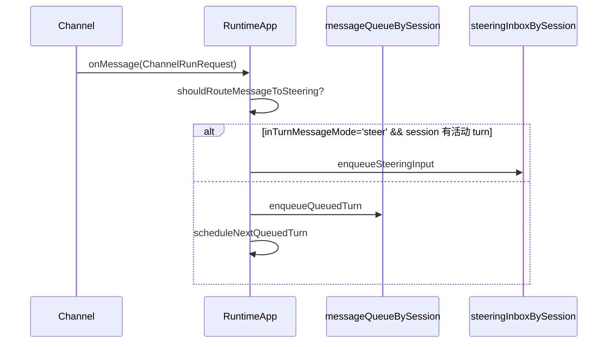
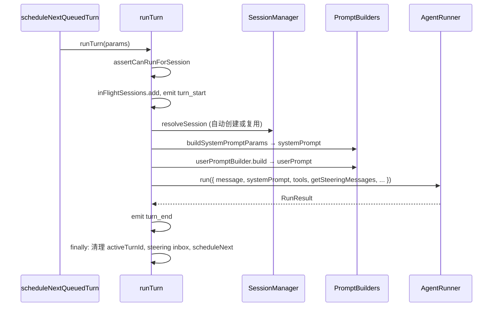
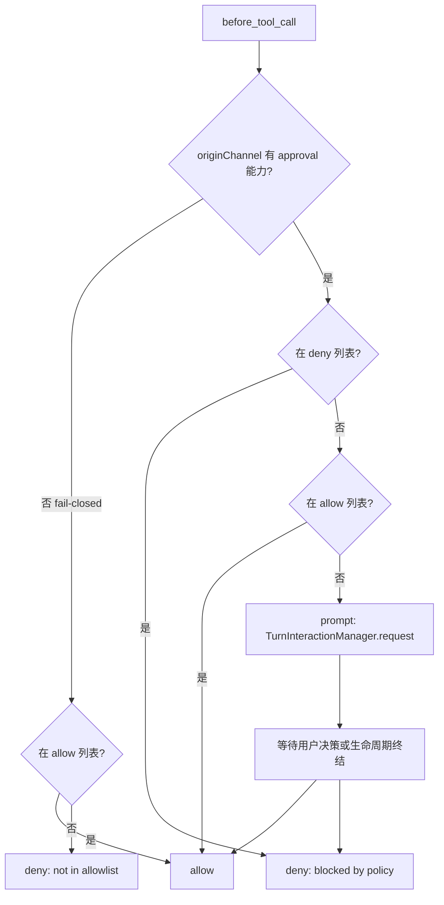
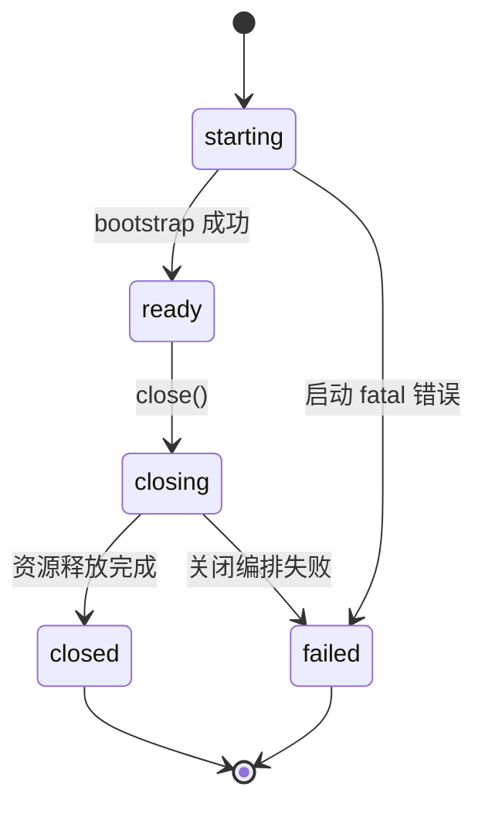

# Runtime Current Architecture

> Status: Current Authority
> Verified: 2026-09-09
> Ownership: Runtime composition, generation, queue, routing, Fanout, Abort, Shutdown, and Subagent Parent/Child lifecycle
> Ownership key: runtime-composition-and-lifecycle

---

## 1. 概述

`src/runtime/` 是应用的 Composition 层。`runtime-builder.ts` 构建 Runtime Handle，`RuntimeCompositionManager` 管理可发布 generation，`CompositionCoordinator` 是 publication、capture、retirement 和 shutdown admission 的唯一线性化 Owner，`RuntimeApp` 则拥有 Turn orchestration、queue、route、Fanout 与 Abort 状态。

没有这一层，各模块只是独立的"库"；有了这一层，才有了一个可以直接启动的 Agent。

### 1.1 核心职责

| 职责 | 说明 |
|---|---|
| 装配 | 按依赖顺序初始化各组件，将全局 config 映射为各模块所需的最小局部参数 |
| 调度 | per-session 串行队列；steering inbox 与普通队列分离 |
| 执行 | 每轮构建 prompt，委托给 `AgentRunner.run()` |
| 路由 | approval / interaction 按起源 channel + clientId 精准回路，不广播 |
| 广播 | 入站装配完成后发送 `user_message`，让同 session 多 client 共享用户消息时间线 |
| 中止 | 维护 per-session `AbortController`，支持 CLI / WebSocket / library 主动中止并清空普通队列 |
| 生命周期 | 统一管理启动、运行、关闭三段 |

### 1.2 容易混淆的边界

**turn 内部的执行**属于 `core/runner`——runtime 调用 `agentRunner.run()`，但 LLM 调用、tool 执行、上下文管理均在 runner 内部完成，runtime 不参与。

### 1.3 配置访问边界

Runtime 是**唯一**允许调用 `loadConfig()` / `resolveAgentConfig()` 的运行时模块。底层领域模块（runner、session、memory 等）只接收 Runtime 传入的最小局部参数，不直接依赖 config loader。

---

## 2. 目录结构

```
src/runtime/
├── RuntimeApp.ts                    # Turn orchestration kernel
├── runtime-builder.ts               # Runtime Handle / application / composition assembly
├── runtime-composition-manager.ts   # startup, reload, publication and retirement
├── composition-coordinator.ts       # publication/capture/retirement linearization
├── reload-coordinator.ts            # subordinate reload state reduction
├── runtime-unit.ts                  # Runtime Unit lifecycle contract/catalog
├── runtime-lifecycle.ts             # instance lifecycle ledger
├── runtime-deadline.ts              # shared bounded-shutdown budget
├── bootstrap.ts                     # config/workspace/resource bootstrap only
├── registry-builder.ts              # immutable Registry Snapshot construction
├── subagent-orchestration.ts        # tracked Parent/Child delegation
├── channel-lifecycle.ts             # channel host bindings/completion
├── prompt-factory.ts                # narrow prompt parameter projection
└── types.ts                         # public Runtime options/events/reports

src/runtime-modules/
├── anthropic-provider.ts            # required bundled Provider Unit
├── builtin-channels.ts              # optional builtin Channel Units
└── builtin-tools.ts                 # builtin Tool registrations
```

公共 barrel 导出 `RuntimeApp`、选择性的 composition/deadline/prompt/error helpers 与必要类型，但不对外泄漏内部 manager。

---

## 3. 整体架构

```
┌──────────────────────────────────────────────────────────────┐
│                         RuntimeApp                           │
│                                                              │
│  外部入口 (CLI / WebSocket / 库调用)                          │
│       │                                                      │
│       ▼                                                      │
│  ┌──────────────┐   handleInboundChannelMessage              │
│  │ 入站分流      │──── steering 条件成立 ──▶ steeringInbox   │
│  └──────────────┘         │                                  │
│       │                   └─── 否则 ──▶ messageQueueBySession│
│       ▼                                                      │
│  scheduleNextQueuedTurn                                      │
│       │ 弹出队头，生成 turnId，登记 routeContextByTurn        │
│       ▼                                                      │
│  ┌──────────────────────────────┐                            │
│  │         runTurn              │                            │
│  │  resolveSession              │                            │
│  │  build systemPrompt          │                            │
│  │  build userPrompt            │                            │
│  │  agentRunner.run(...)        │◀─── getSteeringMessages    │
│  └────────────┬─────────────────┘                            │
│               │ AgentEvent                                   │
│               ▼                                              │
│  fanout ──▶ channel[0..n].send(event)                        │
│          ──▶ userObserver?.(event)                           │
│                                                              │
│  before_tool_call hook ──▶ 三档审批策略                       │
│                              ▼                               │
│                  routeContextByTurn[turnId]                  │
│                              ▼                               │
│                  originChannel.interaction / approval        │
└──────────────────────────────────────────────────────────────┘
```

---

## 4. 类型系统

### 4.1 RuntimeAppOptions（启动选项）

```
RuntimeAppOptions {
  workspaceDir: string          // 唯一必填项
  agentId?: string              // per-agent 配置预留
  envOverrides?: DeepPartial<AgentDefaults>
  cliOverrides?: DeepPartial<AgentDefaults>
  dependencies?: Partial<RuntimeDependencies>   // 测试注入口
  onEvent?: (event: RuntimeEvent) => void       // 生命周期事件
  onAgentEvent?: (event: AgentEvent) => void    // turn 内执行事件（与 channel 并行分发）
}
```

`onEvent` 处理应用级事件（启动 / 关闭 / turn 边界 / 降级警告）；
`onAgentEvent` 处理 turn 内部事件（text_delta / tool_use / compaction_* 等），两套事件平面不互替。

### 4.2 RuntimeDependencies（依赖注入接口）

每个工厂方法只接收自己需要的最小参数子集，由 Runtime 负责从全局 config 里提取并传入：

```
RuntimeDependencies {
  createBundledProviderUnit(options: RuntimeProviderOptions): LoadedRuntimeUnit
  createSessionManager(workspaceDir, options?): SessionManager
  createMemoryManager(options: { workspaceDir, enabled, dbPath?, ... }): Promise<MemoryManager | null>
  createSystemPromptBuilder(): SystemPromptBuilder
  createAgentRunner(config): AgentRunner
  getBuiltinContributionUnits(options, memoryManager): readonly RuntimeContributionUnit[]
}
```

Bundled Provider seam 始终返回一个具名 `LoadedRuntimeUnit`，不返回 Provider entry、Contribution registration 或 Unit 数组。默认实现委托给 `createAnthropicProviderModule()`；External Provider 继续经 `RuntimeAppOptions.loadedUnits` 进入同一个 Unit catalog。Production 与 Fake Provider 都经过 create → registration → staging → start → publication，Runtime Builder 不在 staging 前读取 Provider entry。

### 4.3 RunTurnParams（单轮参数）

```
RunTurnParams {
  requestId?: string          // stable root request identity; omitted → generated at intake
  sessionKey: string
  message: string | ChatContentBlock[]
  promptMode: 'full' | 'minimal' | 'none'
  modelReference?: ModelReference
  requestOverride?: ModelRequestOverride
  maxLlmCalls?: number
  safetyLevel?: string
  reloadContextFiles?: boolean
  turnId?: string
  originMessageId?: string    // channel queued 路径内部透传；关联 user_message
}
```

Runtime 使用 [Model Resolution](./core_model_resolution.md) 在已捕获 generation 的 Provider projection 上解析完整结构化 `modelReference` 与 `requestOverride`；Config 中的 `model` 只是完整默认 Model Reference 输入，不拥有 Model Facts。Runtime 不从 Provider 顺序推断缺省 Provider；缺少引用或 configured default 不属于 captured Catalog 时，Turn 在 Provider invocation 前失败且不 fallback。

`RuntimeApplication.getModelCatalog()` 同步读取唯一 current Snapshot pointer，返回深冻结、传输安全的 Provider/Model DTO、generation 和 configured default 的 `unset`/`available`/`unavailable` membership 状态。该查询不 capture generation pin、不调用 Provider code，也不触发 I/O；已开始 Turn 仍继续使用其 pinned generation。

### 4.4 队列与路由类型（queue-types.ts）

```
MessageRouteContext = {
  originChannel?: Channel
  originClientId?: string
}

QueuedChannelTurn = {
  requestId, sessionKey, message
  launchContext?   // modelReference / requestOverride / maxLlmCalls
  routeContext?    // approval 反向路由
  originMessageId? // user_message → run_start correlation
}

PendingSteeringInput = {
  message: string
  routeContext?    // 保留，为后续 steering 独立交互路由预留扩展口
}
```

这些类型放在 `runtime/` 而非 `adapters/channel/`，因为它们描述的是 runtime 内部调度形态；channel 层只生产 `ChannelRunRequest`，对队列结构不感知。

---

## 5. Startup and publication



`RuntimeApp.create()` is delegation-only. `bootstrap.ts` prepares shared prerequisites but does not own Model Resolver, Task module, Registry assembly, publication, or reload. A Snapshot is visible only after every selected Unit has completed create/start/handoff and the full candidate has validated. Provider ordering follows Registry deterministic ordering：Builtin 在 External 之前；该顺序只控制稳定投影，不建立 default Provider 或第二份 Provider priority metadata。

Required Unit 的 `create()` 失败会终止整体启动，并携带 Unit identity 与 `phase=create`；已创建但未成功进入应用的 candidate 按 Composition ownership 清理。candidate cleanup 失败保持 fail-closed。完整但 Provider 列表为空的 Snapshot 可以发布，以支持 Catalog 查询和后续 Unit enable；Runtime 不为它发明 default Provider。这些失败路径不产生 partial Snapshot、kernel 或 ready event。

Memory remains optional: disabled Memory contributes no tools; initialization failure emits a warning and continues with `memoryManager = null`; successful initialization participates through the Memory contribution Unit and is closed as a shared resource during bounded Shutdown.

---

## 6. 入站调度

### 6.1 消息入站流程



`handleInboundChannelMessage` 只入队，从不直接调 `runTurn()`。

### 6.2 Steering 路由判定

两个条件同时成立才进 steering inbox：
1. `resolvedConfig.runner.inTurnMessageMode === 'steer'`（默认是 `followup`，须显式配置）
2. `activeTurnIdBySession.has(sessionKey)`（存在当前活动 turn）

任一不满足 → 消息进普通队列。这保证"没有活动 turn 的消息不会被静默丢弃"。

### 6.3 调度器：scheduleNextQueuedTurn

```
if inFlightSessions.has(sessionKey): return   // session busy，等待
弹出队头 next
startQueuedTurn(next)
  生成 turnId
  登记 routeContextByTurn[turnId] = routeContext
  runTurn(...)
  finally: routeContextByTurn.delete(turnId)
```

**turnId 在真正弹出队头时才生成**，不在入队时占用 turn 级资源。若 channel 在排队阶段断开，可直接丢弃队列项而不留 dangling turnId。

### 6.4 两个并发字段的区别

| 字段 | 语义 |
|---|---|
| `inFlightSessions` | "该 session 是否 busy"——只要 `runTurn()` 的 Promise 未结束就 busy |
| `activeTurnIdBySession` | "是否存在可接 steering 的活动 turn"——runTurn 进入后设置，turn 结束时清除 |

steering 路由用的是后者，因为它需要精准绑定到一个 turnId。

---

## 7. 单轮运行



`getSteeringMessages` 是 Runtime 传给 runner 的读取回调——runner 在合适时机主动拉取并清空 steeringInbox。读后即删，避免重复消费。

### 7.1 runTurn finally 必做四件事

1. 清理 `activeTurnIdBySession`（防御：只在 turnId 仍是当前值时清除）
2. 清空 `steeringInboxBySession`（turn 结束后 inbox 无论是否消费，一律丢弃）
3. `activeRunCount` 减一（用 `Math.max(0, ...)` 防御性归零）
4. `void scheduleNextQueuedTurn(...)` 异步续推下一条队列项

---

## 8. Generation-aware composition

Each published `RegistrySnapshot` contains one generation's Provider, Tool, Hook, and Channel projections. `CompositionCoordinator` serializes publication, root capture, pin release, retirement completion/failure, and Shutdown admission.

- A root Turn captures one generation pin before execution and releases it only after its complete request tree converges.
- Child Turns use the Parent's Snapshot and route context; they never recapture the latest generation.
- Enable/disable requests are prepared off to the side. Only a complete candidate can publish atomically.
- Reload is latest-wins before publication. Once publication commits, the previous generation retires rather than rolling back the new Current generation.
- Retirement first waits for old-generation pins, then aborts blocking trees after the graceful deadline, and reports a failed residual if convergence still does not occur.
- API consumers receive a frozen `RuntimeHandle` with separate `application`, `composition.enableUnit/disableUnit`, and idempotent `close()` surfaces.

`RegistrySnapshot`, `ToolProjection`, and `HookProjection` are read-only after publication. RuntimeApp does not append Task tools, replace executors, or rebuild a partial Snapshot after capture.

### 8.1 Subagent Parent/Child lifecycle

The Task Tool delegates only while a matching Parent Turn remains active. Runtime validates Parent identity, session, signal, request and depth; registers a Child member before execution; inherits the Parent generation, Abort signal and route; creates an isolated spawned session; emits terminal events; and releases route/session/member state in `finally`. Root generation release waits for all registered Child members.

Generic Tool execution belongs to [Core Tools](./core_tools.md), and the Runner algorithm belongs to [Agent Runner](./core_runner.md).

### 8.2 fs tools 的工厂函数模式

fs 类工具（read_file / write_file / edit_file 等）通过工厂函数创建，显式绑定 `workspaceDir` 和 `fsWorkspaceOnly`（默认 `true`）。具体行为由 [Builtin Tools](./core_tools_builtin.md) 拥有：

```
createWorkspaceToolModule({ workspaceDir, fsWorkspaceOnly, ... })
  → api.registerTool(createReadFileTool(...))
  → api.registerTool(createWriteFileTool(...))
  → ...
  → api.registerTool(webFetchTool / execTool / processTool)
```

### 8.3 Tool definition projection

Runtime obtains the visible canonical `ToolDefinition[]` from the captured generation and supplies Tool names to Prompt plus definitions to Runner. It does not convert Provider wire formats. The canonical `inputSchema` contract belongs to [Core Tools](./core_tools.md); Anthropic `input_schema` and OpenAI-compatible `function.parameters` conversion belongs to [Provider Adapter](./adapter_llm.md).

---

## 9. Approval / Interaction 路由

### 9.1 三档审批策略



**无 approval channel 时（fail-closed）**：只有 allow 列表里的工具才能执行；默认 `allow: []` 意味着无 channel 时所有工具均被拒绝。这是最小权限设计。

**优先级**：deny 命中 > allow 命中 > 触发 prompt。deny 优先于 allow，防止通配符豁免。

### 9.2 模式匹配语法

每个 allow / deny 条目支持两种形式：

| 形式 | 示例 |
|---|---|
| 精确名称 | `"exec"` |
| Glob | `"read_*"` |

Glob 只解释 `*` 和 `?`。v1 不展开 `group:*`；例如 `group:fs` 只是字面 pattern，只会匹配同名工具，不会匹配 `read_file`。

### 9.3 路由实现

```
wireApprovalRouting():
  TurnInteractionManager.onRequest
    → routeContextByTurn[turnId].originChannel.interaction
  TurnInteractionManager.onClose
    → notify the same origin interaction transport

runTurn():
  approvalCapability = getApprovalCapability(turnId) // only when origin supports interaction
  agentRunner.run({ ..., approvalCapability })

Runner Tool pipeline:
  before_tool_call projection → canonical input validation → Application Tool policy
  → approvalCapability.request(...) when policy requires approval
```

`wireApprovalRouting()` 只连接 interaction transport，不向 Runner 注册 mutable Hook。`before_tool_call` 是 generation-bound Hook projection；人工授权则是本次调用显式 capability。初始 delivery failure 或后续 origin disconnect 分类为 unavailable，没有 elapsed-time expiry。

---

## 10. 生命周期管理

### 10.1 状态机



`phase` 是 **应用级**标记，与 per-turn 并发无关。per-turn 并发由独立的 `inFlightSessions: Set<string>` 控制。

### 10.2 Bounded Shutdown

`RuntimeHandle.close()` caches the first Promise and creates one shared `RuntimeDeadlineBudget`. Shutdown admission is linearized with publication/capture, rejects new work and reload, cancels queued requests, closes pending interactions, and drives active request trees toward terminal outcomes. Runtime then converges reload/retirement, stops eligible Unit instances, closes Memory and Logger, and waits for tracked terminal Fanout while budget remains.

The immutable `RuntimeShutdownReport` records `completed` and `deadline-exhausted` outcomes, completed/aborted/nonconverged request IDs, protected generations, instance stop results, failed resources, and structured residuals. Deadline exhaustion never reopens admission and never hides protected work.

---

## 11. 错误处理

所有错误通过 `classifyRuntimeError(scope, error)` 统一归一化，分 scope 和 severity：

| scope | 关键情形 | severity | 处理 |
|---|---|---|---|
| startup | required Provider Unit 构造或 options validation 失败 | fatal | 标注 Unit/create phase，清理 candidate，拒绝启动 |
| startup | published Snapshot 无 Provider | fatal | kernel/app_ready 前关闭 Composition 与 bootstrap resources |
| startup | memory 初始化失败 | recoverable | 禁用 memory，继续启动 |
| run | phase 不对 / session busy | recoverable | 抛 RUN_REJECTED，不销毁 app |
| run | AgentRunner 抛错 | recoverable | 本轮失败，app 继续 |
| reload | 文件读取失败 | warning | 保留旧 contextFiles |
| shutdown | 单个 close() 失败 | warning | 继续释放其他资源 |

**核心原则**：运行失败收口在单次 turn，不污染应用生命周期。

---

## 12. 可观测性

两套事件平面：

- **`RuntimeEvent`**（via `onEvent`）：应用装配与生命周期事件
  - `app_start` / `app_ready` / `turn_start` / `turn_end`
  - `context_reload` / `messages_dropped` / `warning` / `error`
  - `shutdown_start` / `shutdown_end`

- **`AgentEvent`**（via `onAgentEvent` + `channel.send`）：turn 内执行事件
  - `user_message` / `text_delta` / `tool_use` / `tool_result` / `llm_call` / `compaction_*` 等

`user_message` 在输入装配完成后、queued / steering 分流前由 Runtime 产生。它使用独立 `messageId`；queued 消息后续通过 `run_start.originMessageId` 与实际 turn 关联。附件只广播摘要，不广播原始 Base64。

### 12.1 用户主动中止

三个入口共享 `RuntimeApp.abortTurn(sessionKey)`：CLI `Ctrl+C`、WebSocket `abort_turn`、library 直接调用。Runtime 为每个 active session 保存一个 `AbortController`，并把 signal 透传给 Runner；中止同时清空该 session 尚未启动的普通队列。Runner 以 `stopReason='aborted'` 正常返回，不把用户中止当作普通错误抛出。

主动中止不等于硬 steering：它终止当前 turn，不把一条新指令注入被中止的执行流。硬 steering 仍是规划项。

两套平面不互替；前者给应用监控，后者给 UI 实时展示。

---

## 13. Evidence

| Kind | Evidence |
|---|---|
| Source | [runtime-builder.ts](../../../src/runtime/runtime-builder.ts), [Anthropic Provider Runtime Module](../../../src/runtime-modules/anthropic-provider.ts), [RuntimeApp.ts](../../../src/runtime/RuntimeApp.ts), [runtime-composition-manager.ts](../../../src/runtime/runtime-composition-manager.ts), [runtime errors](../../../src/runtime/errors.ts), [composition-coordinator.ts](../../../src/runtime/composition-coordinator.ts), [subagent-orchestration.ts](../../../src/runtime/subagent-orchestration.ts) |
| Tests | [runtime-builder.test.ts](../../../src/runtime/runtime-builder.test.ts), [anthropic-provider.test.ts](../../../src/runtime-modules/anthropic-provider.test.ts), [RuntimeApp.test.ts](../../../src/runtime/RuntimeApp.test.ts), [RuntimeApp.intake.test.ts](../../../src/runtime/RuntimeApp.intake.test.ts), [runtime-composition-manager.test.ts](../../../src/runtime/runtime-composition-manager.test.ts), [composition-coordinator.test.ts](../../../src/runtime/composition-coordinator.test.ts), [subagent-orchestration.test.ts](../../../src/runtime/subagent-orchestration.test.ts), [ft-10-runtime-composition-deletion.test.ts](../../../src/architecture-fitness/ft-10-runtime-composition-deletion.test.ts) |
| Controlling authority | [ADR-005](../adr-005-extension-registry-runtime-composition.md), [Runtime Composition Module Spec](../runtime-composition-module-spec.md), [Source Layout Convergence Migration Spec](../source-layout-convergence-migration-spec.md), [Core Abort Spec](../core-abort-spec.md), [Subagent Model Resolution Module Spec](../subagent-model-resolution-module-spec.md) |
