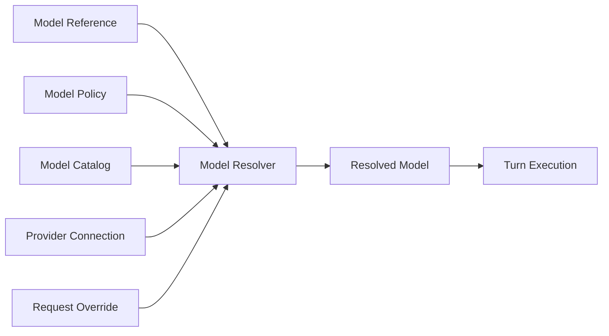
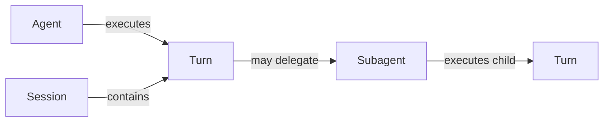
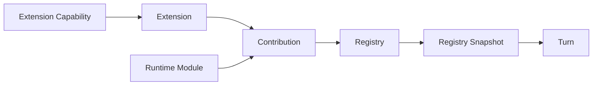
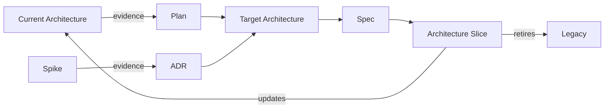

# Domain Glossary

## 1. 文档状态

- **状态：** Accepted
- **版本：** 1.0
- **日期：** 2026-08-28
- **所有者：** 项目所有者
- **关联计划：** [Architecture Foundation Plan](../roadmap/architecture-foundation-plan.md) AF-02

本文档定义 my-agent 目标架构使用的规范词义。定义表达目标语义，不表示当前实现已经完成对应边界；当前实现事实仍按各文档自身状态判断。

本文所称“所有者”是对概念语义和不变量负责的逻辑责任域，不预先决定 AF-03 的目录、文件、类或接口名称。中英文名称均出现时，英文名称是代码和架构文档中的规范术语。

## 2. 使用规则

1. 一个名称只表达一种职责，不同时表示配置输入、运行事实和执行策略；
2. 新 ADR、Spec 和 Target Architecture 必须使用本文术语；
3. 当前实现使用同名词但语义不同时，应标记为 Current/Legacy 含义，不反向修改规范定义；
4. 新概念必须补充职责、所有者和非含义后才能成为架构术语；
5. `Reference` 表示稳定引用，`Descriptor` 表示事实描述，`Policy` 表示选择规则，`Resolved` 表示一次解析的不可变结果；
6. `Adapter` 连接外部协议或兼容边界，`Registry` 管理可发现项，`Runtime` 编排执行和生命周期；三者不可互相代称。

## 3. Model Resolution

### Provider

- **定义：** 提供模型调用能力的服务或协议族的稳定身份，例如 Anthropic 或一个 OpenAI-compatible 服务。
- **职责：** 标识模型从哪里获得、由哪个集成模块解析和创建客户端。
- **所有者：** Model Resolution 负责身份语义；Provider Integration 负责具体接入。
- **不表示：** API Key、Endpoint、已连接客户端、单个 Model，或用户选择策略。

### Provider Connection

- **定义：** 访问某个 Provider 实例所需的部署级连接信息，包括凭据引用、Endpoint、租户或代理设置。
- **职责：** 让 Provider Adapter 建立可用连接，并隔离部署环境差异。
- **所有者：** Provider Integration / Configuration。
- **不表示：** Provider 身份、Model 能力事实、Model 选择，或 per-turn 参数。

### Protocol

- **定义：** Provider Adapter 与模型服务交换请求、流事件、Tool Use 和错误的线协议及语义约定。
- **职责：** 决定消息编码、流式事件解释、工具调用格式和协议错误映射。
- **所有者：** Provider Integration。
- **不表示：** 网络传输库、Endpoint、Provider 品牌名称，或通用领域消息类型。

### Model Reference

- **定义：** 用户、Agent Profile 或调用方用于请求模型的稳定、可序列化引用。
- **职责：** 表达“想使用哪个模型”，并作为 Model Resolver 的输入。
- **所有者：** Model Resolution。
- **不表示：** 完整 Model Facts、已创建 Client、最终 Endpoint，或一次 Turn 的解析结果。

### Model Descriptor

- **定义：** 特定 Provider Model 的权威或保守事实集合，例如协议、上下文上限、最大输出、媒体类型和能力。
- **职责：** 提供解析和执行预算所需的 Model Facts，并记录事实来源。
- **所有者：** Model Catalog / Model Resolution。
- **不表示：** 用户偏好、默认选择、请求覆盖、API Key，或可变运行状态。

### Model Policy

- **定义：** 在候选 Model、调用上下文和用户约束之间做选择或限制的显式规则。
- **职责：** 表达允许、偏好、fallback 和约束，而不伪装成 Model Facts。
- **所有者：** Application Policy。
- **不表示：** Model Descriptor、Provider Connection，或最终执行配置。

### Request Override

- **定义：** 调用方针对单个 Turn 提供、且仅能作用于明确允许字段的临时模型请求覆盖。
- **职责：** 在 Model Policy 允许范围内调整本次请求参数，并保留覆盖来源。
- **所有者：** Turn 输入提供者声明；Model Resolution 校验和应用。
- **不表示：** 全局配置、Model Facts、Provider Connection、Model 选择策略，或跨 Turn 持久状态。

### Resolved Model

- **定义：** Model Resolver 针对一次 Turn 生成的权威、不可变执行快照，绑定 Provider 身份、用于模型调用的 core-owned Port、Protocol、Endpoint、Model Capability facts 和已应用的请求限制。
- **职责：** 为 Runner 提供不再需要二次推断的完整模型执行输入。
- **所有者：** Model Resolution 生成；Turn Execution 消费。
- **不表示：** Provider SDK Client、全局默认配置、可变 Client 单例、Model Catalog 条目，或跨 Turn 自动更新的引用。

### Model Resolver

- **定义：** 将 Model Reference、Provider/Model Facts、Model Policy 和允许的请求覆盖合并为 Resolved Model 的应用服务。
- **职责：** 校验来源、应用优先级、产生保守结果并报告不可解析状态。
- **所有者：** Model Resolution。
- **不表示：** Provider SDK Adapter、Catalog 本身、Runner，或配置加载器。

### Model Catalog

- **定义：** 按 Provider 和 Model 身份组织 Model Descriptor 及其事实来源的可查询集合。
- **职责：** 向 Model Resolver 提供可追踪的 Model Facts。
- **所有者：** Model Resolution。
- **不表示：** Provider Connection Store、用户可选策略、运行中 Client Pool，或未经标注来源的默认值集合。

### Model Resolution 关系



```text
Model Reference ─┐
Model Policy ────┼─> Model Resolver ─> Resolved Model ─> Turn Execution
Model Catalog ───┤
Provider Connection ─┤
Request Override ────┘
```

## 4. Agent Execution

### Agent Profile

- **定义：** 可序列化引用一个 Agent 的身份、行为指令、Model Reference、默认策略和能力约束的配置描述。
- **职责：** 让调用方和 Runtime Composition 选择 Agent 角色，而不把运行事实写回静态配置。
- **所有者：** Agent Application / Configuration。
- **不表示：** 正在运行的 Agent、Session、Turn、Resolved Model，或 Provider Connection。

### Subagent Profile

- **定义：** 用于受委派执行的 Agent Profile，额外约束子任务角色、工具策略、预算和允许的嵌套深度。
- **职责：** 让父 Agent 通过稳定引用选择 Subagent 行为和限制。
- **所有者：** Subagent Orchestration / Configuration。
- **不表示：** 活跃 Subagent 执行、Child Turn、后台任务、并发承诺，或父 Session 副本。

### Agent

- **定义：** 具有身份、行为指令、默认策略和可用能力边界的执行角色。
- **职责：** 为 Turn 提供稳定的角色上下文和执行约束。
- **所有者：** Agent Application。
- **不表示：** OS 进程、RuntimeApp 实例、Session、单次 Turn，或 LLM Provider。

### Subagent

- **定义：** 由父 Agent 委派、使用独立角色配置和执行上下文完成受限任务的 Agent 执行。
- **职责：** 隔离子任务上下文、工具策略、预算和结果，并保持父子追踪关系。
- **所有者：** Agent Application / Subagent Orchestration。
- **不表示：** 后台任务、独立服务、并发保证、父 Session 的副本，或任意递归 Agent Team。

### Session

- **定义：** 跨多个 Turn 持续存在的对话身份、历史和持久化边界。
- **职责：** 关联消息历史、分支、压缩记录和同一会话的执行串行化策略。
- **所有者：** Session Domain。
- **不表示：** 网络连接、Client、单次请求、Agent 身份，或正在运行的 Turn。

### Turn

- **定义：** 从一个已接收用户输入开始，到该输入对应的 Agent 执行完成、失败或中止为止的一次可追踪执行单元。
- **职责：** 固定 Resolved Model、Registry Snapshot、取消信号、事件关联和本次执行结果。
- **所有者：** Turn Execution。
- **不表示：** 单次 LLM 调用、单条消息、整个 Session，或一个 Channel 连接。

### Run

- **定义：** Runner 执行一个 Turn 的内部过程，可包含多次 LLM 调用、Tool 调用和上下文压缩。
- **职责：** 描述执行引擎的运行过程和结果。
- **所有者：** Turn Execution。
- **不表示：** Session 生命周期、Runtime 生命周期，或 Subagent 的后台持久化记录。

### LLM Call

- **定义：** Turn 内通过 Resolved Model 向模型服务发起并消费一次请求、流或响应的执行步骤。
- **职责：** 表达一次模型协议交互及其 Usage、Stop Reason 和错误结果。
- **所有者：** Turn Execution 发起；Provider Adapter 执行协议映射。
- **不表示：** Turn、Session、Model Resolution，或完整 Tool Use Loop。

### Agent Execution 关系



```text
Agent ─executes─> Turn <─contained by─ Session
                   │
                   └─may delegate─> Subagent ─executes─> child Turn
```

## 5. Extension Framework

### Tool

- **定义：** 可由 Agent 请求执行、具有名称、输入契约、结果语义和明确副作用边界的能力。
- **职责：** 将受控操作暴露给 Turn Execution，并返回结构化成功或错误结果。
- **所有者：** Tool Domain；具体实现由对应 Module 或 Extension 所有。
- **不表示：** 任意函数、Provider API、Hook、Channel，或未经声明的 Runtime 访问权。

### Channel

- **定义：** 在外部 Client/Transport 与 Runtime 之间接收用户意图、发送事件并提供可选交互能力的 I/O Adapter。
- **职责：** 处理传输、连接、路由标识和呈现，不实现 Agent 决策或 Tool Use Loop。
- **所有者：** Channel Integration。
- **不表示：** Session、Client 身份本身、Agent Runner、业务策略，或通用 Event Bus。

### Hook

- **定义：** 在已命名的 Runtime 或 Turn 生命周期点观察、补充或按契约影响执行的扩展点。
- **职责：** 在不替换核心 Runner 的前提下执行受限横切逻辑。
- **所有者：** Hook Contract 由 Stable Core 所有；实现由 Module 或 Extension 所有。
- **不表示：** 任意中间件、全局事件监听、Runner Factory 替换，或访问 Runtime 私有状态的后门。

### Extension

- **定义：** 可安装和加载的扩展代码单元，拥有独立身份、配置命名空间、私有资源和一组 Contribution。
- **职责：** 在受限 Extension Capability 和统一 Lifecycle 下向 Runtime 提供一个或多个扩展能力。
- **所有者：** Extension Framework 管理契约；Extension 作者拥有具体实现和私有资源。
- **不表示：** 单个 Tool、Contribution、远程下载包、运行时任意代码热加载，或 Runtime Module 的同义词。

### Runtime Module

- **定义：** 与 Extension 使用相同 Contribution 和 Lifecycle 机制、但由应用构建和部署直接提供的内置功能单元。
- **职责：** 将 Builtin Tool、Channel、Hook 或其他能力按统一方式注册到 Runtime。
- **所有者：** Runtime Composition；具体 Module 拥有自身实现。
- **不表示：** Node.js module、任意源码目录、外部 Extension，或 Composition Root 本身。

### Contribution

- **定义：** Extension 或 Runtime Module 向 Registry 提交的类型化、可校验能力声明及其实现绑定。
- **职责：** 描述“贡献什么”，使 Registry 可在不识别具体 Extension 类型的情况下构建 Snapshot。
- **所有者：** Extension Framework 定义契约；贡献方提供实例。
- **不表示：** Extension 本体、已发布 Snapshot、直接修改 Registry 集合，或不受治理的启动副作用。

### Capability

- **定义：** 对显式授权或受支持功能的统称；在架构文档和代码中必须使用下列限定术语之一。
- **职责：** 建立授权边界和支持事实的共同词根，不直接作为接口或字段类型。
- **所有者：** Domain Glossary 管理统称；具体所有权由限定术语定义。
- **不表示：** 一个统一 Capability 类型、通用 Service Locator、任意对象访问权，或隐含权限。

### Extension Capability

- **定义：** Extension 被显式授予、用于访问受限 Runtime 服务或平台上下文的类型化权限。
- **职责：** 将 Extension 的可访问面限制到已声明且获准的最小集合。
- **所有者：** 提供服务的边界定义；Runtime Composition / Policy 授权。
- **不表示：** Model 支持事实、Channel 功能、Tool 列表、Extension 私有资源，或 Service Locator。

### Model Capability

- **定义：** Model Descriptor 记录的模型支持事实，例如 Tool Use、图像输入或特定协议功能。
- **职责：** 让 Model Resolution 和调用方基于已知事实校验请求并采用保守 fallback。
- **所有者：** Model Catalog / Model Resolution。
- **不表示：** Extension 权限、Channel 功能、用户 Policy，或可调用的 Runtime 服务。

### Channel Capability

- **定义：** Channel 可向 Runtime 提供的可选交互或传输功能，例如审批、结构化选择或附件输入。
- **职责：** 允许 Runtime 显式检测和使用 Channel 支持的功能，而不识别具体 Channel 类型。
- **所有者：** Channel Contract 定义；具体 Channel Adapter 声明支持。
- **不表示：** Extension 权限、Model 支持事实、Transport 身份，或 Runtime 的通用访问权。

### Registry

- **定义：** 校验、索引并发布某类 Contribution 的权威集合管理器。
- **职责：** 生成版本化不可变 Registry Snapshot，并通过受控事务改变后续可见集合。
- **所有者：** Extension Framework / Runtime Composition。
- **不表示：** 可由消费者修改的 `Map`、依赖注入容器、Service Locator、Extension Loader，或 Marketplace。

### Registry Snapshot

- **定义：** Registry 在一个版本上的不可变、内部一致的 Contribution 视图。
- **职责：** 保证一个 Turn 在整个执行期间观察到固定能力集合。
- **所有者：** Registry 生成；Turn 捕获和消费。
- **不表示：** Registry 本身、深复制全部 Extension 状态，或对进行中 Turn 的实时更新。

### Extension Framework 关系



```text
Extension ───────┐                         ┌─> Turn
                 ├─> Contribution ─> Registry ─> immutable Snapshot
Runtime Module ──┘

Extension Capability ─grants bounded access─> Extension
```

## 6. Architecture Boundaries

### Domain

- **定义：** 表达核心概念、值、不变量和与具体集成无关行为的最内层逻辑边界。
- **职责：** 拥有稳定领域语义，并保持可在无 Provider SDK、Channel SDK、Store 或 Runtime 的情况下验证。
- **所有者：** Stable Core。
- **不表示：** 所有共享类型、数据访问层、Application 用例、Infrastructure Adapter，或一个预定源码目录。

### Application

- **定义：** 编排 Domain 概念、应用策略和 core-owned Port 以完成用例的逻辑边界。
- **职责：** 协调 Model Resolution、Turn Execution 等应用流程，而不依赖具体 Infrastructure 实现。
- **所有者：** Stable Core。
- **不表示：** UI/Channel、Composition Root、Provider SDK Adapter、配置文件，或整个 Runtime 进程。

### Infrastructure

- **定义：** 实现 core-owned Port，并连接 Provider SDK、Channel Transport、Store、文件系统或其他外部机制的逻辑边界。
- **职责：** 隔离外部协议、SDK、I/O 和部署变化，映射为 Stable Core 契约。
- **所有者：** 对应 Integration Adapter。
- **不表示：** 业务策略、Application 用例、Composition Root，或所有技术辅助代码的统称。

### Composition

- **定义：** 选择具体实现、验证配置、构建依赖图并编排进程级启动和关闭的最外层逻辑边界。
- **职责：** 将 Stable Core、Infrastructure Adapter、Runtime Module 和 Extension 组装为可运行系统。
- **所有者：** Runtime Composition。
- **不表示：** Runtime 的 Turn/队列逻辑、业务规则、通用 DI Container，或任意模块都可访问的服务集合。

### Stable Core

- **定义：** Domain、Application 及其拥有的公共契约的统称，强调不依赖具体 Infrastructure 和 Composition。
- **职责：** 提供可独立验证、可由不同 Adapter 驱动的稳定行为边界。
- **所有者：** Domain/Application 维护者。
- **不表示：** 单个包、永不变化的代码、RuntimeApp，或包含具体 SDK 的共享层。

### Composition Root

- **定义：** Composition 中实际选择具体实现并创建、连接和启动顶层对象图的唯一入口。
- **职责：** 将显式依赖传给消费者，并把构建后的运行责任交给 Runtime。
- **所有者：** Runtime Composition。
- **不表示：** Service Locator、全局容器、Runtime 执行循环，或可在任意模块重复出现的工厂集合。

## 7. Runtime and Integration

### Port

- **定义：** 由 Stable Core 拥有、用于表达其需要外部边界完成何种操作的契约。
- **职责：** 允许 Application 依赖抽象行为，并由 Infrastructure Adapter 实现外部协议、SDK 或存储集成。
- **所有者：** 需要该行为的 Domain/Application 边界。
- **不表示：** 具体 Adapter、SDK Client、网络端口、通用接口集合，或为每个类机械创建的抽象。

### Adapter

- **定义：** 在核心 Port/Contract 与外部 SDK、协议、存储或 Legacy API 之间做语义转换的边界实现。
- **职责：** 隔离外部变化，完成类型、错误、事件和协议映射。
- **所有者：** 对应 Infrastructure Integration；核心拥有被实现的 Port。
- **不表示：** 业务策略、Composition Root、通用包装层，或为隐藏循环依赖而增加的转发对象。

### Compatibility Adapter / Compat

- **定义：** 迁移期间将 Legacy Public API 或旧输入单向映射到新权威核心的临时 Adapter。
- **职责：** 保持已确认兼容行为，并提供负责人、到期日和删除条件。
- **所有者：** 拥有迁移 Slice 的团队或模块。
- **不表示：** 长期双实现、新核心可依赖的抽象、旧逻辑备份，或推荐公共 API。

`Compat` 只作为 `Compatibility Adapter` 的简称使用，不表示一般兼容性目标。

### Runtime

- **定义：** 承载 Session/Turn 请求，协调队列、路由、Snapshot、取消和进程级生命周期的运行环境。
- **职责：** 编排已解析依赖和运行资源，不拥有 Provider、Tool、Channel 或 Session 的内部业务规则。
- **所有者：** Runtime Application。
- **不表示：** Composition Root、Agent Runner、Node.js 进程本身，或全局 Service Locator。

### Runtime Builder

- **定义：** 根据已验证配置和已加载 Module/Extension 构建 Runtime 依赖、Registry 和资源图的 Composition 服务。
- **职责：** 创建、连接和启动组件，并在失败时按所有权规则清理部分资源。
- **所有者：** Runtime Composition。
- **不表示：** Runtime 执行循环、配置加载器、Extension Marketplace，或可从任意位置访问的容器。

### Lifecycle

- **定义：** 一个 Module、Extension、Adapter 或 Runtime 从创建、校验、启动、可用、排空到停止和释放的状态与顺序契约。
- **职责：** 明确每个资源的创建者、使用者、关闭责任、失败清理和幂等要求。
- **所有者：** Stable Core 定义公共 Lifecycle Contract；资源拥有者实现具体行为；Runtime Composition 编排顺序。
- **不表示：** 只有 `start()`/`stop()` 两个方法、垃圾回收、进程信号处理本身，或隐式注册副作用。

### Resource Ownership

- **定义：** 对资源创建、共享范围、使用计数、排空、释放和失败清理承担唯一责任的规则。
- **职责：** 防止重复关闭、资源泄漏和关闭顺序不确定。
- **所有者：** 创建资源的 Module、Extension 或 Runtime Builder，具体归属由 Spec 明确。
- **不表示：** JavaScript 对象引用、任意消费者都能关闭资源，或仅靠 Garbage Collection。

## 8. Governance and Documentation

### Current Architecture

- **定义：** 经代码、测试和运行证据验证的当前生产结构、调用流和行为事实。
- **职责：** 回答系统现在如何工作，并链接验证证据。
- **所有者：** 实现对应模块的维护者；项目所有者确认权威入口。
- **不表示：** 目标设计、未实现 Spec、Roadmap、过期设计记录，或整个 `docs/architecture/` 目录的默认状态。

### Target Architecture

- **定义：** 已接受的目标模块、依赖、契约、生命周期和迁移边界。
- **职责：** 约束 Architecture Slice 和后续 Spec，不伪装成当前实现。
- **所有者：** 项目所有者。
- **不表示：** Current Architecture、实现进度、愿景清单，或无需证据即可固定的接口细节。

### Plan

- **定义：** 描述跨阶段目标、顺序、Gate、风险和退出条件的治理工件。
- **职责：** 决定“为什么、按什么顺序、满足什么条件后推进”。
- **所有者：** 项目所有者。
- **不表示：** Module Contract、实现说明，或 `Accepted` 即代表完成。

### Spec

- **定义：** 对一个模块或行为边界的公共契约、状态、错误、并发、Lifecycle 和验收条件的可实施说明。
- **职责：** 决定实现必须满足什么，不要求预写内部代码结构。
- **所有者：** 对应模块或行为边界的维护者；项目所有者接受。
- **不表示：** 调研笔记、Roadmap、Current Architecture，或未经接受即可实施的想法。

### ADR

- **定义：** 记录长期且难回退的架构决策、背景、备选方案、证据和后果的工件。
- **职责：** 解释为什么选择某个架构方向，并允许后续通过 Supersede 演进。
- **所有者：** 项目所有者。
- **不表示：** 所有小型实现选择、会议纪要、Spec，或不可改变的永久真理。

### Spike

- **定义：** 在时间盒内验证一个可证伪架构假设的实验性工作及其 Spec/Results。
- **职责：** 用执行证据减少会改变架构结论的未知。
- **所有者：** Spike 执行者负责证据；项目所有者接受实验和确认结果。
- **不表示：** 生产实现、无边界探索、证明预设结论，或自动进入生产的原型。

### Legacy

- **定义：** 已被新权威事实或生产路径替代、但尚未完成迁移或删除的文档、API 或实现。
- **职责：** 作为有明确退出路径的迁移对象被追踪。
- **所有者：** 替代它的 Architecture Slice 或文档迁移项。
- **不表示：** 单纯年代较久、仍是权威的稳定代码，或需要长期复制保存的历史。

### Architecture Slice

- **定义：** 在已接受 Target Architecture、ADR 和 Spec 约束下，迁移一个真实生产调用方或权威路径的最小可验收交付单元。
- **职责：** 以用户可观察结果、聚焦与更广验证、Compatibility 和旧路径删除条件推动目标架构落地。
- **所有者：** 对应 Plan Item 的实施者负责交付；项目所有者确认完成。
- **不表示：** 任意 Sprint、只增加抽象的分层重构、Spike、单个 Commit，或无需删除条件的代码批次。

### Governing Relationships



```text
Current Architecture ─evidence─> Plan ─> Target Architecture ─> Spec ─> Architecture Slice
                                     ^                                │
Spike ─evidence─> ADR ────────────────┘                                ├─updates─> Current Architecture
                                                                      └─retires─> Legacy
```

## 9. 禁止混用

| 不使用 | 规范表达 |
|---|---|
| “model config” 同时指模型名、连接和能力 | Model Reference + Provider Connection + Model Descriptor |
| “resolved config” 表示本 Turn 模型事实 | Resolved Model |
| “provider” 表示已创建 SDK Client | 具体 Provider Adapter 内部的 SDK Client |
| “session” 表示一次执行 | Turn |
| “turn” 表示一次 LLM API 请求 | LLM Call |
| “extension” 表示单个 Tool | Tool Contribution |
| “module” 表示任意源码文件夹 | Runtime Module 或具体代码模块名称 |
| “registry” 表示可变全局 `Map` | Mutable collection；目标 Registry 只发布不可变 Snapshot |
| “capability” 表示任意依赖 | 使用 Extension Capability；Module/Adapter 使用显式依赖或 Port |
| “adapter” 表示无语义的转发层 | 只有外部/兼容语义转换边界使用 Adapter |
| “legacy” 表示所有旧代码 | 只指已被替代且待退出的路径 |
| “current architecture” 表示设计目录 | 只指经证据验证的当前事实 |

## 10. 待 AF-03 明确的映射

以下内容不由词汇表决定，必须在 Target Architecture 中明确：

- 每个逻辑所有者映射到哪个目录、模块和公共入口；
- Domain、Application、Infrastructure、Composition 的类型归属；
- Model Resolver、Registry、Runtime Builder 和 Lifecycle Contract 的具体接口；
- Config Namespace、Schema、Extension Capability 和 Resource Ownership 的具体结构；
- Registry 事务、Snapshot 捕获、排空、回滚和关闭顺序；
- Current 类型到规范术语的迁移和删除计划。
