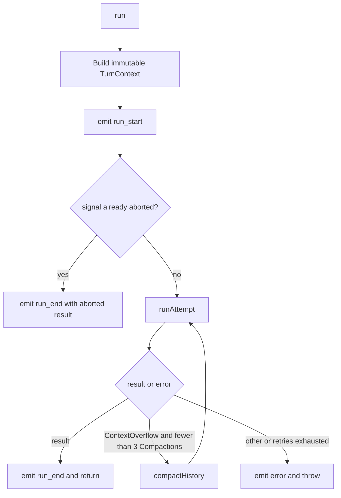

# Runner Execution

> Status: Current Authority
> Authority: Current implemented Runner behavior
> Verified: 2026-09-15
> Ownership: Turn loop, context budgeting, Compaction, Tool and Hook invocation, recovery, and Runner events
> Ownership key: runner-execution-and-context

## 1. Boundary

`src/core/runner/` is the Agent execution engine. For one Turn it consumes a resolved Provider-neutral invocation Port, immutable Tool and Hook projections, application Tool policy, and optional current-call approval capability. It joins [Session persistence](session.md), [Tool execution](tools.md), streaming Model invocation, context management, and steering into the conversation loop.

Runner does not load configuration, read environment variables, discover or register Units, select Providers, infer Model facts, manage Channel transport, or own root request-tree admission. Those responsibilities belong to [Runtime](runtime.md), [Model Resolution](model-resolution.md), and [Channels](channels.md).

## 2. Inputs and result

`RunParams` contains:

```text
sessionKey
message: string | ChatContentBlock[]
systemPrompt
turnId
requestId?                         # defaults to turnId
resolvedModel                      # Turn-bound identity, Port, facts, and limits
toolProjection
hookProjection
toolPolicy
approvalCapability?
maxLlmCalls?                       # defaults to 12
getSteeringMessages?
compaction?
originMessageId?
signal?
```

Runtime resolves these values before entry. Runner neither calls configuration loaders nor reads `process.env`. If no steering reader is supplied, the read path returns immediately with no messages.

`RunResult` contains final text, complete final Assistant blocks, stop reason, cumulative usage for completed Model calls, Tool-round count, and whether any Compaction retry occurred. Detailed Compaction statistics are events and persisted records rather than additional result fields.

## 3. Top-level lifecycle and recovery



`TurnContext` carries `sessionKey`, `turnId`, and the effective `requestId` explicitly through the call stack. Runner stores no mutable "current run" field, so nested Child execution and concurrent runs on one instance retain correct event correlation.

An already-aborted Turn still emits the `run_start`/`run_end` pair but performs no Session append or Model call. Context recovery may perform at most three Compactions; each retry reloads persisted history.

## 4. Attempt preflight

Each `runAttempt()` performs these steps before Model invocation:

1. If the active Session branch ends in an isolated `user` message from a failed attempt, `sanitizeSessionTail()` branches back to its parent and emits `session_tail_sanitized`.
2. `repairOrphanToolUses()` inspects persisted tail state and appends synthetic Tool Results for incomplete Tool Use/Result pairs.
3. Runner reloads the current Session branch and applies Layer 1 in-memory Tool Result pruning.
4. Layer 2 estimates System prompt, history, and the current prompt separately.
5. If Tool-only reduction can cover overflow, Layer 1.5 aggregate pruning runs; if summary Compaction is required, preflight throws before persisting the current message.
6. After preflight succeeds, Runner persists and appends the current user message.

This delayed append keeps the current prompt out of summary input and prevents preemptive retries from duplicating it. Overflow later in an attempt can leave a trailing user; `compactHistory()` and the next attempt sanitize it before loading and re-appending.

### 4.1 Tail sanitation

Only a trailing `user` record is removed from the active branch. The JSONL record remains on disk because `branch()` changes only the in-memory leaf. A trailing `toolResult` is not discarded: Tool side effects may already have happened, so Runner logs and preserves it.

### 4.2 Orphan Tool Use repair

Runner repairs two tail forms:

- an Assistant tail containing Tool Uses and no Tool Result batch;
- an Assistant/Tool Result tail whose result IDs cover only some of the preceding Tool Uses.

Missing IDs receive `[tool call interrupted; session recovered]`. The event source is `abort` when the Assistant has partial-abort metadata and `recovered` otherwise. Repair is best-effort: persistence failure is logged and does not block the new Turn, so a later attempt can retry. Clean tails are unchanged.

## 5. Model and Tool loop

```text
while the Model requested more Tools or steering is pending:
  check Abort before quota, steering injection, event emission, and invocation
  stop with max_llm_calls when the next call would exceed the quota
  persist pending steering after prior Tool Results
  emit llm_call and invoke resolvedModel.invocationPort.chatStream
  collect text deltas, canonical Tool Calls, stop reason, and usage
  persist the Assistant blocks

  for every Tool Call in Provider order:
    emit tool_use with ready input, or {} for invalid canonical input
    close invalid/unknown/denied/unavailable/aborted calls without implementation
    otherwise run interceptors, validate, apply policy/approval, and execute
    emit presentation tool_result and collect a correlated Tool Result block
    start after_tool_call Observer settlement

  persist the complete Tool Result batch
  settle all after_tool_call Observers, including on persistence failure
  if not aborted, prune the in-memory results and check the 90% threshold
  read steering for the next iteration
```

The quota counts actual Model calls, including a final call without Tools. The check occurs before each invocation, so Abort before a call consumes neither quota nor an `llm_call` event. Usage is summed from `message_end` records; if a later execution error occurs, `AgentExecutionFailure` carries usage already accumulated.

Steering is read after every completed loop iteration, not only Tool-producing ones. The reader is expected to use consume-and-clear semantics. Runner filters malformed entries and accepts only messages with `user` or `assistant` role plus a `content` property. Accepted steering is persisted and appended before the next Model call. Locally pending steering is dropped and logged on Abort.

## 6. Tool and Hook semantics

The Tool pipeline is described in [Tool Contract and Policy](tools.md). Runner guarantees one terminal correlated result per complete canonical Tool Call. If Abort occurs between multiple calls in one Assistant response, remaining implementations do not start and receive `not_executed` results; the whole batch is persisted.

| Hook | Timing | Execution | Authority |
|---|---|---|---|
| `before_tool_call` | Before validation and execution | Sequential in Snapshot order | May replace JSON input or deny |
| `after_tool_call` | After terminal result creation | Parallel, isolated, per-handler bounded settlement | Observer only |
| `before_compaction` | Before summary generation | Parallel, isolated, per-handler bounded settlement | Observer only |
| `after_compaction` | After Compaction record commit | Parallel, isolated, per-handler bounded settlement | Observer only |

Observer handlers receive local Abort signals. Their logical settlement is `fulfilled`, `rejected`, `aborted`, or `timed_out`; the default deadline is five seconds. Approval is a separate capability, not a Hook.

## 7. Context management

| Layer | Implementation | Model call? | Timing |
|---|---|:---:|---|
| 1 | `pruneToolResults` | no | Attempt start and after a new Tool Result batch |
| 1.5 | `pruneToolResultsAggregate` | no | When Layer 2 selects Tool-only truncation |
| 2 | `checkContextBudget` | no | Attempt preflight before current-message persistence |
| 3 | `compactMessages` | yes | Outer recovery after `ContextOverflowError` |

Layer 1 immutably caps each oversized Tool Result using a model-window-derived threshold, retaining configured head and tail text. The initial-history path emits `tool_result_pruned`; current-round pruning does not emit that event. Layer 1.5 proportionally reduces aggregate Tool Result content toward 30% of the model context character budget without going below each result's configured head-plus-tail floor.

Layer 2 estimates history, System prompt, current text or media blocks, structural overhead, and a safety margin. It routes to `fits`, `truncate_tool_results_only`, or `compact`, reserving configured output capacity.

A `ContextOverflowError` can come from preflight (`preemptive`), the inner 90% threshold (`overflow`), or a Provider-neutral invocation Port that canonicalizes a Provider context overflow. Other Provider failures are not treated as context overflow.

## 8. Compaction

`compactHistory()` sanitizes a trailing user, reloads history, runs bounded pre-Compaction Observers, emits `compaction_start`, and calls `compactMessages()` through the same resolved invocation Port and Model identity.

`compactMessages()` keeps the latest configured number of ordinary user Turns and summarizes older messages. Provider-facing Tool Result messages do not count as new user Turns, and split logic protects Tool Use/Result pairing. Summary serialization caps each Tool Result preview at 500 characters and replaces image bytes with media type and patch-based token estimates. Unknown or incomplete blocks are skipped. If summary invocation fails, Compaction uses a visible fallback summary; if no older messages can be compressed, it fails rather than writing an empty Compaction.

Runner computes `firstKeptEntryId`, appends a Compaction marker without deleting history, runs post-Compaction Observers, emits `compaction_end`, and updates Session token metadata. The next attempt reloads only the retained range and prepends the persisted summary.

## 9. Abort and errors

`signal` reaches Model invocation, Tool execution, Interceptors, and Observer settlement. Runner stops scheduling new work, but an in-flight third-party Tool controls how quickly it observes cancellation.

During streaming Abort, buffered text is flushed. A non-empty partial Assistant response is persisted with `abortMeta`; Abort before first content does not persist an empty Assistant record. Completed usage and Tool rounds remain in the aborted result. As a defensive fallback, any Error observed after the supplied signal has become aborted is treated as Abort and logged when its identity is not a recognized Abort error.

A Provider `stopReason: 'error'` is returned as a normal result with its reported usage. Thrown non-Abort, non-context failures become `AgentExecutionFailure`; top-level `run()` emits `error` and rethrows. `ContextOverflowError` retries as described above and is emitted/thrown only after retries are exhausted.

## 10. Events

`AgentEvent` is a discriminated union; fields vary by lifecycle rather than pretending every event has the same correlations.

Runner emits the Turn-scoped Run, stream, Tool, context, and recovery events. Runtime uses the same union for queue, user-message, and Subagent lifecycle events; their presence in the shared type does not transfer those lifecycle responsibilities to Runner.

| Family | Events and notable correlation |
|---|---|
| Run | `run_start`, `run_end`, `error` carry request, Session, and Turn identities |
| Queue | `request_end` closes a queued request that never started and carries request identity only |
| Input | `user_message` uses its own message identity and delivery mode rather than a Turn identity |
| Stream and Tools | `text_delta`, `llm_call`, `tool_use`, `tool_result` carry Session and Turn |
| Context | `tool_result_pruned`, `compaction_start`, `compaction_end`, `session_tail_sanitized`, `orphan_tool_results_repaired` |
| Subagent | `subagent_start` and `subagent_end` carry request/run/tree/parent correlation and terminal usage |

`compaction_start.estimatedTokens` is an estimate; committed before/after statistics arrive on `compaction_end`. `tool_result` remains the presentation event shape even though internal execution uses canonical outcomes.

## 11. Evidence

| Kind | Evidence |
|---|---|
| Source | [AgentRunner.ts](../../src/core/runner/AgentRunner.ts), [types.ts](../../src/core/runner/types.ts), [errors.ts](../../src/core/runner/errors.ts), [context-budget.ts](../../src/core/runner/context/context-budget.ts), [tool-result-pruning.ts](../../src/core/runner/context/tool-result-pruning.ts), [compaction.ts](../../src/core/runner/context/compaction.ts), [hooks/runner.ts](../../src/core/runner/hooks/runner.ts) |
| Tests | [AgentRunner.test.ts](../../src/core/runner/AgentRunner.test.ts), [AgentRunner.tool-pipeline.test.ts](../../src/core/runner/AgentRunner.tool-pipeline.test.ts), [context-budget.test.ts](../../src/core/runner/context/context-budget.test.ts), [tool-result-pruning.test.ts](../../src/core/runner/context/tool-result-pruning.test.ts), [compaction.test.ts](../../src/core/runner/context/compaction.test.ts), [hooks/runner.test.ts](../../src/core/runner/hooks/runner.test.ts) |
| Controlling authority | [ADR-001: Tool Result Closure and Recovery](../decisions/adr-001-tool-result-closure-and-recovery.md), [ADR-002: Context Budgeting and Compaction Recovery](../decisions/adr-002-context-budgeting-and-compaction-recovery.md), [ADR-004: Provider Model Identity and Facts Ownership](../decisions/adr-004-provider-model-identity-and-facts-ownership.md), [Tools and Hooks](../specifications/tools-and-hooks.md), [Runner Turn Flow](../specifications/runner-turn-flow.md), [Abort](../specifications/abort.md) |
