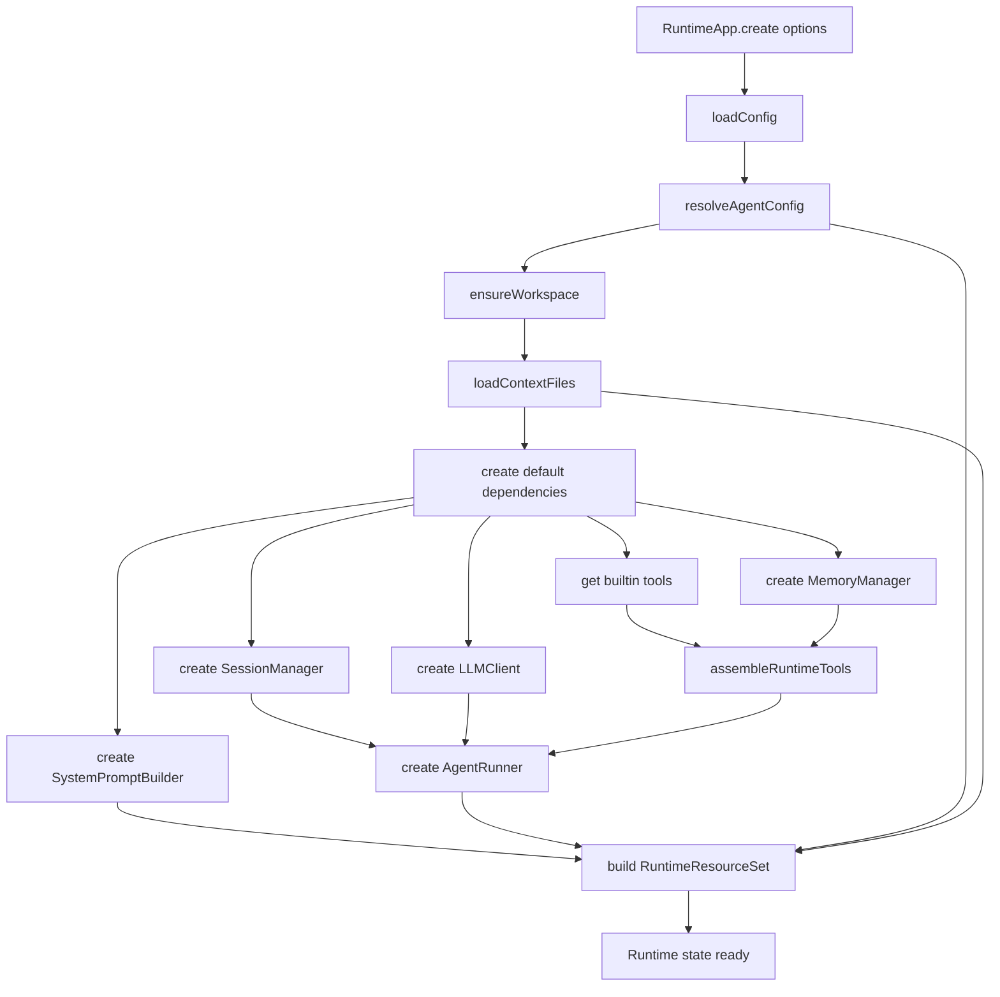
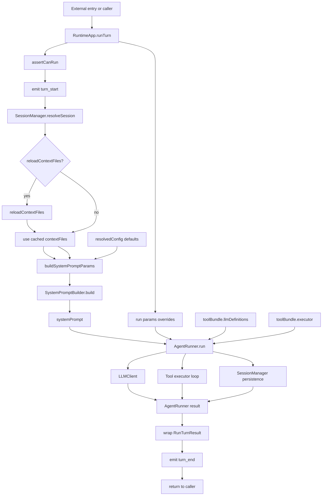
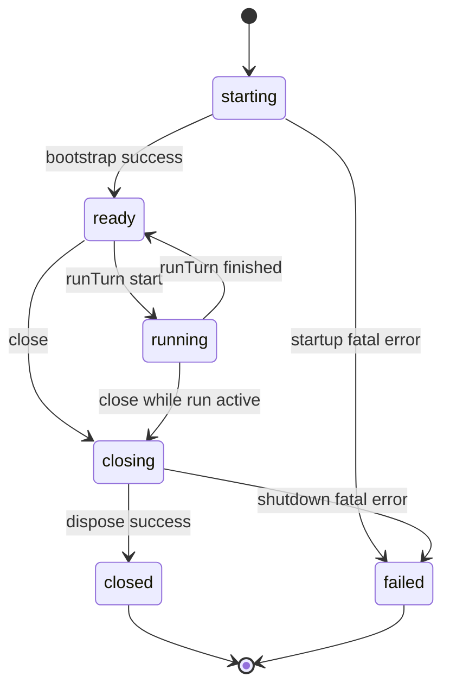

# Runtime / App Assembly 模块设计文档

> 创建日期：2026-04-09  
> 参考：现有模块设计文档，尤其是 [agent-runner-design.md](./agent-runner-design.md)、[config-design.md](./config-design.md)、[tools-design.md](./tools-design.md)、[memory-design.md](./memory-design.md)

---

## 1. 概述

Runtime / App Assembly 模块是应用装配层，负责把已经存在的底层模块真正组装成一个可运行、可复用、可关闭的 Agent 应用实例。

当前项目里，`workspace`、`prompt-builder`、`session`、`llm-client`、`tools`、`memory`、`config`、`agent-runner` 这些底层模块都已经存在，但它们仍主要以“库模块”的方式存在。真正把这些模块串起来的逻辑，目前仍分散在集成脚本中，例如 `scripts/test-agent-runner.ts`、`scripts/test-tools-use.ts`。

这意味着项目已经具备了核心能力，但缺少一个正式的运行时入口模块，来统一回答下面这些问题：

- 应用启动时应该先初始化哪些组件；
- config 如何真正驱动运行时实例化；
- memory tools 和 builtin tools 如何拼成统一工具集；
- 一次用户输入如何从高层入口流转到 `AgentRunner.run()`；
- 哪些资源是全局复用的，哪些资源是每轮重建的；
- 应用关闭时如何释放资源。

Runtime / App Assembly 模块的目标就是补上这层空缺。

**职责：**

- 统一加载并解析运行时配置；
- 初始化 workspace 与上下文文件；
- 创建并持有 `SessionManager`、`MemoryManager`、`LLMClient`、`SystemPromptBuilder`、`AgentRunner` 等运行时依赖；
- 组装 builtin tools 与 memory tools，生成统一的 tool executor 和 tool definitions；
- 对外暴露高层应用接口，例如 `create()`、`runTurn()`、`reloadContextFiles()`、`close()`；
- 统一管理应用启动、单轮运行、资源释放这三类生命周期。

**不属于 Runtime / App Assembly 的职责：**

- tool use loop 的内部执行细节，属于 `agent-runner`；
- 单个工具的实现，属于 `tools` 或 `memory`；
- system prompt / user prompt 的具体 section 构建逻辑，属于 `prompt-builder`；
- compaction、model fallback、approval gate、session queue 等增强能力，本期先不纳入；
- CLI、HTTP API、IDE adapter 等外部入口形态，本模块只提供应用层核心接口。

---

## 2. 设计原则

| 原则 | 说明 |
|---|---|
| 显式装配 | 所有高层依赖只在一个地方创建和连接，不把初始化逻辑散落到脚本或入口层 |
| 不复制底层职责 | Runtime 只负责装配、运行与释放，不重新实现 tools、prompt、session、LLM 调用细节 |
| 配置驱动 | 运行时行为优先由 config 决定，单轮参数只做局部覆盖 |
| 单一真实工具面 | `Tool[]`、executor、LLM-facing definitions、prompt-facing definitions 必须来自同一份来源 |
| 可降级 | memory 等可选能力初始化失败时允许降级，不让整个 runtime 无谓失败 |
| 生命周期清晰 | 启动、运行、关闭三段边界明确，关闭操作幂等 |

### 2.1 配置访问边界

除 `config` 模块本身、`runtime` 模块，以及少数以“配置管理 / 外层入口”为职责的模块外，其余领域模块原则上不应直接访问 config。

这里的“直接访问 config”包括：

- 直接调用 `loadConfig()`；
- 直接调用 `resolveAgentConfig()`；
- 通过 `process.env` 绕过 Runtime 读取关键运行配置；
- 在领域模块中以完整 `AgentDefaults` 作为常规输入接口。

Runtime 层应作为唯一的运行时装配根，负责：

- 加载和解析配置；
- 将全局 config 映射为各模块所需的最小配置子集；
- 以构造参数、工厂参数或 run params 的形式，把这些配置显式传给底层模块。

因此，底层模块的推荐形态应是：

- 模块定义自己的局部 options interface；
- 模块只接收自己真正需要的最小配置；
- 模块不依赖 config loader，也不反向查询全局配置。

本项目中，以下模块原则上不应直接依赖 config loader：

- `agent-runner`
- `llm-client`
- `session`
- `memory`
- `workspace`
- `prompt-builder`
- `tools`

允许直接访问 config 的范围仅限于：

- `config` 模块本身；
- `runtime` 模块；
- 未来的 CLI、HTTP API、IDE adapter 等外层入口模块；
- 配置编辑、配置校验、配置迁移、配置诊断这类以 config 为主职责的工具模块。

这条边界的目的不是机械限制 import，而是防止全局配置结构向下层模块渗透，确保 Runtime 真正承担 composition root 的职责。

---

## 3. 与现有模块的关系

Runtime / App Assembly 位于所有底层模块之上，但位于外部入口层之下。

```
External Entry
  ├── future CLI
  ├── future HTTP API
  └── future IDE adapter
            │
            ▼
      RuntimeApp
  create / runTurn / reload / close
            │
            ▼
     Runtime Resources
  config / workspace / session / memory /
  prompt-builder / tools / llm-client / agent-runner
```

这里最重要的边界是：

- `AgentRunner` 负责“一次对话轮次如何执行”；
- `RuntimeApp` 负责“整个应用如何启动、复用资源、运行和关闭”。

> Note：这里的重点不是复用某个现成系统的入口结构，而是为当前项目建立一个明确的 composition root。Runtime 只保留我们当前真正需要的边界：统一装配、显式依赖注入、清晰生命周期，以及对工具面和上下文装载的集中控制。

---

## 4. 目录结构

建议新增目录：

```
src/
└── runtime/
    ├── index.ts
    ├── types.ts
    ├── RuntimeApp.ts
    ├── bootstrap.ts
    ├── tool-registry.ts
    └── prompt-factory.ts
```

### 文件职责

| 文件 | 职责 |
|---|---|
| `index.ts` | 公共导出入口 |
| `types.ts` | Runtime 层自己的顶层类型 |
| `RuntimeApp.ts` | 主类，负责生命周期与高层 API |
| `bootstrap.ts` | 启动阶段的资源装配 |
| `tool-registry.ts` | builtin tools 与 memory tools 的统一装配 |
| `prompt-factory.ts` | 把 config、contextFiles、tools 转成 prompt-builder 所需参数 |

首版公共 API 建议只暴露：

```typescript
export { RuntimeApp } from './RuntimeApp.js';
export type {
  RuntimeAppOptions,
  RuntimeDependencies,
  RunTurnParams,
  RunTurnResult,
  RuntimeEvent,
  RuntimeToolBundle,
} from './types.js';
```

这样可以保证 Runtime 层是稳定入口，而不是对外泄漏一组零散 manager。

---

## 5. 整体架构

Runtime / App Assembly 的最小可实现结构如下：

```typescript
import type { AppConfig, AgentDefaults, DeepPartial } from '../config/types.js';
import type { ContextFile } from '../workspace/types.js';
import type {
  LLMClient,
  ChatToolDefinition,
  TokenUsage,
  ChatContentBlock,
} from '../llm-client/types.js';
import type { Tool, ToolExecutor } from '../tools/types.js';
import type { ToolDefinition as PromptToolDefinition } from '../prompt-builder/types/builder.js';
import type { AgentRunner } from '../agent-runner/AgentRunner.js';
import type { SessionManager } from '../session/SessionManager.js';
import type { MemoryManager } from '../memory/MemoryManager.js';
import type { SystemPromptBuilder } from '../prompt-builder/system/SystemPromptBuilder.js';

export interface RuntimeToolBundle {
  tools: Tool[];
  executor: ToolExecutor;
  llmDefinitions: ChatToolDefinition[];
  promptDefinitions: PromptToolDefinition[];
}

export interface RuntimeResourceSet {
  appConfig: AppConfig;
  resolvedConfig: AgentDefaults;
  workspaceDir: string;
  sessionManager: SessionManager;
  llmClient: LLMClient;
  memoryManager: MemoryManager | null;
  systemPromptBuilder: SystemPromptBuilder;
  toolBundle: RuntimeToolBundle;
  contextFiles: ContextFile[];
  agentRunner: AgentRunner;
}
```

设计意图：

- 所有高层依赖只在一个地方装配；
- tool executor 与 tool definitions 永远对应同一份 `Tool[]`；
- contextFiles 作为运行时缓存持有，而不是每个入口各自加载；
- `RuntimeApp` 本身不实现 tool loop，只组合资源并转调 `AgentRunner`。

---

## 6. 类型系统

Runtime 层不重复定义底层模块已有类型，只定义应用装配层自己的高层接口。

### 6.1 RuntimeAppOptions

```typescript
export interface RuntimeAppOptions {
  workspaceDir: string;
  agentId?: string;
  envOverrides?: DeepPartial<AgentDefaults>;
  cliOverrides?: DeepPartial<AgentDefaults>;
  dependencies?: Partial<RuntimeDependencies>;
  onEvent?: (event: RuntimeEvent) => void;
}
```

含义如下：

- `workspaceDir` 是唯一必填项；
- `agentId` 预留给后续 per-agent 配置；
- `envOverrides` 和 `cliOverrides` 直接复用 config 模块的覆盖模型；
- `dependencies` 用于测试替换依赖；
- `onEvent` 用于暴露 Runtime 层事件。

### 6.2 RuntimeDependencies

```typescript
export interface RuntimeDependencies {
  createLLMClient(config: AgentDefaults): LLMClient;
  createSessionManager(workspaceDir: string): SessionManager;
  createMemoryManager(
    workspaceDir: string,
    config: AgentDefaults,
  ): Promise<MemoryManager | null>;
  createSystemPromptBuilder(): SystemPromptBuilder;
  createAgentRunner(params: {
    llmClient: LLMClient;
    sessionManager: SessionManager;
    toolExecutor: ToolExecutor;
    onEvent?: RuntimeAppOptions['onEvent'];
  }): AgentRunner;
  getBuiltinTools(config: AgentDefaults): Tool[];
}
```

这个接口的目标是显式依赖注入，而不是把 RuntimeApp 写死成只能通过集成脚本验证。

### 6.3 RunTurnParams

```typescript
export interface RunTurnParams {
  sessionKey: string;
  message: string;
  model?: string;
  maxTokens?: number;
  maxToolRounds?: number;
  maxFollowUpRounds?: number;
  promptMode?: AgentDefaults['prompt']['mode'];
  safetyLevel?: AgentDefaults['prompt']['safetyLevel'];
  reloadContextFiles?: boolean;
}
```

设计原则：

- 绝大多数字段默认继承 resolved config；
- 单轮允许局部覆盖；
- `reloadContextFiles` 是一个显式动作，不默认每轮触发。

### 6.4 RunTurnResult

```typescript
export interface RunTurnResult {
  sessionKey: string;
  text: string;
  content: ChatContentBlock[];
  stopReason: string;
  usage: TokenUsage;
  toolRounds: number;
}
```

本质上是对 `AgentRunner` 结果做轻量包装，保留应用入口更关心的信息。

### 6.5 生命周期、错误与事件

```typescript
export type RuntimeLifecyclePhase =
  | 'starting'
  | 'ready'
  | 'running'
  | 'closing'
  | 'closed'
  | 'failed';

export interface RuntimeLifecycleState {
  phase: RuntimeLifecyclePhase;
  startedAt: number;
  readyAt?: number;
  closedAt?: number;
  lastRunStartedAt?: number;
  lastRunEndedAt?: number;
  activeRunCount: number;
  contextVersion: number;
  lastError?: {
    message: string;
    at: number;
    scope: 'startup' | 'run' | 'reload' | 'shutdown';
  };
}

export type RuntimeErrorScope = 'startup' | 'run' | 'reload' | 'shutdown';
export type RuntimeErrorSeverity = 'warning' | 'recoverable' | 'fatal';

export interface RuntimeErrorInfo {
  scope: RuntimeErrorScope;
  severity: RuntimeErrorSeverity;
  code:
    | 'CONFIG_INVALID'
    | 'MODEL_MISSING'
    | 'WORKSPACE_INIT_FAILED'
    | 'CONTEXT_LOAD_FAILED'
    | 'MEMORY_INIT_FAILED'
    | 'TOOL_ASSEMBLY_FAILED'
    | 'RUN_REJECTED'
    | 'RUN_FAILED'
    | 'SHUTDOWN_FAILED';
  message: string;
  cause?: Error;
}

export interface RuntimeShutdownReport {
  reason?: string;
  startedAt: number;
  finishedAt: number;
  completed: string[];
  failed: Array<{ resource: string; message: string }>;
}

export type RuntimeEvent =
  | {
      type: 'app_start';
      workspaceDir: string;
    }
  | {
      type: 'app_ready';
      workspaceDir: string;
      contextVersion: number;
      toolNames: string[];
      memoryEnabled: boolean;
    }
  | {
      type: 'turn_start';
      sessionKey: string;
      contextVersion: number;
    }
  | {
      type: 'turn_end';
      sessionKey: string;
      result: RunTurnResult;
    }
  | {
      type: 'context_reload';
      contextVersion: number;
      fileCount: number;
    }
  | {
      type: 'warning';
      info: RuntimeErrorInfo;
    }
  | {
      type: 'error';
      info: RuntimeErrorInfo;
    }
  | {
      type: 'shutdown_start';
      reason?: string;
    }
  | {
      type: 'shutdown_end';
      report: RuntimeShutdownReport;
    };
```

Runtime 层只暴露应用装配和生命周期需要的最小事件面，不引入更细的执行事件总线。

---

## 7. 启动流程

Runtime 的启动入口建议固定为 `bootstrapRuntime()`，由它把 config、workspace、memory、tools、runner 串起来。



```typescript
export async function bootstrapRuntime(
  options: RuntimeAppOptions,
): Promise<RuntimeBootstrapResult> {
  const appConfig = loadConfig({ workspaceDir: options.workspaceDir });
  const resolvedConfig = resolveAgentConfig(appConfig, {
    agentId: options.agentId,
    envOverrides: options.envOverrides,
    cliOverrides: options.cliOverrides,
  });

  await ensureWorkspace(options.workspaceDir);

  const contextFiles = await loadContextFiles(options.workspaceDir, {
    mode: resolvedConfig.prompt.mode === 'none' ? 'full' : resolvedConfig.prompt.mode,
    maxFileChars: resolvedConfig.workspace.maxFileChars,
    maxTotalChars: resolvedConfig.workspace.maxTotalChars,
  });

  const deps = createDefaultRuntimeDependencies(options.dependencies);

  const sessionManager = deps.createSessionManager(options.workspaceDir);
  const llmClient = deps.createLLMClient(resolvedConfig);
  const memoryManager = await deps.createMemoryManager(options.workspaceDir, resolvedConfig);
  const systemPromptBuilder = deps.createSystemPromptBuilder();

  const toolBundle = assembleRuntimeTools({
    config: resolvedConfig,
    builtinTools: deps.getBuiltinTools(resolvedConfig),
    memoryManager,
  });

  const agentRunner = deps.createAgentRunner({
    llmClient,
    sessionManager,
    toolExecutor: toolBundle.executor,
    onEvent: options.onEvent,
  });

  return {
    resources: {
      appConfig,
      resolvedConfig,
      workspaceDir: options.workspaceDir,
      sessionManager,
      llmClient,
      memoryManager,
      systemPromptBuilder,
      toolBundle,
      contextFiles,
      agentRunner,
    },
    state: {
      phase: 'ready',
      startedAt: Date.now(),
      readyAt: Date.now(),
      activeRunCount: 0,
      contextVersion: 1,
    },
  };
}
```

### 7.1 启动时创建一次的资源

以下资源应在 `create()` 时创建，并贯穿整个应用生命周期：

- resolved config；
- `SessionManager`；
- `LLMClient`；
- `MemoryManager`；
- tool bundle；
- `SystemPromptBuilder`；
- `AgentRunner`。

### 7.2 启动时加载、运行时可刷新的数据

以下数据建议首次加载后缓存，但支持显式重载：

- `contextFiles`。

这比“每轮都重新读磁盘”更稳，也比“永不刷新”更实用。

### 7.3 Memory 初始化策略

P0 建议采用降级而不是强依赖：

- `memory.enabled = false`：不创建 `MemoryManager`；
- `memory.enabled = true` 且初始化成功：注入 memory tools；
- `memory.enabled = true` 但初始化失败：发 `warning`，继续启动，但不注入 memory tools。

这个策略的重点是把 memory 视为可选能力，避免它成为启动硬依赖。

---

## 8. 单轮运行流程

RuntimeApp 的核心高层 API 是 `runTurn()`。

P0 阶段，`message` 仍直接传给 `AgentRunner`；`UserPromptBuilder` 先不强行接入，因为当前 `AgentRunner` 的输入还是纯文本。



```typescript
export class RuntimeApp {
  async runTurn(params: RunTurnParams): Promise<RunTurnResult> {
    this.assertCanRun();
    this.emit({
      type: 'turn_start',
      sessionKey: params.sessionKey,
      contextVersion: this.state.contextVersion,
    });

    await this.resources.sessionManager.resolveSession(params.sessionKey);

    if (params.reloadContextFiles) {
      await this.reloadContextFiles();
    }

    const systemPrompt = this.resources.systemPromptBuilder.build(
      buildSystemPromptParams({
        config: this.resources.resolvedConfig,
        contextFiles: this.resources.contextFiles,
        promptDefinitions: this.resources.toolBundle.promptDefinitions,
        overrides: params,
      }),
    );

    const result = await this.resources.agentRunner.run({
      sessionKey: params.sessionKey,
      message: params.message,
      model: params.model ?? this.requireDefaultModel(),
      systemPrompt,
      tools: this.resources.toolBundle.llmDefinitions,
      maxTokens: params.maxTokens ?? this.resources.resolvedConfig.llm.maxTokens,
      maxToolRounds:
        params.maxToolRounds ?? this.resources.resolvedConfig.runner.maxToolRounds,
      maxFollowUpRounds:
        params.maxFollowUpRounds ?? this.resources.resolvedConfig.runner.maxFollowUpRounds,
    });

    const wrapped: RunTurnResult = {
      sessionKey: params.sessionKey,
      text: result.text,
      content: result.content,
      stopReason: result.stopReason,
      usage: result.usage,
      toolRounds: result.toolRounds,
    };

    this.emit({
      type: 'turn_end',
      sessionKey: params.sessionKey,
      result: wrapped,
    });

    return wrapped;
  }
}
```

### 8.1 Session 规则

`runTurn()` 内部自动调用 `resolveSession(sessionKey)`：

- 已存在则复用；
- 不存在则自动创建。

这样外部入口不需要自己先创建 session。

### 8.2 模型优先级

模型的解析顺序固定为：

```
runTurn.model
> resolvedConfig.llm.model
> throw explicit error
```

Runtime 层不偷偷写死默认模型，默认值必须由 config 明确表达。

### 8.3 运行参数优先级

其余参数统一遵循：

```
runTurn override
> resolved config
> 模块默认值
```

---

## 9. 工具装配策略

工具装配必须只有一个入口，否则后续一定会出现：

- executor 用的是一套 tools；
- prompt 里列的是另一套 tools；
- `llmDefinitions` 又来自第三套来源。

建议统一为 `assembleRuntimeTools()`：

```typescript
export interface AssembleRuntimeToolsParams {
  config: AgentDefaults;
  builtinTools: Tool[];
  memoryManager: MemoryManager | null;
}

export function assembleRuntimeTools(
  params: AssembleRuntimeToolsParams,
): RuntimeToolBundle {
  const tools: Tool[] = [...params.builtinTools];

  if (params.memoryManager) {
    tools.push(...createMemoryTools(params.memoryManager));
  }

  return {
    tools,
    executor: createToolExecutor(tools),
    llmDefinitions: toLlmToolDefinitions(tools),
    promptDefinitions: toPromptToolDefinitions(tools),
  };
}
```

### 9.1 builtin tools 的来源

P0 阶段不做动态发现，不做复杂 allowlist，直接显式组装现有 builtin tools：

```typescript
export function getDefaultBuiltinTools(_config: AgentDefaults): Tool[] {
  return [
    listDirTool,
    readFileTool,
    fileSearchTool,
    grepSearchTool,
    applyPatchTool,
    writeFileTool,
    editFileTool,
    webFetchTool,
    execTool,
    processTool,
  ];
}
```

### 9.2 memory tools 的注入条件

memory 工具只在 `memoryManager` 存在时注入：

- `memory_search`；
- `memory_get`；
- `memory_write`。

### 9.3 命名统一

Runtime 层应以“真实工具实现名”为唯一标准，不再引入别名。当前建议统一使用：

- `memory_search`；
- `memory_get`；
- `memory_write`。

如果 prompt-builder 或文档里仍出现 `search_memory` 这类历史命名，应在后续统一清理，但 Runtime 设计本身不为兼容历史命名增加额外抽象。

### 9.4 工具定义转换

当前有一个必须明确的适配点：

- `tools` / `llm-client` 使用 `input_schema`；
- `prompt-builder` 使用 `parameters`。

Runtime 层应该成为这个差异的唯一转换点：

```typescript
export function toPromptToolDefinitions(tools: Tool[]): PromptToolDefinition[] {
  return tools.map((tool) => ({
    name: tool.name,
    description: tool.description,
    parameters: tool.inputSchema,
  }));
}

export function toLlmToolDefinitions(tools: Tool[]): ChatToolDefinition[] {
  return tools.map((tool) => ({
    name: tool.name,
    description: tool.description,
    input_schema: tool.inputSchema,
  }));
}
```

不要把这类转换散落到 `RuntimeApp`、prompt-builder 或脚本里。

---

## 10. 生命周期管理

RuntimeApp 应维护显式生命周期，而不是靠零散布尔值控制。

P0 的状态转换规则建议固定如下：

- `starting -> ready`：启动成功；
- `starting -> failed`：启动阶段发生 fatal 错误；
- `ready -> running`：开始执行 `runTurn()`；
- `running -> ready`：本轮结束；
- `ready -> closing`：开始关闭；
- `running -> closing`：允许，但必须先阻止新请求，再等待当前 run 收尾；
- `closing -> closed`：资源释放完成；
- `closing -> failed`：关闭阶段出现不可恢复异常；
- `closed`：终态，不允许再次 `runTurn()`；
- `failed`：终态，建议重新 create，不再复用。



建议 `RuntimeApp` 内部实现以下守卫：

```typescript
private assertCanRun(): void;
private assertCanReload(): void;
private assertNotClosed(): void;
private setPhase(next: RuntimeLifecyclePhase): void;
private recordError(scope: RuntimeErrorScope, error: Error): void;
```

这里刻意把应用级状态和单轮运行状态分开，避免状态语义混杂。

---

## 11. 资源释放与关闭语义

关闭逻辑必须由 RuntimeApp 统一驱动，而不是散落在各模块里。

建议的关闭顺序：

```
1. 阻止新 runTurn 进入
2. 等待当前 runTurn 收尾
3. 停止未来可能新增的后台观察器
4. 关闭 MemoryManager
5. 清理 Runtime 层缓存引用
6. 标记 closed
```

建议定义最小的可释放资源接口：

```typescript
export interface RuntimeDisposable {
  close(): void | Promise<void>;
}
```

内部释放流程建议使用 `Promise.allSettled`，而不是 `Promise.all`：

```typescript
private async disposeResources(): Promise<void> {
  const tasks: Array<Promise<void>> = [];

  if (this.resources.memoryManager) {
    tasks.push(Promise.resolve(this.resources.memoryManager.close()));
  }

  await Promise.allSettled(tasks);
}
```

原因很直接：关闭阶段的目标是尽可能释放所有资源，而不是因为某个 `close()` 抛错就中断剩余清理。

关闭的语义建议定成：

- `close()` 必须幂等；
- `close()` 后不能再 `runTurn()`；
- `close()` 允许在 `running` 阶段触发，但要先等当前轮次结束；
- 局部资源释放失败应记录 warning，但不阻止其它资源关闭。

---

## 12. 错误处理与降级策略

建议按 scope 和 severity 统一处理，而不是只分 `fatal / non-fatal`。

建议统一一套错误分类函数：

```typescript
export function classifyRuntimeError(
  scope: RuntimeErrorScope,
  error: unknown,
): RuntimeErrorInfo;
```

### 12.1 startup 阶段

- config 文件损坏：`warning`，降级为默认配置；
- `llm.apiKey` 缺失且 `LLMClient` 无法构造：`fatal`，`create()` 失败；
- `ensureWorkspace()` 失败：`fatal`，`create()` 失败；
- memory 初始化失败：`recoverable`，禁用 memory tools，继续启动；
- tool 装配失败：`fatal`，`create()` 失败。

### 12.2 run 阶段

- 当前 phase 不是 `ready`：`recoverable`，拒绝本轮执行；
- 未提供 model，且 config 里也没有默认 model：`recoverable`，本轮失败，不销毁 app；
- `AgentRunner.run()` 抛错：`recoverable`，记录错误，本轮失败，phase 回到 `ready`；
- tool 执行错误：由 tool layer 处理为 `ToolResult.isError`，不升级为 app failure。

### 12.3 reload 阶段

- `reloadContextFiles()` 失败：`recoverable`，保留旧 `contextFiles`；
- 部分文件读取失败：`warning`，跳过失败文件。

### 12.4 shutdown 阶段

- 单个资源 `close()` 失败：`warning` 或 `recoverable`，继续释放其它资源；
- 关闭编排本身失败：`fatal`，phase 可进入 `failed`。

这里的重点是把运行失败限制在单次 turn 内，而不是让一次 run 的失败自动污染整个应用生命周期。

---

## 13. 可观测性与运行时事件

Runtime 层需要一套最小事件面，用于调试、测试和后续 CLI / API 接入。

建议统一一个内部发射入口：

```typescript
private emit(event: RuntimeEvent): void {
  this.onEvent?.(event);
}
```

推荐触发时机：

- `create()` 开始：`app_start`；
- `create()` 成功：`app_ready`；
- memory 降级：`warning`；
- reload 成功：`context_reload`；
- reload 失败：`warning`；
- `runTurn()` 开始：`turn_start`；
- `runTurn()` 成功：`turn_end`；
- `runTurn()` 失败：`error`；
- `close()` 开始：`shutdown_start`；
- `close()` 结束：`shutdown_end`。

Runtime 事件和 AgentRunner 事件保持分层：前者负责应用装配与生命周期，后者负责单次执行细节。

---

## 14. 测试策略

Runtime 层测试建议分 4 层，而不是只分单元和集成。

### 14.1 纯函数测试

对象：

- tool definition 转换函数；
- prompt-factory；
- error classifier；
- lifecycle guard。

覆盖点：

- `Tool[]` 正确转换为 `llmDefinitions`；
- `Tool[]` 正确转换为 `promptDefinitions`；
- `memoryManager = null` 时不注入 memory tools；
- `promptMode` / `safetyLevel` override 正确覆盖 config 默认值；
- `classifyRuntimeError()` 在不同 scope 下返回正确 code 和 severity。

### 14.2 RuntimeApp 单元测试

通过依赖注入替换：

- `LLMClient`；
- `SessionManager`；
- `MemoryManager`；
- `AgentRunner`。

覆盖点：

- `create()` 调用顺序正确；
- `runTurn()` 自动 `resolveSession()`；
- model 优先级正确；
- `reloadContextFiles()` 成功后 `contextVersion` 递增；
- `close()` 幂等；
- `close()` 后 `runTurn()` 被拒绝；
- memory 初始化失败时 app 仍可 ready，但 memory tools 不存在。

### 14.3 轻量集成测试

使用真实的：

- config；
- workspace；
- session；
- tool registry。

替换掉真实 LLM 调用。

覆盖点：

- 从真实 `workspaceDir` 启动 `RuntimeApp`；
- `ensureWorkspace()` 和 `loadContextFiles()` 真实工作；
- `SessionManager` 正确创建 transcript；
- memory enabled / disabled 两种启动路径；
- `runTurn()` 能正确把 system prompt、tools 和 message 传给 `AgentRunner`。

### 14.4 烟雾脚本

保留现有 scripts，但只作为：

- 本地联调；
- 手工演示；
- 真实环境 smoke check。

它们不再承担主回归保障。

---

## 15. P0 实现边界

P0 目标不是做完整平台，而是把已有底层能力收口成正式运行时入口。

### 15.1 P0 必须包含

- `RuntimeApp.create()`；
- `RuntimeApp.runTurn()`；
- `RuntimeApp.reloadContextFiles()`；
- `RuntimeApp.close()`；
- 显式生命周期状态机；
- config 驱动装配；
- memory 启停与降级逻辑；
- 统一工具装配；
- 基本 `RuntimeEvent` 发射；
- 单元测试和轻量集成测试。

### 15.2 P0 明确不包含

- session queue；
- parallel run；
- compaction；
- model fallback；
- approval gate；
- sub-agent runtime；
- HTTP server；
- CLI UI；
- process registry 生命周期扩展；
- runner 事件与 runtime 事件的统一总线。

---

## 16. 验收标准

### 16.1 功能验收

- 提供 `workspaceDir` 即可成功 `create()` 一个 `RuntimeApp`；
- 不需要手工 `createSession()` 即可 `runTurn()`；
- system prompt 由 Runtime 层自动组装；
- tools 由 Runtime 层自动注入；
- `close()` 后不能再次 `runTurn()`。

### 16.2 错误验收

- memory 初始化失败不阻止 app ready；
- `llm.model` 缺失时 `runTurn()` 返回明确错误；
- reload 失败不破坏现有 `contextFiles`；
- `close()` 多次不报错。

### 16.3 结构验收

- 初始化逻辑不再散落在测试脚本；
- tool definitions 与 executor 由同一装配点生成；
- Runtime 层不实现 tool loop；
- Runtime 层不复制 config 默认值。

### 16.4 测试验收

- 有纯函数测试；
- 有 `RuntimeApp` 单元测试；
- 有轻量集成测试；
- scripts 保留，但不再承担主回归职责。

---

## 17. 总结

Runtime / App Assembly 模块不是替代 `AgentRunner`，而是为整个项目建立正式的应用装配根。

它解决的核心问题是：

- 底层模块已具备，但没有正式应用入口；
- config 已存在，但没有形成运行时映射中心；
- 工具和 memory 能力已存在，但没有统一能力面；
- 生命周期管理缺乏归属。

如果没有这层，项目会持续停留在“模块集合 + 集成脚本”的状态；有了这层，后续 CLI、API、IDE 接入才有稳定基础。