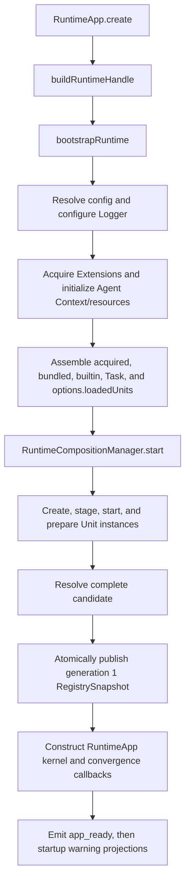
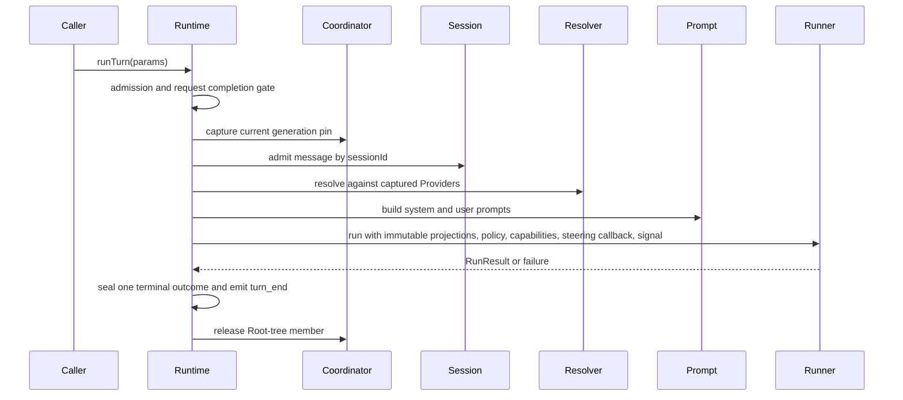

# Runtime

> Status: Current Authority
> Authority: Current implemented Runtime behavior
> Verified: 2026-09-18
> Ownership: Runtime composition, publication, generations, Turn orchestration, queues, routing, Fanout, Abort, Shutdown, and Subagent Parent/Child lifecycle
> Ownership key: runtime-composition-and-lifecycle

---

## 1. Purpose and ownership

`src/runtime/` is the application and Composition layer. It turns independently implemented Core, Platform, Builtin, and External Extension components into a running Agent.

Runtime owns:

- bootstrap coordination and narrow configuration projection;
- the loaded Runtime Unit catalog and Unit-instance lifecycle;
- Registry candidate staging, validation, immutable Snapshot publication, generation capture, retirement, and reload admission;
- per-session Turn admission and queueing;
- origin routing, Agent-event Fanout, interactions, Abort, and bounded Shutdown;
- tracked Subagent Parent/Child membership and inherited generation/route lifecycle.

Runtime delegates the internal Turn algorithm to [Runner](runner.md). Runner owns model calls, Tool/Hook execution, context budgeting, Compaction, and the point at which steering messages are consumed. Runtime supplies an already resolved model, immutable generation projections, prompts, policy, approval capability, steering callback, and Abort signal; it does not execute the Runner loop.

Runtime also does not discover or load Extension files. [Extensions](extensions.md) owns install-root discovery, validated scoped configuration, controlled entry loading, and production of not-yet-created `LoadedRuntimeUnit` values. Runtime owns every later create, start, registration staging, publication, retirement, and stop transition.

## 2. Current source layout

```text
src/runtime/
├── RuntimeApp.ts
├── bootstrap.ts
├── runtime-builder.ts
├── runtime-composition.ts
├── runtime-composition-manager.ts
├── composition-coordinator.ts
├── reload-coordinator.ts
├── registry-builder.ts
├── runtime-unit.ts
├── runtime-lifecycle.ts
├── runtime-deadline.ts
├── channel-lifecycle.ts
├── request-completion-gate.ts
├── subagent-orchestration.ts
├── prompt-factory.ts
├── queue-types.ts
├── tool-approval-policy.ts
├── turn-interaction/
│   └── TurnInteractionManager.ts
└── types.ts

src/builtins/
├── providers/anthropic/runtime-unit.ts
├── channels/{cli,websocket}/runtime-unit.ts
└── tools/{environment,memory,task}/contribution.ts
```

The converged integration layout keeps concrete builtin capabilities and their Host entries under `src/builtins/`, Runtime-owned interaction state under `src/runtime/turn-interaction/`, generic Host acquisition under `src/extension/acquisition/`, and independently owned concrete Extension packages under repository-root `extensions/`. Runtime and its Builder do not import a concrete External Extension or the acquisition implementation.

The public Runtime barrel exposes `RuntimeApp`, the frozen-handle contracts, Unit loading contracts, selected deadline/prompt/error helpers, and public types. Internal managers remain implementation details.

## 3. Public composition surfaces

### 3.1 Runtime creation options

```ts
interface RuntimeAppOptions {
  agentHome: string;
  startupContext?: {
    installDir: string;
    configuration: AgentConfigSnapshot;
    environment: Readonly<Record<string, string | undefined>>;
  };
  applicationConfig?: ApplicationConfigProjection;
  loadedUnits?: readonly LoadedRuntimeUnit[];
  deadlinePolicy?: Partial<RuntimeDeadlinePolicy>;
  deadlineDriver?: RuntimeDeadlineDriver;
  agentId?: string;
  envOverrides?: DeepPartial<AgentDefaults>;
  cliOverrides?: DeepPartial<AgentDefaults>;
  dependencies?: Partial<RuntimeDependencies>;
  onEvent?: (event: RuntimeEvent) => void;
  onAgentEvent?: (event: AgentEvent) => unknown;
}
```

`agentHome` is the sole required architecture path input. Agent Context, Sessions, Memory and recall, Subagent profiles, logs, temporary state, prompt path context, Environment Tool relative paths, default Search roots, and default Exec `cwd` use `agentHome`. Startup CWD is used only by the standalone Host to resolve a relative Agent Home CLI value before Runtime creation. A supported Host supplies generic `startupContext`; Runtime Bootstrap owns application projection selection, environment override derivation, and Extension Acquisition. Direct library callers may omit it and use explicit `applicationConfig`, `envOverrides`, and `loadedUnits`. `dependencies` is a narrow construction seam used by tests and embedding.

`onEvent` observes application and lifecycle events. `onAgentEvent` observes Runner/Turn events in parallel with Channel Fanout; one plane does not replace the other.

### 3.2 Generic loaded-Unit path

The supported Host-to-Runtime flow is:

```text
Extension Acquisition
  -> frozen LoadedRuntimeUnit[]
  -> Runtime Bootstrap result
  -> one RuntimeUnitCatalog with bundled and builtin Units
  -> Unit create / registration staging / start / Channel preparation
  -> complete immutable RegistrySnapshot
  -> atomic publication
```

Runtime Bootstrap acquires External Units after Logger configuration. Runtime Builder combines those acquired Units with exactly one required bundled Provider Unit, required builtin contribution Units, optional Runtime-created Task Tool Unit, and caller-supplied `loadedUnits` into one catalog. External Units do not have a second registration or lifecycle path. Acquisition returns Units without calling `create()`, `start()`, `stop()`, or registration; Runtime does all of those operations.

The bundled Provider dependency seam returns one named `LoadedRuntimeUnit`. Its default implementation delegates to `createAnthropicProviderUnit()`. `AnthropicCompatibleProvider` construction occurs inside that Unit's `create()` method, and its Provider entry reaches the candidate only through `registerProvider()` during staging. Runtime Builder does not construct the concrete Provider or inspect a Provider entry before staging. Production and Fake Providers therefore follow the same factory → create → registration → staging → start → publication path.

### 3.3 Runtime handle

A successful create returns a frozen `RuntimeHandle` with separate surfaces:

```ts
interface RuntimeHandle {
  application: RuntimeApplication;
  composition: {
    enableUnit(unitId: string): Promise<RuntimeReloadResult>;
    disableUnit(unitId: string): Promise<RuntimeReloadResult>;
  };
  close(reason?: string): Promise<RuntimeShutdownReport>;
}
```

`RuntimeApplication` owns Turn execution and queries. Composition control owns Unit enable/disable requests. `close()` caches and returns its first Promise.

## 4. Bootstrap, staging, and publication



`RuntimeApp.create()` delegates to the Builder. `bootstrapRuntime()` owns shared startup prerequisites: injected configuration, Logger, Extension Acquisition, Agent Context cache, Session, Prompt builders, optional Memory, Tool policy, and Runner construction. Runtime calls `resolveAgentConfig()` but never reads configuration files; a Host supplies an immutable snapshot and generic startup facts.

The Unit catalog validates identifiers, sources, dependencies, required/enabled state, duplicate IDs, and dependency cycles. Deterministic order is dependency-aware, with builtin Units before external Units and then ordinal `orderKey`/Unit ID order. Required Units must start enabled and cannot be disabled. Enable/disable preflight rejects unknown Units, inactive dependencies, required Unit removal, and removal required by another active Unit.

For each new Unit, Composition owns `create()`, registration identity validation, staging, `start()`, Channel preparation, lifecycle handoff, and generation membership. Unchanged accepted Unit instances and their Provider/Tool/Hook/Channel bindings are reused across generations.

Only a complete resolved candidate can publish. Optional startup failures are isolated when allowed and become stable startup diagnostics; required Unit failure aborts startup. A required Unit `create()` failure is attributed with `unitId` and `phase=create`, prevents kernel construction and `app_ready`, and triggers candidate/resource cleanup. Candidate cleanup failure remains fail-closed.

An immutable Snapshot with no Providers is valid and can be published; Runtime does not invent an implicit Provider or reject application startup for that condition. A Turn without a valid explicit or configured Model Reference fails before Runner invocation.

Memory is optional. Disabled Memory contributes no tools. Initialization failure emits a recoverable warning and continues with `memoryManager = null`; successful Memory contributes through a builtin Unit and is closed as a shared resource during Shutdown.

## 5. Model binding and Catalog query

Each Root Turn captures the current immutable Snapshot before execution. Runtime passes the captured Provider projection and the requested reference to [Model Resolution](model-resolution.md). The selected model is a full structured reference; Provider order is deterministic projection order, not default-selection policy.

When the Turn omits `modelReference`, Runtime uses the configured full Model Reference. It does not infer a Provider from Snapshot order and does not fall back when the configured reference is absent from the captured Catalog. Resolution failure occurs before Runner invocation.

`RuntimeApplication.getModelCatalog()` synchronously reads the single current Snapshot pointer and returns a deeply frozen transport-safe DTO containing:

- the current generation;
- Provider and Model IDs/display names;
- configured-default membership as `unset`, `available`, or `unavailable` with `provider_unregistered` or `model_rejected` reason.

The query does not capture a generation pin, call Provider code, or perform I/O. A previously started Turn continues on its pinned generation even after a later Catalog is published.

## 6. Inbound queueing and steering

Channel input follows this order:

```text
normalize media and assemble the accepted message
  -> emit user_message before route divergence
  -> if steer mode and an active Turn exists: append text to steering inbox
  -> otherwise: append a QueuedChannelTurn and schedule the session
```

`user_message` carries a separate `messageId`, origin client, delivery mode, timestamp, text, and attachment summaries without raw Base64. A queued request later carries that ID as `originMessageId` so its actual run can be correlated. Degenerate assembled input emits no message and starts no Turn. Pure-attachment steering is observable as `user_message` but is not inserted into the text-only steering inbox.

`handleInboundChannelMessage()` never calls the Turn body directly. The per-session scheduler starts only a queue head when that session is idle. The Turn ID is generated when the item leaves the queue, then its origin Channel/client route is registered for the duration of that queued Turn.

`inFlightSessions` is the per-session serialization gate. `activeTurnIdBySession` identifies a currently running Turn that can receive steering. The two conditions for steering are:

1. resolved `runner.inTurnMessageMode` is `steer`; and
2. the session has an active Turn ID.

Otherwise input uses the normal queue. Sessions are serialized independently, so different sessions can run concurrently.

Runtime supplies Runner a callback that drains and deletes the current steering inbox. Runner owns when to invoke it. Runtime clears any unread inbox when the Turn ends, so messages cannot carry into a later Turn.

## 7. Root Turn orchestration

A Root request performs this Runtime-owned sequence:



`RunTurnParams` carries stable request identity, session/message, prompt mode, optional structured model/request overrides, optional LLM-call limit, safety override, context reload request, optional Turn ID, and internal user-message correlation.

Before Runner starts, Runtime admits the message through the Session coordinator, materializing a live Pending `sessionId` when needed. It then optionally reloads context, computes policy-visible Tool definitions from the captured Snapshot, resolves the model, builds prompts, creates the per-session `AbortController`, and registers the active Parent record. Admission persists only Session metadata and a root record; Runner remains the sole user-message writer. Runtime passes the captured Tool and Hook projections unchanged; Provider wire conversion remains owned by [Providers](providers.md), and generic Tool execution remains owned by [Tools](tools.md).

The request completion gate seals exactly one public terminal outcome. A run or resolution failure is contained to that request; Runtime records and emits the failure but the application remains usable. `finally` clears session/Turn/Abort/Parent/steering state, decrements the active count, releases the Root member, and schedules the next queued item.

## 8. Generations, reload, and retirement

`CompositionCoordinator` is the single linearization owner for publication, Root capture, pin release, retirement state, and Shutdown admission.

- Generations are process-local positive integers and publish monotonically from 1.
- Capture before publication pins the old Snapshot; capture after publication sees the new Snapshot.
- Publication requires every instance to be handed off and atomically installs the new current pointer and lifecycle memberships.
- A published previous generation enters `retiring`; another publication waits until that retirement reaches a terminal state.
- Reload uses latest-wins reduction before publication. A committed publication is not rolled back because later retirement fails.
- Retirement waits for old-generation pins, then aborts only blocking trees after its graceful deadline. Nonconvergence or stop failure is retained as an attributable failed residual.
- Shutdown admission rejects new capture, publication, and reload work.

`RegistrySnapshot`, Provider, Tool, Hook, and Channel projections are immutable. RuntimeApp never mutates a captured projection or rebuilds a partial Snapshot.

## 9. Subagent Parent/Child lifecycle

The Task Tool can delegate only from an active matching Parent Turn. Runtime rejects delegation unless the Parent Turn ID, session, and signal identity match an active non-aborted Parent; it then derives the Child depth and capabilities for setup.

An accepted Child:

1. registers a Root-tree member before asynchronous setup;
2. receives a new canonical `sessionId`, Turn ID, and root-only transient Transcript that is absent from Session Store/get/list;
3. inherits the Parent route, Abort signal, context snapshot, and Registry Snapshot;
4. prepares the Child prompt/tools;
5. resolves either the Parent's effective Model Reference or the profile's concrete reference against the Parent generation;
6. emits `subagent_start` and exactly one `subagent_end` terminal event;
7. releases route, deletes the transient Transcript, and releases tree membership in `finally`.

A Child never recaptures the latest generation. Root pin release waits until the Parent and all registered Child members finish. Setup, resolution, execution, and Abort outcomes are classified separately; cleanup continues where possible if one cleanup step fails.

Detailed Child execution remains owned by [Runner](runner.md), while Runtime owns membership, inheritance, routing, and lifecycle convergence.

## 10. Approval and interaction routing

The generation-bound `before_tool_call` Hook projection and the current-call human approval capability are separate inputs to Runner's Tool pipeline.

Runtime policy applies deterministic `deny` before `allow`; patterns support exact names plus `*` and `?` glob characters. If a Tool is not allowed and the origin Channel has no interaction transport, policy fails closed. When interaction is available, Runtime routes the request and closure to the Channel/client recorded for that Turn.

`TurnInteractionManager` is Runtime-owned application state. It holds pending interactions, accepts submitted/cancelled/aborted responses, reacts to origin disconnect, and closes pending interactions during Turn Abort or Shutdown. There is no elapsed-time approval expiry in this layer.

## 11. Abort and bounded Shutdown

`RuntimeApplication.abortTurn(sessionId)` is the shared library/Channel abort command. It:

- aborts the active Turn's controller when present;
- removes all not-yet-started normal queue items for that session;
- seals each removed queued request as one `request_end` without a Turn ID;
- emits `messages_dropped` only when at least one normal queued item was removed;
- leaves other sessions unchanged;
- returns `{ aborted, dropped }` and does not throw because of a Runtime-event subscriber failure.

Unread steering is discarded during Turn cleanup and is not counted in `dropped`. The Abort signal also reaches tracked Children and Runner. A responsive Runner returns `stopReason = 'aborted'`; user Abort is not treated as an ordinary execution error.

`RuntimeHandle.close()` admits Shutdown through the same coordinator used by capture/publication and creates one shared monotonic deadline budget. Shutdown then:

1. rejects new work and reloads;
2. cancels queued requests and closes pending interactions;
3. allows a graceful active-tree drain, then signals remaining trees and waits for Abort convergence;
4. preserves generation pins for nonconverged work;
5. converges reload and retirement where budget remains;
6. stops eligible Unit and Channel instances in reverse dependency order;
7. closes Memory and Logger while budget remains;
8. waits for tracked terminal Fanout while possible.

The deeply frozen `RuntimeShutdownReport` records `completed` or `deadline-exhausted`, completed/failed resources, completed/aborted/nonconverged/cancelled requests, protected generations, completed/failed/pending/protected instance stops, and structured residuals. Deadline exhaustion never reopens admission or hides protected work.

## 12. Failure and observability boundaries

`classifyRuntimeError(scope, error)` normalizes startup, run, reload, and Shutdown failures. Important current behavior includes:

| Scope | Condition | Result |
|---|---|---|
| Startup | Required Unit create/start/candidate failure | Fatal startup; no partial publication, kernel, or ready event for pre-publication failure. |
| Startup | Optional invalid Unit or deterministic external conflict loser | Isolated; stable `UNIT_INVALID` or `UNIT_CONFLICT` warning projection. |
| Startup | Channel creation/start failure in an optional Unit | Failed Channel is rolled back and reported while independent Channels remain. |
| Startup | Memory initialization failure | Recoverable warning; continue without Memory. |
| Run | Invalid phase, duplicate active session, model resolution, or Runner failure | Reject or fail one request; application remains available. |
| Reload | Context-file read failure | Retain prior cache and record a warning. |
| Retirement/Shutdown | Stop failure or deadline nonconvergence | Continue safe cleanup and retain failed resource or structured residual. |

For model invocation failures, Runtime walks at most eight same-realm `Error` nodes through own data-property `cause` values, with cycle detection. It never invokes inherited/accessor causes. A recognized Host-local or structurally valid foreign error is converted to the Core canonical category/message/validated diagnostics; raw foreign error objects, stacks, causes, and private fields do not enter Runtime failure authority. Operator logging uses an allowlisted projection and bounds/escapes the model identifier independently of the exact canonical diagnostic value.

Runtime has two observable planes:

- `RuntimeEvent`: `app_start`, `app_ready`, `turn_start`, `turn_end`, `request_end`, `context_reload`, `messages_dropped`, `warning`, `error`, `shutdown_start`, and `shutdown_end`.
- `AgentEvent`: `user_message`, Runner streaming/Tool/Compaction events, request/run terminals, and Subagent lifecycle events, sent to pinned Turn Channels and the optional observer.

Registry startup diagnostics are logged locally by Runtime with bounded identity fields, creation phase, and the original Extension error message so operators can diagnose optional Unit failure. Stable Runtime warning events omit that message and use a generic projection; Error objects, stacks, causes, and additional Extension payloads are not copied into either surface. Fanout target failures are isolated, logged, and represented in Shutdown failures or residuals where applicable. See [Observability](observability.md) for Logger and adapter behavior.

## 13. Evidence

| Kind | Evidence |
|---|---|
| Source | [RuntimeApp](../../src/runtime/RuntimeApp.ts), [composition manager](../../src/runtime/runtime-composition-manager.ts) |
| Tests | [RuntimeApp tests](../../src/runtime/RuntimeApp.test.ts), [composition manager tests](../../src/runtime/runtime-composition-manager.test.ts) |
| Controlling authority | [Runtime Composition Specification](../specifications/runtime-composition.md) |
