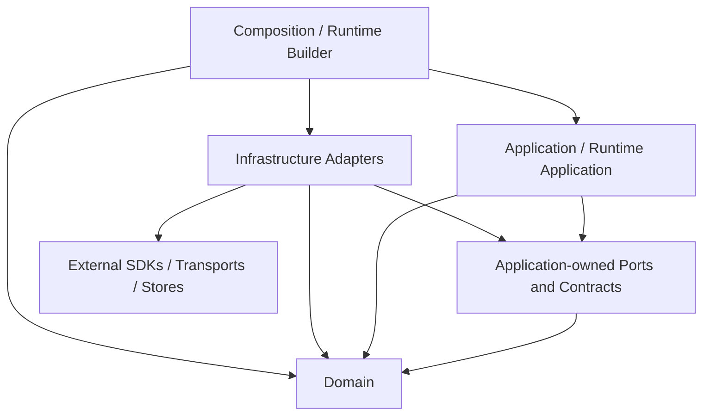
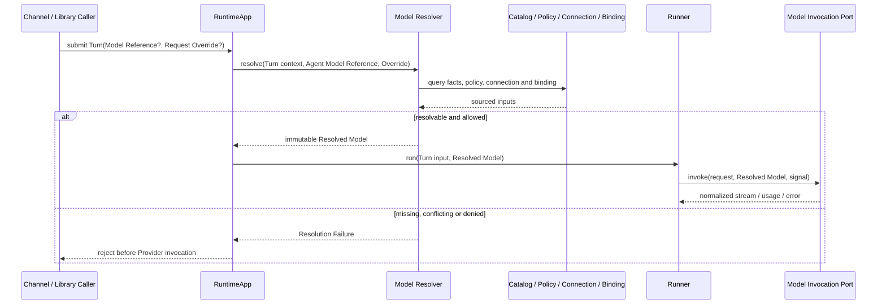
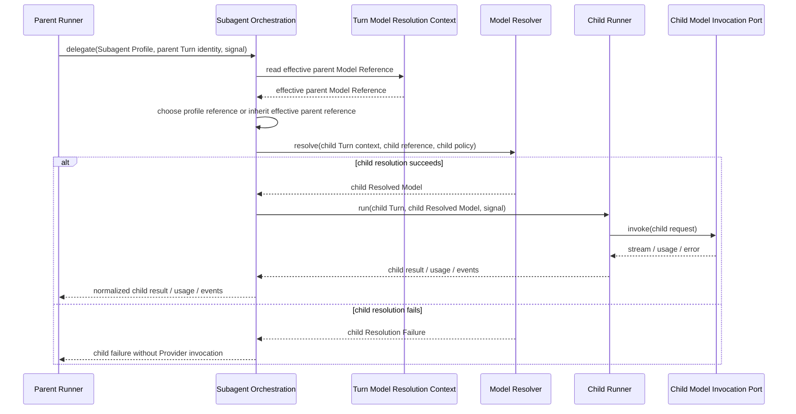
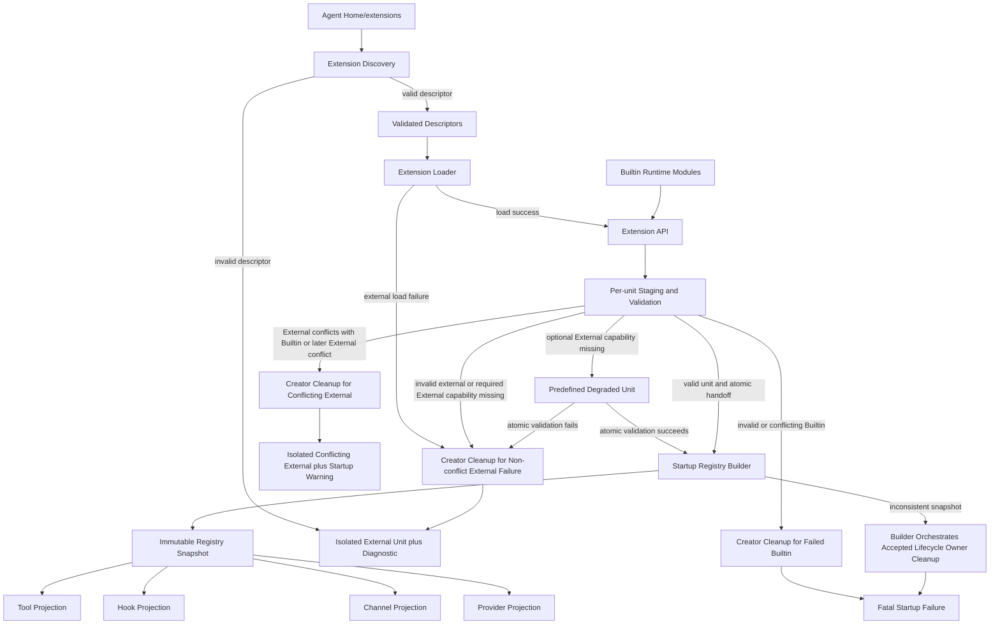

# Target Architecture

## 1. 文档状态与证据规则

- **状态：** Draft
- **版本：** 0.5
- **日期：** 2026-08-31
- **所有者：** 项目所有者
- **执行计划：** [AF-03 Target Architecture Execution Plan](../roadmap/af-03-target-architecture-plan.md)
- **父计划：** [Architecture Foundation Plan](../roadmap/architecture-foundation-plan.md) AF-03
- **规范词汇：** [Domain Glossary](domain-glossary.md)
- **架构约束：** [Architecture Principles](architecture-principles.md)

本文档是目标架构草案，不描述当前实现已经完成的结构，也不授权生产迁移。AF-05/AF-06 尚未执行的内容必须保持为 Hypothesis 或 Open Question；只有对应 Spike Results 可以将其升级为有执行证据的结论。

### 1.1 证据分类

| 标记 | 含义 | 可以支持 | 不能支持 |
|---|---|---|---|
| `Accepted Constraint` | 已接受 Plan、Principle、Glossary 或 Workflow 中的约束 | Target Architecture 必须遵守的边界 | 当前代码已实现该边界 |
| `Current Fact Candidate` | 现有文档对当前实现的描述，本次未重新核验代码 | 迁移映射和 Characterization 输入 | 未经 AF-04 或代码/测试证据确认的当前事实 |
| `Historically Verified` | 文档明确记录曾做代码或测试核验 | 高优先级 Characterization 候选 | 本次仍与生产代码一致 |
| `Target Decision` | 本文经评审接受的目标结构或依赖 | 后续 ADR、Spec 和 Slice 的设计输入 | 已经实现或已经过 Spike 验证 |
| `Hypothesis` | 必须由 AF-05/AF-06 或其他 Spike 验证的可证伪判断 | Spike Spec 输入 | Accepted Result 或生产承诺 |
| `Deferred` | 明确不在 AF-03 决定或实施的事项 | 后续 Plan Item 或 Spike | 当前交付范围 |
| `Legacy Candidate` | 可能已过时、冲突或将被替代的路径/文档 | 迁移和删除审计输入 | 目标权威来源 |

### 1.2 权威输入

| 文档 | 状态 | AF-03 中的用途 |
|---|---|---|
| [Architecture Foundation Plan](../roadmap/architecture-foundation-plan.md) | Accepted v0.8 | AF-03 范围、验收、Foundation Gate 和 Slice 顺序 |
| [AF-03 Execution Plan](../roadmap/af-03-target-architecture-plan.md) | Accepted v1.2 | Phase、Check Items、Exit Gates 和停止条件 |
| [Architecture Principles](architecture-principles.md) | Accepted v1.0 | AP-01 至 AP-13 的稳定约束和验证候选 |
| [Domain Glossary](domain-glossary.md) | Accepted v1.3 | 规范术语、逻辑所有者和非含义 |
| [Development Workflow](../development-workflow.md) | Accepted v1.0 | 状态、评审、证据、DoR/DoD 和文档治理 |

发生冲突时遵循 Architecture Foundation Plan 的权威优先级。本节其他证据不得覆盖上述 `Accepted Constraint`。

## 2. Scope、Non-goals 与标注约定

### 2.1 Scope

本 Target Architecture 将定义：

- Domain、Application、Infrastructure、Composition 的职责与依赖方向；
- Provider/Model Resolution 和 per-turn Resolved Model；
- Extension、Runtime Module、Contribution、Registry 和 Registry Snapshot；
- Tool、Hook、Channel 注册与消费边界；
- Config Namespace、Schema、Extension Capability 和私有资源；
- Event、Error、Lifecycle、Resource Ownership 和 Shutdown；
- Runtime Builder、RuntimeApp、Runner 和 Session 的责任边界；
- Parent Turn、Subagent Turn、Tool、Channel、Extension 变更与关闭调用流；
- Legacy/Compat 单向依赖和 Slice 1–6 迁移边界；
- AF-04、AF-05、AF-06 所需的验证输入。

### 2.2 Non-goals

- 修改生产代码、目录、公共类型或配置格式；
- 实现 Characterization/Fitness Tests；
- 执行 Provider/Model 或 Extension Framework Spike；
- 将 Hypothesis 写成已验证的接口、Schema 或并发算法；
- 提前允许生产动态 Contribution 变更；
- 设计 Marketplace、远程下载、任意热加载、沙箱或分布式 Event Bus；
- 解除 Subagent Batch、并发、Background、Detached、Handoff 或 Agent Team 的 Foundation 范围冻结；
- 让全部生产 Slice 提前达到 Definition of Ready。

### 2.3 章节状态

Phase 1–6 填写目标章节时，每个重要结论必须使用以下前缀之一：

- **Accepted Constraint：** 来自 1.2 节权威输入且不可被本 Draft 静默改写的约束；
- **Target Decision：** AF-03 可以接受的目标边界；
- **Hypothesis：** 必须由 Spike 执行证据验证；
- **Open Question：** 当前证据不足且会影响后续边界；
- **Deferred：** 已确认不属于 AF-03；
- **Current Fact Candidate：** 仅用于描述迁移起点，并链接证据等级。

## 3. Evidence Baseline

本节记录 Phase 0 的文档证据盘点。所有 Current Fact 均为文档证据，除非特别标记为 `Historically Verified`；本阶段没有扫描生产代码。

### 3.1 Current Fact 候选

| 文档 | 证据等级 | 可用于 AF-03 的范围 | 局限 |
|---|---|---|---|
| [Current Overview](current/overview.md) | Current Fact Candidate | 2026-05 模块地图、Turn 流和模块职责候选 | 快照可能落后；只部分同步到 2026-08-27 |
| [Current Runtime](current/runtime.md) | Current Fact Candidate | Runtime 装配、队列、路由、Fanout、Abort、Lifecycle 候选 | 文档自列与 v1.0 的差异和规划项 |
| [Current Runner](current/core_runner.md) | Current Fact Candidate | Tool Use Loop、上下文管理、Event 和 in-turn 输入候选 | 本次未复核实现；后续行为可能未同步 |
| [Current Channel](current/adapter_channel.md) | Current Fact Candidate | CLI/WebSocket、Interaction、路由和多客户端候选 | 存在设计演进和规划项 |
| [Current Config](current/platform_config.md) | Current Fact Candidate | Config 来源、合并和工具策略候选 | 文档明确记录与代码及后续配置文档的差异 |
| [Current LLM Adapter](current/adapter_llm.md) | Current Fact Candidate | LLM Port/Adapter 和 Anthropic 协议映射候选 | 未按 Target Model Resolution 术语组织 |
| [Current Tools](current/core_tools.md) | Current Fact Candidate | Tool Contract、执行与定义转换候选 | 不代表统一 Extension Registry 已存在 |
| [Current Builtin Tools](current/core_tools_builtin.md) | Current Fact Candidate | Builtin Tool 分类和资源需求候选 | 不能作为 Runtime Module 目标结构的证据 |
| [Current Session](current/core_session.md) | Current Fact Candidate | JSONL、Session/Transcript 和并发边界候选 | 需 AF-04 Characterization 保护 |
| [Current Prompt](current/core_prompt.md) | Current Fact Candidate | Prompt 构建和 Context Hook 候选 | 与未来 Extension Hook 边界需重新区分 |
| [Current Memory](current/core_memory.md) | Current Fact Candidate | Memory Port/Store 和可选降级候选 | 本次未复核实现和资源关闭行为 |
| [Current Workspace](current/core_workspace.md) | Current Fact Candidate | Workspace 初始化和上下文加载候选 | 不自动决定 Domain/Application 归属 |
| [Current Logger](current/platform_logger.md) | Current Fact Candidate | Logger Port/Adapter、启动缓冲和关闭候选 | 全局状态与目标 Resource Ownership 需评审 |
| [Agent Capabilities](../agent-capabilities.md) | Mixed Evidence Summary | 当前能力、限制和验证等级总览 | 二级汇总，不能替代源文档或本次代码核验 |

### 3.2 文档记录曾核验的行为

| 文档 | 证据等级 | 记录的核验范围 | AF-03 用法 |
|---|---|---|---|
| [Multi-client User Message Spec](channel-multi-client-user-message-spec.md) | Historically Verified | Runtime intake、WebSocket broadcast、CLI rendering、message/run correlation | AF-04 Characterization 输入；保持 Fanout/关联行为 |
| [Abort Spec](core-abort-spec.md) | Historically Verified | Runtime、Runner、LLM、Channel、Subagent、Exec 的 Abort 链路 | AF-04 Characterization 输入；保持级联中止和队列语义 |
| [Agent Capabilities](../agent-capabilities.md) | Historically Verified Summary | 2026-08-27 对广播和 Abort 的代码/测试核验记录 | 只证明文档记录过核验，不代表本次重新验证 |

### 3.3 混合、冲突与 Legacy 风险

| 文档或区域 | 风险 | AF-03 使用规则 |
|---|---|---|
| [Root README](../../README.md) | Project Structure 仍是旧顶层目录形态 | 仅作为产品入口，不作为模块映射权威 |
| `docs/architecture/current/` | 2026-05 快照，部分文档自列差异或规划项 | 逐文件作为 Current Fact Candidate，不整体升级为 Current Architecture |
| [Current Config](current/platform_config.md) | 工具命名、logger、fs 等与 v1.0 描述存在差异 | Config 目标边界受 AP-02 和 AF-05/06 约束；旧字段不自动成为目标 |
| [Platform Config Restructure Implementation](platform-config-restructure-impl.md) | Implementation 记录无 Accepted/Validated 状态 | 作为迁移历史和候选调用方，不固定目标 API |
| [Channel Design](adapters-channel-design.md) | 状态为设计中、待确认 | 作为历史设计输入，不覆盖 Accepted Principles |
| [WebSocket Channel Design](adapters-websocket-channel-design.md) | 状态为设计中、待确认 | 只提取传输约束候选 |
| [Subagent Evolution Proposal](core-subagent-evolution-proposal.md) | Proposal，未进入 Accepted Spec | 作为 Deferred/后续方向，不解除 Foundation 冻结 |
| [Subagent v2 Spec](core-subagent-v2-spec.md) | 并发设计与当前 Foundation 范围冻结并存 | 作为历史或未来输入，不写入 AF-03 当前交付范围 |
| [Runner Emit Context Refactor](core-runner-emit-context-refactor.md) | 明确未实施 | 作为架构债候选，不作为 Current Fact |
| [Exec Flow Design](core-tools-builtin-exec-flow-design.md) | 引用已不存在的回归清单 | AF-04 需重建验证输入，不依赖失效链接 |

`docs/analysis/` 当前包含有效的比较分析入口，但它们只作为设计参考，不是 my-agent Current Fact 或 Target Constraint。

### 3.4 术语防混用检查清单

以下检查依据 [Domain Glossary](domain-glossary.md) 的定义与非含义建立，并适用于本文后续所有 Target Decision、Hypothesis、图和追踪矩阵：

- [x] `Config`/`Provider Connection` 只表示部署或连接输入，不代称 `Model Descriptor` 中的 Model Facts；
- [x] `Model Descriptor`/Model Facts 只表示可追踪的模型事实，不代称 `Model Policy`、用户偏好或 Request Override；
- [x] `Model Policy` 只表示选择、允许、fallback 和限制规则，不代称 Facts、Connection 或最终执行配置；
- [x] `Request Override` 只表示单个 Turn 的允许字段覆盖，不代称全局 Config、Facts 或 Policy；
- [x] `Resolved Model` 表示一次 Turn 的不可变模型执行结果，不代称 Model Reference、Catalog 条目或可变 Client；
- [x] `Registry` 表示可发现 Contribution 的集合和查找机制，不代称一次 Turn 固定的 `Registry Snapshot`；
- [x] `Registry Snapshot` 表示某一版本的不可变视图，不代称 Config、Registry 本体或动态启停事务；
- [x] `Extension Capability` 表示最小受限平台能力，不代称 Model Capability、Channel Capability 或通用 Service Locator；
- [x] `Runtime Module` 与 `External Extension` 表示不同来源，不能代称其提供的 `Contribution`；
- [x] `Current Architecture`、`Target Architecture`、`Hypothesis` 和 `Legacy` 按证据状态使用，不按文档目录或年代推断。

## 4. Logical Boundaries and Dependency Direction

**Phase：** 1

本节定义逻辑所有权和源码依赖方向，不要求当前目录立即重排。目录、文件和公共类型的迁移只能在 Characterization/Fitness 保护下由后续 Architecture Slice 执行。

### 4.1 四个逻辑边界

| 边界 | 拥有 | 可以依赖 | 禁止拥有或依赖 |
|---|---|---|---|
| Domain | Session、Turn、Message、Event 等核心概念、值、不变量和与集成无关的行为 | Domain 内部类型和标准语言能力 | Application 用例、Provider/Channel SDK、Transport、Store 实现、Config loader、Runtime、Composition |
| Application | Turn Execution、Model Resolution、Subagent Orchestration 等用例；Application Policy；所需的 core-owned Port | Domain；Application 自己拥有的 Port/Contract | 具体 SDK、Transport、Store、配置文件格式、Composition Root、进程级资源创建和释放 |
| Infrastructure | Provider、Channel、Store、文件系统、日志和其他外部机制的 Adapter；协议、错误、事件和数据映射 | 被实现或调用的 core-owned Port/Contract；必要 Domain 类型；外部 SDK | 业务 Policy、Application 用例所有权、Composition Root、RuntimeApp 私有状态 |
| Composition | 配置加载与验证、具体实现选择、Module/Extension 发现、对象图构建、进程级资源启动和部分失败清理 | Domain、Application、Infrastructure 的公开构造/注册入口 | Turn/队列业务、Runner 执行循环、领域规则、通用 DI Container、任意模块可访问的服务集合 |

**Accepted Constraint：** Stable Core 是 Domain、Application 及其拥有的公共契约，不是单个目录。Stable Core 不依赖 Infrastructure 或 Composition；Port 由需要外部行为的 Stable Core 边界拥有，Adapter 依赖并实现该 Port。

**Target Decision：** Runtime Application 属于 Application 边界。它可以编排 Domain 概念和 Application 服务，但不能加载配置、发现实现或识别具体 Provider/Channel 类型。

### 4.2 源码依赖方向

箭头只表示源码依赖方向，不保证运行时调用同向。Infrastructure Adapter 在运行时可以被 Application 通过 Port 调用，但源码仍由 Adapter 指向 core-owned Port。



```text
Composition / Runtime Builder ──> Infrastructure Adapters ──> External SDKs
			  │                         │
			  │                         ├─implements─> Application-owned Ports
			  │                         └────────────> Domain types
			  ├─────────────────────────────────────> Application
			  └─────────────────────────────────────> Domain

Application / Runtime Application ──> Application-owned Ports ──> Domain
Application / Runtime Application ──────────────────────────────> Domain

Forbidden reverse edges:
Domain -X-> Application / Infrastructure / Composition
Application -X-> Infrastructure / Composition / concrete SDKs
Infrastructure -X-> Composition / RuntimeApp private state
```

允许边：

- Domain 只能依赖 Domain 内部；
- Application 可以依赖 Domain 和 Application 拥有的 Port/Contract；
- Infrastructure 可以依赖其实现的 Stable Core Port/Contract、必要 Domain 类型和外部 SDK；
- Composition 可以依赖所有边界的公开构造/注册入口，以选择并连接具体实现；
- 测试 Fake 可以实现 core-owned Port，但不能成为生产 Service Locator。

禁止边：

- Domain/Application 导入 Infrastructure、Composition 或具体 Provider/Channel SDK；
- Stable Core 的公共契约暴露外部 SDK 类型；
- RuntimeApp/Runner 导入 Config loader、具体 Provider/Channel、可变 Registry 或 Extension loader；
- Adapter 访问 RuntimeApp 私有状态或从 Composition 反向解析服务；
- 新核心依赖 Compatibility Adapter 或 Legacy 权威路径；
- 为每个类机械创建无第二实现、Fake 或独立验证价值的 Port。

### 4.3 Runtime、Runner 与 Composition

| 所有者 | 唯一职责 | 不负责 |
|---|---|---|
| Composition Root | 进程入口处选择 Config source、Builtin Runtime Module、External Extension 和具体 Adapter；调用 Runtime Builder | 队列、Turn、Model Resolution、Runner 循环、Channel 路由 |
| Runtime Builder | 验证构建输入，发现并创建组件，收集 Contribution，建立 Registry/资源图，按依赖顺序启动，并清理部分启动失败 | 处理用户消息、调度 Turn、执行 Tool Use Loop、成为全局服务容器 |
| RuntimeApp | 接收入站请求，维护 per-session 队列，创建和调度 Turn，捕获 Turn 所需 Snapshot，维护路由/Fanout/取消，并编排 Shutdown 请求 | 加载 Config、发现 Module/Extension、解析 Model Facts、构造具体 Adapter、执行 LLM/Tool 循环 |
| Runner | 在一个 Turn 内执行 LLM/Tool 循环、上下文预算/压缩、Tool 前后 Hook、执行事件和结果 | 加载 Config、创建 Session/Provider/Channel、发现 Module、管理进程级资源、调度其他 Session |

**Target Decision：** 当前 `src/runtime/` 的职责必须按上表逻辑拆分：`RuntimeApp` 的队列/Turn/路由/Fanout/取消属于 Runtime Application；bootstrap、具体实现选择和注册表构建属于 Composition。该决定不要求 AF-03 内移动目录。

**Target Decision：** Runtime Builder 把构建完成的显式依赖交给 RuntimeApp。RuntimeApp 与 Runner 不得保存 Runtime Builder、Composition Root 或可解析任意服务的容器引用。

### 4.4 Provider 的分发与扩展边界

**Target Decision：** my-agent 发行版只捆绑并由项目维护 Anthropic Provider Integration。Anthropic 是 Bundled Runtime Module，但必须通过与 External Extension 相同的 core-owned Provider Contract、Contribution、Registry 和 Lifecycle 机制接入；Stable Core 不包含 Anthropic 特殊分支。

**Target Decision：** OpenAI、Gemini、Bedrock 等其他 Provider 不属于 my-agent 的内置能力或兼容性承诺。它们可以由第三方 External Extension 提供，具体 Adapter、SDK、配置、Model Facts、测试、发布和兼容性由该 Extension 维护者负责。

**Accepted Constraint：** my-agent 负责 Provider Extension Contract、注册冲突检测、Registry Snapshot、Model Resolution 公共语义和 Contract Test Kit；第三方负责其 Provider Contribution 的正确性。Builtin 与 External 的来源差异不能泄漏给 Application 消费者。

**Accepted Constraint：** 可运行发行版必须至少捆绑一个 Provider Integration，但 Provider 已注册不等于 Runtime 已就绪。缺少有效 Provider Connection 或 Model Reference 时必须显式进入不可接受 Turn 的状态，不能静默切换 Provider、产生费用或使用测试 Fake。

**Deferred：** Provider Contribution 字段、Model Catalog/Descriptor 关系、Connection Schema、Model Resolution 顺序和失败语义由 Phase 2–3 定义；动态启停、Snapshot 切换、排空和回滚由 Phase 4/AF-06 验证。AF-05 可以使用独立 Fake 或实验 Provider 验证第二实现，不构成对 OpenAI 或其他 Provider 的生产支持承诺。

### 4.5 当前模块到目标边界的候选映射

以下映射是基于 Current 文档的 `Current Fact Candidate`，不是本次代码核验结果，也不授权立即移动文件。

| 当前区域 | 目标逻辑所有权候选 | 迁移说明 |
|---|---|---|
| `src/runtime/RuntimeApp.ts` 及队列/路由状态 | Application / Runtime Application | 保留队列、Turn、路由、Fanout、取消和 Shutdown 编排；移出构建与具体实现选择 |
| `src/runtime/bootstrap.ts`、具体注册表构建、配置到实现映射 | Composition / Runtime Builder | 从 RuntimeApp 运行职责中分离；只保留公开构造/注册入口依赖 |
| `src/core/runner/` | Application / Turn Execution | 保留执行循环；Port/领域类型按所有权拆分，不读取 Config 或发现实现 |
| `src/core/session/` | Domain + Application Port + Infrastructure Store | Session 语义和 Contract 留在 Stable Core；JSONL/I/O 实现归 Infrastructure |
| `src/core/prompt/` | Application | 编排 Prompt 用例；Provider 特有消息格式归 Provider Adapter |
| `src/core/tools/` | Domain Contract + Application Tool Execution | Tool 契约和执行语义留在 Stable Core；外部 I/O 由 Adapter/Module 实现 |
| `src/core/tools/builtin/` | Bundled Runtime Module + Infrastructure | 作为 Bundled Contribution 接入；文件、网络、进程 I/O 不成为 Domain |
| `src/core/memory/` | Application Port/Policy + Infrastructure Store | 检索用例与存储/索引实现按 Port 分离 |
| `src/core/workspace/` | Application Use Case + Infrastructure File Adapter | Workspace 规则与文件系统读取按所有权分离 |
| `src/adapters/llm/` | Infrastructure Provider Integration | Model invocation Port 移交 Stable Core 所有；Anthropic 实现成为 Bundled Runtime Module |
| `src/adapters/channel/` | Infrastructure Channel Integration | Channel Contract 移交 Stable Core；CLI/WebSocket Transport 留在 Adapter；Interaction 协调责任由后续调用流确认 |
| `src/platform/config/` | Composition + Configuration Input | Config 加载/验证在 Composition；不能把 Config 对象透传为全局服务 |
| `src/platform/logger/` | Application-owned Observability Port + Infrastructure Adapter | 目标边界使用显式 Port；当前全局静态状态作为 Legacy Candidate 评估 |

**Legacy Candidate：** `src/runtime/`、`src/core/session/`、`src/core/memory/`、`src/core/workspace/` 和 `src/platform/logger/` 都可能同时包含多个逻辑边界。后续 Slice 应迁移权威类型和真实调用方，而不是仅为目录整齐做一次性重排。

### 4.6 不使用通用 DI Container 或 Service Locator

Phase 1 的构造原则足以表达当前目标对象图：

1. Composition Root 显式选择 Module、Extension 和 Adapter；
2. Runtime Builder 依据声明的构建输入创建有限对象图；
3. 消费者通过构造参数或明确用例参数接收所需 Port、Registry Snapshot 或受限 Capability；
4. Registry 只查询特定领域的 Contribution，不解析任意应用服务；
5. Extension Capability 只暴露获准的最小平台能力，不能取得 RuntimeApp 或容器；
6. Resource Ownership 表记录创建者和关闭者，不能依靠容器作用域隐式释放。

因此，通用 `get<T>(token)`、全局服务映射或 RuntimeApp 私有状态访问不会提供必要业务语义，只会隐藏依赖和 Lifecycle Owner，属于禁止设计。

### 4.7 AF-04 Fitness Test 候选

| ID | 候选规则 | 验证方式 | 对应原则 |
|---|---|---|---|
| P1-FT-01 | Domain/Application 不导入 Infrastructure 或 Composition | import graph / dependency rule | AP-01 |
| P1-FT-02 | Provider/Channel SDK 只出现在对应 Infrastructure Integration | package import allowlist | AP-01 |
| P1-FT-03 | Runner 不依赖 Config loader、具体 Provider、Extension loader 或可变 Registry | import rule + public constructor check | AP-01、AP-03、AP-05、AP-11 |
| P1-FT-04 | RuntimeApp 不依赖具体 Provider/Channel 类型或 Composition 服务 | import rule + RuntimeApp responsibility tests | AP-01、AP-11 |
| P1-FT-05 | Infrastructure Adapter 依赖并实现 core-owned Port，Stable Core 不导入 Adapter | import graph + Fake Adapter Contract Tests | AP-01、AP-06 |
| P1-FT-06 | Extension/Module 不访问 RuntimeApp 私有状态或通用 Service Locator | forbidden import/symbol rule | AP-08、AP-11 |
| P1-FT-07 | 新增测试 Provider Extension 不修改 Runner、RuntimeApp 或核心领域联合类型 | change-locality test / review check | AP-01、AP-04、AP-12 |
| P1-FT-08 | 新核心不依赖 Compat/Legacy 路径 | import graph / path denylist | AP-06、AP-07 |

这些是 AF-04 的候选输入，不表示当前目录已经满足规则。AF-04 必须根据实际代码、测试和构建工具确认可执行路径与必要例外。

### 4.8 Phase 1 完成条件

- [x] Stable Core 不依赖具体 Provider/Channel SDK、Store 或 Composition；
- [x] Runtime/Runner/Composition 无重叠所有权；
- [x] 不引入通用 DI Container 或 Service Locator；
- [x] 依赖规则可以由静态检查表达。

独立复审未发现 Critical 或 High 问题，并确认 10 个 Phase 1 Check Items、3 个 Exit Gate、Mermaid/ASCII 等价性和 AF-04 Fitness Test 候选均有设计证据。项目所有者于 2026-08-28 接受 Phase 1 的逻辑边界、依赖方向、Provider 分发约束和候选迁移映射。该接受只完成 Phase 1，不表示当前代码已满足目标依赖规则，也不表示 Target Architecture 整体已接受。

## 5. Provider and Model Resolution

**Phase：** 2

### 5.1 设计状态与证据边界

本节定义 Provider/Model 身份、连接、事实、策略、请求覆盖、解析结果和执行消费的目标边界。它保留当前 `LLMClient` 隔离、流事件映射、Usage 和 Abort 透传作为迁移候选，但不把当前散装的 `model`、`maxTokens`、`contextWindowTokens` 和 `llmClient` 参数形态固定为目标 API。

**Target Decision：** 每个 Parent Turn 和 Child Turn 必须在进入 Runner 前独立完成 Model Resolution，并在该 Turn 内固定一个不可变 Resolved Model。RuntimeApp 编排解析时机，但不加载 Model Facts、选择具体 Provider 或拼装 Provider Client；Runner 只消费 Resolved Model。

**Evidence Boundary：** 本节确定逻辑所有权、依赖方向、fail-closed 语义和可证伪契约，不冻结 TypeScript 字段、Provider Contribution Schema、Catalog 合并算法、Client Pool 或具体错误联合类型。后者分别由 Phase 3、AF-05 和 Architecture Slice 决定。

### 5.2 所有权、来源与非含义

| 概念 | 权威所有者 | 输入/来源 | 输出或消费者 | 不得承担 |
|---|---|---|---|---|
| Provider 身份 | Model Resolution | Provider Contribution 的稳定标识 | Model Reference、Catalog、Resolver | Endpoint、凭据、SDK Client、选择策略 |
| Provider Connection | Provider Integration | Configuration 加载并做语法校验的部署输入、凭据引用、Endpoint、租户或代理设置 | Composition 提供 binding；Resolver 通过 core-owned Contract 校验可用性与兼容性；Provider Adapter 使用连接 | Model Capability、默认模型、fallback Policy |
| Protocol | Provider Integration | Provider Contract/Contribution 声明和 Adapter 实现 | Resolved Model、Provider Adapter | 网络库、Endpoint、Provider 品牌别名 |
| Model Reference | Model Resolution；由调用方或 Agent/Subagent Profile 提供 | Turn 请求、Agent Profile、Subagent Profile 或显式默认 | Model Resolver | 完整 Facts、Client、Endpoint、解析结果 |
| Model Descriptor | Model Catalog / Model Resolution | Provider Contribution、受信发现结果或显式运维覆盖 | Model Resolver、预算校验 | 用户偏好、Connection、Request Override |
| Model Policy | Application Policy | Agent Policy、运行约束和调用上下文 | Model Resolver | Model Facts、Connection、最终执行配置 |
| Request Override | Turn 输入提供者声明；Model Resolution 校验 | 当前 Turn 的显式请求字段 | Model Resolver | 全局 Config、Provider 切换、跨 Turn 状态 |
| Model Catalog | Model Resolution | 带来源和可信级别的 Model Descriptor | Model Resolver | Connection Store、Client Pool、未标注默认值 |
| Provider Integration Binding | Provider Extension Contract；由 Composition 提供 | 启动期可用 Provider Contribution/Snapshot | Model Resolver、Model Invocation Port | SDK 类型泄漏、RuntimeApp 私有状态、Service Locator |
| Model Resolver | Application / Model Resolution | Reference、Catalog、Connection、Policy、Override、Binding | Resolved Model 或显式 Resolution Failure | Config 加载、SDK Client 构造、Runner 执行循环 |
| Resolved Model | Model Resolution 生成；Turn Execution 消费 | 一次成功解析的全部已校验结果 | Runner、上下文预算和 Model Invocation Port | Catalog 可变引用、SDK Client、跨 Turn 自动更新 |

**Target Decision：** Provider Integration 是 Provider Connection 语义及使用方式的唯一所有者。Configuration 只加载并做格式/Schema 校验，Composition 只提供选定 binding，Model Resolver 只通过 core-owned Contract 校验该连接对当前 Provider/Model 是否可用和兼容；这些协作者都不重新定义 Connection 语义。Configuration 不能把 Connection、Descriptor、Policy 和 Request Override 合并成同一个 `LLMConfig` 语义。每个最终值必须保留逻辑来源；具体 provenance 字段形状由 AF-05 后的 Slice 决定。

### 5.3 core-owned Model Invocation Port

Stable Core 拥有用于模型调用的 Model Invocation Port、请求/流事件、Usage、Abort 和错误归一化契约。Provider Adapter 实现该 Port，并在内部完成 Protocol、SDK、Tool Use 分片、流事件和 Provider 错误映射。

```text
Application / Runner
		|
		v
core-owned Model Invocation Port <----- Infrastructure Provider Adapter
										   |
										   v
									Provider SDK / Protocol
```

源码依赖方向为 `Provider Adapter -> core-owned Port`。运行时调用可以由 Runner 经 Port 到 Adapter，但 Runner、RuntimeApp 和 Domain 不导入 Provider SDK 类型。Anthropic Bundled Runtime Module 与第三方 External Provider Extension 必须实现同一 Port/Contract；来源差异不能出现在 Runner 分支中。

Phase 2 只要求 Resolver 能获得一个与 Provider 身份一致的 Provider Integration Binding。Provider Contribution、Registry、Snapshot 和冲突校验的具体形状由 Phase 3 定义，动态切换由 Phase 4/AF-06 定义。

### 5.4 Resolved Model 的 per-turn 不变量

成功解析产生的 Resolved Model 在逻辑上必须原子绑定：

- Provider 和 Model 的规范身份；
- 与该 Provider 对应的 core-owned Model Invocation Port binding；
- Protocol 和解析后的 Endpoint 身份；
- 带来源的 Model Capability facts、上下文上限和最大输出上限；
- Model Policy 选择结果和允许的 Request Override；
- 执行所需请求限制及其来源记录。

Resolved Model 不包含明文凭据、Provider SDK Client、Config loader、可变 Catalog/Policy 引用或跨 Turn 可变请求状态。Connection 可通过不暴露凭据的稳定 binding/reference 参与解析；具体秘密注入和 Client 生命周期属于 Provider Integration 与 Composition 的责任。

**Target Decision：** Model 切换必须原子切换 Port binding、Protocol、Endpoint 和 Model Capability facts。只替换 model 字符串而复用上一 Provider 的 Client、Endpoint 或能力事实属于无效解析。

**Target Decision：** Turn 捕获 Resolved Model 后，Catalog、Policy、Config 或 Provider Registry 的后续变化不得改变该 Turn 的执行输入。Runner 内的压缩重试和多轮 Tool Use 继续使用同一个 Resolved Model；创建新的 Child Turn 则执行新的解析。

### 5.5 解析阶段、失败和保守 fallback

Model Resolver 的目标阶段顺序是：

1. 规范化并校验 Model Reference；
2. 查找 Provider 身份及可用 Provider Integration Binding；
3. 解析并校验对应 Provider Connection；
4. 从 Model Catalog 取得带来源的 Model Descriptor；
5. 应用 Model Policy，得到允许的候选或显式拒绝；
6. 校验并应用仅限白名单字段的 Request Override；
7. 对 Protocol、Endpoint、Capability 和请求限制做一致性检查；
8. 原子生成 Resolved Model，或返回可分类、可追踪的 Resolution Failure。

以下情况必须在 Provider 网络调用前显式失败：Provider 未注册、Connection 缺失或无效、Model 身份不存在或有歧义、执行所需 Facts 不足、Policy 拒绝、Request Override 越权、Protocol 不兼容或 Capability 不支持请求。

**Accepted Constraint：** 默认行为 fail-closed。不得静默切换 Provider、使用测试 Fake、猜测缺失 Capability、从 Provider 品牌推导上下文上限，或在失败后发起可能产生费用的探测调用。

**Target Decision：** fallback 只能由显式 Model Policy 授权。每个 fallback 候选、采用原因和拒绝原因必须可追踪；如果没有满足 Connection、Facts、Policy 和 Capability 的候选，则解析失败。

**Hypothesis P2-H01：** Model Catalog 的多来源合并可以使用与注册/枚举顺序无关的确定性优先级，同时保留字段级 provenance 和冲突诊断，而不把运维覆盖误写为 Provider 权威事实。具体来源等级、字段覆盖粒度和冲突算法必须由 AF-05 验证。

**Hypothesis P2-H02：** 对预先分类为非执行关键的 Facts 可以保留明确的 `unknown` 并继续执行，但任何影响请求合法性、上下文预算或 Tool Use 编码的未知事实都必须阻止该候选。关键/非关键事实分类、事实最小集和保守 fallback 阈值必须由 AF-05 以正反案例验证。

### 5.6 Parent Turn Model Resolution 调用流



```text
Channel / Library Caller -> RuntimeApp:
	submit Turn(Model Reference?, Request Override?)
RuntimeApp -> Model Resolver:
	resolve(Turn context, Agent Model Reference, Override)
Model Resolver -> Catalog / Policy / Connection / Binding:
	query sourced inputs
Catalog / Policy / Connection / Binding -> Model Resolver:
	sourced inputs

Success:
	Model Resolver -> RuntimeApp: immutable Resolved Model
	RuntimeApp -> Runner: run(Turn input, Resolved Model)
	Runner -> Model Invocation Port:
		invoke(request, Resolved Model, signal)
	Model Invocation Port -> Runner: normalized stream / usage / error

Failure:
	Model Resolver -> RuntimeApp: Resolution Failure
	RuntimeApp -> Channel / Library Caller:
		reject before any Provider invocation
```

RuntimeApp 只提供当前 Turn 上下文并接收结果，不解释 Facts 或按 Provider 类型分支。Model Resolver 不执行 LLM/Tool 循环；Runner 不重做任何 Model Resolution。

### 5.7 Subagent 独立 Model Resolution 调用流

**Target Decision：** Parent Turn 和每个 Child Turn 分别拥有自己的 Resolved Model。Model Resolver 的成功结果同时产生规范化的有效 Model Reference 作为 Turn-owned resolution metadata；RuntimeApp/Turn orchestration 保留该 metadata，只把 Resolved Model 交给 Runner。Subagent Orchestration 通过显式、只读的 Turn Model Resolution Context 取得 Parent 有效 Model Reference，Runner 不读取、解释或转发该 Reference。该 Context 是逻辑责任，不在 Phase 2 冻结接口形状，也不是 RuntimeApp 私有状态或 Service Locator。

Subagent Profile 指定具体 Model Reference 时独立解析；`model: inherit` 继承上述 Parent 有效 Model Reference，而不是 Parent 的 Resolved Model、Provider SDK Client 或全局默认 model 字符串，然后为 Child Turn 重新解析。



```text
Parent Runner -> Subagent Orchestration:
	delegate(Profile, parent Turn identity, signal)
Subagent Orchestration -> Turn Model Resolution Context:
	read effective parent Model Reference
Turn Model Resolution Context -> Subagent Orchestration:
	effective parent Model Reference
Subagent Orchestration -> Subagent Orchestration:
	choose Profile reference OR inherit effective parent Model Reference
Subagent Orchestration -> Model Resolver:
	resolve(child Turn context, child reference, child policy)

Success:
	Model Resolver -> Subagent Orchestration: child Resolved Model
	Subagent Orchestration -> Child Runner:
		run(child Turn, child Resolved Model, signal)
	Child Runner -> Child Model Invocation Port: invoke(child request)
	Child Model Invocation Port -> Child Runner: stream / usage / error
	Child Runner -> Subagent Orchestration: child result / usage / events
	Subagent Orchestration -> Parent Runner:
		normalized child result / usage / events

Failure:
	Model Resolver -> Subagent Orchestration: child Resolution Failure
	Subagent Orchestration -> Parent Runner:
		child failure without Provider invocation
```

Parent/Child 可以解析为不同 Provider/Model，但不得共享 per-turn 可变请求状态。Usage 聚合、Abort 级联、Event correlation、Session 隔离和父子阻塞/并发语义不由 Model Resolution 改写。

Subagent Orchestration 负责成功与失败结果的对称归一化并返回 Parent；Phase 2 不改变既有 Usage/Event/Abort 契约的具体形状，其完整调用流仍由 Phase 5 定义。

**Hypothesis P2-H03：** Parent/Child 可以共享只读 Provider Integration 资源或由唯一 Lifecycle Owner 管理的受控连接池，同时不共享 Resolved Model、请求构建器、流状态或其他 per-turn 可变 Client 状态。允许共享的最小资源边界、唯一 Lifecycle Owner、借用/释放和 Shutdown 行为必须由 AF-05 验证。

### 5.8 Current 到 Target 的迁移输入

| Current Fact Candidate | Target 解释 | 迁移要求 |
|---|---|---|
| Runner 接收 `llmClient` 和散装 `model`/`maxTokens`/`contextWindowTokens` | 一个 Resolved Model 消费边界 | AF-04 先保护执行循环、预算、Usage 和 Abort；Slice 再替换参数边界 |
| Runtime 使用 `runTurn.model > resolvedConfig.llm.model` | Model Reference 来源和优先级候选 | 不直接升级为 Target Policy；由 AF-05 验证来源冲突和 fallback |
| `LLMConfig` 同时含 apiKey/baseURL/model/maxTokens/contextWindowTokens | Connection、Reference、Override 和 Descriptor Facts 混合 | 拆为不同所有者，保留兼容读取只作为 Legacy Adapter 输入 |
| `LLMClient` 隔离 Anthropic SDK 和流事件 | core-owned Model Invocation Port 的起点 | 移交 Stable Core 所有；Anthropic Adapter 继续做 Protocol/SDK 映射 |
| Subagent `model: inherit` 回退 `llmDefaults.model` | Child Model Reference 继承候选 | Target 改为继承 Parent 有效 Reference 后独立解析；兼容影响先由 AF-04 确认 |
| Parent/Child 当前可复用同进程 `LLMClient` | 资源共享的 Current Fact Candidate | 不证明 per-turn 状态隔离；交给 P2-H03/AF-05 验证 |

这些映射不授权当前目录重排，也不保证旧 `LLMConfig` 或 `RunParams` 形状继续成为公共契约。

### 5.9 AF-05 Provider/Model Spike 输入

| ID | Hypothesis / Contract | 最小实验 | 成功条件 | 停止条件 |
|---|---|---|---|---|
| P2-E01 | 第二 Provider Binding 不要求修改 Runner | 使用 Anthropic Adapter 加独立 Fake/实验 Provider 实现同一 Port，分别解析并运行相同最小 Turn | Runner/RuntimeApp 无 Provider 分支；两者输出归一化事件 | 需要复制 Runner、泄漏 SDK 类型或新增中央 Provider 联合分支 |
| P2-E02 | Model 切换原子绑定全部执行事实 | 两个候选使用不同 Port、Protocol、Endpoint 和 Capability；重复切换并记录调用 | 每次调用只观察一个候选的完整一致集合 | 出现旧 Client/Endpoint/Facts 与新 model 混用 |
| P2-E03 | Catalog 合并可确定且可追踪 | 注入冲突的 Provider、运维覆盖和发现 Facts，并置换来源注册/枚举顺序 | 所有顺序产生同一结果；字段来源和冲突可诊断 | 结果依赖未记录顺序或静默覆盖关键 Facts |
| P2-E04 | 缺失 Facts 可以按分类保守处理 | 先给出关键/非关键 Fact 分类；分别删除上下文上限、Tool Use 等关键事实和一个不影响当前请求的非关键事实 | 关键 Facts 缺失时调用前失败；非关键 `unknown` 正例可以执行且保持 unknown，不被猜测 | 分类无法稳定表达，或关键缺失产生调用/费用，或非关键 unknown 被填入猜测值 |
| P2-E05 | Parent/Child 独立解析且共享资源不泄漏 per-turn 状态 | 在仅用于 Spike 的受控重叠 harness 中，强制 Parent/Child 使用同一 instrumented 只读资源/连接池但选择不同 Provider/Model；记录借用、流、Usage、Abort、释放和 Shutdown | 各 Turn 的 Port/Facts/Usage/Event/Abort 无串扰；唯一 Lifecycle Owner 可定位；每次借用恰好释放且共享资源只关闭一次 | 需要授权生产 Subagent 并发，或出现请求状态/串流/取消/Usage 串扰、重复释放、泄漏或多 Lifecycle Owner |
| P2-E06 | Turn 内 Resolved Model 不漂移 | Turn 运行中替换 Catalog、Policy、Config 或可用 Binding | 活跃 Turn 保持原 Resolved Model；新 Turn 使用新结果 | 活跃 Turn 观察到混合版本或重新解析 |
| P2-E07 | Resolution Failure 不触发 Provider | 分别注入 Provider 未注册、Connection 缺失、Connection 无效、Model 未知、Model 身份歧义、关键 Facts 不足、Policy deny、越权 Override、Protocol 不兼容和 Capability 不支持 | 每类返回可分类失败且 Provider 调用计数为零 | 任一失败路径发起探测、切换 Provider、产生费用或使用 Fake |

AF-05 不以接入 OpenAI 或其他生产 Provider 为成功条件；独立 Fake/实验 Provider 足以验证第二实现和变更局部性，也不扩大 my-agent 的兼容性承诺。

### 5.10 Phase 2 完成条件

- [x] Runner 只消费 Resolved Model，不加载 Config 或推断 Model Facts；
- [x] Model 切换同步切换 Port、Protocol、Endpoint 和 Model Capability facts；
- [x] Parent/Subagent 可以解析不同 Model 且不共享可变 Client 状态；
- [x] 未验证的 Catalog/fallback 规则仍标记为 Hypothesis。

独立复审首轮发现 3 个 High 和 3 个 Medium 文档问题，已修正 Provider Connection 单一语义所有权、Parent 有效 Model Reference 权威传递路径、AF-05 实验覆盖、Mermaid/ASCII 等价性和 Subagent 结果归一化责任。跟进复审发现 Domain Glossary 仍存在共同所有权冲突；项目所有者批准将其修订为 Accepted v1.1 后，最终复审确认无 Critical/High，10 个 Phase 2 Check Items 和 3 个 Exit Gate 均有目标设计证据。项目所有者于 2026-08-31 接受 Phase 2 提案及 Connection 所有权修订。该接受只完成文档设计，不表示生产实现、AF-05 实验或 Provider 兼容性验证已完成。

## 6. Extension、Module、Contribution and Registry

**Phase：** 3

### 6.1 设计状态与静态范围

本节定义 Runtime Module 与 External Extension 在启动期的发现、加载、注册、校验和消费边界。它只授权 Runtime Builder 在 RuntimeApp 启动前构建一个只读 Registry Snapshot；文件变化通过进程重启生效，不授权 watcher、运行中 reload、动态 Contribution 事务、Snapshot 代际切换或旧资源排空。

**Target Decision：** Agent Home 是 my-agent 管理本机运行数据的规范根目录，`<agent-home>/extensions` 是唯一默认 External Extension 安装和自动发现根目录。Discovery 只枚举该目录的直接子目录；每个候选必须以 `extension.json` 作为 Extension Descriptor，不递归搜索、不执行散落脚本、不扫描 `node_modules`，也不接受任意配置扫描路径。

**Evidence Boundary：** 本节冻结逻辑责任、错误原子性、消费边界和最小公开语义，不冻结 Agent Home 的 OS 路径解析、`extension.json` 字段集合、TypeScript 接口、模块格式、Config Schema API、Capability 对象或 Lifecycle 方法形状。这些形状必须由 AF-06 Spike 验证后进入 Architecture Slice。

### 6.2 Source acquisition、Discovery、Descriptor 与 Loader

| 概念 | 所有者 | 输入 | 输出 | 不负责 |
|---|---|---|---|---|
| Agent Home resolution | Composition / Configuration | CLI、环境或平台默认位置 | 一个已规范化 Agent Home 路径 | 扫描扩展、执行入口、注册能力 |
| Extension Discovery | Runtime Composition | `<agent-home>/extensions` | 未执行代码的 Extension Descriptor 候选与发现诊断 | 加载入口、修改 Registry、启动资源 |
| Extension Descriptor | Extension Framework Contract | 每个直接子目录的 `extension.json` | Extension 身份、版本和可加载入口所需的静态描述 | Contribution、运行配置、私有资源、已执行代码 |
| Extension Loader | Runtime Composition | 已验证 Descriptor 和安装目录 | 一个可调用统一注册入口的已加载 Extension 单元，或加载诊断 | 直接修改 Registry、授予 Runtime 私有状态、启动长生命周期资源 |
| Builtin source acquisition | Composition Root | 应用构建直接提供的 Runtime Module | 一个可调用统一注册入口的 Builtin 单元 | 伪装成文件系统安装或绕过后续注册校验 |

**Target Decision：** Discovery 必须在执行任何 Extension 代码前完成 Descriptor 的静态校验。候选按规范化安装目录名升序形成确定扫描顺序；文件系统原始枚举顺序不得影响最终 Snapshot。目录名因此是 External Extension 冲突的显式优先级，用户可以通过重命名安装目录改变后续启动的赢家。目录名规范化和跨平台比较算法由 AF-06 验证。

**Target Decision：** Source acquisition 是 Builtin/External 唯一允许不同的阶段：Builtin Runtime Module 由 Composition Root 显式提供，External Extension 由规范目录发现并经 Loader 加载。进入 Registration 后，两者使用相同 Extension API、Contribution Contract、暂存校验和 Snapshot 构建路径。

### 6.3 单一 Extension API 与类型化 Contribution

**Target Decision：** Extension 作者只面对一个受限、author-facing Extension API。初始 API 提供具名、类型化的 `registerTool`、`registerHook`、`registerChannel` 和 `registerProvider` 语义；这些名称表达目标能力，不冻结方法签名。四类是首批 Contribution Kind，不是穷尽集合，也不建立四套彼此独立的 Extension 系统。

| Contribution Kind | Contract 所有者 | 实现所有者 | Snapshot 消费者 | 注册期禁止行为 |
|---|---|---|---|---|
| Tool Contribution | Stable Core / Tool Domain | Runtime Module 或 Extension | Runner / Tool Execution 的 Tool projection | 执行 Tool、读取 RuntimeApp 私有状态 |
| Hook Contribution | Stable Core / Hook Contract | Runtime Module 或 Extension | 对应 Runtime/Turn 生命周期点的 Hook projection | 替换 Runner、订阅未命名全局事件 |
| Channel Contribution | Stable Core / Channel Contract | Runtime Module 或 Extension | Runtime Builder 和 RuntimeApp 的 Channel projection | 注册时启动 Transport 或隐式创建 Session |
| Provider Contribution | Stable Core / Provider Extension Contract | Runtime Module 或 Extension | Model Catalog/Resolver 和 Runtime Builder 的 Provider projection | 创建 per-turn 状态、把 SDK 类型暴露给 Stable Core |

每项 Contribution 都必须包含类型化声明及其实现 binding，并保留来源 Extension/Module 身份。实现 binding 只允许通过对应 Contract 被消费；Contribution 不能携带任意服务映射、RuntimeApp 引用或可由消费者关闭的私有资源句柄。

**Target Decision：** Extension 注册到私有 staging collector，而不是直接修改共享 Registry。所有单元完成 staging 后，Registry Builder 才按确定冲突规则校验和发布。一个 Extension 的全部 Contribution 作为一个原子候选单元完成类型、身份、命名、启动期 Extension Capability 要求和跨 Contribution 一致性校验；只有整组有效时才进入启动期 Registry Builder。现有 Contribution Kind 的新实例不要求修改 Runtime、Runner、Bootstrap 或中央 Extension 类型联合；新增平台级 Contribution Kind 则必须先增加明确的 core-owned Contract 和 typed projection，不能通过不透明的 `register(any)` 绕过治理。

### 6.4 External Extension 隔离与启动结果

**Target Decision：** External Extension 的 Descriptor 无效、入口缺失、加载失败、注册抛错或任一 Contribution 无效时，Runtime Builder 丢弃该 Extension 的整个 staging unit，编排失败阶段的资源清理，记录结构化、可关联的启动诊断，然后继续处理其他候选。失败 Extension 的任何部分 Contribution 都不得进入 Snapshot。

**Target Decision：** 在一个 Extension/Module 的 staging unit 成功原子交接给 Runtime Builder 前，创建资源的一方始终保留 rollback ownership，并必须提供可由 Builder 编排的失败清理行为；Builder 不因编排清理而成为该私有资源的语义所有者。原子交接后，已接受单元的唯一 Lifecycle Owner 按 Resource Ownership 记录负责后续关闭。具体 handoff 和 cleanup 接口由 AF-06 验证。

冲突结果必须与枚举顺序无关且可解释：

- Builtin 单元之间出现重复 Extension ID 或 Contribution identity 冲突时，整个启动失败；
- External 与 Builtin 出现 Extension ID 或 Contribution identity 冲突时，Builtin 胜出，External 单元整体隔离，并记录结构化 startup warning；
- External 候选按规范化安装目录名顺序校验；重复 Extension ID 时 first wins，后续重复候选整组隔离，并记录结构化 startup warning；
- 不同 External ID 出现 Contribution identity 冲突时，同样按规范化安装目录名顺序 first wins，后续冲突单元整组隔离，并记录结构化 startup warning；
- 每条冲突 warning 必须包含赢家、被隔离方、冲突 identity 和用于裁决的安装目录顺序；不得使用文件系统原始枚举顺序或注册调用先后裁决；
- 最终 Snapshot 记录已接受来源和隔离诊断摘要，但消费者只取得其所需 typed projection；
- 诊断必须通过启动结果/Observability 明确暴露，不能把缺少能力伪装成加载成功。

**Target Decision：** External Extension 隔离属于可降级启动策略，不覆盖发行版和显式运行要求。无效 Builtin Runtime Module、无法构建内部一致 Snapshot、缺少发行版要求的 Anthropic Provider Contribution，或其他被 Runtime 启动契约标记为必需的能力失败时，Runtime Builder 必须使整个启动失败。Provider 已注册但 Connection/Model 不可解析时仍遵循 §4.4 和 §5 的 Turn 前显式失败语义。

### 6.5 一个 Registry Snapshot 与 narrow typed projections

**Target Decision：** 启动期只有一个权威 Registry Builder 和一个内部一致、不可变的 Registry Snapshot。Snapshot 以来源和 Contribution identity 建立共同版本边界，并暴露 Tool、Hook、Channel、Provider 等 narrow typed projections；“Tool Registry”“Hook Registry”等只可作为 projection 的描述，不能成为独立发布、独立版本或可变注册入口。

| 消费者 | 可接收 | 不可接收 |
|---|---|---|
| Runtime Builder | 构建期 staging/validation 能力和完成的 Snapshot | Extension 私有对象图、运行中可变 Registry |
| RuntimeApp | Channel/Hook 等完成构建的窄视图及 Turn 所需 Snapshot 引用 | Extension Loader、Descriptor、staging collector |
| Runner | 当前 Turn 固定 Snapshot 的 Tool/Hook 窄视图 | Registry Builder、Channel/Provider 管理视图 |
| Model Resolver | Provider/Model 所需窄视图 | Tool/Channel 实现、Extension 来源分支 |
| Extension 实现 | 注册时 Extension API；执行时经授权的最小上下文 | Snapshot 全量枚举、Registry mutation、其他 Extension 私有资源 |

RuntimeApp 在创建 Turn 时捕获启动期 Snapshot，Runner 在该 Turn 内只使用同一 Snapshot 的 projections。Phase 3 不要求真正的多代 Snapshot，但 Snapshot 身份不得被省略为若干裸 `Map`；版本、原子发布和旧 Turn pinning 的完整不变量由 Phase 4/AF-06 定义。

### 6.6 Config Namespace、Extension Capability 与私有资源

**Target Decision：** 每个 Extension 只拥有与规范 Extension ID 对应的 Config Namespace。Configuration 负责读取部署输入并保持 Namespace 隔离；Extension 提供自身配置语义和 Schema，Runtime Composition 负责在对应 Extension 注册或启动前协调校验。中央配置不得复制每个第三方字段，也不得把未经校验的全局 Config 对象交给 Extension。Schema 的发现时机、版本迁移和两阶段加载接口是 AF-06 Hypothesis。

**Target Decision：** Extension API 只提供 Contribution 注册能力，不是运行时 Service Locator。Contribution 实现在执行时只获得其 Contract 定义且经 Runtime Composition/Policy 授权的最小 Extension Capability 或受限调用上下文。缺失 required 启动期 Extension Capability 时，整个 External staging unit 隔离；缺失 contract-declared optional 启动能力时，Extension 可以形成一个预先定义、可诊断且仍需整组通过校验的降级单元，不能在校验失败后由 Registry Builder 临时删去单项 Contribution。调用期 Channel Capability 随调用上下文变化，缺失时只按对应 Contract 拒绝或降级本次调用，不改变 Snapshot 或 Extension 可用状态。

Extension 可以在自身边界内创建并让多类 Contribution 共享私有资源，但必须满足：

- 共享者和关闭权不越过该 Extension 边界；
- 私有资源不以任意 token 注册到 Registry 或全局服务集合；
- Contribution 消费者持有实现 Contract 不等于获得资源关闭权；
- 资源创建、部分失败清理、启动和逆序关闭有唯一 Lifecycle Owner；
- 具体 factory、Capability 和 Lifecycle 接口形状由 AF-06 验证。

平台专有消息或交互能力必须由 Channel Contract、Channel Capability 或受限消息上下文表达。Tool/Hook 不得通过识别具体 Channel 类型、Transport payload 或全局当前客户端来访问审批、结构化选择、附件等能力；能力缺失时按显式 Contract 拒绝或降级。

### 6.7 启动期静态组合流



```text
<agent-home>/extensions -> Discovery
	|-- invalid Descriptor -> isolate External unit + startup diagnostic
	`-- valid Descriptor -> Loader
		|-- External load failure -> Builder invokes creator-supplied cleanup
		|   `-- isolate External unit + startup diagnostic
		`-- load success ------------------------------------------------------┐
Builtin Runtime Modules -------------------------------------------------------> Extension API
																			   `-> per-unit staging and validation
	|-- invalid External / required Capability missing
	|   `-> Builder invokes creator-supplied cleanup -> isolate unit + diagnostic
	|-- External conflicts with Builtin / later External conflict
	|   `-> Builder invokes creator-supplied cleanup -> isolate unit + structured startup warning
	|-- optional Capability missing -> predefined degraded unit
	|   |-- atomic validation fails -> creator-supplied cleanup -> isolate unit + diagnostic
	|   `-- atomic validation succeeds -> Startup Registry Builder
	|-- invalid/conflicting Builtin unit
	|   `-> Builder invokes creator-supplied cleanup -> fatal startup failure
	`-- valid unit --atomic handoff--> Startup Registry Builder
		|-- inconsistent Snapshot
		|   `-> Builder orchestrates cleanup by accepted Lifecycle Owners -> fatal startup failure
		`-- immutable Registry Snapshot
			|-- Tool projection
			|-- Hook projection
			|-- Channel projection
			`-- Provider projection
```

一个 AF-06 测试 Extension 必须通过同一 Extension API 同时贡献 Channel、Tool 和 Hook，并在 Extension 边界内共享一个 instrumented 私有资源。该实验用于证明三类消费者不识别 Extension 来源、不访问私有资源，并能在失败时观察整组隔离；它不授权生产运行中 reload。

### 6.8 AF-06 Hypotheses and experiment inputs

| ID | Hypothesis | 最小实验 | 成功条件 | 停止条件 |
|---|---|---|---|---|
| P3-H01 | Descriptor 静态校验、直接子目录发现和目录名排序足以在执行代码前拒绝无效安装并确定冲突优先级 | 构造有效、缺字段、越界入口、重复 External ID、External/External 与 Builtin/External Contribution 冲突、无效 Builtin、重复 Builtin ID、Builtin/Builtin Contribution 冲突、散落脚本、嵌套目录和不同文件系统枚举/来源获取顺序样例 | 只加载有效直接子目录候选；Builtin 始终胜出；规范化目录顺序和 External first-wins 结果可重复；后续冲突 External 单元整组隔离且每个冲突产生一条包含赢家、被隔离方、冲突 identity 和排序依据的 warning；无效/冲突 Builtin 导致清理后启动失败且不发布 Snapshot；无效 Descriptor 代码执行计数为零 | 必须执行入口才能确定最小身份/入口安全、路径可逃逸安装目录，或跨平台目录顺序无法稳定定义 |
| P3-H02 | per-unit staging 和原子 ownership handoff 可在继续启动时保证失败 External Extension 零部分发布和零资源残留 | 跨 Channel/Tool/Hook Extension 在加载、各注册点、最终校验、交接前后注入失败；instrument 创建方 cleanup 调用、ownership 状态和 Builder 编排 | 交接前创建方保持 rollback ownership 且 cleanup 恰好一次；交接后唯一 Lifecycle Owner 可定位；每次失败均无部分 Contribution/资源残留；其他有效 Extension 的 Snapshot 相同且诊断可关联 | 任一失败污染 Snapshot、改变无关 Extension 结果、交接时出现无 Owner/多 Owner、重复清理或泄漏资源 |
| P3-H03 | 一个 Extension API 加 typed projections 足以支持首批四类 Contribution 而不成为 Service Locator | Builtin 与 External Contract Test 使用相同注册入口并分别消费窄视图 | 消费者不按来源分支；不能取得 Registry mutation 或无关 projection | 需要 `get(any token)`、RuntimeApp 私有状态或中央 Extension 类型联合分支 |
| P3-H04 | Namespace 隔离和 Extension-owned Schema 可在不泄漏全局 Config 的情况下完成启动校验 | 用两个字段重名的 Extension 验证配置读取、Schema 失败和诊断 | 字段不冲突；Extension 只见自身已校验配置；一个 External Schema 失败整组隔离 | 必须集中复制第三方字段或把全局可变 Config 交给 Extension |
| P3-H05 | 启动期 Extension Capability 和调用期 Channel Capability 可以在不改变 Snapshot 的情况下支持显式降级 | 分别注入 required/optional 启动能力缺失，并让同一 Tool 在支持和不支持目标 Channel Capability 的上下文运行 | required 缺失整组隔离；optional 缺失只产生预定义降级单元；调用期缺失只影响本次调用；无具体 Channel/Transport 类型依赖 | 出现校验失败后的偶然部分发布，或需要全局当前 Channel、具体 Adapter downcast、Snapshot mutation 或通用 Runtime 服务访问 |

### 6.9 Phase 3 完成条件

- [x] 新 Extension 不要求修改 Runtime、Runner、Bootstrap 或中央 Extension 类型联合；
- [x] Extension 私有资源不成为全局 Service Locator；
- [x] Builtin/External 差异仅存在于 source acquisition，不泄漏给 Contribution 消费者；
- [x] 无效 External Extension 整组隔离且无部分 Contribution 发布；
- [x] Slice 3/4 只使用启动期只读 Snapshot，扩展变化通过进程重启生效；
- [x] 未验证的 Descriptor、Schema、Capability 和 Lifecycle 接口形状仍标记为 AF-06 Hypothesis。

独立复审首轮发现 1 个 High、3 个 Medium 和 2 个 Low 文档问题。项目所有者确认 External Extension 按规范化安装目录名顺序 first-wins、后续冲突单元整组隔离并记录结构化 startup warning，同时接受 Capability 时点和 rollback ownership 修正。后续复审补齐单一跨类型 Registry、Builtin 冲突、Snapshot 构建失败清理、Mermaid/ASCII 失败路径和 AF-06 实验覆盖；最终复审确认无 Critical、High 或 Medium 问题。项目所有者于 2026-08-31 接受 Phase 3 静态骨架。该接受不表示生产实现或 AF-06 实验已完成，也不授权文件系统 watcher 或运行中 reload。

## 7. Registry Snapshot and Lifecycle Transactions

**Phase：** 4

### 7.1 设计状态与最小动态范围

本节定义已安装且已加载 Extension 的进程内 enable、disable 和 Contribution replacement，以及版本化 Registry Snapshot 的发布、Turn 固定、Generation Retirement、失败回滚和 Shutdown 边界。它不重新扫描 `<agent-home>/extensions`，不重新执行 Extension 入口，不替换代码模块，也不授权文件 watcher、任意代码热加载或原地代码热升级。

**Target Decision：** Phase 4 使用最小单代 retirement 模型。任一时刻最多存在一个 current generation、一个 retiring generation、一个 pre-publish candidate 和一个 pending latest request；candidate 与 pending request 不持有可见 Snapshot，且不会形成额外 retiring generation。不引入多代并行 retirement、通用任务调度器、通用事务框架或分布式协调。

**Evidence Boundary：** 本节冻结可观察状态、不变量、所有权、失败结果和调用顺序，不冻结 TypeScript 类型、锁/队列原语、引用计数实现、deadline 配置字段、Lifecycle 方法签名或持久化格式。具体机制必须由 AF-06 以失败注入和并发实验验证。

### 7.2 Snapshot generation 与 Turn pinning

每个成功发布的 Registry Snapshot 具有单调递增且在进程内唯一的 generation identity。Snapshot 及其 narrow typed projections 在发布后不可修改；generation 只表达该进程内的发布顺序，不作为 Extension 版本、跨重启持久 ID 或分布式一致性编号。

**Target Decision：** RuntimeApp 在 Root Turn 创建时原子捕获 current Snapshot；排队、等待执行或运行中的 Root Turn 始终固定该 generation。Child Turn 继承 Parent Turn 的 Snapshot generation，即使 Child 在新 generation 发布后才创建，也不能改用 current generation。一个 Parent/Child Turn tree 因此只观察一个内部一致的 Contribution 集合。

Turn tree 的 pin 在最后一个相关 Turn 完成、失败或 Abort 后释放。Snapshot pin 只保护该 generation 的 Contribution 和资源可用性，不赋予 Turn 关闭资源、修改 Registry 或延长进程 Shutdown deadline 的权力。

### 7.3 Reload Transaction 与原子 publish

`Reload Transaction` 表示一次已加载 Extension 状态变更从候选准备到原子 publish 的过程。它结束于 publish 成功，**不包含**旧 generation 的排空和资源释放。

```text
requested -> preparing -> validating -> ready -> publishing -> published
                 |            |          |
                 `------------+----------`-> aborted / failed before publish
```

目标步骤固定为：

1. 从 current Snapshot 和请求的 enable/disable/replacement 计算 candidate contribution set；
2. 私下创建或复用候选所需资源，并由创建方保留 rollback ownership；
3. 校验 Extension 身份、Contribution identity、Config、Capability、Lifecycle 和冲突结果；
4. 让新增候选单元达到 quiescent readiness，即资源已准备但尚未接收 Runtime ingress；
5. 构建完整、不可变的 candidate Snapshot；
6. 若 candidate 与 current 的已接受 Contribution identity/config/ownership 和 resource membership 等价，则在同一 bounded candidate-cleanup deadline 内清理 candidate 临时资源；只有清理成功才能返回 no-op，且不发布新 generation；清理失败或不收敛时执行下述统一 containment；
7. 否则在不可中断的短原子区间把 current 指针从 generation N 切换到 N+1；
8. publish 返回成功，本次 Reload Transaction 完成；新 Root Turn 才能捕获 N+1。

**Target Decision：** publish 前的 prepare/validate/readiness/snapshot-build 失败或 Abort 必须在 bounded candidate-cleanup deadline 内清理 candidate 独有资源，并保持 current Snapshot 和 ingress 不变。若 Abort 或清理未在 deadline 内收敛，Builder 保留 current，记录可关联的 candidate/Owner/资源失败，向当前、latest 和 pending 请求返回终态 rejected/blocked，清空这些 slot，并在本进程内拒绝后续动态 reload；不得在残留 candidate 之外启动替代 candidate。Shutdown 只对该残留做有界重试。原 current generation 不需要“恢复”，因为它从未被替换。publish 是提交点；成功后不因旧 generation 的排空或清理失败回滚 N+1。

**Target Decision：** 动态冲突使用 Phase 3 的相同确定规则：Builtin 胜过 External；External 按规范化安装目录名 first-wins。一个 enable/replacement 请求可以让排序更靠前的 External 成为赢家，并使原赢家的整个单元退出 candidate Snapshot。Reload 结果必须明确列出请求变更、连带进入 retirement 的单元和结构化冲突 warning，不能把隐式替换报告为单纯 enable 成功。

### 7.4 Reload coordination 与 latest-wins

动态变更协调只有以下三条规则：

- current transaction 尚未进入 publish 时，新请求替换为 latest request；Builder 只有在当前 candidate 的 Abort 和清理于 bounded candidate-cleanup deadline 内成功后，才从仍然有效的 current Snapshot 准备最新请求；清理不收敛时按 §7.3 返回终态失败并阻断 reload；
- publish 原子区间不可中断；publish 返回后该 reload 已完成，新到请求属于下一次 reload，不是对已完成 reload 的 interrupt；
- retiring generation 存在时，不启动下一次 reload；期间到达的请求只覆盖一个 pending latest slot，retirement 成功后立即以当时的 current Snapshot 执行最后一个请求；retirement 失败时，该 pending request 获得终态 rejected/blocked 结果并清空 slot，后续 reload 在本进程内以同一可定位 failure 明确拒绝。

多个被覆盖请求必须获得明确的 superseded 结果，不能永久等待或被错误报告为成功。latest-wins 只合并尚未发布的操作意图，不撤销已发布 Snapshot，也不合并当前正在执行的 Turn。

该串行化保证正常路径最多为：

```text
current N+1 + retiring N + pending latest
```

而不会出现 `N`、`N+1`、`N+2` 多代同时排空。

### 7.5 Generation Retirement、drain 与 Abort

只有非等价 candidate 才 publish N+1；publish 后 N 成为 retiring generation，Runtime Builder 创建独立的 Generation Retirement job。它不改变 reload 成功结果，也不阻止 N+1 接收新 Root Turn；但它作为 Retirement Gate 阻止下一次 reload 开始。等价 candidate 按 §7.3 返回 no-op，不产生新 generation 或 retirement。

Retirement 顺序是：

1. 关闭 N 的新 ingress；已捕获 N 的 Turn tree 仍可使用 N；
2. 等待 N 的全部 Snapshot pin 在配置的 bounded drain deadline 内释放；
3. deadline 到达时，沿现有 Abort 链取消仍固定 N 的 Root/Child Turn tree；
4. 在独立的 bounded Abort-convergence deadline 内等待 Abort 收敛和 pin 释放；
5. 若 N 的全部 pin 归零，由各资源的唯一 Lifecycle Owner 按依赖逆序停止并释放只属于 N 的资源；聚合单个 close 失败，但继续关闭其他依赖上独立且已具备关闭资格的资源；
6. 若 Abort-convergence deadline 后仍有任一 N pin，保留 N Snapshot 可达的全部资源并进入可观测 retirement failure；generation-wide pin 不提供 resource-level 提前关闭证明，不得强制关闭或部分释放 N 的 generation resources；
7. 只有 N 成功 retired 后，才允许 pending latest reload 开始。

当前与旧 generation 共享且身份、配置和所有权均未变化的资源不得仅因 generation 变化而重复启动或关闭。是否可安全复用必须由 Contribution/Lifecycle Contract 明确证明；无法证明时使用新资源并在旧 generation 排空后释放旧资源。

**Target Decision：** Retirement cleanup 或 Abort convergence 失败不能回滚已发布 generation。Builder 记录可关联的 retirement failure 和未释放资源所有者，保持 current Snapshot 可用，向 pending request 返回终态 rejected/blocked 并清空 slot，随后在本进程内拒绝新的动态 reload，以免积累第二个 retiring generation；进程 Shutdown 对未完成清理做有界重试。除重启/Shutdown 外的恢复或人工处置接口属于后续需求，不在本阶段预建管理框架。

### 7.6 Lifecycle 与 Resource Ownership

| 对象/资源 | 创建或取得 | pre-publish Owner | publish 后 Owner | 失败/关闭责任 |
|---|---|---|---|---|
| candidate Snapshot | Runtime Builder | Runtime Builder | publish 后成为 current Registry Snapshot | pre-publish 丢弃；无资源关闭权 |
| Extension/Module 私有资源 | 对应单元 | 创建方保留 rollback ownership | Resource Ownership 记录中的唯一 Lifecycle Owner | Builder 编排，Owner 执行幂等清理 |
| Snapshot pin | RuntimeApp / Turn orchestration | 对应 Turn tree | 对应 Turn tree | tree 终止时恰好释放一次 |
| Retirement job | Runtime Builder | 不适用 | Runtime Builder 编排 | drain、Abort、逆序清理并报告失败 |
| pending latest request | Reload coordinator | Reload coordinator | 不发布为 Snapshot | 覆盖旧 pending 并返回 superseded 结果 |

Lifecycle Owner 必须支持部分启动失败清理和幂等 close；消费者持有 Contribution binding 不获得关闭权。Builder 只拥有编排顺序和状态转换，不成为 Extension 私有连接、认证状态、限流器或 Transport 的语义所有者。

每个已接受资源记录必须具有唯一 Lifecycle Owner、generation membership 和关闭状态。Retirement 仅能关闭同时满足以下条件的资源：不属于 current generation、其所属的全部 Snapshot generation 均无 pin、没有其他已声明使用者，且尚未成功关闭。一个 generation 仍有任一 pin 时，其 Snapshot 可达资源作为整体保持可用，不引入 resource-level pinning。current 与 retiring generation 共享的同一资源保持原 Owner，不因 generation 切换重复启动；它只在最后一个 membership/使用者退出后的 retirement 或 Shutdown 中关闭一次。`Retirement job`、`Retirement Gate` 和 `Reload coordinator` 只描述上述状态与责任，不要求实现为独立服务、通用调度器或框架。

### 7.7 Enable、disable、rollback 与 retirement 调用流

```mermaid
sequenceDiagram
	participant Requester
	participant Builder as Runtime Builder
	participant Candidate as Candidate Unit/Resources
	participant Registry
	participant Runtime as RuntimeApp
	participant Old as Old Generation Owners

	Requester->>Builder: enable / disable / replace loaded Extension
	Builder->>Candidate: prepare, validate, reach quiescent readiness
	alt pre-publish failure or newer request
		Builder->>Candidate: bounded abort and creator-owned cleanup
		alt cleanup converges
			Builder-->>Requester: failed or superseded; current unchanged
		else cleanup does not converge
			Candidate-->>Builder: attributable candidate/Owner/resource residue
			Builder-->>Requester: affected requests rejected and cleared; future reload rejected
		end
	else candidate ready
		alt candidate is equivalent to current
			Builder->>Candidate: bounded cleanup of temporary resources
			alt cleanup converges
				Builder-->>Requester: no-op; generation unchanged
			else cleanup does not converge
				Candidate-->>Builder: attributable candidate/Owner/resource residue
				Builder-->>Requester: affected requests rejected and cleared; future reload rejected
			end
		else candidate is non-equivalent
			Builder->>Registry: atomically publish generation N+1
			Registry-->>Runtime: current = N+1
			Builder-->>Requester: reload published
			Builder->>Old: retire N independently
			Requester->>Builder: newer reload during retirement
			Builder-->>Requester: stored as sole pending latest
			Old->>Runtime: wait for N pins until deadline
			opt pins remain at deadline
				Old->>Runtime: Abort N Turn trees
				Old->>Runtime: wait until bounded Abort-convergence deadline
			end
			alt all N pins released
				Old->>Old: close eligible resources; aggregate failures and continue independent closes
			else any N pin remains
				Old-->>Builder: retain all N resources; report generation/Owner/resource/blocking Turn
			end
			alt retirement succeeds
				Old-->>Builder: N retired
				Builder->>Candidate: begin pending latest, if present
			else retirement fails
				Old-->>Builder: observable failure; N+1 remains current
				Builder-->>Requester: pending rejected and cleared; future reload rejected
			end
		end
	end
```

```text
Requester -> Runtime Builder: enable / disable / replace loaded Extension
Runtime Builder -> Candidate: prepare + validate + quiescent readiness

Pre-publish failure or newer request:
	Builder -> Candidate: bounded Abort + creator-owned cleanup
	if cleanup converges: failed or superseded; current Snapshot unchanged
	else: report candidate/Owner/resource residue; reject and clear affected requests; reject future reload

Candidate ready:
	if candidate is equivalent to current:
		Builder -> Candidate: bounded cleanup of temporary resources
		if cleanup converges: no-op; generation unchanged
		else: report candidate/Owner/resource residue; reject and clear affected requests; reject future reload
	else candidate is non-equivalent:
		Builder -> Registry: atomic publish N+1
		Registry -> RuntimeApp: current = N+1
		Builder -> Requester: reload published
		Builder -> old generation owners: retire N independently
		Requester -> Builder during retirement: newer reload
		Builder -> Requester: store/replace the sole pending latest; do not start it
		old owners -> RuntimeApp: wait for N pins until bounded deadline
		if pins remain: Abort N Turn trees; wait until bounded Abort-convergence deadline
		if all N pins released: close eligible N-only resources; aggregate failures and continue independent closes
		else: retain all N resources; report generation/Owner/resource/blocking Turn; fail retirement
		if retirement succeeds: mark N retired; begin pending latest, if present
		if retirement fails: N+1 remains current; reject and clear pending; reject future reload
```

### 7.8 Shutdown 与动态状态的交互

Shutdown 获得高于 reload 请求的优先级：

1. 停止接受新的 reload 和 Root Turn，清空 pending latest 并返回 shutdown/cancelled 结果；
2. 若 publish 正处于原子区间，先让该短区间完成，再把发布结果纳入关闭对象图；否则由 candidate 资源的创建方/Owner 在 Shutdown bound 内 Abort 并清理未 publish 或先前未收敛的 candidate，失败时记录 candidate、Owner 和资源残留；
3. 按 Runtime Shutdown Policy 对 current 和 retiring generation 的 Turn tree 有界排空，必要时 Abort，并在独立的 bounded Shutdown Abort-convergence deadline 内等待 pin 释放；
4. 对 current、retiring 和已记录 retirement-failed 中已无所属 generation pin/其他使用者的资源，按依赖逆序执行幂等 close，同一共享资源只由唯一 Owner 关闭一次；
5. 对 deadline 后仍受 pin 保护的 Snapshot 可达资源不强制关闭，记录 generation、Owner、资源和未收敛 Turn tree；聚合并报告这些残留与关闭错误，不因一个失败跳过其余可安全关闭的独立资源。

具体 deadline 数值、信号优先级实现和错误联合类型由后续 Spec/AF-06 验证；本节只要求关闭结果确定、资源 Owner 唯一且不会在 Shutdown 中启动新的 candidate。

```mermaid
sequenceDiagram
	participant Signal as Shutdown Signal
	participant Builder as Runtime Builder
	participant Candidate as Candidate Resource Owners
	participant Runtime as RuntimeApp
	participant Owners as Lifecycle Owners

	Signal->>Builder: shutdown
	Builder->>Runtime: stop reload and Root Turn ingress
	Builder->>Builder: reject pending
	alt atomic publish already entered
		Builder->>Builder: complete publish; include result in closing graph
	else candidate remains pre-publish
		Builder->>Candidate: bounded Abort and cleanup retry
		Candidate-->>Builder: cleaned or attributable residuals
	end
	Builder->>Runtime: bounded drain current and retiring Turn trees
	opt work remains
		Builder->>Runtime: Abort; wait until bounded convergence deadline
	end
	Builder->>Owners: close only unpinned/unused eligible resources once
	Owners-->>Builder: successes; protected residuals; aggregated failures
```

```text
Shutdown Signal -> Runtime Builder
Runtime Builder -> RuntimeApp: stop reload and Root Turn ingress
Runtime Builder: reject pending
if atomic publish already entered: complete publish + include result in closing graph
else: Candidate resource Owners perform bounded Abort/cleanup retry
Candidate resource Owners -> Runtime Builder: cleaned or candidate/Owner/resource residuals
Runtime Builder -> RuntimeApp: bounded drain current and retiring Turn trees
if work remains: Abort + wait until bounded Shutdown convergence deadline
Runtime Builder -> Lifecycle Owners: close only unpinned/unused eligible resources once
Lifecycle Owners -> Runtime Builder: successes + protected residuals + aggregated failures
```

### 7.9 AF-06 Hypotheses and experiment inputs

| ID | Hypothesis | 最小实验 | 成功条件 | 停止条件 |
|---|---|---|---|---|
| P4-H01 | Root capture + Child inherit 可让一个 Turn tree 固定单一 generation | 用 barrier 强制 Root 创建与 publish commit 交错；N Root 运行时 publish N+1，并在 publish 后从 N Root 创建 Child，同时创建新 Root | Root capture 与 publish 只有一个线性化先后；N tree 全部使用 N；新 Root 使用对应 commit 结果；任何 projection 不混代 | Root 无确定 generation、Child 使用 current N+1、同一 Turn 观察混合 Contribution 或 pin 提前释放 |
| P4-H02 | quiescent candidate 与有界清理可隔离所有 pre-publish 失败 | 在 prepare、Config/Capability 校验、start、readiness、Snapshot build 和 publish 前注入失败，并让 candidate Abort/close 分别成功、失败和不收敛 | current/ingress 不变；正常失败清理恰好一次；不收敛时记录 candidate/Owner/资源，current/latest/pending 全部获得终态并清空 slot；后到 reload 明确拒绝；Shutdown 只做一次有界重试且不启动 candidate | candidate 提前接收工作、current 被污染、slot/请求永久等待、残留不可归属、后到 reload 未拒绝，或在残留 candidate 外启动另一 candidate |
| P4-H03 | pre-publish latest-wins、等价 no-op 和单一 pending latest 足以串行连续变更 | 在 prepare/validate 和 ready/commit barrier 连续提交 A/B/C，注入 superseded cleanup 不收敛；重复提交携带不同临时资源但与 current 等价的 candidate，并让其中一次 no-op cleanup 不收敛；在 N retirement 成功边界提交 D/E/F | supersede 与 commit 只有一个线性化结果；两类 cleanup 不收敛均保持 current、记录 candidate/Owner/resource、终结并清空 current/latest/pending、拒绝后到 reload且不启动 candidate，Shutdown 只做一次有界重试；成功 no-op 的资源恰好关闭一次、live count 回到 baseline、slot 为空且不产生 generation/retirement | 请求/slot 永久等待或误报成功、清理残留不可归属、失败后接受 reload/启动 candidate、已 publish 结果被撤销、成功 no-op 泄漏/积累资源或产生 generation/retirement、pending 与 retirement 同时启动或出现多代 retirement |
| P4-H04 | bounded drain + bounded Abort convergence 可终止或明确失败旧 generation 且不影响 current | N Snapshot 放入两个可达资源，只通过其中一个 Contribution 留下不响应 Abort 的 Turn-tree pin；另测短 Turn 和可中止 tree；publish N+1 后推进两个 deadline | 短 Turn和可中止 tree 释放 pin；任一 N pin 不收敛时两个 N 可达资源均不关闭并产生 retirement failure，残留逐项记录 generation/Owner/resource/blocking Turn tree；N+1 不被 Abort | 新 Turn 被错误拒绝/取消、任一 N 可达资源被部分关闭、无限等待、pin/资源丢失或残留不可归属 |
| P4-H05 | publish 后 cleanup/convergence failure 可独立报告且不破坏已提交 Snapshot | N Snapshot 放入两个可达资源并仅使用其中一个留下不收敛 pin；另在 pins 全部释放的分支放入两个依赖独立资源并让一个 close 失败；在 retirement success/failure barrier 提交 pending reload | N+1 保持 current；任一 N pin 存在时两个资源均保持开放并逐项记录 generation/Owner/resource/blocking Turn/error；pins 归零后一个 close 失败不跳过另一个独立 eligible close；pending 终态并清空，后续 reload 拒绝；Shutdown 有界重试且不重复关闭已成功资源 | 回滚 N+1、部分关闭被 pin 保护的 N 资源、一个 close 失败跳过独立 eligible 资源、pending 永久等待、静默丢失归属、启动第二个 retiring generation或资源出现多 Owner |
| P4-H06 | 确定冲突规则可安全表达动态连带替换 | 启用排序更靠前且与 current External 冲突的单元，并注入 Builtin/External 冲突 | candidate 明确列出赢家、连带 retirement 和 warning；Builtin 始终胜出；publish 前结果可审计 | 隐式挤出不在结果中、使用请求到达顺序裁决或出现部分 Extension 发布 |
| P4-H07 | Shutdown 可有界处理 candidate/current/retiring/failed-retirement 状态 | 在每个状态和 publish commit barrier 触发 Shutdown；一个 generation 放入两个可达资源并仅使用其中一个留下不响应 Abort 的 Turn-tree pin；另注入 candidate/资源 close 失败 | Shutdown 与 publish 只有一个线性化先后；candidate Owner 仅做有界重试；任一 generation pin 存在时其两个可达资源均保持开放并逐项报告 generation/Owner/resource/blocking Turn tree；每个资源至多成功关闭一次；其他无 pin 安全资源继续关闭 | deadlock、无限等待、部分关闭被 generation pin 保护的资源、重复关闭、孤立 published generation、跳过安全独立资源或错误被覆盖 |

### 7.10 Phase 4 完成条件

- [x] 一个 Root/Child Turn tree 不观察混合版本 Contribution；
- [x] Reload Transaction 在 publish 完成，Generation Retirement 独立且不回滚已发布 Snapshot；
- [x] pre-publish latest-wins、等价 no-op 与单一 pending latest 不产生多代并行 retirement；
- [x] 失败不产生部分 Contribution 可见性；无法有界收敛的资源残留可归属且阻断不安全的后续 reload；
- [x] candidate cleanup、drain、Abort convergence、资源释放和 Shutdown 均有明确且唯一的 Owner；
- [x] AF-06 可直接提取并发、失败注入、资源和停止条件；
- [x] 未经 Spike 验证的算法和接口仍标记为 Hypothesis，Slice 5 前不开放生产动态变更。

**Review Disposition：** Phase 4 已完成独立架构复审。最终门禁无未解决 Critical、High、Medium 或 blocking overdesign；此前发现的 candidate cleanup liveness、generation-wide pin、等价 no-op、retirement 独立关闭进度及 Mermaid/ASCII 一致性问题均已关闭。该结论只接受 §7 的目标契约和 AF-06 实验输入，不表示 AF-06 已执行或生产动态变更已获授权。

## 8. Runtime Call Flows and Ownership

**Phase：** 5

本节将在 Phase 5 使用端到端调用流验证分层和唯一所有权。

### 8.1 待产出

- Channel 入站到结果 Fanout 的完整 Turn 流；
- Tool Definition、Tool 执行和 Tool Result 流；
- Channel 注册、start/stop 和 optional Channel Capability 流；
- Subagent 委派、独立 Model Resolution、Usage/Event/Abort 返回流；
- Runtime 启动、部分失败清理和 Shutdown 流；
- Event、Error、Abort、并发和资源释放所有权表；
- Mermaid 调用流及语义一致的 ASCII fallback。

### 8.2 Phase 5 完成条件

- [ ] Turn、Tool、Channel 和 Subagent 四类流支持 AF-03 边界验收；
- [ ] 简单调用链没有无业务价值的机械转换层；
- [ ] 每个长生命周期资源有唯一创建和释放责任；
- [ ] RuntimeApp 最终只保留队列、Turn、路由、Fanout 和 Shutdown 编排。

## 9. Legacy、Compat and Migration Boundaries

**Phase：** 5

本节将在 Phase 5 映射 Current 类型到目标术语，并定义 Slice 1–6 的新权威路径、Compatibility 和删除边界。

### 9.1 待产出

- Current/Target 术语迁移表；
- Legacy Public API -> Compatibility Adapter -> New Authoritative Core 单向依赖图；
- Slice 1–6 的候选真实调用方和删除条件；
- Legacy 文档候选与后继入口；
- Feature Flag、发布回滚和 Compatibility 到期规则。

### 9.2 Phase 5 完成条件

- [ ] 新核心不依赖 Compat/Legacy；
- [ ] 每个 Slice 都指向真实调用方和旧路径删除条件；
- [ ] 不在 AF-03 执行目录/类型重命名或生产迁移。

## 10. Verification and Acceptance Matrix

**Phase：** 6

本节将在 Phase 6 汇总 AF-03 覆盖、原则、证据和独立评审结果。

### 10.1 Foundation AF-03 追踪矩阵

“主责章节”是该要求的唯一权威定义位置；“支持章节”只引用、应用或验证该定义，不得创建第二套语义。

| 类型 | Foundation AF-03 要求 | 主责章节 | 支持章节 | 当前状态 | 预期证据 |
|---|---|---:|---:|---|---|
| 必须覆盖 | 模块职责与依赖方向 | 4 | 8、10 | Planned | 边界表、依赖图、允许/禁止边 |
| 必须覆盖 | Provider/Model Resolution | 5 | 8、Appendix B | Target Design Complete | 责任表、Parent/Subagent 调用流和 AF-05 输入已复审；执行证据仍待 AF-05 |
| 必须覆盖 | Extension/Module/Contribution/Registry | 6 | 7、Appendix C | Planned | 静态组合图、注册和配置边界 |
| 必须覆盖 | Snapshot/事务/原子切换/排空/回滚 | 7 | 8、Appendix C | Planned | 不变量、动态流、AF-06 输入 |
| 必须覆盖 | Runtime Builder 与 RuntimeApp | 4 | 8 | Planned | 职责表、启动/Turn/Shutdown 流 |
| 必须覆盖 | Tool/Hook/Channel 注册 | 6 | 8 | Planned | Registry 关系和端到端流 |
| 必须覆盖 | Config Namespace 与 Schema | 6 | Appendix C | Planned | 所有权选项和 AF-06 Hypothesis |
| 必须覆盖 | 私有资源/受限上下文/平台能力 | 6 | 7、Appendix C | Planned | Extension Capability、作用域、Lifecycle |
| 必须覆盖 | Event/Error/Lifecycle/Resource Ownership | 8 | 7、10 | Planned | 所有权表、失败和关闭流 |
| 必须覆盖 | Legacy/Compat | 9 | 10 | Planned | 单向依赖、Slice 迁移/删除边界 |
| 必须覆盖 | 关键调用流和关闭顺序 | 8 | 5、7 | Planned | Mermaid + ASCII 调用流 |
| 验收 | Turn/Tool/Channel/Subagent 调用流验证分层 | 8 | 10 | Planned | 四类调用流评审记录 |
| 验收 | 跨 Channel/Tool/Hook External Extension | 6 | 7、10、Appendix C | Planned | 组合图与 AF-06 实验输入 |
| 验收 | 旧/新 Registry Snapshot 一致性 | 7 | 10、Appendix C | Planned | 不变量与 AF-06 验证场景 |
| 验收 | 无业务价值机械转换层 | 8 | 4、10 | Planned | 调用链审查记录 |
| 验收 | Stable Core/Infrastructure Adapter 边界 | 4 | 10 | Planned | 依赖图与 Fitness Test 输入 |
| 验收 | 无通用 Service Locator | 4 | 6、10 | Planned | 显式 Port/Extension Capability 映射 |

### 10.2 Architecture Principles 映射

| Principle | 主要目标章节 | 设计证据 | 后续验证 | 当前状态 |
|---|---:|---|---|---|
| AP-01 Stable Core 不依赖具体集成 | 4、5 | 依赖图、Port/Adapter 边界 | FT-01、FT-02、Contract | Planned |
| AP-02 配置/事实/策略分离 | 5 | 来源和所有权表 | Resolver Unit Tests | Planned |
| AP-03 per-turn Resolved Model | 5、8 | Parent/Subagent 调用流 | Resolver/Runner Contract | Planned |
| AP-04 Builtin/External 同机制 | 6 | 跨贡献 Extension 组合图 | AF-06、Contract | Planned |
| AP-05 不可变 Registry Snapshot | 7 | Snapshot/事务不变量 | AF-06、immutability tests | Planned |
| AP-06 单一权威来源 | 4、5、6、9 | 责任表和迁移表 | 类型/导出/调用路径审计 | Planned |
| AP-07 Compat 单向进入新核心 | 9 | 单向依赖和删除规则 | FT-04、Slice 审计 | Planned |
| AP-08 最小 Extension Capability | 6、7 | Capability/私有资源边界 | AF-06、denial tests | Planned |
| AP-09 公共行为显式契约 | 7、8、10 | Event/Error/并发/Lifecycle 表 | Contract/Integration | Planned |
| AP-10 唯一 Lifecycle Owner | 7、8 | Resource Ownership 和关闭流 | failure injection | Planned |
| AP-11 Runtime/Composition 分责 | 4、8 | 职责表和启动/Turn 流 | FT-05、RuntimeApp/Runner 职责测试、构造依赖与变更局部性检查 | Planned |
| AP-12 抽象由当前证据证明 | 4、5、6、8 | 第二实现/Fake/Spike 映射 | Architecture Review | Planned |
| AP-13 区分事实/目标/历史 | 1、3、9、10 | 证据分类和 Legacy 表 | 文档状态/链接检查 | In Progress |

## 11. Assumptions、Open Questions and Deferred

### 11.1 Assumptions

1. AF-03 的权威约束只来自本文件 1.2 节列出的 Accepted 文档；
2. Current 文档只作为候选迁移起点，需 AF-04 或后续代码/测试证据升级；
3. Target Architecture 可以接受逻辑骨架和可验证契约，但不能把 AF-05/AF-06 Hypothesis 写成 Results；
4. 历史核验过的用户消息 Fanout/correlation 与 Abort 行为优先保留；更广的 Runner、Session 和 Channel 行为只是 AF-04 前的保留候选；
5. 动态 Registry 在 AF-06 验证完整机制，Slice 3/4 只接入启动期只读 Snapshot，Slice 5 才开放生产运行时变更；
6. 目录、类型和公共接口映射由 Phase 1–5 逐步定义，本 Phase 不做重命名或实现。

### 11.2 Open Questions

| ID | Question | 影响 | 解决阶段 |
|---|---|---|---|
| OQ-01 | 哪些 Current 文档可在 AF-04 后升级为 Current Architecture 权威入口？ | 迁移起点和 Legacy 清单 | AF-04 / Slice 6 |
| OQ-02 | Model Catalog 事实来源的合并优先级和缺失事实 fallback 是什么？ | Resolved Model 正确性 | Phase 2 -> AF-05 |
| OQ-03 | Parent/Subagent 不同 Model 的最小共享边界是什么？ | Client 状态和 Usage/Abort/Event | Phase 2 -> AF-05 |
| OQ-04 | Extension-owned Schema 的发现时机、版本迁移和两阶段加载接口是什么？ | 配置校验和 External Extension 隔离 | AF-06 |
| OQ-05 | Extension Capability 和受限运行上下文的最小 TypeScript 接口是什么？ | 权限和平台专有 Tool | AF-06 |
| OQ-06 | bounded drain、Abort convergence 和 Shutdown 的具体 deadline 与取消策略如何配置？ | liveness、资源释放和运维行为 | AF-06 / 后续 Spec |
| OQ-07 | Config 重构后哪些字段和工具策略是 Current Fact？ | Current/Target 映射 | Phase 0/1 -> AF-04 |
| OQ-08 | Exec 回归清单缺失后，AF-04 使用哪些现有测试重建保护线？ | Characterization 完整性 | AF-04 |

### 11.3 Deferred

| Item | Deferred To | 理由 |
|---|---|---|
| 生产代码、目录和公共类型修改 | Architecture Slice | AF-03 只定义目标骨架 |
| Characterization/Fitness Test 实现 | AF-04 | AF-03 只提供规则和行为输入 |
| Provider/Model Catalog/fallback 执行验证 | AF-05 | 需要可证伪实验和 Provider 证据 |
| Extension 动态启停、Snapshot、排空和回滚执行验证 | AF-06 | 需要失败注入和资源实验 |
| 文件系统 watcher 和运行中 reload | Phase 4 -> AF-06 / Slice 5 | Phase 3 仅允许启动期发现，扩展变化通过进程重启生效 |
| Marketplace、远程下载、任意热加载、沙箱、分布式 Event Bus | Future Plan | Foundation 非目标 |
| Subagent Batch、并发、Background、Detached、Handoff、Agent Team | Future Plan | Foundation 范围冻结 |
| 生产动态 Contribution 变更 | Slice 5 | AF-06 先验证，Slice 3/4 仅只读 Snapshot |

## 12. Phase 0 Checklist

- [x] 建立 AF-03 必须覆盖项到 Target Architecture 章节的追踪矩阵；
- [x] 建立 AP-01 至 AP-13 到设计章节和验证方式的追踪矩阵；
- [x] 列出可作为 Current Fact Candidate 的文档并记录证据等级；
- [x] 列出混合、冲突或过期风险文档及使用规则；
- [x] 建立术语检查清单，禁止 Config、Facts、Policy 或 Snapshot 相互代称；
- [x] 创建 Target Architecture Draft 骨架；
- [x] 记录初始 Assumptions、Open Questions 和 Deferred；
- [x] 独立复审 Phase 0 证据基线和追踪矩阵，并修正唯一主责章节、术语证据、原则映射和过度表述；

独立复审未发现 Critical 问题；首轮发现 3 个 High 和 4 个 Medium 问题，均已在 Draft v0.1 内处理。项目所有者于 2026-08-28 接受 Phase 0 的输入基线、证据边界、章节骨架和追踪矩阵；该接受不代表 Target Architecture 整体已接受。

## Appendix A. AF-04 Inputs

Phase 6 将在此维护 Characterization 行为、Fitness Test 规则和预期失败样例。Phase 0 的初始输入包括：

- Runtime 启动和 Shutdown；
- Turn Event 顺序与 Tool Use/Result 配对；
- Session、Compaction 和 per-session 串行；
- Channel 路由、Approval/Interaction 和 Fanout；
- 用户消息广播与 run correlation；
- Abort、队列清理和 Subagent 级联；
- FT-01 至 FT-09 与 AP-01 至 AP-13 的 many-to-many 映射，以及 AP-12 所需的 ADR、调用流、实现数量和抽象评审证据。

## Appendix B. AF-05 Provider/Model Spike Input

Phase 2 的 Hypothesis、最小实验、成功条件和停止条件见 §5.5、§5.7 和 §5.9。AF-05 必须验证：在不复制 Runner、不扩大生产 Provider 支持承诺的前提下，根据 Model Reference 解析 Provider/Model，并让每个 Parent/Subagent Turn 消费内部一致的 Resolved Model。

## Appendix C. AF-06 Extension Framework Spike Input

Phase 3 的静态骨架 Hypothesis、最小实验、成功条件和停止条件见 §6.8；Phase 4 的动态事务和 Lifecycle 实验见 §7.9。AF-06 必须先验证规范目录发现、Descriptor 静态校验、External Extension 整组隔离、一个 Extension API、typed projections、受限 Extension Capability、私有资源共享和不可变 Snapshot，再验证原子切换、Turn tree generation 固定、pre-publish latest-wins、单代 retirement、有界排空、Abort、资源释放和失败回滚。文件系统 watcher、Extension 代码 reload 和多代并行 retirement 不属于该最小机制。

## Appendix D. Evidence Inventory Maintenance

证据升级规则：

1. 文档声明不能自动升级为当前代码事实；
2. AF-04 Characterization 或明确的代码/测试核验可以将 Candidate 升级为 Current Fact；
3. Spike Results 只能支持其实际执行的环境、版本和场景；
4. Target Decision 不因写入本文而成为 Implemented；
5. 冲突或被替代文档必须记录后继入口和 Legacy 处理方式。
