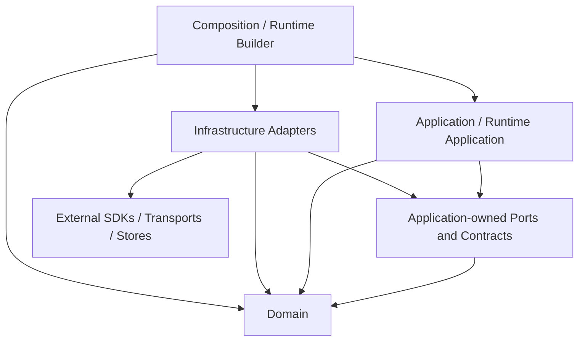

# Target Architecture

## 1. 文档状态与证据规则

- **状态：** Draft
- **版本：** 0.2
- **日期：** 2026-08-28
- **所有者：** 项目所有者
- **执行计划：** [AF-03 Target Architecture Execution Plan](../roadmap/af-03-target-architecture-plan.md)
- **父计划：** [Architecture Foundation Plan](../roadmap/architecture-foundation-plan.md) AF-03
- **规范词汇：** [Domain Glossary](domain-glossary.md)
- **架构约束：** [Architecture Principles](architecture-principles.md)

本文档是目标架构草案，不描述当前实现已经完成的结构，也不授权生产迁移。AF-05/AF-06 尚未执行的内容必须保持为 Hypothesis 或 Open Question；只有对应 Spike Results 可以将其升级为有执行证据的结论。

### 1.1 证据分类

| 标记 | 含义 | 可以支持 | 不能支持 |
|---|---|---|---|
| `Accepted Constraint` | 已接受 Plan、Principle、Glossary 或 Workflow 中的约束 | Target Architecture 必须遵守的边界 | 当前代码已实现该边界 |
| `Current Fact Candidate` | 现有文档对当前实现的描述，本次未重新核验代码 | 迁移映射和 Characterization 输入 | 未经 AF-04 或代码/测试证据确认的当前事实 |
| `Historically Verified` | 文档明确记录曾做代码或测试核验 | 高优先级 Characterization 候选 | 本次仍与生产代码一致 |
| `Target Decision` | 本文经评审接受的目标结构或依赖 | 后续 ADR、Spec 和 Slice 的设计输入 | 已经实现或已经过 Spike 验证 |
| `Hypothesis` | 必须由 AF-05/AF-06 或其他 Spike 验证的可证伪判断 | Spike Spec 输入 | Accepted Result 或生产承诺 |
| `Deferred` | 明确不在 AF-03 决定或实施的事项 | 后续 Plan Item 或 Spike | 当前交付范围 |
| `Legacy Candidate` | 可能已过时、冲突或将被替代的路径/文档 | 迁移和删除审计输入 | 目标权威来源 |

### 1.2 权威输入

| 文档 | 状态 | AF-03 中的用途 |
|---|---|---|
| [Architecture Foundation Plan](../roadmap/architecture-foundation-plan.md) | Accepted v0.8 | AF-03 范围、验收、Foundation Gate 和 Slice 顺序 |
| [AF-03 Execution Plan](../roadmap/af-03-target-architecture-plan.md) | Accepted v1.0 | Phase、Check Items、Exit Gates 和停止条件 |
| [Architecture Principles](architecture-principles.md) | Accepted v1.0 | AP-01 至 AP-13 的稳定约束和验证候选 |
| [Domain Glossary](domain-glossary.md) | Accepted v1.0 | 规范术语、逻辑所有者和非含义 |
| [Development Workflow](../development-workflow.md) | Accepted v1.0 | 状态、评审、证据、DoR/DoD 和文档治理 |

发生冲突时遵循 Architecture Foundation Plan 的权威优先级。本节其他证据不得覆盖上述 `Accepted Constraint`。

## 2. Scope、Non-goals 与标注约定

### 2.1 Scope

本 Target Architecture 将定义：

- Domain、Application、Infrastructure、Composition 的职责与依赖方向；
- Provider/Model Resolution 和 per-turn Resolved Model；
- Extension、Runtime Module、Contribution、Registry 和 Registry Snapshot；
- Tool、Hook、Channel 注册与消费边界；
- Config Namespace、Schema、Extension Capability 和私有资源；
- Event、Error、Lifecycle、Resource Ownership 和 Shutdown；
- Runtime Builder、RuntimeApp、Runner 和 Session 的责任边界；
- Parent Turn、Subagent Turn、Tool、Channel、Extension 变更与关闭调用流；
- Legacy/Compat 单向依赖和 Slice 1–6 迁移边界；
- AF-04、AF-05、AF-06 所需的验证输入。

### 2.2 Non-goals

- 修改生产代码、目录、公共类型或配置格式；
- 实现 Characterization/Fitness Tests；
- 执行 Provider/Model 或 Extension Framework Spike；
- 将 Hypothesis 写成已验证的接口、Schema 或并发算法；
- 提前允许生产动态 Contribution 变更；
- 设计 Marketplace、远程下载、任意热加载、沙箱或分布式 Event Bus；
- 解除 Subagent Batch、并发、Background、Detached、Handoff 或 Agent Team 的 Foundation 范围冻结；
- 让全部生产 Slice 提前达到 Definition of Ready。

### 2.3 章节状态

Phase 1–6 填写目标章节时，每个重要结论必须使用以下前缀之一：

- **Accepted Constraint：** 来自 1.2 节权威输入且不可被本 Draft 静默改写的约束；
- **Target Decision：** AF-03 可以接受的目标边界；
- **Hypothesis：** 必须由 Spike 执行证据验证；
- **Open Question：** 当前证据不足且会影响后续边界；
- **Deferred：** 已确认不属于 AF-03；
- **Current Fact Candidate：** 仅用于描述迁移起点，并链接证据等级。

## 3. Evidence Baseline

本节记录 Phase 0 的文档证据盘点。所有 Current Fact 均为文档证据，除非特别标记为 `Historically Verified`；本阶段没有扫描生产代码。

### 3.1 Current Fact 候选

| 文档 | 证据等级 | 可用于 AF-03 的范围 | 局限 |
|---|---|---|---|
| [Current Overview](current/overview.md) | Current Fact Candidate | 2026-05 模块地图、Turn 流和模块职责候选 | 快照可能落后；只部分同步到 2026-08-27 |
| [Current Runtime](current/runtime.md) | Current Fact Candidate | Runtime 装配、队列、路由、Fanout、Abort、Lifecycle 候选 | 文档自列与 v1.0 的差异和规划项 |
| [Current Runner](current/core_runner.md) | Current Fact Candidate | Tool Use Loop、上下文管理、Event 和 in-turn 输入候选 | 本次未复核实现；后续行为可能未同步 |
| [Current Channel](current/adapter_channel.md) | Current Fact Candidate | CLI/WebSocket、Interaction、路由和多客户端候选 | 存在设计演进和规划项 |
| [Current Config](current/platform_config.md) | Current Fact Candidate | Config 来源、合并和工具策略候选 | 文档明确记录与代码及后续配置文档的差异 |
| [Current LLM Adapter](current/adapter_llm.md) | Current Fact Candidate | LLM Port/Adapter 和 Anthropic 协议映射候选 | 未按 Target Model Resolution 术语组织 |
| [Current Tools](current/core_tools.md) | Current Fact Candidate | Tool Contract、执行与定义转换候选 | 不代表统一 Extension Registry 已存在 |
| [Current Builtin Tools](current/core_tools_builtin.md) | Current Fact Candidate | Builtin Tool 分类和资源需求候选 | 不能作为 Runtime Module 目标结构的证据 |
| [Current Session](current/core_session.md) | Current Fact Candidate | JSONL、Session/Transcript 和并发边界候选 | 需 AF-04 Characterization 保护 |
| [Current Prompt](current/core_prompt.md) | Current Fact Candidate | Prompt 构建和 Context Hook 候选 | 与未来 Extension Hook 边界需重新区分 |
| [Current Memory](current/core_memory.md) | Current Fact Candidate | Memory Port/Store 和可选降级候选 | 本次未复核实现和资源关闭行为 |
| [Current Workspace](current/core_workspace.md) | Current Fact Candidate | Workspace 初始化和上下文加载候选 | 不自动决定 Domain/Application 归属 |
| [Current Logger](current/platform_logger.md) | Current Fact Candidate | Logger Port/Adapter、启动缓冲和关闭候选 | 全局状态与目标 Resource Ownership 需评审 |
| [Agent Capabilities](../agent-capabilities.md) | Mixed Evidence Summary | 当前能力、限制和验证等级总览 | 二级汇总，不能替代源文档或本次代码核验 |

### 3.2 文档记录曾核验的行为

| 文档 | 证据等级 | 记录的核验范围 | AF-03 用法 |
|---|---|---|---|
| [Multi-client User Message Spec](channel-multi-client-user-message-spec.md) | Historically Verified | Runtime intake、WebSocket broadcast、CLI rendering、message/run correlation | AF-04 Characterization 输入；保持 Fanout/关联行为 |
| [Abort Spec](core-abort-spec.md) | Historically Verified | Runtime、Runner、LLM、Channel、Subagent、Exec 的 Abort 链路 | AF-04 Characterization 输入；保持级联中止和队列语义 |
| [Agent Capabilities](../agent-capabilities.md) | Historically Verified Summary | 2026-08-27 对广播和 Abort 的代码/测试核验记录 | 只证明文档记录过核验，不代表本次重新验证 |

### 3.3 混合、冲突与 Legacy 风险

| 文档或区域 | 风险 | AF-03 使用规则 |
|---|---|---|
| [Root README](../../README.md) | Project Structure 仍是旧顶层目录形态 | 仅作为产品入口，不作为模块映射权威 |
| `docs/architecture/current/` | 2026-05 快照，部分文档自列差异或规划项 | 逐文件作为 Current Fact Candidate，不整体升级为 Current Architecture |
| [Current Config](current/platform_config.md) | 工具命名、logger、fs 等与 v1.0 描述存在差异 | Config 目标边界受 AP-02 和 AF-05/06 约束；旧字段不自动成为目标 |
| [Platform Config Restructure Implementation](platform-config-restructure-impl.md) | Implementation 记录无 Accepted/Validated 状态 | 作为迁移历史和候选调用方，不固定目标 API |
| [Channel Design](adapters-channel-design.md) | 状态为设计中、待确认 | 作为历史设计输入，不覆盖 Accepted Principles |
| [WebSocket Channel Design](adapters-websocket-channel-design.md) | 状态为设计中、待确认 | 只提取传输约束候选 |
| [Subagent Evolution Proposal](core-subagent-evolution-proposal.md) | Proposal，未进入 Accepted Spec | 作为 Deferred/后续方向，不解除 Foundation 冻结 |
| [Subagent v2 Spec](core-subagent-v2-spec.md) | 并发设计与当前 Foundation 范围冻结并存 | 作为历史或未来输入，不写入 AF-03 当前交付范围 |
| [Runner Emit Context Refactor](core-runner-emit-context-refactor.md) | 明确未实施 | 作为架构债候选，不作为 Current Fact |
| [Exec Flow Design](core-tools-builtin-exec-flow-design.md) | 引用已不存在的回归清单 | AF-04 需重建验证输入，不依赖失效链接 |

`docs/analysis/` 当前包含有效的比较分析入口，但它们只作为设计参考，不是 my-agent Current Fact 或 Target Constraint。

### 3.4 术语防混用检查清单

以下检查依据 [Domain Glossary](domain-glossary.md) 的定义与非含义建立，并适用于本文后续所有 Target Decision、Hypothesis、图和追踪矩阵：

- [x] `Config`/`Provider Connection` 只表示部署或连接输入，不代称 `Model Descriptor` 中的 Model Facts；
- [x] `Model Descriptor`/Model Facts 只表示可追踪的模型事实，不代称 `Model Policy`、用户偏好或 Request Override；
- [x] `Model Policy` 只表示选择、允许、fallback 和限制规则，不代称 Facts、Connection 或最终执行配置；
- [x] `Request Override` 只表示单个 Turn 的允许字段覆盖，不代称全局 Config、Facts 或 Policy；
- [x] `Resolved Model` 表示一次 Turn 的不可变模型执行结果，不代称 Model Reference、Catalog 条目或可变 Client；
- [x] `Registry` 表示可发现 Contribution 的集合和查找机制，不代称一次 Turn 固定的 `Registry Snapshot`；
- [x] `Registry Snapshot` 表示某一版本的不可变视图，不代称 Config、Registry 本体或动态启停事务；
- [x] `Extension Capability` 表示最小受限平台能力，不代称 Model Capability、Channel Capability 或通用 Service Locator；
- [x] `Runtime Module` 与 `External Extension` 表示不同来源，不能代称其提供的 `Contribution`；
- [x] `Current Architecture`、`Target Architecture`、`Hypothesis` 和 `Legacy` 按证据状态使用，不按文档目录或年代推断。

## 4. Logical Boundaries and Dependency Direction

**Phase：** 1

本节定义逻辑所有权和源码依赖方向，不要求当前目录立即重排。目录、文件和公共类型的迁移只能在 Characterization/Fitness 保护下由后续 Architecture Slice 执行。

### 4.1 四个逻辑边界

| 边界 | 拥有 | 可以依赖 | 禁止拥有或依赖 |
|---|---|---|---|
| Domain | Session、Turn、Message、Event 等核心概念、值、不变量和与集成无关的行为 | Domain 内部类型和标准语言能力 | Application 用例、Provider/Channel SDK、Transport、Store 实现、Config loader、Runtime、Composition |
| Application | Turn Execution、Model Resolution、Subagent Orchestration 等用例；Application Policy；所需的 core-owned Port | Domain；Application 自己拥有的 Port/Contract | 具体 SDK、Transport、Store、配置文件格式、Composition Root、进程级资源创建和释放 |
| Infrastructure | Provider、Channel、Store、文件系统、日志和其他外部机制的 Adapter；协议、错误、事件和数据映射 | 被实现或调用的 core-owned Port/Contract；必要 Domain 类型；外部 SDK | 业务 Policy、Application 用例所有权、Composition Root、RuntimeApp 私有状态 |
| Composition | 配置加载与验证、具体实现选择、Module/Extension 发现、对象图构建、进程级资源启动和部分失败清理 | Domain、Application、Infrastructure 的公开构造/注册入口 | Turn/队列业务、Runner 执行循环、领域规则、通用 DI Container、任意模块可访问的服务集合 |

**Accepted Constraint：** Stable Core 是 Domain、Application 及其拥有的公共契约，不是单个目录。Stable Core 不依赖 Infrastructure 或 Composition；Port 由需要外部行为的 Stable Core 边界拥有，Adapter 依赖并实现该 Port。

**Target Decision：** Runtime Application 属于 Application 边界。它可以编排 Domain 概念和 Application 服务，但不能加载配置、发现实现或识别具体 Provider/Channel 类型。

### 4.2 源码依赖方向

箭头只表示源码依赖方向，不保证运行时调用同向。Infrastructure Adapter 在运行时可以被 Application 通过 Port 调用，但源码仍由 Adapter 指向 core-owned Port。



```text
Composition / Runtime Builder ──> Infrastructure Adapters ──> External SDKs
			  │                         │
			  │                         ├─implements─> Application-owned Ports
			  │                         └────────────> Domain types
			  ├─────────────────────────────────────> Application
			  └─────────────────────────────────────> Domain

Application / Runtime Application ──> Application-owned Ports ──> Domain
Application / Runtime Application ──────────────────────────────> Domain

Forbidden reverse edges:
Domain -X-> Application / Infrastructure / Composition
Application -X-> Infrastructure / Composition / concrete SDKs
Infrastructure -X-> Composition / RuntimeApp private state
```

允许边：

- Domain 只能依赖 Domain 内部；
- Application 可以依赖 Domain 和 Application 拥有的 Port/Contract；
- Infrastructure 可以依赖其实现的 Stable Core Port/Contract、必要 Domain 类型和外部 SDK；
- Composition 可以依赖所有边界的公开构造/注册入口，以选择并连接具体实现；
- 测试 Fake 可以实现 core-owned Port，但不能成为生产 Service Locator。

禁止边：

- Domain/Application 导入 Infrastructure、Composition 或具体 Provider/Channel SDK；
- Stable Core 的公共契约暴露外部 SDK 类型；
- RuntimeApp/Runner 导入 Config loader、具体 Provider/Channel、可变 Registry 或 Extension loader；
- Adapter 访问 RuntimeApp 私有状态或从 Composition 反向解析服务；
- 新核心依赖 Compatibility Adapter 或 Legacy 权威路径；
- 为每个类机械创建无第二实现、Fake 或独立验证价值的 Port。

### 4.3 Runtime、Runner 与 Composition

| 所有者 | 唯一职责 | 不负责 |
|---|---|---|
| Composition Root | 进程入口处选择 Config source、Builtin Runtime Module、External Extension 和具体 Adapter；调用 Runtime Builder | 队列、Turn、Model Resolution、Runner 循环、Channel 路由 |
| Runtime Builder | 验证构建输入，发现并创建组件，收集 Contribution，建立 Registry/资源图，按依赖顺序启动，并清理部分启动失败 | 处理用户消息、调度 Turn、执行 Tool Use Loop、成为全局服务容器 |
| RuntimeApp | 接收入站请求，维护 per-session 队列，创建和调度 Turn，捕获 Turn 所需 Snapshot，维护路由/Fanout/取消，并编排 Shutdown 请求 | 加载 Config、发现 Module/Extension、解析 Model Facts、构造具体 Adapter、执行 LLM/Tool 循环 |
| Runner | 在一个 Turn 内执行 LLM/Tool 循环、上下文预算/压缩、Tool 前后 Hook、执行事件和结果 | 加载 Config、创建 Session/Provider/Channel、发现 Module、管理进程级资源、调度其他 Session |

**Target Decision：** 当前 `src/runtime/` 的职责必须按上表逻辑拆分：`RuntimeApp` 的队列/Turn/路由/Fanout/取消属于 Runtime Application；bootstrap、具体实现选择和注册表构建属于 Composition。该决定不要求 AF-03 内移动目录。

**Target Decision：** Runtime Builder 把构建完成的显式依赖交给 RuntimeApp。RuntimeApp 与 Runner 不得保存 Runtime Builder、Composition Root 或可解析任意服务的容器引用。

### 4.4 Provider 的分发与扩展边界

**Target Decision：** my-agent 发行版只捆绑并由项目维护 Anthropic Provider Integration。Anthropic 是 Bundled Runtime Module，但必须通过与 External Extension 相同的 core-owned Provider Contract、Contribution、Registry 和 Lifecycle 机制接入；Stable Core 不包含 Anthropic 特殊分支。

**Target Decision：** OpenAI、Gemini、Bedrock 等其他 Provider 不属于 my-agent 的内置能力或兼容性承诺。它们可以由第三方 External Extension 提供，具体 Adapter、SDK、配置、Model Facts、测试、发布和兼容性由该 Extension 维护者负责。

**Accepted Constraint：** my-agent 负责 Provider Extension Contract、注册冲突检测、Registry Snapshot、Model Resolution 公共语义和 Contract Test Kit；第三方负责其 Provider Contribution 的正确性。Builtin 与 External 的来源差异不能泄漏给 Application 消费者。

**Accepted Constraint：** 可运行发行版必须至少捆绑一个 Provider Integration，但 Provider 已注册不等于 Runtime 已就绪。缺少有效 Provider Connection 或 Model Reference 时必须显式进入不可接受 Turn 的状态，不能静默切换 Provider、产生费用或使用测试 Fake。

**Deferred：** Provider Contribution 字段、Model Catalog/Descriptor 关系、Connection Schema、Model Resolution 顺序和失败语义由 Phase 2–3 定义；动态启停、Snapshot 切换、排空和回滚由 Phase 4/AF-06 验证。AF-05 可以使用独立 Fake 或实验 Provider 验证第二实现，不构成对 OpenAI 或其他 Provider 的生产支持承诺。

### 4.5 当前模块到目标边界的候选映射

以下映射是基于 Current 文档的 `Current Fact Candidate`，不是本次代码核验结果，也不授权立即移动文件。

| 当前区域 | 目标逻辑所有权候选 | 迁移说明 |
|---|---|---|
| `src/runtime/RuntimeApp.ts` 及队列/路由状态 | Application / Runtime Application | 保留队列、Turn、路由、Fanout、取消和 Shutdown 编排；移出构建与具体实现选择 |
| `src/runtime/bootstrap.ts`、具体注册表构建、配置到实现映射 | Composition / Runtime Builder | 从 RuntimeApp 运行职责中分离；只保留公开构造/注册入口依赖 |
| `src/core/runner/` | Application / Turn Execution | 保留执行循环；Port/领域类型按所有权拆分，不读取 Config 或发现实现 |
| `src/core/session/` | Domain + Application Port + Infrastructure Store | Session 语义和 Contract 留在 Stable Core；JSONL/I/O 实现归 Infrastructure |
| `src/core/prompt/` | Application | 编排 Prompt 用例；Provider 特有消息格式归 Provider Adapter |
| `src/core/tools/` | Domain Contract + Application Tool Execution | Tool 契约和执行语义留在 Stable Core；外部 I/O 由 Adapter/Module 实现 |
| `src/core/tools/builtin/` | Bundled Runtime Module + Infrastructure | 作为 Bundled Contribution 接入；文件、网络、进程 I/O 不成为 Domain |
| `src/core/memory/` | Application Port/Policy + Infrastructure Store | 检索用例与存储/索引实现按 Port 分离 |
| `src/core/workspace/` | Application Use Case + Infrastructure File Adapter | Workspace 规则与文件系统读取按所有权分离 |
| `src/adapters/llm/` | Infrastructure Provider Integration | Model invocation Port 移交 Stable Core 所有；Anthropic 实现成为 Bundled Runtime Module |
| `src/adapters/channel/` | Infrastructure Channel Integration | Channel Contract 移交 Stable Core；CLI/WebSocket Transport 留在 Adapter；Interaction 协调责任由后续调用流确认 |
| `src/platform/config/` | Composition + Configuration Input | Config 加载/验证在 Composition；不能把 Config 对象透传为全局服务 |
| `src/platform/logger/` | Application-owned Observability Port + Infrastructure Adapter | 目标边界使用显式 Port；当前全局静态状态作为 Legacy Candidate 评估 |

**Legacy Candidate：** `src/runtime/`、`src/core/session/`、`src/core/memory/`、`src/core/workspace/` 和 `src/platform/logger/` 都可能同时包含多个逻辑边界。后续 Slice 应迁移权威类型和真实调用方，而不是仅为目录整齐做一次性重排。

### 4.6 不使用通用 DI Container 或 Service Locator

Phase 1 的构造原则足以表达当前目标对象图：

1. Composition Root 显式选择 Module、Extension 和 Adapter；
2. Runtime Builder 依据声明的构建输入创建有限对象图；
3. 消费者通过构造参数或明确用例参数接收所需 Port、Registry Snapshot 或受限 Capability；
4. Registry 只查询特定领域的 Contribution，不解析任意应用服务；
5. Extension Capability 只暴露获准的最小平台能力，不能取得 RuntimeApp 或容器；
6. Resource Ownership 表记录创建者和关闭者，不能依靠容器作用域隐式释放。

因此，通用 `get<T>(token)`、全局服务映射或 RuntimeApp 私有状态访问不会提供必要业务语义，只会隐藏依赖和 Lifecycle Owner，属于禁止设计。

### 4.7 AF-04 Fitness Test 候选

| ID | 候选规则 | 验证方式 | 对应原则 |
|---|---|---|---|
| P1-FT-01 | Domain/Application 不导入 Infrastructure 或 Composition | import graph / dependency rule | AP-01 |
| P1-FT-02 | Provider/Channel SDK 只出现在对应 Infrastructure Integration | package import allowlist | AP-01 |
| P1-FT-03 | Runner 不依赖 Config loader、具体 Provider、Extension loader 或可变 Registry | import rule + public constructor check | AP-01、AP-03、AP-05、AP-11 |
| P1-FT-04 | RuntimeApp 不依赖具体 Provider/Channel 类型或 Composition 服务 | import rule + RuntimeApp responsibility tests | AP-01、AP-11 |
| P1-FT-05 | Infrastructure Adapter 依赖并实现 core-owned Port，Stable Core 不导入 Adapter | import graph + Fake Adapter Contract Tests | AP-01、AP-06 |
| P1-FT-06 | Extension/Module 不访问 RuntimeApp 私有状态或通用 Service Locator | forbidden import/symbol rule | AP-08、AP-11 |
| P1-FT-07 | 新增测试 Provider Extension 不修改 Runner、RuntimeApp 或核心领域联合类型 | change-locality test / review check | AP-01、AP-04、AP-12 |
| P1-FT-08 | 新核心不依赖 Compat/Legacy 路径 | import graph / path denylist | AP-06、AP-07 |

这些是 AF-04 的候选输入，不表示当前目录已经满足规则。AF-04 必须根据实际代码、测试和构建工具确认可执行路径与必要例外。

### 4.8 Phase 1 完成条件

- [x] Stable Core 不依赖具体 Provider/Channel SDK、Store 或 Composition；
- [x] Runtime/Runner/Composition 无重叠所有权；
- [x] 不引入通用 DI Container 或 Service Locator；
- [x] 依赖规则可以由静态检查表达。

独立复审未发现 Critical 或 High 问题，并确认 10 个 Phase 1 Check Items、3 个 Exit Gate、Mermaid/ASCII 等价性和 AF-04 Fitness Test 候选均有设计证据。项目所有者于 2026-08-28 接受 Phase 1 的逻辑边界、依赖方向、Provider 分发约束和候选迁移映射。该接受只完成 Phase 1，不表示当前代码已满足目标依赖规则，也不表示 Target Architecture 整体已接受。

## 5. Provider and Model Resolution

**Phase：** 2

本节将在 Phase 2 定义 Provider、Provider Connection、Protocol、Model Reference、Model Descriptor、Model Policy、Request Override、Model Catalog、Model Resolver、Resolved Model 和模型调用 Port。

### 5.1 待产出

- 事实、连接、策略和请求覆盖的来源/所有权表；
- Parent Turn 与 Subagent Turn 的 Model Resolution 调用流；
- Resolved Model 的 per-turn 不变量；
- Provider Adapter 与 core-owned Port 的依赖方向；
- AF-05 Hypothesis、最小实验、成功条件和停止条件。

### 5.2 Phase 2 完成条件

- [ ] Runner 只消费 Resolved Model，不加载 Config 或推断 Model Facts；
- [ ] Model 切换同步切换 Port、Protocol、Endpoint 和 Model Capability facts；
- [ ] Parent/Subagent 可以解析不同 Model 且不共享可变 Client 状态；
- [ ] 未验证的 Catalog/fallback 规则仍标记为 Hypothesis。

## 6. Extension、Module、Contribution and Registry

**Phase：** 3

本节将在 Phase 3 定义 Runtime Module、External Extension、Contribution、Tool/Hook/Channel Registry、启动期只读 Registry Snapshot、Config Namespace、Schema、Extension Capability 和私有资源边界。

### 6.1 待产出

- Builtin/External 共同注册和 Lifecycle 模型；
- Tool、Hook、Channel Contribution 的分类与消费关系；
- Extension 配置和受限上下文边界；
- 跨 Channel/Tool/Hook 测试 Extension 静态组合图；
- AF-06 待验证的接口形状和失败条件。

### 6.2 Phase 3 完成条件

- [ ] 新 Extension 不要求修改 Runtime、Runner、Bootstrap 或中央类型联合；
- [ ] Extension 私有资源不成为全局 Service Locator；
- [ ] Builtin/External 差异不泄漏给 Contribution 消费者；
- [ ] Slice 3/4 只使用启动期只读 Snapshot。

## 7. Registry Snapshot and Lifecycle Transactions

**Phase：** 4

本节将在 Phase 4 定义版本化不可变 Snapshot、per-turn 捕获、Extension 变更事务、原子切换、排空、取消、回滚、部分失败清理和 Shutdown 顺序。

### 7.1 待产出

- Snapshot 和 Extension 变更事务不变量；
- enable、disable、failure rollback 和 shutdown 调用流；
- Resource Ownership 与唯一 Lifecycle Owner 表；
- AF-06 并发、排空和资源实验输入。

### 7.2 Phase 4 完成条件

- [ ] 一个 Turn 不观察混合版本 Contribution；
- [ ] 失败后当前 Snapshot 仍可用且无部分资源残留；
- [ ] AF-06 验证完整机制，Slice 5 才实现并开放生产运行时变更；
- [ ] 未经 Spike 验证的算法和接口仍标记为 Hypothesis。

## 8. Runtime Call Flows and Ownership

**Phase：** 5

本节将在 Phase 5 使用端到端调用流验证分层和唯一所有权。

### 8.1 待产出

- Channel 入站到结果 Fanout 的完整 Turn 流；
- Tool Definition、Tool 执行和 Tool Result 流；
- Channel 注册、start/stop 和 optional Channel Capability 流；
- Subagent 委派、独立 Model Resolution、Usage/Event/Abort 返回流；
- Runtime 启动、部分失败清理和 Shutdown 流；
- Event、Error、Abort、并发和资源释放所有权表；
- Mermaid 调用流及语义一致的 ASCII fallback。

### 8.2 Phase 5 完成条件

- [ ] Turn、Tool、Channel 和 Subagent 四类流支持 AF-03 边界验收；
- [ ] 简单调用链没有无业务价值的机械转换层；
- [ ] 每个长生命周期资源有唯一创建和释放责任；
- [ ] RuntimeApp 最终只保留队列、Turn、路由、Fanout 和 Shutdown 编排。

## 9. Legacy、Compat and Migration Boundaries

**Phase：** 5

本节将在 Phase 5 映射 Current 类型到目标术语，并定义 Slice 1–6 的新权威路径、Compatibility 和删除边界。

### 9.1 待产出

- Current/Target 术语迁移表；
- Legacy Public API -> Compatibility Adapter -> New Authoritative Core 单向依赖图；
- Slice 1–6 的候选真实调用方和删除条件；
- Legacy 文档候选与后继入口；
- Feature Flag、发布回滚和 Compatibility 到期规则。

### 9.2 Phase 5 完成条件

- [ ] 新核心不依赖 Compat/Legacy；
- [ ] 每个 Slice 都指向真实调用方和旧路径删除条件；
- [ ] 不在 AF-03 执行目录/类型重命名或生产迁移。

## 10. Verification and Acceptance Matrix

**Phase：** 6

本节将在 Phase 6 汇总 AF-03 覆盖、原则、证据和独立评审结果。

### 10.1 Foundation AF-03 追踪矩阵

“主责章节”是该要求的唯一权威定义位置；“支持章节”只引用、应用或验证该定义，不得创建第二套语义。

| 类型 | Foundation AF-03 要求 | 主责章节 | 支持章节 | 当前状态 | 预期证据 |
|---|---|---:|---:|---|---|
| 必须覆盖 | 模块职责与依赖方向 | 4 | 8、10 | Planned | 边界表、依赖图、允许/禁止边 |
| 必须覆盖 | Provider/Model Resolution | 5 | 8、Appendix B | Planned | 责任表、Parent/Subagent 调用流、AF-05 输入 |
| 必须覆盖 | Extension/Module/Contribution/Registry | 6 | 7、Appendix C | Planned | 静态组合图、注册和配置边界 |
| 必须覆盖 | Snapshot/事务/原子切换/排空/回滚 | 7 | 8、Appendix C | Planned | 不变量、动态流、AF-06 输入 |
| 必须覆盖 | Runtime Builder 与 RuntimeApp | 4 | 8 | Planned | 职责表、启动/Turn/Shutdown 流 |
| 必须覆盖 | Tool/Hook/Channel 注册 | 6 | 8 | Planned | Registry 关系和端到端流 |
| 必须覆盖 | Config Namespace 与 Schema | 6 | Appendix C | Planned | 所有权选项和 AF-06 Hypothesis |
| 必须覆盖 | 私有资源/受限上下文/平台能力 | 6 | 7、Appendix C | Planned | Extension Capability、作用域、Lifecycle |
| 必须覆盖 | Event/Error/Lifecycle/Resource Ownership | 8 | 7、10 | Planned | 所有权表、失败和关闭流 |
| 必须覆盖 | Legacy/Compat | 9 | 10 | Planned | 单向依赖、Slice 迁移/删除边界 |
| 必须覆盖 | 关键调用流和关闭顺序 | 8 | 5、7 | Planned | Mermaid + ASCII 调用流 |
| 验收 | Turn/Tool/Channel/Subagent 调用流验证分层 | 8 | 10 | Planned | 四类调用流评审记录 |
| 验收 | 跨 Channel/Tool/Hook External Extension | 6 | 7、10、Appendix C | Planned | 组合图与 AF-06 实验输入 |
| 验收 | 旧/新 Registry Snapshot 一致性 | 7 | 10、Appendix C | Planned | 不变量与 AF-06 验证场景 |
| 验收 | 无业务价值机械转换层 | 8 | 4、10 | Planned | 调用链审查记录 |
| 验收 | Stable Core/Infrastructure Adapter 边界 | 4 | 10 | Planned | 依赖图与 Fitness Test 输入 |
| 验收 | 无通用 Service Locator | 4 | 6、10 | Planned | 显式 Port/Extension Capability 映射 |

### 10.2 Architecture Principles 映射

| Principle | 主要目标章节 | 设计证据 | 后续验证 | 当前状态 |
|---|---:|---|---|---|
| AP-01 Stable Core 不依赖具体集成 | 4、5 | 依赖图、Port/Adapter 边界 | FT-01、FT-02、Contract | Planned |
| AP-02 配置/事实/策略分离 | 5 | 来源和所有权表 | Resolver Unit Tests | Planned |
| AP-03 per-turn Resolved Model | 5、8 | Parent/Subagent 调用流 | Resolver/Runner Contract | Planned |
| AP-04 Builtin/External 同机制 | 6 | 跨贡献 Extension 组合图 | AF-06、Contract | Planned |
| AP-05 不可变 Registry Snapshot | 7 | Snapshot/事务不变量 | AF-06、immutability tests | Planned |
| AP-06 单一权威来源 | 4、5、6、9 | 责任表和迁移表 | 类型/导出/调用路径审计 | Planned |
| AP-07 Compat 单向进入新核心 | 9 | 单向依赖和删除规则 | FT-04、Slice 审计 | Planned |
| AP-08 最小 Extension Capability | 6、7 | Capability/私有资源边界 | AF-06、denial tests | Planned |
| AP-09 公共行为显式契约 | 7、8、10 | Event/Error/并发/Lifecycle 表 | Contract/Integration | Planned |
| AP-10 唯一 Lifecycle Owner | 7、8 | Resource Ownership 和关闭流 | failure injection | Planned |
| AP-11 Runtime/Composition 分责 | 4、8 | 职责表和启动/Turn 流 | FT-05、RuntimeApp/Runner 职责测试、构造依赖与变更局部性检查 | Planned |
| AP-12 抽象由当前证据证明 | 4、5、6、8 | 第二实现/Fake/Spike 映射 | Architecture Review | Planned |
| AP-13 区分事实/目标/历史 | 1、3、9、10 | 证据分类和 Legacy 表 | 文档状态/链接检查 | In Progress |

## 11. Assumptions、Open Questions and Deferred

### 11.1 Assumptions

1. AF-03 的权威约束只来自本文件 1.2 节列出的 Accepted 文档；
2. Current 文档只作为候选迁移起点，需 AF-04 或后续代码/测试证据升级；
3. Target Architecture 可以接受逻辑骨架和可验证契约，但不能把 AF-05/AF-06 Hypothesis 写成 Results；
4. 历史核验过的用户消息 Fanout/correlation 与 Abort 行为优先保留；更广的 Runner、Session 和 Channel 行为只是 AF-04 前的保留候选；
5. 动态 Registry 在 AF-06 验证完整机制，Slice 3/4 只接入启动期只读 Snapshot，Slice 5 才开放生产运行时变更；
6. 目录、类型和公共接口映射由 Phase 1–5 逐步定义，本 Phase 不做重命名或实现。

### 11.2 Open Questions

| ID | Question | 影响 | 解决阶段 |
|---|---|---|---|
| OQ-01 | 哪些 Current 文档可在 AF-04 后升级为 Current Architecture 权威入口？ | 迁移起点和 Legacy 清单 | AF-04 / Slice 6 |
| OQ-02 | Model Catalog 事实来源的合并优先级和缺失事实 fallback 是什么？ | Resolved Model 正确性 | Phase 2 -> AF-05 |
| OQ-03 | Parent/Subagent 不同 Model 的最小共享边界是什么？ | Client 状态和 Usage/Abort/Event | Phase 2 -> AF-05 |
| OQ-04 | Extension Config 使用自校验 Namespace 还是中央 Schema 注册？ | 配置所有权和启用事务 | Phase 3 -> AF-06 |
| OQ-05 | Extension Capability 和受限运行上下文的最小接口是什么？ | 权限和平台专有 Tool | Phase 3 -> AF-06 |
| OQ-06 | Extension 停用时哪些工作排空、哪些按策略取消？ | Snapshot 和资源释放 | Phase 4 -> AF-06 |
| OQ-07 | Config 重构后哪些字段和工具策略是 Current Fact？ | Current/Target 映射 | Phase 0/1 -> AF-04 |
| OQ-08 | Exec 回归清单缺失后，AF-04 使用哪些现有测试重建保护线？ | Characterization 完整性 | AF-04 |

### 11.3 Deferred

| Item | Deferred To | 理由 |
|---|---|---|
| 生产代码、目录和公共类型修改 | Architecture Slice | AF-03 只定义目标骨架 |
| Characterization/Fitness Test 实现 | AF-04 | AF-03 只提供规则和行为输入 |
| Provider/Model Catalog/fallback 执行验证 | AF-05 | 需要可证伪实验和 Provider 证据 |
| Extension 动态启停、Snapshot、排空和回滚执行验证 | AF-06 | 需要失败注入和资源实验 |
| Marketplace、远程下载、任意热加载、沙箱、分布式 Event Bus | Future Plan | Foundation 非目标 |
| Subagent Batch、并发、Background、Detached、Handoff、Agent Team | Future Plan | Foundation 范围冻结 |
| 生产动态 Contribution 变更 | Slice 5 | AF-06 先验证，Slice 3/4 仅只读 Snapshot |

## 12. Phase 0 Checklist

- [x] 建立 AF-03 必须覆盖项到 Target Architecture 章节的追踪矩阵；
- [x] 建立 AP-01 至 AP-13 到设计章节和验证方式的追踪矩阵；
- [x] 列出可作为 Current Fact Candidate 的文档并记录证据等级；
- [x] 列出混合、冲突或过期风险文档及使用规则；
- [x] 建立术语检查清单，禁止 Config、Facts、Policy 或 Snapshot 相互代称；
- [x] 创建 Target Architecture Draft 骨架；
- [x] 记录初始 Assumptions、Open Questions 和 Deferred；
- [x] 独立复审 Phase 0 证据基线和追踪矩阵，并修正唯一主责章节、术语证据、原则映射和过度表述；

独立复审未发现 Critical 问题；首轮发现 3 个 High 和 4 个 Medium 问题，均已在 Draft v0.1 内处理。项目所有者于 2026-08-28 接受 Phase 0 的输入基线、证据边界、章节骨架和追踪矩阵；该接受不代表 Target Architecture 整体已接受。

## Appendix A. AF-04 Inputs

Phase 6 将在此维护 Characterization 行为、Fitness Test 规则和预期失败样例。Phase 0 的初始输入包括：

- Runtime 启动和 Shutdown；
- Turn Event 顺序与 Tool Use/Result 配对；
- Session、Compaction 和 per-session 串行；
- Channel 路由、Approval/Interaction 和 Fanout；
- 用户消息广播与 run correlation；
- Abort、队列清理和 Subagent 级联；
- FT-01 至 FT-09 与 AP-01 至 AP-13 的 many-to-many 映射，以及 AP-12 所需的 ADR、调用流、实现数量和抽象评审证据。

## Appendix B. AF-05 Provider/Model Spike Input

Phase 2 将补充 Hypothesis、最小实验、成功条件和停止条件。当前仅保留父计划边界：验证在不复制 Runner 的前提下，根据 Model Reference 解析 Provider/Model，并让每个 Parent/Subagent Turn 消费内部一致的 Resolved Model。

## Appendix C. AF-06 Extension Framework Spike Input

Phase 3–4 将补充 Hypothesis、最小实验、成功条件和停止条件。当前仅保留父计划边界：验证一个跨 Channel/Tool/Hook Extension、受限 Extension Capability、私有资源共享、不可变 Snapshot、原子切换、排空、资源释放和失败回滚。

## Appendix D. Evidence Inventory Maintenance

证据升级规则：

1. 文档声明不能自动升级为当前代码事实；
2. AF-04 Characterization 或明确的代码/测试核验可以将 Candidate 升级为 Current Fact；
3. Spike Results 只能支持其实际执行的环境、版本和场景；
4. Target Decision 不因写入本文而成为 Implemented；
5. 冲突或被替代文档必须记录后继入口和 Legacy 处理方式。
