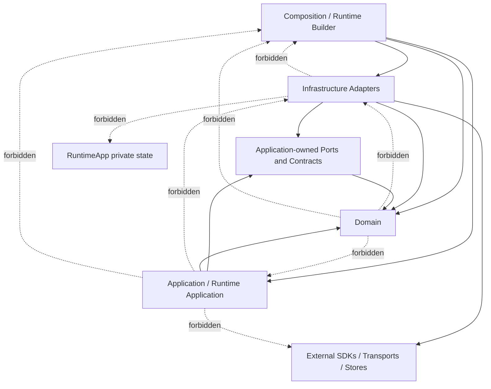
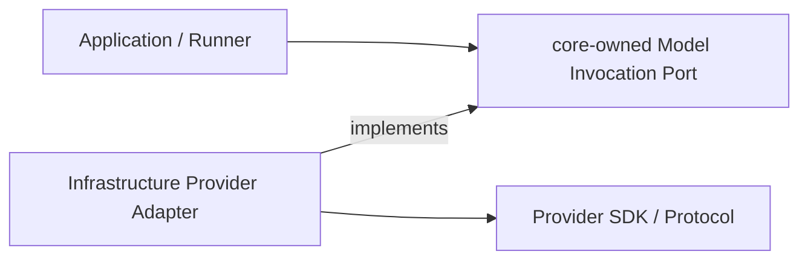
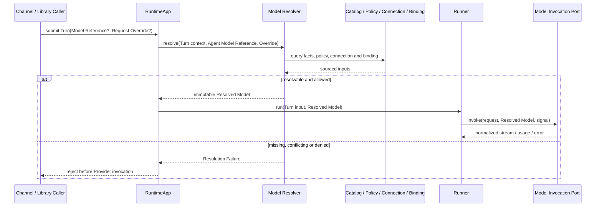
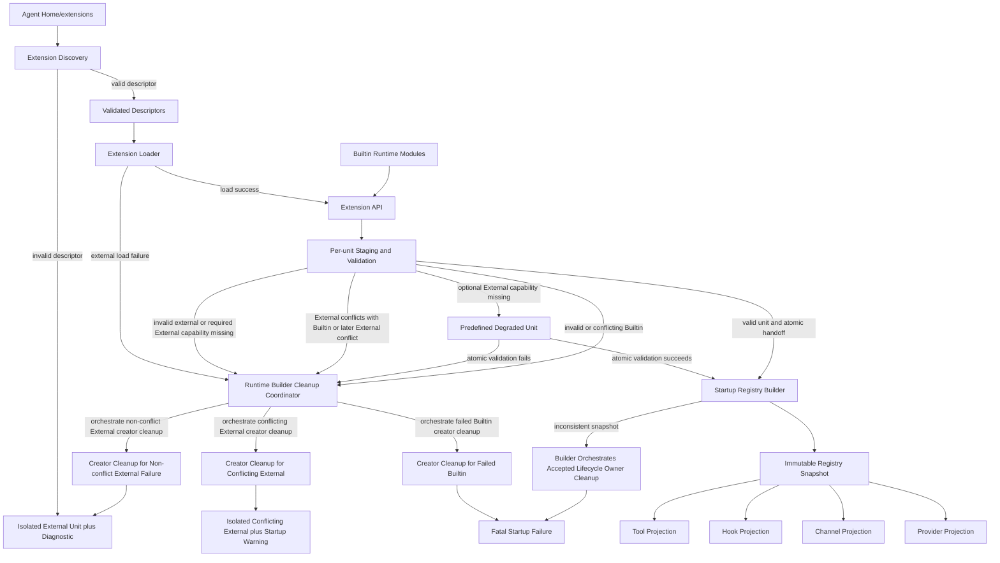
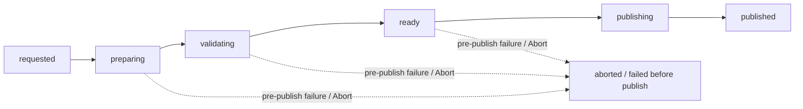
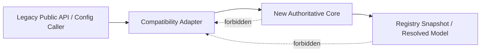

# Target Architecture

## 1. 文档状态与证据规则

- **状态：** Accepted
- **版本：** 1.4
- **日期：** 2026-09-03
- **所有者：** 项目所有者
- **执行计划：** [AF-03 Target Architecture Execution Plan](../roadmap/af-03-target-architecture-plan.md)
- **父计划：** [Architecture Foundation Plan](../roadmap/architecture-foundation-plan.md) AF-03
- **相关重要决策：** [ADR-001 Tool Result Closure and Recovery](adr-001-tool-result-closure-and-recovery.md), [ADR-002 Context Budgeting and Compaction Recovery](adr-002-context-budgeting-and-compaction-recovery.md)
- **规范词汇：** [Domain Glossary](domain-glossary.md)
- **架构约束：** [Architecture Principles](architecture-principles.md)

本文档是已接受的目标架构，不描述当前实现已经完成的结构，也不授权生产迁移。AF-05 与 AF-06 的 `Provisional Pass` Spike Results 均已获项目所有者接受并完成 disposable cleanup；`P2-H01..P2-H03`、`P3-H01..P3-H05` 与 `P4-H01..P4-H07` 因此具有各自 Results 限定范围内的 Spike evidence。该证据不表示 production implementation 完成，也不使 Foundation Gate 整体通过。

### 1.1 证据分类

| 标记 | 含义 | 可以支持 | 不能支持 |
|---|---|---|---|
| `Accepted Constraint` | 已接受 Plan、Principle、Glossary 或 Workflow 中的约束 | Target Architecture 必须遵守的边界 | 当前代码已实现该边界 |
| `Current Fact Candidate` | 现有文档对当前实现的描述，本次未重新核验代码 | 迁移映射和 Characterization 输入 | 未经 AF-04 或代码/测试证据确认的当前事实 |
| `Historically Verified` | 文档明确记录曾做代码或测试核验 | 高优先级 Characterization 候选 | 本次仍与生产代码一致 |
| `Target Decision` | 本文经评审接受的目标结构或依赖 | 后续 ADR、Spec 和 Slice 的设计输入 | 已经实现或已经过 Spike 验证 |
| `Hypothesis` | 必须由 AF-05/AF-06 或其他 Spike 验证的可证伪判断 | Spike Spec 输入 | Accepted Result 或生产承诺 |
| `Deferred` | 明确不在 AF-03 决定或实施的事项 | 后续 Plan Item 或 Spike | 当前交付范围 |
| `Legacy Candidate` | 可能已过时、冲突或将被替代的路径/文档 | 迁移和删除审计输入 | 目标权威来源 |

### 1.2 权威输入

| 文档 | 状态 | AF-03 中的用途 |
|---|---|---|
| [Architecture Foundation Plan](../roadmap/architecture-foundation-plan.md) | Accepted v1.2 | AF-03 范围、验收、Foundation Gate 和 Slice 顺序 |
| [AF-03 Execution Plan](../roadmap/af-03-target-architecture-plan.md) | Accepted v1.4 | Phase、Check Items、Exit Gates 和停止条件 |
| [Architecture Principles](architecture-principles.md) | Accepted v1.1 | AP-01 至 AP-13 的稳定约束和验证候选 |
| [Domain Glossary](domain-glossary.md) | Accepted v1.5 | 规范术语、逻辑所有者和非含义 |
| [Development Workflow](../development-workflow.md) | Accepted v1.0 | 状态、评审、证据、DoR/DoD 和文档治理 |

发生冲突时遵循 Architecture Foundation Plan 的权威优先级。本节其他证据不得覆盖上述 `Accepted Constraint`。

## 2. Scope、Non-goals 与标注约定

### 2.1 Scope

本 Target Architecture 将定义：

- Domain、Application、Infrastructure、Composition 的职责与依赖方向；
- Provider/Model Resolution 和 per-turn Resolved Model；
- Extension、Runtime Module、Contribution、Registry 和 Registry Snapshot；
- Tool、Hook、Channel 注册与消费边界；
- Config Namespace、Schema、Extension Capability 和私有资源；
- Event、Error、Lifecycle、Resource Ownership 和 Shutdown；
- Runtime Builder、RuntimeApp、Runner 和 Session 的责任边界；
- Parent Turn、Subagent Turn、Tool、Channel、Extension 变更与关闭调用流；
- Legacy/Compat 单向依赖和 Slice 1–6 迁移边界；
- AF-04、AF-05、AF-06 所需的验证输入。

### 2.2 Non-goals

- 修改生产代码、目录、公共类型或配置格式；
- 实现 Characterization/Fitness Tests；
- 执行 Provider/Model 或 Extension Framework Spike；
- 将 Hypothesis 写成已验证的接口、Schema 或并发算法；
- 提前允许生产动态 Contribution 变更；
- 设计 Marketplace、远程下载、任意热加载、沙箱或分布式 Event Bus；
- 解除 Subagent Batch、并发、Background、Detached、Handoff 或 Agent Team 的 Foundation 范围冻结；
- 让全部生产 Slice 提前达到 Definition of Ready。

### 2.3 章节状态

Phase 1–6 填写目标章节时，每个重要结论必须使用以下前缀之一：

- **Accepted Constraint：** 来自 1.2 节权威输入且不可被本文静默改写的约束；
- **Target Decision：** AF-03 可以接受的目标边界；
- **Hypothesis：** 必须由 Spike 执行证据验证；
- **Open Question：** 当前证据不足且会影响后续边界；
- **Deferred：** 已确认不属于 AF-03；
- **Verified Current Fact：** Phase 5 直接读取生产代码确认的迁移事实；只描述核验时点的当前实现，不升级为 Target Decision；
- **Current Fact Candidate：** 仅用于描述迁移起点，并链接证据等级。

## 3. Evidence Baseline

本节记录 Phase 0 的文档证据盘点。Phase 0–4 没有扫描生产代码，所有 Current Fact 均为文档证据，除非特别标记为 `Historically Verified`。Phase 5 经项目所有者授权读取生产代码后，只把带源码位置和核验日期的结论标记为 `Verified Current Fact`；未直接核验的文档陈述继续保持 `Current Fact Candidate`。

### 3.1 Current Fact 候选

| 文档 | 证据等级 | 可用于 AF-03 的范围 | 局限 |
|---|---|---|---|
| [Current Overview](current/overview.md) | Current Fact Candidate | 2026-05 模块地图、Turn 流和模块职责候选 | 快照可能落后；只部分同步到 2026-08-27 |
| [Current Runtime](current/runtime.md) | Current Fact Candidate | Runtime 装配、队列、路由、Fanout、Abort、Lifecycle 候选 | 文档自列与 v1.0 的差异和规划项 |
| [Current Runner](current/core_runner.md) | Current Fact Candidate | Tool Use Loop、上下文管理、Event 和 in-turn 输入候选 | 本次未复核实现；后续行为可能未同步 |
| [Current Channel](current/adapter_channel.md) | Current Fact Candidate | CLI/WebSocket、Interaction、路由和多客户端候选 | 存在设计演进和规划项 |
| [Current Config](current/platform_config.md) | Current Fact Candidate | Config 来源、合并和工具策略候选 | 文档明确记录与代码及后续配置文档的差异 |
| [Current LLM Adapter](current/adapter_llm.md) | Current Fact Candidate | LLM Port/Adapter 和 Anthropic 协议映射候选 | 未按 Target Model Resolution 术语组织 |
| [Current Tools](current/core_tools.md) | Current Fact Candidate | Tool Contract、执行与定义转换候选 | 不代表统一 Extension Registry 已存在 |
| [Current Builtin Tools](current/core_tools_builtin.md) | Current Fact Candidate | Builtin Tool 分类和资源需求候选 | 不能作为 Runtime Module 目标结构的证据 |
| [Current Session](current/core_session.md) | Current Fact Candidate | JSONL、Session/Transcript 和并发边界候选 | 需 AF-04 Characterization 保护 |
| [Current Prompt](current/core_prompt.md) | Current Fact Candidate | Prompt 构建和 Context Hook 候选 | 与未来 Extension Hook 边界需重新区分 |
| [Current Memory](current/core_memory.md) | Current Fact Candidate | Memory Port/Store 和可选降级候选 | 本次未复核实现和资源关闭行为 |
| [Current Workspace](current/core_workspace.md) | Current Fact Candidate | Workspace 初始化和上下文加载候选 | 不自动决定 Domain/Application 归属 |
| [Current Logger](current/platform_logger.md) | Current Fact Candidate | Logger Port/Adapter、启动缓冲和关闭候选 | 全局状态与目标 Resource Ownership 需评审 |
| [Agent Capabilities](../agent-capabilities.md) | Mixed Evidence Summary | 当前能力、限制和验证等级总览 | 二级汇总，不能替代源文档或本次代码核验 |

### 3.2 文档记录曾核验的行为

| 文档 | 证据等级 | 记录的核验范围 | AF-03 用法 |
|---|---|---|---|
| [Multi-client User Message Spec](channel-multi-client-user-message-spec.md) | Historically Verified | Runtime intake、WebSocket broadcast、CLI rendering、message/run correlation | AF-04 Characterization 输入；保持 Fanout/关联行为 |
| [Abort Spec](core-abort-spec.md) | Historically Verified | Runtime、Runner、LLM、Channel、Subagent、Exec 的 Abort 链路 | AF-04 Characterization 输入；保持级联中止和队列语义 |
| [Agent Capabilities](../agent-capabilities.md) | Historically Verified Summary | 2026-08-27 对广播和 Abort 的代码/测试核验记录 | 只证明文档记录过核验，不代表本次重新验证 |

### 3.3 混合、冲突与 Legacy 风险

| 文档或区域 | 风险 | AF-03 使用规则 |
|---|---|---|
| [Root README](../../README.md) | Project Structure 仍是旧顶层目录形态 | 仅作为产品入口，不作为模块映射权威 |
| [Current Architecture](current/overview.md) | Current Authority | 作为已实现边界与流程的唯一入口；Target 只定义目标方向 |
| [Current Config](current/platform_config.md) | 工具命名、logger、fs 等与 v1.0 描述存在差异 | Config 目标边界受 AP-02 和 AF-05/06 约束；旧字段不自动成为目标 |
| [Platform Config Restructure Spec](platform-config-restructure-spec.md) | Accepted Spec | 保留 durable Config contract；当前行为以 Current Config 与 source/tests 为准 |
| [Channel Module Spec](channel-module-spec.md) | Accepted Spec | 保留 Channel contract；当前 transport 与 routing 以 Current Channel 为准 |
| [Subagent Evolution Proposal](core-subagent-evolution-proposal.md) | Deferred Input，Project Owner 持有，non-authorizing | 由 Architecture Foundation Plan 的 post-Foundation tracker 持有未来 successor，不解除 Foundation freeze |
| [Subagent v2 Spec](core-subagent-v2-spec.md) | Deferred Input；文件名不表示 Accepted | 仅保留 concurrency alternatives/constraints，由未来 Accepted Plan/Spec supersede |
| Runner Emit Context Refactor — `core-runner-emit-context-refactor.md`（Deleted S6-D5） | 显式 `TurnContext` 已实现并由 Owner 确认关闭 | Current fact 见 [Current Runner §10](current/core_runner.md#10-event-emit-机制)，执行证据见 source/tests/Git |
| [Current Builtin Tools](current/core_tools_builtin.md) | Current Authority | Exec/Process 当前事实由 source/tests 证明；目标 contract 服从 Accepted Tool/Hook Spec |

`docs/analysis/` 当前包含有效的比较分析入口，但它们只作为设计参考，不是 my-agent Current Fact 或 Target Constraint。

### 3.4 术语防混用检查清单

以下检查依据 [Domain Glossary](domain-glossary.md) 的定义与非含义建立，并适用于本文后续所有 Target Decision、Hypothesis、图和追踪矩阵：

- [x] `Config`/`Provider Connection` 只表示部署或连接输入，不代称 `Model Descriptor` 中的 Model Facts；
- [x] `Model Descriptor`/Model Facts 只表示可追踪的模型事实，不代称 `Model Policy`、用户偏好或 Request Override；
- [x] `Model Policy` 只表示选择、允许、fallback 和限制规则，不代称 Facts、Connection 或最终执行配置；
- [x] `Request Override` 只表示单个 Turn 的允许字段覆盖，不代称全局 Config、Facts 或 Policy；
- [x] `Resolved Model` 表示一次 Turn 的不可变模型执行结果，不代称 Model Reference、Catalog 条目或可变 Client；
- [x] `Registry` 表示可发现 Contribution 的集合和查找机制，不代称一次 Turn 固定的 `Registry Snapshot`；
- [x] `Registry Snapshot` 表示某一版本的不可变视图，不代称 Config、Registry 本体或动态启停事务；
- [x] `Extension Capability` 表示最小受限平台能力，不代称 Model Capability、Channel Capability 或通用 Service Locator；
- [x] `Runtime Module` 与 `External Extension` 表示不同来源，不能代称其提供的 `Contribution`；
- [x] `Current Architecture`、`Target Architecture`、`Hypothesis` 和 `Legacy` 按证据状态使用，不按文档目录或年代推断。

## 4. Logical Boundaries and Dependency Direction

**Phase：** 1

本节定义逻辑所有权和源码依赖方向，不要求当前目录立即重排。目录、文件和公共类型的迁移只能在 Characterization/Fitness 保护下由后续 Architecture Slice 执行。

### 4.1 四个逻辑边界

| 边界 | 拥有 | 可以依赖 | 禁止拥有或依赖 |
|---|---|---|---|
| Domain | Session、Turn、Message、Event 等核心概念、值、不变量和与集成无关的行为 | Domain 内部类型和标准语言能力 | Application 用例、Provider/Channel SDK、Transport、Store 实现、Config loader、Runtime、Composition |
| Application | Turn Execution、Model Resolution、Subagent Orchestration 等用例；Application Policy；所需的 core-owned Port | Domain；Application 自己拥有的 Port/Contract | 具体 SDK、Transport、Store、配置文件格式、Composition Root、进程级资源创建和释放 |
| Infrastructure | Provider、Channel、Store、文件系统、日志和其他外部机制的 Adapter；协议、错误、事件和数据映射 | 被实现或调用的 core-owned Port/Contract；必要 Domain 类型；外部 SDK | 业务 Policy、Application 用例所有权、Composition Root、RuntimeApp 私有状态 |
| Composition | 配置加载与验证、具体实现选择、Module/Extension 发现、对象图构建、进程级资源启动和部分失败清理 | Domain、Application、Infrastructure 的公开构造/注册入口 | Turn/队列业务、Runner 执行循环、领域规则、通用 DI Container、任意模块可访问的服务集合 |

**Accepted Constraint：** Stable Core 是 Domain、Application 及其拥有的公共契约，不是单个目录。Stable Core 不依赖 Infrastructure 或 Composition；Port 由需要外部行为的 Stable Core 边界拥有，Adapter 依赖并实现该 Port。

**Target Decision：** Runtime Application 属于 Application 边界。它可以编排 Domain 概念和 Application 服务，但不能加载配置、发现实现或识别具体 Provider/Channel 类型。

### 4.2 源码依赖方向

箭头只表示源码依赖方向，不保证运行时调用同向。Infrastructure Adapter 在运行时可以被 Application 通过 Port 调用，但源码仍由 Adapter 指向 core-owned Port。



```text
Composition / Runtime Builder ──> Infrastructure Adapters ──> External SDKs
			  │                         │
			  │                         ├─implements─> Application-owned Ports
			  │                         └────────────> Domain types
			  ├─────────────────────────────────────> Application
			  └─────────────────────────────────────> Domain

Application / Runtime Application ──> Application-owned Ports ──> Domain
Application / Runtime Application ──────────────────────────────> Domain

Forbidden reverse edges:
Domain -X-> Application / Infrastructure / Composition
Application -X-> Infrastructure / Composition / concrete SDKs
Infrastructure -X-> Composition / RuntimeApp private state
```

允许边：

- Domain 只能依赖 Domain 内部；
- Application 可以依赖 Domain 和 Application 拥有的 Port/Contract；
- Infrastructure 可以依赖其实现的 Stable Core Port/Contract、必要 Domain 类型和外部 SDK；
- Composition 可以依赖所有边界的公开构造/注册入口，以选择并连接具体实现；
- 测试 Fake 可以实现 core-owned Port，但不能成为生产 Service Locator。

禁止边：

- Domain/Application 导入 Infrastructure、Composition 或具体 Provider/Channel SDK；
- Stable Core 的公共契约暴露外部 SDK 类型；
- RuntimeApp/Runner 导入 Config loader、具体 Provider/Channel、可变 Registry 或 Extension loader；
- Adapter 访问 RuntimeApp 私有状态或从 Composition 反向解析服务；
- 新核心依赖 Compatibility Adapter 或 Legacy 权威路径；
- 为每个类机械创建无第二实现、Fake 或独立验证价值的 Port。

### 4.3 Runtime、Runner 与 Composition

| 所有者 | 唯一职责 | 不负责 |
|---|---|---|
| Composition Root | 进程入口处选择 Config source、Builtin Runtime Module、External Extension 和具体 Adapter；调用 Runtime Builder | 队列、Turn、Model Resolution、Runner 循环、Channel 路由 |
| Runtime Builder | 验证构建输入，发现并创建组件，收集 Contribution，建立 Registry/instance 启动依赖，按依赖顺序启动，并请求失败 instance 自行清理 | 处理用户消息、调度 Turn、执行 Tool Use Loop、管理 Extension 内部对象、成为全局服务容器 |
| RuntimeApp | 接收入站请求，维护 per-session 队列，创建和调度 Turn，捕获 Turn 所需 Snapshot，维护路由/Fanout/取消，并编排 Shutdown 请求 | 加载 Config、发现 Module/Extension、解析 Model Facts、构造具体 Adapter、执行 LLM/Tool 循环 |
| Runner | 在一个 Turn 内执行 LLM/Tool 循环、上下文预算/压缩、Tool 前后 Hook、执行事件和结果 | 加载 Config、创建 Session/Provider/Channel、发现 Module、管理进程级资源、调度其他 Session |

**Target Decision：** 当前 `src/runtime/` 的职责必须按上表逻辑拆分：`RuntimeApp` 的队列/Turn/路由/Fanout/取消属于 Runtime Application；bootstrap、具体实现选择和注册表构建属于 Composition。该决定不要求 AF-03 内移动目录。

**Target Decision：** Runtime Builder 把构建完成的显式依赖交给 RuntimeApp。RuntimeApp 与 Runner 不得保存 Runtime Builder、Composition Root 或可解析任意服务的容器引用。

### 4.4 Provider 的分发与扩展边界

**Target Decision：** my-agent 发行版只捆绑并由项目维护 Anthropic Provider Integration。Anthropic 是 Bundled Runtime Module，但必须通过与 External Extension 相同的 core-owned Provider Contract、Contribution、Registry 和 Lifecycle 机制接入；Stable Core 不包含 Anthropic 特殊分支。

**Target Decision：** OpenAI、Gemini、Bedrock 等其他 Provider 不属于 my-agent 的内置能力或兼容性承诺。它们可以由第三方 External Extension 提供，具体 Adapter、SDK、配置、Model Facts、测试、发布和兼容性由该 Extension 维护者负责。

**Accepted Constraint：** my-agent 负责 Provider Extension Contract、注册冲突检测、Registry Snapshot、Model Resolution 公共语义和 Contract Test Kit；第三方负责其 Provider Contribution 的正确性。Builtin 与 External 的来源差异不能泄漏给 Application 消费者。

**Accepted Constraint：** 可运行发行版必须至少捆绑一个 Provider Integration，但 Provider 已注册不等于 Runtime 已就绪。缺少有效 Provider Connection 或 Model Reference 时必须显式进入不可接受 Turn 的状态，不能静默切换 Provider、产生费用或使用测试 Fake。

**Deferred：** Provider Contribution 字段、Model Catalog/Descriptor 关系、Connection Schema、Model Resolution 顺序和失败语义由 Phase 2–3 定义；动态启停、Snapshot 切换、排空和回滚由 Phase 4/AF-06 验证。AF-05 可以使用独立 Fake 或实验 Provider 验证第二实现，不构成对 OpenAI 或其他 Provider 的生产支持承诺。

### 4.5 当前模块到目标边界的候选映射

以下映射是基于 Current 文档的 `Current Fact Candidate`，不是本次代码核验结果，也不授权立即移动文件。

| 当前区域 | 目标逻辑所有权候选 | 迁移说明 |
|---|---|---|
| `src/runtime/RuntimeApp.ts` 及队列/路由状态 | Application / Runtime Application | 保留队列、Turn、路由、Fanout、取消和 Shutdown 编排；移出构建与具体实现选择 |
| `src/runtime/bootstrap.ts`、具体注册表构建、配置到实现映射 | Composition / Runtime Builder | 从 RuntimeApp 运行职责中分离；只保留公开构造/注册入口依赖 |
| `src/core/runner/` | Application / Turn Execution | 保留执行循环；Port/领域类型按所有权拆分，不读取 Config 或发现实现 |
| `src/core/session/` | Domain + Application Port + Infrastructure Store | Session 语义和 Contract 留在 Stable Core；JSONL/I/O 实现归 Infrastructure |
| `src/core/prompt/` | Application | 编排 Prompt 用例；Provider 特有消息格式归 Provider Adapter |
| `src/core/tools/` | Domain Contract + Application Tool Execution | Tool 契约和执行语义留在 Stable Core；外部 I/O 由 Adapter/Module 实现 |
| `src/core/tools/builtin/` | Bundled Runtime Module + Infrastructure | 作为 Bundled Contribution 接入；文件、网络、进程 I/O 不成为 Domain |
| `src/core/memory/` | Application Port/Policy + Infrastructure Store | 检索用例与存储/索引实现按 Port 分离 |
| `src/core/workspace/` | Application Use Case + Infrastructure File Adapter | Workspace 规则与文件系统读取按所有权分离 |
| `src/core/media/` | Application Media Processing + Infrastructure Image Adapter | 附件限制、规范化、drop/result 语义和纯 metadata 解析留在 Stable Core/Application；`sharp` 编解码、Adapter-owned Channel/LLM block 映射和 WebSocket payload 限制归 Infrastructure |
| `src/adapters/llm/` | Infrastructure Provider Integration | Model invocation Port 移交 Stable Core 所有；Anthropic 实现成为 Bundled Runtime Module |
| `src/adapters/channel/` | Infrastructure Channel Integration | Channel Contract 移交 Stable Core；CLI/WebSocket Transport 留在 Adapter；Interaction 协调责任由后续调用流确认 |
| `src/platform/config/` | Composition + Configuration Input | Config 加载/验证在 Composition；不能把 Config 对象透传为全局服务 |
| `src/platform/logger/` | Application-owned Observability Port + Infrastructure Adapter | 目标边界使用显式 Port；当前全局静态状态作为 Legacy Candidate 评估 |

**Legacy Candidate：** `src/runtime/`、`src/core/session/`、`src/core/memory/`、`src/core/workspace/`、`src/core/media/` 和 `src/platform/logger/` 都可能同时包含多个逻辑边界。后续 Slice 应迁移权威类型和真实调用方，而不是仅为目录整齐做一次性重排。

**Evidence Boundary：** 项目所有者于 2026-08-31 根据 AF-04 Phase 0 代码取证接受 `src/core/media/` 的逻辑所有权增补。该映射只补齐 FT-01 的当前目录到目标边界候选，不冻结文件移动、Port/API、媒体类型或实现机制，也不表示生产代码已满足目标依赖方向。

### 4.6 不使用通用 DI Container 或 Service Locator

Phase 1 的构造原则足以表达当前目标对象图：

1. Composition Root 显式选择 Module、Extension 和 Adapter；
2. Runtime Builder 依据声明的构建输入创建有限对象图；
3. 消费者通过构造参数或明确用例参数接收所需 Port、Registry Snapshot 或受限 Capability；
4. Registry 只查询特定领域的 Contribution，不解析任意应用服务；
5. Extension Capability 只暴露获准的最小平台能力，不能取得 RuntimeApp 或容器；
6. Resource Ownership 表记录创建者和关闭者，不能依靠容器作用域隐式释放。

因此，通用 `get<T>(token)`、全局服务映射或 RuntimeApp 私有状态访问不会提供必要业务语义，只会隐藏依赖和 Lifecycle Owner，属于禁止设计。

### 4.7 AF-04 Fitness Test 候选

以下 ID 和规则直接复用 [Architecture Principles §5](architecture-principles.md#5-fitness-test-候选) 的 canonical `FT-01..09`，不建立 `P1-FT-*` 别名或第二套编号。

| ID | 候选规则 | 验证方式 | 对应原则 |
|---|---|---|---|
| FT-01 | Domain/Application 不导入 Infrastructure 或 Composition | import graph / dependency rule | AP-01 |
| FT-02 | Provider/Channel SDK 只出现在对应 Integration Adapter | package import allowlist | AP-01 |
| FT-03 | Runner 不依赖全局 Config loader、Provider SDK 或可变 Registry | import rule + public constructor check | AP-02、AP-03、AP-05 |
| FT-04 | 新核心不依赖 Compat/Legacy 路径 | import graph / path denylist | AP-06、AP-07 |
| FT-05 | Extension/Module 不访问 RuntimeApp 私有状态或 Service Locator | forbidden import/symbol rule | AP-08、AP-11 |
| FT-06 | 新 Provider 不修改 Runner；新 Extension 不修改 Runtime/Runner 中央分支 | change-locality test / review check | AP-01、AP-04 |
| FT-07 | Registry 消费者只接收 Snapshot，不接收内部可变集合 | public constructor/type boundary check | AP-05 |
| FT-08 | 公共 Event、Lifecycle 和 Port 具有对应 Contract Test | test inventory / contract coverage rule | AP-09、AP-10 |
| FT-09 | 活跃架构文档具有状态，Legacy 文档不作为新实现依赖 | documentation metadata / link rule | AP-13 |

这些是 AF-04 的候选输入，不表示当前目录已经满足规则。AF-04 必须根据实际代码、测试和构建工具确认可执行路径与必要例外。

### 4.8 Phase 1 完成条件

- [x] Stable Core 不依赖具体 Provider/Channel SDK、Store 或 Composition；
- [x] Runtime/Runner/Composition 无重叠所有权；
- [x] 不引入通用 DI Container 或 Service Locator；
- [x] 依赖规则可以由静态检查表达。

独立复审未发现 Critical 或 High 问题，并确认 10 个 Phase 1 Check Items、3 个 Exit Gate、Mermaid/ASCII 等价性和 AF-04 Fitness Test 候选均有设计证据。项目所有者于 2026-08-28 接受 Phase 1 的逻辑边界、依赖方向、Provider 分发约束和候选迁移映射。该接受只完成 Phase 1，不表示当前代码已满足目标依赖规则，也不表示 Target Architecture 整体已接受。

## 5. Provider and Model Resolution

**Phase：** 2

### 5.1 设计状态与证据边界

本节定义 Provider/Model 身份、连接、事实、策略、请求覆盖、解析结果和执行消费的目标边界。它保留当前 `LLMClient` 隔离、流事件映射、Usage 和 Abort 透传作为迁移候选，但不把当前散装的 `model`、`maxTokens`、`contextWindowTokens` 和 `llmClient` 参数形态固定为目标 API。

**Target Decision：** 每个 Parent Turn 和 Child Turn 必须在进入 Runner 前独立完成 Model Resolution，并在该 Turn 内固定一个不可变 Resolved Model。RuntimeApp 编排解析时机，但不加载 Model Facts、选择具体 Provider 或拼装 Provider Client；Runner 只消费 Resolved Model。

**Evidence Boundary：** 本节确定逻辑所有权、依赖方向、fail-closed 语义和可证伪契约，不冻结 TypeScript 字段、Provider Contribution Schema、Catalog 合并算法、Client Pool 或具体错误联合类型。后者分别由 Phase 3、AF-05 和 Architecture Slice 决定。

### 5.2 所有权、来源与非含义

| 概念 | 权威所有者 | 输入/来源 | 输出或消费者 | 不得承担 |
|---|---|---|---|---|
| Provider 身份 | Model Resolution | Provider Contribution 的稳定标识 | Model Reference、Catalog、Resolver | Endpoint、凭据、SDK Client、选择策略 |
| Provider Connection | Provider Integration | Configuration 加载并做语法校验的部署输入、凭据引用、Endpoint、租户或代理设置 | Composition 提供 binding；Resolver 通过 core-owned Contract 校验可用性与兼容性；Provider Adapter 使用连接 | Model Capability、默认模型、fallback Policy |
| Protocol | Provider Integration | Provider Contract/Contribution 声明和 Adapter 实现 | Resolved Model、Provider Adapter | 网络库、Endpoint、Provider 品牌别名 |
| Model Reference | Model Resolution；由调用方或 Agent/Subagent Profile 提供 | Turn 请求、Agent Profile、Subagent Profile 或显式默认 | Model Resolver | 完整 Facts、Client、Endpoint、解析结果 |
| Model Descriptor | Model Catalog / Model Resolution | Provider Integration 通过 core-owned Contract 返回其已解析的模型事实、有效上限和 provenance | Model Resolver、预算校验 | 用户偏好、跨 Provider 推断、Request Override |
| Model Policy | Application Policy | Agent Policy、运行约束和调用上下文 | Model Resolver | Model Facts、Connection、最终执行配置 |
| Request Override | Turn 输入提供者声明；Model Resolution 校验 | 当前 Turn 的显式请求字段 | Model Resolver | 全局 Config、Provider 切换、跨 Turn 状态 |
| Model Catalog | Model Resolution | 各 Provider Integration 通过 Contract 提供的带来源 Model Descriptor | Model Resolver | Provider 私有目录的合并算法、Connection Store、Client Pool |
| Provider Integration Binding | Provider Extension Contract；由 Composition 提供 | 启动期可用 Provider Contribution/Snapshot | Model Resolver、Model Invocation Port | SDK 类型泄漏、RuntimeApp 私有状态、Service Locator |
| Model Resolver | Application / Model Resolution | Reference、Catalog、Connection、Policy、Override、Binding | Resolved Model 或显式 Resolution Failure | Config 加载、SDK Client 构造、Runner 执行循环 |
| Resolved Model | Model Resolution 生成；Turn Execution 消费 | 一次成功解析的全部已校验结果 | Runner、上下文预算和 Model Invocation Port | Catalog 可变引用、SDK Client、跨 Turn 自动更新 |

**Target Decision：** Provider Integration 是 Provider Connection 语义及使用方式的唯一所有者。Configuration 只加载并做格式/Schema 校验，Composition 只提供选定 binding，Model Resolver 只通过 core-owned Contract 校验该连接对当前 Provider/Model 是否可用和兼容；这些协作者都不重新定义 Connection 语义。Configuration 不能把 Connection、Descriptor、Policy 和 Request Override 合并成同一个 `LLMConfig` 语义。每个最终值必须保留逻辑来源；具体 provenance 字段形状由 AF-05 后的 Slice 决定。

**Target Decision：** Provider Integration 是模型参数来源解释和有效上限计算的唯一权威 producer；Model Catalog / Model Resolution 保持 Model Descriptor 的逻辑所有权、来源校验和 Turn 绑定责任。成功生成 Resolved Model 需要 Provider Contract 返回正整数 `effective context limit` 及其来源；Provider 可以在内部组合部署覆盖、Provider 元数据、静态目录、受信发现、既有观测和保守默认值。项目所有者已接受的 AF-05 disposable evidence 支持这些来源对 `effectiveContextLimit` 的可行性、确定性优先级、fallback 只补缺和 observation 只收紧；它不验证其他 Facts 的最终 precedence。Provider 若为已接受但缺少专属 metadata 的模型选择 fallback，必须标注为 `provider-default`；`200,000` 只在 fake evidence 中分别作为受信事实和 `provider-default` 场景值，不是已验证的 bundled Anthropic Provider compatibility，也不是 Stable Core、Model Resolver 或全局 Catalog 的默认事实。Core 不按 Provider 品牌或 Model 字符串猜测上限，也不解释 Provider 内部来源优先级。

上述模型上限来源、预算权威和 Provider fallback 的理由与迁移约束由 [ADR-002](adr-002-context-budgeting-and-compaction-recovery.md) 记录。

### 5.3 core-owned Model Invocation Port

Stable Core 拥有用于模型调用的 Model Invocation Port、请求/流事件、Usage、Abort 和错误归一化契约。Provider Adapter 实现该 Port，并在内部完成 Protocol、SDK、Tool Use 分片、流事件和 Provider 错误映射。



```text
Application / Runner
		|
		v
core-owned Model Invocation Port <----- Infrastructure Provider Adapter
										   |
										   v
									Provider SDK / Protocol
```

源码依赖方向为 `Provider Adapter -> core-owned Port`。运行时调用可以由 Runner 经 Port 到 Adapter，但 Runner、RuntimeApp 和 Domain 不导入 Provider SDK 类型。Anthropic Bundled Runtime Module 与第三方 External Provider Extension 必须实现同一 Port/Contract；来源差异不能出现在 Runner 分支中。

Phase 2 只要求 Resolver 能获得一个与 Provider 身份一致的 Provider Integration Binding。Provider Contribution、Registry、Snapshot 和冲突校验的具体形状由 Phase 3 定义，动态切换由 Phase 4/AF-06 定义。

### 5.4 Resolved Model 的 per-turn 不变量

成功解析产生的 Resolved Model 在逻辑上必须原子绑定：

- Provider 和 Model 的规范身份；
- 与该 Provider 对应的 core-owned Model Invocation Port binding；
- Protocol 和解析后的 Endpoint 身份；
- Provider 返回且带来源的 Model Capability facts、有效上下文上限和最大输出上限；
- Model Policy 选择结果和允许的 Request Override；
- 执行所需请求限制及其来源记录。

Resolved Model 不包含明文凭据、Provider SDK Client、Config loader、可变 Catalog/Policy 引用或跨 Turn 可变请求状态。Connection 可通过不暴露凭据的稳定 binding/reference 参与解析；具体秘密注入和 Client 生命周期属于 Provider Integration 与 Composition 的责任。

**Target Decision：** Model 切换必须原子切换 Port binding、Protocol、Endpoint 和 Model Capability facts。只替换 model 字符串而复用上一 Provider 的 Client、Endpoint 或能力事实属于无效解析。

**Target Decision：** Turn 捕获 Resolved Model 后，Catalog、Policy、Config 或 Provider Registry 的后续变化不得改变该 Turn 的执行输入。Runner 内的压缩重试和多轮 Tool Use 继续使用同一个 Resolved Model；创建新的 Child Turn 则执行新的解析。

**Target Decision：** Provider Adapter 必须负责把可识别的上下文超限响应归一化为 core-owned `ContextOverflowError`。Provider 可以根据明确返回的真实上限或仅能证明的保守上界，附带 Provider 解释后的 limit correction，并可以更新其按 Provider、Endpoint/Deployment 和 Model 隔离的内部观测；Runner 不解析 Provider 原始错误，也不自行反推模型上限。同一 Turn 的 Resolved Model 仍保持不可变，correction 只允许作为 Turn-local 收紧预算用于后续 Compaction retry，不得放宽原上限；后续新 Turn 通过重新解析取得 Provider 更新后的事实。Runner 负责 Compaction 决策、内容选择、调用 Session-owned Contract 请求记录持久化以及有界重试；Session 继续拥有历史和持久化机制。Provider 不执行会话压缩或写入 Session。

Compaction candidate 验收、Tool Call/Result-safe 边界、Abort/deadline、有界 no-progress recovery 和 Compaction observer 生命周期以 [ADR-002](adr-002-context-budgeting-and-compaction-recovery.md) 为权威；AF-05 已为 correction/Compaction/retry 责任分配提供 disposable evidence，具体接口和参数仍需 Accepted Module Spec。

### 5.5 解析阶段、失败和保守 fallback

Model Resolver 的目标阶段顺序是：

1. 规范化并校验 Model Reference；
2. 查找 Provider 身份及可用 Provider Integration Binding；
3. 解析并校验对应 Provider Connection；
4. 通过选定 Provider Integration Binding 取得 Provider 已解析、带来源的 Model Descriptor；
5. 应用 Model Policy，得到允许的候选或显式拒绝；
6. 校验并应用仅限白名单字段的 Request Override；
7. 对 Protocol、Endpoint、Capability 和请求限制做一致性检查；
8. 原子生成 Resolved Model，或返回可分类、可追踪的 Resolution Failure。

以下情况必须在 Provider 网络调用前显式失败：Provider 未注册、Connection 缺失或无效、Model 身份不存在或有歧义、Provider 未能按 Contract 解析出执行所需 Facts（包括有效上下文上限或显式 Provider fallback）、Policy 拒绝、Request Override 越权、Protocol 不兼容或 Capability 不支持请求。

**Accepted Constraint：** 默认行为 fail-closed。不得静默切换 Provider、使用测试 Fake，或由 Core/Resolver 猜测缺失 Capability、从 Provider 品牌推导上下文上限。Provider 自己声明并标注来源的保守 fallback 属于该 Provider 的事实解析，不属于 Model Policy fallback，也不得被 Core 重标为受信发现结果。

**Target Decision：** fallback 只能由显式 Model Policy 授权。每个 fallback 候选、采用原因和拒绝原因必须可追踪；如果没有满足 Connection、Facts、Policy 和 Capability 的候选，则解析失败。

**Hypothesis P2-H01：** 每个 Provider 可以在自身边界内以确定性优先级合并部署覆盖、Provider 元数据、静态 Catalog、观测修正和 Provider fallback，同时保留字段级 provenance 和冲突诊断；Core 无需拥有跨 Provider 模型目录或来源合并算法。无论 Provider 选择何种正常来源优先级，fallback 只能补全缺失事实，不能覆盖适用的非 fallback 事实；overflow 观测只能保守收紧既有有效上限，不能将其放宽。AF-05 accepted disposable evidence 已支持 `effectiveContextLimit` 的这些判断；具体 production Provider Contract 和其他 Facts 的来源等级仍由后续 Accepted Module Spec 决定。

**Hypothesis P2-H02：** Provider 可以为未知模型解析出带 `provider-default` provenance 的有效上下文上限，而不要求 Core 引入 `unknown` 预算分支；无法由 Provider 解析且影响请求编码或执行安全的其他关键事实仍必须阻止该候选。AF-05 accepted disposable evidence 已支持该 fallback 与缺失 Tool Use Fact fail-closed 反例；production Facts 最小集和 Contract shape 仍由后续 Accepted Module Spec 决定。

### 5.6 Parent Turn Model Resolution 调用流



```text
Channel / Library Caller -> RuntimeApp:
	submit Turn(Model Reference?, Request Override?)
RuntimeApp -> Model Resolver:
	resolve(Turn context, Agent Model Reference, Override)
Model Resolver -> Catalog / Policy / Connection / Binding:
	query sourced inputs
Catalog / Policy / Connection / Binding -> Model Resolver:
	sourced inputs

Success:
	Model Resolver -> RuntimeApp: immutable Resolved Model
	RuntimeApp -> Runner: run(Turn input, Resolved Model)
	Runner -> Model Invocation Port:
		invoke(request, Resolved Model, signal)
	Model Invocation Port -> Runner: normalized stream / usage / error

Failure:
	Model Resolver -> RuntimeApp: Resolution Failure
	RuntimeApp -> Channel / Library Caller:
		reject before any Provider invocation
```

RuntimeApp 只提供当前 Turn 上下文并接收结果，不解释 Facts 或按 Provider 类型分支。Model Resolver 不执行 LLM/Tool 循环；Runner 不重做任何 Model Resolution。

### 5.7 Subagent 独立 Model Resolution 调用流

**Target Decision：** Parent Turn 和每个 Child Turn 分别拥有自己的 Resolved Model。Model Resolver 的成功结果同时产生规范化的有效 Model Reference 作为 Turn-owned resolution metadata；RuntimeApp/Turn orchestration 保留该 metadata，只把 Resolved Model 交给 Runner。Subagent Orchestration 通过显式、只读的 Turn Model Resolution Context 取得 Parent 有效 Model Reference，Runner 不读取、解释或转发该 Reference。该 Context 是逻辑责任，不在 Phase 2 冻结接口形状，也不是 RuntimeApp 私有状态或 Service Locator。§5.7 只拥有 Child Model Reference 选择和独立 resolution 语义；Child 创建、tracking、Abort、completion、cleanup 和 Fanout 一律委托 §8.6 的 RuntimeApp tracked lifecycle，不存在 Orchestration 直调未登记 Child Runner 的旁路。

Subagent Profile 指定具体 Model Reference 时独立解析；`model: inherit` 继承上述 Parent 有效 Model Reference，而不是 Parent 的 Resolved Model、Provider SDK Client 或全局默认 model 字符串，然后为 Child Turn 重新解析。

```mermaid
sequenceDiagram
	participant Parent as Parent Runner
	participant Sub as Subagent Orchestration
	participant Context as Turn Model Resolution Context
	participant Runtime as RuntimeApp
	participant Resolver as Model Resolver
	participant Child as Child Runner
	participant Port as Child Model Invocation Port

	Parent->>Sub: delegate(Subagent Profile, parent Turn identity, signal)
	Sub->>Context: read effective parent Model Reference
	Context-->>Sub: effective parent Model Reference
	Sub->>Sub: choose profile reference or inherit effective parent reference
	Sub->>Runtime: request tracked Child under Parent + chosen reference
	Runtime->>Resolver: resolve(tracked Child context, reference, policy)
	alt child resolution succeeds
		Resolver-->>Runtime: child Resolved Model
		Runtime->>Child: run tracked Child with Resolved Model + tree signal
		Child->>Port: invoke(child request)
		Port-->>Child: stream / usage / error
		Child-->>Runtime: child result / usage / events
	else child resolution fails
		Resolver-->>Runtime: child Resolution Failure; no Provider invocation
	end
	Runtime-->>Sub: tracked terminal child outcome + usage/events
	Sub-->>Parent: normalized child result / usage / events
	Note over Runtime,Child: exact completion, Abort and cleanup follow section 8.6
```

```text
Parent Runner -> Subagent Orchestration:
	delegate(Profile, parent Turn identity, signal)
Subagent Orchestration -> Turn Model Resolution Context:
	read effective parent Model Reference
Turn Model Resolution Context -> Subagent Orchestration:
	effective parent Model Reference
Subagent Orchestration -> Subagent Orchestration:
	choose Profile reference OR inherit effective parent Model Reference
Subagent Orchestration -> RuntimeApp:
	request tracked Child under Parent + chosen Model Reference
RuntimeApp -> Model Resolver:
	resolve(tracked Child context, reference, policy)

Success:
	Model Resolver -> RuntimeApp: child Resolved Model
	RuntimeApp -> Child Runner:
		run tracked Child with Resolved Model + inherited tree signal
	Child Runner -> Child Model Invocation Port: invoke(child request)
	Child Model Invocation Port -> Child Runner: stream / usage / error
	Child Runner -> RuntimeApp: child result / usage / events

Failure:
	Model Resolver -> RuntimeApp: child Resolution Failure without Provider invocation

RuntimeApp -> Subagent Orchestration: tracked terminal child outcome + usage/events
Subagent Orchestration -> Parent Runner: normalized child result / usage / events
Exact Child completion, Abort, cleanup and Fanout follow section 8.6.
```

Parent/Child 可以解析为不同 Provider/Model，但不得共享 per-turn 可变请求状态。Usage 聚合、Abort 级联、Event correlation、Session 隔离和父子阻塞/并发语义不由 Model Resolution 改写。

Subagent Orchestration 负责成功与失败结果的对称归一化并返回 Parent；Phase 2 不改变既有 Usage/Event/Abort 契约的具体形状，其完整调用流仍由 Phase 5 定义。

**Hypothesis P2-H03：** Parent/Child 可以共享只读 Provider Integration 资源或由唯一 Lifecycle Owner 管理的受控连接池，同时不共享 Resolved Model、请求构建器、流状态或其他 per-turn 可变 Client 状态。AF-05 accepted disposable evidence 已支持 read-only owner、lease/release、single close 和 per-Turn 隔离；真实连接池、backpressure 与 process Shutdown 行为仍由后续 Accepted Module Spec 和生产验证决定。

### 5.8 Current 到 Target 的迁移输入

| Current Fact Candidate | Target 解释 | 迁移要求 |
|---|---|---|
| Runner 接收 `llmClient` 和散装 `model`/`maxTokens`/`contextWindowTokens` | 一个 Resolved Model 消费边界 | AF-04 先保护执行循环、预算、Usage 和 Abort；Slice 再替换参数边界 |
| Runtime 使用 `runTurn.model > resolvedConfig.llm.model` | Model Reference 来源和优先级候选 | 不直接升级为 Target Policy；由 AF-05 验证来源冲突和 fallback |
| `LLMConfig` 同时含 apiKey/baseURL/model/maxTokens/contextWindowTokens | Connection、Reference、Override 和 Descriptor Facts 混合 | 拆为不同所有者，保留兼容读取只作为 Legacy Adapter 输入 |
| `LLMClient` 隔离 Anthropic SDK 和流事件 | core-owned Model Invocation Port 的起点 | 移交 Stable Core 所有；Anthropic Adapter 继续做 Protocol/SDK 映射 |
| Subagent `model: inherit` 回退 `llmDefaults.model` | Child Model Reference 继承候选 | Target 改为继承 Parent 有效 Reference 后独立解析；兼容影响先由 AF-04 确认 |
| Parent/Child 当前可复用同进程 `LLMClient` | 资源共享的 Current Fact Candidate | 不证明 per-turn 状态隔离；交给 P2-H03/AF-05 验证 |

这些映射不授权当前目录重排，也不保证旧 `LLMConfig` 或 `RunParams` 形状继续成为公共契约。

### 5.9 AF-05 Provider/Model Spike 输入

| ID | Hypothesis / Contract | 最小实验 | 成功条件 | 停止条件 |
|---|---|---|---|---|
| P2-E01 | 第二 Provider Binding 和旧静态配置兼容输入都不要求修改 Runner 或让新核心反向依赖 Legacy | 使用 Anthropic Adapter 加独立 Fake/实验 Provider 实现同一 Port，分别解析并运行相同最小 Turn；再把一份等价旧静态 LLM config 通过单向 Compatibility Adapter 输入同一 Resolver | 两个 Provider 输出归一化事件；旧静态输入与等价新输入产生同一 Resolved Model；Runner/RuntimeApp 无 Provider/Compat 分支；New Core -> Legacy/Compat dependency count 为 0 | 需要复制 Runner、泄漏 SDK 类型、新增中央 Provider 联合分支，或 Resolver/New Core 必须读取 Legacy config/反向调用 Compat 才能解析 |
| P2-E02 | Model 切换原子绑定全部执行事实 | 两个候选使用不同 Port、Protocol、Endpoint 和 Capability；重复切换并记录调用 | 每次调用只观察一个候选的完整一致集合 | 出现旧 Client/Endpoint/Facts 与新 model 混用 |
| P2-E03 | Provider 内部事实合并可确定、可追踪且保守 | 实验 Provider 先声明自身正常来源优先级；再注入冲突的部署覆盖、Provider 元数据、静态目录、观测修正和 fallback，逐项指定预期 winner，加入 fallback 覆盖适用受信值、观测放宽既有上限两个反例，并置换来源枚举顺序 | 每组正常冲突均由声明规则选出预期 winner；fallback 只补缺且观测只收紧；所有顺序产生同一结果；字段来源和冲突可诊断；Core 不含 Provider/Model 表或合并分支 | winner 违反 Provider 已声明规则、fallback 覆盖适用的非 fallback 事实、观测放宽既有有效上限、结果依赖未记录顺序、静默覆盖关键 Facts，或 Resolver 开始解释 Provider 私有来源 |
| P2-E04 | Provider fallback 可补全未知模型而不成为 Core 默认值 | 分别让 Provider 返回受信上限、未知模型的 `provider-default: 200000`，以及在带 Tool 的请求中缺少 Tool Use 编码能力 Fact；执行相同最小 Turn | 前两者产生带不同 provenance 的 Resolved Model；Tool Use 编码能力缺失时调用前失败；Core 中无 `200000` 模型事实默认值 | Core 猜测模型上限、丢失 provenance、为缺失 Tool Use 能力猜值，或 Provider Contract 不完整仍发起调用 |
| P2-E05 | Parent/Child 独立解析且共享资源不泄漏 per-turn 状态 | 在仅用于 Spike 的受控重叠 harness 中，强制 Parent/Child 使用同一 instrumented 只读资源/连接池但选择不同 Provider/Model；记录借用、流、Usage、Abort、释放和 Shutdown | 各 Turn 的 Port/Facts/Usage/Event/Abort 无串扰；唯一 Lifecycle Owner 可定位；每次借用恰好释放且共享资源只关闭一次 | 需要授权生产 Subagent 并发，或出现请求状态/串流/取消/Usage 串扰、重复释放、泄漏或多 Lifecycle Owner |
| P2-E06 | Turn 内 Resolved Model 不漂移 | Turn 运行中替换 Catalog、Policy、Config 或可用 Binding | 活跃 Turn 保持原 Resolved Model；新 Turn 使用新结果 | 活跃 Turn 观察到混合版本或重新解析 |
| P2-E07 | Resolution Failure 不触发模型调用或付费探测 | 分别注入 Provider 未注册、Connection 缺失、Connection 无效、Provider 拒绝或无法规范化的 Model Reference、Model 身份歧义、关键 Facts 不足、Policy deny、越权 Override、Protocol 不兼容和 Capability 不支持；分别记录本地 Provider resolution Contract 与 Model Invocation Port/SDK network 调用 | 每类返回可分类失败；允许完成本地 Provider resolution，但 Model Invocation Port、SDK network 和付费探测调用计数均为零；Provider 接受但缺少专属元数据的模型只按 P2-E04 处理 | 任一失败路径调用 Model Invocation Port、发起网络/付费探测、切换 Provider、产生费用或使用测试 Fake |
| P2-E08 | Provider overflow correction 不破坏 Turn pin 或 Compaction/Session 所有权 | 实验 Provider 对明确真实上限、仅保守上界和无修正详情三类 overflow 分别归一化；对前两类分别运行“只返回 Turn-local correction”和“按 Provider + Endpoint/Deployment + Model 持久观测”模式，并用相同 key 与不同 key 创建下一 Turn | 所有分支统一返回 `ContextOverflowError`；明确值/上界只收紧当前 Turn retry budget 且不改变 Resolved Model；无详情分支仍可触发 Runner 的有界 Compaction recovery，但不产生 limit correction；持久模式只让下一相同 key Turn 取得收紧事实，Turn-local 模式不改变下一 Turn，不同 key 均不受影响；Runner 负责 Compaction/重试并通过 Session Contract 持久化记录 | Runner 解析原始 Provider 错误、当前 Turn 放宽或突变 Resolved Model、无详情分支产生猜测 correction、观测跨 key 污染、Provider 执行会话压缩/写 Session，或 Runner 接管 Session 持久化机制 |

AF-05 不以接入 OpenAI 或其他生产 Provider 为成功条件；独立 Fake/实验 Provider 足以验证第二实现和变更局部性，也不扩大 my-agent 的兼容性承诺。

### 5.10 Phase 2 完成条件

- [x] Runner 只消费 Resolved Model，不加载 Config 或推断 Model Facts；
- [x] Model 切换同步切换 Port、Protocol、Endpoint 和 Model Capability facts；
- [x] Parent/Subagent 可以解析不同 Model 且不共享可变 Client 状态；
- [x] 未验证的 Catalog/fallback 规则仍标记为 Hypothesis。

独立复审首轮发现 3 个 High 和 3 个 Medium 文档问题，已修正 Provider Connection 单一语义所有权、Parent 有效 Model Reference 权威传递路径、AF-05 实验覆盖、Mermaid/ASCII 等价性和 Subagent 结果归一化责任。跟进复审发现 Domain Glossary 仍存在共同所有权冲突；项目所有者批准将其修订为 Accepted v1.1 后，最终复审确认无 Critical/High，10 个 Phase 2 Check Items 和 3 个 Exit Gate 均有目标设计证据。项目所有者于 2026-08-31 接受 Phase 2 提案及 Connection 所有权修订，并于 2026-09-01 接受 v1.2 的 Provider-owned Model Facts refinement：Provider 返回带来源的有效上下文上限，允许 Provider fallback，并负责 overflow correction；Runner 保持 Compaction 和有界重试所有权。该接受只完成文档设计，不表示生产实现、AF-05 实验或 Provider 兼容性验证已完成。

## 6. Extension、Module、Contribution and Registry

**Phase：** 3

### 6.1 设计状态与静态范围

本节定义 Runtime Module 与 External Extension 在启动期的发现、加载、注册、校验和消费边界。它只授权 Runtime Builder 在 RuntimeApp 启动前构建一个只读 Registry Snapshot；文件变化通过进程重启生效，不授权 watcher、运行中 reload、动态 Contribution 事务、Snapshot 代际切换或旧资源排空。

**Target Decision：** Agent Home 是 my-agent 管理本机运行数据的规范根目录，`<agent-home>/extensions` 是唯一默认 External Extension 安装和自动发现根目录。Discovery 只枚举该目录的直接子目录；每个候选必须以 `extension.json` 作为 Extension Descriptor，不递归搜索、不执行散落脚本、不扫描 `node_modules`，也不接受任意配置扫描路径。

**Evidence Boundary：** 本节冻结逻辑责任、错误原子性、消费边界和最小公开语义，不冻结 Agent Home 的 OS 路径解析、`extension.json` 字段集合、TypeScript 接口、模块格式、Config Schema API、Capability 对象或 Lifecycle 方法形状。这些形状必须由 AF-06 Spike 验证后进入 Architecture Slice。

### 6.2 Source acquisition、Discovery、Descriptor 与 Loader

| 概念 | 所有者 | 输入 | 输出 | 不负责 |
|---|---|---|---|---|
| Agent Home resolution | Composition / Configuration | CLI、环境或平台默认位置 | 一个已规范化 Agent Home 路径 | 扫描扩展、执行入口、注册能力 |
| Extension Discovery | Runtime Composition | `<agent-home>/extensions` | 未执行代码的 Extension Descriptor 候选与发现诊断 | 加载入口、修改 Registry、启动资源 |
| Extension Descriptor | Extension Framework Contract | 每个直接子目录的 `extension.json` | Extension 身份、版本和可加载入口所需的静态描述 | Contribution、运行配置、私有资源、已执行代码 |
| Extension Loader | Runtime Composition | 已验证 Descriptor 和安装目录 | 一个可调用统一注册入口的已加载 Extension 单元，或加载诊断 | 直接修改 Registry、授予 Runtime 私有状态、启动长生命周期资源 |
| Builtin source acquisition | Composition Root | 应用构建直接提供的 Runtime Module | 一个可调用统一注册入口的 Builtin 单元 | 伪装成文件系统安装或绕过后续注册校验 |

**Target Decision：** Discovery 必须在执行任何 Extension 代码前完成 Descriptor 的静态校验。候选按规范化安装目录名升序形成确定扫描顺序；文件系统原始枚举顺序不得影响最终 Snapshot。目录名因此是 External Extension 冲突的显式优先级，用户可以通过重命名安装目录改变后续启动的赢家。目录名规范化和跨平台比较算法由 AF-06 验证。

**Target Decision：** Source acquisition 是 Builtin/External 唯一允许不同的阶段：Builtin Runtime Module 由 Composition Root 显式提供，External Extension 由规范目录发现并经 Loader 加载。进入 Registration 后，两者使用相同 Extension API、Contribution Contract、暂存校验和 Snapshot 构建路径。

### 6.3 单一 Extension API 与类型化 Contribution

**Target Decision：** Extension 作者只面对一个受限、author-facing Extension API。初始 API 提供具名、类型化的 `registerTool`、`registerHook`、`registerChannel` 和 `registerProvider` 语义；这些名称表达目标能力，不冻结方法签名。四类是首批 Contribution Kind，不是穷尽集合，也不建立四套彼此独立的 Extension 系统。

| Contribution Kind | Contract 所有者 | 实现所有者 | Snapshot 消费者 | 注册期禁止行为 |
|---|---|---|---|---|
| Tool Contribution | Stable Core / Tool Domain | Runtime Module 或 Extension | Runner / Tool Execution 的 Tool projection | 执行 Tool、读取 RuntimeApp 私有状态 |
| Hook Contribution | Stable Core / Hook Contract | Runtime Module 或 Extension | 对应 Runtime/Turn 生命周期点的 Hook projection | 替换 Runner、订阅未命名全局事件 |
| Channel Contribution | Stable Core / Channel Contract | Runtime Module 或 Extension | Runtime Builder 和 RuntimeApp 的 Channel projection | 注册时启动 Transport 或隐式创建 Session |
| Provider Contribution | Stable Core / Provider Extension Contract | Runtime Module 或 Extension | Model Catalog/Resolver 和 Runtime Builder 的 Provider projection | 创建 per-turn 状态、把 SDK 类型暴露给 Stable Core |

每项 Contribution 都必须包含类型化声明及其实现 binding，并保留来源 Extension/Module 身份。实现 binding 只允许通过对应 Contract 被消费；Contribution 不能携带任意服务映射、RuntimeApp 引用或可由消费者关闭的私有资源句柄。

**Target Decision：** Extension 注册到私有 staging collector，而不是直接修改共享 Registry。所有单元完成 staging 后，Registry Builder 才按确定冲突规则校验和发布。一个 Extension 的全部 Contribution 作为一个原子候选单元完成类型、身份、命名、启动期 Extension Capability 要求和跨 Contribution 一致性校验；只有整组有效时才进入启动期 Registry Builder。现有 Contribution Kind 的新实例不要求修改 Runtime、Runner、Bootstrap 或中央 Extension 类型联合；新增平台级 Contribution Kind 则必须先增加明确的 core-owned Contract 和 typed projection，不能通过不透明的 `register(any)` 绕过治理。

### 6.4 External Extension 隔离与启动结果

**Target Decision：** External Extension 的 Descriptor 无效、入口缺失、加载失败、注册抛错或任一 Contribution 无效时，Runtime Builder 丢弃该 Extension 的整个 staging unit，调用该单元提供的失败清理，记录结构化、可关联的启动诊断，然后继续处理其他候选。失败 Extension 的任何部分 Contribution 都不得进入 Snapshot。

**Target Decision：** 在一个 Extension/Module 的 staging unit 成功原子交接给 Runtime Builder 前，该单元始终保留 rollback ownership，并必须提供可由 Builder 调用的失败清理行为；原子交接后，已接受 Extension/Module instance 仍是其内部长期对象的唯一 Lifecycle Owner。Builder 只编排 instance-level `start()`/`stop()`，不读取、共享、计数或关闭该 instance 内部连接、缓存、SDK client、认证状态或限流器。具体 handoff 和 cleanup 接口由 AF-06 验证。

冲突结果必须与枚举顺序无关且可解释：

- Builtin 单元之间出现重复 Extension ID 或 Contribution identity 冲突时，整个启动失败；
- External 与 Builtin 出现 Extension ID 或 Contribution identity 冲突时，Builtin 胜出，External 单元整体隔离，并记录结构化 startup warning；
- External 候选按规范化安装目录名顺序校验；重复 Extension ID 时 first wins，后续重复候选整组隔离，并记录结构化 startup warning；
- 不同 External ID 出现 Contribution identity 冲突时，同样按规范化安装目录名顺序 first wins，后续冲突单元整组隔离，并记录结构化 startup warning；
- 每条冲突 warning 必须包含赢家、被隔离方、冲突 identity 和用于裁决的安装目录顺序；不得使用文件系统原始枚举顺序或注册调用先后裁决；
- 最终 Snapshot 记录已接受来源和隔离诊断摘要，但消费者只取得其所需 typed projection；
- 诊断必须通过启动结果/Observability 明确暴露，不能把缺少能力伪装成加载成功。

**Target Decision：** External Extension 隔离属于可降级启动策略，不覆盖发行版和显式运行要求。无效 Builtin Runtime Module、无法构建内部一致 Snapshot、缺少发行版要求的 Anthropic Provider Contribution，或其他被 Runtime 启动契约标记为必需的能力失败时，Runtime Builder 必须使整个启动失败。Provider 已注册但 Connection/Model 不可解析时仍遵循 §4.4 和 §5 的 Turn 前显式失败语义。

### 6.5 一个 Registry Snapshot 与 narrow typed projections

**Target Decision：** 启动期只有一个权威 Registry Builder 和一个内部一致、不可变的 Registry Snapshot。Snapshot 以来源和 Contribution identity 建立共同版本边界，并暴露 Tool、Hook、Channel、Provider 等 narrow typed projections；“Tool Registry”“Hook Registry”等只可作为 projection 的描述，不能成为独立发布、独立版本或可变注册入口。

| 消费者 | 可接收 | 不可接收 |
|---|---|---|
| Runtime Builder | 构建期 staging/validation 能力和完成的 Snapshot | Extension 私有对象图、运行中可变 Registry |
| RuntimeApp | Channel/Hook 等完成构建的窄视图及 Turn 所需 Snapshot 引用 | Extension Loader、Descriptor、staging collector |
| Runner | 当前 Turn 固定 Snapshot 的 Tool/Hook 窄视图 | Registry Builder、Channel/Provider 管理视图 |
| Model Resolver | Provider/Model 所需窄视图 | Tool/Channel 实现、Extension 来源分支 |
| Extension 实现 | 注册时 Extension API；执行时经授权的最小上下文 | Snapshot 全量枚举、Registry mutation、其他 Extension 私有资源 |

RuntimeApp 在创建 Turn 时捕获启动期 Snapshot，Runner 在该 Turn 内只使用同一 Snapshot 的 projections。Phase 3 不要求真正的多代 Snapshot，但 Snapshot 身份不得被省略为若干裸 `Map`；版本、原子发布和旧 Turn pinning 的完整不变量由 Phase 4/AF-06 定义。

### 6.6 Config Namespace、Extension Capability 与私有资源

**Target Decision：** 每个 Extension 只拥有与规范 Extension ID 对应的 Config Namespace。Configuration 负责读取部署输入并保持 Namespace 隔离；Extension 提供自身配置语义和 Schema，Runtime Composition 负责在对应 Extension 注册或启动前协调校验。中央配置不得复制每个第三方字段，也不得把未经校验的全局 Config 对象交给 Extension。Schema 的发现时机、版本迁移和两阶段加载接口是 AF-06 Hypothesis。

**Target Decision：** Extension API 只提供 Contribution 注册能力，不是运行时 Service Locator。Contribution 实现在执行时只获得其 Contract 定义且经 Runtime Composition/Policy 授权的最小 Extension Capability 或受限调用上下文。缺失 required 启动期 Extension Capability 时，整个 External staging unit 隔离；缺失 contract-declared optional 启动能力时，Extension 可以形成一个预先定义、可诊断且仍需整组通过校验的降级单元，不能在校验失败后由 Registry Builder 临时删去单项 Contribution。调用期 Channel Capability 随调用上下文变化，缺失时只按对应 Contract 拒绝或降级本次调用，不改变 Snapshot 或 Extension 可用状态。

Extension 可以在自身边界内创建并让多类 Contribution 共享私有资源，但必须满足：

- 共享者和关闭权不越过该 Extension 边界；
- 私有资源不以任意 token 注册到 Registry 或全局服务集合；
- Contribution 消费者持有实现 Contract 不等于获得资源关闭权；
- 私有资源如何共享、引用、启动和关闭由该 Extension 自己负责；Framework 只观察 Extension instance 的 Lifecycle；
- 具体 factory、Capability 和 Lifecycle 接口形状由 AF-06 验证。

平台专有消息或交互能力必须由 Channel Contract、Channel Capability 或受限消息上下文表达。Tool/Hook 不得通过识别具体 Channel 类型、Transport payload 或全局当前客户端来访问审批、结构化选择、附件等能力；能力缺失时按显式 Contract 拒绝或降级。

### 6.7 启动期静态组合流



```text
<agent-home>/extensions -> Discovery
	|-- invalid Descriptor -> isolate External unit + startup diagnostic
	`-- valid Descriptor -> Loader
		|-- External load failure -> Builder invokes creator-supplied cleanup
		|   `-- isolate External unit + startup diagnostic
		`-- load success ------------------------------------------------------┐
Builtin Runtime Modules -------------------------------------------------------> Extension API
																			   `-> per-unit staging and validation
	|-- invalid External / required Capability missing
	|   `-> Builder invokes creator-supplied cleanup -> isolate unit + diagnostic
	|-- External conflicts with Builtin / later External conflict
	|   `-> Builder invokes creator-supplied cleanup -> isolate unit + structured startup warning
	|-- optional Capability missing -> predefined degraded unit
	|   |-- atomic validation fails -> creator-supplied cleanup -> isolate unit + diagnostic
	|   `-- atomic validation succeeds -> Startup Registry Builder
	|-- invalid/conflicting Builtin unit
	|   `-> Builder invokes creator-supplied cleanup -> fatal startup failure
	`-- valid unit --atomic handoff--> Startup Registry Builder
		|-- inconsistent Snapshot
		|   `-> Builder orchestrates cleanup by accepted Lifecycle Owners -> fatal startup failure
		`-- immutable Registry Snapshot
			|-- Tool projection
			|-- Hook projection
			|-- Channel projection
			`-- Provider projection
```

一个 AF-06 测试 Extension 必须通过同一 Extension API 同时贡献 Channel、Tool 和 Hook，并自行管理一个内部长期对象 sentinel。该实验只用于证明三类消费者不识别 Extension 来源、不访问或关闭内部对象，并能在失败时观察整组隔离；它不让 Framework 管理 Extension 内部资源，也不授权生产运行中 reload。

### 6.8 AF-06 Hypotheses and experiment inputs

| ID | Hypothesis | 最小实验 | 成功条件 | 停止条件 |
|---|---|---|---|---|
| P3-H01 | Descriptor 静态校验、直接子目录发现和目录名排序足以在执行代码前拒绝无效安装并确定冲突优先级 | 构造有效、缺字段、越界入口、重复 External ID、External/External 与 Builtin/External Contribution 冲突、无效 Builtin、重复 Builtin ID、Builtin/Builtin Contribution 冲突、散落脚本、嵌套目录和不同文件系统枚举/来源获取顺序样例 | 只加载有效直接子目录候选；Builtin 始终胜出；规范化目录顺序和 External first-wins 结果可重复；后续冲突 External 单元整组隔离且每个冲突产生一条包含赢家、被隔离方、冲突 identity 和排序依据的 warning；无效/冲突 Builtin 导致清理后启动失败且不发布 Snapshot；无效 Descriptor 代码执行计数为零 | 必须执行入口才能确定最小身份/入口安全、路径可逃逸安装目录，或跨平台目录顺序无法稳定定义 |
| P3-H02 | per-unit staging 和原子 ownership handoff 可在继续启动时保证失败 External Extension 零部分发布和零实例残留 | 在 `runtime/` 外建立一个集成 External chat Extension fixture，经同一 API 注册 proprietary WebSocket Channel、平台 Tool、Hook、Config，并由该 Extension 自行管理一个内部长期对象 sentinel；在加载、各注册点、最终校验、交接前后注入失败并记录 instance cleanup、ownership 和 Builder 编排 | 交接前 Extension instance 保持 rollback ownership 且 cleanup 恰好一次；交接后唯一 instance Lifecycle Owner 可定位；每次失败均无部分 Contribution/实例残留；其他有效 Extension 的 Snapshot 相同且诊断可关联；内部对象不泄漏给 Framework 或消费者 | 任一失败污染 Snapshot、改变无关 Extension 结果、交接时出现无 Owner/多 Owner、重复清理/实例泄漏、Framework 开始管理内部对象，或 fixture 必须进入 `runtime/`/访问 RuntimeApp 私有状态才能工作 |
| P3-H03 | 一个 Extension API 加 typed projections 足以支持首批四类 Contribution 而不成为 Service Locator | Builtin 与 External Contract Test 分别通过同一 API 注册 Tool、Hook、Channel、Provider 四类 Contribution；每个消费者只取得并执行/解析其 typed projection，Provider fixture 也不增加 Runner source branch | 四类都能注册/消费且消费者不按来源分支；不能取得 Registry mutation、无关 projection、RuntimeApp 私有状态或 arbitrary service token | 任一 Contribution Kind 需要独立注册系统、`get(any token)`、RuntimeApp 私有状态、中央 Extension 类型联合或 Runner Provider 分支 |
| P3-H04 | Namespace 隔离、Extension-owned versioned Schema 和两阶段 discovery/load 可在执行 Extension 代码前确定最小配置校验边界，且不泄漏全局 Config | 使用两个字段重名 Extension 和同一 Extension 的 supported/obsolete/future Schema 版本 fixture；第一阶段只读取静态 Descriptor/Schema identity 并记录 Extension 代码执行计数，第二阶段仅对已接受版本加载/注册；分别测试无需迁移、显式迁移成功、无迁移路径拒绝和 Schema 内容失败 | 字段不冲突；静态拒绝时 Extension 代码执行计数为 0；支持版本或显式迁移产生同一已校验 namespace input；obsolete/future/失败迁移整组隔离并可诊断；Extension 只见自身已校验配置 | 必须先执行任意 Extension 入口才能发现 Schema/版本，版本结果依赖加载副作用，必须集中复制第三方字段/泄漏全局 Config，或无法对无迁移路径版本 fail closed |
| P3-H05 | 启动期 Extension Capability 和调用期 Channel Capability 可以在不改变 Snapshot 的情况下支持 typed platform identity 与显式降级 | 使用 P3-H02 的同一 chat Extension：Channel 产生受限 typed platform message identity，平台 Tool 经可选 current-call capability 执行 proprietary action；分别注入 required/optional 启动能力和调用期 capability 存在/缺失，验证 Hook/Tool 消费者不能 downcast proprietary Transport payload | required 缺失整组隔离；optional 缺失只产生预定义降级单元；调用期缺失只影响本次调用；identity/capability 足以完成平台 action；无具体 Channel/Transport 类型依赖或 Snapshot mutation | 出现校验失败后的偶然部分发布，或平台 Tool 需要全局当前 Channel、具体 Adapter/payload downcast、Snapshot mutation、通用 Runtime 服务访问，或缺失 capability 仍执行 proprietary action |

### 6.9 Phase 3 完成条件

- [x] 新 Extension 不要求修改 Runtime、Runner、Bootstrap 或中央 Extension 类型联合；
- [x] Extension 私有资源不成为全局 Service Locator；
- [x] Builtin/External 差异仅存在于 source acquisition，不泄漏给 Contribution 消费者；
- [x] 无效 External Extension 整组隔离且无部分 Contribution 发布；
- [x] Slice 3/4 只使用启动期只读 Snapshot，扩展变化通过进程重启生效；
- [x] 未验证的 Descriptor、Schema、Capability 和 Lifecycle 接口形状仍标记为 AF-06 Hypothesis。

独立复审首轮发现 1 个 High、3 个 Medium 和 2 个 Low 文档问题。项目所有者确认 External Extension 按规范化安装目录名顺序 first-wins、后续冲突单元整组隔离并记录结构化 startup warning，同时接受 Capability 时点和 rollback ownership 修正。后续复审补齐单一跨类型 Registry、Builtin 冲突、Snapshot 构建失败清理、Mermaid/ASCII 失败路径和 AF-06 实验覆盖；最终复审确认无 Critical、High 或 Medium 问题。项目所有者于 2026-08-31 接受 Phase 3 静态骨架。该接受不表示生产实现或 AF-06 实验已完成，也不授权文件系统 watcher 或运行中 reload。

## 7. Registry Snapshot and Lifecycle Transactions

**Phase：** 4

### 7.1 设计状态与最小动态范围

本节定义已安装且已加载 Extension 的进程内 enable/disable，以及版本化 Registry Snapshot 的发布、Turn 固定、Generation Retirement、失败回滚和 Shutdown 边界。同一 Extension identity 同时只启动一个 instance；重复候选记录 warning 后忽略。运行中版本替换、多 instance 并存和内部长期对象管理不属于 AF-06 最小机制。它不重新扫描 `<agent-home>/extensions`，不重新执行 Extension 入口，不替换代码模块，也不授权文件 watcher、任意代码热加载或原地代码热升级。

**Target Decision：** Phase 4 使用最小单代 retirement 模型。任一时刻最多存在一个 current generation、一个 retiring generation、一个 pre-publish candidate 和一个 pending latest request；candidate 与 pending request 不持有可见 Snapshot，且不会形成额外 retiring generation。不引入多代并行 retirement、通用任务调度器、通用事务框架或分布式协调。

**Evidence Boundary：** 本节冻结可观察状态、不变量、所有权、失败结果和调用顺序，不冻结 TypeScript 类型、锁/队列原语、引用计数实现、deadline 配置字段、Lifecycle 方法签名或持久化格式。具体机制必须由 AF-06 以失败注入和并发实验验证。

### 7.2 Snapshot generation 与 Turn pinning

每个成功发布的 Registry Snapshot 具有单调递增且在进程内唯一的 generation identity。Snapshot 及其 narrow typed projections 在发布后不可修改；generation 只表达该进程内的发布顺序，不作为 Extension 版本、跨重启持久 ID 或分布式一致性编号。

**Target Decision：** RuntimeApp 接受输入时只创建带稳定 `requestId` 的 Accepted Request；queued Accepted Request 不是 Turn，不捕获 Snapshot，也不持有 generation pin。该请求从 Session queue 开始执行时，RuntimeApp 才原子创建带稳定 `turnId` 的 Root Turn并捕获 current Snapshot/pin，同时保留 `requestId -> turnId` correlation；此后等待下游、运行中或正在收敛的 Root Turn 始终固定该 generation。Child Turn 继承 Parent Turn 的 Snapshot generation，即使 Child 在新 generation 发布后才创建，也不能改用 current generation。一个已创建的 Parent/Child Turn tree 因此只观察一个内部一致的 Contribution 集合。

Turn tree 的 pin 在最后一个相关 Turn 完成、失败或 Abort 后释放。Snapshot pin 只保护该 generation 的 Contribution 和对应 Extension/Module instance 可用性，不赋予 Turn 停止 instance、修改 Registry 或延长进程 Shutdown deadline 的权力。

### 7.3 Reload Transaction 与原子 publish

`Reload Transaction` 表示一次已加载 Extension 状态变更从候选准备到原子 publish 的过程。它结束于 publish 成功，**不包含**旧 generation 的排空和 Extension instance stop。



```text
requested -> preparing -> validating -> ready -> publishing -> published
                 |            |          |
                 `------------+----------`-> aborted / failed before publish
```

目标步骤固定为：

1. 从 current Snapshot 和请求的 enable/disable 计算 candidate contribution set；
2. 若 enable 请求的 Extension identity 已处于 active 状态，则在启动 candidate 前记录 warning/no-op，不创建 instance，也不发布新 generation；
3. 否则，enable 时私下启动唯一 candidate Extension instance，并由该 instance 保留内部对象的 ownership；disable 不创建第二个 instance；
4. 校验 Extension 身份、Contribution identity、Config、Capability、Lifecycle 和冲突结果；
5. 让新增候选单元达到 quiescent readiness，即 instance 已准备但尚未接收 Runtime ingress；
6. 构建完整、不可变的 candidate Snapshot；
7. 在不可中断的短原子区间把 current 指针从 generation N 切换到 N+1；
8. publish 返回成功，本次 Reload Transaction 完成；新 Root Turn 才能捕获 N+1。

**Target Decision：** publish 前的 prepare/validate/readiness/snapshot-build 失败或 Abort 必须在 bounded candidate-cleanup deadline 内调用 candidate Extension instance 的清理，并保持 current Snapshot 和 ingress 不变。自身 candidate 失败的 request 返回 `rejected`。若 Abort 或清理未在 deadline 内收敛，Builder 保留 current，记录可关联的 candidate/Extension ID/Owner/stop failure；已被覆盖的 request 保持 `superseded`，未开始的 latest/pending request 返回 `blocked`，相关 slot 清空，后续动态 reload 返回 `blocked`；不得在残留 candidate 之外启动替代 candidate。Shutdown 只对该 instance 做有界重试。Framework 不检查或管理其内部对象。原 current generation 不需要“恢复”，因为它从未被替换。publish 是提交点；成功后不因旧 generation 的排空或实例停止失败回滚 N+1。

**Target Decision：** 动态冲突使用 Phase 3 的相同确定规则：Builtin 胜过 External；External 按规范化安装目录名 first-wins。一个 enable 请求可以让排序更靠前、但 identity 不同的 External 成为赢家，并使原赢家的整个单元退出 candidate Snapshot。Reload 结果必须明确列出请求变更、连带进入 retirement 的单元和结构化冲突 warning，不能把隐式挤出报告为单纯 enable 成功；同 identity 的重复候选不启动第二个 instance。

### 7.4 Reload coordination 与 latest-wins

动态变更协调只有以下三条规则：

- current transaction 尚未进入 publish 时，新请求替换为 latest request；Builder 只有在当前 candidate 的 Abort 和清理于 bounded candidate-cleanup deadline 内成功后，才从仍然有效的 current Snapshot 准备最新请求；清理不收敛时按 §7.3 返回终态失败并阻断 reload；
- publish 原子区间不可中断；publish 返回后该 reload 已完成，新到请求属于下一次 reload，不是对已完成 reload 的 interrupt；
- retiring generation 存在时，不启动下一次 reload；期间到达的请求只覆盖一个 pending latest slot，retirement 成功后立即以当时的 current Snapshot 执行最后一个请求；retirement 失败时，该 pending request 获得终态 `blocked` 并清空 slot，后续 reload 在本进程内以同一可定位 failure 返回 `blocked`。

多个被覆盖请求必须获得明确的 superseded 结果，不能永久等待或被错误报告为成功。latest-wins 只合并尚未发布的操作意图，不撤销已发布 Snapshot，也不合并当前正在执行的 Turn。

Request terminal result 按角色固定：自身 candidate 在 publish 前失败且 cleanup 收敛为 `rejected`；被较新请求覆盖为 `superseded`，后续 cleanup failure 不改写；因 candidate cleanup 或 retirement 不收敛而未开始的 latest/pending/future request 为 `blocked`；Shutdown 取消尚未 publish 的 reload request 为 `shutdown/cancelled`。已 publish request 的 success 不因 retirement failure 改写；同 identity duplicate enable 返回带 warning 的 `no-op`。

该串行化保证正常路径最多为：

```text
current N+1 + retiring N + pending latest
```

而不会出现 `N`、`N+1`、`N+2` 多代同时排空。

### 7.5 Generation Retirement、drain 与 Abort

只有实际改变已接受 Extension 集合的请求才 publish N+1；publish 后 N 成为 retiring generation，Runtime Builder 创建独立的 Generation Retirement job。它不改变 reload 成功结果，也不阻止 N+1 接收新 Root Turn；但它作为 Retirement Gate 阻止下一次 reload 开始。同 identity 的重复 enable 请求按 §7.3 在 candidate start 前返回 warning/no-op，不创建 instance、generation 或 retirement。

Retirement 顺序是：

1. 关闭 N 的新 ingress；已捕获 N 的 Turn tree 仍可使用 N；
2. 等待 N 的全部 Snapshot pin 在配置的 bounded drain deadline 内释放；
3. deadline 到达时，沿现有 Abort 链取消仍固定 N 的 Root/Child Turn tree；
4. 在独立的 bounded Abort-convergence deadline 内等待 Abort 收敛和 pin 释放；
5. 若 N 的全部 pin 归零，Builder 按 instance 启动依赖逆序调用只属于 N 的 Extension/Module instance `stop()`；聚合单个 stop failure，但继续停止其他依赖上独立且已具备停止资格的 instance；每个 Extension 自行清理其内部对象；
6. 若 Abort-convergence deadline 后仍有任一 N pin，保留 N Snapshot 所需的 Extension/Module instances 并进入可观测 retirement failure；不得强制停止这些 instances；
7. 只有 N 成功 retired 后，才允许 pending latest reload 开始。

identity、配置和 Contributions 均未变化的 Extension/Module instance 不因 generation 变化重复启动或停止。同一 Extension identity 不启动第二个 instance；其内部长期对象是否共享以及如何清理由该 Extension 自己负责，Framework 不建立内部 resource membership 或引用计数。

**Target Decision：** Extension instance stop 或 Abort convergence 失败不能回滚已发布 generation，也不能改写已 publish request 的 success。Builder 记录可关联的 retirement failure、Extension ID 和 instance Owner，保持 current Snapshot 可用，向尚未开始的 pending request 返回终态 `blocked` 并清空 slot，随后在本进程内以 `blocked` 拒绝新的动态 reload，以免积累第二个 retiring generation；进程 Shutdown 对未完成的 instance stop 做有界重试。除重启/Shutdown 外的恢复或人工处置接口属于后续需求，不在本阶段预建管理框架。

### 7.6 Lifecycle 与 Extension Instance Ownership

| 对象 | 创建或取得 | pre-publish Owner | publish 后 Owner | 失败/关闭责任 |
|---|---|---|---|---|
| candidate Snapshot | Runtime Builder | Runtime Builder | publish 后成为 current Registry Snapshot | pre-publish 丢弃；不管理 Extension 内部对象 |
| Extension/Module instance | 对应单元 | instance 保留 rollback ownership | 同一 instance 的唯一 Lifecycle Owner | Builder 编排 instance-level stop；instance 自行幂等清理内部对象 |
| Snapshot pin | RuntimeApp / Turn orchestration | 对应 Turn tree | 对应 Turn tree | tree 终止时恰好释放一次 |
| Retirement job | Runtime Builder | 不适用 | Runtime Builder 编排 | drain、Abort、逆序停止 eligible instances 并报告失败 |
| pending latest request | Reload coordinator | Reload coordinator | 不发布为 Snapshot | 覆盖旧 pending 并返回 superseded 结果 |

Lifecycle Owner 必须支持部分启动失败清理和幂等 `stop()`；消费者持有 Contribution binding 不获得关闭权。Builder 只拥有 instance-level 编排顺序和状态转换，不成为 Extension 私有连接、认证状态、限流器或 Transport 的语义所有者。

每个已接受 Extension/Module instance 必须具有唯一 Lifecycle Owner 和启动/停止状态。Retirement 只有在该 instance 已不属于 current Snapshot、所有仍引用其 Contributions 的旧 generation 均无 pin、且尚未成功停止时，才能调用其 `stop()`。Framework 不跟踪 instance 内部对象的使用者、membership 或关闭状态。`Retirement job`、`Retirement Gate` 和 `Reload coordinator` 只描述上述状态与责任，不要求实现为独立服务、通用调度器或框架。

### 7.7 Enable、disable、rollback 与 retirement 调用流

```mermaid
sequenceDiagram
	participant Requester
	participant Builder as Runtime Builder
	participant Candidate as Candidate Extension Instance
	participant Registry
	participant Runtime as RuntimeApp
	participant Old as Old Generation Owners

	Requester->>Builder: enable / disable loaded Extension
	alt same-identity Extension already active
		Builder-->>Requester: warning/no-op; do not start a duplicate instance
	else state change required
		Builder->>Candidate: prepare, validate, reach quiescent readiness
	alt pre-publish failure or newer request
		Builder->>Candidate: bounded abort and creator-owned cleanup
		alt cleanup converges
			Builder-->>Requester: rejected or superseded; current unchanged
		else cleanup does not converge
			Candidate-->>Builder: attributable candidate/Extension/Owner residue
			Builder-->>Requester: settle by role: rejected/superseded/blocked; future reload blocked
		end
	else candidate ready
			Builder->>Registry: atomically publish generation N+1
			Registry-->>Runtime: current = N+1
			Builder-->>Requester: reload published
			Builder->>Old: retire N independently
			Requester->>Builder: newer reload during retirement
			Builder-->>Requester: stored as sole pending latest
			Old->>Runtime: wait for N pins until deadline
			opt pins remain at deadline
				Old->>Runtime: Abort N Turn trees
				Old->>Runtime: wait until bounded Abort-convergence deadline
			end
			alt all N pins released
				Old->>Old: stop eligible instances; aggregate failures and continue independent stops
			else any N pin remains
				Old-->>Builder: retain required N instances; report generation/Extension/Owner/blocking Turn
			end
			alt retirement succeeds
				Old-->>Builder: N retired
				Builder->>Candidate: begin pending latest, if present
			else retirement fails
				Old-->>Builder: observable failure; N+1 remains current
				Builder-->>Requester: pending blocked and cleared; future reload blocked
			end
	end
	end
```

```text
Requester -> Runtime Builder: enable / disable loaded Extension
if same-identity Extension is already active:
	warning/no-op; do not start a duplicate instance or publish a generation
else state change required:
	Runtime Builder -> Candidate: prepare + validate + quiescent readiness

Pre-publish failure or newer request:
	Builder -> Candidate: bounded Abort + creator-owned cleanup
	if cleanup converges: rejected or superseded; current Snapshot unchanged
	else: report candidate/Extension/Owner residue; settle by role as rejected/superseded/blocked; future blocked

Candidate ready:
	Builder -> Registry: atomic publish N+1
	Registry -> RuntimeApp: current = N+1
	Builder -> Requester: reload published
	Builder -> old generation owners: retire N independently
	Requester -> Builder during retirement: newer reload
	Builder -> Requester: store/replace the sole pending latest; do not start it
	old owners -> RuntimeApp: wait for N pins until bounded deadline
	if pins remain: Abort N Turn trees; wait until bounded Abort-convergence deadline
	if all N pins released: stop eligible N-only instances; aggregate failures and continue independent stops
	else: retain required N instances; report generation/Extension/Owner/blocking Turn; fail retirement
	if retirement succeeds: mark N retired; begin pending latest, if present
	if retirement fails: N+1 remains current; block and clear pending; future reload blocked
```

### 7.8 Shutdown 与动态状态的交互

Shutdown 获得高于 reload 请求的优先级：

1. 停止接受新的 reload 和 Root Turn，清空 pending latest 并返回 shutdown/cancelled 结果；
2. 若 publish 正处于原子区间，先让该短区间完成，再把发布结果纳入关闭对象图；否则由 candidate Extension instance Owner 在 Shutdown bound 内 Abort 并清理未 publish 或先前未收敛的 candidate，失败时记录 candidate、Extension ID、Owner 和实例残留；
3. 按 Runtime Shutdown Policy 对 current 和 retiring generation 的 Turn tree 有界排空，必要时 Abort，并在独立的 bounded Shutdown Abort-convergence deadline 内等待 pin 释放；
4. 对 current、retiring 和已记录 retirement-failed 中已无 generation pin 的 Extension/Module instances，按启动依赖逆序执行幂等 `stop()`；每个 instance 自行清理内部对象；
5. 对 deadline 后仍受 pin 保护的 instances 不强制停止，记录 generation、Extension ID、Owner 和未收敛 Turn tree；聚合并报告这些残留与 stop errors，不因一个失败跳过其余可安全停止的独立 instance。

具体 deadline 数值、信号优先级实现和错误联合类型由后续 Spec/AF-06 验证；本节只要求关闭结果确定、instance Owner 唯一且不会在 Shutdown 中启动新的 candidate。

```mermaid
sequenceDiagram
	participant Signal as Shutdown Signal
	participant Builder as Runtime Builder
	participant Candidate as Candidate Instance Owner
	participant Runtime as RuntimeApp
	participant Owners as Lifecycle Owners

	Signal->>Builder: shutdown
	Builder->>Runtime: stop reload and Root Turn ingress
	Builder->>Builder: reject pending
	alt atomic publish already entered
		Builder->>Builder: complete publish; include result in closing graph
	else candidate remains pre-publish
		Builder->>Candidate: bounded Abort and cleanup retry
		Candidate-->>Builder: cleaned or attributable residuals
	end
	Builder->>Runtime: bounded drain current and retiring Turn trees
	opt work remains
		Builder->>Runtime: Abort; wait until bounded convergence deadline
	end
	Builder->>Owners: stop only unpinned eligible instances once
	Owners-->>Builder: successes; protected instances; aggregated failures
```

```text
Shutdown Signal -> Runtime Builder
Runtime Builder -> RuntimeApp: stop reload and Root Turn ingress
Runtime Builder: reject pending
if atomic publish already entered: complete publish + include result in closing graph
else: Candidate instance Owner performs bounded Abort/cleanup retry
Candidate instance Owner -> Runtime Builder: cleaned or candidate/Extension/Owner residuals
Runtime Builder -> RuntimeApp: bounded drain current and retiring Turn trees
if work remains: Abort + wait until bounded Shutdown convergence deadline
Runtime Builder -> Lifecycle Owners: stop only unpinned eligible instances once
Lifecycle Owners -> Runtime Builder: successes + protected instances + aggregated failures
```

### 7.9 AF-06 Hypotheses and experiment inputs

| ID | Hypothesis | 最小实验 | 成功条件 | 停止条件 |
|---|---|---|---|---|
| P4-H01 | Root capture + Child inherit 可让一个 Turn tree 固定单一 generation | 用 barrier 强制 Root 创建与 publish commit 交错；N Root 运行时 publish N+1，并在 publish 后从 N Root 创建 Child，同时创建新 Root | Root capture 与 publish 只有一个线性化先后；N tree 全部使用 N；新 Root 使用对应 commit 结果；任何 projection 不混代 | Root 无确定 generation、Child 使用 current N+1、同一 Turn 观察混合 Contribution 或 pin 提前释放 |
| P4-H02 | quiescent candidate 与有界清理可隔离所有 pre-publish 失败 | 在 prepare、Config/Capability 校验、instance start、readiness、Snapshot build 和 publish 前注入失败，并让 candidate Abort/stop 分别成功、失败和不收敛 | current/ingress 不变；正常失败只调用一次 candidate `stop()`；自身失败 request 返回 `rejected`；不收敛时记录 candidate/Extension ID/Owner/stop error，未开始的 latest/pending 返回 `blocked` 并清空 slot；后到 reload 返回 `blocked`；Shutdown 只做一次有界重试且不启动 candidate | candidate 提前接收工作、current 被污染、slot/请求返回错误类别或永久等待、实例残留不可归属、后到 reload 未拒绝，或在残留 candidate 外启动另一 candidate |
| P4-H03 | pre-publish latest-wins、duplicate/no-op 和单一 pending latest 足以串行连续变更 | 在 prepare/validate 和 ready/commit barrier 连续提交 A/B/C，注入 superseded candidate stop 不收敛；重复提交与 current 同 identity 的 enable request，并提交已满足的 disable request；在 N retirement 成功边界提交 D/E/F | supersede 与 commit 只有一个线性化结果；被覆盖 request 返回 `superseded`；cleanup 不收敛保持 current、记录 candidate/Extension ID/Owner、终结并清空 current/latest/pending、拒绝后到 reload且不启动 candidate；duplicate/no-op request 不启动第二个同 identity instance、不产生 generation/retirement；retirement 期间只有一个 pending latest | 请求/slot 永久等待或返回错误类别、实例残留不可归属、失败后接受 reload/启动 candidate、已 publish 结果被撤销、no-op 启动第二 instance 或产生 generation/retirement、pending 与 retirement 同时启动或出现多代 retirement |
| P4-H04 | bounded drain + bounded Abort convergence 可终止或明确失败旧 generation 且不影响 current | disable N 中一个已启动 External Extension instance；分别留下 short、Abort-responsive 和 nonresponsive Turn-tree pin；publish N+1 后推进两个 deadline | short 和可中止 tree 释放 pin；任一 N pin 不收敛时 Extension instance 不被强制停止，残留记录 generation/Extension ID/Owner/blocking Turn tree；N+1 新 Turn 仍被接受并完成 | 新 Turn被错误拒绝/取消、旧 instance 在 pin 存在时被停止、无限等待、pin/instance 丢失或残留不可归属 |
| P4-H05 | publish 后 stop/convergence failure 可独立报告且不破坏已提交 Snapshot | disable N 中的 Extension；另在 pins 全部释放后让 instance `stop()` 失败；在 retirement success/failure barrier 提交 pending reload | N+1 保持 current且已 publish request 保持 success；任一 N pin 存在时 instance 保持启动；stop failure 记录 generation/Extension ID/Owner/error；尚未开始的 pending 返回 `blocked` 并清空，后续 reload 返回 `blocked`；Shutdown 有界重试且不重复成功 stop | 回滚 N+1、改写已 publish request、pin 存在时停止旧 instance、pending 返回错误类别或永久等待、静默丢失归属、启动第二个 retiring generation或出现多 Owner |
| P4-H06 | 确定冲突规则可安全表达动态赢家变化 | 启用排序更靠前且与 current External 冲突、但 identity 不同的单元，并注入 Builtin/External 冲突 | candidate 明确列出赢家、连带 retirement 和 warning；Builtin 始终胜出；publish 前结果可审计 | 隐式挤出不在结果中、使用请求到达顺序裁决或出现部分 Extension 发布 |
| P4-H07 | Shutdown 可有界处理 candidate/current/retiring/failed-retirement 状态 | 在每个状态和 publish commit barrier 触发 Shutdown；为一个 Extension instance 留下不响应 Abort 的 Turn-tree pin；另注入 candidate/instance stop failure | Shutdown 与 publish 只有一个线性化先后；pending 返回 `shutdown/cancelled`；candidate Owner 仅做有界重试；有 generation pin 的 instance 不被强制停止并报告 generation/Extension ID/Owner/blocking Turn tree；每个 instance 至多成功停止一次；其他无 pin 的独立 instance 继续按启动依赖逆序停止 | deadlock、无限等待、强制停止受 pin 保护的 instance、重复 stop、孤立 published generation、跳过安全独立 instance、返回错误类别或错误被覆盖 |

### 7.10 Phase 4 完成条件

- [x] 一个 Root/Child Turn tree 不观察混合版本 Contribution；
- [x] Reload Transaction 在 publish 完成，Generation Retirement 独立且不回滚已发布 Snapshot；
- [x] pre-publish latest-wins、duplicate/no-op 与单一 pending latest 不产生多代并行 retirement；
- [x] 失败不产生部分 Contribution 可见性；无法有界收敛的 Extension instance 残留可归属且阻断不安全的后续 reload；
- [x] candidate cleanup、drain、Abort convergence、instance stop 和 Shutdown 均有明确且唯一的 Owner；
- [x] AF-06 可直接提取并发、失败注入、实例生命周期和停止条件；
- [x] 未经 Spike 验证的算法和接口仍标记为 Hypothesis，Slice 5 前不开放生产动态变更。

**Review Disposition：** Phase 4 已完成独立架构复审。最终门禁无未解决 Critical、High、Medium 或 blocking overdesign；此前发现的 candidate cleanup liveness、generation-wide pin、duplicate/no-op、retirement 独立停止进度及 Mermaid/ASCII 一致性问题均已关闭。该结论只接受 §7 的目标契约和 AF-06 实验输入，不表示 AF-06 已执行、Target `after_tool_call` awaited `allSettled` 已验证，或生产动态变更已获授权。

## 8. Runtime Call Flows and Ownership

**Phase：** 5

### 8.1 设计状态与证据边界

本节使用端到端调用流验证 Phase 1–4 的分层和唯一所有权，不增加通用 Event Bus、第二个 Turn scheduler、Hook scheduler、DI Container 或 Shutdown framework。具体 TypeScript 接口、deadline 数值、Event/Error 联合类型和配置字段由 AF-04/AF-05/AF-06 后的 Slice Spec 决定。

以下逐项 `Verified Current Fact` 均于 2026-08-31 核验，只覆盖列出的 symbol/scope；它们是迁移起点，不是目标 API 承诺：

| 已核验当前事实 | Source location（2026-08-31） | 有限结论 |
|---|---|---|
| RuntimeApp 维护 per-session queue、Root AbortController 和 Turn route | [`RuntimeApp.messageQueueBySession`](../../src/runtime/RuntimeApp.ts#L76)、[`activeAborts`](../../src/runtime/RuntimeApp.ts#L92)、[`routeContextByTurn`](../../src/runtime/RuntimeApp.ts#L99) | 当前 Root concurrency/routing/Abort 集中在 RuntimeApp；不证明目标接口形状 |
| Agent Event 通过 RuntimeApp 内直接 callback 循环分发 | [`RuntimeApp.create()` fanout](../../src/runtime/RuntimeApp.ts#L142-L164) | 已检查路径没有语义 Event Bus；当前仅隔离 `channel.send`，observer 隔离是下文 Target Decision |
| AgentRunner 为每次 `run()` 创建显式 `TurnContext` | [`AgentRunner.run()`](../../src/core/runner/AgentRunner.ts#L343-L379) | 当前 Runner 不依赖旧式 per-run mutable current params；不证明 Snapshot pin 已存在 |
| RuntimeApp 当前 `close()` 自行等待 Turn、停止 Channel 和清理部分资源 | [`RuntimeApp.close()`](../../src/runtime/RuntimeApp.ts#L940-L1003) | 当前等待没有 §8.7 的两个独立 bounded deadline；不是目标 Shutdown 语义 |
| bootstrap startup catch 分类并重抛，但没有 creator/Owner rollback stack | [`bootstrapRuntime()` catch](../../src/runtime/bootstrap.ts#L206-L217) | 只对该 bootstrap 路径确认缺少统一 startup rollback |
| Historical parentless Subagent entry directly called the former concrete Runner（migrated in Slice 2） | Historical source removed；see [Subagent Model Resolution Module Spec](subagent-model-resolution-module-spec.md) | The migration baseline no longer describes the production path |
| checked Runtime/Runner/Subagent/bootstrap scopes 没有 Registry Snapshot generation pin | 上述 symbol 加 [`RuntimeResourceSet`](../../src/runtime/types.ts#L20-L32) | 这是限定 scope 的 absence finding；动态机制仍由 §7/AF-06 定义 |

**Target Decision：** Stable Core/Application 拥有 Event Contract；RuntimeApp、Runner 和 Subagent Orchestration 只产生各自责任域的语义事件，RuntimeApp 负责 correlation、有序 Fanout 和单个投递失败隔离，Channel Adapter 只做 Transport 映射与投递。保持直接 callback/subscription，不增加通用 Event Bus、持久 Event Store 或隐式全局订阅。

**Target Decision：** RuntimeApp 是 Turn concurrency、Root/Child Turn tree、queue、Snapshot pin 和 Abort 的唯一 Application Owner。Runner 只执行一个 Turn 内的 LLM/Tool 顺序；Subagent Orchestration 只编排 Child Turn 生命周期；Runtime Builder 不调度 Turn。所有入口，包括 Channel、library 和 Subagent，必须进入同一 Turn/Turn-tree tracking，不能绕过 Shutdown、Abort 或 generation pin。

**Target Decision：** Runtime Builder 是进程 Lifecycle coordinator：它发起启动/Shutdown 阶段、维护 Extension/Module instance 的启动依赖和 Ownership 记录，并编排 creator/Lifecycle Owner 的 instance-level cleanup；RuntimeApp 只负责 Turn ingress、drain、Abort convergence 和报告。Provider、Extension 或 Channel instance 自行管理内部资源，Builder 与 RuntimeApp 都不直接关闭内部连接、缓存或 Transport 对象。

### 8.2 Cross-flow ownership

| Concern | 唯一语义所有者 | 生产者/执行者 | 消费或边界 | 禁止责任漂移 |
|---|---|---|---|---|
| Event Contract | Stable Core / Application Contract | RuntimeApp、Runner、Subagent Orchestration 只按 Contract 产生各自事件 | RuntimeApp correlation/Fanout；Channel Adapter 只映射和投递 | Channel 定义 Agent 语义；通用 Event Bus 成为第二权威 |
| Event correlation 与有序 Fanout | RuntimeApp | 接受请求时分配关联身份；聚合各语义 producer 的事件 | Channel/observer target；caller-facing terminal boundary | Runner/Channel 重写 correlation；单 target failure 改变 Turn result |
| Error taxonomy | Stable Core / Application Contract | Resolver、Provider/Channel Adapter、Tool Execution、Subagent Orchestration 和 Lifecycle Owner 把本地失败映射为 canonical category | RuntimeApp/Builder 只消费 canonical failure | Adapter 错误泄漏 SDK/Transport 类型；每个边界定义第二套 taxonomy |
| caller-facing Turn outcome | RuntimeApp | public completion gate 把 canonical Turn failure/Abort/Shutdown 映射为恰好一个 outcome | Caller 与 correlated terminal Event | 日志代替终态；late worker 改写 public outcome |
| aggregated Lifecycle/Shutdown Report | Runtime Builder | 聚合 RuntimeApp convergence report 与 Lifecycle Owner stop result | Host / embedded caller | Builder 改写 Turn outcome；单个 stop failure 阻止独立 instance stop |
| Abort | RuntimeApp / Turn orchestration | Root 创建 controller；Child 继承 tree signal；Tool/Provider/interaction 协作响应 | Runner、Tool、Provider Port、Subagent、approval wait | Channel/Tool 私自取消其他 Turn；library 路径绕过 tracking |
| Turn concurrency | RuntimeApp | per-session queue、跨 Session 调度、Turn tree/pin accounting | Runner 接收一个已固定 Turn；Subagent Orchestration 请求 Child Turn | Runner/Builder 建立第二个跨 Turn scheduler |
| Tool loop ordering | Runner / Turn Execution | Model call、before Hook、Policy、Tool、after Hook、Tool Result | pinned Tool/Hook projection 和 Resolved Model | RuntimeApp 重建 executor；detached Hook 越过 Turn/pin |
| Instance Lifecycle | creator（handoff 前）/ recorded Lifecycle Owner（handoff 后） | Runtime Builder 编排 instance 依赖顺序；Owner 执行 start/stop 并自行管理内部对象 | RuntimeApp 提供 Turn/pin convergence report | Framework 管理 Extension 内部对象；消费者因持有引用获得 stop 权；失败被吞掉 |

### 8.3 Channel/library ingress 到 Turn result Fanout

Channel 和 library caller 使用同一个 Runtime Application ingress。Channel 提供 route 和可选 Channel Capability；library caller 没有隐式 Channel，也不能因进程曾启动过某个 Channel 而获得交互能力。RuntimeApp 对同一 Session 的 Root Turn 串行化，不同 Session 可并行；Child Turn 属于 Parent Turn tree，不进入第二个全局 scheduler。

**Target Decision：** RuntimeApp 接受输入时先分配稳定 `requestId`，建立 message/Session/Accepted Request correlation，再按既有多客户端语义产生带 `requestId` 的 `user_message`。请求从队列开始执行时，RuntimeApp 原子分配稳定 `turnId`、建立 `requestId -> turnId` correlation 并捕获 Registry Snapshot/pin，再执行 Model Resolution；started request 的后续事件/结果携带两者，未开始即被 Shutdown 终结的 queued request 只需 `requestId`。Resolution Failure 在任何 Provider 调用前成为可分类的 Turn failure；Runner/Provider failure 和 Turn Abort 也必须经 §8.7 的同一 public completion gate/Fanout 边界恰好一次返回。排队请求在开始前不是 Root Turn，不捕获 Snapshot 或 Resolved Model。

**Target Decision：** 一个 Turn 内的语义 Event 保持产生顺序；RuntimeApp 逐个隔离 Fanout target 的同步失败，单个 Channel 或 observer 失败不得反向改变 Turn result，也不得阻止其他 target。Channel Adapter 对本地发送接受、Transport backpressure、远端断开和呈现负责；RuntimeApp 不承诺远端 delivery acknowledgment。不同 Turn 之间不建立无业务需求的全局总序。

```mermaid
sequenceDiagram
	participant Caller as Channel / Library Caller
	participant Runtime as RuntimeApp
	participant Resolver as Model Resolver
	participant Runner
	participant Port as Model Invocation Port
	participant Fanout as Channels / Observer

	Caller->>Runtime: submit input + session + route/capabilities
	Runtime->>Runtime: allocate Accepted Request requestId
	Runtime->>Fanout: user_message correlated by requestId
	Runtime->>Runtime: enqueue; serialize Root Turns per Session
	Runtime->>Runtime: dequeue; atomically create Root turnId + capture Snapshot/pin
	Runtime->>Runtime: record requestId -> turnId correlation
	Runtime->>Resolver: resolve Turn Model Reference
	alt resolution fails
		Resolver-->>Runtime: Resolution Failure
	else resolution succeeds
		Resolver-->>Runtime: immutable Resolved Model
		Runtime->>Runner: run Turn + Snapshot projections + signal
		loop LLM / Tool steps
			Runner->>Port: invoke through Resolved Model binding
			Port-->>Runner: normalized stream / usage / error
			Runner->>Runtime: execution events with requestId + turnId
			Runtime->>Fanout: ordered, target-isolated fanout
		end
		alt Runner/Provider fails
			Runner-->>Runtime: canonical Turn failure + incurred Usage
		else Turn signal aborts
			Runner-->>Runtime: aborted outcome + incurred Usage
		else Turn completes
			Runner-->>Runtime: completed result + Usage
		end
	end
	Runtime->>Runtime: completion gate selects one terminal outcome
	Runtime->>Fanout: terminal event with requestId + turnId
	Runtime-->>Caller: exactly one result with requestId + turnId
	Runtime->>Runtime: release pin; start next Session item
```

```text
Channel / Library Caller -> RuntimeApp:
	submit input + Session + explicit route/capabilities
RuntimeApp: allocate stable Accepted Request requestId
RuntimeApp -> Channels / Observer: user_message correlated by requestId
RuntimeApp: enqueue; serialize Root Turns per Session
when the request dequeues:
	atomically create stable Root turnId + capture Registry Snapshot/pin
	record requestId -> turnId correlation
RuntimeApp -> Model Resolver: resolve Turn Model Reference

if resolution fails:
	Model Resolver -> RuntimeApp: Resolution Failure
else:
	Model Resolver -> RuntimeApp: immutable Resolved Model
	RuntimeApp -> Runner: Turn + Snapshot projections + Abort signal
	Runner -> Model Invocation Port: invoke through Resolved Model binding
	Model Invocation Port -> Runner: normalized stream / Usage / Error
	Runner -> RuntimeApp: execution events carrying requestId + turnId
	if Runner/Provider fails: canonical Turn failure + incurred Usage
	else if Turn signal aborts: aborted outcome + incurred Usage
	else: completed result + Usage

RuntimeApp public completion gate: select one terminal outcome
RuntimeApp -> Channels / Observer:
	ordered, target-isolated terminal event carrying requestId + turnId
RuntimeApp -> Caller: exactly one result carrying requestId + turnId
RuntimeApp: release pin; start next queued item for the Session
```

### 8.4 Tool Definition、Policy、Hook 与 Tool Result

Tool Domain 的 canonical Tool Contract 是 Tool identity、输入契约和 Result 语义的唯一来源。Registry Snapshot 的 Tool projection 提供当前 Turn 可见的 canonical definitions/implementations；Provider Adapter 只把 definitions 映射到具体 wire format，并把 Provider tool request 归一化为 core-owned Tool Call。RuntimeApp 不再派生 Provider Tool schema、Prompt-only duplicate definition 或替换 Runner executor。

Tool Call 固定使用以下顺序：

1. Runner 以 Turn-pinned Tool/Hook projection 解析 Provider 返回的 Tool Call identity；
2. `before_tool_call` Hook 按确定顺序 awaited，允许按 Contract 变换输入或拒绝；异常 fail closed；
3. 对 effective input 执行 canonical schema validation；
4. Application Tool Policy 对 effective call 返回 `deny`、`allow` 或 `requiresApproval`：显式 deny 优先；allowlist 命中则允许；其他匹配规则和输入由后续 Spec 冻结；
5. Runner 对 `requiresApproval` 决策执行审批 I/O：当前调用上下文缺少 approval Channel Capability 时 fail closed；否则 approval wait 默认采用 response-or-abort，不设置固定 elapsed-time deadline；等待必须观察 Turn Abort、Shutdown 和当前调用 capability 的可用性，并返回 approved、denied、aborted、unavailable 或 failed 等可分类结果；Channel 只承载交互，不拥有 Policy；
6. 允许时由 Tool Execution 调用 Tool implementation；拒绝、校验失败、Tool exception 和 Abort 都归一化为与原 call identity 配对的 Tool Result/terminal outcome；
7. Runner 产生配对的 Tool Call/Result 语义事件并写入后续模型上下文；事件不得把 transformed effective input 错报为实际未执行的输入，具体字段由后续 Spec 决定；
8. `after_tool_call` Hook 可以并行且失败隔离，但必须由 Runner `allSettled` 后才继续下一次 Model invocation 或结束 Turn；Hook 不得 detached 越过 Turn completion 或 Snapshot pin。

**Target Decision：** allowlist 是 Application Tool Policy 的显式部署/Agent Policy 输入，不是 Channel Capability，也不由 Hook 注册历史决定。Runner 对 `requiresApproval` 决策执行审批 I/O；无审批能力只改变本次决策的最终结果，不修改 Snapshot、Tool 可用集合或后续调用；deny 规则始终高于 allowlist。人工 approval 默认保持 pending，直到用户明确决策、Turn/Shutdown Abort 或当前调用 capability 失效；不得以内置固定时长静默转换为 deny。未来 `Allow all`、`Always allow` 或其他持久/会话级授权机制不属于本决策，由独立 Policy 设计和批准处理。具体 pattern 语法、配置来源合并和审批结果类型由后续 Application Tool Policy Spec 冻结。

```mermaid
sequenceDiagram
	participant Runner
	participant Hooks as Pinned Hook Projection
	participant Policy as Application Tool Policy
	participant Approval as Current-call Approval Capability
	participant Tool as Tool Execution

	Runner->>Runner: normalize Provider request; resolve pinned Tool
	Runner->>Hooks: await before hooks in deterministic order
	Hooks-->>Runner: effective call or deny
	alt before hook denies or fails
		Runner->>Runner: create correlated denied Tool Result
	else before hooks allow
		Runner->>Runner: validate effective input
		alt validation fails
			Runner->>Runner: create correlated invalid Tool Result
		else input is valid
			Runner->>Policy: decide effective call
			alt explicit deny
				Policy-->>Runner: deny
				Runner->>Runner: create correlated denied Tool Result
			else allowlist match
				Policy-->>Runner: allow
				Runner->>Runner: mark execution authorized
			else unmatched with approval capability
				Policy-->>Runner: requiresApproval
				Runner->>Approval: request per-call decision; race Turn Abort/Shutdown
				Approval-->>Runner: approved / denied / aborted / unavailable / failed
				alt approved
					Runner->>Runner: mark execution authorized
				else not approved
					Runner->>Runner: create classified Tool Result
				end
			else unmatched without approval capability
				Policy-->>Runner: deny
				Runner->>Runner: create correlated denied Tool Result
			end
		end
	end
	opt execution authorized
		Runner->>Tool: execute(effective call, signal)
		alt Tool returns
			Tool-->>Runner: normalized successful Tool Result
		else Tool throws/fails
			Tool-->>Runner: canonical Tool failure
			Runner->>Runner: create paired failed Tool Result
		else Turn signal aborts execution
			Tool-->>Runner: aborted execution + incurred Usage if any
			Runner->>Runner: create paired aborted Tool Result/outcome
		end
	end
	Runner->>Runner: emit correlated events; append Tool Result
	Runner->>Hooks: run after hooks concurrently; await allSettled
	Runner->>Runner: continue Model invocation or complete Turn
```

```text
Runner: normalize Provider tool request + resolve Tool from pinned projection
Runner -> pinned Hook projection: await ordered before_tool_call hooks
Hook projection -> Runner: effective call OR deny

if before Hook denies or fails:
	create correlated denied Tool Result
else:
	Runner: validate effective input
	if validation fails:
		create correlated invalid Tool Result
	else:
		Runner -> Application Tool Policy: decide effective call
		if explicit deny:
			Policy -> Runner: deny
			Runner creates correlated denied Tool Result
		else if allowlist matches:
			Policy -> Runner: allow
			mark execution authorized
		else if approval Channel Capability exists:
			Policy -> Runner: requiresApproval
			Runner -> current-call Approval Capability:
				request per-call approval while racing Turn Abort/Shutdown
			if approved: mark execution authorized
			else: Runner creates classified denied/aborted/unavailable/failed Tool Result
		else:
			Policy -> Runner: deny
			Runner creates denied Tool Result

if execution is authorized:
	Runner -> Tool Execution: execute effective call + Turn signal
	if Tool returns: use normalized successful Tool Result
	else if Tool throws/fails: create paired failed Tool Result
	else if Turn signal aborts execution:
		create paired aborted Tool Result/outcome and preserve incurred Usage

Runner: emit correlated Tool Call/Result events + append Tool Result
Runner -> after_tool_call hooks: run concurrently + await allSettled
Runner may now continue Model invocation or complete the Turn
```

### 8.5 Channel Contribution、Capability 与 Lifecycle

Channel Contribution 只描述由 Runtime Builder 构建 Channel binding 所需的 core-owned Contract；它不能在注册时启动 Transport、隐式创建 Session 或直接修改 RuntimeApp。Builtin CLI/WebSocket 与 External Channel 使用同一 staging、Snapshot projection、Capability 和 Lifecycle 路径。

**Target Decision：** Runtime Builder 在 Snapshot publish/Runtime ingress 前，按依赖关系创建并启动 accepted Channel bindings。Creator 在 ownership handoff 前负责 rollback；handoff 后每个 binding 的 recorded Lifecycle Owner 负责幂等 stop。不存在 required Channel：单个 Channel binding 启动失败时，创建方必须清理该 binding 的 partial resources，Builder 记录可定位 warning 与 degraded diagnostics，并继续收口其他独立 Channel；零 Channel 启动成功也不阻止核心 Agent Runtime 启动。External Extension 内的 Channel 失败按 §6 保持整组隔离，不能留下部分 Contribution 或 started Transport；核心 Runtime composition、内部一致 Snapshot 或其他非 Channel 的显式必需依赖失败仍按 §6.4 fail-fast。独立 Channel 可以并行启动，但成功判定、失败聚合、隔离和 cleanup 必须由同一 Builder phase 收口。

**Target Decision：** RuntimeApp 只取得构建完成的 narrow Channel routing/capability bindings。Channel Capability 是当前 call/route 的显式事实，不是全局“当前 Channel”或进程曾启动过某 Channel 的历史。RuntimeApp 拥有 inbound correlation、Turn routing 和 semantic Fanout；Channel Adapter 拥有连接/client concurrency、本地 send 接受语义，并只把 Transport failure 映射为 Stable Core 的 canonical Error taxonomy。单个 outbound target 失败被 RuntimeApp 隔离并记录，不停止其他 target；Channel 的持续不可用只改变对应 binding 的 health/degraded diagnostics，不升级为核心 Runtime 启动或存活失败。

```mermaid
sequenceDiagram
	participant Source as Module / Extension
	participant Builder as Runtime Builder
	participant Creator as Channel Binding Creator
	participant Owner as Recorded Lifecycle Owner
	participant Runtime as RuntimeApp
	participant Client

	Source->>Builder: staged Channel Contribution
	Builder->>Builder: validate unit + build candidate projection
	Builder->>Creator: create/start binding before ingress
	alt start fails before handoff
		Creator-->>Builder: failure
		Builder->>Creator: orchestrate creator-owned rollback
		Builder-->>Source: isolate failed Channel unit and continue degraded
	else start succeeds and ownership transfers
		Creator-->>Builder: accepted binding + capabilities
		Builder->>Owner: atomic ownership handoff
		Builder->>Runtime: immutable narrow routing/capability view
		Client->>Runtime: inbound through Channel binding
		Runtime->>Runtime: correlate and submit Turn
		Runtime-->>Client: semantic events through target-isolated Fanout
		Builder->>Runtime: stop new ingress; drain/Abort Turns
		Runtime-->>Client: final terminal Fanout before Channel stop
		Runtime-->>Builder: Turn/pin convergence report after terminal Fanout
		Builder->>Owner: stop once in reverse dependency order
	end
```

```text
Module / Extension -> Runtime Builder: staged Channel Contribution
Runtime Builder: validate unit + build candidate Channel projection
Runtime Builder -> Channel Binding Creator: create/start before Runtime ingress

if start fails before ownership handoff:
	Builder orchestrates creator-owned rollback
	isolate failed Channel unit and continue degraded
else:
	Channel Binding Creator -> Runtime Builder: accepted binding + capabilities
	Runtime Builder -> recorded Channel Lifecycle Owner: atomic ownership handoff
	Runtime Builder -> RuntimeApp: immutable narrow routing/capability view
	Client -> RuntimeApp: inbound through Channel binding
	RuntimeApp: correlate and submit Turn
	RuntimeApp -> Client: semantic events through target-isolated Fanout
	on Shutdown, Builder asks RuntimeApp to stop ingress and converge Turns
	RuntimeApp -> Client: final terminal Fanout before Channel stop
	RuntimeApp -> Builder: Turn/pin convergence report after terminal Fanout
	Builder -> Channel Owner: stop exactly once in reverse dependency order
```

### 8.6 Subagent delegation、独立 resolution 与结果归一化

Phase 5 保持当前单 Parent 阻塞等待 Child 的最小语义，不引入 Subagent Batch、Background、Detached、Agent Team 或第二个 scheduler。Subagent Profile 和 Parent effective Model Reference 的选择遵循 §5；Child 继承 Parent Registry Snapshot generation/pin protection，但必须独立解析自己的 Resolved Model。

**Target Decision：** Parent Runner 通过 Subagent Tool/用例调用 Subagent Orchestration；Orchestration 解析 Profile 和 child Model Reference，并请求 RuntimeApp 在 Parent Turn tree 下创建 Child Turn。RuntimeApp 是 Child identity、parent-child correlation、route、tree signal、Snapshot generation/pin、completion record 和 execution tracking 的唯一 Owner；Orchestration 只使用 RuntimeApp 分配的 identity 提供 parent-child lifecycle facts，不直接启动未登记的 Runner。Child registration、setup、resolution 和 execution 全部与继承的 Parent Abort/Shutdown signal 竞争同一个 RuntimeApp Child completion gate；第一个 terminal outcome 产生恰好一次 correlated child end。RuntimeApp 只释放已成功注册的 route；Orchestration 只清理已实际取得的 temporary session/prompt resource，二者都位于共同 terminal/`finally` 边界。

**Target Decision：** Child Runner 产生 node-local execution Event 和 Usage；Subagent Orchestration 提供 parent-child lifecycle facts，并把 child success、failure、aborted、Usage 和必要 Event summary 对称归一化为 parent Tool Result。RuntimeApp 分配 correlation、记录 Child completion 并负责 shared Fanout。Parent Abort/Shutdown 沿 Turn tree signal 级联到 registration/setup wait、Model Resolution、approval、Tool、Provider 和 Child Runner；Child 不创建独立 Root controller。具体 Usage 聚合字段由后续 Spec 决定，但不得重复计费或把失败/Abort 重置为零以掩盖已发生 Usage。

```mermaid
sequenceDiagram
	participant Parent as Parent Runner
	participant Sub as Subagent Orchestration
	participant Runtime as RuntimeApp
	participant Resolver as Model Resolver
	participant Child as Child Runner

	Parent->>Sub: delegate(profile, parent Turn, tree signal)
	Sub->>Sub: choose profile reference or parent effective reference
	Sub->>Runtime: create tracked Child Turn under Parent
	Runtime->>Runtime: allocate Child identity; inherit generation/signal
	alt Parent Abort/Shutdown wins at any Child lifecycle stage
		Runtime->>Runtime: classify aborted outcome + preserve incurred Usage
	else Child lifecycle continues
		alt Child registration fails
			Runtime->>Runtime: classify setup failure; no Provider call
		else Child is registered
			Runtime->>Runtime: register route/tree
			Sub->>Sub: set up temporary session/prompt under inherited signal
			alt setup fails
				Sub-->>Runtime: classified setup failure; no Provider call
			else setup succeeds
				Runtime->>Resolver: resolve child context/reference/policy with signal
				alt resolution fails
					Resolver-->>Runtime: classified child Resolution Failure; no Provider call
				else resolution succeeds
					Resolver-->>Runtime: child Resolved Model
					Runtime->>Child: run tracked Child + inherited signal/projections
					alt Child execution fails
						Child-->>Runtime: classified failure + incurred Usage
					else Child completes
						Child-->>Runtime: success + Usage
					end
				end
			end
		end
	end
	Runtime->>Runtime: completion gate records one child outcome/end + preserved Usage
	Runtime->>Runtime: shared correlated child events/end Fanout
	Runtime->>Runtime: release registered route if present
	Runtime-->>Sub: terminal child outcome + preserved Usage
	Sub->>Sub: clean up temporary session/prompt resources if acquired
	Sub-->>Parent: normalized success/failure/aborted Tool Result + child Usage/events
```

```text
Parent Runner -> Subagent Orchestration:
	delegate(Profile, Parent Turn identity, tree signal)
Subagent Orchestration:
	choose Profile Model Reference OR Parent effective Model Reference
Subagent Orchestration -> RuntimeApp:
	create tracked Child Turn under Parent
RuntimeApp:
	allocate Child identity + inherit Parent Snapshot generation/tree signal

if Parent Abort/Shutdown wins at any Child lifecycle stage:
	RuntimeApp classifies aborted outcome and preserves incurred Usage
else:
	if Child registration fails:
		RuntimeApp classifies setup failure without Provider call
	else:
		RuntimeApp registers Child route/tree
		Subagent Orchestration sets up temporary session/prompt under inherited signal
		if setup fails:
			Subagent Orchestration returns classified setup failure without Provider call
		else:
			RuntimeApp -> Model Resolver: resolve child context + reference + policy with signal
			if resolution fails:
				return classified child Resolution Failure without Provider call
			else:
				RuntimeApp -> Child Runner: tracked Child + Resolved Model + inherited signal/projections
				if Child execution fails: Child returns classified failure + incurred Usage
				else: Child returns success + Usage

RuntimeApp Child completion gate:
	record exactly one success/failure/aborted child outcome/end + preserved Usage
RuntimeApp: shared correlated child events/end Fanout
RuntimeApp: release registered route if present
RuntimeApp -> Subagent Orchestration: terminal child outcome + preserved Usage
Subagent Orchestration:
	clean up temporary session/prompt resources if actually acquired
Subagent Orchestration -> Parent Runner:
	normalized success/failure/aborted Tool Result + child Usage/Event summary
```

### 8.7 Startup、two-stage Shutdown 与 Host boundary

Startup 沿 §6 的 staging/ownership handoff 构建完整对象图：Runtime Builder 依赖正序创建、校验和启动 Extension/Module/Adapter instances，成功后发布启动 Snapshot 并开放 Runtime ingress。失败时，未 handoff instance 由 creator 请求其自行 rollback；已 handoff instance 由 recorded Lifecycle Owner 逆序停止。每个 instance 自行管理内部对象。External 单元隔离、Channel 失败后继续 degraded，以及核心 composition/Builtin fatal failure 遵循 §6.4 和 §8.5，不因进入 Phase 5 改变。

**Target Decision：** RuntimeApp 为每个 accepted caller-facing request 维护一个原子的 public completion gate。正常完成、失败、Abort、queued shutdown 和 non-converged shutdown 竞争同一个 terminal transition；只有第一个 transition 可以同时结算 caller result 并产生一个 correlated terminal event，后续 worker completion/error 只能更新诊断，不能再次改变 public outcome 或产生语义 terminal event。

**Target Decision：** 正常 Shutdown 使用两阶段 Turn convergence，不沿用当前 `RuntimeApp.close()` 的无界等待：

1. Host/Composition 向 Runtime Builder 请求 Shutdown；Builder 建立单一 shutdown result，拒绝新的 reload/candidate，并请求 RuntimeApp 停止 Root/Child ingress；
2. RuntimeApp 经 public completion gate 对每个 queued/unstarted request 恰好一次结算 caller result，并在 Channel/Fanout 仍可用时产生只携带 `requestId` 的 correlated `shutdown/cancelled` terminal event；该请求从未创建 Root Turn，因此不分配/伪造 `turnId`。所有 pending approval/interaction/capability wait 立即收到 shutdown/aborted 终态并清除，以免人为 timeout 阻塞 drain；关联 Turn 同时进入取消路径；
3. 保持 Channel outbound/Fanout 暂时可用，对其余已运行且不等待交互的 Turn tree 执行 bounded graceful drain；
4. drain deadline 到达后，RuntimeApp Abort 全部剩余 Turn tree，并在独立的 bounded Abort-convergence deadline 内等待 Hook、Tool、Provider、Child Turn 和 Snapshot pin 收敛；
5. Abort-convergence deadline 到达时，RuntimeApp 对每个仍未收敛的 caller-facing Turn request 恰好一次结算为 classified `shutdown/non-converged` outcome，并在 Channel/Fanout 仍可用时产生对应 terminal event；此后迟到 worker completion/error 不得改变 caller result 或再次产生语义 terminal event，只能更新内部诊断，并在真实收敛时释放自己的 generation pin；
6. RuntimeApp 向 Builder 返回 completed/aborted/non-converged Turn、仍持有的 pin 和 failure report；对外 request 已结算不表示内部 worker 已收敛，Builder 不得因此强制停止其 generation-protected Extension/Module instances；
7. Builder 按启动依赖逆序要求每个 Lifecycle Owner 幂等停止无 pin 的 instance；Channel instance 在所有 caller-facing terminal event 已发送后停止；一个 stop failure 不跳过其他独立 eligible instance；每个 Owner 自行清理内部对象；
8. Builder 聚合 queued/interaction/Turn/pin/Owner/instance-stop failure，返回唯一 Shutdown Report；重复 Shutdown 共享或返回同一终态，不启动第二次关闭流程。

**Target Decision：** 正常进程 Host 的 overall shutdown deadline 必须覆盖 graceful drain、Abort convergence、caller terminal Fanout 和 report allowance；在该 cooperative window 内适用上述恰好一次结算保证。第二次 forceable signal 是显式运维强制例外，可以中断尚未完成的 settlement/report；Host 必须尽力记录 interrupted requests/protected instances，但进程终止不伪装为这些 request 已结算。overall deadline 到达后 Host 也可以停止继续等待并强制退出；该 Host policy 不授权 Builder 停止受 pin 保护的 instance。library/embedded caller 不得由 Runtime library 自行 `process.exit()`，只接收结构化 Shutdown Report 并由宿主决定后续，因而仍受正常有界结算契约保护。具体 deadline 数值、signal 映射和 exit code 由 AF-06/Host Spec 决定。

```mermaid
sequenceDiagram
	participant Host
	participant Builder as Runtime Builder
	participant Runtime as RuntimeApp
	participant Waiters as Approval / Interaction
	participant Channels as Channel / Fanout
	participant Owners as Lifecycle Owners

	Host->>Builder: shutdown request
	Builder->>Builder: reject reload/candidate; create single shutdown result
	Builder->>Runtime: stop Root/Child ingress
	Runtime->>Runtime: settle queued/unstarted once by requestId; no turnId
	Runtime->>Channels: queued terminal events with requestId only
	Runtime->>Waiters: settle pending waits as shutdown/aborted
	Runtime->>Channels: retain outbound delivery during convergence
	Runtime->>Runtime: bounded graceful drain active Turn trees
	opt work remains at drain deadline
		Runtime->>Runtime: Abort remaining trees; bounded convergence wait
	end
	alt worker converged within deadlines
		Runtime->>Runtime: completion gate settles once as completed/aborted
	else worker remains non-converged
		Runtime->>Runtime: completion gate settles once as shutdown/non-converged
		Runtime->>Runtime: seal semantic outcome; retain worker pin until actual convergence
	end
	Runtime->>Channels: deliver all remaining caller-facing terminal events
	Runtime-->>Builder: Turn/pin/failure convergence report
	Builder->>Owners: after all terminal events, stop eligible instances in reverse order
	Owners-->>Builder: successes + protected instances + failures
	Builder-->>Host: aggregated Shutdown Report
	opt process Host deadline or second forceable signal
		Host->>Host: force exit without unsafe instance stop
	end
```

```text
Host -> Runtime Builder: Shutdown request
Runtime Builder: reject reload/candidate + create one Shutdown result
Runtime Builder -> RuntimeApp: stop Root/Child ingress
RuntimeApp public completion gate:
	settle every queued/unstarted caller exactly once by requestId; allocate no turnId
RuntimeApp -> Channel/Fanout:
	emit one requestId-only shutdown/cancelled terminal event per queued request
RuntimeApp -> approval/interaction waiters: settle shutdown/aborted + clear
RuntimeApp -> Channel/Fanout: retain outbound delivery during convergence
RuntimeApp: bounded graceful drain of active Turn trees
if work remains at drain deadline:
	Abort remaining trees + bounded Abort-convergence wait
if a worker converged within the deadlines:
	completion gate settles its caller-facing request exactly once as completed/aborted
else if a worker remains non-converged:
	completion gate settles its caller-facing request exactly once as shutdown/non-converged
	seal its semantic outcome; suppress late worker semantic events
	retain its generation pin until actual worker convergence
RuntimeApp -> Channel/Fanout: deliver all remaining caller-facing terminal events
RuntimeApp -> Runtime Builder: Turn/pin/failure convergence report
Runtime Builder -> Lifecycle Owners:
	after all caller-facing terminal events, stop eligible instances once in reverse startup-dependency order
Lifecycle Owners -> Runtime Builder:
	successes + generation-protected instances + stop failures
Runtime Builder -> Host: aggregated Shutdown Report
if process Host overall deadline/second forceable signal occurs:
	overall deadline normally envelopes both stages + Fanout/report allowance
	second forceable signal may preempt settlement as an explicit operator override
	Host force exits without pretending interrupted requests settled or protected instances stopped
library/embedded Host receives report and decides; Runtime library never exits process
```

### 8.8 Current gaps converted to migration constraints

以下 `Verified Current Fact` 只决定 Characterization/迁移前置条件，不要求 AF-03 修复代码：

| 当前事实（均核验于 2026-08-31） | Source location | 目标约束 | 进入 Slice 前的最小验证 |
|---|---|---|---|
| `RuntimeApp.close()` 无界等待 Root Turn/Channel stop，且先等 Turn 再关闭 interaction | [`RuntimeApp.close()`](../../src/runtime/RuntimeApp.ts#L940-L1003) | §8.7 先终结 waiters、两阶段有界 convergence | AF-04 覆盖 approval-wait、nonresponsive Tool/Channel、重复 Shutdown |
| Channel 并行 start 失败后不 cleanup，retry 变为 no-op | [`RuntimeApp.startChannels()`](../../src/runtime/RuntimeApp.ts#L380-L391) | Builder startup phase 必须逐 binding 原子收口；失败 Channel 清理自身 partial resources，成功的独立 Channel 保持运行，零成功仍允许核心 Runtime 启动 | AF-04 记录现状；Slice 4 failure injection |
| Historical parentless Subagent bypassed Runtime tracking；migrated in Slice 2 | Historical source removed；see [Subagent Model Resolution Module Spec](subagent-model-resolution-module-spec.md) | All Child creation requires a real active Parent and setup/terminal cleanup is symmetric | Slice 2 Contract and Runtime integration |
| after Tool/compaction Hook detached | [`runObserverHooks()` / `runAfterToolCall()`](../../src/core/runner/hooks/runner.ts#L16-L74) | Hook 必须在 Turn/pin 内 settled | AF-04 固定当前事件顺序；Slice 3 验证 Abort/Shutdown |
| Channel/observer Fanout failure 隔离不一致 | [`RuntimeApp.create()` fanout](../../src/runtime/RuntimeApp.ts#L142-L164) | 每个 target failure 隔离且不改变 Turn result | AF-04 多 target/observer failure characterization |
| approval Hook 是否安装取决于 `startChannels()` 历史 | [`startChannels()`](../../src/runtime/RuntimeApp.ts#L380-L391)、[`wireApprovalRouting()`](../../src/runtime/RuntimeApp.ts#L413-L469) | Policy 只看 §8.4 的 explicit deny/allowlist 和 current-call Channel Capability | AF-04 覆盖 library before/after Channel startup；Slice 3/4 Contract |

### 8.9 Phase 5 完成条件

- [x] Turn、Tool、Channel 和 Subagent 四类流支持 AF-03 边界验收；
- [x] 简单调用链没有无业务价值的机械转换层；
- [x] 每个长生命周期资源有唯一创建和释放责任；
- [x] RuntimeApp 最终只保留队列、Turn、路由、Fanout 和 Shutdown 编排。

## 9. Legacy、Compat and Migration Boundaries

**Phase：** 5

本节把 Phase 5 于 2026-08-31 核验的生产入口转换为迁移约束。它不要求 AF-03 重命名类型、移动目录或修改生产代码，也不把 Current 类型视为目标 Contract。

以下位置是 §9.1–§9.3 的 `Verified Current Fact` 锚点；每条只支持相应迁移起点，不证明 Target 已实现：

| 迁移起点 | Source location（2026-08-31） |
|---|---|
| bootstrap 直接创建 LLM client/主要资源图 | [`createDefaultRuntimeDependencies()`](../../src/runtime/bootstrap.ts#L17-L52)、[`bootstrapRuntime()` LLM/tool/Runner assembly](../../src/runtime/bootstrap.ts#L121-L166) |
| RuntimeApp 从 raw LLM config 拼装 Runner 参数 | [`runTurnInternal()`](../../src/runtime/RuntimeApp.ts#L1043-L1134)、[`requireModel()`](../../src/runtime/RuntimeApp.ts#L1171-L1180) |
| RuntimeApp post-bootstrap 创建 Subagent/Task Tool 并替换 executor | [`RuntimeApp.create()` post-bootstrap wiring](../../src/runtime/RuntimeApp.ts#L171-L250) |
| Historical Subagent used host LLM defaults and raw Profile model string；migrated in Slice 2 | Historical source removed；see [Subagent Model Resolution Module Spec](subagent-model-resolution-module-spec.md) |
| 中央 Tool bundle 同时派生 executor、LLM 和 prompt definitions | [`assembleRuntimeTools()`](../../src/runtime/tool-registry.ts#L49-L67)、[`RuntimeToolBundle`](../../src/runtime/types.ts#L11-L16) |
| 完整 prompt Tool definitions 仍被派生/传递，但渲染已停用；active memory 判断只读取 name | [`toPromptToolDefinitions()`](../../src/runtime/tool-registry.ts#L96-L103)、[`buildSystemPromptParams()`](../../src/runtime/prompt-factory.ts#L25-L34)、[`SystemPromptBuilder.build()`](../../src/core/prompt/SystemPromptBuilder.ts#L46-L65)、[`buildMemorySection()`](../../src/core/prompt/SystemPromptBuilder.ts#L190-L199) |
| 三个进程脚本直接构造并注册/启动 concrete Channel | [`scripts/cli.ts`](../../scripts/cli.ts#L55-L67)、[`scripts/server.ts`](../../scripts/server.ts#L63-L83)、[`scripts/websocket.ts`](../../scripts/websocket.ts#L85-L107) |

### 9.1 Current 到 Target 术语与权威来源

| Current 类型/字段/入口（`Verified Current Fact`） | 单一 Target 概念 | 权威 Owner | 迁移解释 |
|---|---|---|---|
| `RuntimeDependencies.createLLMClient` | Provider Integration Binding | Provider Extension Contract；Composition 提供 binding | 从 Runtime 直接构造具体 client，迁移为 Builder 通过 Provider Module 建立 binding |
| `RuntimeResourceSet.llmClient` | Model Invocation Port binding | Stable Core 拥有 Port；Provider Adapter 实现 | RuntimeApp 不再保存具体 SDK client；Turn 只从 Resolved Model 取得匹配的 Port binding |
| `resolvedConfig.llm.apiKey/baseURL` | Provider Connection | Provider Integration | Compatibility 只映射旧部署/连接输入；Configuration 和 RuntimeApp 不拥有 Connection 语义 |
| `resolvedConfig.llm.model`、`RunTurnParams.model` 的模型选择语义 | Model Reference | Model Resolution；由调用方/Profile 提供 | Compatibility 按来源映射默认/显式 Reference，不能把它变成 Model Facts |
| `RunTurnParams.maxTokens` 等单 Turn 执行限制 | Request Override | Turn 输入提供者声明；Model Resolution 校验 | Compatibility 只映射允许覆盖的字段，不能产生跨 Turn 状态或切换未授权 Provider |
| `RuntimeApp.requireModel()` 及其 model/context/max-token 参数拼装 | Resolved Model | Model Resolution 生成；Turn Execution 消费 | RuntimeApp 只触发 resolution，不再从 raw Config fallback 或拼装模型执行事实 |
| `SubagentProfile.model`、`SubagentHostBindings.llmDefaults.model` | Child Model Reference | Model Resolution；由 Subagent Profile/Parent effective reference 提供 | `inherit` 迁移为 Parent effective Model Reference，不是进程全局 LLM default |
| `SubagentHostBindings.llmDefaults.contextWindowTokens` | Model Descriptor fact 的 Legacy 输入 | Provider Integration / Model Resolution | Child 不从 host default 复制模型事实；Compatibility 只把旧值交给选定 Provider 解释为部署覆盖，Resolver 取得 Provider 返回且带来源的有效上限 |
| `SubagentHostBindings.llmDefaults.maxTokens` | Model Policy output limit | Application Policy | Compatibility 把当前全局默认映射为 Policy 输入；未来显式 Child override 走独立 Request Override 契约，二者都不能成为 Model Descriptor fact |
| `getDefaultBuiltinTools()`、`assembleRuntimeTools()` 的工具列表 | Tool Contribution | 提供该工具的 Runtime Module/External Extension | Builtin/External 经同一 core-owned Tool Contract 注册，不保留中央 Builtin 特例列表 |
| `RuntimeToolBundle` 的中央 mutable 工具集合 | Registry Snapshot Tool projection | Registry | Runner/Provider/Prompt 消费各自窄只读投影，不以 mutable bundle 为权威源 |
| `AgentRunner.on(...)` Hook 列表 | Hook Contribution | Registry | 旧 Public 注册如保留，只在边界适配成 Contribution；Runner 从 Turn 捕获的 Snapshot 取得 Hook 投影 |
| `AgentRunner` 内 Hook 调用 | Hook execution pipeline | Runner | Runner 保持 §8.4 的 before/after 顺序、等待和错误语义，不承担注册表 lifecycle |
| `wireApprovalRouting()` 的 allow/deny/prompt 决策 | Application Tool Policy | Application Policy | Policy 使用显式输入，不由 `startChannels()` 安装历史决定 |
| `wireApprovalRouting()` 查询 `originChannel` | current-call Approval Capability | Channel Contract | Channel Adapter 声明支持，RuntimeApp 只从当前 route 的 narrow Channel binding 传递能力事实，不使用进程全局 Channel 历史 |
| 脚本直接构造 CLI/WebSocket Channel | Channel Contribution | 提供该 Channel 的 Runtime Module/External Extension | CLI/WebSocket 变为 Builtin Module；Builtin/External 经同一 Contribution Contract |
| `RuntimeApp.registerChannel()` / `startChannels()` | Channel binding lifecycle | Runtime Builder；handoff 后为 recorded Lifecycle Owner | Builder 负责 staging/start/rollback/handoff；RuntimeApp 不启动 Transport |
| `RuntimeApp.create()` + `bootstrapRuntime()` + `RuntimeResourceSet` 的对象图装配 | Runtime Builder | Composition | Builder 成为唯一对象图/instance 启动依赖协调者并交付显式依赖；RuntimeApp 不再做 post-bootstrap composition；各 instance 自行管理内部对象 |
| session queues | Root Turn concurrency | RuntimeApp | 保持同 Session 串行、跨 Session 可并发，不引入第二 scheduler |
| `routeContextByTurn` | Turn routing/correlation | RuntimeApp | Child/Root route 由同一 Turn tree ownership 管理，不暴露私有 map 给 Adapter |
| 直接 callback fanout | ordered target-isolated Fanout | RuntimeApp | 保留直接调用，不引入 Event Bus；单 target failure 不改变 Turn result |
| `activeAborts` | Turn tree Abort ownership | RuntimeApp | Root controller 和 Child 级联信号由 RuntimeApp 统一跟踪，Runner/Orchestration 不创建第二 Root owner |

### 9.2 单向 Compatibility 与禁止依赖



```text
Legacy Public API / Config Caller
	-> Compatibility Adapter
	-> New Authoritative Core
	-> Registry Snapshot / Resolved Model

Forbidden:
	New Authoritative Core -X-> Compatibility Adapter / Legacy types
	Registry Snapshot / Resolved Model -X-> Compatibility Adapter / Legacy types
```

**Target Decision：** Compatibility 只允许在边界映射旧参数、默认值、返回值和错误；它不得拥有 Model Facts、Policy、Registry、lifecycle、Turn state 或资源。新实现、External Extension 和新测试 Fake 只针对新 Contract；不能通过 Compat 反向调用旧 bootstrap、旧 mutable bundle 或旧 Channel registration 来完成新路径。

**Target Decision：** 每个 Slice 迁移至少一个真实生产调用方，并在同一 Slice 删除被替代路径或把剩余 Public API 降级为有 Owner、到期 Slice 和删除条件的 Compatibility。Compatibility 不从主 barrel 作为推荐入口导出。Slice 完成后生产回退依赖版本/发布回滚，不承诺长期保留双向 runtime switch。

### 9.3 Slice 1–6 迁移与删除边界

| Slice | Current migration entry/path | 新权威路径 | 允许的单向 Compat | 完成时删除/退出条件 |
|---|---|---|---|---|
| 1 Model Resolution | `bootstrapRuntime()` 经 `createLLMClient()` 直接构造 Anthropic client；`RuntimeApp.requireModel()` 和 `resolvedConfig.llm` 补齐每次 Runner 参数 | Anthropic Builtin Provider Module -> Provider Registry Snapshot -> Model Resolver -> Parent Resolved Model -> Runner Port | 旧静态 LLM config/`RunTurnParams.model` 映射为 Provider Connection、Model Reference 和受限 Request Override | bootstrap 不再 import/构造 Anthropic；RuntimeApp 不再读取 raw LLM config 或 `requireModel()`；Runner 不再接收由 RuntimeApp 拼装的 model/context/max-token facts；`RuntimeResourceSet.llmClient` 不再是权威 client slot |
| 2 Subagent Model Resolution | `SubagentRunner` 从 Profile string 或 `SubagentHostBindings.llmDefaults` 选择 model/max/context；library entry 绕过 Runtime Turn tracking | Parent Tool/Library use case -> Subagent Orchestration -> RuntimeApp tracked Child -> Child Model Resolver -> Child Resolved Model -> Runner | 旧 Profile model string 映射为 Model Reference；`inherit` 映射 Parent effective Model Reference；旧 library result/error 仅在边界归一化 | 删除 `llmDefaults` 复制和 Child 对全局默认的 fallback；不存在直接启动未登记 Child Runner 的生产入口；setup/terminal cleanup、Usage、Event 和 Abort 都经 §8.6 路径 |
| 3 Tool 与 Hook Module | `getDefaultBuiltinTools()` + `assembleRuntimeTools()` 构造中央 mutable bundle；`RuntimeApp.create()` 追加 Task Tool、重建派生值并 `setToolExecutor()`；`startChannels()` 安装 approval Hook | Builtin/External Tool/Hook Contributions -> Registry Snapshot Tool/Hook projections -> Runner canonical Tool pipeline | 若保留 `AgentRunner.on(...)` Public API，只将旧注册调用适配成 Hook Contribution；旧 allow/deny config 映射为 Application Tool Policy input | 删除中央 Builtin Tool 特例列表、Task Tool 后装配和 executor setter；approval 不依赖 Channel startup 历史；detached Hook 不跨 Turn/pin；不再为已禁用的 tool-definition prompt slot 派生完整 `PromptToolDefinition`，当前已核验的 memory 条件改读窄 tool-name/capability projection，除非新 Spec 验证完整渲染需求 |
| 4 Channel Module | `scripts/cli.ts`、`scripts/server.ts`、`scripts/websocket.ts` 直接构造 concrete Channel 后调用 `registerChannel()`/`startChannels()` | CLI/WebSocket Builtin Modules + External Channel Contributions -> Builder-created bindings -> RuntimeApp narrow routing/capability view | 旧 `registerChannel/startChannels` Public API 如需过渡，只适配为 startup-only Contribution input；不能绕过 Builder lifecycle | 生产脚本不再构造/注册具体 Channel；RuntimeApp 不识别具体 Channel 类型或启动 Transport；Builtin/External 同 staging、rollback、handoff、stop；approval capability 为 current-call/route 事实 |
| 5 Runtime Composition | `bootstrapRuntime()` 构造主要资源；`RuntimeApp.create()` 再发现 Subagent Profile、创建 Subagent Runner、追加 Task Tool；`RuntimeResourceSet` 可变；shutdown/rollback 分散 | Composition Root -> Runtime Builder -> immutable Registry Snapshot/explicit dependencies -> RuntimeApp；Builder/unique Owners 负责 startup/reload/retirement/shutdown 的 instance lifecycle coordination，各 instance 自行管理内部对象 | `RuntimeApp.create(options)` 如仍是 Public API，只成为调用 Builder 的薄适配入口；旧 dependency overrides 映射为明确 Module/Fake Contributions | 删除 RuntimeApp post-bootstrap composition、mutable `toolBundle`/`setToolExecutor()`、重复 lifecycle ownership 和不完整 startup rollback；RuntimeApp 只保留 §4.3/§8 的队列、Turn tree、routing、Fanout、Abort 与 Shutdown 编排；生产动态变更仅在 AF-06 结果支持后开放 |
| 6 Documentation/Legacy | `Current Fact Candidate`：`docs/architecture/current/`、Proposal/Implementation、Root README；由 Slice 6 文档 inventory 和 active-link audit 核验，不声称为 production caller | 唯一 Current Architecture + Accepted ADR/Spec + Results/Plan 分责；Capability Inventory 和活跃链接指向后继入口 | Legacy 文档只保留状态、后继链接和必要历史定位，不继续同步目标/当前事实 | 每个当前事实只有一个权威入口；长期决策/未完成事项/执行证据已分别迁入 ADR/Plan/Results；入站链接更新；无独有价值文档经 Review 删除，Git History 保存历史；新实现不引用 Legacy |

**Target Decision：** 上表给出 Slice 的架构退出条件，不替代各 Slice 的 DoR/DoD、Characterization、Contract、Fitness 和 failure-injection 验证。若 Spike/实现证据否定某条路径，先更新 Accepted Architecture/ADR 和本表，不能通过保留第二套权威路径规避删除条件。

### 9.4 Feature Flag、回退与 Compatibility 到期

- Feature Flag 只允许在 Slice 实施/发布窗口切换完整旧路径和完整新路径，必须有 Owner、默认值、观测信号、回退触发条件和删除 Slice；Slice 3/4 的 flag 只能在进程 startup 选择完整的 startup-configured path，不能触发生产动态 Contribution/Registry visibility 变更；
- Slice 5 后若 AF-06/Accepted ADR 允许 request/Turn 级 migration selection，queued Accepted Request 不提前固定该选择；RuntimeApp 在 dequeue/start transition 中原子选择完整 migration path，并在新路径上同时创建 Root Turn、捕获 Registry Snapshot，随后完成 Resolved Model。该选择由整个 Root/Child Turn tree 继承；flag 不能在 Turn 内重选路径，也不能自身修改 Snapshot/Contribution visibility；
- 新路径在发布前失败可以切回旧版本/旧完整路径；Registry candidate 的 pre-publish failure 遵循 §7 containment，post-publish retirement failure 不回滚已发布 Snapshot；
- Slice 完成时 Flag 和被替代生产路径应删除；确需保留的 Public Compatibility 必须记录 Owner、到期 Slice、调用方清单和测试，且不能接收新功能；
- Compatibility 删除后，回退只通过版本/发布回滚；不保留隐藏环境变量、未记录分支或反向 dependency；
- 每个 Slice 满足 `Legacy_end < Legacy_start`；只增加 facade/registry/adapter 而未迁移真实调用方和删除旧路径，不算完成。

### 9.5 Legacy 文档候选与后继入口

| 候选 | Phase 5 状态 | 后继/处置 |
|---|---|---|
| [Current Architecture](current/overview.md) | Current Authority | 已按 source/tests 核验并成为唯一 Current Architecture；不参与 Legacy 删除状态机 |
| Platform Config 历史 Implementation | S6-D4 删除候选 | 当前事实由 [Current Config](current/platform_config.md) 接管；长期决定由 ADR-004/Accepted Specs 接管；过程由 Git History 保存 |
| Channel/WebSocket 历史设计 | S6-D4 删除候选 | 当前事实由 [Current Channel](current/adapter_channel.md) 接管；目标约束由本文件与 [Channel Module Spec](channel-module-spec.md) 接管 |
| `core-subagent-evolution-proposal.md`、`core-subagent-v2-spec.md` | Foundation Deferred Input | Project Owner + freeze + post-Foundation tracker 已明确；不得作为 Batch/Background/Team 的活跃实现授权 |
| `core-runner-emit-context-refactor.md`（Deleted S6-D5） | 已实现并关闭的 Proposal | Current/source/tests 已承接事实和证据；无剩余批准工作，不保留平行 authority |
| Exec Flow 历史设计 | S6-D4 删除候选 | 当前事实由 [Current Builtin Tools](current/core_tools_builtin.md) 接管；无独立 unique value，Review 后删除 |
| Root `README.md` 的 Project Structure | 产品入口中的过时结构说明 | Slice 6 更新为唯一 Current Architecture 的简短链接/准确结构，不复制模块权威说明 |

### 9.6 Phase 5 完成条件

- [x] 新核心不依赖 Compat/Legacy；
- [x] 每个 Slice 都指向真实调用方和旧路径删除条件；
- [x] 不在 AF-03 执行目录/类型重命名或生产迁移。

**Review Disposition：** Phase 5 已完成独立架构复审。评审中发现的 Shutdown caller settlement、Event/Error/approval 唯一所有权、Root/Tool/Child failure 与 Abort 分支、Current Fact 定位、migration flag capture、Accepted Request/Root Turn Snapshot 时点以及 §5.7/§8.6 Subagent cross-flow 冲突均已逐项修正并复核；最终门禁无未解决 Critical、High、Medium、Low 或 blocking overdesign。该结论只接受 §8–§9 的目标调用流和迁移边界，不表示 AF-04/AF-05/AF-06、Phase 6、生产迁移或整体 Foundation Gate 已完成。

## 10. Verification and Acceptance Matrix

**Phase：** 6

本节汇总 AF-03 覆盖、原则、证据和独立评审结果。`Applicable` 只表示该 Architecture Principle 适用于本 Target；`Target Evidence Complete` 只表示 AF-03 目标设计已有可定位证据；`Spike Input Complete` 表示 Hypothesis/实验/成功/停止条件已定义。这些标记都不表示生产实现或 AF-06 Spike 已执行；AF-05 `Provisional Pass` Results 已获项目所有者接受并完成 cleanup，只为 `P2-H01..P2-H03` 提供限定范围内的 Spike evidence。

### 10.1 Foundation AF-03 追踪矩阵

“主责章节”是该要求的唯一权威定义位置；“支持章节”只引用、应用或验证该定义，不得创建第二套语义。

| 类型 | Foundation AF-03 要求 | 主责章节 | 支持章节 | 当前状态 | 预期证据 |
|---|---|---:|---:|---|---|
| 必须覆盖 | 模块职责与依赖方向 | 4 | 8、10 | Target Evidence Complete | 边界表、依赖图、允许/禁止边；AF-04 以 FT-01/02/03/05/06 验证 |
| 必须覆盖 | Provider/Model Resolution | 5 | 8、Appendix B | Target Evidence Complete / Spike Evidence Complete | 责任表、Parent/Subagent 调用流和 AF-05 输入已复审；AF-05 `Provisional Pass` Results 已获项目所有者接受并完成 disposable cleanup，不表示生产实现 |
| 必须覆盖 | Extension/Module/Contribution/Registry | 6 | 7、Appendix C | Target Evidence Complete / Spike Input Complete | 静态组合图、注册/配置边界；动态可行性仍待 AF-06 |
| 必须覆盖 | Snapshot/事务/原子切换/排空/回滚 | 7 | 8、Appendix C | Target Evidence Complete / Spike Input Complete | 不变量、动态流、AF-06 失败注入输入；未授权生产动态变更 |
| 必须覆盖 | Runtime Builder 与 RuntimeApp | 4 | 8 | Target Evidence Complete | 职责表、启动/Turn/Shutdown 流；AF-04 以 FT-03/05/06 和 Contract 验证 |
| 必须覆盖 | Tool/Hook/Channel 注册 | 6 | 8 | Target Evidence Complete | Registry 关系、typed projections 和端到端流；AF-06/Contract 验证 |
| 必须覆盖 | Config Namespace 与 Schema | 6 | Appendix C | Target Evidence Complete / Spike Input Complete | 所有权选项和 P3-H04；Schema 形状仍待 AF-06 |
| 必须覆盖 | 私有资源/受限上下文/平台能力 | 6 | 7、Appendix C | Target Evidence Complete / Spike Input Complete | Extension Capability、作用域、Lifecycle 和 P3-H02/03/05 |
| 必须覆盖 | Event/Error/Lifecycle/Resource Ownership | 8 | 7、10 | Target Evidence Complete | 唯一所有权表、failure/completion gate、两阶段 Shutdown；AF-04/06 验证 |
| 必须覆盖 | Legacy/Compat | 9 | 10 | Target Evidence Complete | 单向依赖、逐 Slice 迁移/删除边界；FT-04/09 与 Slice 审计验证 |
| 必须覆盖 | 关键调用流和关闭顺序 | 8 | 5、7 | Target Evidence Complete | Mermaid + ASCII 调用流和 Phase 1–5 review disposition |
| 验收 | Turn/Tool/Channel/Subagent 调用流验证分层 | 8 | 10 | Target Evidence Complete | 四类流覆盖 Event/Error/Abort/concurrency/Usage/resource 并经 Phase 5 终审 |
| 验收 | 跨 Channel/Tool/Hook External Extension | 6 | 7、10、Appendix C | Target Evidence Complete / Spike Input Complete | 同一 Extension API 组合图与 P3-H01..05/P4-H01..07；执行仍待 AF-06 |
| 验收 | 旧/新 Registry Snapshot 一致性 | 7 | 10、Appendix C | Target Evidence Complete / Spike Input Complete | generation/pin/atomic publish 不变量与 P4-H01..07 |
| 验收 | 无业务价值机械转换层 | 8 | 4、9、10 | Target Evidence Complete | 保留直接 callback Fanout；删除未使用完整 Prompt Tool 转换的 Slice 3 条件；AP-12 review |
| 验收 | Stable Core/Infrastructure Adapter 边界 | 4 | 5、8、10 | Target Evidence Complete | 依赖图、canonical Error/Port mapping；FT-01/02/03/06 |
| 验收 | 无通用 Service Locator | 4 | 6、10 | Target Evidence Complete | 显式 Port/typed projection/Extension Capability；FT-05 和 AF-06 denial test |

### 10.2 Architecture Principles 映射

| Principle | 主要目标章节 | 设计证据 | 后续验证 | 当前状态 |
|---|---:|---|---|---|
| AP-01 Stable Core 不依赖具体集成 | 4、5 | 依赖图、core-owned Port/Adapter 边界 | FT-01、FT-02、FT-06、Contract | Applicable / Target Evidence Complete |
| AP-02 配置/事实/策略分离 | 5、8 | §5.2 来源/Owner 表、Application Tool Policy/current capability 分离 | FT-03、Resolver Unit Tests | Applicable / Target Evidence Complete |
| AP-03 per-turn Resolved Model | 5、7、8 | Parent/Child 独立 resolution、Turn-owned immutable result | FT-03、Resolver/Runner Contract、AF-05 | Applicable / Target Evidence Complete / Spike Input Complete |
| AP-04 Builtin/External 同机制 | 6、8 | 同一 Extension API、Contribution/Registry/Channel lifecycle | FT-06、AF-06、Contract | Applicable / Target Evidence Complete / Spike Input Complete |
| AP-05 不可变 Registry Snapshot | 7、8 | generation、pin、atomic publish/retirement 不变量 | FT-03、FT-07、AF-06、immutability tests | Applicable / Target Evidence Complete / Spike Input Complete |
| AP-06 单一权威来源 | 4、5、6、8、9 | atomic Owner maps、single Runtime path、migration authority map | FT-04、类型/导出/调用路径审计 | Applicable / Target Evidence Complete |
| AP-07 Compat 单向进入新核心 | 9 | 单向依赖图、flag/expiry/delete rules | FT-04、Slice 审计 | Applicable / Target Evidence Complete |
| AP-08 最小 Extension Capability | 6、7、8 | typed Capability、私有资源和 current-call Channel Capability | FT-05、AF-06、denial tests | Applicable / Target Evidence Complete / Spike Input Complete |
| AP-09 公共行为显式契约 | 7、8 | Event/Error/concurrency/completion/Lifecycle/Shutdown flow | FT-08、Contract/Integration | Applicable / Target Evidence Complete |
| AP-10 唯一 Lifecycle Owner | 6、7、8 | creator handoff、generation pin、reverse close/aggregate report | FT-08、AF-06 failure injection | Applicable / Target Evidence Complete / Spike Input Complete |
| AP-11 Runtime/Composition 分责 | 4、8、9 | RuntimeApp/Builder/Runner responsibility and migration deletion | FT-03、FT-05、FT-06、职责测试 | Applicable / Target Evidence Complete |
| AP-12 抽象由当前证据证明 | 4、5、6、8、9 | Fake/Spike/second implementation inputs；Event Bus/extra scheduler/DI framework excluded | FT-06、Architecture Review；执行充分性仍待 Spike Results/Slice review | Applicable / Target Evidence Complete |
| AP-13 区分事实/目标/历史 | 1、2、3、8、9、Appendix D | evidence taxonomy、dated facts、Legacy successor table | FT-09、文档状态/链接检查 | Applicable / Target Evidence Complete |

### 10.3 Diagram and ASCII fallback audit

Phase 6 逐图检查 participant、允许/禁止 edge、唯一 Owner、失败/Abort 分支和调用顺序。`Equivalent` 表示两种表示在架构粒度语义一致，不表示图已由生产测试验证。

| Section / topic | Mermaid | ASCII fallback | Phase 6 disposition |
|---|---|---|---|
| §4.2 source dependency direction | flowchart | dependency tree + forbidden edges | Equivalent；allowed/forbidden edges 均显式 |
| §5.3 Model Invocation Port dependency | flowchart | dependency arrows | Equivalent；Adapter implements core-owned Port |
| §5.6 Parent Model Resolution | sequence | success/failure sequence | Equivalent；failure 在 Provider invocation 前终止 |
| §5.7 Child Model Resolution | sequence | success/failure sequence | Equivalent；lifecycle 委托 §8.6 tracked Child path |
| §6.7 startup static composition | flowchart | staged startup tree | Equivalent；Builder 协调 creator/Owner cleanup，不取得资源 ownership |
| §7.3 Reload Transaction states | flowchart | linear state flow | Equivalent；failure/Abort 只发生在 atomic publishing 前 |
| §7.7 reload and Generation Retirement | sequence | transaction/retirement flow | Equivalent；publish 完成 reload，retirement 独立且不回滚 |
| §7.8 dynamic lifecycle Shutdown | sequence | shutdown flow | Equivalent；pin-protected instances 不被强制停止 |
| §8.3 ingress to Turn result Fanout | sequence | request/Turn flow | Equivalent；`requestId`/`turnId` capture 和 completion 顺序一致 |
| §8.4 Tool/Hook/Policy | sequence | decision/execution flow | Equivalent；current-call approval、Tool Result pairing 和 awaited Hook 一致 |
| §8.5 Channel lifecycle | sequence | startup/ingress/close flow | Equivalent；creator/Owner handoff 与 terminal Fanout 顺序一致 |
| §8.6 Child lifecycle | sequence | setup/resolution/execution flow | Equivalent；all-stage Abort、completion、Usage 和 acquired-only cleanup 一致 |
| §8.7 two-stage Shutdown | sequence | bounded shutdown flow | Equivalent；caller settlement、worker pin、Channel close 与 Host exception 一致 |
| §9.2 Compatibility direction | flowchart | allowed/forbidden arrows | Equivalent；只有 Legacy -> Compat -> New Core |

§7.4 的 `current N+1 + retiring N + pending latest` 是容量/状态不变量表达，不是调用或依赖图，因此保留 text-only，不要求重复 Mermaid。

### 10.4 Canonical terminology audit

Phase 6 对 §4–§10、Appendix 和 diagram labels 使用的架构词执行审计。规范概念必须来自 [Domain Glossary](domain-glossary.md)；流程字段和局部控制标签可以留在 Target，但必须明确不是新的 Domain identity、公共服务或冻结的 TypeScript API。

| Expression | Disposition | Phase 6 result |
|---|---|---|
| Domain/Application/Infrastructure/Composition、Session、Turn、Run、Tool、Channel、Hook | Canonical Glossary term | Pass；未发现跨边界代称 |
| Model Reference/Descriptor/Policy/Resolver、Request Override、Resolved Model、Provider Connection | Canonical Glossary term | Pass；§5/§8/§9 Owner 与非含义一致 |
| Extension/Runtime Module/Contribution/Registry/Registry Snapshot、Reload Transaction、Generation Retirement | Canonical Glossary term | Pass；Registry/Snapshot 和 reload/retirement 未混用 |
| Extension Capability、Channel Capability、Lifecycle Owner、Runtime Builder | Canonical Glossary term | Pass；§9.1 已修正 Channel Contract 拥有能力语义，Adapter 声明，RuntimeApp 传递 current-route fact |
| Accepted Request | Canonical Glossary term | Pass；跨 §7–§9 拥有稳定 `requestId`、非 Turn/no pin 不变量，并与 Turn 明确区分 |
| Provider Integration Binding | Canonical Glossary term | Pass；跨 §5/§9 表达 Composition 提供给 Resolver/Invocation 的 selected binding，并与 Connection、Adapter、SDK Client 区分 |
| Application Tool Policy | Canonical Glossary term | Pass；跨 §8/§9 返回 deny/allow/requiresApproval，Runner 拥有 approval I/O，并与 Hook、Channel Capability 和 approval transport 区分 |
| `requestId` / `turnId` | Local correlation field labels | `requestId` 只标识 accepted caller request；`turnId` 继续对应 canonical Turn identity；字段形状由后续 Spec 决定 |
| public/Child completion gate | Local RuntimeApp control label | 同一 exactly-once terminal transition pattern 的 Root/caller 与 Child 应用，不是 Domain service、通用 gate framework 或新 scheduler |
| RuntimeApp | Target-local Runtime Application role/instance label | 不作为 canonical `Runtime` 同义词，也不冻结当前 TypeScript class API；职责由 §4.3/§8 定义 |
| Tool/Hook/Channel/Provider projection | Qualified Registry Snapshot narrow typed projection | 不是第二个 Registry 或独立 mutable store；首次语义由 §6.5/§7.2 定义 |
| current-call Approval Capability | Approval-specific use of Channel Capability | 不是新的 Capability family；Channel Contract 拥有语义，Adapter 声明，RuntimeApp 从当前 route 传递 |

项目所有者于 2026-08-31 批准将 Accepted Request、Provider Integration Binding 和 Application Tool Policy 纳入 Domain Glossary v1.4。Phase 6 术语审计未发现剩余 canonical term misuse；该术语决定本身只关闭术语门禁，整体 Target Architecture 的接受记录见 §10.5，且不表示 AF-04/AF-05/AF-06 已执行。

### 10.5 Phase 6 independent review register

Reviewer 为独立只读 architecture review agent，日期均为 2026-08-31。`Accepted after change` 表示建议经权威文档/目标不变量核验后采纳，并已由同范围复审关闭；它不表示关联生产能力已实现。

| ID | Finding | Severity | Triage / rationale | Correction evidence | State |
|---|---|---|---|---|---|
| P6-R01 | §10 AF/AP matrix 仍为 Phase 0 `Planned` 状态 | Medium | Accepted after change；与 Phase 1–5 已完成目标设计证据冲突 | §10.1/§10.2 使用已定义的 `Applicable`、`Target Evidence Complete`、`Spike Input Complete`，并保留未执行 caveat | Closed |
| P6-R02 | §4.7 `P1-FT-*` 与 Accepted Principles `FT-01..09` 形成双编号 | Medium | Accepted after change；违反 AP-06 且阻碍 AF-04 执行映射 | §4.7 直接复用 canonical FT-01..09；Appendix A.2 同编号 | Closed |
| P6-R03 | AF-03 Execution Plan 权威输入版本仍写 v1.2 | Low | Accepted after change；属于可定位 governance drift | §1.2 已同步当前 Accepted v1.4；Phase 6 review baseline 为 v1.3 | Closed |
| P6-R04 | Appendix A 只有行为主题，没有 evidence/disposition/priority/test scope 和 expected-failure fixture | High | Accepted after change；无法作为 AF-04 可执行输入 | Appendix A.1 CH-01..14、A.2 FT-01..09、A.3 Results boundary | Closed |
| P6-R05 | Appendix A 的 P0/P1 缺少交付后果 | Medium | Accepted after change；优先级不可操作 | Appendix A.1 定义 Slice/AF-04 gate semantics | Closed |
| P6-R06 | §4.2/§6.7/§8.4 diagram pair 不完全等价；§5.3/§7.3 缺 Mermaid | Medium | Accepted after change；只补现有 edge/Owner/state，不增加机制 | §4.2、§5.3、§6.7、§7.3、§8.4；§10.3 inventory 终审 Equivalent | Closed |
| P6-R07 | §9.1 把 current-call Approval Capability 的语义 ownership 给 RuntimeApp | High | Accepted after change；与 Accepted Channel Capability Glossary 冲突 | §9.1 改为 Channel Contract Owner；Adapter 声明、RuntimeApp 传递 route fact | Closed |
| P6-R08 | Accepted Request、Provider Integration Binding、Application Tool Policy 无 canonical Glossary entry | High | Accepted after Owner decision；三者跨章节拥有稳定 Owner/不变量，项目所有者已批准最小 Glossary 增补 | Domain Glossary v1.4；§10.4 canonical terminology disposition | Closed |
| P6-R09 | AF-05 缺父计划要求的旧静态配置单向 Compat 实验 | High | Accepted after change；必须证明同一 Resolver 结果和零反向 dependency | §5.9 P2-E01、Appendix B | Closed |
| P6-R10 | AF-06 未使 Schema discovery timing/version migration/two-stage load 可证伪 | High | Accepted after change；§6.6 已明确委托 AF-06 | §6.8 P3-H04、Appendix C | Closed |
| P6-R11 | AF-06 未把 proprietary Channel/typed identity/platform Tool/Hook/Config/private resource 合为一个外部 fixture | High | Accepted after change；父计划要求验证跨 Contribution 组合 | §6.8 P3-H02/P3-H05 共用 external chat Extension fixture | Closed |
| P6-R12 | P3-H03 声称四类 Contribution，但实验未明确逐类注册/消费 | Medium | Accepted after change；Provider 可被遗漏而实验仍误通过 | §6.8 P3-H03 明确 Tool/Hook/Channel/Provider 与 typed projections | Closed |

截至本 register 更新，P6-R01..P6-R12 均已关闭；Phase 6 最终独立复审无未解决 Critical、High、Medium、Low 或 blocking overdesign。项目所有者于 2026-08-31 确认剩余风险和 Deferred 项，并接受整体 Target Architecture v1.0；2026-09-03 又接受 instance-level lifecycle ownership、same-identity duplicate warning/ignore 和 AF-06 非目标澄清，形成当前 v1.4。该接受不表示 AF-04/AF-05/AF-06 已执行，不表示 Foundation Gate 已通过，也不授权任何生产 Architecture Slice。

## 11. Assumptions、Open Questions and Deferred

### 11.1 Assumptions

1. AF-03 的权威约束只来自本文件 1.2 节列出的 Accepted 文档；
2. Current 文档只作为候选迁移起点，需 AF-04 或后续代码/测试证据升级；
3. Target Architecture 可以接受逻辑骨架和可验证契约，但不能把 AF-05/AF-06 Hypothesis 写成 Results；
4. 历史核验过的用户消息 Fanout/correlation 与 Abort 行为优先保留；更广的 Runner、Session 和 Channel 行为只是 AF-04 前的保留候选；
5. 动态 Registry 在 AF-06 验证完整机制，Slice 3/4 只接入启动期只读 Snapshot，Slice 5 才开放生产运行时变更；
6. 目录、类型和公共接口映射由 Phase 1–5 逐步定义，本 Phase 不做重命名或实现。

### 11.2 Open Questions

| ID | Question | 影响 | 解决阶段 |
|---|---|---|---|
| OQ-01 | 哪些 Current 文档可在 AF-04 后升级为 Current Architecture 权威入口？ | 迁移起点和 Legacy 清单 | AF-04 / Slice 6 |
| OQ-02 | Provider 内部模型事实来源的合并优先级、fallback 和 overflow 观测修正规则是什么？ | Resolved Model 正确性 | Phase 2 -> AF-05 |
| OQ-03 | Parent/Subagent 不同 Model 的最小共享边界是什么？ | Client 状态和 Usage/Abort/Event | Phase 2 -> AF-05 |
| OQ-04 | Extension-owned Schema 的发现时机、版本迁移和两阶段加载接口是什么？ | 配置校验和 External Extension 隔离 | AF-06 |
| OQ-05 | Extension Capability 和受限运行上下文的最小 TypeScript 接口是什么？ | 权限和平台专有 Tool | AF-06 |
| OQ-06 | bounded drain、Abort convergence 和 Shutdown 的具体 deadline 与取消策略如何配置？ | liveness、资源释放和运维行为 | AF-06 / 后续 Spec |
| OQ-07 | Config 重构后哪些字段和工具策略是 Current Fact？ | Current/Target 映射 | Phase 0/1 -> AF-04 |
| OQ-08 | Exec 回归清单缺失后，AF-04 使用哪些现有测试重建保护线？ | Characterization 完整性 | AF-04 |

### 11.3 Deferred

| Item | Deferred To | 理由 |
|---|---|---|
| 生产代码、目录和公共类型修改 | Architecture Slice | AF-03 只定义目标骨架 |
| Characterization/Fitness Test 实现 | AF-04 | AF-03 只提供规则和行为输入 |
| Provider/Model Catalog/fallback 执行验证 | AF-05 | 需要可证伪实验和 Provider 证据 |
| Extension 动态启停、Snapshot、排空和回滚执行验证 | AF-06 | 需要失败注入和资源实验 |
| 文件系统 watcher 和运行中 reload | Phase 4 -> AF-06 / Slice 5 | Phase 3 仅允许启动期发现，扩展变化通过进程重启生效 |
| Marketplace、远程下载、任意热加载、沙箱、分布式 Event Bus | Future Plan | Foundation 非目标 |
| Subagent Batch、并发、Background、Detached、Handoff、Agent Team | Future Plan | Foundation 范围冻结 |
| 生产动态 Contribution 变更 | Slice 5 | AF-06 先验证，Slice 3/4 仅只读 Snapshot |

## 12. Phase 0 Checklist

- [x] 建立 AF-03 必须覆盖项到 Target Architecture 章节的追踪矩阵；
- [x] 建立 AP-01 至 AP-13 到设计章节和验证方式的追踪矩阵；
- [x] 列出可作为 Current Fact Candidate 的文档并记录证据等级；
- [x] 列出混合、冲突或过期风险文档及使用规则；
- [x] 建立术语检查清单，禁止 Config、Facts、Policy 或 Snapshot 相互代称；
- [x] 创建 Target Architecture Draft 骨架；
- [x] 记录初始 Assumptions、Open Questions 和 Deferred；
- [x] 独立复审 Phase 0 证据基线和追踪矩阵，并修正唯一主责章节、术语证据、原则映射和过度表述；

独立复审未发现 Critical 问题；首轮发现 3 个 High 和 4 个 Medium 问题，均已在 Draft v0.1 内处理。项目所有者于 2026-08-28 接受 Phase 0 的输入基线、证据边界、章节骨架和追踪矩阵；该接受不代表 Target Architecture 整体已接受。

## Appendix A. AF-04 Inputs

AF-04 先固定迁移前的可观察行为和已知差异，再实现防止目标依赖倒退的 Fitness Tests。`Preserve` 表示后续 Slice 默认必须保持；`Characterize then replace` 表示先记录当前行为，再由已接受 Target Contract 有意改变；`Baseline` 只建立定位能力，不把偶然内部结构升级为公共承诺。

### A.1 Characterization behavior inputs

`P0` 必须在任何会改变该行为边界的 Architecture Slice 进入 Delivery 前完成；`P1` 必须在 AF-04 关闭前完成，并且任何 Slice 在把该行为作为迁移不变量前也必须先完成对应 Characterization。

| ID | 行为边界 | 当前证据 | 迁移 disposition | Priority | 建议测试层 |
|---|---|---|---|---|---|
| CH-01 | 同一 Session 的 Root request 串行、不同 Session 可并行；queued request 尚未开始时不执行 Runner | `Verified Current Fact`：§8.1 的 queue/Abort source；目标边界见 §7.2/§8.3 | Preserve concurrency；新增 Accepted Request/Snapshot capture 语义由后续 Contract 覆盖 | P0 | Runtime integration + barrier |
| CH-02 | `user_message`、execution event、terminal result 的 correlation 和每 Turn 有序性 | `Historically Verified`/Current docs candidate；目标 identity 见 §8.3 | Preserve 用户消息 Fanout；补测 `requestId` 与 started `turnId` 的目标迁移 | P0 | Runtime/Channel integration |
| CH-03 | Provider Tool Call 与 canonical Tool Result 成对；deny、invalid、Tool failure 和 Abort 不留下孤立 Tool Call | Current docs/test candidate；目标顺序见 §8.4 | Preserve 配对和上下文顺序；目标 Policy/Hook ownership 在 Slice 3 替换 | P0 | Runner contract |
| CH-04 | before Hook 顺序 awaited；after Tool/compaction Hook 当前 detached | Batch 2 测试已通过，Owner disposition Pending：§8.8 hook source | Characterize then replace：Compaction observer 按 [ADR-002](adr-002-context-budgeting-and-compaction-recovery.md) 在对应生命周期边界内 failure-isolated settlement；after Tool transformation/ordering 由独立 Tool Hook Contract 冻结 | P0 | Runner unit + deferred-promise barrier |
| CH-05 | Channel send failure 当前隔离，observer throw 当前未同等隔离；其他 target 是否继续 | `Verified Current Fact`：§8.1/§8.8 fanout source | Characterize then replace：目标为每 target 隔离且不改变 Turn result | P0 | Multi-target integration |
| CH-06 | allowlist/deny/approval 三档结果；无 origin approval capability 时 unmatched Tool fail closed；capable origin 的 pending approval 当前由隐藏固定 120 秒 timer 转为 timeout-deny | `Verified Current Fact`：§8.8 approval sources；AF-04 Batch 2 tests | Preserve deny/allowlist fallback；replace `startChannels()` history dependency with current-call capability；移除默认 120 秒 timeout-deny，改为 response-or-abort | P0 | Application Tool Policy + Channel Capability contract |
| CH-07 | Channel `start()` 成功/失败、部分成功、重复 start/stop 和当前 retry 行为 | `Verified Current Fact`：§8.8 Channel startup source | Characterize then replace：不存在 required Channel；逐 binding 增加 creator cleanup、atomic handoff 和 close-once，失败隔离且成功 Channel 保持运行，零成功仍允许核心 Runtime 启动 | P0 | Runtime startup failure injection |
| CH-08 | Runtime shutdown 对 active Turn、queued request、approval wait、Channel stop 和 close failure 的当前顺序/等待 | `Verified Current Fact`：§8.1/§8.8 `RuntimeApp.close()` | Characterize then replace：目标为 §8.7 completion gate 与 two-stage bounded Shutdown | P0 | Runtime shutdown integration + nonresponsive fake |
| CH-09 | Abort active Root、丢弃同 Session queue、事件/返回值和跨 Session 隔离 | `Historically Verified`/Current docs candidate；§8.1 source | Preserve 用户可见 Abort/queue semantics；扩展到 exactly-once completion | P0 | Runtime integration |
| CH-10 | Subagent Profile 选择、blocking Parent wait、Child Usage/Event/Abort result 和 route/session cleanup | `Verified Current Fact`：§8.1/§8.8 Subagent sources | Preserve blocking baseline/result shape where public；replace untracked library path and asymmetric setup cleanup via §8.6 | P0 | Tool + library Subagent contract |
| CH-11 | Session history、compaction trigger/result、孤立 Tool Use 修复和 Abort 后持久状态 | `Current Fact Candidate`：current Runner/Session docs and tests | Characterize current behavior；Tool closure 目标由 [ADR-001](adr-001-tool-result-closure-and-recovery.md) 约束，Context Budgeting/Compaction Recovery 目标由 [ADR-002](adr-002-context-budgeting-and-compaction-recovery.md) 约束 | P1 | Runner/Session integration |
| CH-12 | Runtime startup success/failure event、optional memory degradation、已创建资源 cleanup | `Current Fact Candidate` + `Verified Current Fact` bootstrap rollback gap in §8.1 | Baseline success/degradation；Characterize then replace incomplete rollback via Builder lifecycle | P1 | Bootstrap integration + failure injection |
| CH-13 | Model missing/invalid、Provider failure、Usage/stream error 的 caller-facing分类与 Provider call count | `Current Fact Candidate`；目标 Resolution Failure 见 §5/§8.3 | Baseline current mapping；AF-05/Slice 1 明确改变 resolution ownership，失败必须保持 pre-call/fail-closed | P1 | Runtime/Provider fake contract |
| CH-14 | 完整 Prompt Tool definitions 当前被派生/传递但不渲染；memory 条件只依赖 tool name | `Verified Current Fact`：§9 evidence anchor | Baseline mechanical path；Slice 3 删除完整重复转换并以窄 projection 保持 memory 行为 | P1 | Prompt unit + Tool projection contract |

AF-04 对 `Current Fact Candidate` 必须先定位现有代码/测试或运行证据，再决定断言；不能仅按旧文档生成 golden output。对于 `Characterize then replace`，当前测试与目标 Contract 测试应使用不同名称/状态，避免旧缺陷在 Slice 完成后继续作为通过条件。

### A.2 Fitness Test rules and expected failures

以下 ID 是 [Architecture Principles §5](architecture-principles.md#5-fitness-test-候选) 和 §4.7 的同一 canonical `FT-01..09`。AF-04 可以选择现有 lint/import-graph/type-test/test-inventory 工具，但不能改变规则语义来适配当前违规代码；当前违规应作为预期失败基线或有期限例外记录。

| ID | 可执行边界与通过条件 | 最小 expected-failure example | Principles |
|---|---|---|---|
| FT-01 | 扫描 production import graph；Domain/Application 节点到 Infrastructure/Composition 的边数必须为 0 | fixture 让 `AgentRunner` import `runtime/bootstrap`，规则必须失败并报告 source/target boundary | AP-01 |
| FT-02 | Provider/Channel SDK package import 只允许在其 Integration Adapter/Module allowlist | fixture 让 RuntimeApp 直接 import Anthropic SDK 或 WebSocket Transport package，规则必须失败 | AP-01 |
| FT-03 | Runner production imports/constructors 不得读取 Config loader、Provider SDK 或 mutable Registry；只接收 Resolved Model/Snapshot projection 等显式 Turn 输入 | fixture 给 Runner 增加 `loadConfig()` 或 mutable Registry 参数，import/type boundary check 必须失败 | AP-02、AP-03、AP-05 |
| FT-04 | New Authoritative Core 的 production graph 不得指向 Compat/Legacy path/export | fixture 让 Model Resolver import legacy LLM config adapter，path denylist 必须失败 | AP-06、AP-07 |
| FT-05 | Extension/Module 不得 import RuntimeApp private implementation，也不能请求 `get(any token)`/Service Locator；只使用声明的 Contract/Capability | fixture Extension import `RuntimeApp` 或调用 generic `services.get()`，forbidden symbol/import rule 必须失败 | AP-08、AP-11 |
| FT-06 | 第二 Provider fake 或跨 Tool/Hook/Channel test Extension 必须只实现/注册既有 Contract；核心不得含该 fixture identity 的 branch/central union edit | fixture 只有在给 Runner/RuntimeApp 增加 provider/extension ID 分支后才能工作，change-locality gate 必须失败 | AP-01、AP-04、AP-12 |
| FT-07 | Registry 消费者 public boundary 只接受 readonly Snapshot/typed projection，不接受 Builder、mutable map 或 Registry mutation API | compile-fail fixture 尝试从 Runner 修改 Tool projection，或向 RuntimeApp 注入 mutable Registry，type test 必须拒绝 | AP-05 |
| FT-08 | 每个 exported Event/Error/Port/Lifecycle Contract 必须出现在 Contract Test inventory，且至少覆盖 success 和一个 failure/Abort/close case | fixture 新增 exported Lifecycle Contract 但没有 inventory entry/negative test，coverage rule 必须失败 | AP-09、AP-10 |
| FT-09 | 活跃 architecture/ADR/spec/plan 文档必须有状态和后继链接规则；production/source docs 不得链接 Legacy 为新实现权威 | fixture 活跃 Spec 缺状态，或新 Module doc 链接 `docs/legacy/...` 作为规范，metadata/link rule 必须失败 | AP-13 |

### A.3 AF-04 output boundary

AF-04 的 Results 至少记录：实际测试/工具、被核验的 source scope、通过与预期失败样例、当前违规/有期限例外、非确定性控制和仍未覆盖的风险。AF-04 不接受以下替代品：只运行全量测试但不定位行为边界；只写 import 规则而没有 expected-failure fixture；把 AF-05/AF-06 Hypothesis 当作已通过；或为满足 Fitness Test 静默修改 Architecture boundary。

## Appendix B. AF-05 Provider/Model Spike Input

本 Appendix 只是 Spike 输入索引，不是执行证据、Spike Results 或生产 Provider/迁移授权。Phase 2 的 Hypothesis、最小实验、成功条件和停止条件见 §5.5、§5.7 和 §5.9；旧静态配置的单向 Compatibility 输入见 §5.8/§5.9 P2-E01。AF-05 必须验证：在不复制 Runner、不扩大生产 Provider 支持承诺且不让 New Core 反向依赖 Legacy/Compat 的前提下，根据 Model Reference 解析 Provider/Model，并让每个 Parent/Subagent Turn 消费内部一致的 Resolved Model。

## Appendix C. AF-06 Extension Framework Spike Input

本 Appendix 只是 Spike 输入索引，不是生产动态变更或第三方平台支持授权；实际执行证据与限制见 [AF-06 Extension Framework Spike Results](af-06-extension-framework-spike-results.md)。Phase 3 的静态骨架 Hypothesis、最小实验、成功条件和停止条件见 §6.6/§6.8；Phase 4 的动态事务和 Lifecycle 实验见 §7.9。AF-06 使用 P3-H02/H05 的同一外部 chat Extension fixture 验证 proprietary Channel、typed platform identity/Tool、Hook、Config、optional capability，以及 Extension 内部对象不泄漏给 Framework/消费者；并验证规范目录发现、Descriptor/Schema 两阶段静态校验与版本处理、External Extension 整组隔离、一个 Extension API、四类 typed projections、受限 Extension Capability、不可变 Snapshot、原子切换、Turn tree generation 固定、pre-publish latest-wins、单代 retirement、有界排空、Abort、instance stop 和失败回滚。同一 Extension 的运行中版本替换、多 instance 并存、Framework 管理内部对象、文件系统 watcher、Extension code reload 和多代并行 retirement 仍不属于该最小机制。

## Appendix D. Evidence Inventory Maintenance

证据升级规则：

1. 文档声明不能自动升级为当前代码事实；
2. AF-04 Characterization 或明确的代码/测试核验可以将 Candidate 升级为 Current Fact；
3. Spike Results 只能支持其实际执行的环境、版本和场景；
4. Target Decision 不因写入本文而成为 Implemented；
5. 冲突或被替代文档必须记录后继入口和 Legacy 处理方式。
