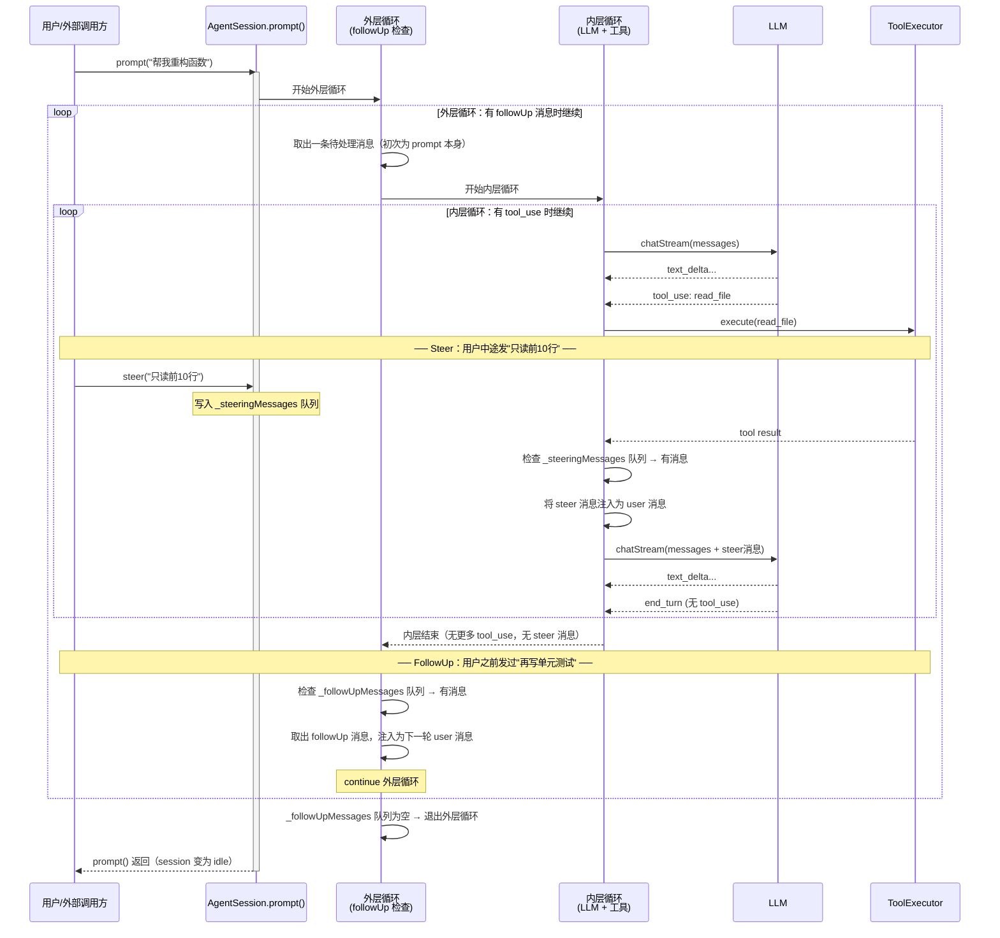
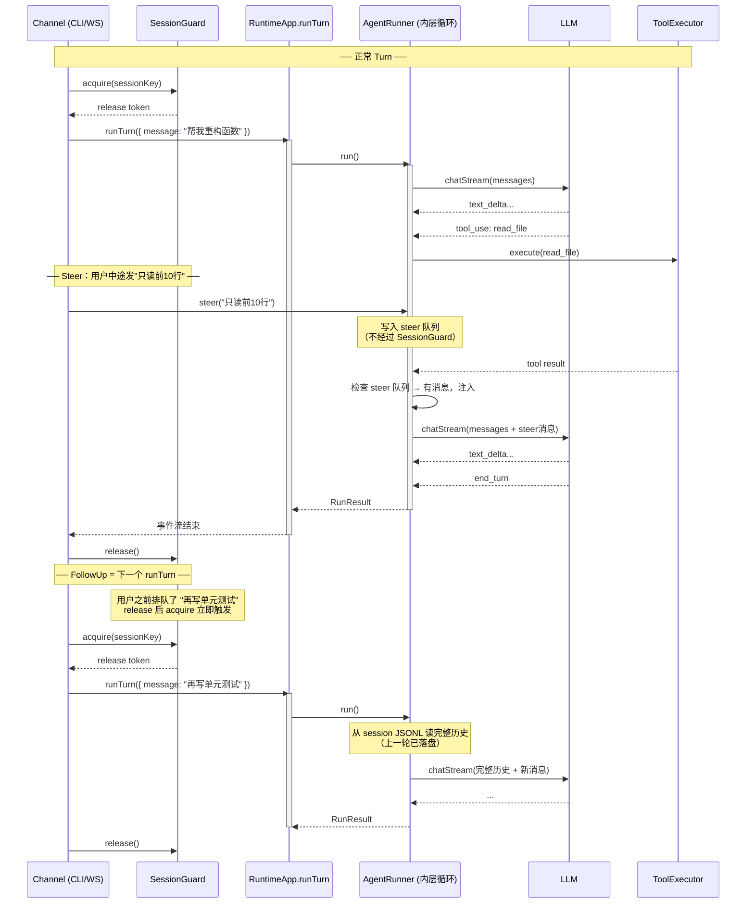

# Turn、Steer 与 FollowUp 数据流

> 创建日期：2026-04-24

---

## 一、pi-coding-agent 的数据流（内部双层循环）

pi-coding-agent 在**一次 `session.prompt()` 调用内**通过双层循环消化 steer 和 followUp，不会结束 session、不会重新 acquire 锁。



**关键特点：**
- 整个过程是**一次 `prompt()` 调用**，调用方 await 直到所有 steer + followUp 消化完毕才返回
- steer：注入时机是**工具边界**（内层循环每轮工具执行完后检查）
- followUp：注入时机是**内层循环退出后**（无 tool_use 且无 steer 消息时）
- 两个队列分别有 `"all"` 和 `"one-at-a-time"` 两种消费模式

---

## 二、my-agent 的数据流（外置 SessionGuard）

my-agent **不在 AgentRunner 内部**处理 followUp，而是通过 SessionGuard 的队列机制把 followUp 变成下一个 runTurn。



---

## 三种机制说明

### 正常 Turn

Channel 调用 `SessionGuard.acquire(sessionKey)` 拿到锁，再调用 `RuntimeApp.runTurn()`，run 结束后 `release()`。这是所有 turn 的基础路径。

### Steer（当前 run 内注入）

- **触发时机**：当前 runTurn **尚未结束**时，用户发送新消息且意图是"纠正当前方向"。
- **注入位置**：工具执行完毕后、下一次 LLM 调用前（AgentRunner 内层循环检查 steer 队列）。
- **实现层**：AgentRunner，不经过 SessionGuard。
- **使用场景**：Agent 正在执行长任务，用户中途发现方向错误，需要立即修正。

```
工具执行完 → AgentRunner 检查 steer 队列
              → 有消息 → 注入为 user 消息 → 继续当前 LLM 调用链
              → 无消息 → 正常继续
```

### FollowUp（下一个 runTurn）

- **触发时机**：用户在 Agent 运行期间预先排好下一条指令，但**不想打断**当前任务。
- **实现机制**：直接就是下一个 `runTurn`——上一个 release 后，SessionGuard 队列里排好的下一个 acquire 自动触发。
- **历史连续性**：由 session JSONL 保证（每条消息立即落盘，新 runTurn 读到完整历史）。
- **对 AgentRunner 透明**：新 runTurn 对 AgentRunner 而言就是普通请求，不需要感知"这是 followUp 还是独立新消息"。

---

## 设计决策

### 为什么 FollowUp 不在 AgentRunner 内部实现

pi-coding-agent 和 proj1 agent-core 在 AgentRunner 内部维护一个外层循环来处理 followUp 消息。my-agent **不采用这个模式**，原因：

| 维度 | 内部外层循环（pi 做法） | 下一个 runTurn（my-agent 做法） |
|------|----------------------|-------------------------------|
| AgentRunner 复杂度 | 高（要维护 followUp 队列） | 低（只管当前 run） |
| 历史一致性 | 内存中直接继续 | session JSONL 落盘，等价 |
| 与 SessionGuard 的关系 | 绕过 SessionGuard | SessionGuard 天然实现排队 |
| 调用方视角 | 一个长 run | 两个独立 run（channel 层自然分隔） |

pi-coding-agent 需要内部外层循环，是因为它的 session 是长驻 TUI 进程，没有"runTurn 结束后重新进入"的节点。my-agent 是按请求分发模型，channel 层天然有这个节点，SessionGuard 的队列就是 followUp 的正确实现层。

### Steer 必须在 AgentRunner 内部实现

Steer 需要影响**当前正在进行的 LLM 上下文**，必须在工具边界内注入。等到下一个 runTurn 再处理已经太晚。因此 steer 是 AgentRunner 的职责，不能外置。

---

## 相关文档

- [agent-runner-design.md](agent-runner-design.md) — AgentRunner 设计文档（§9 后续优化：Steer）
- [channel-design.md](channel-design.md) — Channel 层设计（SessionGuard、并发策略）
