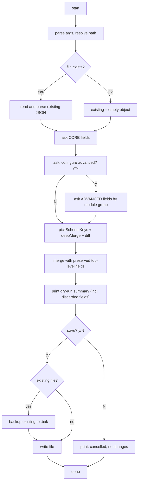

# Config Wizard 模块设计文档

> 版本：v1.0
> 创建日期：2026-05-20
> 关联：
> - [../platform-config-design.md](../platform-config-design.md)
> - [../platform-logger-design.md](../platform-logger-design.md)
> - [../coding-standards.md](../coding-standards.md)

---

## 1. 概述

### 1.1 动机

[platform/config](../../../src/platform/config/) 模块约定了配置文件 schema 与加载顺序，但目前没有"如何写出一份 config.json"的入口。用户要么徒手编辑 JSON（易写错字段、易丢字段、不知道哪些值有默认），要么从设计文档里复制示例再改。

`scripts/config.ts` 的目标是：提供一个**交互式向导**，把"用户要什么"翻译成一份符合 `ConfigFile` schema 的最简 JSON 文件，同时保留 config.json 顶层 wizard 未涉及的段（如 `agents.list[]`）；`agents.defaults` 和 `logger` 段内按 schema 白名单保留（详见 §8 输出策略）。

### 1.2 职责

- 读取既有 config.json（若存在）作为交互默认值；
- 按"核心字段必问 + 高级字段可选展开"的两段式流程收集用户输入；
- 把收集到的结果与硬编码 `DEFAULT_AGENT_CONFIG` / `DEFAULT_LOGGER_CONFIG` 对比，只把"与默认不同的字段"写回文件，保持 config.json 最简；
- 保留既有 config.json 中**顶层** wizard 未触及的段（如 `agents.list[]`、未来新增的 `runtime` / `channels` 等）；
- 在 `agents.defaults` 和 `logger` 段内部：**对象字段**按 schema 白名单过滤（保留 `DEFAULT_AGENT_CONFIG` / `DEFAULT_LOGGER_CONFIG` 中定义的 key，丢弃 schema 外字段）；**数组字段**整段透传，不递归过滤元素（详见 §8.2）。

### 1.3 不属于本模块的职责

- **不读取 env**：不把 `ANTHROPIC_API_KEY` 等环境变量回写到文件，env 仍由 [getEnvOverrides()](../../../src/platform/config/loader.ts) 在运行时叠加；
- **不交互式生成 `agents.list[]`**：per-agent 覆盖是高级功能，v1 让用户自己编辑 JSON；
- **不调用 loadConfig / resolveAgentConfig**：wizard 只 import `DEFAULT_AGENT_CONFIG` / `DEFAULT_LOGGER_CONFIG` 和 `ConfigFile` 类型，不验证最终配置能否被 agent 正确装配；
- **不假定输出路径会被 loadConfig 自动读取**：默认 `<cwd>/config.json` 与 loader 实际查找路径 `<workspaceDir>/.agent/config.json` 不同，路径语义由使用者负责。

---

## 2. 设计原则

| 原则 | 说明 |
|---|---|
| 最简输出 | 只写"与硬编码默认值不同的字段"，避免文件膨胀和未来 default 调整时与新值漂移 |
| 既有字段保留 | 顶层 wizard 未触及的段（`agents.list[]`、未来新增段）原样保留；`agents.defaults` 和 `logger` 段内按 `DEFAULT_*` schema 白名单保留 — schema 内字段保留，schema 外字段丢弃。改 schema 时必须同步更新 `DEFAULT_*`（项目本来就有的约束） |
| 当前值作默认 | 每个 prompt 显示 `[current: xxx]`，回车即保留；用户只为想改的字段输入新值 |
| 无第三方依赖 | 仅用 `node:readline`，与项目其它脚本（[chat.ts](../../../scripts/chat.ts) 等）一致，遵循 [coding-standards.md §10](../coding-standards.md) |
| 单向流程 | 顺序问下去，不提供"返回上一步"；流程末尾给出 dry-run 摘要 + `save? y/N` 一次确认 |
| 配置访问边界 | wizard 属于 [platform-config-design.md §2.1](../platform-config-design.md) 允许直接访问 config loader 的"配置编辑工具"类，可 import `DEFAULT_AGENT_CONFIG` / `DEFAULT_LOGGER_CONFIG` / `deepMerge` |

---

## 3. CLI 接口

```bash
npx tsx scripts/config.ts [--path <file>] [--help|-h]
```

| 参数 | 默认值 | 说明 |
|---|---|---|
| `--path <file>` | `<cwd>/config.json` | 输出文件路径；也是"读取既有内容"的来源路径 |
| `--help`, `-h` | — | 打印用法并退出（不读文件、不进入交互），退出码 0 |

设计要点：

- **默认 `<cwd>/config.json` 不等于 loadConfig 默认查找路径**（后者是 `<workspaceDir>/.agent/config.json`）。wizard 不假定路径用途，纯粹是 JSON 文件编辑器。使用者需自行 copy 到目标位置，或运行时直接传 `--path <workspaceDir>/.agent/config.json`。
- **路径既是输入也是输出**：wizard 启动时尝试读取该路径作为既有内容，结束时写回同一路径。
- **`--help` 优先于一切**：解析到 `--help` / `-h` 时立即 print usage 并 exit(0)，不读文件、不进入任何交互；与其它参数同时出现也直接走帮助分支。
- **未知参数**：打印错误 + usage 到 stderr，退出码 2（详见 §4.1 退出码契约）。
- **v1 不支持其它 flags**（如 `--apiKey=xxx` 直写）。非交互模式留待后续版本。

### 3.1 `--help` 输出格式

```
Usage: npx tsx scripts/config.ts [options]

Interactive editor for config.json. Reads the file at <path> as the current
state, walks the user through core and (optionally) advanced fields, then
writes back only the values that differ from hard-coded defaults.

Options:
  --path <file>   Output file path. Also read as existing content on start.
                  Default: <cwd>/config.json
  -h, --help      Print this help and exit.

Notes:
  The default path <cwd>/config.json is NOT auto-loaded by the agent.
  loadConfig() reads <workspaceDir>/.agent/config.json. Move the generated
  file there, or pass --path <workspaceDir>/.agent/config.json directly.
```

格式参考 Unix 习惯：`Usage` / `Options` / `Notes` 三段，每段空一行。所有可见字符串硬编码在 `display.ts` 里，不读外部模板。

---

## 4. 交互流程



五段：

1. **load existing**：尝试 `readFileSync(path)` + `JSON.parse`。解析失败时（无 dry-run 价值的情况，例如手改坏了）打印告警，把 existing 视为 `{}` 继续——避免用户被旧文件卡住。
2. **ask core**：必问，§6 列出清单。
3. **ask advanced**：可选展开，§7 列出清单。
4. **filter & merge & diff**：`pickSchemaKeys` 过滤 schema 外字段 + `deepMerge` 覆盖 wizard 收集的字段 + `diffAgainstDefaults` 输出非默认值，三步详见 §8.1。
5. **confirm & write**：dry-run 输出（含被丢弃字段提示） + `save?` 二次确认 → 若既有文件存在则备份到 `.bak` → 写入主文件。

### 4.1 退出语义与退出码契约

`runWizard` 始终 **不直接调 `process.exit`**（除 `--help` 这种"完成正常工作流"的场景外）；所有错误以 throw 形式返回给调用方，由调用方决定如何处理。这保证 runWizard 可被 IDE / WebUI 等 host 安全内嵌调用，不会意外 kill host 进程。

错误以 `WizardArgError`（带 `exitCode` 字段）形式抛出；薄壳 `scripts/config.ts` catch 时按 `err.exitCode` 分流：

```typescript
// src/platform/config/wizard/run-wizard.ts
export class WizardArgError extends Error {
  readonly exitCode: number;
  constructor(message: string, exitCode = 2) {
    super(message);
    this.exitCode = exitCode;
  }
}

// 例：runWizard 内
if (unknownArg) {
  throw new WizardArgError(`Unknown argument: ${unknownArg}`);
}
```

CLI 退出码映射（由薄壳负责）：

| 场景 | 退出码 | 触发处 |
|---|---|---|
| 正常 save / cancel / `--help` | 0 | runWizard 正常 return（`--help` 也走正常 return 路径，runWizard 内 print usage 后 `return`） |
| Ctrl+C / SIGINT | 130（薄壳默认）或 1 | SIGINT handler；不进 catch 分支 |
| 未知 CLI 参数 | 2 | runWizard 抛 `WizardArgError(msg, 2)`，薄壳 catch 读 `err.exitCode` |
| 写入失败 / 运行时意外异常 | 1 | runWizard 抛普通 Error，薄壳 catch 兜底 `err.exitCode ?? 1` |

实现约定：

- runWizard 签名：`export async function runWizard(argv: string[]): Promise<void>`。
- runWizard 任何错误路径都 **throw**，不调 `process.exit`。这是其可被内嵌复用的硬约束。
- runWizard 接受 `argv: string[]`，解析失败抛 `WizardArgError(msg, 2)`；运行时失败抛普通 Error。
- 薄壳 catch 通过 `err.exitCode ?? 1` 决定退出码（普通 Error 没有该字段，默认 1）。
- `--help` 不视为错误，runWizard 打印用法后 return；薄壳收到 fulfilled promise → 进程自然以 0 退出。

详细行为：

- **任何时刻 Ctrl+C**：SIGINT，不写文件。薄壳安装 handler 后进程退出码 1（详见 §11 示例）。
- **最终 `save? y/N` 选 N**：runWizard return，正常退出 0。
- **写入失败**（权限不足等）：runWizard 内 throw Error，薄壳 catch 退出 1。
- **未知参数**：runWizard 内 throw `WizardArgError(msg, 2)`，薄壳 catch 退出 2。
- **`--help` / `-h`**：runWizard 内打印用法 + return，薄壳退出 0。

### 4.2 全回车的行为

- **无既有文件 + 全部回车**：collected 完整等于 default → diff 全 omit → 写出空 `{}` 文件。行为可预测，与"有改动 → 写改动"路径一致。
- **有既有文件 + 全部回车**：existing 经 `pickSchemaKeys` 过滤后与 default merge，diff 后保留既有的非默认字段。**结果文件与既有的配置语义等价**，但文本按 diff 策略压缩 — 既有文件里等于默认值的字段在输出中省略（schema 外字段被丢弃，且生成 .bak）。

---

## 5. 字段问题模板

每个字段都是一个 `Prompt<T>`，统一处理"回车保留 current / 输入新值"的逻辑。

### 5.1 类型

```typescript
/** 单个字段的交互定义 */
interface Prompt<T> {
  /** 字段路径，如 'llm.maxTokens'；用于 diff 与日志 */
  path: string;
  /** 用户可见的字段标签 */
  label: string;
  /** 当前值（来自既有文件，或硬编码默认） */
  current: T | undefined;
  /** 硬编码默认值（用于 diff 阶段判断是否需写出） */
  default: T;
  /** 字符串 → T 的解析器（失败抛 Error，由调用方捕获并让用户重输） */
  parse: (input: string) => T;
  /** T → 显示字符串（v1 仅用于格式化非字符串类型，如 boolean→'y/n'） */
  display?: (value: T | undefined) => string;
  /** 额外校验（可选） */
  validate?: (value: T) => void;
}
```

### 5.2 单次询问

```typescript
async function ask<T>(p: Prompt<T>): Promise<T | undefined> {
  const shown = (p.display ?? defaultDisplay)(p.current);
  while (true) {
    const input = (await readLine(`${p.label} [current: ${shown}]: `)).trim();
    if (input === '') return p.current;       // 回车 → 保留
    try {
      const v = p.parse(input);
      p.validate?.(v);
      return v;
    } catch (err) {
      const msg = err instanceof Error ? err.message : String(err);
      console.error(`  ✗ ${msg}, please re-enter`);
    }
  }
}
```

要点：

- **回车 = 保留 current**，与"输入空字符串"语义同（若用户想清空字段，需输入特殊 token 如 `--`，详见 §5.4）；
- **解析/校验失败原地重输**，不退出流程；
- **不区分 current 来自文件还是来自默认值**——用户视角只关心"当前是什么"。

### 5.3 常见 parser

| 类型 | parse 示例 |
|---|---|
| string | `(s) => s` |
| number | `(s) => { const n = Number(s); if (!Number.isFinite(n)) throw new Error('not a number'); return n; }` |
| boolean | `(s) => { const l = s.toLowerCase(); if (['y','yes','true','1'].includes(l)) return true; if (['n','no','false','0'].includes(l)) return false; throw new Error('expected y/n'); }` |
| enum | `(s) => { if (!ALLOWED.includes(s)) throw new Error(\`expected one of: \${ALLOWED.join(', ')}\`); return s; }` |

### 5.4 清空字段

`apiKey` / `baseURL` / `model` 等 optional 字段，若用户想从"已设置"改回"未设置"，输入 `--`：

```typescript
parse: (s) => s === '--' ? undefined : s,
```

文档里在询问时提示一次（`(enter '--' to clear)`），不重复提示。

---

## 6. 核心字段清单

进入 wizard 后必问的字段。按"用户最常关心"的顺序排列：

| 字段路径 | 类型 | 默认值 | 备注 |
|---|---|---|---|
| `llm.apiKey` | string? | undefined | v1 显示完整值，不脱敏 |
| `llm.baseURL` | string? | undefined | 可清空 |
| `llm.model` | string? | undefined | 可清空 |
| `llm.maxTokens` | number | 4096 | |
| `llm.contextWindowTokens` | number | 200000 | 改小窗口模型时必须显式设置 |
| `memory.enabled` | boolean | true | 关闭后不问 memory.* 任何字段 |
| `logger.minLevel` | enum | 'info' | debug/info/warn/error |
| `logger.file.enabled` | boolean | false | 关闭后不问 logger.file.* 其它字段 |

设计要点：

- **`llm.apiKey` 用明文 readline**，v1 不做 echo 屏蔽，**显示和预览也不脱敏**——把 apiKey 视为普通字段，屏幕泄露场景由使用者负责（详见 §14 决策记录）；
- **`memory.enabled = false` 时直接跳过 memory 其它字段**（核心 + 高级），写出文件里也只保留 `memory.enabled: false`；
- **`logger.file.enabled = false` 时跳过 file.* 其它字段**（dir/prefix/minLevel/maxQueueSize）。

---

## 7. 高级字段（可选展开）

`configure advanced? y/N` 答 y 后逐段问。每段开头打印分隔线 + 段名，让用户知道进度。每段内可单独再问一次"skip this section? y/N"——某些用户只想改 logger 不想动 runner。

### 7.1 分段

| 段名 | 字段 |
|---|---|
| runner | `runner.maxLlmCalls`, `runner.inTurnMessageMode` |
| memory.embedding | `memory.embedding.provider`, `memory.embedding.model`, `memory.embedding.dimensions` |
| memory.chunking | `memory.chunking.chunkChars`, `memory.chunking.overlapChars` |
| memory.search | `memory.search.maxResults`, `memory.search.minScore`, `memory.search.vectorWeight`, `memory.search.textWeight` |
| memory.misc | `memory.dbPath` |
| prompt | `prompt.mode`, `prompt.safetyLevel` |
| session | `session.dir` |
| tools | `tools.execTimeout`, `tools.readMaxLines`, `tools.webFetchTimeout`, `tools.webFetchMaxChars` |
| workspace | `workspace.agentDir`, `workspace.maxFileChars`, `workspace.maxTotalChars` |
| compaction | `compaction.enabled`, `compaction.reserveTokens`, `compaction.keepRecentTurns`, `compaction.toolResultContextShare`, `compaction.toolResultHeadChars`, `compaction.toolResultTailChars`, `compaction.timeoutSeconds`, `compaction.customInstructions` |
| logger.console | `logger.console.enabled`, `logger.console.minLevel` |
| logger.file | `logger.file.dir`, `logger.file.prefix`, `logger.file.minLevel`, `logger.file.maxQueueSize` |

### 7.2 条件跳过

| 触发 | 跳过 |
|---|---|
| `memory.enabled = false` | memory.embedding / memory.chunking / memory.search / memory.misc 整段 |
| `logger.file.enabled = false` | logger.file 整段 |
| `compaction.enabled = false` | compaction 其它字段不问 |

---

## 8. 输出策略

### 8.1 三步合并流程

`agents.defaults` 和 `logger` 两段统一走三步：

```
existing[section]
  → pickSchemaKeys(., DEFAULT_*)         (1) 按 schema 白名单过滤 schema 外字段
  → deepMerge(., collected[section])     (2) 用 wizard 收集的字段覆盖
  → diffAgainstDefaults(., DEFAULT_*)    (3) 只输出与默认不同的字段
```

每步的语义：

- **(1) pickSchemaKeys** — 递归遍历 `DEFAULT_*` 的所有 key，从 existing 里挑出 schema 内字段；schema 外字段（用户手写的实验字段、过时字段）在此处被丢弃。对象与数组的差异化处理规则详见 §8.2。
- **(2) deepMerge** — `collected` 只包含 wizard 问过的字段（`Partial<AgentDefaults>`），其值优先覆盖 existing。wizard 未问的 schema 内字段保持 existing 值。
- **(3) diffAgainstDefaults** — 与硬编码默认值递归对比，相同则 omit，避免文件膨胀和未来 default 调整时漂移。详见 §8.3。

corner case 自然解决：用户在 wizard 中把"非默认值"改回"默认值" → collected 里有该字段（值=default）→ deepMerge 后值=default → diff 阶段被 omit → 文件里删除该 override。**因为 collected 完整覆盖 wizard 问过的所有字段**，"用户主动改回 default"和"wizard 未问"不会被混淆。

### 8.2 pickSchemaKeys — schema 白名单过滤

```typescript
/**
 * 递归按 schema 白名单从 input 里挑字段。
 *
 * schema 是 DEFAULT_AGENT_CONFIG / DEFAULT_LOGGER_CONFIG 等运行时具体化的 default
 * 实例，它的 keys 就是 schema 字段清单。
 *
 * - input 里 schema 没有的 key → 丢弃
 * - 嵌套对象递归处理
 * - 数组按 schema 整段透传（不递归过滤数组元素）
 * - 返回的对象记录哪些 path 被丢弃（用于 dry-run 提示）
 */
function pickSchemaKeys<T>(
  input: unknown,
  schema: T,
): { kept: DeepPartial<T>; discarded: string[] };
```

`discarded` 列表交给 §9.2 dry-run 摘要打印，让用户在 `save? y/N` 之前知道丢了什么。

### 8.3 diffAgainstDefaults

```typescript
/**
 * 递归提取 collected 中与 defaults 不同的字段。
 *
 * - undefined 不写入
 * - 与默认完全相同的字段省略（保持文件最简）
 * - 嵌套对象递归处理；递归后若子对象为空 {} 则父字段也省略
 * - 数组直接比较：内容相同就省略，否则整段保留
 */
function diffAgainstDefaults<T>(collected: T, defaults: T): DeepPartial<T>;
```

### 8.4 与既有文件合并

`agents.defaults` 和 `logger` 走三步流程；其它顶层段（`agents.list[]`、未来 `runtime` / `channels` 等）原样保留：

```typescript
const { kept: defaultsKept, discarded: defaultsDiscarded } =
  pickSchemaKeys(existing.agents?.defaults ?? {}, DEFAULT_AGENT_CONFIG);
const defaultsMerged = deepMerge(defaultsKept, collected.agents.defaults);
const defaultsFinal = diffAgainstDefaults(defaultsMerged, DEFAULT_AGENT_CONFIG);

const { kept: loggerKept, discarded: loggerDiscarded } =
  pickSchemaKeys(existing.logger ?? {}, DEFAULT_LOGGER_CONFIG);
const loggerMerged = deepMerge(loggerKept, collected.logger);
const loggerFinal = diffAgainstDefaults(loggerMerged, DEFAULT_LOGGER_CONFIG);

const next: ConfigFile = {
  ...existing,                              // 顶层段保留（agents.list[] / 未来段）
  agents: {
    ...existing.agents,                     // agents.list[] 保留
    defaults: defaultsFinal,
  },
  logger: loggerFinal,
};
```

`defaultsDiscarded` 和 `loggerDiscarded` 合并后传给 §9.2 dry-run。

### 8.5 空对象清理

`diffAgainstDefaults` 后某些段可能整段为 `{}`：

```typescript
// 后处理：删除 {} 段，避免输出 "agents":{"defaults":{}},"logger":{}
if (next.agents?.defaults && Object.keys(next.agents.defaults).length === 0) {
  delete next.agents.defaults;
}
if (next.agents && Object.keys(next.agents).length === 0) {
  delete next.agents;
}
if (next.logger && Object.keys(next.logger).length === 0) {
  delete next.logger;
}
```

### 8.6 写入

写入主文件前先备份既有文件（详见 §10 错误表）：

```typescript
import { copyFileSync, writeFileSync, existsSync } from 'node:fs';

// 1. 备份既有文件（如存在）
if (existsSync(path)) {
  try {
    copyFileSync(path, path + '.bak');
  } catch (err) {
    process.stderr.write(`Warning: backup to ${path}.bak failed: ${err}\n`);
    // 不阻塞主流程
  }
}

// 2. 写入主文件
const json = JSON.stringify(next, null, 2) + '\n';
writeFileSync(path, json, 'utf-8');
```

- **2 空格缩进 + 末尾换行**，与项目其它 JSON 文件（如 `package.json`）风格一致；
- **.bak 命名固定**为 `<path>.bak`，覆盖前一份，v1 不做 rotation（列入 §13 v2+）；
- **不写中间临时文件再 rename**：v1 直接覆盖即可；若担心写入中断导致文件损坏（小概率），后续可加 write-then-rename。

---

## 9. Dry-run 摘要

`save? y/N` 之前打印三段：

### 9.1 字段变更摘要

```
Changes vs current file:
  + llm.apiKey:        (new)         sk-ant-api03-FULL_KEY_HERE
  ~ llm.maxTokens:     4096       → 8192
  ~ memory.enabled:    true       → false
  - memory.search:     (existing)    (removed, back to default)
```

- `+` 新增；`~` 修改；`-` 移除（diff 后变回默认值，从文件里删掉）；
- apiKey 显示**完整**值（v1 不脱敏，详见 §14 决策记录）；上面示例里 `FULL_KEY_HERE` 表示实际写入的完整 key 字符串。

### 9.2 被丢弃的 schema 外字段（仅在有时打印）

```
Discarded fields (not in current schema, will be removed):
  - agents.defaults.experimental.fooFlag
  - logger.trace.enabled

A backup of the previous file will be saved to <path>.bak before writing.
```

来源：§8.2 `pickSchemaKeys` 返回的 `discarded` 列表合并后打印。若列表为空则整段不出现。

### 9.3 完整输出预览

```
Final config.json content (will be written to <path>):
{
  "agents": {
    "defaults": {
      "llm": { "apiKey": "sk-ant-api03-FULL_KEY_HERE", "maxTokens": 8192 },
      "memory": { "enabled": false }
    }
  }
}
```

完整 JSON 直接 print，让用户最后确认实际写入什么。apiKey 显示**完整**值（与即将写入文件的内容字字相同；`FULL_KEY_HERE` 仅是示例占位）。

---

## 10. 错误与降级

| 情况 | 处理 |
|---|---|
| 既有 config.json 解析失败 | 打印 warning，existing 视为 `{}`，流程继续。**不**覆盖原文件直到用户在最终 `save? y` 处确认 |
| 字段输入解析/校验失败 | 原地打印 `✗ <reason>, please re-enter`，重新询问同一字段 |
| Ctrl+C / SIGINT | 不写文件，退出码 1 |
| `.bak` 备份创建失败（权限等） | 打印 warning 到 stderr，**继续**主文件写入（备份是 best-effort，不阻塞主流程） |
| writeFileSync 失败 | 打印错误到 stderr，退出码 1 |
| 未知 CLI 参数 | runWizard 抛 `WizardArgError(msg, 2)`，薄壳 catch 读 `err.exitCode` → 打印错误 + usage 到 stderr → `process.exit(2)`（详见 §4.1） |
| `--path` 指向只读路径 | 由 writeFileSync 触发上一项 |
| `--path` 指向不存在的目录 | 由 writeFileSync 触发上一项；v1 不主动 mkdir |

---

## 11. 文件结构

wizard 主体放在 [src/platform/config/wizard/](../../../src/platform/config/wizard/) 下，作为 config 模块的子模块；[scripts/config.ts](../../../scripts/config.ts) 仅作薄壳入口。

```
src/platform/config/
├── defaults.ts                # 已有
├── types.ts                   # 已有
├── loader.ts                  # 已有
├── loader.test.ts             # 已有
├── index.ts                   # 已有（re-export 不变，wizard 不对外导出）
└── wizard/
    ├── prompts.ts             # Prompt<T> 抽象 + ask() + 通用 parser/validator
    ├── prompts.test.ts        # 可选,parser 的纯函数测试（见 §12）
    ├── fields.ts              # 核心字段 + 高级分段字段定义
    ├── diff.ts                # pickSchemaKeys + diffAgainstDefaults + 合并 + {} 清理
    ├── diff.test.ts           # diff 算法的纯函数测试
    ├── display.ts             # dry-run 摘要 + help 文案
    ├── run-wizard.ts          # 主编排（parse args / load / ask / write / backup）
    └── index.ts               # 只 export runWizard 和 WizardArgError
```

```
scripts/
└── config.ts                  # 薄壳入口，约 5 行：parse argv → runWizard → 统一错误处理
```

**index.ts 公共导出契约**：

```typescript
export { runWizard } from './run-wizard.js';
export { WizardArgError } from './run-wizard.js';
```

只导出薄壳真正需要的两个符号 — `runWizard` 入口函数 + `WizardArgError` 用于薄壳 `instanceof` 检测以决定退出码。`prompts.ts` / `fields.ts` / `diff.ts` / `display.ts` 等都是内部实现，**不导出**。这同时也是 IDE / WebUI wrapper 内嵌复用 wizard 时需要 import 的全部公共表面。

设计意图：

- **wizard 是 config 模块的"配套工具"**，物理放隔壁，改 config schema / 默认值时同目录连带改 prompt，认知成本最低；
- **scripts/config.ts 不含业务逻辑**——保留它的理由是与项目其它入口（chat.ts / cli.ts / websocket.ts）形式一致，用户可直接 `npx tsx scripts/config.ts`；
- **wizard 不出现在 `src/platform/config/index.ts`** —— 它不是 config 模块的对外公共 API，只是一个内部工具子模块，由 scripts 入口直接 import 子路径；
- **CLI 解析也在 wizard 内**（runWizard 接收 `argv: string[]`）——保持 scripts/config.ts 极薄，未来加 IDE 集成 / WebUI wrapper 时可绕开 argv 直接调 runWizard。

scripts/config.ts 形态：

```typescript
import { runWizard, WizardArgError } from '../src/platform/config/wizard/index.js';

runWizard(process.argv.slice(2)).catch((err) => {
  const msg = err instanceof Error ? err.message : String(err);
  const code = (err instanceof WizardArgError) ? err.exitCode : 1;
  process.stderr.write(`\x1b[31mError: ${msg}\x1b[0m\n`);
  process.exit(code);
});
```

约 5 行：catch 时按 `WizardArgError.exitCode` 分流，普通 Error 统一 exit 1。SIGINT 由 Node 默认 handler 处理或薄壳自行 install（v1 依赖默认）。

---

## 12. 测试策略

| 模块 | 测试方式 |
|---|---|
| `diff.ts` | 单元测试（`diff.test.ts`）。纯函数，覆盖率应 ≥ 90%：`pickSchemaKeys` 的 schema 内/外/嵌套/数组 + `diffAgainstDefaults` 的 scalar 相同/不同、嵌套对象、空对象清理、数组、undefined 处理 + 三步合并的 corner case（用户主动改回 default、schema 外字段丢弃、未来 schema 字段保留） |
| `prompts.ts` 的 parser | 单元测试（`prompts.test.ts`，可选）。number / boolean / enum / 清空 token 各覆盖 happy + error path |
| `fields.ts` | 不单测；改动会被 runWizard 手工验证捕获 |
| `display.ts` | 不单测；纯打印函数肉眼审 |
| `run-wizard.ts` | **手工验证**，见下表。理由：与 readline 紧耦合，桩化收益低 |

手工验证场景：

| 场景 | 期望 |
|---|---|
| 无既有文件 + 全回车 | 写出空 `{}` 文件，与 §4.2 一致 |
| 有既有文件 + 全回车 | 配置语义等价于既有；文件按 diff 压缩（等于默认值的字段省略），schema 外字段被丢弃，生成 .bak |
| 改 apiKey 一个字段 | 输出文件仅含 `agents.defaults.llm.apiKey`，生成 .bak |
| 既有文件含 `agents.list[]` | 写回后 `agents.list[]` 仍在 |
| 既有文件含 schema 外字段（如 `experimental.fooFlag`） | 字段被丢弃；dry-run §9.2 列出该 path；生成 .bak 保留旧文件 |
| memory.enabled = false | 写回 `memory: { enabled: false }`，跳过其余 memory 字段 |
| 既有文件 JSON 损坏 | 打印 warning，按空既有文件流程继续 |
| Ctrl+C 在交互中 | 不写文件、不创建 .bak |
| 备份目录只读 | warning 提示 .bak 失败，主文件正常写入 |
| `--help` / `-h` | 打印用法立即退出，不读文件、不进入交互，退出码 0 |
| 未知参数 | 打印错误 + usage 到 stderr，退出码 2 |

---

## 13. v1 不实现 / 列入未来

| 项 | 状态 | 说明 |
|---|---|---|
| 非交互模式 / flags | v2+ | `--non-interactive` + 全 flag 覆盖，便于 CI |
| `agents.list[]` 交互编辑 | v2+ | per-agent 覆盖菜单化 |
| env 默认值合并 | v2+ | 启动时把 env 当 current 显示，便于用户把 env 固化进文件 |
| apiKey echo 屏蔽 | v2+ | 需手搓 raw mode 或引第三方，v1 暂明文，与项目其它脚本一致 |
| 敏感字段脱敏 | v2+ | `Prompt<T>` 增加 `sensitive: true` 标记 + display 层统一 redactor，目前 v1 全程 raw 显示 |
| schema validation | v2+ | 用 zod 或手写校验器验证 `memory.search.vectorWeight + textWeight ≈ 1` 之类的语义约束 |
| 多 profile（dev / prod） | v2+ | 多输出文件管理 |
| `.bak` rotation / 时间戳归档 | v2+ | v1 只保留一份 `<path>.bak` 覆盖；rotation 策略（如 `.bak.1` / `.bak.2` / 时间戳）待定 |
| 段内 schema 演化保留 | v2+ | v1 按 `DEFAULT_*` schema 白名单过滤；若 wizard 与 schema 出现脱节，目前依赖"改 schema 必须同步 DEFAULT_*"约束。v2+ 可考虑显式 schema migration 机制 |

---

## 14. 决策记录

| 问题 | 决策 | 依据 |
|---|---|---|
| 默认路径用 `<cwd>/config.json` 还是 `<cwd>/.agent/config.json`？ | 前者 | 用户明确要求；wizard 不假定路径用途，纯粹是 JSON 文件编辑器。代价：使用者需自行把生成文件 copy 到 loadConfig 实际查找的位置，或运行时传 `--path <workspaceDir>/.agent/config.json` |
| 主体放在 `src/platform/config/wizard/` 还是 `scripts/config.ts` 单文件？ | 前者 | [platform-config-design.md §2.1](../platform-config-design.md) 已为"配置编辑/校验/迁移这类以 config 为主职责的工具模块"留位；与 schema/默认值物理相邻、改 config 时同目录改 prompt 成本最低；纯函数（diff / parser）可独立测试；未来 IDE/WebUI wrapper 可绕开 argv 直调 runWizard。scripts/config.ts 退化为薄壳 |
| 子模块叫 `editor` 还是 `wizard`？ | `wizard` | "editor" 暗示 vscode 式的"打开文件直接改"，与本模块"问答式逐步引导"的交互形式错配；"wizard" 是英语圈 setup/config wizard 的标准说法，中文"配置向导"一秒理解；项目里 `prompt` / `builder` 后缀已被 LLM prompt 模块占用，撞名风险高 |
| 是否引第三方 prompt 库（inquirer / prompts）？ | 否 | 遵循 [coding-standards.md §10](../coding-standards.md)；`node:readline` 足够支撑本模块的所有交互形态 |
| 是否做 apiKey echo 屏蔽 / 显示脱敏？ | v1 都不做 | (1) `node:readline` 无原生 echo 屏蔽，需进 raw mode 自行处理输入流，与项目其它脚本（chat.ts 同明文）保持一致；(2) 显示脱敏需要 redactor 函数 + 多处差异化显示，v1 选择**全程 raw**——把 apiKey 视为普通字段，屏幕泄露场景由使用者负责（终端历史 / 录屏 / 屏幕共享）。v2+ 可加 `sensitive` 标记统一脱敏 |
| 是否支持"返回上一步"？ | 否 | readline 单向流程实现简单；末尾的 dry-run + `save? y/N` 提供整体撤销能力；改不对再跑一次 wizard 即可 |
| 输出只写 diff 还是写完整配置？ | 只写 diff | 与 [platform-config-design.md](../platform-config-design.md) 的"部分配置 + 默认值兜底"模型一致；避免 default 调整时与文件值漂移 |
| 既有文件未触及字段是否保留？ | 顶层保留 + 段内按 schema 白名单保留 | 顶层 wizard 未触及的段（`agents.list[]`、未来新增段）原样保留；`agents.defaults` 和 `logger` 段内只保留 `DEFAULT_*` 中定义的字段，schema 外字段（用户手写的实验字段、过时字段）丢弃 |
| 段内字段保留为什么按"`DEFAULT_*` schema 白名单"而非"wizard 问过的字段清单"？ | `DEFAULT_*` 白名单 | (1) `DEFAULT_AGENT_CONFIG` / `DEFAULT_LOGGER_CONFIG` 本身就是 schema 的运行时具体化，每个 schema 字段都有默认值，天然可作白名单，不需要额外维护"问过的 path 清单"；(2) 借力项目已有的"改 schema 必须同步 DEFAULT_*"约束，wizard 不需要再加新约束；(3) 未来 schema 加字段但 wizard 还没问到时，既有文件的该字段也能保留——比 wizard schema 演化更友好；(4) corner case（用户主动改回 default）通过"collected 完整覆盖 + deepMerge + diff"三步流程自然解决，不需要单独逻辑 |
| 是否在写入主文件前备份既有文件到 `.bak`？ | 是，总是备份 | 兜底两类场景：(1) `pickSchemaKeys` 丢弃 schema 外字段后用户事后想找回；(2) 用户在 wizard 里手误改错值。备份是 best-effort——失败仅 warn 不阻塞主流程。命名固定 `<path>.bak` 覆盖前一份，v1 不做 rotation（列入 §13 v2+） |
| dry-run 是否显式列出被丢弃的 schema 外字段？ | 是 | 在 `save? y/N` 之前让用户知道丢了什么，比"先丢后告"友好。`pickSchemaKeys` 返回 `discarded` 列表，§9.2 单独打印一段。若列表为空则不打印 |
| 既有 config.json 解析失败时直接覆盖还是保留？ | 保留旧文件直到最终 save 确认 | 用户可能误改了 JSON，希望恢复时还能找到旧内容；流程跑到 `save?` 处时 dry-run 会让用户看到差异 |
| 是否支持非交互模式（CLI flags）？ | v1 不支持 | 用户已确认；v1 聚焦交互流程实现，CI 友好性留待 v2 |
| CLI 参数解析放 scripts/config.ts 还是 runWizard？ | 放 runWizard | scripts/config.ts 保持薄壳，未来 IDE/WebUI wrapper 无需再实现 argv 解析；runWizard 签名 `runWizard(argv: string[])` 允许调用方按需构造 |
| 未知 CLI 参数怎么传退出码 2 / 如何兼顾 IDE/WebUI 复用？ | runWizard 抛 `WizardArgError(msg, exitCode=2)`，**绝不调 `process.exit`**；薄壳 `scripts/config.ts` catch 时按 `err.exitCode ?? 1` 分流 | (1) runWizard 内直接 `process.exit` 会在 IDE/WebUI host 内嵌调用时 **kill host 进程**，与"可复用"目标冲突；(2) throw 带 code 字段让 shell/CI 仍能稳定区分"参数错误"(2) 与"运行失败"(1)；(3) 上轮 review 提出的 round-2 P3 改正 |
| 用户全回车 + 无既有文件 → 写空 `{}` 还是不写？ | 写空 `{}` | 行为可预测，能 touch 文件；与"有改动 → 写改动"路径一致；用户跑了 wizard 总是该看到一个文件 |

---

## 15. 总结

Config Wizard v1 解决"如何写出 config.json"的入口问题，定位是**面向 config 模块的交互式编辑工具**：

1. **模块化** — 主体放 [src/platform/config/wizard/](../../../src/platform/config/wizard/) 子模块，与 schema 同目录改动同步；[scripts/config.ts](../../../scripts/config.ts) 为薄壳入口；
2. **核心 + 可选展开**两段式问，避免长流程压垮用户；
3. **当前值作默认**，回车即保留，用户只为想改的字段动手；
4. **只写与默认不同的字段**，保持文件最简、面向未来 default 调整稳健；
5. **既有字段分层保留** — 顶层 wizard 未触及的段（`agents.list[]`、未来 `runtime` / `channels`）原样保留；`agents.defaults` / `logger` 段内按 `DEFAULT_*` schema 白名单保留，schema 外字段丢弃，写入前总是备份 `.bak` 兜底；
6. **无第三方依赖**，纯 `node:readline`，与项目风格一致。

路径默认值（`<cwd>/config.json`）的特殊性在文档与交互中明示，使用者自行负责把文件落到 loadConfig 实际查找的位置。
