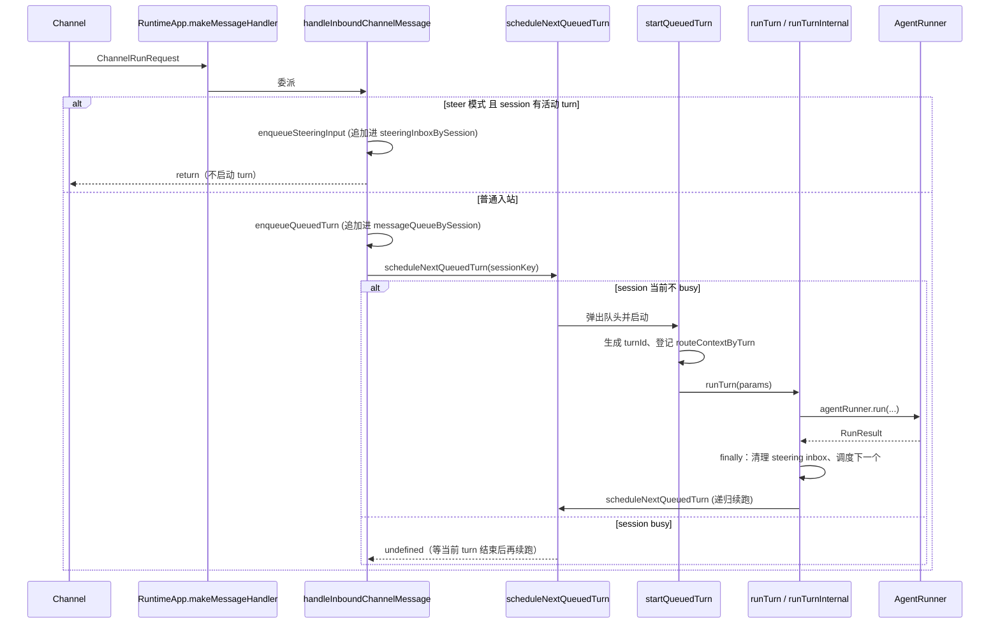

# Runtime / App Assembly 模块设计文档（v1.0）

> 版本：v1.0
> 取代：[../runtime-design.md](../runtime-design.md)
> 创建日期：2026-05-18
> 关联：
> - [adapters-channel-design.md（v1.0）](./adapters-channel-design.md)
> - [core-runner-design.md（v1.0）](./core-runner-design.md)
> - [core-runner-message-flow.md（v1.0）](./core-runner-message-flow.md)
> - 未变更或仅小幅修订的旁路文档继续以 v0.9 路径为准：
>   - [../core-runner-context-design.md](../core-runner-context-design.md)
>   - [../core-runner-hooks-design.md](../core-runner-hooks-design.md)
>   - [../platform-config-design.md](../platform-config-design.md)

---

## 1. 概述与版本说明

Runtime / App Assembly 模块的总体职责（统一装配 / 显式依赖注入 / 集中生命周期管理）在 v1.0 中没有变化，对应章节继续以 v0.9 文档为基线。v1.0 重写本文件，是为了把以下结构性变更集中讲清楚：

1. **新增运行时入站调度层**：channel 入站消息不再就地启动 turn，而是先进入 runtime 的 per-session 消息队列，由 runtime 调度器决定何时真正启动 turn。
2. **Steering / FollowUp 处理路径分流**：steering 走独立 inbox（仅服务当前活动 turn）；followup 不再走 runner 注入，而是退化为普通的"下一条队头消息"，依赖 per-session 串行保证一致性。
3. **Turn 调用配额改造**：`maxToolRounds + maxFollowUpRounds` 合并为单一的 `maxLlmCalls`。
4. **Approval 路由元数据收口**：原本 `originChannelByTurn` + `originClientByTurn` 两个并行 Map 合并为单一的 `routeContextByTurn`（值为 `MessageRouteContext`）。
5. **Compaction wiring 完成**：RuntimeApp 在调用 `AgentRunner.run()` 时显式透传 `compaction` 与 `contextWindowTokens`；compaction hook（`before_compaction` / `after_compaction`）从 runner 侧暴露，本文件只点到为止，细节见 hooks 文档。

v0.9 中"P0 明确不包含"列出的若干能力（session queue、compaction、跨 channel 等）在 v1.0 已部分落地。新的 "已知未实现 / 规划项" 列表见 §9。

---

## 2. v1.0 关键变更速览（vs v0.9）

| 主题 | v0.9 | v1.0 |
|---|---|---|
| Channel 入站如何启动 turn | `makeMessageHandler` 内立即生成 `turnId` 并直接 `runTurn()` | `makeMessageHandler` 只调 `handleInboundChannelMessage()`，由其决定入队 / 路由 steering，`turnId` 在真正启动 turn 时（`startQueuedTurn`）才生成 |
| 同 sessionKey 的并发消息 | 直接拒绝（`RUN_REJECTED`） | 进入 per-session 队列，按 FIFO 串行执行；不再因 busy 而对外报错 |
| Steering 入口 | 不存在（仅设计阶段） | `inTurnMessageMode='steer'` 且存在活动 turn 时，新消息追加进 `steeringInboxBySession`，由 runner 通过 reader 拉取 |
| FollowUp 入口 | 由 AgentRunner 自己处理（`maxFollowUpRounds`） | RuntimeApp 不区分 followup 与首条消息；followup 语义由 "per-session 队列串行" 自然兑现 |
| Turn 配额 | `maxToolRounds` + `maxFollowUpRounds` 双参数 | 单一 `maxLlmCalls`（默认 12） |
| 默认 in-turn 消息模式 | 未定义 | `inTurnMessageMode='followup'`（runtime 层与 runner 层默认值一致） |
| Approval / interaction 路由元数据 | `originChannelByTurn: Map<turnId, Channel>` + `originClientByTurn: Map<turnId, string>` | `routeContextByTurn: Map<turnId, MessageRouteContext>`，`MessageRouteContext = { originChannel?, originClientId? }` |
| Turn 收尾责任 | 释放 `inFlightSessions` 与 `activeRunCount` | 上述之外，还需清空当前 session 的 steering inbox、清理 `activeTurnIdBySession`、并尝试 `scheduleNextQueuedTurn()` 推进队头 |
| Compaction 透传 | 未实现 | `runTurnInternal` 在调用 `agentRunner.run()` 时透传 `compaction` 与 `contextWindowTokens` |
| `RunTurnParams` 新字段 | 无 | `maxLlmCalls`、`inTurnMessageMode` |

---

## 3. 运行时状态字段

新增 4 个 per-session map（位于 `RuntimeApp`），与原有的 `inFlightSessions` / `inFlightRuns` 共同表达运行态。各字段语义必须严格区分，否则 steering 路由与队列调度都会失控。

| 字段 | 类型 | 用途 | 与其它字段的关系 |
|---|---|---|---|
| `inFlightRuns` | `Set<Promise<unknown>>` | 跟踪所有 `runTurn()` 的 Promise；`close()` 阶段统一 `Promise.allSettled` 等待 | 与 sessionKey 无关，按 Promise 实例做集合 |
| `inFlightSessions` | `Set<string>` | per-session 串行 gate；同 sessionKey 同时只允许一个 turn | 用于 `assertCanRunForSession()`、`scheduleNextQueuedTurn()` 判断"是否 busy" |
| `messageQueueBySession` | `Map<string, QueuedChannelTurn[]>` | per-session 普通消息队列；入站消息在真正启动 turn 前先排队 | 由 `enqueueQueuedTurn()` 写、`scheduleNextQueuedTurn()` 弹出；空队列自动 `delete` 释放 |
| `steeringInboxBySession` | `Map<string, PendingSteeringInput[]>` | 当前活动 turn 的 steering 输入累积桶 | turn 结束时强制清空（`runTurn` 的 `finally`），避免泄漏到下一轮 |
| `activeTurnIdBySession` | `Map<string, string>` | 当前活动 turn 的 `turnId`；steering 路由依赖这个最小运行态 | 与 `inFlightSessions` 的区别详见下文 |
| `routeContextByTurn` | `Map<string, MessageRouteContext>` | turnId → 起源 channel + 起源 clientId；approval / interaction 反向路由 | 由 `startQueuedTurn` 在启动时登记、`finally` 中删除 |

### 3.1 `inFlightSessions` vs `activeTurnIdBySession`

两者语义不同，不要合并：

- `inFlightSessions` 表达 **"该 session 当前是否 busy"**——只要 `runTurn()` 的 Promise 在 `inFlightRuns` 里就 busy。Busy session 不应再被 `scheduleNextQueuedTurn()` 启动新 turn。
- `activeTurnIdBySession` 表达 **"该 session 是否存在一个可接 steering 的活动 run-turn"**——只在 `runTurn()` 真正进入到设置 turnId 的代码点之后才填，turn 结束时显式清除。

`shouldRouteMessageToSteering()` 用的是后者，原因有二：

1. Steering 必须能精准定位到一个具体的 `turnId`，否则 runner 拿不到 reader 上下文。
2. 未来若把 steering 的"接收窗口"收窄到 turn 内的特定阶段（例如只在 tool 执行间隙），需要的也是这种"per-turn 运行态"而不是"session 是否 busy"。

---

## 4. Channel 入站调度（v1.0 新增）

### 4.1 总体流程



### 4.2 入站分流：`handleInboundChannelMessage`

入站统一入口，做最小分流：

```typescript
private async handleInboundChannelMessage(
  channel: Channel,
  req: ChannelRunRequest,
): Promise<void> {
  if (this.shouldRouteMessageToSteering(req.sessionKey)) {
    this.enqueueSteeringInput(
      req.sessionKey,
      req.message,
      this.buildMessageRouteContext(channel, req),
    );
    return;
  }

  const queuedTurn: QueuedChannelTurn = {
    sessionKey: req.sessionKey,
    message: req.message,
    launchContext: this.buildTurnLaunchContext(req),
    routeContext: this.buildMessageRouteContext(channel, req),
  };

  this.enqueueQueuedTurn(queuedTurn);

  const started = this.scheduleNextQueuedTurn(req.sessionKey);
  if (started) {
    await started;
  }
}
```

注意：

- 入站只 `enqueue`，从不立刻 `runTurn`；启动决策完全交给 `scheduleNextQueuedTurn`。
- 入站方法 `await started` 是为了让单 channel 的 `onMessage` 回调能与 turn 生命周期对齐——这对 CliChannel 的阻塞式 readline 流程很重要；WebSocketChannel 不依赖此 await。

### 4.3 Steering 判定：`shouldRouteMessageToSteering`

```typescript
private shouldRouteMessageToSteering(sessionKey: string): boolean {
  return this.resources.resolvedConfig.runner.inTurnMessageMode === 'steer'
    && this.activeTurnIdBySession.has(sessionKey);
}
```

两个必要条件：

1. **配置** `runner.inTurnMessageMode === 'steer'`：默认是 `followup`，必须显式配置才会启用 steering。
2. **存在活动 turn**：通过 `activeTurnIdBySession` 判定，确保 inbox 里的输入总能映射到一个正在执行的 run-turn。

任一条件不满足，消息都退回普通队列。这条规则的设计要点是：**"没有活动 turn 的消息默认回到普通排队路径"**——避免 steering 因没有 reader 而被静默丢弃。

### 4.4 普通消息队列：`messageQueueBySession`

队列单元类型 [`QueuedChannelTurn`](../../src/runtime/queue-types.ts)：

```typescript
export type QueuedChannelTurn = {
  sessionKey: string;
  message: string;
  launchContext?: TurnLaunchContext;   // 仅在 channel 显式覆盖时携带
  routeContext?: MessageRouteContext;  // approval / interaction 反向路由信息
};

export type TurnLaunchContext = Pick<
  RunTurnParams,
  'model' | 'maxTokens' | 'maxLlmCalls'
>;

export type MessageRouteContext = {
  originChannel?: Channel;
  originClientId?: string;
};
```

入队与调度：

```typescript
private enqueueQueuedTurn(item: QueuedChannelTurn): void {
  const queue = this.messageQueueBySession.get(item.sessionKey) ?? [];
  queue.push(item);
  this.messageQueueBySession.set(item.sessionKey, queue);
}

private scheduleNextQueuedTurn(sessionKey: string): Promise<RunTurnResult> | undefined {
  if (this.inFlightSessions.has(sessionKey)) return undefined;

  const queue = this.messageQueueBySession.get(sessionKey);
  if (!queue || queue.length === 0) return undefined;

  const next = queue.shift();
  if (!next) return undefined;
  if (queue.length === 0) this.messageQueueBySession.delete(sessionKey);

  return this.startQueuedTurn(next);
}
```

设计要点：

- **入队不启动 turn**：队列只是局部 state，启动决策由调度器单点掌握。
- **session 维度的空队列即时回收**：通过 `delete` 避免空 array 长期驻留 Map。
- **调度器自身是同步的**：返回 `Promise | undefined` 让调用方按需选择是否 `await`。

### 4.5 Steering inbox：`steeringInboxBySession`

```typescript
private enqueueSteeringInput(
  sessionKey: string,
  message: string,
  routeContext?: MessageRouteContext,
): void {
  const inbox = this.steeringInboxBySession.get(sessionKey) ?? [];
  inbox.push({ message, routeContext });
  this.steeringInboxBySession.set(sessionKey, inbox);
}
```

inbox 单元类型：

```typescript
export type PendingSteeringInput = {
  message: string;
  routeContext?: MessageRouteContext;
};
```

`routeContext` 当前未被 runner 消费，但仍保留在 inbox 项里——这是给"未来扩展统一消息路由模型"留的口子（例如允许 steering 消息触发独立的 interaction 请求）。

#### 4.5.1 runner 侧读取：`drainSteeringMessages`

```typescript
private async drainSteeringMessages(sessionKey: string): Promise<ChatMessage[]> {
  const inbox = this.steeringInboxBySession.get(sessionKey);
  if (!inbox || inbox.length === 0) return [];

  this.steeringInboxBySession.delete(sessionKey);

  return Promise.all(inbox.map(async (item) => {
    const builtUserPrompt = await this.resources.userPromptBuilder.build({ text: item.message });
    return { role: 'user' as const, content: builtUserPrompt.text } satisfies ChatMessage;
  }));
}
```

关键不变量：

- **读后即删**：inbox 在 reader 被调用时整体 `delete`，避免同一条 steering 输入在多个注入点被重复消费。
- **role 固定为 user**：steering 注入只允许 user 消息（assistant / toolResult 会破坏 Anthropic API 的消息序列契约）。
- **通过 `userPromptBuilder` 走一次构建**：与首条消息保持一致的预处理路径。

`runTurnInternal` 把 `drainSteeringMessages` 作为 `getSteeringMessages` reader 注入给 `agentRunner.run()`；runner 在 in-turn 注入点决定何时实际调用。runner 端的注入时机细节见 [core-runner-design.md（v1.0）](./core-runner-design.md) 与 [core-runner-message-flow.md（v1.0）](./core-runner-message-flow.md)。

### 4.6 turnId 生成时机

v0.9：`makeMessageHandler` 入站时立刻 `randomUUID()`，并即时登记到 `originChannelByTurn` / `originClientByTurn`。

v1.0：`startQueuedTurn` 弹出队头后才生成。这样：

- **排队阶段不占用 turn 级资源**（不污染路由 Map、不预定 turnId）；
- **同一条入站消息只会对应至多一个真正执行的 turn**——若 channel 在排队阶段断开，可在调度前直接丢弃，不留 dangling turnId；
- **`runTurn` 的 `turnId` 参数仍允许调用方显式传入**（库模式直接调用 `app.runTurn()` 的场景），未传入则由 `runTurn` 自己生成。

```typescript
private async startQueuedTurn(item: QueuedChannelTurn): Promise<RunTurnResult> {
  const turnId = randomUUID();
  if (item.routeContext) {
    this.routeContextByTurn.set(turnId, item.routeContext);
  }
  try {
    return await this.runTurn({
      sessionKey: item.sessionKey,
      message: item.message,
      model: item.launchContext?.model,
      maxTokens: item.launchContext?.maxTokens,
      maxLlmCalls: item.launchContext?.maxLlmCalls,
      turnId,
    });
  } finally {
    this.routeContextByTurn.delete(turnId);
  }
}
```

---

## 5. 单轮运行流程（runTurn）

### 5.1 并发门控与生命周期门槛

`assertCanRunForSession()` 行为不变：

- runtime phase ∈ `{closing, closed, failed}` → 抛 `RUN_REJECTED`；
- `inFlightSessions.has(sessionKey)` → 抛 `RUN_REJECTED`。

注意：channel 入站走的是入队路径，**不会**触发"session busy"错误；只有当上层直接调用 `app.runTurn()` 且未走调度路径时才可能命中该错误。这意味着库消费者如果要自行 invoke `runTurn()`，需要自己处理并发，或者考虑改走入站路径。

### 5.2 runTurn 主体

`runTurn` 的整体结构相对 v0.9 没有大改，但新增了三个 v1.0 责任：

```typescript
async runTurn(params: RunTurnParams): Promise<RunTurnResult> {
  this.assertCanRunForSession(params.sessionKey);

  this.inFlightSessions.add(params.sessionKey);
  this.state.activeRunCount += 1;
  this.state.lastRunStartedAt = Date.now();
  this.emit({ type: 'turn_start', sessionKey: params.sessionKey, contextVersion: this.state.contextVersion });

  const turnId = params.turnId ?? randomUUID();
  this.activeTurnIdBySession.set(params.sessionKey, turnId);            // [新增] 登记活动 turn

  const runPromise = this.runTurnInternal({ ...params, turnId });
  this.inFlightRuns.add(runPromise);

  try {
    const result = await runPromise;
    this.emit({ type: 'turn_end', sessionKey: params.sessionKey, result });
    return result;
  } catch (error) {
    const info = classifyRuntimeError('run', error);
    this.recordError('run', info);
    throw createRuntimeError(info);
  } finally {
    this.inFlightRuns.delete(runPromise);
    this.inFlightSessions.delete(params.sessionKey);

    if (this.activeTurnIdBySession.get(params.sessionKey) === turnId) {  // [新增] 仅当 turnId 匹配时清除
      this.activeTurnIdBySession.delete(params.sessionKey);
    }
    this.steeringInboxBySession.delete(params.sessionKey);               // [新增] 强制清空 steering inbox

    this.state.activeRunCount = Math.max(0, this.state.activeRunCount - 1);
    this.state.lastRunEndedAt = Date.now();

    const next = this.scheduleNextQueuedTurn(params.sessionKey);          // [新增] 推进队头
    if (next) {
      void next.catch((error) => log.warn('queued turn failed after scheduling', { ... }));
    }
  }
}
```

要点：

- **`activeTurnIdBySession` 的写入和清除必须严格成对**，且清除前比对 turnId（防御性：避免误删后续 turn 的登记）。
- **steering inbox 在 finally 中无条件清空**，无论 turn 成功或失败、是否消费过 steering——目的是把 steering 严格收口在"当前活动 turn 的生命周期"内。
- **续推下一条队头**用 `void next.catch(...)` 而不是 `await`，因为当前 turn 的 finally 不应被下一条 turn 的失败阻塞。

### 5.3 `runTurnInternal` 与 runner 调用

```typescript
private async runTurnInternal(params: RunTurnParams & { turnId: string }): Promise<RunTurnResult> {
  await this.resources.sessionManager.resolveSession(params.sessionKey);

  if (params.reloadContextFiles) {
    await this.reloadContextFiles();
  }

  const systemPrompt = this.resources.systemPromptBuilder.build(/* ... */);
  const builtUserPrompt = await this.resources.userPromptBuilder.build({ text: params.message });

  const result = await this.resources.agentRunner.run({
    sessionKey: params.sessionKey,
    message: builtUserPrompt.text,
    model: this.requireModel(params.model),
    systemPrompt,
    turnId: params.turnId,
    tools: this.resources.toolBundle.llmDefinitions,
    maxTokens: params.maxTokens ?? this.resources.resolvedConfig.llm.maxTokens,
    maxLlmCalls: params.maxLlmCalls ?? this.resources.resolvedConfig.runner.maxLlmCalls,
    inTurnMessageMode:
      params.inTurnMessageMode ?? this.resources.resolvedConfig.runner.inTurnMessageMode,
    getSteeringMessages: async () => this.drainSteeringMessages(params.sessionKey),
    compaction: this.resources.resolvedConfig.compaction,
    contextWindowTokens: this.resources.resolvedConfig.llm.contextWindowTokens,
  });

  return { sessionKey: params.sessionKey, ...result };
}
```

差异要点：

- 新增 `inTurnMessageMode`、`getSteeringMessages`、`compaction`、`contextWindowTokens` 四个透传字段。
- **RuntimeApp 仅 wire `getSteeringMessages`**；不 wire `getFollowUpMessages`——followup 语义靠 per-session 队列保证。
- 模型解析仍走 `requireModel()`，缺失则抛 `MODEL_MISSING`。

---

## 6. Channel 接入与 `routeContext` 路由

### 6.1 字段表（替代 v0.9 §11.5）

| 字段 | 用途 |
|---|---|
| `channels: Channel[]` | 与 bootstrap fanout 闭包共享引用——闭包遍历此数组分发 AgentEvent 到每个 channel |
| `turnInteractionManager: TurnInteractionManager` | 进程内 Promise bus，连接 `before_tool_call` hook 与 channel 的 interaction / approval adapter |
| `routeContextByTurn: Map<turnId, MessageRouteContext>` | **v1.0 合并**：turn → 起源 channel + 起源 clientId；approval / interaction 按此路由（不广播） |
| `inFlightSessions: Set<string>` | per-session 串行 gate |
| `inFlightRuns: Set<Promise<unknown>>` | shutdown 时统一 `Promise.allSettled` 等待 |
| `messageQueueBySession: Map<string, QueuedChannelTurn[]>` | **v1.0 新增**：per-session 普通消息队列 |
| `steeringInboxBySession: Map<string, PendingSteeringInput[]>` | **v1.0 新增**：当前活动 turn 的 steering inbox |
| `activeTurnIdBySession: Map<string, string>` | **v1.0 新增**：当前活动 turn 的 turnId（steering 路由依赖） |
| `approvalRoutingWired: boolean` | `wireApprovalRouting` 幂等标记 |
| `channelsStarted: boolean` | `startChannels` 幂等标记 |
| `closePromise / shutdownReport` | `close()` 的幂等缓存 |

### 6.2 `routeContext` 在 approval / interaction 路径的角色

`wireApprovalRouting` 注册的 `before_tool_call` hook 与 `TurnInteractionManager` 之间的桥接，全部通过 `routeContextByTurn` 反查起源：

```typescript
// hook → TurnInteractionManager
this.resources.agentRunner.on('before_tool_call', async ({ toolName, input, turnId, sessionKey }) => {
  const result = await this.turnInteractionManager.request({
    toolName,
    input,
    sessionKey,
    turnId,
    originClientId: this.routeContextByTurn.get(turnId)?.originClientId,   // ← 通过 routeContext 反查
  });
  // ...
});

// TurnInteractionManager → 起源 channel
this.turnInteractionManager.onRequest((request) => {
  const originChannel = this.routeContextByTurn.get(request.turnId)?.originChannel;
  if (!originChannel) return;  // 起源不可达：让 TurnInteractionManager 走超时
  // ...
});
```

**起源不可达的容错策略**：`onRequest` / `onExpire` 中若 `routeContext` 已被清理（最常见的情况：turn 已结束但 manager 还有残留事件），回调直接 `return`；不抛错，也不广播。TurnInteractionManager 自身的超时机制兜底。

### 6.3 fanout 闭包（与 v0.9 等价）

`RuntimeApp.create()` 创建一个空 `channels[]` 数组，构造 fanout 闭包后传给 `bootstrap` 作为 `onAgentEvent`，再用同一份 `channels[]` 引用构造 `RuntimeApp` 实例。`registerChannel` 后续 push 进的 channel，闭包都能即时看到。

```typescript
static async create(options: RuntimeAppOptions): Promise<RuntimeApp> {
  const channels: Channel[] = [];
  const userObserver = options.onAgentEvent;

  const fanout = (event: AgentEvent) => {
    for (const channel of channels) {
      try { channel.send(event); }
      catch (err) { log.warn('channel.send failed', { channelId: channel.id, eventType: event.type }); }
    }
    userObserver?.(event);
  };

  const { resources, state } = await bootstrapRuntime({ ...options, onAgentEvent: fanout });
  return new RuntimeApp(resources, state, channels, options.onEvent);
}
```

`channel.send` 抛错被吞掉为 warning log，不中断事件分发。

---

## 7. 生命周期与关闭语义

### 7.1 状态机

phase 状态机与 v0.9 完全一致：

```
starting → ready → closing → closed
              ↘        ↘
            failed   failed
```

### 7.2 关闭顺序

```
1. close() 被调；emit shutdown_start，setPhase('closing')
2. assertCanRunForSession() 此时已开始拒绝新 turn
3. await Promise.allSettled([...inFlightRuns])  // 等待当前 turn 收尾
4. stopChannels()                                // 释放 readline / WS 等 I/O
5. turnInteractionManager.close()                // 拒绝 pending 交互
6. 遍历 collectDisposables() 调 close()          // memory manager 等
7. resources.contextFiles = [];  closedAt = Date.now();  setPhase('closed')
8. emit shutdown_end，返回 RuntimeShutdownReport
```

v1.0 特别提醒：

- **队列残留消息不会自动落地**：`close()` 期间 `messageQueueBySession` 中尚未启动的 `QueuedChannelTurn` 会随 RuntimeApp 销毁而丢弃。channel 层不应假设入队即"已被记录"——重要场景应通过 `turn_end` 等事件确认。
- **`steeringInboxBySession` 同样不持久化**：进程退出前未被 runner 消费的 steering 输入也会丢失。这与 v0.9 设计完全一致——steering 本就是"软实时"通道。

`close()` 仍幂等：`closePromise` / `shutdownReport` 缓存第一次调用的结果，重入直接返回。

---

## 8. 类型与接口变更速览

### 8.1 `RunTurnParams`

```typescript
export interface RunTurnParams {
  sessionKey: string;
  message: string;
  model?: string;
  maxTokens?: number;
  maxLlmCalls?: number;                          // v1.0 新增（取代 maxToolRounds + maxFollowUpRounds）
  inTurnMessageMode?: 'steer' | 'followup';      // v1.0 新增（per-turn 覆盖 runner 配置）
  promptMode?: AgentDefaults['prompt']['mode'];
  safetyLevel?: AgentDefaults['prompt']['safetyLevel'];
  reloadContextFiles?: boolean;
  /** 可选 turn 标识；不提供则由 RuntimeApp 自动生成 UUID */
  turnId?: string;
}
```

**已删除字段**：`maxToolRounds`、`maxFollowUpRounds`。库消费者从 v0.9 升级时需要直接改名为 `maxLlmCalls`，并按"一次 LLM 调用 = 一次计数"重新校准上限。

### 8.2 `queue-types.ts`

新文件，集中放置 runtime 入站调度相关的类型：

```typescript
import type { Channel } from '../adapters/channel/types.js';
import type { RunTurnParams } from './types.js';

export type TurnLaunchContext = Pick<RunTurnParams, 'model' | 'maxTokens' | 'maxLlmCalls'>;
export type MessageRouteContext = { originChannel?: Channel; originClientId?: string };
export type QueuedChannelTurn = {
  sessionKey: string;
  message: string;
  launchContext?: TurnLaunchContext;
  routeContext?: MessageRouteContext;
};
export type PendingSteeringInput = { message: string; routeContext?: MessageRouteContext };
```

放在 `runtime/` 目录而非 `adapters/channel/` 的原因：这些类型描述的是 runtime 内部入站调度，channel 层只负责生产 `ChannelRunRequest`，对队列形态不感知。

### 8.3 RunTurnResult / RuntimeEvent / RuntimeLifecycleState

均与 v0.9 等价，不重述。

---

## 9. 已知未实现 / 规划项

| 项 | 状态 | 说明 |
|---|---|---|
| 多 session 并发上限 | **规划中** | 当前跨 session 完全并发，无上限。未来计划加入 `runtime.maxConcurrentSessions`（或类似命名）以控制资源占用；具体策略（拒绝 / 等待 / 优先级）待设计 |
| 队列容量上限 | 规划中 | `messageQueueBySession` 当前无大小限制；恶意 / 异常客户端可能持续灌入。建议未来增加 per-session 队列上限与超额策略 |
| 队列项过期 | 规划中 | 入队消息没有 TTL；若上游 channel 断开，残留队列项仍会被启动。可考虑以 `routeContext.originChannel` 存活状态做调度时的健康检查 |
| Steering 升级 | 规划中 | 当前实现是"软 steering"：不打断在飞的 LLM 调用与 tool 执行，最坏延迟 ≈ 当前 LLM 调用剩余时间 + 一组 tool 时长。硬 steering（AbortSignal + tool 取消协议）需要独立设计 |
| Steering 跨 turn 持久化 | 规划中 | 当前 turn 结束即清空 inbox；如果 turn 在执行中失败/超时，inbox 内已积累的 steering 输入会丢失。可考虑可选的"未消费 inbox 回退到普通队列"策略 |
| Compaction hook 的语义升级 | 规划中 | 当前 `before_compaction` / `after_compaction` 都是 observer-only，与 `compaction_*` event 能力等价。给 hook 增加 `{ action: 'skip' \| 'continue' }` 返回类型可解锁 dryrun / 速率限制 / 强制降级等场景 |
| `RunResult.compactionStats` | 待讨论 | v0.9 设计文档中提过；v1.0 暂不在 `RunResult` 暴露，详细统计仅通过 `compaction_end` event 提供。是否补回字段待明确消费方 |

---

## 10. 测试覆盖

v1.0 集中验证以下契约（位于 `src/runtime/RuntimeApp.test.ts` / `RuntimeApp.integration.test.ts`）：

| 测试 | 验证点 |
|---|---|
| `queues busy-session channel messages and runs them serially` | 第二条入站消息在第一条 turn 仍 busy 时进入队列；第一条完成后第二条自动启动；启动顺序按 FIFO；第二条携带的 `maxLlmCalls` 等覆盖参数被正确透传 |
| `routes busy-session channel input to steering when steer mode is enabled` | `inTurnMessageMode='steer'` 配置下，busy 期间的入站消息走 steering 路径；runner 通过 `getSteeringMessages` reader 拉取，消息以 `{ role: 'user', content }` 形式呈现 |
| `routes queued websocket approvals to the queued turn origin client end-to-end` | 队列中的第二条 turn 启动后，其触发的 approval 请求按"该 queued turn 的 originClientId"路由，而不是第一条 turn 的 client |
| `routes queued turn approval expiry to the queued turn origin client` | 同上，approval 超时通知也按 queued turn 的 originClientId 路由 |
| `allows per-turn inTurnMessageMode override` | `RunTurnParams.inTurnMessageMode` 能覆盖 `runner.inTurnMessageMode` 配置默认值 |
| `creates, resolves a session automatically, and delegates a turn to AgentRunner` | 默认情况下 `inTurnMessageMode='followup'` 被透传给 runner；其它默认值（model、maxTokens 等）来自 config |
| `reloads context files, closes idempotently, and rejects future runs after close` | `close()` 幂等；close 后 `runTurn()` 抛 `RUN_REJECTED` |

新增测试建议（规划）：

- 队列在 close 期间被丢弃，且不会再启动新 turn
- steering inbox 在 turn 失败后仍被清空
- routeContextByTurn 在 turn 异常路径下也能正确清理

---

## 11. 总结

v1.0 对 runtime 层最实质的扩展是 **入站调度层** 与 **steering 独立路径**。这两条改动一起把消息生命周期切成了三段：

1. **入站段**：channel 把 `ChannelRunRequest` 交给 runtime，runtime 决定该消息是入队还是注入 steering inbox。
2. **调度段**：runtime 在 session 不 busy 时弹出队头，生成 turnId，登记路由 context，并启动 turn。
3. **运行段**：runTurn 调用 runner，runner 通过 reader 拉取 steering，turn 结束后 runtime 清理 per-turn 状态并续推下一条。

`routeContextByTurn` 的引入让 approval / interaction 反向路由的元数据有了单一真实来源；`activeTurnIdBySession` 让 steering 判定有了精确依据；`messageQueueBySession` 把"同 session 并发"从硬错误转为顺序执行。

后续的演进方向（多 session 并发上限、硬 steering、compaction hook 的能力升级）都在 §9 列出，等明确需求后再立独立设计文档。
