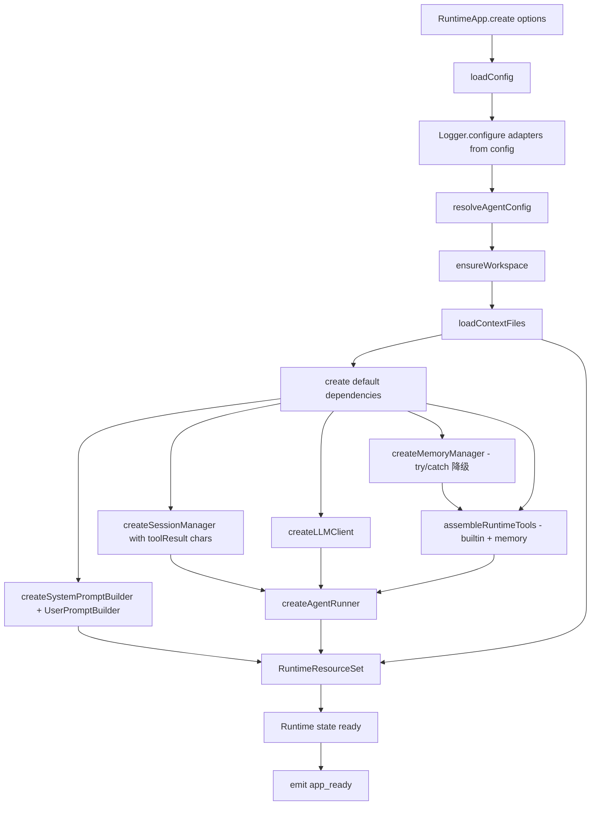
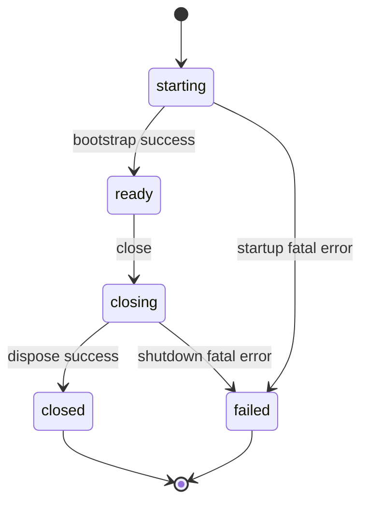

# Runtime / App Assembly 模块设计文档

> 版本：v1.0
> 创建日期：2026-05-18
> 关联：
> - [adapters-channel-design.md](./adapters-channel-design.md)
> - [core-runner-design.md](./core-runner-design.md)
> - [core-runner-message-flow.md](./core-runner-message-flow.md)
> - [../core-runner-context-design.md](../core-runner-context-design.md)
> - [../core-runner-hooks-design.md](../core-runner-hooks-design.md)
> - [../platform-config-design.md](../platform-config-design.md)

---

## 1. 概述

Runtime / App Assembly 模块是应用装配层，负责把 `workspace`、`prompt`、`session`、`llm`、`tools`、`memory`、`config`、`runner` 这些底层模块组装成一个可启动、可复用、可关闭的 Agent 应用实例，并通过 `channel` 层接入多种 I/O 形态。

它是项目的 composition root，统一回答以下问题：

- 应用启动时如何按依赖顺序初始化各组件；
- 全局配置如何映射为底层模块所需的局部 options；
- builtin tools 与 memory tools 如何拼成统一工具集；
- 一次入站消息从 channel 流入到 `AgentRunner.run()` 经过哪些阶段；
- 同一 session 的并发消息如何串行化、不同 session 之间如何并发；
- 当前活动 turn 的 steering 输入如何路由到 runner；
- approval / interaction 请求如何反向定位到起源 channel 与 client；
- 应用关闭时按什么顺序释放资源。

### 1.1 职责

- 统一加载并解析运行时配置；
- 初始化 workspace 与上下文文件；
- 创建并持有 `SessionManager`、`MemoryManager`、`LLMClient`、`SystemPromptBuilder`、`UserPromptBuilder`、`AgentRunner` 等运行时依赖；
- 组装 builtin tools 与 memory tools，生成统一的 tool executor、LLM-facing definitions 与 prompt-facing definitions；
- 注册并启停 channel；维护 channel 与 turn 之间的路由表；
- 入站消息调度：per-session 串行队列 + 当前 turn 的 steering inbox；
- 转发 approval / interaction 请求到起源 channel；
- 对外暴露高层应用接口 `create()` / `registerChannel()` / `startChannels()` / `runTurn()` / `reloadContextFiles()` / `close()`；
- 统一管理应用启动、单轮运行、资源释放三类生命周期。

### 1.2 不属于本模块的职责

- 一次 tool use loop 的内部执行细节——属于 `core/runner`；
- 单个工具的实现——属于 `core/tools` 或 `core/memory`；
- system prompt / user prompt 的 section 构建逻辑——属于 `core/prompt`；
- LLM 调用细节、流式协议、context overflow 错误识别——属于 `adapters/llm` 与 `core/runner/context`；
- channel I/O 实现（readline、WebSocket 协议、广播策略等）——属于 `adapters/channel`；
- 跨 session 并发上限、队列容量与过期策略——见 §17 已知未实现。

---

## 2. 设计原则

| 原则 | 说明 |
|---|---|
| 显式装配 | 所有高层依赖只在一个地方创建和连接，不把初始化逻辑散落到脚本或入口层 |
| 不复制底层职责 | Runtime 只负责装配、调度、运行与释放，不重新实现 tools、prompt、session、LLM 调用细节 |
| 配置驱动 | 运行时行为优先由 config 决定，单轮参数只做局部覆盖 |
| 单一真实工具面 | `Tool[]`、executor、LLM-facing definitions、prompt-facing definitions 必须来自同一份来源 |
| Per-session 串行 | 同 sessionKey 同时只跑一个 turn；跨 session 并发不互相阻塞 |
| 调度与执行解耦 | 入站消息只入队，启动决策由调度器单点掌握，执行委托给 runner |
| 起源路由 | approval / interaction 严格按起源 channel + client 反向定位，绝不广播 |
| 可降级 | memory 等可选能力初始化失败时允许降级，不让整个 runtime 无谓失败 |
| 生命周期清晰 | 启动、运行、关闭三段边界明确，关闭操作幂等 |

### 2.1 配置访问边界

除 `platform/config` 模块本身、`runtime` 模块，以及少数以"配置管理 / 外层入口"为职责的模块外，其余领域模块原则上不应直接访问 config。

这里的"直接访问 config"包括：

- 直接调用 `loadConfig()`；
- 直接调用 `resolveAgentConfig()`；
- 通过 `process.env` 绕过 Runtime 读取关键运行配置；
- 在领域模块中以完整 `AgentDefaults` 作为常规输入接口。

Runtime 层作为唯一的运行时装配根，负责：

- 加载和解析配置；
- 将全局 config 映射为各模块所需的最小配置子集；
- 以构造参数、工厂参数或 run params 的形式，把这些配置显式传给底层模块。

下列模块原则上不直接依赖 config loader：

- `core/runner`
- `adapters/llm`
- `core/session`
- `core/memory`
- `core/workspace`
- `core/prompt`
- `core/tools`

允许直接访问 config 的范围仅限于：

- `platform/config` 模块本身；
- `runtime` 模块；
- 未来的 CLI、HTTP API、IDE adapter 等外层入口模块；
- 配置编辑 / 校验 / 迁移 / 诊断这类以 config 为主职责的工具模块。

---

## 3. 与现有模块的关系

```
External Entry
  ├── CLI scripts
  ├── WebSocket server
  └── future HTTP API / IDE adapter
            │
            ▼
   ┌──────────────────────────────────┐
   │           RuntimeApp             │
   │   create / runTurn / register-   │
   │   Channel / startChannels /      │
   │   reload / close                 │
   └──────────────────────────────────┘
            │
            ├── 调度入站消息（queue + steering inbox）
            ├── 路由 approval / interaction
            ▼
   ┌──────────────────────────────────┐
   │       Runtime Resources          │
   │  config / workspace / session /  │
   │  memory / prompt / tools / llm / │
   │  runner                          │
   └──────────────────────────────────┘
```

边界要点：

- `AgentRunner` 负责"一次对话轮次如何执行"；
- `RuntimeApp` 负责"整个应用如何启动、复用资源、调度消息、运行和关闭"；
- `Channel` 负责"I/O 的接入与生命周期"，不感知 agent 内部；
- `TurnInteractionManager` 负责"in-turn 阻塞式交互的 Promise bus"。

---

## 4. 目录结构

```
src/runtime/
├── index.ts                 # 公共导出入口
├── types.ts                 # Runtime 层顶层类型（RuntimeAppOptions / RunTurnParams / 生命周期 / 事件）
├── queue-types.ts           # 入站调度专用类型（QueuedChannelTurn / PendingSteeringInput / RouteContext / LaunchContext）
├── RuntimeApp.ts            # 主类
├── bootstrap.ts             # 启动阶段的资源装配
├── tool-registry.ts         # builtin + memory tools 装配
├── prompt-factory.ts        # config / contextFiles / tools → prompt 参数
└── errors.ts                # RuntimeErrorInfo / RuntimeError / classifyRuntimeError
```

公共 API 仅导出：

```typescript
export { RuntimeApp } from './RuntimeApp.js';
export type {
  RuntimeAppOptions,
  RuntimeDependencies,
  RuntimeResourceSet,
  RuntimeToolBundle,
  RunTurnParams,
  RunTurnResult,
  RuntimeEvent,
  RuntimeLifecyclePhase,
  RuntimeLifecycleState,
  RuntimeErrorScope,
  RuntimeErrorSeverity,
  RuntimeErrorInfo,
  RuntimeShutdownReport,
  RuntimeDisposable,
} from './types.js';
```

这样保证 Runtime 层是稳定入口，不对外泄漏一组零散 manager。

---

## 5. 整体架构

```
┌──────────────────────────────────────────────────────────────────────────────┐
│                              RuntimeApp                                       │
│                                                                               │
│  ┌────────────────┐    ┌─────────────────────────────────────────────────┐   │
│  │ messageQueue   │    │           Channel 入站调度                       │   │
│  │ BySession      │◀───│  handleInboundChannelMessage                     │   │
│  │ steeringInbox  │    │   ├─ shouldRouteMessageToSteering → inbox      │   │
│  │ BySession      │    │   └─ enqueueQueuedTurn → scheduleNextQueuedTurn │   │
│  │ activeTurnId   │    └────────────────────┬────────────────────────────┘   │
│  │ BySession      │                         │                                │
│  │ inFlightSess.  │                         ▼                                │
│  │ inFlightRuns   │            ┌─────────────────────────┐                  │
│  │ routeContext   │            │     startQueuedTurn      │                  │
│  │ ByTurn         │            │  生成 turnId / 登记路由   │                  │
│  └────────────────┘            └────────────┬─────────────┘                  │
│                                              │                               │
│                                              ▼                               │
│                                ┌───────────────────────────┐                 │
│                                │         runTurn           │                 │
│                                │  emit turn_start          │                 │
│                                │  → runTurnInternal        │                 │
│                                │  finally:                 │                 │
│                                │    清理 steering inbox    │                 │
│                                │    清理 activeTurnId      │                 │
│                                │    scheduleNextQueuedTurn │                 │
│                                └────────────┬──────────────┘                 │
│                                              │                               │
│                                              ▼                               │
│  ┌──────────────────┐                ┌─────────────────────────┐             │
│  │   AgentRunner    │◀──────────────│  resolveSession           │             │
│  │   run(...)       │               │  build system prompt      │             │
│  │                  │   reader:     │  build user prompt        │             │
│  │   getSteering    │   drainSteer  │  调 agentRunner.run({...})│             │
│  │   Messages       │   ingMessages │                           │             │
│  └────────┬─────────┘               └──────────────┬────────────┘             │
│           │                                         │                        │
│           │ AgentEvent                              │                        │
│           ▼                                         ▼                        │
│   fanout(event) ────▶ channels[i].send(event) ─▶ AgentEvent observer        │
│                                                                               │
│   before_tool_call hook ─▶ turnInteractionManager.request                    │
│                              ▼                                                │
│                          routeContextByTurn[turnId] → originChannel           │
│                              ▼                                                │
│                          channel.interaction / channel.approval               │
└──────────────────────────────────────────────────────────────────────────────┘
```

设计意图：

- 所有高层依赖只在一个地方装配；
- 入站消息走"入队 → 调度 → 启动"三段；
- runner 只负责执行；调度与路由完全在 runtime 层；
- tool executor 与 tool definitions 永远对应同一份 `Tool[]`；
- contextFiles 作为运行时缓存持有，支持显式重载；
- approval / interaction 始终按 turnId 反查 `routeContextByTurn` 定位起源。

---

## 6. 类型系统

Runtime 层不重复定义底层模块已有类型，只定义应用装配层自己的高层接口。

### 6.1 RuntimeAppOptions

```typescript
export interface RuntimeAppOptions {
  workspaceDir: string;
  agentId?: string;
  envOverrides?: DeepPartial<AgentDefaults>;
  cliOverrides?: DeepPartial<AgentDefaults>;
  dependencies?: Partial<RuntimeDependencies>;
  /** Runtime 层生命周期事件（app_start / turn_start / shutdown_* 等），不含 AgentEvent */
  onEvent?: (event: RuntimeEvent) => void;
  /**
   * 可选的 AgentEvent 观察者（telemetry / 调试日志用）。
   * RuntimeApp 在 fanout 闭包末尾调用此回调，与 channel.send 并行触发。
   */
  onAgentEvent?: (event: AgentEvent) => void;
}
```

`onEvent` 与 `onAgentEvent` 分属两套事件平面：

- `onEvent` 处理应用装配与生命周期事件（启动 / 关闭 / turn 边界 / 错误降级）；
- `onAgentEvent` 处理一次 turn 内部产生的 AgentEvent 流（text_delta / tool_use / tool_result / compaction_* 等）。

### 6.2 RuntimeDependencies

显式依赖注入接口，接收"运行时映射后的局部 options"而非完整 `AgentDefaults`：

```typescript
export interface RuntimeLLMClientOptions {
  apiKey?: string;
  baseURL?: string;
  defaultModel?: string;
  maxTokens?: number;
}

export interface RuntimeMemoryOptions {
  workspaceDir: string;
  enabled: boolean;
  dbPath?: string;
  embedding?: AgentDefaults['memory']['embedding'];
  search?: AgentDefaults['memory']['search'];
}

export interface RuntimeBuiltinToolOptions {
  workspaceDir: string;
  webFetchEnabled?: boolean;
  execEnabled?: boolean;
  processEnabled?: boolean;
}

export interface RuntimeDependencies {
  createLLMClient(options: RuntimeLLMClientOptions): LLMClient;
  createSessionManager(workspaceDir: string, options?: SessionManagerOptions): SessionManager;
  createMemoryManager(options: RuntimeMemoryOptions): Promise<MemoryManager | null>;
  createSystemPromptBuilder(): SystemPromptBuilder;
  createAgentRunner(config: AgentRunnerConfig): AgentRunner;
  getBuiltinTools(options: RuntimeBuiltinToolOptions): Tool[];
}
```

每个工厂方法只接收自己真正需要的最小配置子集；Runtime 真正承担"把全局配置映射为局部 options"的职责。

### 6.3 RunTurnParams

```typescript
export interface RunTurnParams {
  sessionKey: string;
  message: string;
  model?: string;
  maxTokens?: number;
  /** 单次 run 允许的最大 LLM 调用次数；不传则使用 runner.maxLlmCalls */
  maxLlmCalls?: number;
  /** turn 内新消息注入模式；不传则使用 runner.inTurnMessageMode */
  inTurnMessageMode?: 'steer' | 'followup';
  promptMode?: AgentDefaults['prompt']['mode'];
  safetyLevel?: AgentDefaults['prompt']['safetyLevel'];
  reloadContextFiles?: boolean;
  /** 可选 turn 标识；不提供则由 RuntimeApp 自动生成 UUID 后透传给 AgentRunner */
  turnId?: string;
}
```

设计原则：

- 绝大多数字段默认继承 resolved config；
- 单轮允许局部覆盖；
- `reloadContextFiles` 是一个显式动作，不默认每轮触发；
- `turnId` 由 RuntimeApp 在 channel 接入路径生成（详见 §8.6），库消费者也可显式传入用于日志关联。**不暴露 `clientId`**——它属于 channel ↔ RuntimeApp 的内部路由元数据，封装在 `MessageRouteContext` 里。

### 6.4 RunTurnResult

```typescript
export interface RunTurnResult {
  sessionKey: string;
  text: string;
  content: ChatContentBlock[];
  stopReason: string;
  usage: TokenUsage;
  toolRounds: number;
}
```

对 `AgentRunner.run()` 结果做轻量包装，保留应用入口更关心的信息。

### 6.5 队列与路由类型

集中放在 `src/runtime/queue-types.ts`：

```typescript
import type { Channel } from '../adapters/channel/types.js';
import type { RunTurnParams } from './types.js';

/** 一次 turn 启动时可被 channel 局部覆盖的参数 */
export type TurnLaunchContext = Pick<
  RunTurnParams,
  'model' | 'maxTokens' | 'maxLlmCalls'
>;

/** approval / interaction 反向定位起源所需的最小元数据 */
export type MessageRouteContext = {
  originChannel?: Channel;
  originClientId?: string;
};

/** 普通入站消息进入 session 队列后的最小保留形态 */
export type QueuedChannelTurn = {
  sessionKey: string;
  message: string;
  launchContext?: TurnLaunchContext;
  routeContext?: MessageRouteContext;
};

/** 当前活动 run-turn 可在执行中途消费的最小 steering 输入形态 */
export type PendingSteeringInput = {
  message: string;
  routeContext?: MessageRouteContext;
};
```

放在 `runtime/` 而非 `adapters/channel/` 的原因：这些类型描述的是 runtime 内部入站调度，channel 层只负责生产 `ChannelRunRequest`，对队列形态不感知。

### 6.6 生命周期、错误与事件

```typescript
export type RuntimeLifecyclePhase =
  | 'starting'
  | 'ready'
  | 'running'
  | 'closing'
  | 'closed'
  | 'failed';

export interface RuntimeLifecycleState {
  phase: RuntimeLifecyclePhase;
  startedAt: number;
  readyAt?: number;
  closedAt?: number;
  lastRunStartedAt?: number;
  lastRunEndedAt?: number;
  activeRunCount: number;
  contextVersion: number;
  lastError?: { message: string; at: number; scope: RuntimeErrorScope };
}

export type RuntimeErrorScope = 'startup' | 'run' | 'reload' | 'shutdown';
export type RuntimeErrorSeverity = 'warning' | 'recoverable' | 'fatal';

export type RuntimeErrorCode =
  | 'CONFIG_INVALID'
  | 'MODEL_MISSING'
  | 'WORKSPACE_INIT_FAILED'
  | 'CONTEXT_LOAD_FAILED'
  | 'MEMORY_INIT_FAILED'
  | 'TOOL_ASSEMBLY_FAILED'
  | 'RUN_REJECTED'
  | 'RUN_FAILED'
  | 'SHUTDOWN_FAILED';

export interface RuntimeErrorInfo {
  scope: RuntimeErrorScope;
  severity: RuntimeErrorSeverity;
  code: RuntimeErrorCode;
  message: string;
  cause?: Error;
}

export interface RuntimeShutdownReport {
  reason?: string;
  startedAt: number;
  finishedAt: number;
  completed: string[];
  failed: Array<{ resource: string; message: string }>;
}

export type RuntimeEvent =
  | { type: 'app_start'; workspaceDir: string }
  | { type: 'app_ready'; workspaceDir: string; contextVersion: number; toolNames: string[]; memoryEnabled: boolean }
  | { type: 'turn_start'; sessionKey: string; contextVersion: number }
  | { type: 'turn_end'; sessionKey: string; result: RunTurnResult }
  | { type: 'context_reload'; contextVersion: number; fileCount: number }
  | { type: 'warning'; info: RuntimeErrorInfo }
  | { type: 'error'; info: RuntimeErrorInfo }
  | { type: 'shutdown_start'; reason?: string }
  | { type: 'shutdown_end'; report: RuntimeShutdownReport };
```

Runtime 层只暴露应用装配和生命周期所需的最小事件面，不引入更细的执行事件总线。具体到 turn 内的细节（text_delta / tool_use / compaction_start 等）属于 AgentEvent。

---

## 7. 启动流程

入口固定为 `bootstrapRuntime()`，由它把 config、logger、workspace、memory、tools、runner 串起来。



```typescript
export async function bootstrapRuntime(
  options: RuntimeAppOptions,
): Promise<RuntimeBootstrapResult> {
  const appConfig = loadConfig({ workspaceDir: options.workspaceDir });

  await Logger.configure({
    adapters: buildLogAdaptersFromConfig(appConfig.logger, options.workspaceDir),
    minLevel: appConfig.logger.minLevel ?? 'info',
  });

  const resolvedConfig = resolveAgentConfig(appConfig, {
    agentId: options.agentId,
    envOverrides: options.envOverrides,
    cliOverrides: options.cliOverrides,
  });

  await ensureWorkspace(options.workspaceDir);

  const contextFiles = await loadContextFiles(options.workspaceDir, {
    mode: resolveContextLoadMode(resolvedConfig.prompt.mode),
    maxFileChars: resolvedConfig.workspace.maxFileChars,
    maxTotalChars: resolvedConfig.workspace.maxTotalChars,
  });

  const deps = createDefaultRuntimeDependencies(options.dependencies);

  const sessionManager = deps.createSessionManager(options.workspaceDir, {
    toolResultHeadChars: resolvedConfig.compaction.toolResultHeadChars,
    toolResultTailChars: resolvedConfig.compaction.toolResultTailChars,
  });
  const llmClient = deps.createLLMClient({
    apiKey: resolvedConfig.llm.apiKey,
    baseURL: resolvedConfig.llm.baseURL,
    defaultModel: resolvedConfig.llm.model,
    maxTokens: resolvedConfig.llm.maxTokens,
  });
  const systemPromptBuilder = deps.createSystemPromptBuilder();
  const userPromptBuilder = new UserPromptBuilder();

  let memoryManager = null;
  try {
    memoryManager = await deps.createMemoryManager({
      workspaceDir: options.workspaceDir,
      enabled: resolvedConfig.memory.enabled,
      dbPath: resolvedConfig.memory.dbPath,
      embedding: resolvedConfig.memory.embedding,
      search: resolvedConfig.memory.search,
    });
  } catch (error) {
    emit(options.onEvent, {
      type: 'warning',
      info: { ...classifyRuntimeError('startup', error), code: 'MEMORY_INIT_FAILED', severity: 'recoverable' },
    });
  }

  const toolBundle = assembleRuntimeTools({
    builtinTools: deps.getBuiltinTools({ workspaceDir: options.workspaceDir, /* ... */ }),
    memoryManager,
  });

  const agentRunner = deps.createAgentRunner({
    llmClient,
    sessionManager,
    toolExecutor: toolBundle.executor,
    onEvent: options.onAgentEvent,
  });

  return {
    resources: { /* ... */ },
    state: {
      phase: 'ready',
      startedAt,
      readyAt: Date.now(),
      activeRunCount: 0,
      contextVersion: 1,
    },
  };
}
```

### 7.1 启动时创建一次的资源

以下资源在 `create()` 时创建，并贯穿整个应用生命周期：

- `resolvedConfig`；
- `SessionManager`；
- `LLMClient`；
- `MemoryManager`（可能为 `null`）；
- `toolBundle`；
- `SystemPromptBuilder` / `UserPromptBuilder`；
- `AgentRunner`。

### 7.2 启动时加载、运行时可刷新的数据

- `contextFiles`：首次加载缓存，通过 `reloadContextFiles()` 显式重载。

每次 reload 成功后 `contextVersion += 1`，并 emit `context_reload`。失败时保留旧 `contextFiles` 并 emit `warning`，不向上抛错。

### 7.3 Memory 初始化策略

- `memory.enabled = false`：不创建 `MemoryManager`，不注入 memory tools；
- `memory.enabled = true` 且初始化成功：注入 memory tools；
- `memory.enabled = true` 但初始化失败：emit `warning`，继续启动，但不注入 memory tools。

把 memory 视为可选能力，避免它成为启动硬依赖。

### 7.4 fanout 与 channels[] 共享引用

`RuntimeApp.create()` 创建一个空 `channels[]` 数组，构造 fanout 闭包后传给 `bootstrapRuntime` 作为 `onAgentEvent`，再用同一份 `channels[]` 引用构造 `RuntimeApp` 实例。这样 `registerChannel` 后续 push 进的 channel，闭包都能即时看到：

```typescript
static async create(options: RuntimeAppOptions): Promise<RuntimeApp> {
  const channels: Channel[] = [];
  const userObserver = options.onAgentEvent;

  const fanout = (event: AgentEvent) => {
    for (const channel of channels) {
      try { channel.send(event); }
      catch (err) { log.warn('channel.send failed', { channelId: channel.id, eventType: event.type }); }
    }
    userObserver?.(event);
  };

  const { resources, state } = await bootstrapRuntime({ ...options, onAgentEvent: fanout });
  return new RuntimeApp(resources, state, channels, options.onEvent);
}
```

`channel.send` 抛错被吞为 warning log，不中断事件分发——单个 channel 的故障不应影响其它 channel 与 user observer。

---

## 8. 入站调度与单轮运行

入站消息的完整生命周期由四段组成：channel 入站 → 入队 / 路由 steering → 调度 → 执行。

### 8.1 Channel 入站统一入口

```typescript
private makeMessageHandler(channel: Channel) {
  return async (req: ChannelRunRequest) => {
    await this.handleInboundChannelMessage(channel, req);
  };
}

private async handleInboundChannelMessage(
  channel: Channel,
  req: ChannelRunRequest,
): Promise<void> {
  if (this.shouldRouteMessageToSteering(req.sessionKey)) {
    this.enqueueSteeringInput(
      req.sessionKey,
      req.message,
      this.buildMessageRouteContext(channel, req),
    );
    return;
  }

  const queuedTurn: QueuedChannelTurn = {
    sessionKey: req.sessionKey,
    message: req.message,
    launchContext: this.buildTurnLaunchContext(req),
    routeContext: this.buildMessageRouteContext(channel, req),
  };

  this.enqueueQueuedTurn(queuedTurn);

  const started = this.scheduleNextQueuedTurn(req.sessionKey);
  if (started) await started;
}
```

要点：

- **入站只 `enqueue`**，从不直接 `runTurn`；
- **`await started`** 让 channel 的 `onMessage` 回调能与 turn 生命周期对齐——这对 `CliChannel` 的阻塞式 readline 很重要；WebSocketChannel 不依赖此 await，但仍受益于 backpressure；
- **`launchContext` 仅在 channel 显式覆盖参数时才构造**（`buildTurnLaunchContext` 在三个字段全 undefined 时返回 `undefined`），避免无意义对象。

### 8.2 Steering 路由判定

```typescript
private shouldRouteMessageToSteering(sessionKey: string): boolean {
  return this.resources.resolvedConfig.runner.inTurnMessageMode === 'steer'
    && this.activeTurnIdBySession.has(sessionKey);
}
```

两个必要条件：

1. **配置** `runner.inTurnMessageMode === 'steer'`；默认是 `followup`，必须显式配置才会启用 steering。
2. **存在活动 turn**：通过 `activeTurnIdBySession` 判定，确保 inbox 里的输入总能映射到一个正在执行的 run-turn。

任一条件不满足，消息都退回普通队列。这条规则保证 **"没有活动 turn 的消息默认回到普通排队路径"**——避免 steering 因没有 reader 而被静默丢弃。

### 8.3 普通消息队列

per-session FIFO 队列：

```typescript
private readonly messageQueueBySession = new Map<string, QueuedChannelTurn[]>();

private enqueueQueuedTurn(item: QueuedChannelTurn): void {
  const queue = this.messageQueueBySession.get(item.sessionKey) ?? [];
  queue.push(item);
  this.messageQueueBySession.set(item.sessionKey, queue);
}
```

队列为空时 `delete` 释放，避免空 array 长期驻留 Map。

### 8.4 Steering inbox

per-session 累积桶，但只服务当前活动 turn：

```typescript
private readonly steeringInboxBySession = new Map<string, PendingSteeringInput[]>();

private enqueueSteeringInput(
  sessionKey: string,
  message: string,
  routeContext?: MessageRouteContext,
): void {
  const inbox = this.steeringInboxBySession.get(sessionKey) ?? [];
  inbox.push({ message, routeContext });
  this.steeringInboxBySession.set(sessionKey, inbox);
}
```

runner 通过 reader 读取并清空：

```typescript
private async drainSteeringMessages(sessionKey: string): Promise<ChatMessage[]> {
  const inbox = this.steeringInboxBySession.get(sessionKey);
  if (!inbox || inbox.length === 0) return [];

  this.steeringInboxBySession.delete(sessionKey);

  return Promise.all(inbox.map(async (item) => {
    const builtUserPrompt = await this.resources.userPromptBuilder.build({ text: item.message });
    return { role: 'user' as const, content: builtUserPrompt.text } satisfies ChatMessage;
  }));
}
```

关键不变量：

- **读后即删**：避免同一条 steering 输入在多个注入点被重复消费；
- **role 固定为 user**：注入 assistant / toolResult 会破坏 Anthropic API 的消息序列契约；
- **通过 `userPromptBuilder` 走一次构建**：与首条消息保持一致的预处理路径；
- **turn 结束时无条件清空**（见 §8.7）：steering 严格收口在"当前活动 turn 的生命周期"内。

`routeContext` 当前未被 runner 消费，但仍保留在 inbox 项里——给未来"统一消息路由模型"留口子，例如允许 steering 触发独立的 interaction 请求。

### 8.5 调度器

同 session 串行的最小调度器：

```typescript
private scheduleNextQueuedTurn(sessionKey: string): Promise<RunTurnResult> | undefined {
  if (this.inFlightSessions.has(sessionKey)) return undefined;

  const queue = this.messageQueueBySession.get(sessionKey);
  if (!queue || queue.length === 0) return undefined;

  const next = queue.shift();
  if (!next) return undefined;
  if (queue.length === 0) this.messageQueueBySession.delete(sessionKey);

  return this.startQueuedTurn(next);
}
```

特点：

- **同步判定**：返回 `Promise | undefined`，由调用方选择是否 `await`；
- **不递归 await**：当前 turn 的 `finally` 中续推下一条用 `void next.catch(...)`，避免长链式等待；
- **跨 session 完全并发**：调度器只看 `sessionKey`，不同 session 互不阻塞。

跨 session 并发上限的控制属于 §17 列出的规划项，当前未实现。

### 8.6 turnId 生成时机

`turnId` 在 `startQueuedTurn` 弹出队头、即将真正启动时生成：

```typescript
private async startQueuedTurn(item: QueuedChannelTurn): Promise<RunTurnResult> {
  const turnId = randomUUID();
  if (item.routeContext) {
    this.routeContextByTurn.set(turnId, item.routeContext);
  }

  try {
    return await this.runTurn({
      sessionKey: item.sessionKey,
      message: item.message,
      model: item.launchContext?.model,
      maxTokens: item.launchContext?.maxTokens,
      maxLlmCalls: item.launchContext?.maxLlmCalls,
      turnId,
    });
  } finally {
    this.routeContextByTurn.delete(turnId);
  }
}
```

设计要点：

- **排队阶段不占用 turn 级资源**——不污染路由 Map，不预定 turnId；
- 若 channel 在排队阶段断开，可在调度前直接丢弃队列项，不会留下 dangling turnId；
- 库消费者直接调 `app.runTurn()` 时也可显式传入 `turnId` 用于日志关联；不传则由 `runTurn` 自己生成。

### 8.7 runTurn 主体

```typescript
async runTurn(params: RunTurnParams): Promise<RunTurnResult> {
  this.assertCanRunForSession(params.sessionKey);

  this.inFlightSessions.add(params.sessionKey);
  this.state.activeRunCount += 1;
  this.state.lastRunStartedAt = Date.now();
  this.emit({ type: 'turn_start', sessionKey: params.sessionKey, contextVersion: this.state.contextVersion });

  const turnId = params.turnId ?? randomUUID();
  this.activeTurnIdBySession.set(params.sessionKey, turnId);

  const runPromise = this.runTurnInternal({ ...params, turnId });
  this.inFlightRuns.add(runPromise);

  try {
    const result = await runPromise;
    this.emit({ type: 'turn_end', sessionKey: params.sessionKey, result });
    return result;
  } catch (error) {
    const info = classifyRuntimeError('run', error);
    this.recordError('run', info);
    throw createRuntimeError(info);
  } finally {
    this.inFlightRuns.delete(runPromise);
    this.inFlightSessions.delete(params.sessionKey);

    if (this.activeTurnIdBySession.get(params.sessionKey) === turnId) {
      this.activeTurnIdBySession.delete(params.sessionKey);
    }
    this.steeringInboxBySession.delete(params.sessionKey);

    this.state.activeRunCount = Math.max(0, this.state.activeRunCount - 1);
    this.state.lastRunEndedAt = Date.now();

    const next = this.scheduleNextQueuedTurn(params.sessionKey);
    if (next) {
      void next.catch((error) => log.warn('queued turn failed after scheduling', {
        sessionKey: params.sessionKey,
        error: error instanceof Error ? error.message : String(error),
      }));
    }
  }
}
```

`finally` 中四件事必须无条件执行：

1. **`activeTurnIdBySession` 清理**：仅当当前 turnId 仍是登记值时清除（防御后续 turn 已覆盖）；
2. **`steeringInboxBySession` 清空**：无论 turn 成功、失败、是否消费过 steering，inbox 都强制丢弃；
3. **`activeRunCount` 回收**：用 `Math.max(0, ...)` 防御性归零；
4. **续推队头**：`void next.catch(...)` 异步触发，当前 turn 的收尾不被下一条阻塞。

### 8.8 runTurnInternal 与 runner 调用

```typescript
private async runTurnInternal(params: RunTurnParams & { turnId: string }): Promise<RunTurnResult> {
  await this.resources.sessionManager.resolveSession(params.sessionKey);

  if (params.reloadContextFiles) {
    await this.reloadContextFiles();
  }

  const systemPrompt = this.resources.systemPromptBuilder.build(
    buildSystemPromptParams({
      config: this.resources.resolvedConfig,
      contextFiles: this.resources.contextFiles,
      promptDefinitions: this.resources.toolBundle.promptDefinitions,
      overrides: params,
    }),
  );

  const builtUserPrompt = await this.resources.userPromptBuilder.build({ text: params.message });

  const result = await this.resources.agentRunner.run({
    sessionKey: params.sessionKey,
    message: builtUserPrompt.text,
    model: this.requireModel(params.model),
    systemPrompt,
    turnId: params.turnId,
    tools: this.resources.toolBundle.llmDefinitions,
    maxTokens: params.maxTokens ?? this.resources.resolvedConfig.llm.maxTokens,
    maxLlmCalls: params.maxLlmCalls ?? this.resources.resolvedConfig.runner.maxLlmCalls,
    inTurnMessageMode:
      params.inTurnMessageMode ?? this.resources.resolvedConfig.runner.inTurnMessageMode,
    getSteeringMessages: async () => this.drainSteeringMessages(params.sessionKey),
    compaction: this.resources.resolvedConfig.compaction,
    contextWindowTokens: this.resources.resolvedConfig.llm.contextWindowTokens,
  });

  return {
    sessionKey: params.sessionKey,
    text: result.text,
    content: result.content,
    stopReason: result.stopReason,
    usage: result.usage,
    toolRounds: result.toolRounds,
  };
}
```

要点：

- **RuntimeApp 只 wire `getSteeringMessages`**；不 wire `getFollowUpMessages`——followup 语义由 per-session 队列承担，runner 的 followup 注入点对 RuntimeApp 而言是空函数；
- 模型解析走 `requireModel()`，缺失则抛 `MODEL_MISSING`；
- `compaction` 与 `contextWindowTokens` 总是从 resolved config 取，runtime 不接受单轮覆盖。

### 8.9 Session 与模型解析规则

`resolveSession()`：已存在则复用，不存在则自动创建。外部入口不需要自己先创建 session。

模型解析顺序：

```
runTurn.model
  > resolvedConfig.llm.model
  > throw MODEL_MISSING
```

Runtime 层不写死默认模型，默认值必须由 config 明确表达。

其余参数（`maxTokens` / `maxLlmCalls` / `inTurnMessageMode`）统一遵循：

```
runTurn override > resolvedConfig > 模块默认值
```

---

## 9. 工具装配策略

工具装配只有一个入口，由 `assembleRuntimeTools()` 收口：

```typescript
export interface AssembleRuntimeToolsParams {
  builtinTools: Tool[];
  memoryManager: MemoryManager | null;
}

export function assembleRuntimeTools(params: AssembleRuntimeToolsParams): RuntimeToolBundle {
  const tools: Tool[] = [...params.builtinTools];

  if (params.memoryManager) {
    tools.push(...createMemoryTools(params.memoryManager));
  }

  return {
    tools,
    executor: createToolExecutor(tools),
    llmDefinitions: toLlmToolDefinitions(tools),
    promptDefinitions: toPromptToolDefinitions(tools),
  };
}
```

`RuntimeToolBundle` 保证：executor、`llmDefinitions`、`promptDefinitions` 永远对应同一份 `Tool[]`。

### 9.1 builtin tools

显式组装，不做动态发现：

```typescript
export function getDefaultBuiltinTools(_options: RuntimeBuiltinToolOptions): Tool[] {
  return [
    listDirTool,
    readFileTool,
    fileSearchTool,
    grepSearchTool,
    applyPatchTool,
    writeFileTool,
    editFileTool,
    webFetchTool,
    execTool,
    processTool,
  ];
}
```

### 9.2 memory tools

memory 工具只在 `memoryManager` 存在时注入：

- `memory_search`
- `memory_get`
- `memory_write`

### 9.3 定义转换

`tools` / `llm-client` 使用 `input_schema`；`core/prompt` 使用 `parameters`。Runtime 层作为这个差异的唯一转换点：

```typescript
export function toPromptToolDefinitions(tools: Tool[]): PromptToolDefinition[] {
  return tools.map((tool) => ({ name: tool.name, description: tool.description, parameters: tool.inputSchema }));
}

export function toLlmToolDefinitions(tools: Tool[]): ChatToolDefinition[] {
  return tools.map((tool) => ({ name: tool.name, description: tool.description, input_schema: tool.inputSchema }));
}
```

不要把这类转换散落到 `RuntimeApp`、`core/prompt` 或脚本里。

---

## 10. 生命周期管理

### 10.1 状态机



状态转换规则：

- `starting → ready`：启动成功；
- `starting → failed`：启动阶段发生 fatal 错误；
- `ready → closing`：开始关闭；
- `closing → closed`：资源释放完成；
- `closing → failed`：关闭阶段出现不可恢复异常；
- `closed`：终态，不允许再次 `runTurn()`；
- `failed`：终态，建议重新 create，不再复用。

### 10.2 并发模型

phase 是 **runtime 级别** 的生命周期标记，不参与 per-turn 并发控制。per-turn 并发由独立的 `inFlightSessions: Set<string>` 完成：

- 同 sessionKey 串行（消息历史一致性硬约束）；
- 跨 session 可并发（多 channel / 多 client 场景必要）。

`activeRunCount` 字段作为 metric 保留。

生命周期闸口：

```typescript
private assertCanRunForSession(sessionKey: string): void;
private assertCanReload(): void;
private assertNotClosed(): void;
private setPhase(next: RuntimeLifecyclePhase): void;
private recordError(scope: RuntimeErrorScope, info: RuntimeErrorInfo, eventType?: 'warning' | 'error'): void;
```

`assertCanRunForSession` 行为：

- runtime phase ∈ `{closing, closed, failed}` → 抛 `RUN_REJECTED`；
- `inFlightSessions.has(sessionKey)` → 抛 `RUN_REJECTED`；
- 否则放行（不同 session 互不阻塞）。

注意：channel 入站走 `handleInboundChannelMessage` → 队列 → 调度路径，**不会**触发 "session busy" 错误（队列会等当前 turn 结束自动续推）。只有库消费者绕过队列直接调用 `app.runTurn()` 时才可能命中。

---

## 11. 资源释放与关闭语义

```
1. close(reason) 被调；emit shutdown_start，setPhase('closing')
2. assertCanRunForSession() 此时已开始拒绝新 turn
3. await Promise.allSettled([...inFlightRuns])     // 等待当前 turn 收尾
4. stopChannels()                                   // 释放 readline / WS 等 I/O
5. turnInteractionManager.close()                   // 拒绝 pending 交互
6. 遍历 collectDisposables()，对每个调 close()      // memory manager 等
7. resources.contextFiles = []
   state.closedAt = Date.now()
   setPhase('closed')
8. emit shutdown_end，返回 RuntimeShutdownReport
```

`close()` 必须幂等：`closePromise` 缓存第一次调用的 promise，`shutdownReport` 缓存结果。重入直接返回已有结果。

```typescript
export interface RuntimeDisposable {
  close(): void | Promise<void>;
}
```

内部释放流程使用 `Promise.allSettled`，原因：关闭阶段的目标是尽可能释放所有资源，而不是因为某个 `close()` 抛错就中断剩余清理。

关闭语义：

- `close()` 幂等；
- `close()` 后不能再 `runTurn()`；
- `close()` 允许在仍有 turn 在 `inFlightRuns` 中时触发，但要先阻止新 turn 进入并等待当前轮次结束；
- 单个资源 `close()` 失败记录 warning，但不阻止其它资源关闭；
- 关闭编排本身失败 → `setPhase('failed')`，抛 `SHUTDOWN_FAILED`。

#### 11.1 队列与 inbox 不持久化

- `messageQueueBySession` 中 close 前尚未启动的 `QueuedChannelTurn` 随 RuntimeApp 销毁而丢弃；
- `steeringInboxBySession` 中未被 runner 消费的 steering 输入也会丢失。

channel 层不应假设入队即"已被记录"——重要场景应通过 `turn_end` / `turn_start` 等事件确认。这与 steering 的"软实时"定位一致。

---

## 12. Channel 层接入

Channel 层（CLI / WebSocket 等）作为独立模块挂接 RuntimeApp，完整设计见 [adapters-channel-design.md](./adapters-channel-design.md)。本节只点明 RuntimeApp 侧承担的责任与接口面。

### 12.1 公开方法

```typescript
class RuntimeApp {
  /** 注册 channel；可多次调用注册多个 channel。必须在 startChannels() 前 */
  registerChannel(channel: Channel): void;

  /** 启动所有已注册 channel；先调 wireApprovalRouting() 再并行 channel.start() */
  startChannels(): Promise<void>;

  /** 停止所有 channel；幂等。close() 内部会自动调用 */
  stopChannels(): Promise<void>;
}
```

`startChannels()` 用 `Promise.all` 并行启动，因为 `CliChannel.start()` 是阻塞的（readline 循环），不能让它阻塞其它 channel 的启动。

### 12.2 内部字段

| 字段 | 用途 |
|---|---|
| `channels: Channel[]` | 与 bootstrap fanout 闭包共享引用——闭包遍历此数组分发 AgentEvent 到每个 channel |
| `turnInteractionManager: TurnInteractionManager` | 进程内 Promise bus，连接 `before_tool_call` hook 与 channel 的 interaction / approval adapter |
| `routeContextByTurn: Map<turnId, MessageRouteContext>` | turn → 起源 channel + 起源 clientId；approval / interaction 按此路由（不广播） |
| `inFlightSessions: Set<string>` | per-session 串行 gate |
| `inFlightRuns: Set<Promise<unknown>>` | shutdown 时统一 `Promise.allSettled` 等待 |
| `messageQueueBySession: Map<string, QueuedChannelTurn[]>` | per-session 普通消息队列 |
| `steeringInboxBySession: Map<string, PendingSteeringInput[]>` | 当前活动 turn 的 steering inbox |
| `activeTurnIdBySession: Map<string, string>` | 当前活动 turn 的 turnId（steering 路由依赖） |
| `approvalRoutingWired: boolean` | `wireApprovalRouting` 幂等标记 |
| `channelsStarted: boolean` | `startChannels` 幂等标记 |
| `closePromise / shutdownReport` | `close()` 的幂等缓存 |

#### `inFlightSessions` vs `activeTurnIdBySession`

两者语义不同，不要合并：

- `inFlightSessions` 表达 **"该 session 当前是否 busy"**——只要 `runTurn()` 的 Promise 在 `inFlightRuns` 里就 busy。Busy session 不应再被 `scheduleNextQueuedTurn()` 启动新 turn。
- `activeTurnIdBySession` 表达 **"该 session 是否存在一个可接 steering 的活动 run-turn"**——只在 `runTurn()` 真正进入到设置 turnId 的代码点之后才填，turn 结束时显式清除。

`shouldRouteMessageToSteering()` 用的是后者，原因有二：

1. Steering 必须能精准定位到一个具体的 `turnId`，否则 runner 拿不到 reader 上下文；
2. 未来若把 steering 的"接收窗口"收窄到 turn 内的特定阶段（例如只在 tool 执行间隙），需要的也是这种"per-turn 运行态"而不是"session 是否 busy"。

### 12.3 fanout 闭包

`channels[]` 数组在 `create()` 阶段就存在，后续 `registerChannel` push 进去的 channel 闭包都能即时看到（详见 §7.4）。

---

## 13. Approval / Interaction 路由

`wireApprovalRouting` 在第一次 `startChannels()` 时调用，仅在至少一个 channel 提供 `interaction` 或 `approval` 能力时才装上 hook，否则库模式所有 tool 调用直通。

```typescript
private wireApprovalRouting(): void {
  if (this.approvalRoutingWired) return;
  if (!this.channels.some((c) => c.interaction || c.approval)) return;
  this.approvalRoutingWired = true;

  // hook → TurnInteractionManager
  this.resources.agentRunner.on('before_tool_call', async ({ toolName, input, turnId, sessionKey }) => {
    const result = await this.turnInteractionManager.request({
      toolName,
      input,
      sessionKey,
      turnId,
      originClientId: this.routeContextByTurn.get(turnId)?.originClientId,
    });
    return result.decision === 'allow'
      ? { action: 'allow' as const }
      : { action: 'deny' as const, reason: result.reason === 'timeout' ? 'Denied by timeout' : 'Denied by user' };
  });

  // TurnInteractionManager → 起源 channel
  this.turnInteractionManager.onRequest((request) => {
    const originChannel = this.routeContextByTurn.get(request.turnId)?.originChannel;
    if (!originChannel) return;  // 起源不可达：让 TurnInteractionManager 走超时

    if (originChannel.interaction) {
      originChannel.interaction.sendInteractionRequest({ ...request, kind: 'approval' });
      return;
    }
    originChannel.approval?.sendApprovalRequest(request);
  });

  this.turnInteractionManager.onExpire((request) => {
    const originChannel = this.routeContextByTurn.get(request.turnId)?.originChannel;
    if (!originChannel) return;

    if (originChannel.interaction) {
      originChannel.interaction.sendInteractionExpired({ ...request, kind: 'approval' });
      return;
    }
    originChannel.approval?.sendApprovalExpired(request);
  });
}
```

设计要点：

- **起源路由，不广播**：approval / interaction 严格按 turnId 反查 `routeContextByTurn` 定位起源；
- **起源不可达的容错策略**：`onRequest` / `onExpire` 中若 `routeContext` 已被清理（最常见的情况：turn 已结束但 manager 还有残留事件），回调直接 `return`；不抛错，也不广播。`TurnInteractionManager` 自身的超时机制兜底；
- **interaction 优先于 approval**：若 channel 同时实现两个 adapter，优先走通用 interaction 路径（Phase 2 形态），approval 仅作向后兼容；
- **库模式自动直通**：所有 channel 都没有 `interaction` / `approval` 时，hook 根本不注册，runner 不会被任何 approval 阻塞。

`channel.interaction.onInteractionResponse` 的入站桥接由 `handleInteractionResponse` 处理：仅处理 `kind === 'approval'`，未提交一律按 `deny` 兜底；不支持的 kind 记 warn。

---

## 14. 错误处理与降级策略

按 scope 和 severity 统一处理，所有错误经 `classifyRuntimeError()` 归一：

```typescript
export function classifyRuntimeError(scope: RuntimeErrorScope, error: unknown): RuntimeErrorInfo;
```

### 14.1 startup 阶段

| 情况 | severity | 处理 |
|---|---|---|
| config 文件损坏 | `warning` | 降级为默认配置 |
| `llm.apiKey` 缺失且 `LLMClient` 无法构造 | `fatal` | `create()` 失败 |
| `ensureWorkspace()` 失败 | `fatal` | `create()` 失败 |
| memory 初始化失败 | `recoverable` | 禁用 memory tools，继续启动 |
| tool 装配失败 | `fatal` | `create()` 失败 |

### 14.2 run 阶段

| 情况 | severity | 处理 |
|---|---|---|
| 当前 phase ∈ `{closing, closed, failed}` | `recoverable` | 抛 `RUN_REJECTED`，不销毁 app |
| 同 sessionKey 已 busy（仅直接调 `runTurn()` 时） | `recoverable` | 抛 `RUN_REJECTED` |
| 未提供 model 且 config 无默认 | `recoverable` | 抛 `MODEL_MISSING`，本轮失败 |
| `AgentRunner.run()` 抛错 | `recoverable` | 记录错误，本轮失败 |
| tool 执行错误 | — | 由 tool layer 处理为 `ToolResult.isError`，不升级为 app failure |

### 14.3 reload 阶段

| 情况 | severity | 处理 |
|---|---|---|
| `reloadContextFiles()` 失败 | `recoverable` | 保留旧 `contextFiles`，emit warning |
| 部分文件读取失败 | `warning` | 跳过失败文件 |

### 14.4 shutdown 阶段

| 情况 | severity | 处理 |
|---|---|---|
| 单个资源 `close()` 失败 | `warning` | 继续释放其它资源 |
| 关闭编排本身失败 | `fatal` | `setPhase('failed')`，抛 `SHUTDOWN_FAILED` |

设计要点：把运行失败限制在单次 turn 内，而不是让一次 run 的失败自动污染整个应用生命周期。

---

## 15. 可观测性

### 15.1 事件分层

- **`RuntimeEvent`**：应用装配与生命周期事件（`app_start` / `app_ready` / `turn_start` / `turn_end` / `context_reload` / `warning` / `error` / `shutdown_*`）；通过 `RuntimeAppOptions.onEvent` 暴露；
- **`AgentEvent`**：一次 turn 内部产生的执行事件（`text_delta` / `tool_use` / `tool_result` / `llm_call` / `compaction_*` 等）；通过 `RuntimeAppOptions.onAgentEvent` 与所有已注册 channel 的 `send()` 同时分发。

两套事件保持分层，不互相替代。

### 15.2 RuntimeEvent 触发时机

| 时机 | 事件 |
|---|---|
| `create()` 开始 | `app_start` |
| `create()` 成功 | `app_ready` |
| memory 降级 | `warning` |
| reload 成功 | `context_reload` |
| reload 失败 | `warning` |
| `runTurn()` 开始 | `turn_start` |
| `runTurn()` 成功 | `turn_end` |
| `runTurn()` 失败 | `error` |
| `close()` 开始 | `shutdown_start` |
| `close()` 结束 | `shutdown_end` |

### 15.3 结构化日志

Runtime 内所有关键路径都通过 `Logger.get('RuntimeApp')` 输出结构化日志（channel 注册 / 启动停止、入站消息、approval 路由、turn 起止、shutdown 进度）。日志 adapter 与 minLevel 由 config 驱动（`platform/config` + `platform/logger`），具体配置见 [platform-logger-design.md](../platform-logger-design.md)。

---

## 16. 测试策略

测试分 4 层。

### 16.1 纯函数测试

对象：

- tool definition 转换函数（`toLlmToolDefinitions` / `toPromptToolDefinitions`）；
- `prompt-factory`；
- `classifyRuntimeError`；
- 生命周期 guard。

覆盖点：

- `Tool[]` 正确转换为 `llmDefinitions` / `promptDefinitions`；
- `memoryManager = null` 时不注入 memory tools；
- `promptMode` / `safetyLevel` override 正确覆盖 config 默认值；
- `classifyRuntimeError()` 在不同 scope 下返回正确 code 和 severity。

### 16.2 RuntimeApp 单元测试

通过依赖注入替换 `LLMClient` / `SessionManager` / `MemoryManager` / `AgentRunner`。

覆盖点：

- `create()` 调用顺序正确；
- `runTurn()` 自动 `resolveSession()`；
- 模型优先级正确（override > config > 报错）；
- `inTurnMessageMode` 单轮覆盖能透传给 runner；
- `reloadContextFiles()` 成功后 `contextVersion` 递增；
- `close()` 幂等，关闭后 `runTurn()` 被拒绝；
- memory 初始化失败时 app 仍可 ready，但 memory tools 不存在；
- **入站队列**：同 session 第二条消息在第一条 busy 时进入队列，第一条完成后自动续跑，参数（如 `maxLlmCalls`）按入队时携带的 `launchContext` 透传；
- **Steering 路由**：`runner.inTurnMessageMode='steer'` 时，busy 期间的入站消息走 steering 路径，runner 通过 `getSteeringMessages` reader 拉取，消息以 `{ role: 'user', content }` 形式呈现；
- **Approval 路由按 queued turn 的起源 client**：第二条 queued turn 的 approval 请求与超时通知都按其自身的 `originClientId` 路由。

### 16.3 轻量集成测试

使用真实的 config / workspace / session / tool registry，替换掉真实 LLM。

覆盖点：

- 从真实 `workspaceDir` 启动 `RuntimeApp`；
- `ensureWorkspace()` 和 `loadContextFiles()` 真实工作；
- `SessionManager` 正确创建 transcript；
- memory enabled / disabled 两种启动路径；
- `runTurn()` 能正确把 system prompt、tools 和 message 传给 `AgentRunner`；
- WebSocket channel 的 end-to-end approval 路由（队列场景下 originClientId 跟随 queued turn）。

### 16.4 烟雾脚本

保留 `scripts/` 下的脚本作为本地联调与手工演示工具，不再承担主回归保障。

---

## 17. 已知未实现 / 规划项

| 项 | 状态 | 说明 |
|---|---|---|
| 多 session 并发上限 | **规划中** | 当前跨 session 完全并发，无上限。未来计划加入 `runtime.maxConcurrentSessions`（或类似命名）以控制资源占用；具体策略（拒绝 / 等待 / 优先级）待设计 |
| 队列容量上限 | 规划中 | `messageQueueBySession` 当前无大小限制；恶意 / 异常客户端可能持续灌入。建议未来增加 per-session 队列上限与超额策略 |
| 队列项过期 | 规划中 | 入队消息没有 TTL；若上游 channel 断开，残留队列项仍会被启动。可考虑以 `routeContext.originChannel` 存活状态做调度时的健康检查 |
| Steering 升级（硬 steering） | 规划中 | 当前是"软 steering"：不打断在飞的 LLM 调用与 tool 执行，最坏延迟 ≈ 当前 LLM 调用剩余时间 + 一组 tool 时长。硬 steering 需要 AbortSignal 与 tool 取消协议，独立设计 |
| Steering 跨 turn 持久化 | 规划中 | 当前 turn 结束即清空 inbox；turn 在执行中失败 / 超时时已积累的 steering 输入会丢失。可考虑可选的"未消费 inbox 回退到普通队列"策略 |
| Compaction hook 语义升级 | 规划中 | 当前 `before_compaction` / `after_compaction` 都是 observer-only，与 `compaction_*` event 能力等价。给 hook 增加 `{ action: 'skip' \| 'continue' }` 返回类型可解锁 dryrun / 速率限制 / 强制降级等场景 |
| `RunResult.compactionStats` | 待讨论 | 暂不在 `RunResult` 暴露，详细统计仅通过 `compaction_end` event 提供。是否补回字段待明确消费方 |

---

## 18. 总结

Runtime / App Assembly 模块为整个项目提供 composition root：

1. **装配**：把 config、workspace、session、memory、tools、prompt、llm、runner 统一组装，对外只暴露稳定的 `RuntimeApp` 接口；
2. **调度**：channel 入站消息进入 per-session FIFO 队列；当前 turn 仍在执行时新消息只入队不启动；steering 走独立 inbox 严格收口在当前 turn 内；
3. **执行**：调度器弹出队头时才生成 turnId 并登记起源路由，再委托给 `AgentRunner.run()`；
4. **路由**：approval / interaction 按 `routeContextByTurn` 反查精准回到起源 channel 与 client，不广播；
5. **生命周期**：phase 状态机 + per-session 并发模型清晰区分应用级与单轮运行级的状态；`close()` 幂等，按固定顺序释放资源。

设计的核心收益是把"消息何时启动、Steering 怎么注入、approval 回到哪个 client"这些跨模块决策集中到 runtime 层，让 `AgentRunner` 专注于一次对话循环的执行，让 `Channel` 专注于 I/O 适配。
