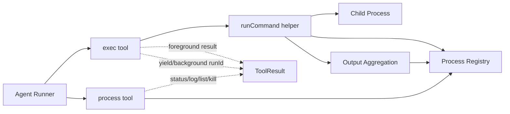
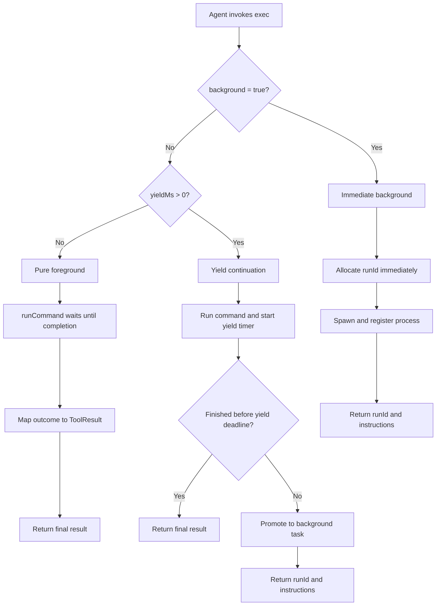
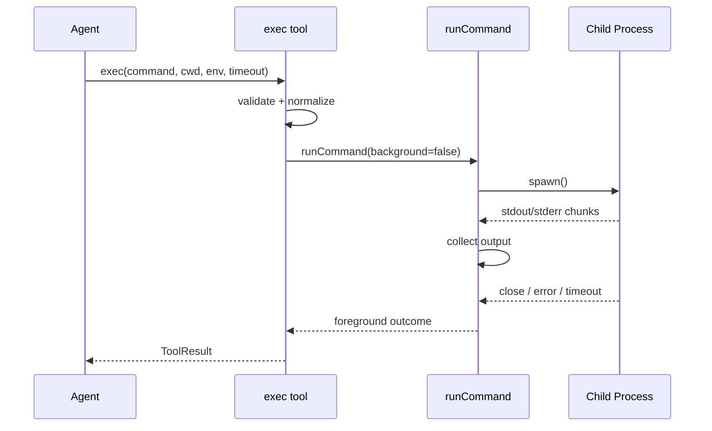
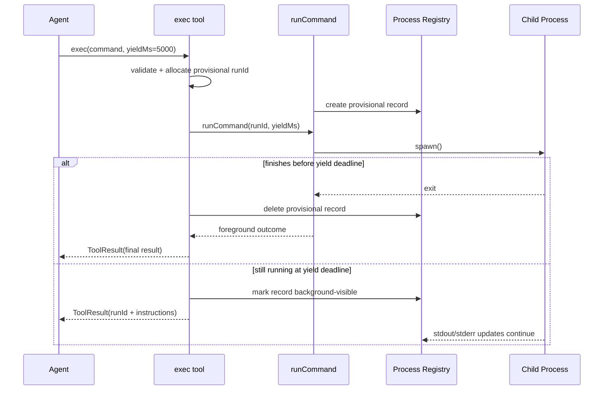
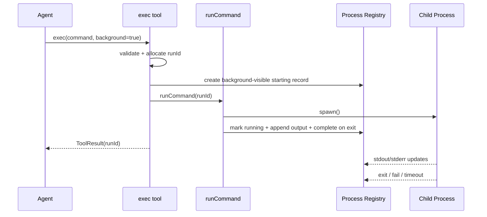
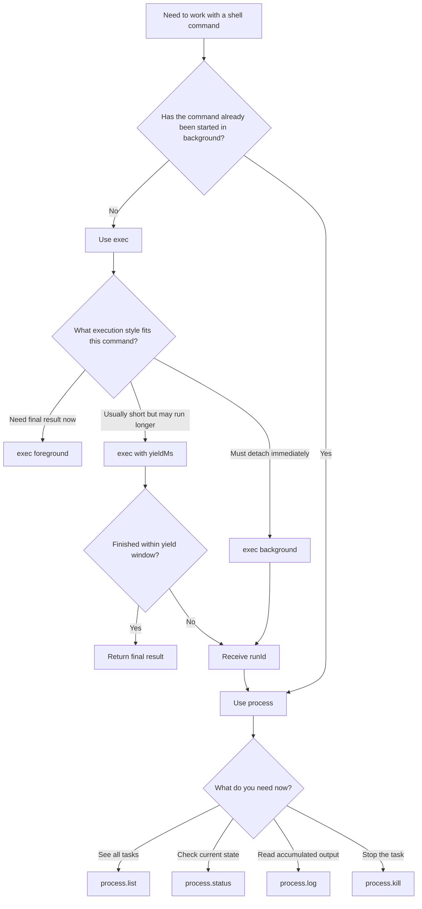
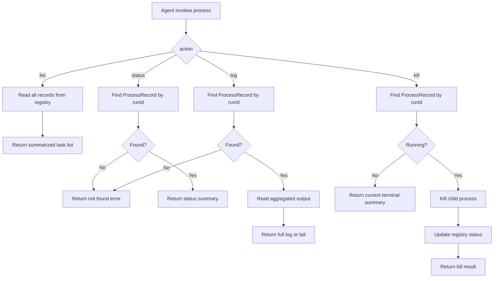
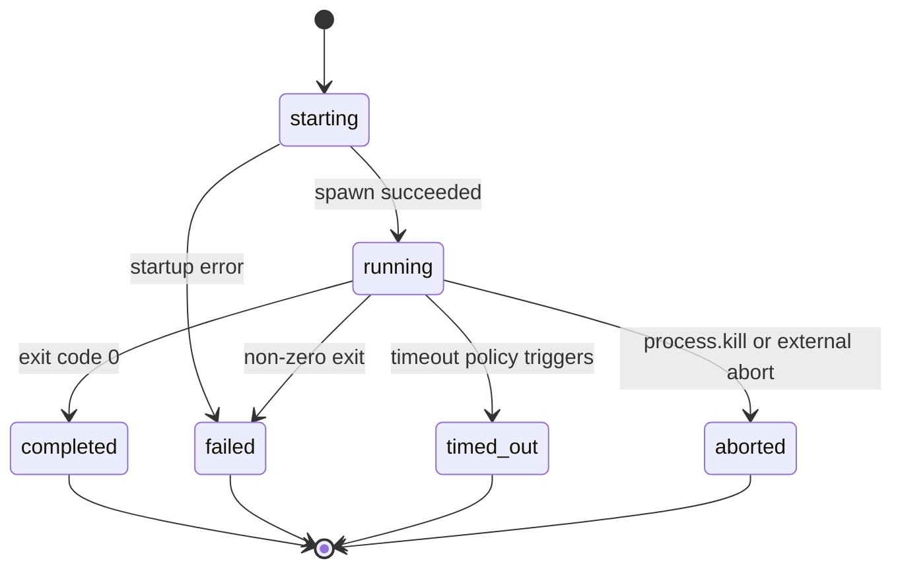
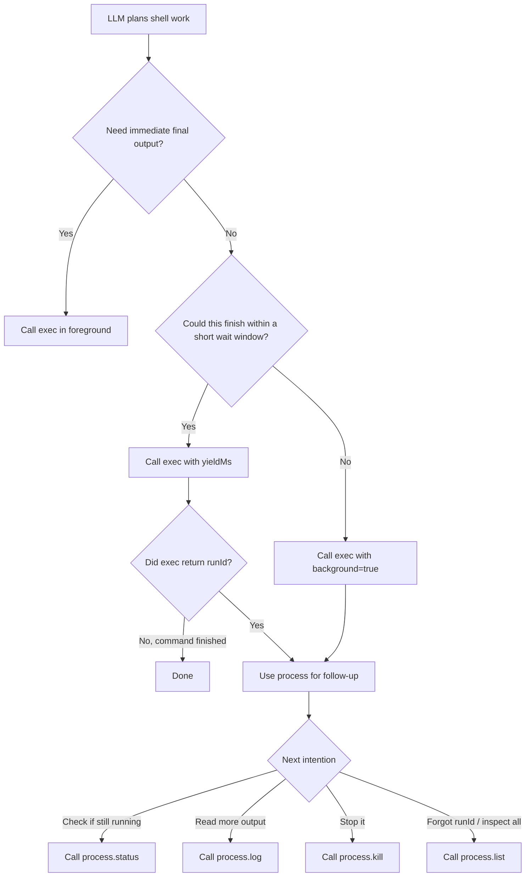

# Exec + Process 运行与交互流程设计

> 创建日期：2026-04-05  
> 适用项目：C:\dev\my-agent\my-agent  
> 参考：OpenClaw 的 `exec + process` 组合，但只吸收我们当前需要的最小结构，不引入 approval、sandbox、PTY、多宿主路由等平台级复杂度。

> 当前状态：截至 2026-04-05，本文件已对齐 `src/tools/builtin/exec.ts`、`process.ts`、`run-command.ts`、`process-registry.ts` 的 v1 实现。后文若同时出现“设计建议”和“当前行为”，以“当前行为/已实现语义”为准。

---

## 1. 设计目标

这份文档回答三个问题：

1. 我们的 `exec` 和 `process` 应该如何分工。
2. 前台执行、yield continuation、后台执行各自的运行流程应该是什么。
3. agent 后续如何通过 `process` 继续观察、读取输出和终止后台命令。

核心结论：

- `exec` 负责启动命令。
- `process` 负责管理已经启动的后台命令。
- `yield continuation` 是介于纯前台和立即后台之间的第三种运行语义。
- 这几个能力从设计上必须一起考虑，即使实现可以分阶段落地。

---

## 2. 设计边界

### 2.1 当前要解决的问题

- 在工具层统一执行 shell 命令
- 支持前台同步返回结果
- 支持先运行一小段再转入后台
- 支持后台继续运行，并在后续轮次继续查询
- 让 agent 能读取后台任务状态、日志并终止任务

### 2.2 当前不做的能力

- 危险命令审批
- allowlist / durable approval
- Docker / sandbox / gateway / node 多宿主路由
- PTY / 交互式终端控制
- `send-keys` / `paste` / `write stdin` 这类高级交互
- 多租户权限模型

所以这份设计文档里的 `process` 是一个**最小版后台任务管理工具**，不是 OpenClaw 的完整 process session 系统。

---

## 3. 总体架构

当前 v1 实现可以理解成 4 个主要模块，加上 1 个内嵌的输出聚合职责。

### 3.0 总体结构图



### 3.1 `exec` tool

职责：

- 校验参数
- 决定纯前台、yield continuation 或立即后台模式
- 调用底层命令运行器
- 纯前台模式直接返回结果
- yield 或后台模式返回 `runId`

### 3.2 `process` tool

职责：

- 查看后台任务列表
- 查询某个后台任务状态
- 读取某个后台任务累计输出
- 终止某个后台任务

### 3.3 `runCommand()` helper

职责：

- 统一启动子进程
- 监听 stdout / stderr
- 处理 timeout / abort / close / error
- 把运行态变化转给注册表或上层回调

### 3.4 `process registry`

职责：

- 维护后台任务记录
- 维护任务可见性：区分内部 provisional record 和对 `process` 可见的后台任务
- 保存状态、输出、开始时间、结束时间、pid、命令、cwd
- 为 `process` tool 提供查询接口

### 3.5 输出聚合职责

职责：

- 接收 stdout / stderr chunk
- 按到达顺序聚合
- 为前台路径保留局部输出缓存
- 为后台路径把输出持续写入 registry

当前 v1 中这部分不是独立模块，而是分散在两处：

- `runCommand()` 内部维护前台执行所需的局部 chunk 缓存
- `exec/process-registry` 通过 `onStdout/onStderr -> appendOutput()` 维护后台任务的累计输出

这里需要特别约束一条实现规则：

- `process` 只能看到已经进入后台管理路径的记录，不能看到尚未 yield 完成的 provisional record

---

## 4. 推荐工具接口

### 4.1 `exec` tool 参数

建议的最小参数集：

| 参数 | 类型 | 必填？ | 说明 |
|------|------|:------:|------|
| `command` | `string` | 是 | 要执行的 shell 命令 |
| `cwd` | `string` | 否 | 工作目录 |
| `env` | `Record<string, string>` | 否 | 额外环境变量 |
| `timeout` | `number` | 否 | 整个进程生命周期的超时秒数 |
| `yieldMs` | `number` | 否 | 先前台运行一小段时间；若未结束则转入 `process` 路径 |
| `background` | `boolean` | 否 | 是否以后台模式立即启动 |

建议把 `yieldMs` 和 `background` 一起设计；第一阶段仍不建议暴露 `pty`、`elevated`。

### 4.2 `process` tool 参数

建议的最小动作集：

| action | 必要参数 | 说明 |
|--------|----------|------|
| `list` | 无 | 列出后台任务 |
| `status` | `runId` | 查询任务状态和最新摘要 |
| `log` | `runId` | 读取累计日志 |
| `kill` | `runId` | 终止后台任务 |

如果后面发现 `status` 和 `log` 语义重复，可以合并成 `poll`，但在第一版设计里分开更清晰：

- `status` 关注“是否还在运行”
- `log` 关注“输出内容是什么”

### 4.3 `exec` 的三种运行模式

建议把 `exec` 的运行语义明确分成三种，而不是只有“同步”和“后台”两种。

#### A. 纯前台模式

条件：

- `background !== true`
- `yieldMs` 未提供

行为：

- 一直等待到进程结束
- 返回最终结果

#### B. Yield continuation 模式

条件：

- `background !== true`
- `yieldMs` 为正数

行为：

- 先按前台模式运行一小段时间
- 如果命令在 `yieldMs` 内结束，直接返回最终结果
- 如果命令到达 `yieldMs` 时仍在运行，则转入后台任务
- 返回 `runId`，后续改走 `process`

这个模式适合“通常会很快完成，但偶尔会变成长任务”的命令。它比默认立刻 background 更省一次工具切换，也比纯前台模式更稳妥。

#### C. 立即后台模式

条件：

- `background === true`

行为：

- 启动后立刻返回 `runId`
- 不等待命令输出或结束
- 后续全部走 `process`

### 4.4 参数优先级和 timeout 语义

当前 v1 采用下面几条规则。

#### 参数优先级

1. `background === true` 优先级最高
2. 否则如果 `yieldMs > 0`，走 yield continuation
3. 否则走纯前台模式

也就是说：

- 同时传 `background: true` 和 `yieldMs` 时，应忽略 `yieldMs`
- `yieldMs` 只对“非立即后台”路径生效

#### timeout 语义

当前 v1 把 `timeout` 解释为**整个进程生命周期的上限**，不是“只限制前台等待时间”。

这样一来：

- 纯前台模式：`timeout` 约束这次同步执行
- yield continuation 模式：命令即使已经转入后台，超时仍然有效
- 立即后台模式：如果显式给了 `timeout`，后台进程也会在超时后终止

另外，当前实现还有一条具体默认值规则：

- 前台模式如果未显式提供 `timeout`，默认使用 `30s`
- yield/background 模式如果未显式提供 `timeout`，默认**不设置隐式超时**

这样可以避免后台任务意外继承前台短超时，例如 dev server 或 watch task 被默认杀掉。

### 4.5 参数校验与归一化规则

建议把下面这些规则明确成实现约束，而不是交给调用方自己猜。

1. `command` 必须是非空字符串
2. `cwd` 如果提供，必须在进入运行器前解析成最终工作目录
3. `timeout` 如果提供，必须是正数
4. `yieldMs` 如果提供，必须是正整数毫秒
5. `background === true` 时忽略 `yieldMs`
6. `env` 采用浅合并策略：`process.env + tool env`

额外建议：

- `cwd` 的归一化应在 `exec` 层完成，不要把“相对路径如何解释”分散到 registry 或 process 工具里
- 参数非法时直接返回错误，不进入 spawn 尝试

---

## 5. 推荐内部数据模型

### 5.1 运行状态

```typescript
type ProcessStatus =
  | 'starting'
  | 'running'
  | 'completed'
  | 'failed'
  | 'timed_out'
  | 'aborted';
```

这里把 `starting` 放进状态集合，是为了覆盖两种真实场景：

- 立即后台模式下，`runId` 可能已经分配，但进程还在完成 spawn
- yield 模式下，registry 可能已经创建 provisional record，但尚未进入对 `process` 可见的后台管理阶段

### 5.2 输出块

```typescript
interface OutputChunk {
  stream: 'stdout' | 'stderr';
  text: string;
  timestamp: number;
}
```

### 5.3 后台任务记录

建议把“记录存在”和“记录是否对 `process` 可见”分开建模。

```typescript
type ProcessVisibility = 'internal' | 'background';
```

```typescript
interface ProcessRecord {
  runId: string;
  command: string;
  cwd: string;
  env: Record<string, string>;
  status: ProcessStatus;
  visibility: ProcessVisibility;
  createdAt: number;
  pid?: number;
  startedAt?: number;
  endedAt?: number;
  exposedAt?: number;
  exitCode?: number | null;
  signal?: string | null;
  chunks: OutputChunk[];
  output: string;
  errorMessage?: string;
  child?: ChildProcess;
  yielded?: boolean;
}
```

字段语义建议固定如下：

- `visibility: 'internal'` 表示这条记录只供 `exec/runCommand` 内部使用，`process.*` 不可见
- `visibility: 'background'` 表示任务已经正式进入后台管理路径，`process` 可以读取它
- `createdAt` 表示记录建立时间；`startedAt` 表示子进程真正启动成功的时间，因此在 `starting` 阶段可以为空
- `exposedAt` 只在任务切入后台可见状态时写入
- `yielded` 用于区分“立即后台”还是“先前台运行后转入后台”

### 5.4 前台结果与后台句柄

```typescript
type CommandRunOutcome =
  | {
      mode: 'foreground';
      status: 'completed' | 'failed' | 'timed_out' | 'aborted';
      output: string;
      exitCode?: number | null;
      signal?: string | null;
      errorMessage?: string;
    }
  | {
      mode: 'background';
      status: 'running';
      runId: string;
      pid?: number;
      yielded?: boolean;
    };
```

这个类型在共享类型里仍然保留，但当前 v1 的 `runCommand()` 实际返回的是一个 `RunningCommand` 句柄：

```typescript
interface RunningCommand {
  child: ChildProcess;
  started: Promise<number>;
  completion: Promise<Extract<CommandRunOutcome, { mode: 'foreground' }>>;
}
```

也就是说：

- `exec` 通过 `started` 区分“spawn 已成功”与“最终是否完成”
- 真正决定何时向 agent 返回 `runId` 的是 `exec`，不是 `runCommand()`

### 5.5 `exec/process` 输入类型草案

下面这组类型可以作为第一版实现时的直接落地目标。它们的目标不是一步到位，而是先把工具层和内部运行层的边界定住。

```typescript
interface ExecToolInput {
  command: string;
  cwd?: string;
  env?: Record<string, string>;
  timeout?: number;
  yieldMs?: number;
  background?: boolean;
}

interface ExecToolResultPayload {
  mode: 'foreground' | 'background';
  runId?: string;
  status: 'completed' | 'failed' | 'timed_out' | 'aborted' | 'running';
  output?: string;
  exitCode?: number | null;
  signal?: string | null;
  pid?: number;
  yielded?: boolean;
}

type ProcessToolInput =
  | {
      action: 'list';
    }
  | {
      action: 'status';
      runId: string;
    }
  | {
      action: 'log';
      runId: string;
      tailLines?: number;
    }
  | {
      action: 'kill';
      runId: string;
    };

interface ProcessListItem {
  runId: string;
  command: string;
  status: ProcessStatus;
  pid?: number;
  startedAt?: number;
  endedAt?: number;
  yielded?: boolean;
}

interface ProcessStatusPayload {
  runId: string;
  command: string;
  status: ProcessStatus;
  pid?: number;
  exitCode?: number | null;
  signal?: string | null;
  startedAt?: number;
  endedAt?: number;
  yielded?: boolean;
  summary: string;
}

interface ProcessLogPayload {
  runId: string;
  status: ProcessStatus;
  output: string;
  tailLines?: number;
}
```

这里建议保持一条实现原则：

- `exec` 和 `process` 的对外输入类型可以尽量简单，但内部运行层要用更强约束的归一化类型承接

### 5.6 归一化后的内部运行类型草案

```typescript
type ExecMode = 'foreground' | 'yield' | 'background';

interface NormalizedExecRequest {
  command: string;
  cwd: string;
  env: Record<string, string>;
  timeoutMs?: number;
  mode: ExecMode;
  yieldMs?: number;
}

interface RunCommandOptions {
  runId?: string;
  command: string;
  cwd: string;
  env: Record<string, string>;
  timeoutMs?: number;
  signal?: AbortSignal;
  onStdout?: (chunk: OutputChunk) => void;
  onStderr?: (chunk: OutputChunk) => void;
  onSpawn?: (pid: number) => void;
  onExit?: (result: {
    exitCode?: number | null;
    signal?: string | null;
    status: Exclude<ProcessStatus, 'starting' | 'running'>;
      errorMessage?: string;
  }) => void;
}

interface RunningCommand {
  child: ChildProcess;
  started: Promise<number>;
  completion: Promise<Extract<CommandRunOutcome, { mode: 'foreground' }>>;
}
```

推荐的分层是：

- `exec` 负责把 `ExecToolInput` 归一化成 `NormalizedExecRequest`
- `runCommand()` 只接收已经完成归一化的参数
- `process` 不参与路径归一化和 env 合并，只消费 registry 中的后台记录

### 5.7 `process registry` 接口草案

registry 建议先定义成一个小而稳定的接口，不要把具体存储结构直接暴露给 `exec/process` 工具。

```typescript
interface ProcessRegistry {
  create(record: ProcessRecord): void;
  get(runId: string): ProcessRecord | undefined;
  listVisible(): ProcessRecord[];
  delete(runId: string): void;

  markRunning(runId: string, update: {
    pid: number;
    startedAt: number;
    child?: ProcessRecord['child'];
  }): void;

  exposeToBackground(runId: string, update: {
    exposedAt: number;
    yielded: boolean;
  }): void;

  appendOutput(runId: string, chunk: OutputChunk): void;

  complete(runId: string, update: {
    status: 'completed' | 'failed' | 'timed_out' | 'aborted';
    endedAt: number;
    exitCode?: number | null;
    signal?: string | null;
    errorMessage?: string;
  }): void;

  reset(): void;
}
```

如果希望让调用层表达更清晰，也可以把 `create()` 拆成两种明确入口：

```typescript
interface ProcessRegistryDraft {
  createInternal(record: ProcessRecord): void;
  createBackground(record: ProcessRecord): void;
}
```

但从第一版实现复杂度来看，我更建议保留单一 `create()`，然后由 `visibility` 字段承载差异。

### 5.8 registry 行为约束

建议把下面这些约束和接口一起固定下来，否则实现时很容易在工具层各自补逻辑：

1. `listVisible()` 只返回 `visibility === 'background'` 的记录
2. `appendOutput()` 必须同时维护 `chunks` 和 `output`
3. `exposeToBackground()` 不应修改 `command/cwd/env` 这类静态元数据
4. `complete()` 必须写入 `endedAt`，并保证终态不可逆
5. 对已经终态的记录再次 `complete()` 时，应显式拒绝或忽略，避免状态回退
6. yield 路径下若任务在窗口内结束，registry 必须保证该 internal record 不会被 `process.list` 看到

### 5.9 一个可直接实现的最小模块边界

如果后面要开始写代码，我建议先按下面这组文件边界落地：

```typescript
// src/tools/builtin/exec-types.ts
export type {
  ExecToolInput,
  ExecToolResultPayload,
  ProcessToolInput,
  ProcessListItem,
  ProcessStatusPayload,
  ProcessLogPayload,
  ProcessStatus,
  ProcessVisibility,
  ProcessRecord,
  NormalizedExecRequest,
  RunCommandOptions,
  CommandRunOutcome,
};

// src/tools/builtin/process-registry.ts
export interface ProcessRegistry {
  create(record: ProcessRecord): void;
  get(runId: string): ProcessRecord | undefined;
  listVisible(): ProcessRecord[];
  delete(runId: string): void;
  markRunning(runId: string, update: { pid: number; startedAt: number; child?: ProcessRecord['child'] }): void;
  exposeToBackground(runId: string, update: { exposedAt: number; yielded: boolean }): void;
  appendOutput(runId: string, chunk: OutputChunk): void;
  complete(
    runId: string,
    update: {
      status: 'completed' | 'failed' | 'timed_out' | 'aborted';
      endedAt: number;
      exitCode?: number | null;
      signal?: string | null;
      errorMessage?: string;
    },
  ): void;
  reset(): void;
}
```

这一层先定住之后，`exec.ts`、`process.ts`、`runCommand()` 的实现就会比较顺，不容易在运行流程上各自发散。

---

## 6. `exec` 启动流程

这一节描述 `exec` 在三种运行模式之间如何分流，以及各条路径本身如何工作。

### 6.0 前后台分流图



### 6.1 纯前台路径

这是 `background !== true` 且未提供 `yieldMs` 时的标准路径。

#### 步骤说明

1. agent 调用 `exec`，传入 `command` 和可选的 `cwd/env/timeout`
2. `exec` 校验参数并归一化默认值
3. `exec` 调用 `runCommand({ command, cwd, env, timeoutMs, signal })`
4. `runCommand()` 启动子进程
5. stdout / stderr 在 `runCommand()` 内部聚合
6. 若命令正常退出：构造 `completed` 或 `failed` 结果
7. 若超时：杀进程，构造 `timed_out` 结果
8. 若收到 abort：终止进程，构造 `aborted` 结果
9. `exec` 将内部结果映射成 `ToolResult`
10. 返回给 agent-runner

#### 结果映射规则

- `completed` -> `{ content }`
- `failed` -> `{ content: "[captured output]\n\nProcess exited with code X" | errorMessage, isError: true }`
- `timed_out` -> `{ content: "[captured output]\n\nProcess timed out after N seconds", isError: true }`
- `aborted` -> `{ content: "[captured output]\n\nProcess aborted...", isError: true }`

#### 时序图



### 6.2 Yield continuation 路径

这是介于纯前台和立即后台之间的第三种路径。

#### 步骤说明

1. agent 调用 `exec({ command, ..., yieldMs })`
2. `exec` 校验参数并归一化默认值
3. `exec` 预先生成 `runId`，并先创建一条 `visibility: 'internal'` 的 provisional record
4. `exec` 调用 `runCommand()`，同时启动 `yield` 计时器
5. 在 `yieldMs` 时间窗口内，命令先按前台语义运行，但输出已持续写入这条 internal record
6. 如果命令在窗口内结束：等待最终 completion，删除 provisional record，直接返回最终结果，不暴露 `runId`
7. 如果命令在窗口结束时仍然运行：
  - 将该记录提升为 `visibility: 'background'`
  - 标记 `yielded: true`
  - 返回 `runId`
  - 后续改走 `process`
8. 如果 yield 计时点与进程结束几乎同时发生，则以最终 completion 为准，删除记录并回退为前台结果

#### 设计要点

- `runId` 需要在启动前就生成，否则无法在超出 `yieldMs` 时平滑转入后台路径
- 当前实现会在启动前就创建 provisional record，等真正 yield 后再切成对外可见的后台任务
- 如果命令在 `yieldMs` 窗口内结束，当前实现会直接删除这条 provisional record，不保留内部完成态
- yield 边界存在竞态，因此 `exec` 会在提升可见性前再次检查 registry 中的实时状态
- 返回给 agent 的文案会明确说明“命令仍在运行，改用 process 继续”

#### 时序图



---

## 7. 立即后台执行流程

这是 `background === true` 时的即时后台路径。

### 7.1 关键原则

- `exec` 在后台模式下不等待命令结束
- `exec` 只负责“启动并注册”
- 后续状态和日志读取全部走 `process`

### 7.2 步骤说明

1. agent 调用 `exec({ command, ..., background: true })`
2. `exec` 校验参数并归一化默认值
3. `exec` 预先生成 `runId`
4. `exec` 先创建一条 `visibility: 'background'`、`status: 'starting'` 的记录
5. `exec` 调用 `runCommand({ command, cwd, env, timeoutMs, signal, ...callbacks })`
6. `runCommand()` 尝试启动子进程
7. 如果 spawn 成功，更新记录为 `status: 'running'`，并写入 `pid`、`startedAt`
8. stdout / stderr 持续追加到 registry 里的 `ProcessRecord`
9. `exec` 只等待 `started` 成功，然后立刻返回 `runId`
10. `exec` 把它映射成 agent 可理解的 `ToolResult`
11. 进程在后台继续运行，直到正常退出、失败、超时或被 kill
12. 退出事件会回写 registry，更新状态、结束时间、exitCode 等信息
13. 如果 spawn 失败，则删除刚创建的记录，并直接返回错误，而不是返回一个不可用的 `runId`

### 7.3 `exec` 的建议返回文案

后台模式下建议返回类似：

```text
Process started in background.
runId: proc_123
Use the process tool to check status, read logs, or kill it.
```

这样 LLM 能直接学习到后续应该调用哪个工具。

### 7.4 时序图



---

## 8. `process` 交互流程

### 8.0 Agent 何时使用 `exec` 或 `process`



### 8.1 `process.list`

用途：让 agent 看到当前有哪些后台任务。

步骤：

1. agent 调用 `process({ action: 'list' })`
2. `process` 从 registry 读取所有任务
3. 返回精简列表：`runId / status / command`

这里应只返回 `visibility: 'background'` 的记录。尚未 yield 成功的 provisional record 不应暴露给 agent。

适用场景：

- agent 忘了某个 `runId`
- 同时存在多个后台任务
- 需要先确认任务是否还存在

### 8.2 `process.status`

用途：看某个任务是否还在运行，以及当前摘要状态。

步骤：

1. agent 调用 `process({ action: 'status', runId })`
2. `process` 从 registry 读取对应记录
3. 当前 v1 返回：`runId / status / command / pid / startedAt / endedAt / yielded / summary`

说明：

- 当前 `status` 输出里不单独展开 `exitCode` 和 `signal` 字段
- 非零退出码会折叠进 `summary` 文案，例如 `Process failed with code 2.`

建议返回内容里包含一句明确提示：

- running: `Process is still running.`
- completed: `Process completed successfully.`
- failed: `Process failed with code X.`
- timed_out: `Process timed out.`
- aborted: `Process was aborted.`

如果记录不存在，应返回明确的 `runId not found` 错误；不要把“未找到”伪装成普通完成态。

### 8.3 `process.log`

用途：读取某个任务的累计输出。

步骤：

1. agent 调用 `process({ action: 'log', runId })`
2. `process` 从 registry 读取累计 output
3. 返回完整日志，或返回尾部日志

建议第一版支持可选参数：

- `tailLines?: number`

这样可以避免长日志把上下文吃光。

如果记录还没有任何输出，也应返回明确提示，例如 `No output has been produced yet.`，这样 agent 不会误判为工具失败。

### 8.4 `process.kill`

用途：终止某个后台任务。

步骤：

1. agent 调用 `process({ action: 'kill', runId })`
2. `process` 查找对应 `ProcessRecord`
3. 如果进程仍在运行，调用 `child.kill()`
4. 显式 kill 触发时，优先将状态记为 `aborted`
5. 返回终止结果

建议把 `kill` 设计成尽量幂等：

- 如果任务仍在运行，执行 kill 并返回 `aborted`
- 如果任务已经结束，直接返回当前终态摘要，而不是再报一次错误
- 如果 `child.kill()` 返回 `false`，当前实现也会回退成“返回当前摘要”，不额外制造新错误

### 8.5 `process` 动作流程图



---

## 9. 状态流转

### 9.1 前台执行结果流转（不入 registry）

```text
foreground execution
  -> completed
  -> failed
  -> timed_out
  -> aborted
```

### 9.2 受 registry 管理的任务状态流转

```text
starting
  -> running
  -> completed
  -> failed
  -> timed_out
  -> aborted
```

### 9.3 状态语义

- `running`: 已启动，仍在执行中
- `starting`: 已分配 `runId` 或已建记录，但子进程尚未进入稳定运行态
- `completed`: 正常退出，exit code = 0
- `failed`: 非零退出或启动后出现运行失败
- `timed_out`: 因超时被终止
- `aborted`: 因外部取消或显式 kill 被终止

### 9.4 registry 记录状态流转图



---

## 10. 输出模型设计

当前实现对输出保留两种表示：

1. `chunks`
   - 用于保留 stdout / stderr 的时间顺序
   - 未来如需增量推送，可以直接复用

2. `output`
   - 聚合后的完整字符串
   - 便于当前 `ToolResult.content` 直接返回

当前 v1 规则：

- 前台路径在 `runCommand()` 内部先缓存 chunk，再在 completion 时拼出最终 `output`
- 后台路径通过 `appendOutput()` 同步维护 `chunks` 和 `output`
- `process.log` 默认返回聚合结果
- 如果未来要支持更复杂的日志分页，再在 registry 读取层扩展

---

## 11. 对 agent 的交互约束

### 11.0 LLM 工具调用习惯图



为了让 LLM 更稳定地使用这套工具，工具描述里应该明确交互约束。

### 11.1 `exec` 描述要告诉模型

- 前台命令直接使用 `exec`
- 对“可能很快完成，但也可能拖长”的命令，优先考虑 `yieldMs`
- 需要持续运行且必须立即脱离当前调用的命令，再使用 `background: true`
- 一旦返回 `runId`，后续必须改用 `process` 查询状态和日志

### 11.2 `process` 描述要告诉模型

- 只能用于已经由 `exec` 启动的后台任务
- `status` 用来看任务是否在运行
- `log` 用来看输出
- `kill` 用于终止任务

这一步很重要，因为 background 模型是否好用，很大程度取决于 LLM 是否能形成稳定的工具调用习惯。

---

## 12. 第一版最小落地建议

截至当前 v1，下面这些能力已经落地。

### 12.1 `exec`

- 支持 `command`
- 支持 `cwd`
- 支持 `env`
- 支持 `timeout`
- 支持 `yieldMs`
- 支持 `background`

### 12.2 `process`

- `list`
- `status`
- `log`
- `kill`

### 12.3 内部基础设施

- `runCommand()` helper
- 内存态 `process registry`
- 基础输出聚合
- 进程退出清理
- yield timer 和 provisional record 管理

第一版不要加入：

- `stdin write`
- `send-keys`
- `paste`
- PTY
- 审批
- 沙箱

---

## 13. 后续能力边界：是否考虑“会话控制台”能力

我的建议是：**应该纳入后续能力边界，但不要进入第一版实现范围。**

也就是说，这类能力适合被定义成：

- 明确的后续扩展方向
- 只有在出现真实交互式进程需求时才启动实现
- 独立于第一版任务型 `process` 的第二阶段能力

### 13.1 为什么值得保留在后续规划里

如果未来出现下面这些场景，任务管理器式 `process` 就不够了：

- 启动一个会持续等待输入的 REPL 或 CLI
- 需要 agent 在后续轮次继续输入文本
- 需要方向键、回车、快捷键这类终端按键交互
- 需要把后台进程当成一个持续会话，而不只是一个可观察任务

这些场景一旦出现，OpenClaw 那种“会话控制台”式 process 模型就会变得合理。

### 13.2 为什么不该进入第一版

因为一旦支持这类能力，复杂度会明显跃升：

- 需要稳定处理 stdin 生命周期
- 需要区分普通文本输入和按键语义
- 往往会牵涉 PTY，而不只是普通 child process pipe
- 需要更强的会话保活、清理和异常恢复策略
- 工具描述和 LLM 使用习惯也会更复杂

这已经不是“给任务管理器多加两个 action”，而是在引入另一种抽象层次。

### 13.3 推荐策略

建议把能力分成两层：

1. **第一层：任务管理器模式**
  - `list`
  - `status`
  - `log`
  - `kill`

2. **第二层：会话控制台模式**
  - `write`
  - `submit`
  - `paste`
  - `send-keys`
  - 未来如有必要再考虑 PTY 专用能力

这样做的好处是：

- 第一版保持简单，足够支撑 dev server / watch task / 长命令
- 未来如果要扩展，不需要否定第一版设计，只需要在 `process` 上增加交互层

---

## 14. 与 OpenClaw 的关系

我们借鉴 OpenClaw 的不是“全部 exec 细节”，而是它最重要的结构判断：

- `exec` 不负责独自完成后台生命周期管理
- 后台命令必须有一个配套的 `process` 工具
- `exec + process` 是一对能力，而不是两个互不相关的工具
- `yield continuation` 是一个很值得借鉴的中间语义：先跑一小段，再决定是否切换到 `process`

在这之外，OpenClaw 还进一步把 `process` 做成了“会话控制台”。这部分我们现在不做，但建议保留为后续可能演进的方向。

我们主动不借的部分是：

- approval
- allowlist
- sandbox / gateway / node host
- PTY 交互
- `write/send-keys/paste` 这些高级 process 动作

---

## 15. 一句话结论

我们自己的 `exec + process` 最合理的设计，不是先做一个同步 `exec` 再补洞，而是从一开始就按“`exec` 负责启动，`process` 负责后续管理，`yieldMs` 负责中间过渡”的三态模型来设计内部结构，然后只实现当前真正需要的最小动作集。

---

## 16. 实现落地顺序

这一节保留为当前 v1 的实际落地顺序和验收点。Phase 0 到 Phase 5 已完成，后续如果继续扩展，可在此基础上新增后续 phase。

### 16.1 开发阶段划分

建议按 5 个阶段推进。

#### Phase 0: 类型和模块骨架（已完成）

目标：先把编译边界和模块职责钉住。

交付物：

- `exec/process` 输入类型
- `ProcessRecord` 和 `ProcessRegistry` 接口
- `runCommand()` options/result 类型
- 模块文件边界和导出结构

完成标准：

- 类型能覆盖前台、yield、后台三种路径
- registry 接口不依赖具体存储实现
- 不需要为了写工具实现再返工核心类型

#### Phase 1: `process registry` 和输出聚合（已完成）

目标：先把后台状态和输出收集能力做成稳定基础设施。

交付物：

- 内存态 registry 实现
- `create/get/listVisible/delete`
- `markRunning/exposeToBackground/appendOutput/complete`
- 输出 chunk 聚合逻辑

完成标准：

- 能正确区分 `internal` 和 `background` 可见性
- `appendOutput()` 能同步维护 `chunks` 和 `output`
- 终态记录不会被重复覆盖

#### Phase 2: `runCommand()` 前台路径（已完成）

目标：先打通最简单但最基础的同步执行路径。

交付物：

- spawn 封装
- stdout/stderr 监听
- close/error/timeout 映射
- 前台 `CommandRunOutcome`

完成标准：

- 正常退出、非零退出、超时、启动失败都能稳定映射
- 输出按顺序聚合
- `exec` 还没接入前，`runCommand()` 本身已可独立测试

#### Phase 3: `exec` 工具（已完成）

目标：把参数归一化、三态分流和 `ToolResult` 映射正式接起来。

交付物：

- `ExecToolInput -> NormalizedExecRequest`
- foreground 路径
- yield continuation 路径
- immediate background 路径
- 统一的结果文案生成

完成标准：

- `background === true` 时忽略 `yieldMs`
- yield 窗口内完成时不暴露 `runId`
- yield 超时后会把记录切为 `background` 可见
- immediate background spawn 失败时不会返回不可用 `runId`

#### Phase 4: `process` 工具（已完成）

目标：把后台任务查询和终止路径补齐。

交付物：

- `process.list`
- `process.status`
- `process.log`
- `process.kill`

完成标准：

- `list` 只返回后台可见记录
- `status`/`log` 对不存在 `runId` 返回明确错误
- `kill` 对运行中任务生效，对已结束任务保持幂等

#### Phase 5: 集成和回归（已完成）

目标：验证三态流程在真实工具执行链里是连贯的。

交付物：

- `exec -> process` 集成测试
- 长任务、短任务、失败任务回归集
- 文档和工具描述对齐

完成标准：

- agent 能根据 `runId` 稳定走 `process` 路径
- 不存在 provisional record 泄露
- 常见 dev server / build / failing command 三类命令都通过

### 16.2 推荐开发顺序

建议严格按下面顺序推进：

1. 先写类型和 registry
2. 再写 `runCommand()`
3. 再接 `exec`
4. 最后接 `process`

原因很直接：

- 如果先写 `exec`，后面很容易因为 registry 契约不稳反复返工
- 如果 `runCommand()` 没有先独立测试，后面 `exec/process` 的失败定位会很慢
- `process` 明显依赖 registry 和后台状态模型，应该最后接

### 16.3 每阶段的验收清单

每完成一个阶段，至少确认下面这些问题。

#### Phase 1 验收

- 能创建 internal record
- 能切换到 background visible
- 能追加 stdout/stderr chunk
- 能写入终态且阻止状态回退

#### Phase 2 验收

- 前台成功命令返回 `completed`
- 非零退出返回 `failed`
- 超时返回 `timed_out`
- spawn 异常能稳定映射为失败

#### Phase 3 验收

- foreground 模式不产生后台记录泄露
- yield 模式在短任务时直接返回最终结果
- yield 模式在长任务时返回 `runId`
- immediate background 模式返回后任务仍继续运行

#### Phase 4 验收

- `list` 能看到刚刚 background/yield 出去的任务
- `status` 能反映运行中和终态差异
- `log` 能读取全量输出和尾部输出
- `kill` 后状态变为 `aborted` 或返回既有终态摘要

---

## 17. 测试覆盖现状与回归要求

当前 v1 已按下面 4 层建立基础覆盖；后续改动仍建议按这套分层回归，而不是只依赖最外层工具测试。

### 17.1 测试分层

#### L1: 纯类型和归一化逻辑测试

覆盖目标：

- 参数合法性校验
- `yieldMs/background` 优先级
- `cwd/env/timeout` 归一化

适合的测试对象：

- `normalizeExecRequest()`
- 输入 schema 或手写校验函数

这层测试应该是最快的，也是最先写的。

#### L2: registry 单元测试

覆盖目标：

- 可见性控制
- 输出聚合
- 状态流转
- 终态不可逆

关键断言：

- `listVisible()` 不返回 internal record
- `appendOutput()` 后 `chunks` 和 `output` 同步更新
- 已终态记录再次 `complete()` 不会回退状态

#### L3: `runCommand()` 行为测试

覆盖目标：

- 正常退出
- 非零退出
- 超时
- 启动失败
- stdout/stderr 收集顺序

建议策略：

- 用非常短的小命令测试成功和失败路径
- 用可控长命令测试 timeout 和 yield 窗口
- 避免依赖外部服务或网络

#### L4: 工具级集成测试

覆盖目标：

- `exec` 三种运行模式
- `process` 四个动作
- `exec -> process` 跨调用衔接

关键断言：

- foreground 路径不产生可见后台记录
- yield 长任务返回 `runId` 后，`process.status` 能查到运行中状态
- immediate background 之后，`process.log` 能读到持续增长的输出
- `process.kill` 之后，`status` 显示 `aborted`

### 17.2 第一版必须覆盖的测试用例

下面这些用例已经构成当前 v1 的最小回归集；后续改动至少不能低于这组覆盖面。

#### A. `exec` foreground

- 成功命令返回 `completed`
- 失败命令返回 `failed`
- 超时命令返回 `timed_out`
- 非法参数直接报错，不进入 spawn

#### B. `exec` yield

- 短命令在 `yieldMs` 内完成，不返回 `runId`
- 长命令超过 `yieldMs`，返回 `runId`
- 返回 `runId` 后记录已对 `process.list` 可见
- 在 yield 窗口内完成的 provisional record 不会泄露到 `list`

#### C. `exec` immediate background

- 启动成功时返回 `runId`
- 启动失败时直接报错，不返回可用句柄
- 后台运行期间输出会持续追加

#### D. `process.list`

- 只返回 `background` 可见记录
- 返回项包含最小摘要字段

#### E. `process.status`

- 运行中任务返回 `running`
- 完成任务返回 `completed`
- 失败任务返回 `failed`
- 不存在任务返回明确错误

#### F. `process.log`

- 有输出时返回完整日志
- `tailLines` 生效
- 无输出时返回明确提示
- 不存在任务返回明确错误

#### G. `process.kill`

- 运行中任务可终止
- 终止后状态进入 `aborted`
- 对已结束任务调用时保持幂等

### 17.3 推荐测试命令策略

为了让测试更稳定，建议优先使用这类命令：

- 立即成功命令
- 明确非零退出命令
- 可控等待几百毫秒到几秒的命令
- 能稳定输出多行内容的命令

不建议在第一版测试里依赖：

- 外部网络
- 包管理器安装流程
- 长时间启动且不可控的 dev server
- 依赖特定本地环境的命令

### 17.4 回归节奏建议

建议每次改动时按下面节奏跑测试：

1. 改 registry 或类型时，先跑 L1 + L2
2. 改 `runCommand()` 时，跑 L2 + L3
3. 改 `exec/process` 工具时，跑 L3 + L4
4. 合并前至少跑一遍完整最小回归集

### 17.5 完成实现前的验收标准

只有同时满足下面这些条件，才算第一版可以进入后续文档同步或更大范围接入：

1. foreground、yield、background 三条主路径都有稳定测试
2. `process.list/status/log/kill` 四个动作都有正向和错误路径测试
3. 至少有一条用例验证 provisional record 不可见
4. 至少有一条用例验证 `kill` 的幂等行为
5. 没有因为状态模型不完整而修改第 5 节核心接口定义
