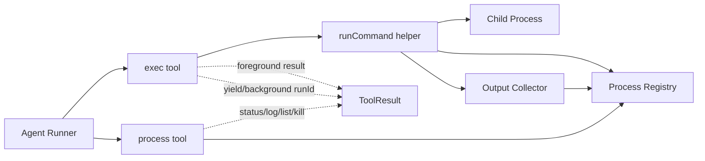
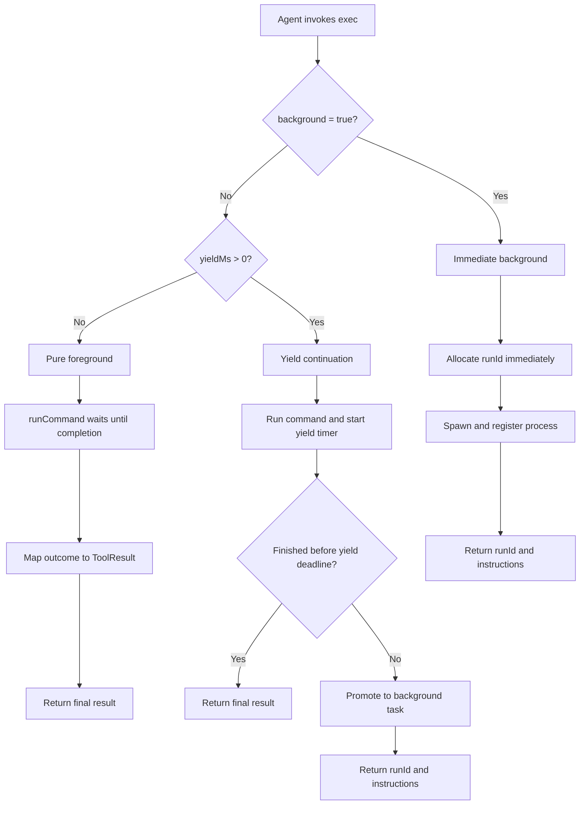
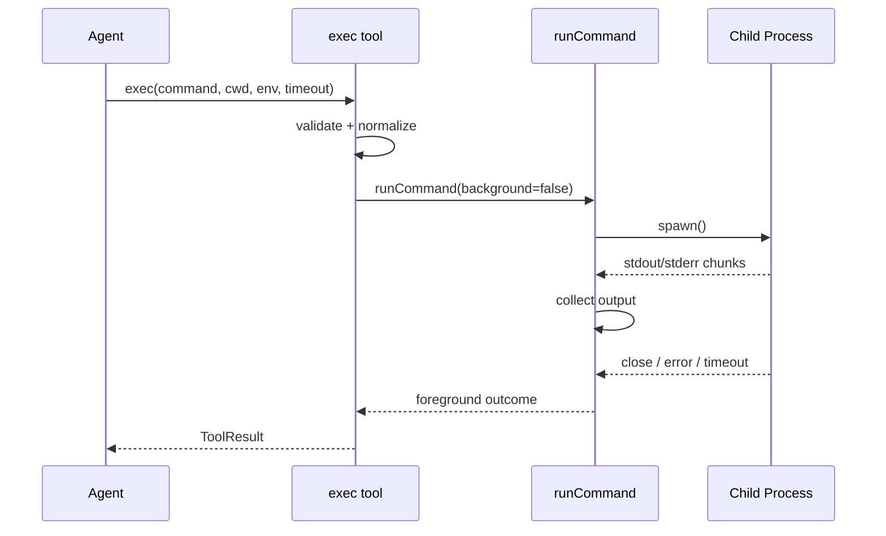
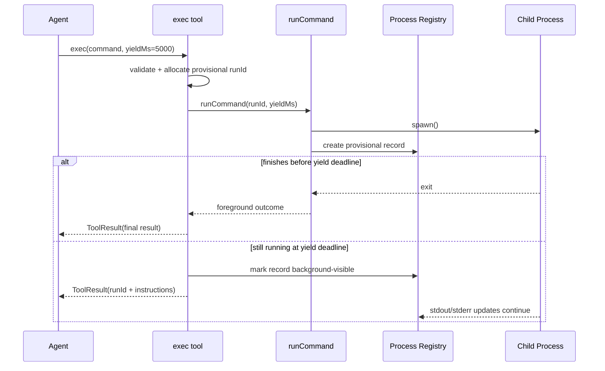
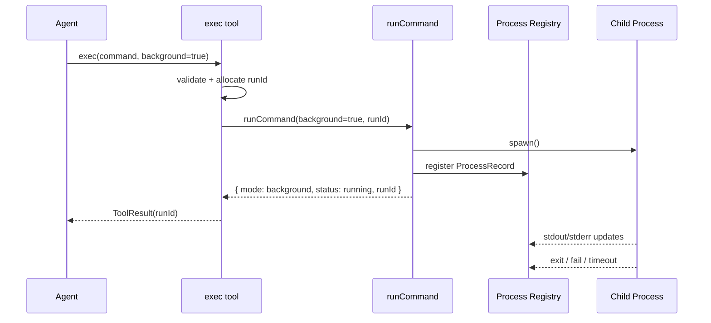
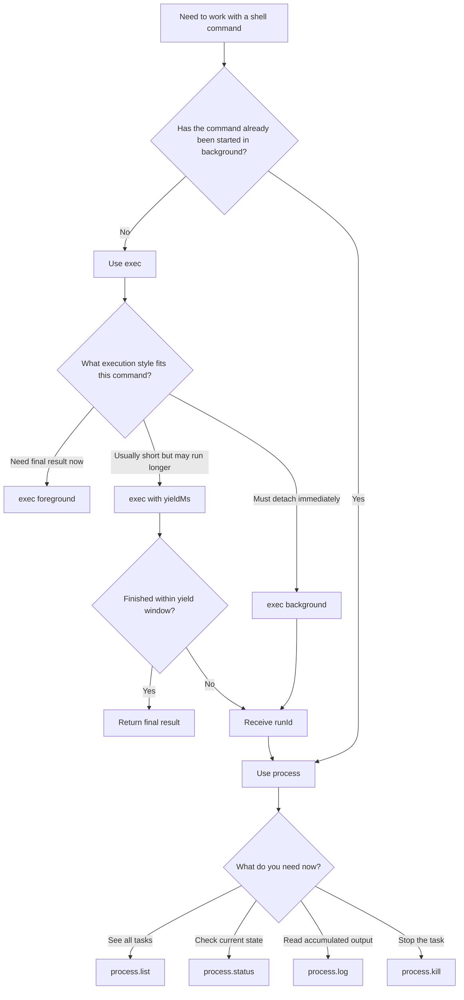
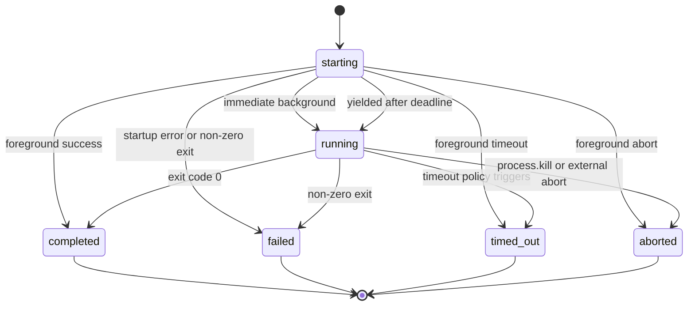
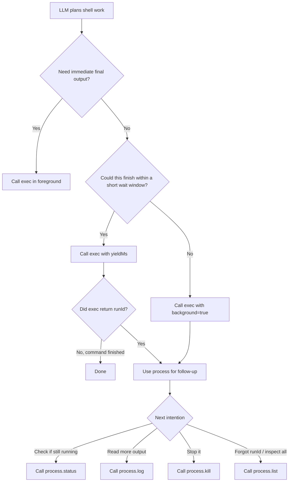

# Exec + Process 运行与交互流程设计

> 创建日期：2026-04-05  
> 适用项目：C:\dev\my-agent\my-agent  
> 参考：OpenClaw 的 `exec + process` 组合，但只吸收我们当前需要的最小结构，不引入 approval、sandbox、PTY、多宿主路由等平台级复杂度。

---

## 1. 设计目标

这份文档回答三个问题：

1. 我们的 `exec` 和 `process` 应该如何分工。
2. 前台执行、yield continuation、后台执行各自的运行流程应该是什么。
3. agent 后续如何通过 `process` 继续观察、读取输出和终止后台命令。

核心结论：

- `exec` 负责启动命令。
- `process` 负责管理已经启动的后台命令。
- `yield continuation` 是介于纯前台和立即后台之间的第三种运行语义。
- 这几个能力从设计上必须一起考虑，即使实现可以分阶段落地。

---

## 2. 设计边界

### 2.1 当前要解决的问题

- 在工具层统一执行 shell 命令
- 支持前台同步返回结果
- 支持先运行一小段再转入后台
- 支持后台继续运行，并在后续轮次继续查询
- 让 agent 能读取后台任务状态、日志并终止任务

### 2.2 当前不做的能力

- 危险命令审批
- allowlist / durable approval
- Docker / sandbox / gateway / node 多宿主路由
- PTY / 交互式终端控制
- `send-keys` / `paste` / `write stdin` 这类高级交互
- 多租户权限模型

所以这份设计文档里的 `process` 是一个**最小版后台任务管理工具**，不是 OpenClaw 的完整 process session 系统。

---

## 3. 总体架构

建议把这套能力拆成 5 个内部角色。

### 3.0 总体结构图



### 3.1 `exec` tool

职责：

- 校验参数
- 决定纯前台、yield continuation 或立即后台模式
- 调用底层命令运行器
- 纯前台模式直接返回结果
- yield 或后台模式返回 `runId`

### 3.2 `process` tool

职责：

- 查看后台任务列表
- 查询某个后台任务状态
- 读取某个后台任务累计输出
- 终止某个后台任务

### 3.3 `runCommand()` helper

职责：

- 统一启动子进程
- 监听 stdout / stderr
- 处理 timeout / abort / close / error
- 把运行态变化转给注册表或上层回调

### 3.4 `process registry`

职责：

- 维护后台任务记录
- 保存状态、输出、开始时间、结束时间、pid、命令、cwd
- 为 `process` tool 提供查询接口

### 3.5 `output collector`

职责：

- 接收 stdout / stderr chunk
- 按到达顺序聚合
- 支持同时提供“最新增量”和“累计日志”两种视角

---

## 4. 推荐工具接口

### 4.1 `exec` tool 参数

建议的最小参数集：

| 参数 | 类型 | 必填？ | 说明 |
|------|------|:------:|------|
| `command` | `string` | 是 | 要执行的 shell 命令 |
| `cwd` | `string` | 否 | 工作目录 |
| `env` | `Record<string, string>` | 否 | 额外环境变量 |
| `timeout` | `number` | 否 | 整个进程生命周期的超时秒数 |
| `yieldMs` | `number` | 否 | 先前台运行一小段时间；若未结束则转入 `process` 路径 |
| `background` | `boolean` | 否 | 是否以后台模式立即启动 |

建议把 `yieldMs` 和 `background` 一起设计；第一阶段仍不建议暴露 `pty`、`elevated`。

### 4.2 `process` tool 参数

建议的最小动作集：

| action | 必要参数 | 说明 |
|--------|----------|------|
| `list` | 无 | 列出后台任务 |
| `status` | `runId` | 查询任务状态和最新摘要 |
| `log` | `runId` | 读取累计日志 |
| `kill` | `runId` | 终止后台任务 |

如果后面发现 `status` 和 `log` 语义重复，可以合并成 `poll`，但在第一版设计里分开更清晰：

- `status` 关注“是否还在运行”
- `log` 关注“输出内容是什么”

### 4.3 `exec` 的三种运行模式

建议把 `exec` 的运行语义明确分成三种，而不是只有“同步”和“后台”两种。

#### A. 纯前台模式

条件：

- `background !== true`
- `yieldMs` 未提供

行为：

- 一直等待到进程结束
- 返回最终结果

#### B. Yield continuation 模式

条件：

- `background !== true`
- `yieldMs` 为正数

行为：

- 先按前台模式运行一小段时间
- 如果命令在 `yieldMs` 内结束，直接返回最终结果
- 如果命令到达 `yieldMs` 时仍在运行，则转入后台任务
- 返回 `runId`，后续改走 `process`

这个模式适合“通常会很快完成，但偶尔会变成长任务”的命令。它比默认立刻 background 更省一次工具切换，也比纯前台模式更稳妥。

#### C. 立即后台模式

条件：

- `background === true`

行为：

- 启动后立刻返回 `runId`
- 不等待命令输出或结束
- 后续全部走 `process`

### 4.4 参数优先级和 timeout 语义

建议明确下面几条规则。

#### 参数优先级

1. `background === true` 优先级最高
2. 否则如果 `yieldMs > 0`，走 yield continuation
3. 否则走纯前台模式

也就是说：

- 同时传 `background: true` 和 `yieldMs` 时，应忽略 `yieldMs`
- `yieldMs` 只对“非立即后台”路径生效

#### timeout 语义

建议把 `timeout` 解释为**整个进程生命周期的上限**，不是“只限制前台等待时间”。

这样一来：

- 纯前台模式：`timeout` 约束这次同步执行
- yield continuation 模式：命令即使已经转入后台，超时仍然有效
- 立即后台模式：如果显式给了 `timeout`，后台进程也应在超时后终止

另外建议不要让后台任务自动继承一个很短的前台默认超时，否则像 dev server 这类命令会在用户没有意识到的情况下被默认杀掉。

---

## 5. 推荐内部数据模型

### 5.1 运行状态

```typescript
type ProcessStatus =
  | 'running'
  | 'completed'
  | 'failed'
  | 'timed_out'
  | 'aborted';
```

### 5.2 输出块

```typescript
interface OutputChunk {
  stream: 'stdout' | 'stderr';
  text: string;
  timestamp: number;
}
```

### 5.3 后台任务记录

```typescript
interface ProcessRecord {
  runId: string;
  command: string;
  cwd: string;
  env: Record<string, string>;
  status: ProcessStatus;
  pid?: number;
  startedAt: number;
  endedAt?: number;
  exitCode?: number | null;
  signal?: string | null;
  chunks: OutputChunk[];
  output: string;
  child?: ChildProcess;
  yielded?: boolean;
}
```

### 5.4 前台结果与后台句柄

```typescript
type CommandRunOutcome =
  | {
      mode: 'foreground';
      status: 'completed' | 'failed' | 'timed_out' | 'aborted';
      output: string;
      exitCode?: number | null;
      signal?: string | null;
    }
  | {
      mode: 'background';
      status: 'running';
      runId: string;
      pid?: number;
      yielded?: boolean;
    };
```

这个类型只建议作为内部运行结果使用。对外给 agent 的 `ToolResult` 仍然可以维持简单结构。

---

## 6. `exec` 启动流程

这一节描述 `exec` 在三种运行模式之间如何分流，以及各条路径本身如何工作。

### 6.0 前后台分流图



### 6.1 纯前台路径

这是 `background !== true` 且未提供 `yieldMs` 时的标准路径。

#### 步骤说明

1. agent 调用 `exec`，传入 `command` 和可选的 `cwd/env/timeout`
2. `exec` 校验参数并归一化默认值
3. `exec` 调用 `runCommand({ background: false, ... })`
4. `runCommand()` 启动子进程
5. stdout / stderr 持续写入 output collector
6. 若命令正常退出：构造 `completed` 或 `failed` 结果
7. 若超时：杀进程，构造 `timed_out` 结果
8. 若收到 abort：终止进程，构造 `aborted` 结果
9. `exec` 将内部结果映射成 `ToolResult`
10. 返回给 agent-runner

#### 结果映射规则

- `completed` -> `{ content }`
- `failed` -> `{ content: "...Process exited with code X", isError: true }`
- `timed_out` -> `{ content: "...Process timed out...", isError: true }`
- `aborted` -> `{ content: "...Process aborted", isError: true }`

#### 时序图



### 6.2 Yield continuation 路径

这是介于纯前台和立即后台之间的第三种路径。

#### 步骤说明

1. agent 调用 `exec({ command, ..., yieldMs })`
2. `exec` 校验参数并归一化默认值
3. `exec` 预先生成 `runId`
4. `exec` 调用 `runCommand()` 并启动一个 `yield` 计时器
5. 在 `yieldMs` 时间窗口内，命令先像前台任务一样运行
6. 如果命令在窗口内结束：直接返回最终结果，不暴露 `runId`
7. 如果命令在窗口结束时仍然运行：
   - 将运行记录提升为后台任务
   - 返回 `runId`
   - 后续改走 `process`

#### 设计要点

- `runId` 需要在启动前就生成，否则无法在超出 `yieldMs` 时平滑转入后台路径
- registry 最好从命令启动起就有一条 provisional record，等真正 yield 后再标记为对外可见的后台任务
- 返回给 agent 的文案里应明确说明“命令仍在运行，改用 process 继续”

#### 时序图



---

## 7. 立即后台执行流程

这是 `background === true` 时的即时后台路径。

### 7.1 关键原则

- `exec` 在后台模式下不等待命令结束
- `exec` 只负责“启动并注册”
- 后续状态和日志读取全部走 `process`

### 7.2 步骤说明

1. agent 调用 `exec({ command, ..., background: true })`
2. `exec` 校验参数并归一化默认值
3. `exec` 预先生成 `runId`
4. `exec` 调用 `runCommand({ background: true, runId, ... })`
5. `runCommand()` 启动子进程
6. 子进程一旦启动，注册到 `process registry`
7. stdout / stderr 持续追加到 registry 里的 `ProcessRecord`
8. `runCommand()` 立即返回 `{ mode: 'background', status: 'running', runId }`
9. `exec` 把它映射成 agent 可理解的 `ToolResult`
10. 进程在后台继续运行，直到正常退出、失败、超时或被 kill
11. 退出事件会回写 registry，更新状态、结束时间、exitCode 等信息

### 7.3 `exec` 的建议返回文案

后台模式下建议返回类似：

```text
Process started in background.
runId: proc_123
Use the process tool to check status, read logs, or kill it.
```

这样 LLM 能直接学习到后续应该调用哪个工具。

### 7.4 时序图



---

## 8. `process` 交互流程

### 8.0 Agent 何时使用 `exec` 或 `process`



### 8.1 `process.list`

用途：让 agent 看到当前有哪些后台任务。

步骤：

1. agent 调用 `process({ action: 'list' })`
2. `process` 从 registry 读取所有任务
3. 返回精简列表：`runId / status / command / startedAt / pid`

适用场景：

- agent 忘了某个 `runId`
- 同时存在多个后台任务
- 需要先确认任务是否还存在

### 8.2 `process.status`

用途：看某个任务是否还在运行，以及当前摘要状态。

步骤：

1. agent 调用 `process({ action: 'status', runId })`
2. `process` 从 registry 读取对应记录
3. 返回：`status / exitCode / pid / startedAt / endedAt / output summary`

建议返回内容里包含一句明确提示：

- running: `Process is still running.`
- completed: `Process completed successfully.`
- failed: `Process failed with code X.`
- timed_out: `Process timed out.`
- aborted: `Process was aborted.`

### 8.3 `process.log`

用途：读取某个任务的累计输出。

步骤：

1. agent 调用 `process({ action: 'log', runId })`
2. `process` 从 registry 读取累计 output
3. 返回完整日志，或返回尾部日志

建议第一版支持可选参数：

- `tailLines?: number`

这样可以避免长日志把上下文吃光。

### 8.4 `process.kill`

用途：终止某个后台任务。

步骤：

1. agent 调用 `process({ action: 'kill', runId })`
2. `process` 查找对应 `ProcessRecord`
3. 如果进程仍在运行，调用 `child.kill()`
4. 更新 registry 中的状态为 `aborted` 或 `failed`
5. 返回终止结果

### 8.5 `process` 动作流程图


---

## 9. 状态流转

### 9.1 前台任务状态流转

```text
starting
  -> completed
  -> failed
  -> timed_out
  -> aborted
```

### 9.2 后台任务状态流转

```text
starting
  -> running
  -> completed
  -> failed
  -> timed_out
  -> aborted
```

### 9.3 状态语义

- `running`: 已启动，仍在执行中
- `completed`: 正常退出，exit code = 0
- `failed`: 非零退出或启动后出现运行失败
- `timed_out`: 因超时被终止
- `aborted`: 因外部取消或显式 kill 被终止

### 9.4 状态流转图



---

## 10. 输出模型设计

输出建议同时保留两种表示：

1. `chunks`
   - 用于保留 stdout / stderr 的时间顺序
   - 未来如需增量推送，可以直接复用

2. `output`
   - 聚合后的完整字符串
   - 便于当前 `ToolResult.content` 直接返回

建议规则：

- 内部始终先记录 chunk
- 再由 collector 同步维护 `output`
- `process.log` 默认返回聚合结果
- 如果未来要支持更复杂的日志分页，再在 registry 读取层扩展

---

## 11. 对 agent 的交互约束

### 11.0 LLM 工具调用习惯图



为了让 LLM 更稳定地使用这套工具，工具描述里应该明确交互约束。

### 11.1 `exec` 描述要告诉模型

- 前台命令直接使用 `exec`
- 对“可能很快完成，但也可能拖长”的命令，优先考虑 `yieldMs`
- 需要持续运行且必须立即脱离当前调用的命令，再使用 `background: true`
- 一旦返回 `runId`，后续必须改用 `process` 查询状态和日志

### 11.2 `process` 描述要告诉模型

- 只能用于已经由 `exec` 启动的后台任务
- `status` 用来看任务是否在运行
- `log` 用来看输出
- `kill` 用于终止任务

这一步很重要，因为 background 模型是否好用，很大程度取决于 LLM 是否能形成稳定的工具调用习惯。

---

## 12. 第一版最小落地建议

建议第一版只实现下面这些能力。

### 12.1 `exec`

- 支持 `command`
- 支持 `cwd`
- 支持 `env`
- 支持 `timeout`
- 支持 `yieldMs`
- 支持 `background`

### 12.2 `process`

- `list`
- `status`
- `log`
- `kill`

### 12.3 内部基础设施

- `runCommand()` helper
- 内存态 `process registry`
- 基础输出聚合
- 进程退出清理
- yield timer 和 provisional record 管理

第一版不要加入：

- `stdin write`
- `send-keys`
- `paste`
- PTY
- 审批
- 沙箱

---

## 13. 后续能力边界：是否考虑“会话控制台”能力

我的建议是：**应该纳入后续能力边界，但不要进入第一版实现范围。**

也就是说，这类能力适合被定义成：

- 明确的后续扩展方向
- 只有在出现真实交互式进程需求时才启动实现
- 独立于第一版任务型 `process` 的第二阶段能力

### 13.1 为什么值得保留在后续规划里

如果未来出现下面这些场景，任务管理器式 `process` 就不够了：

- 启动一个会持续等待输入的 REPL 或 CLI
- 需要 agent 在后续轮次继续输入文本
- 需要方向键、回车、快捷键这类终端按键交互
- 需要把后台进程当成一个持续会话，而不只是一个可观察任务

这些场景一旦出现，OpenClaw 那种“会话控制台”式 process 模型就会变得合理。

### 13.2 为什么不该进入第一版

因为一旦支持这类能力，复杂度会明显跃升：

- 需要稳定处理 stdin 生命周期
- 需要区分普通文本输入和按键语义
- 往往会牵涉 PTY，而不只是普通 child process pipe
- 需要更强的会话保活、清理和异常恢复策略
- 工具描述和 LLM 使用习惯也会更复杂

这已经不是“给任务管理器多加两个 action”，而是在引入另一种抽象层次。

### 13.3 推荐策略

建议把能力分成两层：

1. **第一层：任务管理器模式**
  - `list`
  - `status`
  - `log`
  - `kill`

2. **第二层：会话控制台模式**
  - `write`
  - `submit`
  - `paste`
  - `send-keys`
  - 未来如有必要再考虑 PTY 专用能力

这样做的好处是：

- 第一版保持简单，足够支撑 dev server / watch task / 长命令
- 未来如果要扩展，不需要否定第一版设计，只需要在 `process` 上增加交互层

---

## 14. 与 OpenClaw 的关系

我们借鉴 OpenClaw 的不是“全部 exec 细节”，而是它最重要的结构判断：

- `exec` 不负责独自完成后台生命周期管理
- 后台命令必须有一个配套的 `process` 工具
- `exec + process` 是一对能力，而不是两个互不相关的工具
- `yield continuation` 是一个很值得借鉴的中间语义：先跑一小段，再决定是否切换到 `process`

在这之外，OpenClaw 还进一步把 `process` 做成了“会话控制台”。这部分我们现在不做，但建议保留为后续可能演进的方向。

我们主动不借的部分是：

- approval
- allowlist
- sandbox / gateway / node host
- PTY 交互
- `write/send-keys/paste` 这些高级 process 动作

---

## 15. 一句话结论

我们自己的 `exec + process` 最合理的设计，不是先做一个同步 `exec` 再补洞，而是从一开始就按“`exec` 负责启动，`process` 负责后续管理，`yieldMs` 负责中间过渡”的三态模型来设计内部结构，然后只实现当前真正需要的最小动作集。
