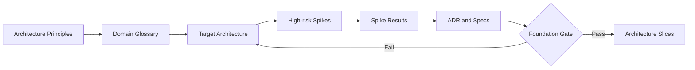
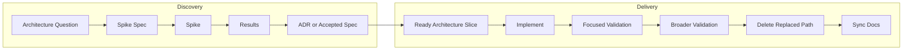

# Architecture Foundation Plan

## 1. 文档状态

- **状态：** Accepted
- **版本：** 1.2
- **日期：** 2026-09-03
- **范围：** my-agent 目标架构定义、关键边界验证、渐进迁移和 Legacy 退出
- **执行方式：** Architecture Foundation 以两周为目标、四周为硬上限，随后采用一周 Architecture Slice 迭代
- **范围冻结：** Foundation Gate 通过前，暂停会穿透待定架构边界的大型生产功能；缺陷、小型局部变更、文档、测试、Spec 和 Spike 可继续
- **批准：** 本计划已由项目所有者确认并晋升为 `Accepted`
- **v1.1 修订：** 项目所有者于 2026-09-01 确认 §7.4 文档语言与术语约定；该确认时点是规则的生效边界
- **v1.2 修订：** 项目所有者于 2026-09-03 确认 AF-06 仅编排 Extension/Module instance 生命周期；同 identity duplicate warning/ignore，内部对象管理与运行中版本替换不在最小范围

本 Plan 使用 `Proposed -> Accepted -> Superseded | Cancelled` 状态流。`Accepted` 表示项目所有者批准执行 Architecture Foundation，不表示 Foundation Gate 已通过，也不授权提前进入生产迁移。

## 2. 背景

my-agent 已经实现 Agent Runner、Session、Memory、Tools、Channel、Subagent、Compaction、Abort 和多客户端消息等能力，但长期增量开发也积累了以下结构性问题：

- Provider 连接信息、Model 运行事实和用户策略混在静态 LLM 配置中；
- 动态切换 Model 时，无法从 Provider Catalog 统一解析 context limit、max output、protocol、endpoint 和 supported media types；
- Channel、Tool 和 Hook 已有局部扩展接口，但缺少统一 Extension/Module/Registry、生命周期和能力边界；
- `RuntimeApp.create()` 同时负责配置翻译、资源创建、Subagent 后装配、Tool 重建和生命周期；
- 新功能经常需要修改 Runtime、Config、Adapter、共享联合类型和多个传递结构；
- 架构、Spec、实施笔记和当前事实文档混合，状态与权威关系不清楚；
- 重构期间若长期保留新旧两套实现，会增加人和 AI 的搜索、判断和 Patch 成本。

项目接下来不直接选择“继续堆功能”或“推倒重写”。本计划采用：

> 保留已经验证的执行内核，先建立 Architecture Foundation，再以最小垂直切片渐进替换装配和扩展层。

## 3. 目标

### 3.1 架构目标

1. 建立统一领域词汇和模块职责；
2. 定义 Domain、Application、Infrastructure 和 Composition 四个逻辑边界及其依赖方向；
3. 将 Provider Connection、Model Facts 和 User Policy 分离；
4. 让每个 Turn 使用一个权威、不可变的 `ResolvedModel`；
5. 建立统一 Extension Framework，使内置 Module 和外部 Extension 使用相同的贡献、注册和生命周期机制；
6. 将 `RuntimeApp` 收敛到队列、Turn、路由和生命周期编排；
7. 保持现有 Runner、Session、Tool、Channel、Abort 等有效能力可复用；
8. 通过 Fitness Tests 固化依赖方向和扩展约束；
9. 为旧文档建立 Legacy 隔离和删除流程；
10. 为旧代码建立单向 Compatibility 和明确删除条件。

### 3.2 交付目标

- 新增第二个 Provider 时，不修改 Agent Runner、Channel 或 Runtime 核心；
- 新增 Tool、Hook 或 Channel 时，只新增 Module 和注册代码；
- 一个外部 Extension 可以同时贡献 Channel、Tool、Hook、配置和可选能力，并在自身边界内共享私有资源；
- 新增带专有协议和平台能力的聊天软件 Extension 时，不修改 Runtime、Runner 或中央类型联合；
- 已安装并加载的 Extension 可以在运行中受控启用、停用或更新 Contribution，且不改变进行中 Turn 的能力快照；
- Model 切换同时切换用于模型调用的 core-owned Port、Protocol、Endpoint 和 Model Capability facts；
- 内置模块与外部模块经过同一注册、启动和关闭流程；
- 每个迁移 Slice 完成后，被替代的旧生产路径被删除；
- 新文档可以明确回答“当前事实、目标设计、进行中工作和历史参考分别在哪里”。

## 4. 非目标

Architecture Foundation 阶段不实施：

- Subagent Batch、并发、Background、Detached、Handoff 或 Agent Team；
- Extension Marketplace、远程下载、任意代码热加载、原地代码热升级或任意代码沙箱；
- 所有主流 Provider 的完整支持；
- 分布式 Event Bus 或通用 DI Container；
- Session 持久化格式重写；
- 全量目录重排或纯命名美化；
- 与目标架构无关的功能增强；
- 一次性迁移所有旧代码和旧文档。

已安装且已加载 Extension 的运行时启用、停用和 Contribution 快照切换属于 Foundation 验证范围；这不等同于下载、加载、卸载或替换 Extension 代码。

## 5. 架构原则

以下原则是 Target Architecture 和后续 Spec 的设计约束：

1. Domain/Application 不依赖 Provider SDK、Channel SDK 或具体 Store；
2. Runtime 只消费已解析的执行配置，不自行推断 Model Facts；
3. Provider/Model Facts、User Policy 和 per-turn Request Override 分别拥有清晰来源；
4. 内置 Module 和外部 Extension 使用同一 Contribution/Registry；
5. Registry 发布版本化不可变 Snapshot；Extension 变更必须经过受控的 pre-publish 校验/失败清理、原子切换和 post-publish retirement；
6. 一个概念只有一个权威类型和一个权威运行路径；
7. Compatibility Adapter 只能单向调用新核心，新代码不得反向依赖 Legacy；
8. Extension 只能获得已声明 Extension Capability 所需的最小上下文，不能依赖 `RuntimeApp` 私有状态或通用 Service Locator；
9. 公共 API、Event、并发和生命周期必须有契约测试；
10. Spike 代码默认可丢弃，不自动晋升为生产抽象；
11. 优雅以依赖方向、可替换性和变更局部性衡量，不以抽象数量衡量。

## 6. 质量属性优先级

| 优先级 | 质量属性 | 可验证标准 |
|---:|---|---|
| 1 | Extensibility | 新 Provider 或跨 Channel/Tool/Hook 的 Extension 不要求修改核心模块 |
| 2 | Replaceability | 具体 SDK、Store 和 Transport 可由 Fake 或其他实现替换 |
| 3 | Understandability | 当前事实和实现入口唯一，命名与职责一致 |
| 4 | Testability | Resolver、Registry、Module 和 Adapter 可独立测试 |
| 5 | Runtime Safety | Abort、Shutdown、并发和资源释放有明确所有者 |
| 6 | Compatibility | 迁移不静默破坏公共 API、Event 和 Session 行为 |
| 7 | Observability | Provider、Model、Turn、Tool 和 Module 生命周期可追踪 |
| 8 | Performance | 在边界正确后优化启动、调用和并发开销 |

## 7. 工作方式

### 7.1 Architecture Foundation 先行

Foundation 阶段先定义并验证骨架，不立即开展普通功能迭代。Foundation Gate 通过前采用范围冻结：暂停 Subagent 并发、Batch、Background、Detached、Handoff、Agent Team，以及其他会穿透 Runtime Composition、Model Resolution、事件顺序或生命周期边界的大型生产功能。相关需求分析和 Spec 可以继续，但不进入生产实现；缺陷修复、小型局部变更、文档、测试和架构 Spike 不受此限制。



### 7.2 Foundation 后采用双轨敏捷



### 7.3 Iteration 与 WIP

- Iteration 默认一周；
- 同时最多一个 Architecture Spike；
- 同时最多一个生产 Architecture Slice；
- Small Change、Defect 和 Documentation 不得影响主 Slice；
- 未达到 Definition of Ready 的工作不得进入 Delivery；
- Spike 发现假设错误时，先更新 ADR/Spec，不在生产实现中临时绕过。
- Foundation 以两周完成为目标，第二周末执行 Gate Gap Review；
- 第三至第四周只处理 Foundation Gate 阻塞项，不新增范围；
- 第四周末仍未通过 Gate 时强制进行 Architecture Review，不自动延期。

### 7.4 当前架构重构文档的语言与术语约定

#### 适用范围

本约定仅约束 Architecture Foundation 当前重构范围内，在父计划 v1.1 于 2026-09-01 获项目所有者确认后新建或发生实质修改的 Plan、ADR、Spec、Spike Spec、Spike Results、Current Architecture 和 Architecture Slice 文档内容。

以下内容不受追溯调整：

- 与当前 Architecture Foundation 重构无关的项目文档；
- v1.1 修订确认前已经存在且本次工作未触及的内容；
- v1.1 修订确认前已经完成的文档修改，包括尚未提交的工作树修改；
- 只更新状态、日期、版本、链接、拼写、标点、排版或不新增决策与契约的简短事实说明；
- 命令输出、日志、错误消息、协议原文、供应商原文和外部引用。

本约定不授权批量翻译或整理既有文档。既有内容的整体语言收敛必须作为单独批准的 Documentation 工作执行，不得夹带在 Characterization、Defect、Spike 或 Architecture Slice 中。

#### 核心原则

重构文档采用“中文叙述优先、技术与行业术语保留英文”的约定。目标是提高准确性、可读性和同系列工件的一致性，而不是减少英文数量或追求逐词翻译。

本文中的 `MUST`、`SHOULD` 和 `MAY` 分别表示强制要求、默认要求和允许选择。

1. 叙述正文、章节标题、表头和元数据字段名 SHOULD 使用中文；同一次文档工作中新建或实质重写的同级结构 MUST 保持一致语言，不要求追溯调整未触及的同级结构。
2. 新文档没有既有系列约定时，结构标题 SHOULD 优先使用中文，例如“状态”“背景”“决策”“验证”“风险”和“后续工作”。示例只说明推荐风格，不是固定标题集合。
3. ADR、Spec、Spike、C4、RFC 等工件名或行业缩写 MAY 保留英文。结构术语在正文中作为概念使用时 MAY 保留英文；作为新章节标题或表头时 SHOULD 优先使用自然、准确的中文。
4. 不得为形式统一制造不准确的翻译、更严重的中英文混排或与同系列文档冲突的表达。

#### 术语决策规则

术语没有固定的中英文白名单。遇到本节未列举或语义随上下文变化的词时，按以下顺序决定：

1. 代码、协议、标准或外部产品具有正式拼写时 MUST 保留正式形式；
2. [Domain Glossary](../architecture/domain-glossary.md) 已定义规范词汇时 MUST 使用其正式名称和大小写；
3. `Accepted` ADR、Spec 或 Target Architecture 已建立稳定用法时 SHOULD 保持一致；
4. 其余术语按技术准确性、目标读者可理解性、中文表达自然度和同一文档或同系列文档的一致性综合判断；
5. 仍可能改变含义、规范强度或权威关系时 MUST 保留原文并进入 Review，不得自行翻译定案。

Provider、Model、Extension、Module、Contribution、Registry Snapshot、Turn、Tool、Hook、Channel、Runtime、Runner、Lifecycle、Shutdown、Abort、Fanout、Port 和 Adapter 等只是在当前重构中常见的示例，不构成封闭词表，也不要求在所有语境中机械保留英文。

#### 必须保持正式形式的内容

以下内容 MUST 保持原始英文、正式拼写或项目定义形式：

- 代码、类型、接口、函数、变量和其他 symbol；
- 文件路径、文件名、命令、命令参数、配置键和环境变量；
- API、SDK、Provider、协议、标准名称及其字段；
- Event、Error 和公共 Contract 定义的字段或枚举值；
- `REQ-*`、`AC-*`、`TBD-TECH-*`、CH/FT 编号、测试场景 ID 和其他稳定标识符；
- 命令输出、日志、错误消息、供应商原文、协议原文和引用内容。

需要解释原文时，应在原文之后补充中文说明，不得改写原始内容。

#### 状态、文件名与 Commit

1. 元数据字段名 SHOULD 使用中文，项目定义的状态值 MUST 保留英文，例如 `状态：Accepted`。
2. `Draft`、`In Review`、`Proposed`、`Accepted`、`Implemented`、`Validated`、`Provisional Pass`、`Completed`、`Superseded`、`Deprecated`、`Rejected`、`Blocked`、`Deferred` 和 `Cancelled` 等状态值以 [Development Workflow](../development-workflow.md) 为准；不得翻译出第二套状态枚举。
3. 新文档文件名 SHOULD 使用稳定的英文 `kebab-case`；不得仅为语言统一重命名既有文件。
4. Commit subject 和 body MUST 使用英文，不受正文语言约定影响。

#### 增量适用与必读要求

1. 父计划 v1.1 修订确认后新建的重构文档 SHOULD 整体遵循本约定。
2. 对既有文档新增章节或实质重写完整章节时，新增或重写的章节 SHOULD 遵循本约定，不要求同步改写未触及内容。
3. “实质修改”指新增一个有独立职责的章节，或重写章节的主要事实、决策、契约或论证；小型元数据、链接、格式和措辞修正不属于实质修改。
4. 执行 AF-04、AF-05、AF-06 或后续 Architecture Slice 的文档工作前 MUST 读取本节；对应子计划、Spec 或 Results MUST 将本 Plan 列为权威输入并指向 §7.4，不复制一份可能漂移的语言规则。
5. 文档模板规定工件必须覆盖的职责，不强制最终文档沿用模板的英文标题；翻译标题时不得删除或改变模板要求的信息。

## 8. 权威工件

### 8.1 计划内工件

| 工件 | 目的 | 初始状态 |
|---|---|---|
| `docs/development-workflow.md` | 工作项分类、DoR/DoD、状态和验证流程 | Proposed |
| `CONTRIBUTING.md` | 简短的开发入口、命令和变更纪律 | Proposed |
| Architecture Principles | 稳定设计约束 | Draft |
| Domain Glossary | 统一 Provider、Model、Extension、Module、Contribution、Turn 等概念 | Draft |
| Target Architecture | 模块、依赖、调用流、生命周期和所有权 | Draft |
| ADR | 长期且难回退的架构决策 | Proposed |
| Spike Spec / Results | 假设、停止条件和执行证据 | Draft |
| Module Spec | 公共契约、状态、错误和测试矩阵 | Draft |
| Current Architecture | 已验证的当前实现事实 | 迁移后维护 |

### 8.2 权威优先级

发生冲突时按以下顺序处理：

1. 已确认的需求和验收条件；
2. `Accepted` ADR；
3. `Accepted` Module Spec；
4. 已执行的 Spike Results 和测试证据；
5. 本 Plan 的阶段、Gate 和状态；
6. Current Architecture；
7. Legacy 文档和旧实现取证。

Legacy 只提供历史证据，不自动成为目标设计。

## 9. Foundation 工作包

### AF-01：开发治理基线

**状态：** Completed（2026-08-28）

**目标：** 建立轻量、可执行的开发和文档流程。

**产物：**

- `docs/development-workflow.md`；
- `CONTRIBUTING.md`；
- ADR、Module Spec、Spike Spec、Spike Results 模板；
- 文档状态模型和权威来源；
- 文档索引修正。

**验收：**

- Small Change 不被要求使用完整 Spec；
- 架构、并发、公共契约和外部 SDK 变更必须有 Spec/Spike/ADR；
- Workflow 与仓库实际 npm 命令一致；
- Commit 规则、确认规则和文档同步规则一致。

### AF-02：领域词汇与架构原则

**状态：** Completed（2026-08-28）

**目标：** 在目录和类型重命名前统一概念。

**至少定义：**

- Provider、Provider Connection、Protocol；
- Model Reference、Model Descriptor、Model Policy、Resolved Model；
- Agent、Subagent、Session、Turn；
- Tool、Channel、Hook、Extension、Runtime Module、Contribution、Capability；
- Registry、Adapter、Runtime、Lifecycle；
- Current Architecture、Spec、ADR、Spike、Legacy、Compat。

**验收：**

- 每个概念有职责、所有者和明确的非含义；
- 同一个名称不再同时表示配置、运行事实和策略；
- Target Architecture 中只使用已定义词汇。

### AF-03：Target Architecture

**状态：** Completed（2026-08-31）

**执行计划：** [AF-03 Target Architecture Execution Plan](af-03-target-architecture-plan.md)（`Accepted`）

**目标：** 定义新架构骨架和迁移边界。

**必须覆盖：**

- 模块职责与依赖方向；
- Provider/Model Resolution；
- Extension/Module/Contribution/Registry 边界；
- Registry Snapshot、Extension 变更事务、原子切换、排空和回滚；
- Runtime Builder 和 RuntimeApp 边界；
- Tool、Hook、Channel 注册；
- Config Namespace 和 Schema 所有权；
- Extension 私有资源共享、受限运行上下文和可选平台能力；
- Event、Error、Lifecycle 和 Resource Ownership；
- Legacy/Compat 依赖规则；
- 关键调用流和关闭顺序。

**验收：**

- 至少用一个 Turn、一个 Tool、一个 Channel 和一个 Subagent 调用流验证分层；
- 至少用一个同时贡献专有 Channel、Tool 和 Hook 的外部 Extension 验证组合边界；
- 至少验证进行中 Turn 固定使用旧 Registry Snapshot、新 Turn 使用原子切换后的新 Snapshot；
- 简单调用链没有无业务价值的多层机械转换；
- Stable Core 与 Infrastructure Adapter 边界明确；
- 不依赖通用 Service Locator。

### AF-04：Characterization 与 Fitness Tests

**状态：** Completed（2026-09-03）

**执行计划：** [AF-04 Characterization and Fitness Execution Plan](af-04-characterization-fitness-plan.md)（`Accepted`）

**目标：** 在迁移前锁定现有关键行为，并把新架构原则自动化。

**Characterization 范围：**

- Runtime 启动/关闭；
- Turn Event 顺序；
- Tool Use/Result 配对；
- Session 和 Compaction；
- Channel 路由；
- Approval/Interaction；
- Abort；
- Subagent 基线。

**Fitness Tests 候选：**

- Domain/Application 不依赖 Infrastructure；
- Provider SDK 只能出现在 Provider Adapter；
- 新 Model System 不依赖 Legacy Config 实现；
- Module 不访问 RuntimeApp 私有状态；
- Compat 不被新核心反向依赖；
- 新 Provider 不要求修改 Runner；
- 新 Tool Module 不要求修改中央 Tool 列表；
- 新 Extension 不要求修改 Runtime、Runner、Bootstrap 或中央类型联合；
- Runtime 消费者不能直接持有或修改可变 Registry 集合。

### AF-05：Provider/Model Resolution Spike

**Spike Spec：** [AF-05 Provider/Model Resolution Spike Spec](../architecture/af-05-provider-model-resolution-spike-spec.md)（`Accepted`，2026-09-03）

**Spike Results：** [AF-05 Provider/Model Resolution Spike Results](../architecture/af-05-provider-model-resolution-spike-results.md)（`Completed`；`Provisional Pass` 于 2026-09-03 获项目所有者接受，disposable cleanup 已完成）

**文档约束：** 创建或实质修改本工作包的 Spike Spec、Results、ADR 或后续 Spec 前，必须读取并引用本 Plan §7.4。

**Hypothesis：** 现有 Runner 可保留；在其上游增加 Model Resolver，即可根据 Model Reference 动态选择 Provider Client，并立即应用 Model Facts。

**最小实验：**

- Fake Anthropic Provider；
- Fake OpenAI-compatible Provider；
- 两组不同 context limit、max output、protocol 和 Model Capability facts；
- Parent Turn 和 Subagent Turn 可选择不同 Model；
- 保留现有静态配置兼容输入。

**成功条件：**

- Provider 差异不进入 Runner、Channel 或 Session；
- 一个 Turn 只有一个 `ResolvedModel` 权威快照；
- Model 切换同步切换用于模型调用的 core-owned Port、Endpoint、Protocol 和 Model Capability facts；
- 兼容配置只通过单向 Adapter 进入新模型；
- 不要求为第二个 Provider 增加 RuntimeApp 分支。

**失败/停止条件：**

- Resolver 需要复制 Runner 核心循环；
- Provider 差异持续泄漏到通用 Message/Tool 语义；
- Model Metadata 无法形成可验证的保守 fallback；
- Subagent 使用不同 Model 必须共享可变 Client 状态。

### AF-06：Extension Framework Spike

**Spike Spec：** [AF-06 Extension Framework Spike Spec](../architecture/af-06-extension-framework-spike-spec.md)（`Accepted`，2026-09-03；已授权 disposable Spike execution）

**Spike Results：** [AF-06 Extension Framework Spike Results](../architecture/af-06-extension-framework-spike-results.md)（`Completed`；`Provisional Pass` 于 2026-09-03 获项目所有者接受，disposable cleanup 与 cleanup validation 已完成）

**文档约束：** 创建或实质修改本工作包的 Spike Spec、Results、ADR 或后续 Spec 前，必须读取并引用本 Plan §7.4。

**Hypothesis：** 统一 Extension/Module/Registry 可以让一个外部 Extension 组合 Channel、Tool、Hook、配置和平台能力，并通过版本化不可变 Snapshot 在运行中受控启停，而不修改 Runtime 核心或获得对其内部状态的通用访问权。Framework 只编排 Extension/Module instance 生命周期；Extension 自行管理内部长期对象。

**最小实验：**

- 一个位于 `runtime/` 外的测试聊天软件 Extension；
- 一个使用专有协议的 WebSocket Channel Contribution；
- 至少一个依赖当前平台消息上下文的专有 Tool 和一个 Hook Contribution；
- Extension 自行管理一个供 Channel、Tool 和 Hook 使用的内部长期对象；Framework 和消费者不可取得或关闭该对象；
- 类型化的平台消息标识与至少一个可选平台能力；
- 独立配置 Namespace、校验以及 Extension start/stop；
- 运行中启用一个尚未 active 的已加载 Extension，从 Registry Snapshot `v1` 原子切换到 `v2`；同 identity 已 active 时 warning 并忽略，不启动第二个 instance；
- 一个进行中 Turn 继续使用 `v1`，一个新 Turn 使用 `v2`；
- 运行中停用 Extension，验证旧工作排空后对该 Extension instance 只调用一次 `stop()`；
- 模拟启用失败，验证继续使用原 Snapshot 且无部分注册残留。

**成功条件：**

- 外部 Extension 不修改 `RuntimeApp.ts`、`AgentRunner`、`bootstrap.ts` 或中央联合类型；
- Builtin Module 和 External Extension 使用相同 Contribution/Registry API；
- 一个 Extension 可以同时贡献 Channel、Tool、Hook 和配置；
- Extension 内部对象由 Extension 自行管理；Framework 和消费者不可取得或关闭，Extension 也不能访问未授予的 Runtime 能力；
- 专有 Tool 可通过受限、类型化的消息上下文执行平台动作；
- Registry 发布版本化不可变 Snapshot，Extension 变更只通过受控事务原子切换；
- 进行中 Turn 的 Snapshot 保持不变，新 Turn 只使用切换完成后的 Snapshot；
- 停用能够排空或按策略取消旧工作，并在 generation pin 归零后停止 Extension instance；
- pre-publish prepare、校验或 readiness 失败保持 current Snapshot 不变并有界清理 candidate；清理不收敛时报告可归属残留并阻断后续 reload；post-publish retirement 失败保持新 Snapshot，报告可归属残留，拒绝 pending/后续 reload，并只在有界 Shutdown 中重试；
- Extension 失败可定位，Shutdown 按启动依赖逆序停止已启动 instances；每个 instance 自行清理内部对象；
- Hook 不需要替换整个 AgentRunner Factory。

**失败/停止条件：**

- Extension 需要 Service Locator 访问任意 Runtime 私有资源；
- 生命周期无法确定 Extension/Module instance 的唯一 Owner，或 Framework 必须跟踪 Extension 内部对象才能停止 instance；
- Config 必须为每个 Extension 修改中央 Type Union；
- 平台专有能力只能通过污染通用 Message 或 Channel 类型表达；
- Registry 原地修改导致一个 Turn 观察到混合版本的 Contribution；
- pre-publish Extension 变更失败后 current Snapshot 被改变，candidate-only 残留不可观测/不可归属，或清理不收敛后仍允许新 candidate/reload；post-publish retirement 失败未保持新 Snapshot、残留不可观测/不可归属，或仍允许 pending/后续 reload；
- 注册顺序只能依赖隐式副作用。

### AF-07：Architecture Decision

**Decision Spec：** [AF-07 Architecture Decision Spec](../architecture/af-07-architecture-decision-spec.md)（`Accepted`，2026-09-04；四份必要 ADR 已接受）

**Plan Item 状态：** Completed

**Decisions：**

- [ADR-003 Progressive Architecture Migration](../architecture/adr-003-progressive-architecture-migration.md)（`Accepted`，2026-09-04）；
- [ADR-004 Provider/Model Identity and Facts Ownership](../architecture/adr-004-provider-model-identity-and-facts-ownership.md)（`Accepted`，2026-09-04）；
- [ADR-005 Extension Registry and Runtime Composition](../architecture/adr-005-extension-registry-runtime-composition.md)（`Accepted`，2026-09-04）；
- [ADR-006 Legacy and Compatibility Exit](../architecture/adr-006-legacy-and-compatibility-exit.md)（`Accepted`，2026-09-04）。

根据 AF-05 和 AF-06 的 Results，至少形成：

- ADR：渐进重构而非重写；
- ADR：Provider/Model 身份和 Metadata 所有权；
- ADR：Extension/Module/Registry 与 Runtime Composition；
- ADR：Legacy 文档和 Compat 代码退出策略。

只有 Spike 证据支持的决策才能进入 `Accepted`。

## 10. Foundation Gate

Foundation 只有在以下条件全部满足时才可进入生产迁移：

- [x] Development Workflow 已 `Accepted`；
- [x] Architecture Principles 和 Domain Glossary 已确认；
- [x] Target Architecture 已 `Accepted`；
- [x] Provider/Model Spike 有 Results，关键 Hypothesis 通过；
- [x] Extension Framework Spike 有 Results，关键 Hypothesis 通过；
- [x] AF-06 已通过 Spike 证据验证已加载 Extension 的运行时启停、Snapshot 一致性、排空和回滚；
- [x] 必要 ADR 已 `Accepted`；
- [x] Characterization Tests 覆盖核心现有行为；
- [x] Fitness Tests 能阻止已知依赖倒退；
- [x] Slice 1–6 Charter、依赖和删除条件已定义，下一执行 Slice（Slice 1）的验收与验证范围已补齐并满足 Definition of Ready；
- [x] 独立 Legacy migration inventory 已建立并接受，覆盖文档、production path、API、Config 和 Feature Flag；
- [x] 没有要求推倒 Runner/Session/Channel 基线的未解释证据。

2026-09-04 最终复评结论：必要 ADR、Slice 1 Definition of Ready 与独立 Legacy migration inventory 均已满足，Foundation Gate 已通过。在该复评时点，Gate 通过只解除进入 production migration 前的 Foundation 阻塞，尚未授权 production 修改、迁移/删除或 Compatibility 实施。

项目所有者随后于 2026-09-04 接受 [Legacy Migration Inventory](../architecture/legacy-migration-inventory.md) 与 [Model Resolution Module Spec](../architecture/model-resolution-module-spec.md)，并确认 MR-OD-01 Provider Facts policy 和 MR-OD-02 Child Compatibility policy。该次工件接受本身不包含 production 修改、批量移动/删除或 Slice 1 Delivery；项目所有者之后另行批准 Slice 1 进入 Delivery。

若 Gate 因未解释的架构证据冲突而无法通过，必须调整 Target Architecture 或另行批准范围变化；普通工件或 Definition of Ready 缺口只补齐对应 Gate item。任何情况下都不得通过在旧 Composition Root 上继续堆特例绕过 Gate。

## 11. 生产迁移路线

本节定义 Slice Charter，包括目标范围、默认依赖和删除条件；它们不因此自动达到 `Ready`。每个 Slice 进入 Delivery 前，必须根据已 `Accepted` 的 Target Architecture、ADR 和 Spike Results 补齐用户可观察结果、非目标、验收场景与分层验证范围，并满足 Definition of Ready。

创建或实质修改任一 Slice 的 Plan Item、Spec、Results 或 Current Architecture 前，必须读取并引用本 Plan §7.4。

Slice 1–6 是默认依赖顺序，Slice 1–5 不并行实施。只有 `Accepted` Spike Results、`Accepted` ADR 或已完成 Slice 的实现证据证明依赖关系变化时，才允许调整顺序；调整前必须先更新本 Plan、依赖、验收、验证和删除条件。文档在每个 Slice 中同步，Slice 6 负责最终 Current Architecture 合并与 Legacy 收口。

动态 Registry 分阶段推进：AF-06 使用可丢弃 Spike 验证完整机制；Slice 1 将启动期只读 Provider projection 接入 Model Resolution；Slice 3/4 将同一 Snapshot 的 Tool、Hook、Channel projections 与 Extension/Module instance 生命周期接入生产，但不开放生产运行时 Contribution 变更；Slice 5 完成统一变更事务、原子切换、排空、instance stop 和失败回滚后，才开放已加载 Extension 的生产运行时启停与 Contribution 更新。同一 Extension 的运行中版本替换、多 instance 并存和 Framework 管理 Extension 内部对象不在 AF-06 最小范围内。

### Slice 1：Model Resolution

**Plan Item 状态：** Completed（2026-09-04）

**范围：**

- `ModelReference`、`ModelDescriptor`、`ModelPolicy`、`ResolvedModel`；
- Provider Registry 和 Model Resolver；
- 一个真实 Anthropic Provider Module；
- 现有静态 LLM 配置 Compatibility Adapter；
- 一个 Parent Turn 通过 Resolved Model 执行。

**删除条件：**

- 删除 Runtime 直接构造 Anthropic Client 的生产路径；
- Runner 不再组合静态 model/context/max-token 默认事实；
- 旧配置只负责用户输入兼容，不拥有 Model Facts。

**Delivery evidence（2026-09-04）：** Parent direct/queued real caller 已统一在 `RuntimeApp.runTurnInternal()` resolution；Runner 只消费 per-Turn `ResolvedModel`；bundled Anthropic-compatible Provider、readonly startup projection、core-owned Invocation Port、typed failure mapping 与 Slice 2 到期的 one-way Child Compatibility 已实现。被替代的 direct Client construction、authoritative startup client slot、`requireModel()`、Runner facts defaults/raw Provider error parsing 已删除。聚焦/契约/集成/Fitness 检查、standalone Compaction 9/9、reload 5/5、lint、完整 Vitest 75 files/708 tests 和 build 均通过；独立 implementation review 为 `Ready` 且无 Critical/High/Medium blocker。项目所有者于 2026-09-04 接受验证结果并确认 Slice 1 完成；当前不授权 Slice 2–6、提交或推送。

### Slice 2：Subagent Model Resolution

**Plan Item 状态：** Completed（2026-09-04）

**Module Spec：** [Subagent Model Resolution Module Spec](../architecture/subagent-model-resolution-module-spec.md)（`Validated`，2026-09-04）

**范围：**

- Subagent Profile 使用 Model Reference；
- Parent/Subagent 可选择不同 Provider/Model；
- 真实 Parent Turn 通过 Runtime-owned delegation Port 创建 blocking Child；
- Child setup/resolution failure 归一化为 typed terminal result；
- AgentRunner escaping execution failure 通过最小 typed payload 保留已累计 Usage；
- normal/aborted execution 的 Usage、Abort 和 Event correlation 行为保持不变。

**删除条件：**

- 删除 Subagent Host 对静态 LLM 默认值的复制；
- 删除 Subagent 直接继承可变 Client 假设。
- 删除无 Parent 的 public `RuntimeApp.runSubagentTurn()`、synthetic Parent semantics 和 `library` trigger；
- 删除 legacy Child resolver、旧 Subagent host/request public exports 和 Task Tool 对 concrete SubagentRunner 的依赖；
- CODE-M09 完整退出且新 Child path 不依赖 Compatibility。
- Child terminal failure 使用 phase-discriminated Contract；execution failure 不丢失已累计 Usage。

**Delivery authorization（2026-09-04）：** 项目所有者已单独批准严格按 Accepted Spec 实施 Slice 2。Subagent 必须有真实 Parent Turn；删除无 Parent 的 public `RuntimeApp.runSubagentTurn()`，不保留 Compatibility。Profile 必须显式选择 native Model Reference 或 `inherit`；Child capability requirements 从 actual request 派生。不授权提交、推送或 Slice 3–6。

**Delivery evidence（2026-09-04）：** Runtime-owned delegation Port now validates a real active Parent and resolves a fresh inherited or concrete Child binding from actual request requirements. Parentless/synthetic and legacy Child paths are deleted；typed terminal failure preserves accumulated execution Usage and acquired-resource cleanup. Focused Unit/Contract/Runtime integration, FT-01/03/04/08/09, deterministic CODE-M09 audit, lint, full Vitest (76 files, 675 tests), build, and diff hygiene passed. Independent implementation review has no remaining Critical/High/Medium implementation blocker after inventory closeout. 项目所有者接受验证结果并确认 Slice 2 完成；commit、push 和 Slice 3–6 仍未授权。

### Slice 3：Tool 与 Hook Module

**Plan Item 状态：** Completed（项目所有者已接受验证结果；2026-09-08）

**Module Spec：** [Tool 与 Hook Module Spec](../architecture/tool-hook-module-spec.md)（`Accepted`，2026-09-08）

**范围：**

- Tool Registry；
- Hook Registry；
- Builtin Tool Module；
- 一个 External Test Extension；
- Tool Definition 派生和 Deny Policy 统一处理。

**删除条件：**

- 删除中央 Builtin Tool 特例列表；
- 删除通过替换 Runner Factory 注册 Hook 的需求；
- 删除重复的 Tool Executor 后装配路径。

**Delivery evidence（2026-09-08）：** Canonical Tool/schema/call/result contracts、Anthropic/OpenAI-compatible codecs、Builtin/External common staging、one Task-inclusive immutable startup Snapshot、ordered Hook projections、bounded Tool/Compaction observers、explicit Policy/current-call Approval capability、controlled-Abort closure and prompt narrowing are delivered. Central Tool list/bundle/executor factory/setter、Runtime Task post-assembly、production mutable Hook registration and startup approval Hook paths are deleted；CODE-E01/CODE-E02 reach zero residual. `npm run lint`、full Vitest (80 files, 705 tests)、`npm run build`、document governance and `git diff --check` passed. Independent implementation review found no Critical/High/Medium blocker. 项目所有者于 2026-09-08 接受验证结果并确认 Slice 3 完成；已授权 Slice 3 checkpoint commit 和 Slice 4 Spec planning，未授权 push 或 Slice 4 production Delivery。

### Slice 4：Channel Module

**范围：**

- Channel Factory Registry；
- CLI 和 WebSocket 作为 Builtin Module；
- Channel start/stop 和 optional Channel Capability 绑定；
- 外部聊天软件 Extension 的 Channel Contribution。

**删除条件：**

- RuntimeApp 不再知道具体 Channel 类型；
- Builtin 和 External Channel 使用同一生命周期；
- 删除重复 Channel 装配路径。

### Slice 5：Runtime Composition 收敛

**范围：**

- Runtime Builder；
- Registry Snapshot 生成、版本管理和原子切换；
- Extension 变更事务、旧工作排空、instance stop 和失败回滚；
- Extension/Module 依赖和生命周期顺序；
- Runtime Resource Ownership；
- Subagent Task Module 的最终装配。

**删除条件：**

- `RuntimeApp.create()` 不再承担 Module 发现和后装配；
- 移除不必要的 `setToolExecutor()` 或等价 Setter；
- RuntimeApp 只保留队列、Turn、路由、Fanout 和 Shutdown 编排。

### Slice 6：文档与 Legacy 收口

**范围：**

- 形成唯一 Current Architecture；
- 更新 Capability Inventory；
- 按 accepted Inventory 逐项 Review 已替代文档；必要时暂存到 `docs/legacy/` 并冻结；
- 更新所有活跃链接；
- 删除已迁移且无独有价值的 Legacy 文档。

**删除条件：**

- 活跃文档不存在同一事实的多份权威说明；
- Legacy 文档不再被新实现引用；
- Git History 成为旧实现和已删除过程文档的历史来源。

## 12. Legacy 文档策略

新文档体系建立后，旧文档先按 accepted Inventory 完成 authority 与 unique-value Review，而不是立即删除；需要暂存时才进入 `docs/legacy/` 并冻结。

Legacy 文档：

- 不代表当前事实或目标设计；
- 移动后冻结，不继续同步维护；
- 与 Current Architecture、Accepted ADR/Spec 冲突时不具权威性；
- 有效内容迁移完成并经过 Review 后可以删除；
- Git History 是最终历史记录。

每份文档维护以下迁移状态：

`Pending -> Migrating -> Migrated -> Reviewed -> Deleted`

标记 `Migrated` 前必须确认：

- 当前事实进入 Current Architecture；
- 长期决策进入 ADR；
- 未完成事项进入 Plan；
- 执行证据进入 Results 或测试映射；
- 入站链接已更新；
- 独有信息无遗漏。

ADR 和有长期价值的 Spike Results 不因“旧”而删除；它们通过状态和后继链接表达历史。

## 13. Legacy 代码策略

旧源代码不进入长期 `src/legacy/` 备份；Git 保存历史。迁移期间只允许以下短期结构：

```text
Legacy Public API
    ↓
Compatibility Adapter
    ↓
New Authoritative Core
```

规则：

- 新功能只能进入新权威实现；
- Compatibility 只做参数、默认值和错误映射；
- 新核心不得依赖 Compatibility；
- Compatibility 不从主 Barrel 导出为推荐 API；
- Feature Flag 必须有切换、回退和删除条件；
- Spike 代码完成实验后删除，结论保留在 Results；
- 每个 Architecture Slice 必须列出新增路径和删除路径。

回退与删除遵循以下语义：

- Slice 实施期间，Feature Flag 可以在新路径和 Compatibility 之间切换；
- Slice 完成时，被替代生产路径必须删除，或降级为有负责人、到期日和删除条件的 Compatibility；
- 未删除的 Compatibility 仍计入 Legacy，且 Slice 必须满足 Legacy 净减少约束；
- Compatibility 删除后，生产回退依赖版本或发布回滚，不保留运行时切回已删除架构的隐式承诺。

迁移 Iteration 的基本约束：

$$
Legacy_{end} < Legacy_{start}
$$

若一个 Slice 只能增加新抽象而不能迁移真实调用方和删除旧路径，该 Slice 不算完成。

## 14. Definition of Ready

Architecture Slice 进入实现前必须满足：

- [ ] 关联 Plan Item 明确；
- [ ] 用户可观察结果和非目标明确；
- [ ] 关联 ADR/Spec 已 `Accepted`；
- [ ] 外部 SDK、Metadata、生命周期或并发未知已完成 Spike；
- [ ] 模块所有权和依赖方向明确；
- [ ] Compatibility 和旧代码删除条件明确；
- [ ] 聚焦测试、契约测试和更广验证范围明确；
- [ ] 不存在会使结论失真的未解决 Blocker。

## 15. Definition of Done

Architecture Slice 只有在以下适用条件全部满足时才可标记 `Completed`：

- [ ] 已确认验收场景通过；
- [ ] 第一处实质修改后已运行聚焦验证；
- [ ] 新增公共契约有 Unit/Contract Tests；
- [ ] `npm run lint`、相关 Vitest 和 `npm run build` 通过；
- [ ] Architecture Fitness Tests 通过；
- [ ] 一个真实调用方已迁移；
- [ ] 被替代生产路径已删除，或存在明确到期的 Compatibility；
- [ ] 新代码不依赖 Legacy/Compat；
- [ ] ADR、Spec、Results、Current Architecture 和对应 Plan Item / Slice 状态已同步；
- [ ] Legacy 文档迁移表已更新；
- [ ] 没有未解释的新 Diagnostics；
- [ ] Diff 不包含无关重构或元数据噪音；
- [ ] 剩余风险和 Deferred 项可追踪；
- [ ] 达到阶段里程碑时已建议英文 Commit Message，但未经明确批准不提交。

## 16. 验证策略

| 层级 | 目的 | 典型证据 |
|---|---|---|
| Static | 类型、依赖方向和公共导出 | diagnostics、`npm run lint`、Fitness Tests |
| Unit | Resolver、Registry、Merge 和 Policy | Vitest + Fake Provider/Module |
| Contract | Provider、Module、Tool、Hook、Channel Port | deterministic contract tests |
| Integration | Runtime Builder、真实 Adapter、Shutdown | focused integration tests |
| Regression | 现有 Turn、Session、Abort、Subagent 行为 | related suites, then `npm test` |
| Build | 发布入口和类型声明 | `npm run build` |

涉及真实 Provider 时必须：

- 使用环境变量或本地 Secret，不写入代码、文档、日志和测试输出；
- 记录 Provider、SDK/API 版本和执行日期；
- 区分 Provider 返回事实、本地 Override 和 Conservative Fallback；
- 限制请求数量和成本；
- 不用宽松重试掩盖协议或 Model Capability 错误；
- Results 不声称未执行的 Provider/Model 已通过。

## 17. 状态模型

### Plan

`Proposed -> Accepted -> Superseded | Cancelled`

Plan 由项目所有者批准；`Accepted` 只授权执行计划范围。其他工件的批准者、评审者和批准证据位置由 AF-01 定义。

### Plan Item

`Not Started -> In Progress -> In Review -> Completed`

异常状态：`Blocked`、`Deferred`、`Cancelled`。

### ADR

`Proposed -> Accepted -> Superseded`

必要时：`Rejected`、`Deprecated`。

### Spec

`Draft -> In Review -> Accepted -> Implemented -> Validated`

### Spike

`Draft -> Accepted -> Executing -> Provisional Pass | Failed -> Completed`

状态描述事实，不描述期望。`Accepted` 表示允许实施，不表示实现或验证完成。

## 18. 时间盒与里程碑

以下为单人、熟悉代码库情况下的初始估算，误差约 `±40%`。

| 里程碑 | 目标时间 | 退出条件 |
|---|---:|---|
| M0：Governance Baseline | 2–4 天 | Workflow、Contributing、模板和 Plan Accepted |
| M1：Architecture Definition | 3–5 天 | Principles、Glossary、Target Architecture 可评审 |
| M2：Critical Spikes | 5–8 天 | Provider/Model 与 Extension Framework Results 完成 |
| M3：Foundation Gate | 2–3 天 | ADR Accepted、测试保护线、Slice Charter 完整且下一 Slice Ready |
| M4：Core Migration | 4–7 周 | Slice 1–5 完成，旧装配路径持续删除 |
| M5：Documentation Convergence | 3–5 天 | Current Architecture 唯一、Legacy 清单完成 |

Foundation（M0–M3）以 **两周完成为目标、四周为硬上限**。第二周末执行 Gate Gap Review；若进入第三至第四周，只处理 Gate 阻塞项并冻结新增范围。第四周末仍无法形成可验证边界时，必须进行 Architecture Review，并由项目所有者明确选择缩小目标、拆出非阻塞事项、调整 Target Architecture 或取消迁移；决议必须记录到新版本 Plan 及对应状态，不得无决议延期，也不得降低 Gate 标准。

## 19. 进展指标

不使用代码行数或 Story Point 评价架构改善。跟踪：

1. 新 Provider 是否只需 Adapter + Registration；
2. 新 Tool/Hook/Channel 是否只需 Module；
3. 每个 Model Fact 是否只有一个权威来源；
4. `RuntimeApp.create()` 的装配职责是否持续减少；
5. 新代码是否依赖 Compat/Legacy；
6. 每个迁移 Slice 删除了多少旧生产路径；
7. 公共 API、Event 和 Session 行为是否保持兼容；
8. Fitness Tests 是否能拦截依赖倒退；
9. 活跃 Spec 数量是否受控；
10. 文档是否能清晰区分 Current、Target、Active Work 和 Legacy。

连续两个 Slice 未减少 Legacy 或继续增加 Runtime 特例时，计划自动进入 Architecture Review，不继续叠加功能。

## 20. 风险与应对

| 风险 | 应对 |
|---|---|
| Foundation 变成无限设计 | 2–4 周时间盒；每个边界必须由 Spike 或调用流验证 |
| 为未来场景过度抽象 | 每个 Port/Registry 至少有两个实现或一个 Fake + 一个真实实现 |
| 新旧路径长期共存 | Slice DoD 强制迁移真实调用方和删除旧路径 |
| 重构破坏已实现行为 | Characterization + Contract + Regression 分层验证 |
| Provider Metadata 不完整 | Provider-owned deployment facts + Bundled static Catalog + limited context fallback；其他 execution-critical Facts 缺失时 fail closed；live discovery/paid probing 需新 Accepted Spike |
| Extension 获得过多权限 | Extension Capability、受限上下文、配置 Namespace、生命周期和信任策略显式化 |
| 动态 Registry 产生混合版本或资源泄漏 | 不可变版本 Snapshot、per-turn 捕获、原子切换、排空、资源作用域和失败回滚 |
| 文档体系再次膨胀 | 每种工件单一职责；完成后迁移、合并或删除过程文档 |
| AI 误用 Legacy | Compat 明确命名、不导出、Fitness Test 禁止反向依赖、旧实现及时删除 |

## 21. Plan 决策

### 21.1 已确认

1. Foundation Gate 通过前采用范围冻结，暂停会穿透待定架构边界的大型生产功能，但允许缺陷、小型局部变更、文档、测试、Spec 和 Spike；
2. Foundation 采用两周目标、四周硬上限，第二周末执行 Gate Gap Review，第四周末未通过时强制 Architecture Review；
3. Target Architecture 采用 Domain/Application/Infrastructure/Composition 四个逻辑边界，按职责渐进迁移，不要求 Foundation 全量重排目录；
4. Extension Registry 支持已安装且已加载 Extension 的受控动态 enable/disable，使用版本化不可变 Snapshot、per-turn 捕获、原子切换、排空、instance stop 和失败回滚；同一 Extension identity 同时只启动一个 instance，重复候选 warning 后忽略；不包含同一 Extension 的运行中版本替换、多 instance 并存、Framework 管理其内部对象、远程下载、任意代码热加载或原地代码热升级；
5. 第一批生产迁移默认按 Slice 1–6 顺序执行，Slice 1–5 不并行；只有 `Accepted` Spike Results、`Accepted` ADR 或已完成 Slice 的实现证据证明依赖变化时，才可先更新 Plan 后调整。动态 Registry 在 Slice 3/4 接入启动期只读 Snapshot，在 Slice 5 完成事务闭环后开放生产运行时变更。

### 21.2 由 Accepted Spec 或后续 Module Spec 决定

1. `effectiveContextLimit` precedence、deployment facts、Capability fail-closed 和 provenance 已由 [Model Resolution Module Spec](../architecture/model-resolution-module-spec.md) 决定；后续 Provider Module Spec 只逐字段细化未冻结的 Provider-private source handling，不得改变既有 ownership；
2. Extension Config 使用原始命名空间加 Extension 自校验，还是中央 Schema 注册；
3. Extension Capability、受限上下文和生命周期接口的具体形状。

### 21.3 由治理基线与 Accepted policy 决定

1. 首批 Fitness Tests 使用 Vitest 依赖扫描还是额外静态工具；
2. Legacy 文档按 [ADR-006](../architecture/adr-006-legacy-and-compatibility-exit.md) 和 [Legacy Migration Inventory](../architecture/legacy-migration-inventory.md) 的 per-entry target Slice/review date 与 deletion conditions 进入 Review，不设统一保留 Iteration；
3. Compatibility Feature Flag 按 per-entry Owner、目标删除 Slice/review date 和 deletion conditions 管理，不设脱离具体迁移项的统一最长寿命。

## 22. 立即下一步

按以下顺序推进：

1. AF-05 已完成：`Provisional Pass` Results 获项目所有者接受，disposable fixture cleanup、状态同步和 AF-05 evidence item 均已完成；
2. AF-06 已完成：`Provisional Pass` Results 获项目所有者接受，disposable fixture cleanup、cleanup validation、状态同步和 AF-06 evidence items 均已完成；
3. AF-07、独立 Legacy migration inventory 与 Foundation Gate 已于 2026-09-04 完成；Slice 1 已完成 Delivery、验证和项目所有者确认；
4. Slice 2、Slice 3 已完成；下一步建立已授权的 Slice 3 checkpoint commit，并起草 Slice 4 Channel Module Spec。未授权 push、Slice 4 production Delivery 或 Slice 5–6。
